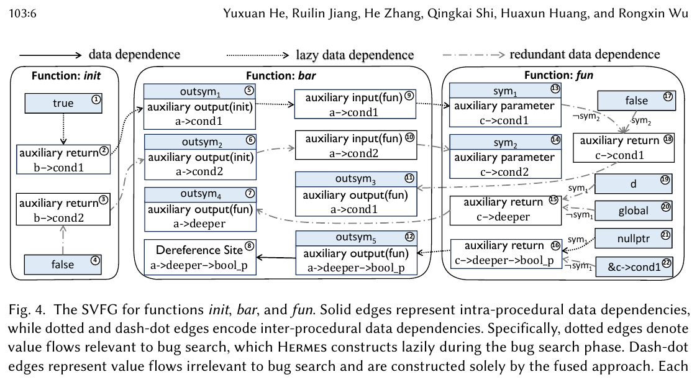
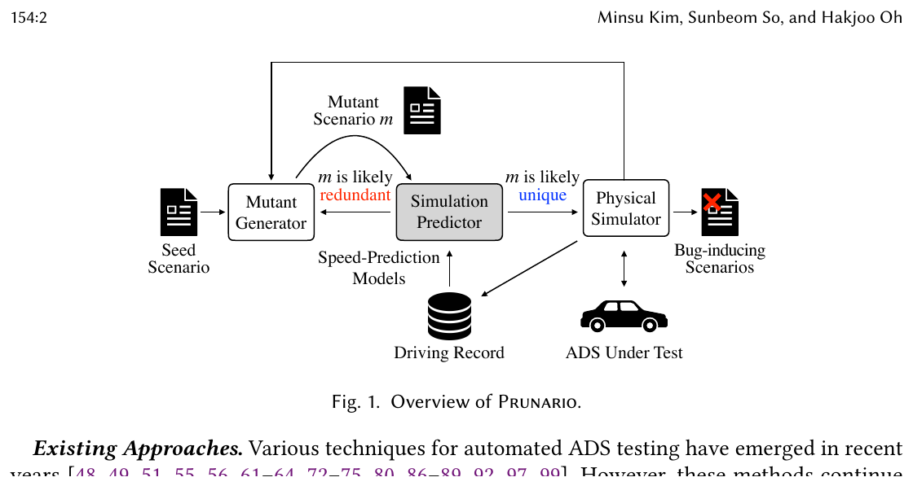
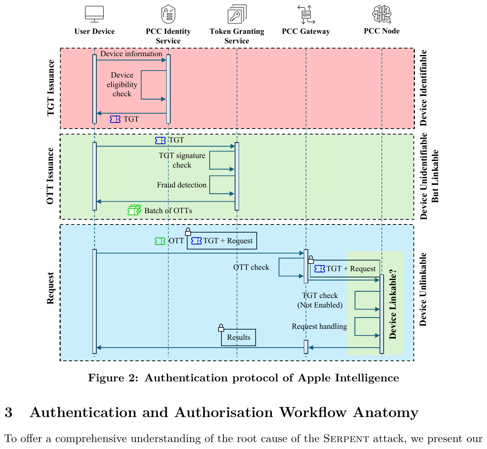
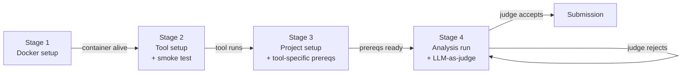
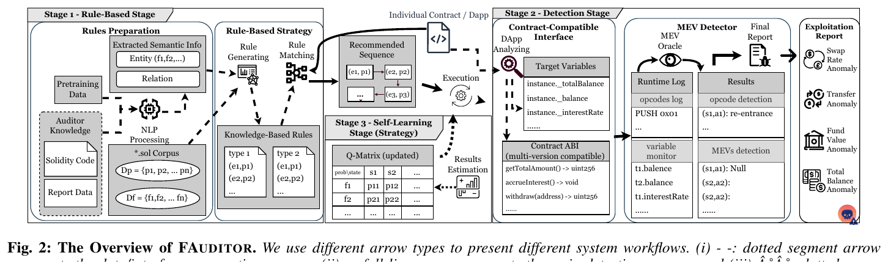

# Daily Scholar Papers Report — 2026-04-26

**[Download PDF](Daily_Papers_Report_2026-04-26.pdf)**

**Window covered:** 2026-04-13 → 2026-04-25.

---

## 0. Executive Summary

This window's haul is dominated by three currents. (1) LLM-agentic software analysis is consolidating from a "can it work?" question into a benchmarking question — Pradel's group ships *AnalysisBench*. (2) Path/program-analysis classics are being made scalable for modern workloads — *Hermes* (Wu et al.) tackles path-sensitive pointer analysis under sparse value-flow with a *Lazy Symbolic Expression Graph*, and *Prunario* (Oh et al.) tackles redundancy in AV scenario testing via lightweight simulation prediction. (3) A clean piece of systems security comes from Zhiqiang Lin's group: a token-replay break of Apple Intelligence with CVE assigned and bug-bounty awarded.

**Outstanding:** 4 · **Keep:** 3 · **Borderline High-Priority:** 1

---

## 1. Highlighted Papers

| # | Title | Authors | Venue | Link |
|---|------|---------|-------|------|
| 1 | Hermes: Making Path-Sensitive Pointer Analysis Scalable for Sparse Value-Flow Analysis | Y. He, R. Jiang, H. Zhang, Q. Shi, H. Huang, R. Wu | PACMPL OOPSLA1 2026 | [DOI](https://doi.org/10.1145/3798211) · [PDF](../../papers/Hermes_He_2026.pdf) |
| 2 | Prunario: Testing Autonomous Driving Systems by Pruning Likely Redundant Scenarios | M. Kim, S. So, H. Oh | PACMPL OOPSLA1 2026 | [DOI](https://doi.org/10.1145/3798262) · [PDF](../../papers/Prunario_Kim_2026.pdf) |
| 3 | Too Private to Tell: Practical Token Theft Attacks on Apple Intelligence | H. Zhou, S. Zhao, C. Wang, Z. Lin (OSU) | arXiv 2026 | [arXiv](https://arxiv.org/abs/2604.15637) · [PDF](../../papers/Serpent_Zhou_2026.pdf) |
| 4 | Evaluating LLM Agents on Automated Software Analysis Tasks (AnalysisBench) | I. Bouzenia, C. Cadar, M. Pradel | arXiv 2026 | [arXiv](https://arxiv.org/abs/2604.11270) |
| 5 | OS-SANITIZER: System-wide Latent Defect Inference in Linux Applications | A. Crump, S. Sihag, F. Bauckholt, K. Hassler, T. Holz | preprint 2026 | [Scholar lookup](https://scholar.google.com/scholar?q=OS-SANITIZER+latent+defect+inference+Linux+Holz) |
| 6 | Determining the Unreachable: Constraint-Guided Reachability Analysis for Dependency Vulnerabilities | W. Feng et al. | PACMPL 2026 | [Scholar lookup](https://scholar.google.com/scholar?q=Determining+the+Unreachable+Constraint-Guided+Reachability+Dependency+Vulnerabilities) |
| 7 | Fragile Deliveries: Inconsistencies in Android Parcel and Their Security Consequences | H. Chen, C. Wang et al. (Z. Lin) | preprint 2026 | [Scholar lookup](https://scholar.google.com/scholar?q=Fragile+Deliveries+Android+Parcel+Inconsistencies) |
| 8 | Denoising Fault Localization with Test Line Proximity | M. Smytzek, A. Zeller | preprint 2026 | [Scholar lookup](https://scholar.google.com/scholar?q=Denoising+Fault+Localization+Test+Line+Proximity+Zeller) |
| 9 | FAUDITOR: Capturing Monetarily Exploitable Vulnerability in Smart Contracts via Auditor Knowledge-Learning Fuzzing | B. Cai, W. Bai, H. Tang, Y. Lu, K. Lu | arXiv 2026 | [arXiv](https://arxiv.org/abs/2604.18395) · [PDF](../../papers/FAUDITOR_Cai_2026.pdf) |

---

## 2. Outstanding — Deep Read

<strong>2.1</strong> · static analysis · Path-Sensitive Pointer Analysis Made Scalable for SVFA — 9.84× speedup vs Falcon<a href="https://github.com/MarkLee131/paper-digest/issues/new?title=%5Bfeedback%5D+2026-04-26-2.1+Path-Sensitive+Pointer+Analysis+Made+Scalable+for+SVFA+%E2%80%94+9.84%C3%97+speedup+vs+Falcon+%F0%9F%91%8D&body=paper_id%3A+2026-04-26-2.1%0Atitle%3A+Path-Sensitive+Pointer+Analysis+Made+Scalable+for+SVFA+%E2%80%94+9.84%C3%97+speedup+vs+Falcon%0Aauthors%3A+Yuxuan+He%2C+Ruilin+Jiang%2C+He+Zhang%2C+Qingkai+Shi%2C+Huaxun+Huang%2C+Rongxin+Wu+%28Xiamen+University+%26+Nanjing+University%29%0Avenue%3A+PACMPL+OOPSLA1%2C+Article+103%2C+April+2026%0Atopic%3A+static+analysis%0Arating%3A+thumbs-up%0A%0A%3C%21--+Optional+notes+below+this+line+are+read+by+preferences.py+as+soft+signals.+--%3E%0A&labels=feedback%2Cthumbs-up" target="_blank" rel="noopener" class="fb-thumbs-up" title="thumbs up" onclick="event.stopPropagation()">👍</a><a href="https://github.com/MarkLee131/paper-digest/issues/new?title=%5Bfeedback%5D+2026-04-26-2.1+Path-Sensitive+Pointer+Analysis+Made+Scalable+for+SVFA+%E2%80%94+9.84%C3%97+speedup+vs+Falcon+%F0%9F%91%8E&body=paper_id%3A+2026-04-26-2.1%0Atitle%3A+Path-Sensitive+Pointer+Analysis+Made+Scalable+for+SVFA+%E2%80%94+9.84%C3%97+speedup+vs+Falcon%0Aauthors%3A+Yuxuan+He%2C+Ruilin+Jiang%2C+He+Zhang%2C+Qingkai+Shi%2C+Huaxun+Huang%2C+Rongxin+Wu+%28Xiamen+University+%26+Nanjing+University%29%0Avenue%3A+PACMPL+OOPSLA1%2C+Article+103%2C+April+2026%0Atopic%3A+static+analysis%0Arating%3A+thumbs-down%0A%0A%3C%21--+Optional+notes+below+this+line+are+read+by+preferences.py+as+soft+signals.+--%3E%0A&labels=feedback%2Cthumbs-down" target="_blank" rel="noopener" class="fb-thumbs-down" title="thumbs down" onclick="event.stopPropagation()">👎</a><a href="https://github.com/MarkLee131/paper-digest/issues/new?title=%5Bfeedback%5D+2026-04-26-2.1+Path-Sensitive+Pointer+Analysis+Made+Scalable+for+SVFA+%E2%80%94+9.84%C3%97+speedup+vs+Falcon+%F0%9F%94%96&body=paper_id%3A+2026-04-26-2.1%0Atitle%3A+Path-Sensitive+Pointer+Analysis+Made+Scalable+for+SVFA+%E2%80%94+9.84%C3%97+speedup+vs+Falcon%0Aauthors%3A+Yuxuan+He%2C+Ruilin+Jiang%2C+He+Zhang%2C+Qingkai+Shi%2C+Huaxun+Huang%2C+Rongxin+Wu+%28Xiamen+University+%26+Nanjing+University%29%0Avenue%3A+PACMPL+OOPSLA1%2C+Article+103%2C+April+2026%0Atopic%3A+static+analysis%0Arating%3A+save-for-later%0A%0A%3C%21--+Optional+notes+below+this+line+are+read+by+preferences.py+as+soft+signals.+--%3E%0A&labels=feedback%2Csave-for-later" target="_blank" rel="noopener" class="fb-save-for-later" title="save for later" onclick="event.stopPropagation()">🔖</a>

**Authors:** Yuxuan He, Ruilin Jiang, He Zhang, Qingkai Shi, Huaxun Huang, Rongxin Wu (Xiamen University & Nanjing University)
**Venue:** PACMPL OOPSLA1, Article 103, April 2026
**Links:** [DOI](https://doi.org/10.1145/3798211) · [PDF in this repo](../../papers/Hermes_He_2026.pdf)

#### Overview

Sparse Value-Flow Analysis (SVFA) is the substrate for many modern bug-finding tools (null deref, memory leaks, etc.). The bottleneck has long been *path-sensitive pointer analysis* underneath SVFA — Hermes opens with the concrete observation that Falcon, the prior state of the art, fails to complete pointer analysis on MariaDB even after running for over 12 hours. The cost stems both from pointer-analysis complexity and from the path-sensitivity requirement that practical SVFA-based bug detection imposes. Hermes blames the *summary-explosion problem* in the "fused" approach: pointer analyses copy callee side-effect memory layouts at every call site; layouts conflate, ramify, and inflate exponentially up the call chain.

The paper's two named insights are surgical:

- **Insight 1 (memory-layout discard).** Accurately modelling side effects only needs to identify *which memory objects are modified*, not the layouts those modifications point to. Discard the layouts; abstract the values stored in them by symbols created on demand. Each symbol carries an *access path* that lets the value flow be recovered later if needed. The resulting structure is the **Lazy Symbolic Expression Graph (LSEG)** — an *incomplete* SVFG.
- **Insight 2 (bug-relevance filter).** In bug search, only a small fraction of inter-procedural value flows actually matter — those on a source–sink path or those propagating its path conditions. Don't construct the rest. Hermes reuses the access-path structure to decide, without explicitly building a value flow, whether it is relevant to the current bug query.

#### Formal characterisation (verbatim from Definitions 3.1–3.3)

The paper's central formal object is the **Symbolic Expression Graph** \((\mathcal{N}, \mathcal{E}_d, \mathcal{E}_c, \mathcal{L}_d)\) — an instance of SVFG used by the fused approach.

- \(\mathcal{N}\) is the node set, partitioned into program-statement-defined nodes and *interface* nodes \(\mathcal{N}_{\text{param}}, \mathcal{N}_{in}, \mathcal{N}_{ret}, \mathcal{N}_{out}\).
- \(\mathcal{E}_d \subseteq \mathcal{N} \times \mathcal{N}\): data-dependence (value-flow) edges.
- \(\mathcal{E}_c \subseteq \mathcal{N} \times \mathcal{N}\): control-dependence edges, where \(n_1 \to n_2 \in \mathcal{E}_c\) means \(n_1\) is reachable iff \(n_2\) is satisfiable.
- \(\mathcal{L}_d\) maps each value-flow edge to the constraint \(\varphi\) under which the flow holds.

A **source–sink specification** is a triplet \(\tau = (\sigma_{\text{src}}, \sigma_{\text{sink}}, \delta_{\text{reach}})\). The first two are predicates over SEG nodes; the boolean \(\delta_{\text{reach}}\) selects between the *source-must-not-sink* bug class (true) and the *source-must-sink* bug class (false).

For a candidate path \(\pi = n_1 \rightsquigarrow n_k\) the **path condition** (Definition 3.3) is

$$
\Phi_\pi \;=\; \bigwedge_{i=1}^{k-1} \mathcal{L}_d(n_i \!\to\! n_{i+1}) \;\;\wedge\;\; \bigwedge_{i=1}^{k} \!\Bigl(\!\bigvee_{n_c \,\in\, \{n \mid n_i \to n \,\in\, \mathcal{E}_c\}} \! n_c \!\Bigr) \;\;\wedge\;\; \sigma_{\text{src}}(n_1) \;\wedge\; \sigma_{\text{sink}}(n_k).
$$

The static bug check then reduces to:

- If \(\delta_{\text{reach}} = \mathtt{true}\): a bug exists when there is some \(\pi\) with \(\mathrm{Sat}(\Phi_\pi)\).
- If \(\delta_{\text{reach}} = \mathtt{false}\): a bug exists when there is some source \(n_{\text{src}}\) with \(\neg\mathrm{Valid}(\bigvee_{n_{\text{sink}}} \Phi_{n_{\text{src}}\rightsquigarrow n_{\text{sink}}})\).

Definition 3.4 packages function-level summaries into three flavours: **Input Summary** (parameter ⇝ sink), **Output Summary** (source ⇝ auxiliary-return), **Transfer Summary** (parameter ⇝ auxiliary-return). LSEG inherits this vocabulary; the difference is that some summary edges remain unresolved until the bug-search algorithm asks for them.

#### Original figure (Hermes Fig. 4 — SVFG comparison)

<figure markdown>

<figcaption><em>Fig. 4 from Hermes (He et al., PACMPL 2026). © 2026 the authors, licensed under CC-BY 4.0. Excerpt reproduced with attribution. <a href="https://doi.org/10.1145/3798211">Original</a> · <a href="../../papers/Hermes_He_2026.pdf">PDF in this repo</a>.</em></figcaption>
</figure>

#### Workflow

1. Run the Shi-lab compositional, on-demand pointer analysis bottom-up over the call graph, but *do not* copy callee side-effect memory layouts. Replace would-be values in discarded layouts with symbols, each tagged by its access path.
2. Build the LSEG: nodes + intra- and inter-procedural value-flow edges + their guard constraints \(\mathcal{L}_d\). Some inter-procedural edges remain unresolved.
3. Run the summary-based bug-search algorithm (Algorithm 1) on the LSEG. When a query touches an interface node whose inter-procedural flow is unresolved, invoke `ResolveFlows` (Algorithm 2) to construct only the inter-procedural value flows needed for *this* query.
4. For each reachable source–sink path \(\pi\), assemble \(\Phi_\pi\) per Definition 3.3 and run an SMT check. Cache summaries (input / output / transfer) keyed by their access-path signatures.

#### Headline numbers (verbatim from the paper)

- **Pointer-analysis speedup:** at least **9.84× on average**, up to **87.76× max**, with the speedup growing with code size.
- **Bug-search speedup:** **4.79× on average**.
- **Overall bug-detection speedup:** **at least 6.80× on average**.
- **Bugs found:** 56 across 12 well-known open-source projects, **false-positive rate 16.07%**.
- **Recall:** Hermes captures every bug reported by Falcon (the prior SOTA SVFA framework).

#### What is genuinely valuable

The *recipe* — discard precision artefacts that current clients don't actually need (memory layouts), abstract them as symbols carrying enough metadata (access paths) for later recovery, and build a structure (LSEG) that supports lazy refinement during search. The pattern transfers cleanly to other "summary-explosion-prone" analyses: type-state, taint, and any flow-sensitive analysis with side-effect summaries.

#### Open questions

Cross-language transfer beyond C/C++; how the speedup curve continues to climb (or plateau) on codebases beyond MariaDB-scale; soundness interaction with aggressive LLVM-IR optimisation passes that re-shape memory layouts.

<strong>2.2</strong> · AV testing · Pruning likely-redundant scenarios via simulation prediction — 23 zero-day Autoware bugs<a href="https://github.com/MarkLee131/paper-digest/issues/new?title=%5Bfeedback%5D+2026-04-26-2.2+Pruning+likely-redundant+scenarios+via+simulation+prediction+%E2%80%94+23+zero-day+Autoware+bugs+%F0%9F%91%8D&body=paper_id%3A+2026-04-26-2.2%0Atitle%3A+Pruning+likely-redundant+scenarios+via+simulation+prediction+%E2%80%94+23+zero-day+Autoware+bugs%0Aauthors%3A+Minsu+Kim%2C+Sunbeom+So%2C+Hakjoo+Oh+%28Korea+University%29%0Avenue%3A+PACMPL+OOPSLA1%2C+Article+154%2C+April+2026%0Atopic%3A+AV+testing%0Arating%3A+thumbs-up%0A%0A%3C%21--+Optional+notes+below+this+line+are+read+by+preferences.py+as+soft+signals.+--%3E%0A&labels=feedback%2Cthumbs-up" target="_blank" rel="noopener" class="fb-thumbs-up" title="thumbs up" onclick="event.stopPropagation()">👍</a><a href="https://github.com/MarkLee131/paper-digest/issues/new?title=%5Bfeedback%5D+2026-04-26-2.2+Pruning+likely-redundant+scenarios+via+simulation+prediction+%E2%80%94+23+zero-day+Autoware+bugs+%F0%9F%91%8E&body=paper_id%3A+2026-04-26-2.2%0Atitle%3A+Pruning+likely-redundant+scenarios+via+simulation+prediction+%E2%80%94+23+zero-day+Autoware+bugs%0Aauthors%3A+Minsu+Kim%2C+Sunbeom+So%2C+Hakjoo+Oh+%28Korea+University%29%0Avenue%3A+PACMPL+OOPSLA1%2C+Article+154%2C+April+2026%0Atopic%3A+AV+testing%0Arating%3A+thumbs-down%0A%0A%3C%21--+Optional+notes+below+this+line+are+read+by+preferences.py+as+soft+signals.+--%3E%0A&labels=feedback%2Cthumbs-down" target="_blank" rel="noopener" class="fb-thumbs-down" title="thumbs down" onclick="event.stopPropagation()">👎</a><a href="https://github.com/MarkLee131/paper-digest/issues/new?title=%5Bfeedback%5D+2026-04-26-2.2+Pruning+likely-redundant+scenarios+via+simulation+prediction+%E2%80%94+23+zero-day+Autoware+bugs+%F0%9F%94%96&body=paper_id%3A+2026-04-26-2.2%0Atitle%3A+Pruning+likely-redundant+scenarios+via+simulation+prediction+%E2%80%94+23+zero-day+Autoware+bugs%0Aauthors%3A+Minsu+Kim%2C+Sunbeom+So%2C+Hakjoo+Oh+%28Korea+University%29%0Avenue%3A+PACMPL+OOPSLA1%2C+Article+154%2C+April+2026%0Atopic%3A+AV+testing%0Arating%3A+save-for-later%0A%0A%3C%21--+Optional+notes+below+this+line+are+read+by+preferences.py+as+soft+signals.+--%3E%0A&labels=feedback%2Csave-for-later" target="_blank" rel="noopener" class="fb-save-for-later" title="save for later" onclick="event.stopPropagation()">🔖</a>

**Authors:** Minsu Kim, Sunbeom So, Hakjoo Oh (Korea University)
**Venue:** PACMPL OOPSLA1, Article 154, April 2026
**Links:** [DOI](https://doi.org/10.1145/3798262) · [PDF in this repo](../../papers/Prunario_Kim_2026.pdf)

#### Overview

Scenario-based testing of autonomous-driving systems (ADS) has the budget-vs-coverage problem in its purest form. The paper documents the magnitude: **93% of scenarios produced by three recent tools — ScenarioFuzz, DriveFuzz, SAMOTA — are virtually identical to other tested scenarios.** Worse, simulation is real-time-synchronised; a single 10 km / 10 m/s test takes about 17 minutes. Prunario's answer is to *predict* the ADS runtime behaviour for a candidate mutant scenario without running the simulator, then prune mutants that look likely to retread already-explored driving records.

The key technical contribution is **simulation prediction**: a lightweight, learning-based estimator of the *driving record* (waypoint–speed sequence) of an ego/NPC vehicle for a candidate scenario, trained on prior simulation runs.

#### Formal characterisation (re-typeset from §3 of the paper)

A simulation outcome is encoded as \((s,(r,b))\) with scenario \(s\), traffic-violation type \(b\) (or \(\bot\) for none), and **driving record** \(r = (r_e, r_n)\) where \(r_e\) is the ego vehicle's frame-state sequence and \(r_n\) is the NPC's:

$$
r_e = (\mathrm{wp}_e^1, \mathrm{spd}_e^1) \cdots (\mathrm{wp}_e^{|r|}, \mathrm{spd}_e^{|r|}), \qquad
r_n = (\mathrm{wp}_n^1, \mathrm{spd}_n^1) \cdots (\mathrm{wp}_n^{|r|}, \mathrm{spd}_n^{|r|}).
$$

A **frame state** is a (waypoint, speed) pair; a frame is a single logical time step of duration \(1/\mathrm{fps}\).

Each frame state is abstracted into a **driving pattern** by a function \(\alpha\) (paper §3.1.1) using horizontal motion (`Hor`), vertical motion (`Vert`) and inter-vehicle interaction (`Inter`). The full record \(r\) maps to a *driving pattern sequence* \(\pi_r = \alpha(r,1)\!\cdots\!\alpha(r,|r|)\). Two scenarios are deemed redundant when their driving pattern sequences agree:

> **Redundant predicate (paper §3.1.1, line 581).** A scenario \(s\) (with simulation result \((r,b)\)) is *redundant* w.r.t. an execution log \(P\) iff there exists \((s',(r',b')) \in P\) with the same driving pattern sequence — i.e. \(\pi_r = \pi_{r'}\).

The output of the search is then defined directly via this predicate:

$$
V \;=\; \Bigl\{\, s \;\Big|\; (s,(r,b)) \in \arg\!\max_{P' \subseteq P} \bigl|F(P')\bigr| \,\Bigr\}, \qquad
F(P') \;=\; \bigl\{\, p \mid P' \ni p = (s,(r,b)),\; b \neq \bot,\; \neg\mathrm{Redundant}((r,b),\, P' \setminus \{p\}) \,\bigr\}.
$$

That is, Prunario returns the largest set of unique violation-triggering scenarios.

The **simulation predictor** itself is two off-the-shelf supervised regressors \(\mathcal{M}_e, \mathcal{M}_n\) (one per vehicle role), trained on prior runs. Given a mutant scenario \(s'\), the predictor iteratively builds a driving prediction \(\hat r\) by alternating speed prediction (`spd_{i+1} = M(v_i)` where `v_i` encodes the vehicle's status) with waypoint advancement along the planned route at distance \(d = \tfrac{\mathrm{spd}_i + \mathrm{spd}_{i+1}}{2} \cdot \tfrac{1}{\mathrm{fps}}\).

#### Original figure (Prunario Fig. 1 — system overview)

<figure markdown>

<figcaption><em>Fig. 1 from Prunario (Kim, So, Oh, PACMPL 2026). © 2026 the authors, licensed under CC-BY 4.0. Reproduced with attribution. <a href="https://doi.org/10.1145/3798262">Original</a> · <a href="../../papers/Prunario_Kim_2026.pdf">PDF in this repo</a>.</em></figcaption>
</figure>

#### Workflow (paper §3 / Algorithms 1–2)

1. Initialise execution log \(P = \varnothing\), workset \(W = \{(\mathrm{seed}, 0)\}\).
2. Repeat: pick the highest-`score` scenario \(s\) from \(W\); generate \(k\) mutants via random relocation or path-aligned shift on the ego/NPC waypoints.
3. For each mutant \(s'\): call **Predict** (Algorithm 2) to get \(\hat r\); if \(\hat r\) is *not* likely redundant, run the physical simulator to obtain the real \((r, b)\).
4. If \((r, b)\) passes the **Redundant** predicate (i.e. is unique) and \(b = \bot\), compute its risk score via **Feedback** and add \((s', \mathrm{score}')\) to \(W\). Always append \((s', (r, b))\) to \(P\).
5. Loop until \(W\) is empty or timeout. Return \(V\) = `ExtractV(P)` — the largest set of unique violation-triggering scenarios under the Redundant predicate.

#### Headline numbers (verbatim from the paper)

- Evaluated on **Autoware** (industrial-strength open-source ADS).
- **23 previously undetected bugs**, of which **20 confirmed by developers**.
- Outperforms **ScenarioFuzz, DriveFuzz, SAMOTA** as baselines.
- Documents that **93% of scenarios** produced by those three baselines are virtually identical to other tested scenarios, motivating the entire problem.

#### What is genuinely valuable

The framing — "*statically* predict the ADS runtime behaviour without executing the expensive physical simulator" — explicitly imports the static-program-analysis stance into ADS testing, with a calibrated way to verify the predictor (always validate non-pruned mutants by simulation). The pattern — *surrogate predictor + redundancy abstraction + verify-only-non-redundant* — generalises to any expensive-oracle search loop where structural similarity in input space implies functional similarity in output space.

#### Open questions

How much of the speedup is attributable to the redundancy abstraction \(\alpha\) vs the speed-prediction regressors; sensitivity of \(\alpha\) to scenarios outside the training distribution; whether the same approach scales to multi-NPC and vulnerable-road-user scenarios.

<strong>2.3</strong> · systems security · Cross-device token replay against Apple Intelligence — CVE assigned, bounty paid<a href="https://github.com/MarkLee131/paper-digest/issues/new?title=%5Bfeedback%5D+2026-04-26-2.3+Cross-device+token+replay+against+Apple+Intelligence+%E2%80%94+CVE+assigned%2C+bounty+paid+%F0%9F%91%8D&body=paper_id%3A+2026-04-26-2.3%0Atitle%3A+Cross-device+token+replay+against+Apple+Intelligence+%E2%80%94+CVE+assigned%2C+bounty+paid%0Aauthors%3A+Haoling+%28Henry%29+Zhou%2C+Shixuan+Zhao%2C+Chao+Wang%2C+Zhiqiang+Lin+%28The+Ohio+State+University%29%0Avenue%3A+%5BarXiv%3A2604.15637%5D%28https%3A%2F%2Farxiv.org%2Fabs%2F2604.15637%29+%28cs.CR%29%2C+2026-04-17.+CVE+assigned%2C+bug-bounty+awarded.%0Atopic%3A+systems+security%0Arating%3A+thumbs-up%0A%0A%3C%21--+Optional+notes+below+this+line+are+read+by+preferences.py+as+soft+signals.+--%3E%0A&labels=feedback%2Cthumbs-up" target="_blank" rel="noopener" class="fb-thumbs-up" title="thumbs up" onclick="event.stopPropagation()">👍</a><a href="https://github.com/MarkLee131/paper-digest/issues/new?title=%5Bfeedback%5D+2026-04-26-2.3+Cross-device+token+replay+against+Apple+Intelligence+%E2%80%94+CVE+assigned%2C+bounty+paid+%F0%9F%91%8E&body=paper_id%3A+2026-04-26-2.3%0Atitle%3A+Cross-device+token+replay+against+Apple+Intelligence+%E2%80%94+CVE+assigned%2C+bounty+paid%0Aauthors%3A+Haoling+%28Henry%29+Zhou%2C+Shixuan+Zhao%2C+Chao+Wang%2C+Zhiqiang+Lin+%28The+Ohio+State+University%29%0Avenue%3A+%5BarXiv%3A2604.15637%5D%28https%3A%2F%2Farxiv.org%2Fabs%2F2604.15637%29+%28cs.CR%29%2C+2026-04-17.+CVE+assigned%2C+bug-bounty+awarded.%0Atopic%3A+systems+security%0Arating%3A+thumbs-down%0A%0A%3C%21--+Optional+notes+below+this+line+are+read+by+preferences.py+as+soft+signals.+--%3E%0A&labels=feedback%2Cthumbs-down" target="_blank" rel="noopener" class="fb-thumbs-down" title="thumbs down" onclick="event.stopPropagation()">👎</a><a href="https://github.com/MarkLee131/paper-digest/issues/new?title=%5Bfeedback%5D+2026-04-26-2.3+Cross-device+token+replay+against+Apple+Intelligence+%E2%80%94+CVE+assigned%2C+bounty+paid+%F0%9F%94%96&body=paper_id%3A+2026-04-26-2.3%0Atitle%3A+Cross-device+token+replay+against+Apple+Intelligence+%E2%80%94+CVE+assigned%2C+bounty+paid%0Aauthors%3A+Haoling+%28Henry%29+Zhou%2C+Shixuan+Zhao%2C+Chao+Wang%2C+Zhiqiang+Lin+%28The+Ohio+State+University%29%0Avenue%3A+%5BarXiv%3A2604.15637%5D%28https%3A%2F%2Farxiv.org%2Fabs%2F2604.15637%29+%28cs.CR%29%2C+2026-04-17.+CVE+assigned%2C+bug-bounty+awarded.%0Atopic%3A+systems+security%0Arating%3A+save-for-later%0A%0A%3C%21--+Optional+notes+below+this+line+are+read+by+preferences.py+as+soft+signals.+--%3E%0A&labels=feedback%2Csave-for-later" target="_blank" rel="noopener" class="fb-save-for-later" title="save for later" onclick="event.stopPropagation()">🔖</a>

**Authors:** Haoling (Henry) Zhou, Shixuan Zhao, Chao Wang, Zhiqiang Lin (The Ohio State University)
**Venue:** [arXiv:2604.15637](https://arxiv.org/abs/2604.15637) (cs.CR), 2026-04-17. CVE assigned, bug-bounty awarded.
**PDF in this repo:** [Serpent_Zhou_2026.pdf](../../papers/Serpent_Zhou_2026.pdf)

#### Overview

Apple Intelligence is positioned as a privacy-preserving GenAI service, anchored in *Private Cloud Compute* (PCC). Authentication runs in two stages with Privacy Pass tokens (RFC 9578): the **PCC Identity Service** issues a long-lived, per-device **Token Granting Token (TGT)**, and the **Token Granting Service** redeems TGTs into batches of single-use **One-Time Tokens (OTTs)** that authenticate each request. All non-identity traffic is proxied through OHTTP relays so the back-end cannot link requests to a user or device.

The Serpent attack shows that this architecture conflates *anonymity* with *non-transferability*: Apple Intelligence access tokens are bearer tokens with *no cryptographic binding to the rightful device*, and there is **no way for a victim to revoke** a leaked token until the next scheduled refresh. The paper poses the question verbatim:

> *"Is it possible for an attacker to easily steal the tokens from a victim's Mac and use them on another Mac to disguise it as the victim?"*

The paper's answer is yes, demonstrated on **macOS 26 Tahoe**, with vendor confirmation (CVE assigned, bounty paid). Apple's documentation describes only that the Token Granting Service signs an unsigned token after verifying the TGT; **no device-bound material is required at validation time**.

#### Protocol & threat model (no LaTeX abstraction — the paper itself doesn't formalise verification, only protocol-level prose)

The relevant invariant Apple's documentation *suggests* is that an OTT validates only on requests originating from the Mac whose TGT issued it. The paper shows by direct experiment that this invariant does not hold: the Token Granting Service signs OTTs derived from any presented TGT, and the validator does not check device-specific material. Consequently:

- Stealing TGT material from a victim Mac (via traffic capture + reverse engineering of the on-device PCC client) and replaying it on an attacker Mac yields service access.
- All OTTs minted from the stolen TGT decrement the *victim's* quota.
- An attacker who has exhausted their own allowance can immediately regain service by importing the victim's TGT.

#### Original figure (Serpent Fig. 2 — Apple Intelligence authentication protocol)

<figure markdown>

<figcaption><em>Figure 2 from Zhou, Zhao, Wang & Lin, "Too Private to Tell" (arXiv:2604.15637, 2026). © 2026 the authors, licensed under CC-BY-NC-ND 4.0. Verbatim reproduction with attribution. <a href="https://arxiv.org/abs/2604.15637">arXiv</a> · <a href="../../papers/Serpent_Zhou_2026.pdf">PDF in this repo</a>.</em></figcaption>
</figure>

#### Workflow

1. Capture network traffic during normal Apple Intelligence interactions on a victim Mac.
2. Reverse-engineer the on-device TGT issuance and extract the token payload (RFC 9578 Privacy Pass, `issuer_name = tis.gateway.icloud.com`).
3. Cross-compare the observed protocol with Apple's published security documentation to localise the *non-transferability* gap.
4. Construct a replay client on a separate macOS 26 Tahoe device; import the captured TGT, redeem fresh OTTs.
5. Use OTTs to access Apple Intelligence; observe that the service grants access and that rate-limit charges accrue to the victim, even after the attacker has exhausted their own allowance.

#### Headline numbers (verbatim)

- First practical *cross-device* token replay attack against Apple Intelligence.
- Demonstrated on the latest **macOS 26 Tahoe**.
- Attack succeeds even after the attacker has used up its own request allowance.
- Vendor confirmation: **CVE assigned and bounty awarded** by Apple.

#### What is genuinely valuable

The *taxonomy distinction* between anonymisation and non-transferability is reusable as a checklist item in any security review of token-issuance flows. The methodology — *claim-vs-wire diff* — generalises to PCC, on-device LLM frameworks, and enterprise GenAI gateways.

#### Open questions

Whether the same gap exists on the iOS-side Apple Intelligence flow (the paper studies macOS 26 Tahoe). Whether Apple's mitigation rollout addresses cryptographic device-binding at TGT redemption, or only at OTT validation. Token-revocation latency under any mitigation.

#### Closing line

> *"Anonymising identity does not by itself make the AI service secure; enforcing non-transferability requires cryptographic binding to the rightful user."*

<strong>2.4</strong> · LLM agents · SE · AnalysisBench / AnalysisAgent — 94% manual-verified success on 35 tool-project pairs<a href="https://github.com/MarkLee131/paper-digest/issues/new?title=%5Bfeedback%5D+2026-04-26-2.4+AnalysisBench+%2F+AnalysisAgent+%E2%80%94+94%25+manual-verified+success+on+35+tool-project+pairs+%F0%9F%91%8D&body=paper_id%3A+2026-04-26-2.4%0Atitle%3A+AnalysisBench+%2F+AnalysisAgent+%E2%80%94+94%25+manual-verified+success+on+35+tool-project+pairs%0Aauthors%3A+Islem+Bouzenia%2C+Cristian+Cadar%2C+Michael+Pradel+%28CISPA+%C2%B7+Imperial+College+%C2%B7+CISPA%29%0Avenue%3A+%5BarXiv%3A2604.11270%5D%28https%3A%2F%2Farxiv.org%2Fabs%2F2604.11270%29+%28cs.SE%29%2C+v2+2026-04-17.%0Atopic%3A+LLM+agents+%C2%B7+SE%0Arating%3A+thumbs-up%0A%0A%3C%21--+Optional+notes+below+this+line+are+read+by+preferences.py+as+soft+signals.+--%3E%0A&labels=feedback%2Cthumbs-up" target="_blank" rel="noopener" class="fb-thumbs-up" title="thumbs up" onclick="event.stopPropagation()">👍</a><a href="https://github.com/MarkLee131/paper-digest/issues/new?title=%5Bfeedback%5D+2026-04-26-2.4+AnalysisBench+%2F+AnalysisAgent+%E2%80%94+94%25+manual-verified+success+on+35+tool-project+pairs+%F0%9F%91%8E&body=paper_id%3A+2026-04-26-2.4%0Atitle%3A+AnalysisBench+%2F+AnalysisAgent+%E2%80%94+94%25+manual-verified+success+on+35+tool-project+pairs%0Aauthors%3A+Islem+Bouzenia%2C+Cristian+Cadar%2C+Michael+Pradel+%28CISPA+%C2%B7+Imperial+College+%C2%B7+CISPA%29%0Avenue%3A+%5BarXiv%3A2604.11270%5D%28https%3A%2F%2Farxiv.org%2Fabs%2F2604.11270%29+%28cs.SE%29%2C+v2+2026-04-17.%0Atopic%3A+LLM+agents+%C2%B7+SE%0Arating%3A+thumbs-down%0A%0A%3C%21--+Optional+notes+below+this+line+are+read+by+preferences.py+as+soft+signals.+--%3E%0A&labels=feedback%2Cthumbs-down" target="_blank" rel="noopener" class="fb-thumbs-down" title="thumbs down" onclick="event.stopPropagation()">👎</a><a href="https://github.com/MarkLee131/paper-digest/issues/new?title=%5Bfeedback%5D+2026-04-26-2.4+AnalysisBench+%2F+AnalysisAgent+%E2%80%94+94%25+manual-verified+success+on+35+tool-project+pairs+%F0%9F%94%96&body=paper_id%3A+2026-04-26-2.4%0Atitle%3A+AnalysisBench+%2F+AnalysisAgent+%E2%80%94+94%25+manual-verified+success+on+35+tool-project+pairs%0Aauthors%3A+Islem+Bouzenia%2C+Cristian+Cadar%2C+Michael+Pradel+%28CISPA+%C2%B7+Imperial+College+%C2%B7+CISPA%29%0Avenue%3A+%5BarXiv%3A2604.11270%5D%28https%3A%2F%2Farxiv.org%2Fabs%2F2604.11270%29+%28cs.SE%29%2C+v2+2026-04-17.%0Atopic%3A+LLM+agents+%C2%B7+SE%0Arating%3A+save-for-later%0A%0A%3C%21--+Optional+notes+below+this+line+are+read+by+preferences.py+as+soft+signals.+--%3E%0A&labels=feedback%2Csave-for-later" target="_blank" rel="noopener" class="fb-save-for-later" title="save for later" onclick="event.stopPropagation()">🔖</a>

**Authors:** Islem Bouzenia, Cristian Cadar, Michael Pradel (CISPA · Imperial College · CISPA)
**Venue:** [arXiv:2604.11270](https://arxiv.org/abs/2604.11270) (cs.SE), v2 2026-04-17.

> *Note: the paper has no LaTeX-formal Definition or Theorem block — its "Task Definition" is in prose. We respect that and summarise the task without inventing pseudo-formal expressions.*

#### Overview

Decades of effort have produced a wide menu of static analysers, symbolic-execution engines, fuzzers, and profilers — but applying any of them to a fresh open-source project is notoriously difficult. The challenge is *tri-partite*: building a compatible execution environment for the analysis tool itself, preparing the target project (often with tool-specific prerequisites like LLVM bitcode), and validating that the analysis actually ran rather than producing trivial "success" signals like a `--help` exit status. AnalysisBench operationalises this end-to-end task; AnalysisAgent is their reference architecture. The paper's central empirical finding is that *agentic architecture* matters more than the underlying LLM — a 20-percentage-point gap survives even when the LLM backend is held fixed.

#### Task framing (paper §2.1, summarised)

A task is specified as a *(tool, project)* pair \((T, P)\) plus an execution interface (a writable workspace, a terminal, a budget of **5 hours and $2 USD per task**). The tool specification gives the tool name and acquisition method (upstream URL or release). The target project specification gives the repo URL and a pinned commit. A run is judged successful only when **all** of the following hold (paper's plain-English checklist, §2.1):

- The environment is reproducible.
- The tool is installed and runnable.
- The target project is built and prepared.
- The tool is invoked on project-relevant inputs (not toy examples).
- The outputs contain verifiable, project-specific analysis evidence — e.g. warnings referencing project paths, generated test cases, or call graphs.

The paper deliberately reports two estimators side-by-side: the agent's **self-validated** success (an LLM-as-judge) and **manually verified** success (human review). The systematic gap between them is itself a contribution.

#### Benchmark composition (paper Tables 1–2)

| Category | Items | Examples |
|---|---|---|
| Analysis tools (7) | fuzzing, symbolic execution, static analysis, structural analysis, profiling | AFL++, KLEE, CSA, cflow, Infer, WALA, SJK |
| C/C++ projects (5) | actively maintained codebases | curl, ImageMagick, fastfetch, masscan, radare2 |
| Java projects (5) | actively maintained codebases | Tika, Closure Compiler, Saxon-HE, JMH, Checkstyle |
| Total tasks | 35 manually constructed reference setups | — |

#### AnalysisAgent — three architectural principles (paper §3.3)

1. **Explicitly staged execution.** A four-stage linear progression with per-stage instructions and deterministic transitions:

2. **Single-action cycles with deterministic log condensation.** Each cycle: agent observes condensed stage context → emits one structured action → framework executes → next cycle. Weaker LLMs in particular struggle with multi-action plans; the cycle structure normalises action shape across backends.
3. **Evidence-based validation.** An LLM-as-judge compares tool output against a per-tool reference example synthesised from documentation. The paper reports that across all AnalysisAgent runs the judge accepted 131/140 submissions; only 111 were confirmed by manual verification — a **15% LLM-as-judge false-positive rate**, itself reported as evidence that self-validation overstates real success.

#### Workflow

1. Specify a task as \((T, P)\) plus tool URL + project repo URL + pinned commit.
2. Provision an isolated containerised workspace with the 5 h / $2 budget.
3. Run the agent through the four staged subtasks; framework gates stage transitions on observable conditions.
4. After Stage 4, the LLM-as-judge inspects the evidence package; if rejected, the agent receives a failure-mode message and continues until cycles are exhausted.
5. After agent termination, researchers re-execute the produced setup (Dockerfile + scripts) for reproducibility, then manually verify outputs against a reference evidence package built from the documentation.

#### Headline numbers (from the paper)

- **AnalysisAgent (Gemini-3-Flash):** 94% manual-verified success on 33 / 35 tasks.
- **ExecutionAgent baseline:** 77% (best baseline overall, averaged 57% across LLM backends).
- **AnalysisAgent average across backends:** 79%.
- **Agentic-architecture gap:** ~20 percentage points at fixed LLM capability.
- **LLM-judge false-positive rate:** 15% (131 accepted, 111 manually confirmed).
- **Java tasks account for 62% of all failures** across all agents.

#### What is genuinely valuable

Four named agent failure modes — **stage mixing**, **poor error localization**, **premature termination**, **self-validation overstatement** — that become a checklist for any future agentic-SE design. The dual-estimator reporting (LLM-self vs manually verified) is likely to become a community norm. The triadic-success decomposition itself is the reusable contribution.

#### Open questions

How the architecture-vs-capability finding evolves with stronger frontier models; how the benchmark generalises to OSS LLM backends; whether the same staged-execution principle survives at scale (hundreds of tools, thousands of projects).

---

## 3. Keep — Brief Deep Read

<strong>3.1</strong> · dynamic analysis · OS-SANITIZER — eBPF-based dynamic defect inference in Linux applications<a href="https://github.com/MarkLee131/paper-digest/issues/new?title=%5Bfeedback%5D+2026-04-26-3.1+OS-SANITIZER+%E2%80%94+eBPF-based+dynamic+defect+inference+in+Linux+applications+%F0%9F%91%8D&body=paper_id%3A+2026-04-26-3.1%0Atitle%3A+OS-SANITIZER+%E2%80%94+eBPF-based+dynamic+defect+inference+in+Linux+applications%0Aauthors%3A+A.+Crump%2C+S.+Sihag%2C+F.+Bauckholt%2C+K.+Hassler%2C+T.+Holz+%28CISPA+%C2%B7+MPI-SP%29%2C+preprint+2026.+%5BScholar+lookup%5D%28https%3A%2F%2Fscholar.google.com%2Fscholar%3Fq%3DOS-SANITIZER%2Blatent%2Bdefect%2Binference%2BLinux%2BHolz%29.+The+paper%0Avenue%3A+preprint%0Atopic%3A+dynamic+analysis%0Arating%3A+thumbs-up%0A%0A%3C%21--+Optional+notes+below+this+line+are+read+by+preferences.py+as+soft+signals.+--%3E%0A&labels=feedback%2Cthumbs-up" target="_blank" rel="noopener" class="fb-thumbs-up" title="thumbs up" onclick="event.stopPropagation()">👍</a><a href="https://github.com/MarkLee131/paper-digest/issues/new?title=%5Bfeedback%5D+2026-04-26-3.1+OS-SANITIZER+%E2%80%94+eBPF-based+dynamic+defect+inference+in+Linux+applications+%F0%9F%91%8E&body=paper_id%3A+2026-04-26-3.1%0Atitle%3A+OS-SANITIZER+%E2%80%94+eBPF-based+dynamic+defect+inference+in+Linux+applications%0Aauthors%3A+A.+Crump%2C+S.+Sihag%2C+F.+Bauckholt%2C+K.+Hassler%2C+T.+Holz+%28CISPA+%C2%B7+MPI-SP%29%2C+preprint+2026.+%5BScholar+lookup%5D%28https%3A%2F%2Fscholar.google.com%2Fscholar%3Fq%3DOS-SANITIZER%2Blatent%2Bdefect%2Binference%2BLinux%2BHolz%29.+The+paper%0Avenue%3A+preprint%0Atopic%3A+dynamic+analysis%0Arating%3A+thumbs-down%0A%0A%3C%21--+Optional+notes+below+this+line+are+read+by+preferences.py+as+soft+signals.+--%3E%0A&labels=feedback%2Cthumbs-down" target="_blank" rel="noopener" class="fb-thumbs-down" title="thumbs down" onclick="event.stopPropagation()">👎</a><a href="https://github.com/MarkLee131/paper-digest/issues/new?title=%5Bfeedback%5D+2026-04-26-3.1+OS-SANITIZER+%E2%80%94+eBPF-based+dynamic+defect+inference+in+Linux+applications+%F0%9F%94%96&body=paper_id%3A+2026-04-26-3.1%0Atitle%3A+OS-SANITIZER+%E2%80%94+eBPF-based+dynamic+defect+inference+in+Linux+applications%0Aauthors%3A+A.+Crump%2C+S.+Sihag%2C+F.+Bauckholt%2C+K.+Hassler%2C+T.+Holz+%28CISPA+%C2%B7+MPI-SP%29%2C+preprint+2026.+%5BScholar+lookup%5D%28https%3A%2F%2Fscholar.google.com%2Fscholar%3Fq%3DOS-SANITIZER%2Blatent%2Bdefect%2Binference%2BLinux%2BHolz%29.+The+paper%0Avenue%3A+preprint%0Atopic%3A+dynamic+analysis%0Arating%3A+save-for-later%0A%0A%3C%21--+Optional+notes+below+this+line+are+read+by+preferences.py+as+soft+signals.+--%3E%0A&labels=feedback%2Csave-for-later" target="_blank" rel="noopener" class="fb-save-for-later" title="save for later" onclick="event.stopPropagation()">🔖</a>

A. Crump, S. Sihag, F. Bauckholt, K. Hassler, T. Holz (CISPA · MPI-SP), preprint 2026. [Scholar lookup](https://scholar.google.com/scholar?q=OS-SANITIZER+latent+defect+inference+Linux+Holz). The paper coins **dynamic defect inference**: don't wait for a crash, look at *benign* runtime behaviour through eBPF and apply code-smell-style heuristics to flag latent defects that *might* fail in a different environment. eBPF is repurposed from its usual observability/networking role into a system-wide analysis substrate that watches user+kernel events live. The prototype uses heuristic eBPF programs targeting well-known defect classes; on widely-used Linux applications it identified **40+ issues, including severe vulnerabilities, some over a decade old and present on a majority of distributions**. Reusable pattern: *static-style code smells over dynamic traces* — port the static-analysis tradition of "smell catalogues" into runtime oracles, recovering precision that pure crash-based dynamic testing leaves on the table.

<strong>3.2</strong> · dependency CVE · Constraint-guided reachability filters unreachable CVE matches in dependencies<a href="https://github.com/MarkLee131/paper-digest/issues/new?title=%5Bfeedback%5D+2026-04-26-3.2+Constraint-guided+reachability+filters+unreachable+CVE+matches+in+dependencies+%F0%9F%91%8D&body=paper_id%3A+2026-04-26-3.2%0Atitle%3A+Constraint-guided+reachability+filters+unreachable+CVE+matches+in+dependencies%0Aauthors%3A+W.+Feng+et+al.%2C+PACMPL+2026.+%5BScholar+lookup%5D%28https%3A%2F%2Fscholar.google.com%2Fscholar%3Fq%3DDetermining%2Bthe%2BUnreachable%2BConstraint-Guided%2BReachability%2BDependency%2BVulnerabilities%29.+Tackles+the+SCA+%22false-positi%0Avenue%3A+preprint%0Atopic%3A+dependency+CVE%0Arating%3A+thumbs-up%0A%0A%3C%21--+Optional+notes+below+this+line+are+read+by+preferences.py+as+soft+signals.+--%3E%0A&labels=feedback%2Cthumbs-up" target="_blank" rel="noopener" class="fb-thumbs-up" title="thumbs up" onclick="event.stopPropagation()">👍</a><a href="https://github.com/MarkLee131/paper-digest/issues/new?title=%5Bfeedback%5D+2026-04-26-3.2+Constraint-guided+reachability+filters+unreachable+CVE+matches+in+dependencies+%F0%9F%91%8E&body=paper_id%3A+2026-04-26-3.2%0Atitle%3A+Constraint-guided+reachability+filters+unreachable+CVE+matches+in+dependencies%0Aauthors%3A+W.+Feng+et+al.%2C+PACMPL+2026.+%5BScholar+lookup%5D%28https%3A%2F%2Fscholar.google.com%2Fscholar%3Fq%3DDetermining%2Bthe%2BUnreachable%2BConstraint-Guided%2BReachability%2BDependency%2BVulnerabilities%29.+Tackles+the+SCA+%22false-positi%0Avenue%3A+preprint%0Atopic%3A+dependency+CVE%0Arating%3A+thumbs-down%0A%0A%3C%21--+Optional+notes+below+this+line+are+read+by+preferences.py+as+soft+signals.+--%3E%0A&labels=feedback%2Cthumbs-down" target="_blank" rel="noopener" class="fb-thumbs-down" title="thumbs down" onclick="event.stopPropagation()">👎</a><a href="https://github.com/MarkLee131/paper-digest/issues/new?title=%5Bfeedback%5D+2026-04-26-3.2+Constraint-guided+reachability+filters+unreachable+CVE+matches+in+dependencies+%F0%9F%94%96&body=paper_id%3A+2026-04-26-3.2%0Atitle%3A+Constraint-guided+reachability+filters+unreachable+CVE+matches+in+dependencies%0Aauthors%3A+W.+Feng+et+al.%2C+PACMPL+2026.+%5BScholar+lookup%5D%28https%3A%2F%2Fscholar.google.com%2Fscholar%3Fq%3DDetermining%2Bthe%2BUnreachable%2BConstraint-Guided%2BReachability%2BDependency%2BVulnerabilities%29.+Tackles+the+SCA+%22false-positi%0Avenue%3A+preprint%0Atopic%3A+dependency+CVE%0Arating%3A+save-for-later%0A%0A%3C%21--+Optional+notes+below+this+line+are+read+by+preferences.py+as+soft+signals.+--%3E%0A&labels=feedback%2Csave-for-later" target="_blank" rel="noopener" class="fb-save-for-later" title="save for later" onclick="event.stopPropagation()">🔖</a>

W. Feng et al., PACMPL 2026. [Scholar lookup](https://scholar.google.com/scholar?q=Determining+the+Unreachable+Constraint-Guided+Reachability+Dependency+Vulnerabilities). Tackles the SCA "false-positive-by-default" problem — most reported CVE matches in dependencies are *unreachable* from the application. Constraint-guided reachability filters them out. Reusable pattern: *negative reachability as triage* — certify unreachability rather than enumerate positives; this is the actual industrial workflow.

<strong>3.3</strong> · Android security · Differential serializer audit of Android Parcel IPC<a href="https://github.com/MarkLee131/paper-digest/issues/new?title=%5Bfeedback%5D+2026-04-26-3.3+Differential+serializer+audit+of+Android+Parcel+IPC+%F0%9F%91%8D&body=paper_id%3A+2026-04-26-3.3%0Atitle%3A+Differential+serializer+audit+of+Android+Parcel+IPC%0Aauthors%3A+H.+Chen%2C+C.+Wang+et+al.+%28Z.+Lin+co-author+lineage%29%2C+preprint+2026.+%5BScholar+lookup%5D%28https%3A%2F%2Fscholar.google.com%2Fscholar%3Fq%3DFragile%2BDeliveries%2BAndroid%2BParcel%2BInconsistencies%29.+Audits+Parcel-based+IPC+on+%0Avenue%3A+preprint%0Atopic%3A+Android+security%0Arating%3A+thumbs-up%0A%0A%3C%21--+Optional+notes+below+this+line+are+read+by+preferences.py+as+soft+signals.+--%3E%0A&labels=feedback%2Cthumbs-up" target="_blank" rel="noopener" class="fb-thumbs-up" title="thumbs up" onclick="event.stopPropagation()">👍</a><a href="https://github.com/MarkLee131/paper-digest/issues/new?title=%5Bfeedback%5D+2026-04-26-3.3+Differential+serializer+audit+of+Android+Parcel+IPC+%F0%9F%91%8E&body=paper_id%3A+2026-04-26-3.3%0Atitle%3A+Differential+serializer+audit+of+Android+Parcel+IPC%0Aauthors%3A+H.+Chen%2C+C.+Wang+et+al.+%28Z.+Lin+co-author+lineage%29%2C+preprint+2026.+%5BScholar+lookup%5D%28https%3A%2F%2Fscholar.google.com%2Fscholar%3Fq%3DFragile%2BDeliveries%2BAndroid%2BParcel%2BInconsistencies%29.+Audits+Parcel-based+IPC+on+%0Avenue%3A+preprint%0Atopic%3A+Android+security%0Arating%3A+thumbs-down%0A%0A%3C%21--+Optional+notes+below+this+line+are+read+by+preferences.py+as+soft+signals.+--%3E%0A&labels=feedback%2Cthumbs-down" target="_blank" rel="noopener" class="fb-thumbs-down" title="thumbs down" onclick="event.stopPropagation()">👎</a><a href="https://github.com/MarkLee131/paper-digest/issues/new?title=%5Bfeedback%5D+2026-04-26-3.3+Differential+serializer+audit+of+Android+Parcel+IPC+%F0%9F%94%96&body=paper_id%3A+2026-04-26-3.3%0Atitle%3A+Differential+serializer+audit+of+Android+Parcel+IPC%0Aauthors%3A+H.+Chen%2C+C.+Wang+et+al.+%28Z.+Lin+co-author+lineage%29%2C+preprint+2026.+%5BScholar+lookup%5D%28https%3A%2F%2Fscholar.google.com%2Fscholar%3Fq%3DFragile%2BDeliveries%2BAndroid%2BParcel%2BInconsistencies%29.+Audits+Parcel-based+IPC+on+%0Avenue%3A+preprint%0Atopic%3A+Android+security%0Arating%3A+save-for-later%0A%0A%3C%21--+Optional+notes+below+this+line+are+read+by+preferences.py+as+soft+signals.+--%3E%0A&labels=feedback%2Csave-for-later" target="_blank" rel="noopener" class="fb-save-for-later" title="save for later" onclick="event.stopPropagation()">🔖</a>

H. Chen, C. Wang et al. (Z. Lin co-author lineage), preprint 2026. [Scholar lookup](https://scholar.google.com/scholar?q=Fragile+Deliveries+Android+Parcel+Inconsistencies). Audits Parcel-based IPC on Android for serializer/deserializer asymmetries — the writing side and reading side diverge in interpretation, a classic source of confused-deputy and type-confusion bugs. Reusable pattern: *differential serializer audit*; same audit applies to JSON/Protobuf in cloud RPC, gRPC server/client mismatches, kernel ioctl marshallers.

<strong>3.4</strong> · fault localisation · Test-line proximity as a structural prior over noisy SBFL<a href="https://github.com/MarkLee131/paper-digest/issues/new?title=%5Bfeedback%5D+2026-04-26-3.4+Test-line+proximity+as+a+structural+prior+over+noisy+SBFL+%F0%9F%91%8D&body=paper_id%3A+2026-04-26-3.4%0Atitle%3A+Test-line+proximity+as+a+structural+prior+over+noisy+SBFL%0Aauthors%3A+M.+Smytzek%2C+A.+Zeller%2C+preprint+2026.+%5BScholar+lookup%5D%28https%3A%2F%2Fscholar.google.com%2Fscholar%3Fq%3DDenoising%2BFault%2BLocalization%2BTest%2BLine%2BProximity%2BZeller%29.+Statistical+fault+localisation+is+famously+noisy.+%0Avenue%3A+preprint%0Atopic%3A+fault+localisation%0Arating%3A+thumbs-up%0A%0A%3C%21--+Optional+notes+below+this+line+are+read+by+preferences.py+as+soft+signals.+--%3E%0A&labels=feedback%2Cthumbs-up" target="_blank" rel="noopener" class="fb-thumbs-up" title="thumbs up" onclick="event.stopPropagation()">👍</a><a href="https://github.com/MarkLee131/paper-digest/issues/new?title=%5Bfeedback%5D+2026-04-26-3.4+Test-line+proximity+as+a+structural+prior+over+noisy+SBFL+%F0%9F%91%8E&body=paper_id%3A+2026-04-26-3.4%0Atitle%3A+Test-line+proximity+as+a+structural+prior+over+noisy+SBFL%0Aauthors%3A+M.+Smytzek%2C+A.+Zeller%2C+preprint+2026.+%5BScholar+lookup%5D%28https%3A%2F%2Fscholar.google.com%2Fscholar%3Fq%3DDenoising%2BFault%2BLocalization%2BTest%2BLine%2BProximity%2BZeller%29.+Statistical+fault+localisation+is+famously+noisy.+%0Avenue%3A+preprint%0Atopic%3A+fault+localisation%0Arating%3A+thumbs-down%0A%0A%3C%21--+Optional+notes+below+this+line+are+read+by+preferences.py+as+soft+signals.+--%3E%0A&labels=feedback%2Cthumbs-down" target="_blank" rel="noopener" class="fb-thumbs-down" title="thumbs down" onclick="event.stopPropagation()">👎</a><a href="https://github.com/MarkLee131/paper-digest/issues/new?title=%5Bfeedback%5D+2026-04-26-3.4+Test-line+proximity+as+a+structural+prior+over+noisy+SBFL+%F0%9F%94%96&body=paper_id%3A+2026-04-26-3.4%0Atitle%3A+Test-line+proximity+as+a+structural+prior+over+noisy+SBFL%0Aauthors%3A+M.+Smytzek%2C+A.+Zeller%2C+preprint+2026.+%5BScholar+lookup%5D%28https%3A%2F%2Fscholar.google.com%2Fscholar%3Fq%3DDenoising%2BFault%2BLocalization%2BTest%2BLine%2BProximity%2BZeller%29.+Statistical+fault+localisation+is+famously+noisy.+%0Avenue%3A+preprint%0Atopic%3A+fault+localisation%0Arating%3A+save-for-later%0A%0A%3C%21--+Optional+notes+below+this+line+are+read+by+preferences.py+as+soft+signals.+--%3E%0A&labels=feedback%2Csave-for-later" target="_blank" rel="noopener" class="fb-save-for-later" title="save for later" onclick="event.stopPropagation()">🔖</a>

M. Smytzek, A. Zeller, preprint 2026. [Scholar lookup](https://scholar.google.com/scholar?q=Denoising+Fault+Localization+Test+Line+Proximity+Zeller). Statistical fault localisation is famously noisy. Use a structural prior — graph distance between failing tests and source lines — to denoise standard SBFL formulae. Reusable pattern: *structural prior × statistical estimator*; multiply rather than replace.

---

## 4. Borderline High-Priority

<strong>4.1</strong> · smart contracts · FAUDITOR — auditor-knowledge-learning fuzzing, 4 MEVul paradigms, 220 zero-days<a href="https://github.com/MarkLee131/paper-digest/issues/new?title=%5Bfeedback%5D+2026-04-26-4.1+FAUDITOR+%E2%80%94+auditor-knowledge-learning+fuzzing%2C+4+MEVul+paradigms%2C+220+zero-days+%F0%9F%91%8D&body=paper_id%3A+2026-04-26-4.1%0Atitle%3A+FAUDITOR+%E2%80%94+auditor-knowledge-learning+fuzzing%2C+4+MEVul+paradigms%2C+220+zero-days%0Aauthors%3A+Bowen+Cai%2C+Weiheng+Bai%2C+Hangyun+Tang%2C+Youshui+Lu%2C+Kangjie+Lu+%28Univ.+of+Minnesota+%2F+Fudan+%2F+XJTU%29.+%5BarXiv%3A2604.18395%5D%28https%3A%2F%2Farxiv.org%2Fabs%2F2604.18395%29+%C2%B7+%5BPDF+in+this+repo%5D%28..%2F..%2Fpapers%2FFAUDITOR_Cai_20%0Avenue%3A+preprint%0Atopic%3A+smart+contracts%0Arating%3A+thumbs-up%0A%0A%3C%21--+Optional+notes+below+this+line+are+read+by+preferences.py+as+soft+signals.+--%3E%0A&labels=feedback%2Cthumbs-up" target="_blank" rel="noopener" class="fb-thumbs-up" title="thumbs up" onclick="event.stopPropagation()">👍</a><a href="https://github.com/MarkLee131/paper-digest/issues/new?title=%5Bfeedback%5D+2026-04-26-4.1+FAUDITOR+%E2%80%94+auditor-knowledge-learning+fuzzing%2C+4+MEVul+paradigms%2C+220+zero-days+%F0%9F%91%8E&body=paper_id%3A+2026-04-26-4.1%0Atitle%3A+FAUDITOR+%E2%80%94+auditor-knowledge-learning+fuzzing%2C+4+MEVul+paradigms%2C+220+zero-days%0Aauthors%3A+Bowen+Cai%2C+Weiheng+Bai%2C+Hangyun+Tang%2C+Youshui+Lu%2C+Kangjie+Lu+%28Univ.+of+Minnesota+%2F+Fudan+%2F+XJTU%29.+%5BarXiv%3A2604.18395%5D%28https%3A%2F%2Farxiv.org%2Fabs%2F2604.18395%29+%C2%B7+%5BPDF+in+this+repo%5D%28..%2F..%2Fpapers%2FFAUDITOR_Cai_20%0Avenue%3A+preprint%0Atopic%3A+smart+contracts%0Arating%3A+thumbs-down%0A%0A%3C%21--+Optional+notes+below+this+line+are+read+by+preferences.py+as+soft+signals.+--%3E%0A&labels=feedback%2Cthumbs-down" target="_blank" rel="noopener" class="fb-thumbs-down" title="thumbs down" onclick="event.stopPropagation()">👎</a><a href="https://github.com/MarkLee131/paper-digest/issues/new?title=%5Bfeedback%5D+2026-04-26-4.1+FAUDITOR+%E2%80%94+auditor-knowledge-learning+fuzzing%2C+4+MEVul+paradigms%2C+220+zero-days+%F0%9F%94%96&body=paper_id%3A+2026-04-26-4.1%0Atitle%3A+FAUDITOR+%E2%80%94+auditor-knowledge-learning+fuzzing%2C+4+MEVul+paradigms%2C+220+zero-days%0Aauthors%3A+Bowen+Cai%2C+Weiheng+Bai%2C+Hangyun+Tang%2C+Youshui+Lu%2C+Kangjie+Lu+%28Univ.+of+Minnesota+%2F+Fudan+%2F+XJTU%29.+%5BarXiv%3A2604.18395%5D%28https%3A%2F%2Farxiv.org%2Fabs%2F2604.18395%29+%C2%B7+%5BPDF+in+this+repo%5D%28..%2F..%2Fpapers%2FFAUDITOR_Cai_20%0Avenue%3A+preprint%0Atopic%3A+smart+contracts%0Arating%3A+save-for-later%0A%0A%3C%21--+Optional+notes+below+this+line+are+read+by+preferences.py+as+soft+signals.+--%3E%0A&labels=feedback%2Csave-for-later" target="_blank" rel="noopener" class="fb-save-for-later" title="save for later" onclick="event.stopPropagation()">🔖</a>

Bowen Cai, Weiheng Bai, Hangyun Tang, Youshui Lu, Kangjie Lu (Univ. of Minnesota / Fudan / XJTU). [arXiv:2604.18395](https://arxiv.org/abs/2604.18395) · [PDF in this repo](../../papers/FAUDITOR_Cai_2026.pdf). FAUDITOR formalises *Monetarily Exploitable Vulnerabilities* (MEVuls) into **four security paradigms** with first-order propositions, which is rare in smart-contract fuzzing papers and makes the contribution genuinely citable.

**Four MEVul paradigms (verbatim from the paper, Definitions §IV.B):**

- **Transfer Arrival (Proposition 1).** For a transaction \(B_i \xrightarrow{f(a_{from}, a_{to}, k, v)} B_{i+1}\) with \(f \in \mathcal{F}_p\) and \(a_{from}, a_{to} \in \mathcal{A}_n\):
$$B_i(a_{from}, k) - B_{i+1}(a_{from}, k) = B_{i+1}(a_{to}, k) - B_i(a_{to}, k) = v$$
and for every malicious account \(a_m \in \mathcal{A}_m\), \(B_i(a_m, k) = B_{i+1}(a_m, k)\).
- **Total Balance Conservation (Proposition 2).** For \(B_i \xrightarrow{f} B_{i+1}\) with \(f \in \mathcal{F}_p\) and token-prices \(p_i(k)\):
$$\sum_{a \in \mathcal{A}_n,\, k \in \mathcal{K}} B_i(a, k)\, p_i(k) \;=\; \sum_{a \in \mathcal{A}_n,\, k \in \mathcal{K}} B_{i+1}(a, k)\, p_i(k).$$
- **Swap Rate Stability** — token swap-rate \(e: \mathcal{K} \times \mathcal{K} \to \mathbb{R}^*\) cannot be manipulated within a transaction.
- **Fund Value Stability (Proposition 4).** For a fluctuation coefficient \(\lambda \in [0,1]\) and on-chain initial price \(p_{obs}(k)\), with \(v_0 = \sum B_0(a,k)\, p_{obs}(k)\) and \(v_i = \sum B_i(a,k)\, p_i(k)\):
$$v_0(1 - \lambda) \;\leq\; v_i \;\leq\; v_0(1 + \lambda).$$

**Original figure (FAUDITOR Fig. 2 — system overview):**

<figure markdown>

<figcaption><em>Fig. 2 from Cai, Bai, Tang, Lu & Lu, "FAUDITOR" (arXiv:2604.18395, 2026). © 2026 the authors, licensed under CC-BY 4.0. Reproduced with attribution. <a href="https://arxiv.org/abs/2604.18395">arXiv</a> · <a href="../../papers/FAUDITOR_Cai_2026.pdf">PDF in this repo</a>.</em></figcaption>
</figure>

**Self-learning is a Markov process:** state \(S = \{(t, e, L, m)\}\) over transactions, swap-rates, balance log, and remaining moves; reward \(R(s_i, s_{i+1})\) tracks oracle violations; the Q-function picks the next function call greedily w.r.t. expected violation gain.

**Headline numbers (from paper):**

- **220 zero-day MEVuls** discovered in the wild.
- **35% higher detection rate** than the strongest AI-driven baseline (ILF) on individual contracts.
- Faster vulnerability discovery and better instruction coverage than Echidna and other representative fuzzers.

**Reusable pattern:** *practitioner-knowledge mining* — where human experts have produced systematic write-ups (audits, advisories, postmortems), use them as labelled supervision for a search-based tool.

---

## 5. Cross-Paper Synthesis

### 5.1 Two converging threads

1. **Static analysis doubles down on precision–scalability composition.** Hermes (Wu et al.) on path-sensitive SVFA and *Determining the Unreachable* on dependency reachability are both *composition* papers — the contribution isn't a new analysis, it's making two existing dimensions cohabit at scale. Hermes formalises this through the LSEG: an explicitly *incomplete* SVFG that lazily fills in only what bug-search needs.

2. **Security research rewards *claim-vs-wire diff*.** Lin's *Serpent* on Apple Intelligence and *Fragile Deliveries* on Android Parcel apply the same methodological move at different layers: read the vendor's documented contract, model what enforcement would look like, find where the wire diverges. Highly portable to PCC, on-device LLMs, and confidential-computing services.

A third thread — agentic SE moving from existence proofs to architecture science — is represented by AnalysisBench's empirical structure (4 architectures × 4 backends × 35 tasks) and especially by its *dual-estimator reporting*: LLM-as-judge vs human ground truth, with a documented 15% gap.

### 5.2 Reusable research patterns

| Pattern | Donor paper(s) | Applicable to |
|---------|----------------|---------------|
| **Discard-and-symbolise / annotate-and-defer** (drop expensive precision artefacts; carry just enough metadata for lazy recovery) | Hermes | Type-state, taint, any flow-sensitive analysis with side-effect summaries. |
| **Surrogate-then-prune** (cheap predictor of expensive oracle output) | Prunario | Compiler fuzzing, kernel fuzzing seed selection, warning triage. |
| **Claim-vs-wire diff** | Serpent, Fragile Deliveries | PCC, on-device LLMs, enterprise GenAI gateways. |
| **Decompose agent success** (sub-signals: install / build / run / output) | AnalysisBench | Harness-synthesis fuzzing, repo migration agents, exploit-generation agents. |
| **Negative reachability as triage** | Determining the Unreachable | SCA pipelines, alert deduplication. |
| **Practitioner-knowledge mining** (mine audits/advisories as labels) | FAUDITOR | Fuzzing seeds, warning prioritisation, vuln-class prediction. |
| **Structural prior × statistical estimator** | Denoising FL | LLM ranking denoising, FP triage. |
| **Differential serializer audit** | Fragile Deliveries | RPC, kernel ioctl, IPC frameworks. |
| **Static-style smells over dynamic traces** | OS-SANITIZER | Any runtime monitor where you want pre-failure suspicion, not post-mortem. |

### 5.3 Trend signals

- **PACMPL is absorbing what used to be ICSE/FSE program-analysis papers.** Two of our top four are PACMPL; the third, *Determining the Unreachable*, also runs in PACMPL.
- **CVE-count headlines are becoming a load-bearing claim** (FAUDITOR 220 zero-days). Future work should report *unique-class* counts.
- **Vendor confirmation as quality signal.** Serpent's CVE-and-bounty closes the credibility gap that pure-academic security papers historically fight.
- **Internal LLM-judge has a measurable FP rate.** AnalysisBench reports 15%; this is now a number to beat.

---

## 6. Writing & Rationale Insights

1. **Name your artifacts and your bug class.** *Hermes/LSEG*, *Prunario/Redundant predicate*, *Serpent/cross-device token replay*, *AnalysisBench/AnalysisAgent*, *FAUDITOR/MEVul paradigms* (Transfer Arrival, Total Balance Conservation, Swap Rate Stability, Fund Value Stability). Nameable concepts compound citations.
2. **Open with a contrast-define paragraph.** Pradel et al. *contrast against* SWE-bench-style issue solving and against generic env-setup. Hermes opens with the *specific* failure mode of Falcon on MariaDB. Prunario opens with the *93% redundancy rate* of three baselines. Concrete openings beat generic motivation.
3. **Report dual metrics when self-evaluation is in play.** AnalysisBench's LLM-self vs manually-verified gap is itself a contribution.
4. **Pose the research question verbatim** when it cleanly captures the threat model — Serpent's "Is it possible to easily steal the tokens from a victim's Mac and use them on another Mac…" is one paragraph readers carry around.
5. **Solution-space reduction is the contribution.** Hermes doesn't make SAT faster; it discards precision artefacts SVFA didn't need. Prunario doesn't accelerate the simulator; it *avoids* it.
6. **Formal definitions earn extended treatment.** FAUDITOR's four propositions and Hermes's path-condition formula turn otherwise generic engineering papers into citable reference points.

