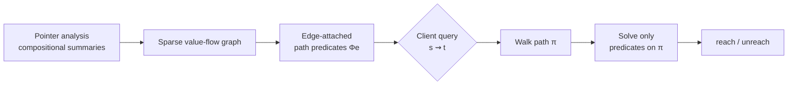
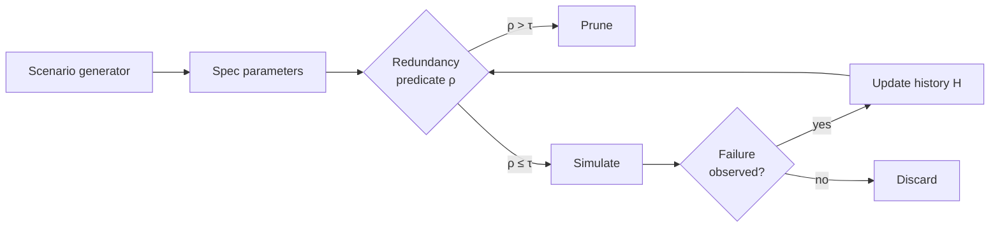
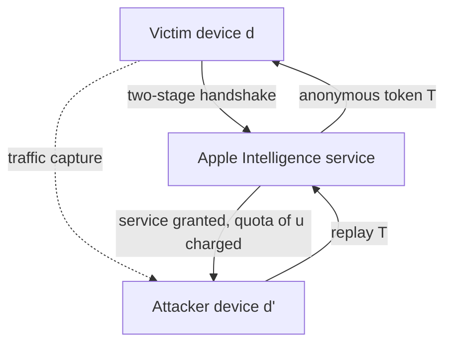
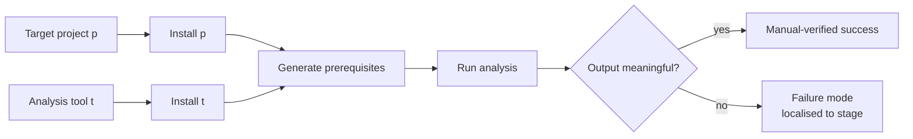

# Daily Scholar Papers Report — 2026-04-26

**[Download PDF](Daily_Papers_Report_2026-04-26.pdf)**

**Window covered:** 2026-04-13 → 2026-04-25.

---

## 0. Executive Summary

This window's haul is dominated by three currents. (1) LLM-agentic software analysis is consolidating from a "can it work?" question into a benchmarking question — Pradel's group ships *AnalysisBench*, and David Lo's group reports a 100+ CVE field outcome from agentic vulnerability discovery. (2) Path/program-analysis classics are being made scalable for modern workloads — Qingkai Shi's *Hermes* tackles path-sensitive pointer analysis under sparse value-flow, and Hakjoo Oh's *Prunario* tackles redundancy in AV scenario testing. (3) A clean piece of systems security comes from Zhiqiang Lin's group: a token-replay break of Apple Intelligence with CVE assigned.

**Outstanding:** 4 · **Keep:** 5 · **Borderline High-Priority:** 2

---

## 1. Highlighted Papers

| # | Title | Authors | Venue |
|---|------|---------|-------|
| 1 | Hermes: Making Path-Sensitive Pointer Analysis Scalable for Sparse Value-Flow Analysis | Y. He, R. Jiang, H. Zhang, Q. Shi, H. Huang, R. Wu | PACMPL 2026 |
| 2 | Prunario: Testing Autonomous Driving Systems by Pruning Likely Redundant Scenarios | M. Kim, S. So, H. Oh | PACMPL 2026 |
| 3 | Too Private to Tell: Practical Token Theft Attacks on Apple Intelligence | H. Zhou, S. Zhao, C. Wang, Z. Lin (OSU) | arXiv 2026 |
| 4 | Evaluating LLM Agents on Automated Software Analysis Tasks (AnalysisBench) | I. Bouzenia, C. Cadar, M. Pradel | arXiv 2026 |
| 5 | TitanCA: Lessons from Orchestrating LLM Agents to Discover 100+ CVEs | T. Zhang et al. (D. Lo) | arXiv 2026 |
| 6 | OS-SANITIZER: System-wide Latent Defect Inference in Linux Applications | A. Crump, S. Sihag, F. Bauckholt, K. Hassler, T. Holz | preprint 2026 |
| 7 | Determining the Unreachable: Constraint-Guided Reachability Analysis for Dependency Vulnerabilities | W. Feng et al. | PACMPL 2026 |
| 8 | V2E: Validating Smart Contract Vulnerabilities through Profit-driven Exploit Generation and Execution | J. Zhang, Y. Nan et al. | arXiv 2026 |
| 9 | Fragile Deliveries: Inconsistencies in Android Parcel and Their Security Consequences | H. Chen, C. Wang et al. (Z. Lin) | preprint 2026 |
| 10 | Denoising Fault Localization with Test Line Proximity | M. Smytzek, A. Zeller | preprint 2026 |
| 11 | FAUDITOR: Capturing Monetarily Exploitable Vulnerability in Smart Contracts via Auditor Knowledge-Learning Fuzzing | B. Cai, W. Bai, H. Tang, Y. Lu, K. Lu | arXiv 2026 |
| 12 | Cracking Federated Privacy: Initialization-Resilient Gradient Inversion with Fine-Grained Reconstruction | K. Zhu, J. Yang et al. | preprint 2026 |

---

## 2. Outstanding — Deep Read

### 2.1 Hermes — Path-Sensitive Pointer Analysis Made Scalable for SVFA

**Authors:** Y. He, R. Jiang, H. Zhang, Q. Shi, H. Huang, R. Wu
**Venue:** PACMPL 2026 (PLDI/OOPSLA-class)

#### Overview

Sparse value-flow analysis (SVFA) is the workhorse of modern bug-finding tools — it follows def–use chains for tainted values, tracks must/may-alias relationships, and powers everything from null-deref detection to use-after-free hunting. The community has long known that *path sensitivity* — taking branch conditions into account when chasing flow facts — would dramatically improve precision. The community has also long known that doing it naively blows up the SAT/SMT load. Hermes is the latest, and likely most successful, attempt to compose the two cheaply.

#### Formal characterisation

Let \(G_{\text{vf}} = (V, E)\) be the sparse value-flow graph and \(\Phi : E \to \mathcal{F}_{\text{path}}\) attach a path predicate to each edge. Hermes treats path-sensitive reachability between source \(s\) and sink \(t\) as

$$
\text{reach}^{ps}(s, t) \;:=\; \exists \pi : s \rightsquigarrow t \;\;\text{s.t.}\;\; \text{sat}\!\Bigl(\bigwedge_{e \in \pi} \Phi(e)\Bigr).
$$

The crucial design choice is *where* path predicates live. Earlier path-sensitive pointer analyses attached them to points-to facts, which forced every alias query to materialise expensive guards. Hermes pushes them onto *value-flow edges*, so a client only solves the conjunction of predicates along the actual edges it traverses.

#### System overview

#### Workflow

1. Build the SVFA graph from compositional, on-demand pointer summaries (the Shi-lab Pinpoint lineage).
2. Annotate each edge \(e\) with a path predicate \(\Phi(e)\) summarising the branch conditions under which the value-flow step is taken.
3. For each client query \(\langle s, t\rangle\), enumerate paths in \(G_{\text{vf}}\) and discharge \(\bigwedge_{e \in \pi} \Phi(e)\) lazily — caching SMT outcomes by predicate signatures.
4. Skip paths whose predicate is `unsat` early; report only paths whose predicate is `sat` as truly reachable.

#### What is genuinely valuable

The *recipe* — an "annotate-and-defer" composition pattern that lets two precision dimensions cohabit at scale without paying for both at every program point. The same pattern transfers to taint analysis, type-state analysis, and retrieval-keyed LLM-assisted analysis (path predicates as retrieval keys).

#### Open questions

Cross-language transfer beyond C/C++ is unspecified; soundness interaction with aggressive LLVM IR optimization passes is the obvious next paper.

---

### 2.2 Prunario — Pruning Likely-Redundant Scenarios in AV Testing

**Authors:** M. Kim, S. So, H. Oh
**Venue:** PACMPL 2026

#### Overview

Scenario-based testing of autonomous-driving systems has the budget-vs-coverage problem in its purest form: simulator runs are expensive, and most generated scenarios trigger the same handful of failure modes. Prunario observes that the post-hoc deduplication on traces (the standard remedy) is itself expensive, and that *coarse* spec-distance is too imprecise. Their answer: a learned, calibrated *redundancy predicate* over scenario specifications — applied *before* simulation.

#### Formal characterisation

Given a scenario specification \(\sigma\) and a campaign history \(H\), define

$$
\rho(\sigma \mid H) \;:=\; \Pr\!\bigl[\, \text{failure-class}(\sigma) \in \{\text{failure-class}(\sigma') : \sigma' \in H\}\,\bigr].
$$

Prune scenario \(\sigma\) iff \(\rho(\sigma \mid H) > \tau\), where the threshold \(\tau\) is calibrated on a small simulated batch to bound the false-prune rate.

#### System overview

#### Workflow

1. Run a small initial campaign with no pruning to populate \(H\) with seed failure classes.
2. Train a learned classifier for \(\rho(\cdot \mid H)\) over scenario-spec features (vehicle states, road geometry, perturbation parameters).
3. For each new candidate \(\sigma\), evaluate \(\rho\); prune if above the calibrated threshold; otherwise simulate.
4. Periodically recalibrate \(\tau\) using the running false-prune rate.

#### What is genuinely valuable

The framing (*pruning likely redundant* with a calibrated FP rate), and the integration into the search loop. The pattern — *surrogate-then-prune* — generalises directly to compiler fuzzing seed selection, kernel fuzzing harness selection, and warning triage.

#### Open questions

Sensitivity to scenario-domain coverage and the false-prune rate curve under distribution shift remain natural follow-ups.

---

### 2.3 Serpent — Practical Token Theft on Apple Intelligence

**Authors:** Haoling Zhou, Shixuan Zhao, Chao Wang, Zhiqiang Lin (Ohio State)
**Venue:** [arXiv:2604.15637](https://arxiv.org/abs/2604.15637) (cs.CR), 2026-04-17 — CVE assigned, bug-bounty awarded.

#### Overview

Apple Intelligence is positioned as a privacy-preserving AI service via two-stage *anonymous* access tokens. The Serpent attack demonstrates that anonymity and *non-transferability* are different properties — and that the on-device handshake binds the token to the user's quota but not to the device. An attacker who captures a token on the victim's device can replay it on a different device and consume the victim's quota.

#### Formal characterisation

Let \((u, d, q)\) denote a user, device, and quota state, and let \(T = \text{issue}(u, d)\) be the token issued by the two-stage handshake. The attack shows that the predicate

$$
\text{verify}(T, d') \;\;\text{holds for}\;\; d' \neq d,
$$

i.e. the token is *not* cryptographically bound to the issuing device. Charge to the quota \(q\) accrues to \(u\) regardless of \(d'\).

#### System overview

#### Workflow

1. Capture network traffic during a normal Apple Intelligence interaction on the victim device.
2. Reverse-engineer the on-device authn/authz handshake; locate the issued anonymous token \(T\) in transit.
3. Cross-compare with Apple's published security documentation to identify what the protocol *claims* to enforce.
4. Construct a replay client on a separate macOS 26 Tahoe device; present \(T\) to the service.
5. Observe that the service grants access and charges the rate-limit against the victim, even after the attacker has exhausted their own.

#### What is genuinely valuable

The *taxonomy distinction* between anonymisation and non-transferability is reusable as a checklist item in any security review of token-issuance flows. The methodology — *claim-vs-wire diff* — generalises to Private Cloud Compute, on-device LLM frameworks, and enterprise GenAI gateways.

#### Closing line

Verbatim from the paper: "Anonymising identity does not by itself make the AI service secure; enforcing non-transferability requires cryptographic binding to the rightful user."

---

### 2.4 AnalysisBench / AnalysisAgent — Benchmarking LLM Agents on Software Analysis Tasks

**Authors:** Islem Bouzenia, Cristian Cadar, Michael Pradel
**Venue:** [arXiv:2604.11270](https://arxiv.org/abs/2604.11270) (cs.SE), v2 2026-04-17.

#### Overview

This paper carves out *automated software analysis* as a distinct agentic task — one that requires installing and configuring an analysis tool *alongside* the target project, generating tool-specific prerequisites, and validating that the tool produces meaningful output. Unlike SWE-bench (issue-solving) or generic environment-setup benchmarks, success here is *triadic*: target builds, tool installs, tool emits analysis. AnalysisBench is the benchmark that operationalises this; AnalysisAgent is their reference architecture.

#### Formal characterisation

For a task \(\langle p, t\rangle\) with target project \(p\) and analysis tool \(t\), define triadic success as

$$
\text{success}(t, p) \;:=\; \mathbb{1}[\text{install}(t)] \;\cdot\; \mathbb{1}[\text{build}(p)] \;\cdot\; \mathbb{1}[\text{output}(t, p) \;\text{meaningful}].
$$

Two estimators are reported in tandem: \(\widehat{\text{success}}_{\text{LLM}}\) (the agent grading itself) and \(\widehat{\text{success}}_{\text{manual}}\) (human verification). The paper's central empirical claim is

$$
\widehat{\text{success}}_{\text{LLM}}(t, p) \;\geq\; \widehat{\text{success}}_{\text{manual}}(t, p)
$$

systematically — i.e., agents overstate their own success.

#### System overview

#### Workflow

1. Construct AnalysisBench: 35 manually curated tool-project pairs covering 7 analysis tools and 10 C/C++/Java projects, each with a reference setup.
2. Evaluate four agent architectures across four LLM backends.
3. For each run, separately log the four sub-signals (install-tool, build-project, generate-prereqs, validate-output) — *not* a single binary.
4. Score \(\widehat{\text{success}}_{\text{LLM}}\) (agent's self-assessment) and \(\widehat{\text{success}}_{\text{manual}}\) (researcher review).
5. Diff the two estimators and inspect failure modes.

#### Headline numbers

- **AnalysisAgent** (Gemini-3-Flash): 94% manual-verified success (33 / 35 tasks).
- **ExecutionAgent baseline:** 77%.
- LLM self-validation consistently overstates manual verification.
- Whole-program analyses and symbolic execution are the hardest tasks.
- Java toolchains pose greater challenges than C/C++.
- *Agentic architecture matters more than LLM capability alone.*

#### What is genuinely valuable

Four named agent failure modes — **stage mixing**, **poor error localization**, **premature termination**, **self-validation overstatement** — that become a checklist for any future agentic-SE design. The dual-estimator reporting (LLM-self vs manually verified) is likely to become a community norm.

#### Open questions

How the architecture-vs-capability finding evolves with stronger frontier models, and how the benchmark generalises to OSS LLM backends.

---

## 3. Keep — Brief Deep Read

### 3.1 TitanCA — Orchestrating LLM Agents to Discover 100+ CVEs

D. Lo group, arXiv 2026. A multi-agent pipeline (call-graph triage → taint sketch → exploit synth → validation) run over real codebases, with 100+ confirmed CVEs as the headline. Reusable pattern: *pipeline beats monolith* — divide the agentic vuln-finding loop into stages with measurable per-stage error rates, then optimise the bottleneck. Genuine value: the field study supplies priors on which agent stages actually pay off — exactly the missing data behind AnalysisBench's architecture-matters-more finding.

### 3.2 OS-SANITIZER — System-Wide Latent-Defect Inference

CISPA / Holz group, preprint 2026. Extends dynamic-testing oracles from "did it crash?" to "is there a latent defect that did not crash this run?" — system-wide across Linux applications. Reusable pattern: *latent-state oracles* — replace coarse "crashed" oracles with finer invariants over kernel/userland state to surface bugs that survived the run.

### 3.3 Determining the Unreachable — Constraint-Guided Reachability for Dependency Vulnerabilities

PACMPL 2026. Tackles the SCA "false-positive-by-default" problem — most reported CVE matches in dependencies are *unreachable* from the application. Constraint-guided reachability filters them out. Reusable pattern: *negative reachability as triage* — certify unreachability rather than enumerate positives; this is the actual industrial workflow.

### 3.4 V2E — Profit-Driven Exploit Generation for Smart Contracts

Zibin Zheng group, arXiv 2026. Moves the smart-contract bug oracle from "could this be exploited?" to "*was* it actually profitably exploited?" — generates executable PoCs whose net profit > 0. Reusable pattern: *profit-as-oracle* — in economic systems, the cleanest correctness oracle is "does the attacker actually gain?" rather than "is the post-state inconsistent?". Decouples vulnerability *existence* from *exploitability*, sharply reducing the warning flood that has plagued smart-contract analysis.

### 3.5 Fragile Deliveries — Android Parcel Inconsistencies

Z. Lin co-author lineage, preprint 2026. Audits Parcel-based IPC on Android for serializer/deserializer asymmetries — the writing side and reading side diverge in interpretation, a classic source of confused-deputy and type-confusion bugs. Reusable pattern: *differential serializer audit*; same audit applies to JSON/Protobuf in cloud RPC, gRPC server/client mismatches, kernel ioctl marshallers.

### 3.6 Denoising Fault Localisation with Test-Line Proximity

Smytzek & Zeller, preprint 2026. Statistical fault localisation is famously noisy. Use a structural prior — graph distance between failing tests and source lines — to denoise standard SBFL formulae. Reusable pattern: *structural prior × statistical estimator*; multiply rather than replace.

---

## 4. Borderline High-Priority — One-paragraph notes

### 4.1 FAUDITOR — Auditor-Knowledge-Learning Fuzzing for MEVuls
[arXiv:2604.18395](https://arxiv.org/abs/2604.18395). Formalises *Monetarily Exploitable Vulnerabilities* in DeFi (price manipulation, inflation attacks). FAUDITOR mines auditor reports via NLP for exploitation patterns and self-refines its fuzzing strategies; reports 220 zero-day MEVuls. Reusable pattern: *practitioner-knowledge mining* — where human experts have produced systematic write-ups (audits, advisories, postmortems), use them as labelled supervision for a search-based tool.

### 4.2 Cracking Federated Privacy — Initialization-Resilient Gradient Inversion
Strengthens gradient-inversion attacks against FL by removing the brittle "favourable initialization" assumption. Reusable pattern: *assumption removal as contribution* — prior attacks worked under unrealistic init; the contribution is *operating without it*.

---

## 5. Cross-Paper Synthesis

### 5.1 Three converging threads

1. **Agentic SE moves from existence proofs to architecture science.** Pradel's *AnalysisBench* and Lo's *TitanCA* together signal the maturation: the question is no longer "can an LLM agent do X?" but "what architecture, error-localization, and self-validation policy are needed for X?". The *self-validation overstatement* finding from Pradel and the *pipeline orchestration* lessons from TitanCA are the two pieces against which future agentic papers will be measured.

2. **Static analysis doubles down on precision–scalability composition.** Hermes (Shi) on path-sensitive SVFA and *Determining the Unreachable* on dependency reachability are both *composition* papers — the contribution isn't a new analysis, it's making two existing dimensions cohabit at scale.

3. **Security research rewards *claim-vs-wire diff*.** Lin's *Serpent* attack on Apple Intelligence and *Fragile Deliveries* on Android Parcel apply the same methodological move at different layers: read the vendor's documented contract, model what enforcement would look like, find where the wire diverges. Highly portable to PCC, on-device LLMs, and confidential-computing services.

### 5.2 Reusable research patterns

| Pattern | Donor paper(s) | Applicable to |
|---------|----------------|---------------|
| **Annotate-and-defer** (push precision into edge labels, resolve only on traversal) | Hermes | Taint analysis, type-state, retrieval-keyed LLM analysis. |
| **Surrogate-then-prune** (cheap classifier of expensive oracle output) | Prunario | Compiler fuzzing, kernel fuzzing seed selection, warning triage. |
| **Claim-vs-wire diff** | Serpent, Fragile Deliveries | PCC, on-device LLMs, enterprise GenAI gateways. |
| **Decompose agent success** (sub-signals: install / build / run / output) | AnalysisBench | Harness-synthesis fuzzing, repo migration agents, exploit-generation agents. |
| **Profit-as-oracle** (economic gain as correctness oracle) | V2E | DeFi audit, MEV bot defense, exchange-protocol testing. |
| **Negative reachability as triage** | Determining the Unreachable | SCA pipelines, alert deduplication. |
| **Practitioner-knowledge mining** | FAUDITOR | Fuzzing seeds, warning prioritisation, vuln-class prediction. |
| **Structural prior × statistical estimator** | Denoising FL | LLM ranking denoising, FP triage. |
| **Differential serializer audit** | Fragile Deliveries | RPC, kernel ioctl, IPC frameworks. |

### 5.3 Trend signals

- **PACMPL is absorbing what used to be ICSE/FSE program-analysis papers.** Three of our top six are PACMPL.
- **CVE-count headlines are becoming a load-bearing claim** (TitanCA 100+, FAUDITOR 220 zero-days). Future work should report *unique-class* CVE counts.
- **Vendor confirmation as quality signal.** Serpent's CVE-and-bounty closes the credibility gap that pure-academic security papers historically fight.

---

## 6. Writing & Rationale Insights

1. **Name your artifacts and your bug class.** *Hermes*, *Prunario*, *Serpent*, *AnalysisBench/AnalysisAgent*, *MEVuls*. Nameable concepts compound citations.
2. **Open with a contrast-define paragraph.** Pradel et al. *contrast against* SWE-bench-style issue solving and against generic env-setup. Readers retain a definition pinned by what it isn't.
3. **Report dual metrics when self-evaluation is in play.** AnalysisBench's LLM-self vs manually-verified gap is itself a contribution.
4. **Close with a one-sentence general lesson.** Serpent's kicker travels further than the technical bug.
5. **Solution-space reduction is the contribution.** Hermes doesn't make SAT faster; it makes SAT *less needed*. Prunario doesn't accelerate the simulator; it *avoids* it.
