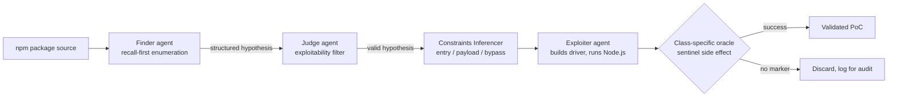

# Daily Scholar Papers Report — 2026-04-27

**[Download PDF](Daily_Papers_Report_2026-04-27.pdf)**

**Window covered:** 2026-04-26 → 2026-04-27 (Google Scholar alerts, Gmail inbox, last 24 h)

---

## Executive Summary

A thin alert window. Gmail's `from:scholaralerts-noreply@google.com newer_than:1d` query returned exactly one new alert thread — a "Recommended articles" delivery containing a single paper. None of the followed-researcher channels emitted a digest in this window; their previous batch (2026-04-25) was already absorbed into yesterday's 2026-04-26 report.

The single paper that did arrive is substantive: a CMU + Google effort on LLM-agent-driven taint-style vulnerability detection and confirmation for Node.js packages. Headline numbers — 84% PoC-confirmation on the SecBench.js / VulcaN public benchmarks vs. <22% for prior program-analysis tools, and 36 exploitable, previously-undocumented vulnerabilities surfaced from 260 in-the-wild npm packages where prior tools surfaced ≤ 2. The methodological differentiator is execution-oracle confirmation rather than LLM self-reporting.

**Outstanding:** 0 · **Keep:** 1 · **Borderline High-Priority:** 0

The full analysis follows.

---

## Highlighted Papers

| # | Title | Authors | Venue | Link |
|---|-------|---------|-------|------|
| 3.1 | Taint-Style Vulnerability Detection and Confirmation for Node.js Packages Using LLM Agent Reasoning (LLMVD.js) | Ronghao Ni, Mihai Christodorescu, Limin Jia | arXiv 2604.20179 [cs.CR] (preprint) | [arXiv](https://arxiv.org/abs/2604.20179) |

---

## Keep Papers (Deep-Read)

<strong>3.1</strong> · JS-VULN-AGENT · LLM agent finds 36 unreported npm vulns at $0.05 / valid exploit — execution oracles, not self-reporting<a href="https://github.com/MarkLee131/paper-digest/issues/new?title=%5Bfeedback%5D+2026-04-27-3.1+LLM+agent+finds+36+unreported+npm+vulns+at+%240.05+%2F+valid+exploit+%E2%80%94+execution+oracles%2C+not+self-reporting+%F0%9F%91%8D&body=paper_id%3A+2026-04-27-3.1%0Atitle%3A+LLM+agent+finds+36+unreported+npm+vulns+at+%240.05+%2F+valid+exploit+%E2%80%94+execution+oracles%2C+not+self-reporting%0Aauthors%3A+%23%23%23+3.1+LLMVD.js%3A+Taint-Style+Vulnerability+Detection+and+Confirmation+for+Node.js+Packages+Using+LLM+Agent+Reasoning%0Avenue%3A+preprint%0Atopic%3A+JS-VULN-AGENT%0Arating%3A+thumbs-up%0A%0A%3C%21--+Optional+notes+below+this+line+are+read+by+preferences.py+as+soft+signals.+--%3E%0A&labels=feedback%2Cthumbs-up" target="_blank" rel="noopener" class="fb-thumbs-up" title="thumbs up" onclick="event.stopPropagation()">👍</a><a href="https://github.com/MarkLee131/paper-digest/issues/new?title=%5Bfeedback%5D+2026-04-27-3.1+LLM+agent+finds+36+unreported+npm+vulns+at+%240.05+%2F+valid+exploit+%E2%80%94+execution+oracles%2C+not+self-reporting+%F0%9F%91%8E&body=paper_id%3A+2026-04-27-3.1%0Atitle%3A+LLM+agent+finds+36+unreported+npm+vulns+at+%240.05+%2F+valid+exploit+%E2%80%94+execution+oracles%2C+not+self-reporting%0Aauthors%3A+%23%23%23+3.1+LLMVD.js%3A+Taint-Style+Vulnerability+Detection+and+Confirmation+for+Node.js+Packages+Using+LLM+Agent+Reasoning%0Avenue%3A+preprint%0Atopic%3A+JS-VULN-AGENT%0Arating%3A+thumbs-down%0A%0A%3C%21--+Optional+notes+below+this+line+are+read+by+preferences.py+as+soft+signals.+--%3E%0A&labels=feedback%2Cthumbs-down" target="_blank" rel="noopener" class="fb-thumbs-down" title="thumbs down" onclick="event.stopPropagation()">👎</a><a href="https://github.com/MarkLee131/paper-digest/issues/new?title=%5Bfeedback%5D+2026-04-27-3.1+LLM+agent+finds+36+unreported+npm+vulns+at+%240.05+%2F+valid+exploit+%E2%80%94+execution+oracles%2C+not+self-reporting+%F0%9F%94%96&body=paper_id%3A+2026-04-27-3.1%0Atitle%3A+LLM+agent+finds+36+unreported+npm+vulns+at+%240.05+%2F+valid+exploit+%E2%80%94+execution+oracles%2C+not+self-reporting%0Aauthors%3A+%23%23%23+3.1+LLMVD.js%3A+Taint-Style+Vulnerability+Detection+and+Confirmation+for+Node.js+Packages+Using+LLM+Agent+Reasoning%0Avenue%3A+preprint%0Atopic%3A+JS-VULN-AGENT%0Arating%3A+save-for-later%0A%0A%3C%21--+Optional+notes+below+this+line+are+read+by+preferences.py+as+soft+signals.+--%3E%0A&labels=feedback%2Csave-for-later" target="_blank" rel="noopener" class="fb-save-for-later" title="save for later" onclick="event.stopPropagation()">🔖</a>

### 3.1 LLMVD.js: Taint-Style Vulnerability Detection and Confirmation for Node.js Packages Using LLM Agent Reasoning

[arXiv:2604.20179](https://arxiv.org/abs/2604.20179)

## Paper
- **Title:** Taint-Style Vulnerability Detection and Confirmation for Node.js Packages Using LLM Agent Reasoning
- **Authors:** Ronghao Ni (CMU), Mihai Christodorescu (Google), Limin Jia (CMU)
- **Venue / Source:** arXiv:2604.20179 [cs.CR] (also cs.AI, cs.SE) — preprint, submitted 2026-04-22, 19 pp / 6 figs
- **Year:** 2026
- **Link:** <https://arxiv.org/abs/2604.20179>
- **License:** arXiv non-exclusive distribution (figures not embedded; pipeline recreated in Mermaid below).

## Objective Summary
- **Core idea:** A multi-stage ReAct-style LLM-agent pipeline that performs **vulnerability detection + exploit synthesis + execution-oracle confirmation** for Node.js packages without dedicated static or dynamic taint-analysis engines. Each stage is a separate LLM agent with isolated context: **Finder** (recall-first candidate enumeration via directory/source/regex exploration), **Judge** (lightweight feasibility filter), **Constraints Inferencer** (entry points, parameters, payload structure, bypass conditions), **Exploiter** (synthesises an executable driver, runs it under Node.js, validates via class-specific oracles).
- **Methodological differentiator:** A *uniform success predicate via class-specific execution oracle* replaces brittle self-reporting. Each oracle reduces verification to a deterministic side-effect check — sentinel-file write for OS-cmd-injection, marker-function call for code injection, polluted-property read for prototype pollution, sentinel-file read for path traversal. The LLM never grades its own output.
- **Headline numbers (verbatim from §5):**
  - NodeMedic private dataset: "LLMVD.js generated valid PoCs for 244 out of a total of 259 vulnerable packages, achieving a valid PoC generation rate of 94.2%."
  - Wild npm: "LLMVD.js detected 112 packages that it identified as potentially vulnerable and successfully exploited 84 of them … Among the 84 exploited packages, 36 generated proofs of concept (PoCs) that were deemed valid after manual inspection."
  - Cost: "$0.089 per package across all samples … $0.084 per valid exploit", amortised cost $0.050 per valid exploit.
  - Disclosure: 36 validated vulnerabilities reported, 3 maintainer acknowledgments at submission time.
- **Datasets:** Four — VulcaN, SecBench.js, a private NodeMedic dataset, and a fresh "Wild" set of 260 randomly-sampled regex-flagged packages (65 per CWE in {CWE-22, CWE-78, CWE-94, CWE-471}). Memorization robustness checked via a transformed-benchmark variant; LLMVD.js retained 107/108 successful PoCs.
- **Backbone:** GPT-5-mini (gpt-5-mini-2025-08-07), LangChain agent framework, recursion-limit 54, three-attempt retry on failure.

## Formal Definitions Quoted (Appendix D)

The paper provides explicit formal definitions for the file-level coverage metrics. Reproduced verbatim:

For each dataset \( d \) and stage \( s \in \{\text{Finder}, \text{Judge}\} \):

- \( F_{d,\text{Finder}} \): findings produced by the Finder stage; \( F_{d,\text{Judge}} \): subset deemed valid by the Judge stage.
- \( G_d \): set of ground-truth vulnerable files.

\[
\text{Finder Findings Unmatched}(d) = \frac{|\{f \in F_{d,\text{Finder}} : f \text{ unmatched}\}|}{|F_{d,\text{Finder}}|}
\]

\[
\text{Judge Findings Unmatched}(d) = \frac{|\{f \in F_{d,\text{Judge}} : f \text{ unmatched}\}|}{|F_{d,\text{Judge}}|}
\]

\[
\text{Finder GT Unmatched}(d) = \frac{|\{g \in G_d : f \in F_{d,\text{Finder}} \text{ matched to } g\}|}{|G_d|}
\]

\[
\text{Judge GT Unmatched}(d) = \frac{|\{g \in G_d : f \in F_{d,\text{Judge}} \text{ matched to } g\}|}{|G_d|}
\]

The first two metrics measure the fraction of tool reports that are unmatched; the latter two measure the fraction of benchmark vulnerable files not covered by any report at each stage.

## Pipeline Recreation (Mermaid — non-CC paper, no figure embed)

## Meta-cognition Analysis
- **Problem formulation:** Traditional taint analysis on JavaScript fails because of (i) dynamic-language semantics, (ii) C++ built-ins, (iii) brittle parser/instrumentation toolchains, (iv) string/regex constraints that defeat SMT. LLMs reason over code without these dependencies. *Can a tool-augmented LLM agent confirm vulnerabilities at PoC fidelity, end-to-end?*
- **Solution-space reduction:** Rather than build yet another points-to/taint engine for JavaScript or train a vulnerability classifier, the authors split the pipeline so the LLM does the *reasoning* (locate sinks, infer entry points, write drivers) and a deterministic *runtime* does the *adjudication* (sentinel-based oracles). This decouples LLM trust from verification — the recurring weakness of LLM-only vulnerability tooling.
- **Key assumptions:** (i) Class-specific side effects are observable from a sandbox without false positives. (ii) Public APIs of an npm package are reachable from a thin driver — internal-path exploits (tests, examples, non-exported APIs) are conservatively excluded. (iii) The LLM has enough exposure to common taint patterns to enumerate plausible sinks. (iv) Recursion limit 54 + 3-attempt retry suffice to bound non-determinism.
- **Main trick:** Stage separation with isolated LLM contexts plus oracle-based binary validation. The Constraints Inferencer is a clean shim — its only output is the structured payload contract handed to the Exploiter, which keeps later stages from re-deriving facts already proven.
- **Reusable research pattern:** *Generate-then-execute-then-oracle* — let the LLM produce candidate exploits, run them in a constrained sandbox, validate via deterministic side effects. Applies beyond Node.js to Python (pip), Rust (crates), PHP (composer), and even cloud-IaC misconfiguration where the "exploit" is a config delta and the "oracle" is a state check.

## Critical Assessment
- **Strengths:** End-to-end PoC generation with execution-oracle validation is rare in this subgenre. The Wild-set numbers (36 validated unreported vulns, 3 maintainer acks) push past benchmark-only claims. Per-CWE cost reporting plus an amortised-cost-per-valid-exploit metric ($0.050) is operationally usable. Stage separation enables auditing — every reasoning step is logged. Memorization robustness check via a transformed benchmark is honest practice.
- **Weaknesses:** Restricted to four taint-style CWEs — no UAF / heap-corruption / logic-bug coverage. Single-LLM evaluation (GPT-5-mini); cross-model robustness not addressed in the visible portion. Conservative manual-validation policy excludes internal-path exploits, which deflates the "real bug count" but is the right call for vendor disclosure. The 84%-vs.-<22% headline includes datasets where some baselines (e.g. Explode.js / NodeMedic-FINE) do not target some CWEs at all (path traversal, prototype pollution); a fairer comparator would be PoC rate per-CWE on the supported intersection. Recursion-limit 54 + 3-retry is an engineered hyperparameter — sensitivity not reported. Lightweight execution oracles can themselves be evaded — a malicious package can detect a sentinel and decline to write it.
- **What is genuinely valuable:** The *Generate-then-execute-then-oracle* pattern, the explicit dataset triad (public + private + Wild), the disclosure track record. Re-usable beyond Node.js.

## Reusable Take-Aways
- **For applied agent design:** When an LLM is asked to "produce X", make the success criterion a side effect outside the LLM's narrative loop. Use sandboxed, deterministic checks; never trust the model's self-report.
- **Dataset construction:** The Wild-set methodology (regex-prefilter → uniform CWE-quota sampling → manual ground truth via execution + side effect) is a clean blueprint for any "LLM finds bugs in unseen real-world repos" study.
- **Cost transparency:** Per-CWE cost plus amortised-per-valid-exploit is the right way to discuss agent budgets.

---

## Cross-Paper Synthesis

With only one paper in scope, cross-paper synthesis collapses into context. LLMVD.js is the third entry in the *agentic vulnerability discovery* track of the past 14 days, after agentic CVE-discovery work and a multi-agent static-analysis ensemble — both surfaced in earlier digests. The differentiator here is execution-oracle validation: prior work reports CVE counts but limited PoC fidelity, or orchestrates analyzers without runtime confirmation; LLMVD.js commits to PoC-or-die. This shifts the field's success metric from "LLM agrees there's a bug" toward "LLM produces a working exploit", which is the right north star.

A natural composition with yesterday's Hermes (path-sensitive sparse value-flow) is obvious: use Hermes-style scalable static analysis as the Judge / Constraints Inferencer's reachability oracle, hand a much smaller candidate set to the Exploiter, and pay the LLM only for sinks that survive sound pruning. That hybrid is the obvious next step for this research line.

## Writing & Rationale Insights

The take-away pattern is **Generate → Execute → Oracle**: LLM produces; runtime executes; deterministic check adjudicates. Treat this as a default contract for any agent that claims to "discover" something. Class-specific oracles are cheap but powerful — one sentinel per CWE collapses confirmation to a unit-test–style check. Conservative validation policy (excluding internal-path exploits) is the right call for disclosure-track work; over-claiming bites you in the responsible-disclosure phase. Cost amortisation per valid exploit is the cleanest cost metric for agent papers — adopt it. The four-stage decomposition (Finder → Judge → Constraints Inferencer → Exploiter) also generalises: replace "exploit" with "patch" and you have a code-repair pipeline; replace it with "fuzzer harness" and you have an autonomous fuzzing entry-point synthesiser.
