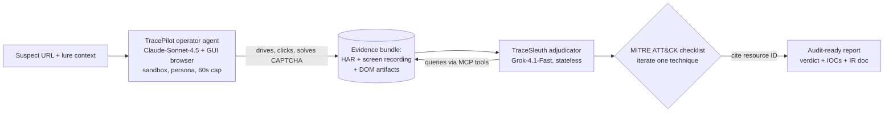
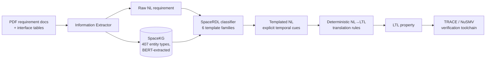

# Daily Scholar Papers Report — 2026-04-29

**[Download PDF](Daily_Papers_Report_2026-04-29.pdf)**

**Window covered:** 2026-04-28 → 2026-04-29 (Google Scholar alerts, Gmail inbox, last 24 h)

---

## Executive Summary

A modest alert window — five raw threads, two papers passed Stage-1 screening. Both come from followed-researcher channels and converge on the same architectural insight despite operating in completely different domains: **decouple LLM production from verification, and ground every decision in immutable external evidence.**

The first, *TraceScope* (Texas A&M), reframes phishing-URL triage as an interactive forensic task. A sandboxed GUI operator agent solves CAPTCHAs and walks through interaction-gated phishing pages, freezing the session into an immutable evidence bundle; a separate stateless adjudicator iterates one MITRE ATT&CK technique at a time and is forbidden from rendering a verdict without citing a specific evidence resource ID. On 708 live URLs the system reaches 0.94 precision / 0.78 recall, with 100% recall on Non-CRP (crypto-wallet, PII-only) phishing where the best snapshot baseline manages 8.3%; median cost is $0.04 per URL after a constant $0.20 operator floor.

The second, *AeroReq2LTL* (Xidian + China Academy of Space Technology + Beijing Inst. of Control Engineering), automates NL→LTL translation for industrial aerospace requirement documents — a setting where prior NL-to-LTL tools collapse from 0.61 down to 0.36 precision because real requirements come bound to interface tables, embed implicit temporal operators, and use heavy domain jargon. AeroReq2LTL adds a BERT-built domain dictionary (SpaceKG, 407 entity types) plus a six-template structured language (SpaceRDL) that the LLM must commit to *before* LTL synthesis, then applies deterministic translation rules. On 76 expert-formalized requirements from the Sun Search Control Software (SSCS) of an LEO satellite ACS, precision/recall reach 85% / 88% with GPT-4o; ablation shows SpaceRDL is the dominant lever, with a 33-pp drop when removed.

Read together with last week's LLMVD.js paper, the agentic-LLM SE/Sec literature is settling on a clear architectural standard: *LLM produces, deterministic oracle confirms.*

**Outstanding:** 0 · **Keep:** 2 · **Borderline High-Priority:** 0

The full analysis follows.

---

## Highlighted Papers

| # | Title | Authors | Venue | Link |
|---|-------|---------|-------|------|
| 4.1 | TraceScope: Interactive URL Triage via Decoupled Checklist Adjudication | Haolin Zhang, William Reber, Yuxuan Zhang, Guofei Gu, Jeff Huang | arXiv 2604.21840 [cs.CR] (preprint; submission target USENIX Security per ethics appendix) | [arXiv](https://arxiv.org/abs/2604.21840) |
| 4.2 | Automated LTL Specification Generation from Industrial Aerospace Requirements (AeroReq2LTL) | Zhi Ma, Xiao Liang, Cheng Wen, Rui Chen, Bin Gu, Shengchao Qin, Cong Tian, Mengfei Yang | arXiv 2604.21715 [cs.SE] (preprint, formal-methods style) | [arXiv](https://arxiv.org/abs/2604.21715) |

---

## Keep Papers (Deep-Read)

<strong>4.1</strong> · PHISH-AGENT · Decoupled GUI operator + checklist adjudicator hits 0.94 / 0.78 P/R on 708 live phishing URLs at $0.04 median per verdict<a href="https://github.com/MarkLee131/paper-digest/issues/new?title=%5Bfeedback%5D+2026-04-29-4.1+Decoupled+GUI+operator+%2B+checklist+adjudicator+hits+0.94+%2F+0.78+P%2FR+on+708+live+phishing+URLs+at+%240.04+median+per+verdict+%F0%9F%91%8D&body=paper_id%3A+2026-04-29-4.1%0Atitle%3A+Decoupled+GUI+operator+%2B+checklist+adjudicator+hits+0.94+%2F+0.78+P%2FR+on+708+live+phishing+URLs+at+%240.04+median+per+verdict%0Aauthors%3A+%23%23%23+4.1+TraceScope%3A+Interactive+URL+Triage+via+Decoupled+Checklist+Adjudication%0Avenue%3A+preprint%0Atopic%3A+PHISH-AGENT%0Arating%3A+thumbs-up%0A%0A%3C%21--+Optional+notes+below+this+line+are+read+by+preferences.py+as+soft+signals.+--%3E%0A&labels=feedback%2Cthumbs-up" target="_blank" rel="noopener" class="fb-thumbs-up" title="thumbs up" onclick="event.stopPropagation()">👍</a><a href="https://github.com/MarkLee131/paper-digest/issues/new?title=%5Bfeedback%5D+2026-04-29-4.1+Decoupled+GUI+operator+%2B+checklist+adjudicator+hits+0.94+%2F+0.78+P%2FR+on+708+live+phishing+URLs+at+%240.04+median+per+verdict+%F0%9F%AB%A5&body=paper_id%3A+2026-04-29-4.1%0Atitle%3A+Decoupled+GUI+operator+%2B+checklist+adjudicator+hits+0.94+%2F+0.78+P%2FR+on+708+live+phishing+URLs+at+%240.04+median+per+verdict%0Aauthors%3A+%23%23%23+4.1+TraceScope%3A+Interactive+URL+Triage+via+Decoupled+Checklist+Adjudication%0Avenue%3A+preprint%0Atopic%3A+PHISH-AGENT%0Arating%3A+thumbs-down%0A%0A%3C%21--+Optional+notes+below+this+line+are+read+by+preferences.py+as+soft+signals.+--%3E%0A&labels=feedback%2Cthumbs-down" target="_blank" rel="noopener" class="fb-thumbs-down" title="less interested" onclick="event.stopPropagation()">🫥</a><a href="https://github.com/MarkLee131/paper-digest/issues/new?title=%5Bfeedback%5D+2026-04-29-4.1+Decoupled+GUI+operator+%2B+checklist+adjudicator+hits+0.94+%2F+0.78+P%2FR+on+708+live+phishing+URLs+at+%240.04+median+per+verdict+%F0%9F%94%96&body=paper_id%3A+2026-04-29-4.1%0Atitle%3A+Decoupled+GUI+operator+%2B+checklist+adjudicator+hits+0.94+%2F+0.78+P%2FR+on+708+live+phishing+URLs+at+%240.04+median+per+verdict%0Aauthors%3A+%23%23%23+4.1+TraceScope%3A+Interactive+URL+Triage+via+Decoupled+Checklist+Adjudication%0Avenue%3A+preprint%0Atopic%3A+PHISH-AGENT%0Arating%3A+save-for-later%0A%0A%3C%21--+Optional+notes+below+this+line+are+read+by+preferences.py+as+soft+signals.+--%3E%0A&labels=feedback%2Csave-for-later" target="_blank" rel="noopener" class="fb-save-for-later" title="save for later" onclick="event.stopPropagation()">🔖</a>

### 4.1 TraceScope: Interactive URL Triage via Decoupled Checklist Adjudication

[arXiv:2604.21840](https://arxiv.org/abs/2604.21840)

## Paper
- **Title:** TraceScope: Interactive URL Triage via Decoupled Checklist Adjudication
- **Authors:** Haolin Zhang, William Reber, Yuxuan Zhang, Guofei Gu, Jeff Huang (Texas A&M University)
- **Venue / Source:** arXiv:2604.21840 [cs.CR / cs.AI] — preprint, submitted 2026-04-23, 20 pp / 18 figures. Ethics appendix is structured "in accordance with USENIX Security policies", indicating submission/under-review at USENIX Security.
- **Year:** 2026
- **Link:** <https://arxiv.org/abs/2604.21840>
- **License:** arXiv non-exclusive distribution (figures not embedded; pipeline recreated in Mermaid below).

## Objective Summary
- **Core idea:** Phishing URL triage has shifted from static classification to an interactive forensic task — modern campaigns hide payloads behind CAPTCHAs, slider puzzles, multi-turn chat prompts, and crypto-wallet-connect modals. Granting an LLM agent direct access to the live web introduces observer effects, infinite challenge loops, and drive-by exploit risk. TraceScope splits the workflow into two roles separated by a **Visual Air-Gap**:
  - **TracePilot** (operator) — Claude-Sonnet-4.5 driving a real GUI browser inside an ephemeral sandbox, with a synthetic persona and a 60-second exec cap. Solves interaction gates (arithmetic CAPTCHAs, slider puzzles, "Tap to Listen" voicemail lures) and freezes the session into an immutable evidence bundle (HAR + screen recording + DOM artifacts).
  - **TraceSleuth** (adjudicator) — xAI Grok-4.1-Fast, stateless, queries the frozen evidence bundle on demand via Model Context Protocol (MCP) tools to resolve a MITRE ATT&CK checklist atomically. Operates under an **Evidence Citation Protocol**: cannot render a verdict on a technique without populating a structured evidence object that points to a specific resource ID in the bundle. This converts conflicting evidence from a failure mode into a granular forensic finding.
- **Methodological differentiator vs. prior agentic browsers:** the operator is *isolated from the judgment*. The agent that performs the high-risk task of clicking on live web content never produces the verdict; the agent that produces the verdict never sees live web content. This containment property is what makes the system safe to deploy.
- **Headline numbers (verbatim from §5):**
  - Live URL set (N=708; 241 phishing / 467 benign): "TraceScope achieves an F1-score of 0.8507", precision 0.94, "recall (0.7769 vs. 0.2521 for PhishVLM)" — about a 3× recall lift over the strongest snapshot baseline.
  - Per-tactic recall breakdown (Table 3): Brand-impersonation 73.7% (best baseline 31.6%), logo-less generic phishing 56.3% (12.5%), Non-CRP capture (crypto wallets, PII-only) **100% (8.3%)**, interaction-gated 16.7% (16.7%, parity), progressive-disclosure 50% (0%).
  - Real-world pilot (14 days, 71 valid URLs after decay): F1 0.7692, P 0.9375, R 0.6522 — while baselines collapse to F1 ≈ 0.18 because 25.3% of URLs return 403/500 to headless Selenium yet render fully for full-stack browsers ("false downtime").
  - Cost: median $0.04 per URL on the adjudicator (Grok-4.1-Fast), bimodal up to p99 ≈ $1.53 in adversarial regimes; constant $0.20 floor on the operator. Median total $0.24/URL → "5.5× reduction in operational expense" vs. a 2-min human triage at $40/h.
- **Datasets:** PhishTank "online, verified" entries (phishing) + Tranco-derived long-tail benign URLs; 1000 URLs scheduled live, 708 retained after symmetric exclusions for label drift and timing/late-render. Plus a manually curated real-world phishing email set from the 14-day production pilot.
- **Backbones:** TracePilot = Claude-Sonnet-4.5 + GUI browser. TraceSleuth = xAI Grok-4.1-Fast + MCP query tools.

## Methodological Reusable Ideas
1. **Visual Air-Gap.** Sandboxed live-browser operator + stateless adjudicator over frozen evidence. Eliminates observer-effect hallucinations and bounds blast radius — directly applicable to any agentic-LLM forensic task that touches untrusted live content.
2. **Deterministic Temporal Normalization.** Aligns asynchronous video frames with HAR network packets via a normalization layer so the adjudicator can answer "what was on screen when this network call fired?" without hallucinating frame indices.
3. **Checklist-Driven Atomicity + Evidence Citation Protocol.** Force the adjudicator to iterate the rubric one item at a time and require structured evidence-object citations before any verdict. Conflicting evidence becomes a granular finding rather than a coin flip.
4. **Cascading defense framing.** TraceScope is positioned not as a perimeter filter but as an on-demand forensic agent triggered by upstream signals — explicit acknowledgment of the throughput / depth tradeoff that prior work routinely waves away.

## Pipeline Diagram (Mermaid recreation; original figures not embedded)

## Limitations Honestly Reported
- VLM **symbol hallucination** (misreads "5−1" as "5+1") and **literal-transcription** ("77" instead of computing "7+7") on low-contrast CAPTCHAs.
- Hard adversarial blocks: infinite challenge loops, hardware-fingerprint discrimination via WebGL `SwiftShader Device` signature; future work proposes QEMU/KVM with hardware passthrough or KVM-over-IP physical device farms.
- Interaction-gated subset still caps at 16.7% recall — the headline 0.78 recall is driven by easier categories. The agent's reasoning architecture is sound; the limit is current VLM grounding fidelity.

## Closing Quote (one verbatim line allowed)
> "TraceScope reframes phishing URL classification as an interactive, evidence-driven triage task."

<strong>4.2</strong> · NL→LTL-INDUSTRIAL · Domain dictionary + six-template language lifts NL→LTL precision from 61% to 85% on 76 real satellite-control requirements — SpaceRDL alone worth 33 pp<a href="https://github.com/MarkLee131/paper-digest/issues/new?title=%5Bfeedback%5D+2026-04-29-4.2+Domain+dictionary+%2B+six-template+language+lifts+NL%E2%86%92LTL+precision+from+61%25+to+85%25+on+76+real+satellite-control+requirements+%E2%80%94+SpaceRDL+alone+worth+33+pp+%F0%9F%91%8D&body=paper_id%3A+2026-04-29-4.2%0Atitle%3A+Domain+dictionary+%2B+six-template+language+lifts+NL%E2%86%92LTL+precision+from+61%25+to+85%25+on+76+real+satellite-control+requirements+%E2%80%94+SpaceRDL+alone+worth+33+pp%0Aauthors%3A+%23%23%23+4.2+AeroReq2LTL%3A+Automated+LTL+Specification+Generation+from+Industrial+Aerospace+Requirements%0Avenue%3A+preprint%0Atopic%3A+NL%E2%86%92LTL-INDUSTRIAL%0Arating%3A+thumbs-up%0A%0A%3C%21--+Optional+notes+below+this+line+are+read+by+preferences.py+as+soft+signals.+--%3E%0A&labels=feedback%2Cthumbs-up" target="_blank" rel="noopener" class="fb-thumbs-up" title="thumbs up" onclick="event.stopPropagation()">👍</a><a href="https://github.com/MarkLee131/paper-digest/issues/new?title=%5Bfeedback%5D+2026-04-29-4.2+Domain+dictionary+%2B+six-template+language+lifts+NL%E2%86%92LTL+precision+from+61%25+to+85%25+on+76+real+satellite-control+requirements+%E2%80%94+SpaceRDL+alone+worth+33+pp+%F0%9F%AB%A5&body=paper_id%3A+2026-04-29-4.2%0Atitle%3A+Domain+dictionary+%2B+six-template+language+lifts+NL%E2%86%92LTL+precision+from+61%25+to+85%25+on+76+real+satellite-control+requirements+%E2%80%94+SpaceRDL+alone+worth+33+pp%0Aauthors%3A+%23%23%23+4.2+AeroReq2LTL%3A+Automated+LTL+Specification+Generation+from+Industrial+Aerospace+Requirements%0Avenue%3A+preprint%0Atopic%3A+NL%E2%86%92LTL-INDUSTRIAL%0Arating%3A+thumbs-down%0A%0A%3C%21--+Optional+notes+below+this+line+are+read+by+preferences.py+as+soft+signals.+--%3E%0A&labels=feedback%2Cthumbs-down" target="_blank" rel="noopener" class="fb-thumbs-down" title="less interested" onclick="event.stopPropagation()">🫥</a><a href="https://github.com/MarkLee131/paper-digest/issues/new?title=%5Bfeedback%5D+2026-04-29-4.2+Domain+dictionary+%2B+six-template+language+lifts+NL%E2%86%92LTL+precision+from+61%25+to+85%25+on+76+real+satellite-control+requirements+%E2%80%94+SpaceRDL+alone+worth+33+pp+%F0%9F%94%96&body=paper_id%3A+2026-04-29-4.2%0Atitle%3A+Domain+dictionary+%2B+six-template+language+lifts+NL%E2%86%92LTL+precision+from+61%25+to+85%25+on+76+real+satellite-control+requirements+%E2%80%94+SpaceRDL+alone+worth+33+pp%0Aauthors%3A+%23%23%23+4.2+AeroReq2LTL%3A+Automated+LTL+Specification+Generation+from+Industrial+Aerospace+Requirements%0Avenue%3A+preprint%0Atopic%3A+NL%E2%86%92LTL-INDUSTRIAL%0Arating%3A+save-for-later%0A%0A%3C%21--+Optional+notes+below+this+line+are+read+by+preferences.py+as+soft+signals.+--%3E%0A&labels=feedback%2Csave-for-later" target="_blank" rel="noopener" class="fb-save-for-later" title="save for later" onclick="event.stopPropagation()">🔖</a>

### 4.2 AeroReq2LTL: Automated LTL Specification Generation from Industrial Aerospace Requirements

[arXiv:2604.21715](https://arxiv.org/abs/2604.21715)

## Paper
- **Title:** Automated LTL Specification Generation from Industrial Aerospace Requirements
- **Authors:** Zhi Ma, Xiao Liang (Xidian Univ.), Cheng Wen (Xidian / Guangzhou Inst. of Tech), Rui Chen, Bin Gu (Beijing Inst. of Control Engineering), Shengchao Qin (Xidian / GIT), Cong Tian (Xidian), Mengfei Yang (China Academy of Space Technology)
- **Venue / Source:** arXiv:2604.21715 [cs.SE] — preprint, submitted 2026-04-21, ~20 pp; LNCS-style formatting consistent with FM 2026 / formal-methods venue submission.
- **Year:** 2026
- **Link:** <https://arxiv.org/abs/2604.21715>
- **License:** arXiv non-exclusive distribution (figures not embedded; pipeline recreated in Mermaid below).

## Objective Summary
- **Core idea:** Industrial aerospace requirements documents are nothing like the synthetic short sentences on which prior NL-to-LTL benchmarks are built. A single requirement is bound to interface tables (port-level data types, valid ranges, invocation cycles), embeds heavy domain jargon ("absolute values of the angular rates on all axes are less than 0.15°/s") that maps to specific code-level variables, and routinely omits explicit temporal operators ("switches from…to" implies a next-step transition). General-purpose LLMs and prior NL-to-LTL tools (NL2SPEC, NL2TL, NL2LTL) produce *plausible but wrong* LTL because they lack contextual grounding to engineering artifacts and treat requirements as isolated text.
- **Two engineered components, layered on top of an LLM backbone:**
  - **SpaceKG** — a domain-specific data dictionary auto-built by a BERT-based terminology extractor over historical engineering packages. Initial corpus: 8 packages → 427 requirement statements → 635 domain terms → 407 entity types. Resolves jargon to atomic propositions, distinguishes near-collision identifiers (`flagSP` vs. `flagSPS`), and has an evolution mechanism that prefers project-local artifacts when the same term resolves differently across projects.
  - **SpaceRDL + TNL** — a structured template language with six template families (Change / Bound-Check / Work-Mode-Change / Command-Process / Respond-State / Maintenance) that the LLM must commit a requirement to *before* LTL synthesis. The intermediate Templated Natural Language (TNL) externalizes implicit temporal cues — once the requirement is in TNL, deterministic rules emit the LTL.
- **Two-stage rewriting:** NL → TNL → LTL. The LLM does the semantic lifting (terminology grounding via SpaceKG, template selection via SpaceRDL); a deterministic stage protects formal correctness.
- **Headline numbers (verbatim §4.3, Table 3 / Table 4):**
  - Industrial dataset: 79 production requirements from the Sun Search Control Software (SSCS) of the Attitude Control Software for Low Earth Orbit Satellites (ACS-LEOS); 76 expert-formalized as ground-truth LTL by a panel of aerospace + formal-methods experts (cross-reviewed).
  - **Headline result:** AeroReq2LTL + GPT-4o → 67 Correct / 9 Wrong / 0 Missing / 3 Spurious → **P 0.85 / R 0.88**.
  - Backend robustness: + DeepSeek-V3 → P 0.81 / R 0.84; + GPT-3.5 → P 0.75 / R 0.78. Generalizes across LLM backbones.
  - Best baseline (NL2SPEC + GPT-4o): P 0.61 / R 0.61. → AeroReq2LTL beats it by ~24 pp on both metrics.
  - **Ablation (Table 4, GPT-4o):** w/o SpaceKG → P 0.69 / R 0.70 (16/18 pp drop, attributed to grounding errors); w/o SpaceRDL → **P 0.52 / R 0.54** (33/34 pp drop, attributed to missing temporal operators and wrong template selection).
  - SpaceKG terminology-extraction F1 > 0.8 across variables, domain terms, and expressions independently.
- **Datasets:** SSCS (current evaluation target, 76 requirements after expert review). SpaceKG was built from the other 8 historical engineering packages of ACS-LEOS — strict separation between dictionary-construction corpus and evaluation corpus.

## Formal Definitions Quoted (paper §4.2)
The paper specifies four outcome classes for each requirement:
> "Each requirement is classified into one of four outcomes: Correct, Wrong, Missing, or Spurious. A generated LTL property is counted as correct only if it matches the intended logical and temporal semantics; minor operator differences (e.g., X vs. F ) are considered wrong due to their significant impact on verification outcomes. If a requirement does not describe any checkable temporal behavior and therefore should not yield an LTL specification, then erroneously producing output is considered spurious. Conversely, if a requirement is expected to yield an LTL specification but the method fails to produce one, the outcome is classified as Missing."

Precision and recall follow directly: precision = Correct / (Correct + Wrong + Spurious), recall = Correct / |R_with_LTL|.

Representative SpaceRDL templates (Table 2):
- Template 1 (Change): "‘Communicator’ shall always satisfy if (‘signal_lost’ & ‘mission_phase’) then next ‘backup’."
- Template 3 (Change): "Upon (‘pitch_search’ & ‘sun_not_found’) ‘Spacecraft’ shall at the next timepoint satisfy ‘roll_search’."
- Template 6 (Maintenance): "The ‘alarm system’ shall maintain ‘active’ unless ‘system_disabled’."

These templates encode the temporal operator structure (next-step X, until U, globally G) implicitly via their phrasing — the LLM never has to choose an LTL operator directly; it chooses a template, and the rules choose the operator.

## Pipeline Diagram (Mermaid recreation; original figures not embedded)

## Methodological Reusable Ideas
1. **Domain-dictionary as a first-class artifact.** SpaceKG is auto-built from historical packages with BERT extraction + expert review, then evolves via project-local override. This is a clean recipe for any NL-to-formal-spec pipeline that operates in a vocabulary-heavy domain (medical protocols, financial regulations, hardware verification).
2. **Externalize implicit operators via template language.** SpaceRDL forces the LLM to make a discrete template choice with externally-visible reasoning — and the 33-pp ablation drop shows this is the dominant correctness lever, not the LLM scale. Suggests **template selection > LLM choice** for structured-spec generation.
3. **Four-class outcome reporting (Correct/Wrong/Missing/Spurious).** Separates "didn't emit" from "emitted wrong" cleanly. A useful reporting convention for any tool paper that emits structured outputs.

## Limitations Honestly Reported
- Single-organization dataset (ACS-LEOS) with all dictionary curation by in-house aerospace engineers; generalizability across organizations or sub-domains rests on the evolution mechanism rather than empirical evidence.
- Several State-Transition requirements are misclassified as Work-Mode-Change in the SpaceRDL confusion matrix; non-checkable requirements tend to be forcibly assigned a template (the source of the 3 spurious outputs).
- No public artifact / dataset release (industrial confidentiality).

## Closing Quote (one verbatim line allowed)
> "AeroReq2LTL achieves 85% precision and 88% recall, substantially reducing manual formalization effort and establishing a practical, automated pathway for rigorous software assurance within the aerospace industry."

---

## Cross-Paper Synthesis

The two Keep papers operate in superficially unrelated domains (phishing forensics vs. aerospace formal methods) yet implement the same architectural recipe — and that recipe also describes the LLMVD.js paper from 2026-04-27. The agentic-LLM SE/Sec literature is converging on a clear standard: **LLM produces, deterministic oracle confirms.**

| Pattern | TraceScope (4.1) | AeroReq2LTL (4.2) | LLMVD.js (2026-04-27) |
|---------|------------------|-------------------|-----------------------|
| Decouple production from verification | Operator (live web) ↔ Adjudicator (frozen evidence) | LLM (NL→TNL) ↔ Deterministic rules (TNL→LTL) | Finder/Constraints (LLM) ↔ Exploiter (Node.js execution oracle) |
| External grounding object | MITRE ATT&CK + immutable evidence bundle | SpaceKG dictionary + SpaceRDL templates | Class-specific execution oracles (sentinel writes, marker calls) |
| Ban on self-grading | Evidence Citation Protocol forces resource-ID citations | Deterministic translation stage; expert ground-truth scoring | Side-effect verification, never LLM self-report |
| Cost / scale lever | Bimodal cost adapts to adversarial regime | Two-stage rewriting amortizes domain knowledge across project | $0.05 / valid exploit via cheap recall-first Finder |
| Result vs. weakest "self-graded" baseline | ~3× recall on live URLs | 24-pp precision/recall lift over NL2SPEC | 4× PoC confirmation rate vs. <22% prior tools |

A few specific cross-cutting ideas worth pulling out:

- **Stateless adjudicators with external memory beat stateful LLM-judges.** Both TraceScope's TraceSleuth and AeroReq2LTL's deterministic NL→LTL stage refuse to maintain context across decisions; both query/consult an external structure (evidence bundle, SpaceKG dictionary). This is the same architectural move that the verification community made when going from monolithic theorem provers to checker-based pipelines.
- **The "templates over operators" insight from AeroReq2LTL has a direct analog in TraceScope.** SpaceRDL's six templates externalize temporal-operator choice; MITRE ATT&CK techniques externalize verdict-class choice. In both cases the LLM picks a discrete category from a small enumerated set, and a deterministic layer expands that category into the formal artifact. This pattern — *constrain the LLM to discrete choices, expand via rules* — is reusable wherever the output language is structured.
- **Cost / latency reporting is improving.** TraceScope explicitly reports p99 cost ($1.53), median cost ($0.04), and benchmarks against $40/h human-analyst time. AeroReq2LTL doesn't quantify cost, but reports a clean four-class (Correct / Wrong / Missing / Spurious) outcome breakdown that exposes "didn't emit" failures. Both reporting conventions are upgrades over the standard P/R/F1-only template.

---

## Writing & Rationale Insights

- **Structuring §1 around adversary/domain shifts works.** TraceScope's introduction enumerates three concrete "shifts in adversary tradecraft" (HTTP fingerprinting, targeted cloaking, reputation jacking) before introducing the system. AeroReq2LTL's enumerates three layers of complexity in industrial requirements (multi-context binding, domain-specific semantics, implicit temporal logic) before introducing AeroReq2LTL. Both motivate the contribution by showing prior work's assumptions don't hold *in this slice of the world* — concrete and effective. Worth copying.

- **An ethics appendix as architecture.** TraceScope's ethics appendix is structured "in accordance with USENIX Security policies" with stakeholder enumeration (dataset providers, exposed researchers, broader community) and an explicit "principle of Beneficence" justification for publication. This is a strong template for any security-track paper that touches live malicious infrastructure.

- **Four-class outcome reporting (Correct / Wrong / Missing / Spurious).** AeroReq2LTL's evaluation cleanly separates "didn't emit" failures from "emitted wrong" failures. Most tool papers conflate these into a single recall denominator; AeroReq2LTL does not, and the resulting tables are noticeably more legible. Adopt for any structured-output system.

- **Honest cost reporting at p99 is rare and valuable.** TraceScope reports a bimodal cost profile (median $0.04, p99 $1.53) and explicitly compares against human-analyst hourly cost. The kind of line a reviewer asks for — putting it in §5.4 RQ3 short-circuits the question. Worth copying when reporting agentic-LLM cost.

- **Mermaid pipeline diagrams are sufficient for preprint license.** Both papers are arXiv non-exclusive (figures not embeddable here); the Mermaid recreations above preserve the architecture without violating license. A useful default workflow.
