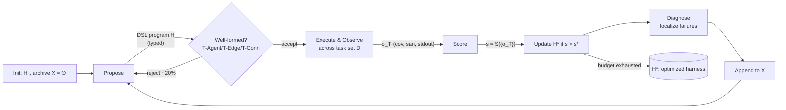

# Daily Scholar Papers Report — 2026-04-30

**[Download PDF](Daily_Papers_Report_2026-04-30.pdf)**

**Window covered:** 2026-04-29 → 2026-04-30 (Google Scholar alerts + user-curated self-emails, last 24 h)

---

## Executive Summary

A heavy day, dominated by the user-curated queue: STEP 2b pulled in four self-flagged arXiv preprints, while the Scholar-alert side contributed exactly one EMSE-published static-analysis tool. The four user-picked papers cluster tightly around the same architectural recipe — **multi-agent orchestration with structural feedback grounded in deterministic execution oracles** — applied to four adjacent problems: PoC test synthesis, multi-agent harness search, test-scenario generalization, and DeFi auditing. Two stand out as Outstanding, two as Keep, with the EMSE alert filling out a Borderline-High slot.

The day's headline is **AnyPoC** (UIUC, *Lingming Zhang*'s group), which reframes LLM bug-finding as a **PoC-generation task** so that bug reports can be validated by execution rather than by another LLM. A four-agent loop (analyzer → generator → validator → knowledge extractor) operates on candidate reports from any reporter, using docker-built targets and a self-evolving project knowledge base. Across 12 large systems (Firefox, Chromium, LLVM, OpenSSL, SQLite, FFmpeg, Hermes, Wasmtime, Redis, FreeType, QuickJS, Memcached) AnyPoC produced 122 new bugs (105 confirmed, 86 fixed, 45 regression-tests adopted upstream, including CVE-2026-2806 in Firefox), and produces 1.3× more valid PoCs while rejecting 9.8× more false-positive reports than vanilla Claude Code / Codex. Its argument is the same one Big Sleep, KNighter, OSS-Fuzz, and FIKA have been converging on for the last two months — **the LLM proposes, the runtime confirms** — but it is the cleanest end-to-end demonstration of that pattern at production scale to date.

The second Outstanding paper, **AgentFlow** (UCSB + Fuzzland + UCSD, *Yu Feng*'s group), tackles the upstream design problem: if LLM bug-finding now lives or dies by its harness, can the harness itself be synthesized? AgentFlow lifts the harness into a **typed graph DSL** with five searchable dimensions — agent roles A, communication topology G, message schemas Σ, tool bindings Φ, coordination protocol Ψ — guarded by linear-time well-formedness checks (T-Agent, T-Edge, T-Conn) so that ~20% of malformed proposer outputs are rejected before any LLM-evaluation budget is spent. A feedback-driven outer loop (HarnessOpt) iterates `Propose → Execute → Score → Diagnose`, reading runtime signals (sanitizer crashes, coverage, stdout) directly from the target. With Claude Opus 4.6 fixed, AgentFlow climbs from 35.2% → 84.3% on TerminalBench-2 (top of the public leaderboard, 2.9 pp over the strongest hand-engineered entry). With Kimi K2.5 fixed, it discovered ten Chrome zero-days, including two Critical sandbox-escape CVEs (CVE-2026-5280, CVE-2026-6297), all confirmed through the Chrome VRP. AnyPoC and AgentFlow effectively bracket each other: AnyPoC delivers a great harness for one task (PoC validation); AgentFlow shows you can search for a great harness automatically.

The two Keep papers are also USER-PICKs. **TestGeneralizer** (NUS + SJTU + Beihang + Passau + Gordon Fraser & Jin Song Dong) attacks a long-standing gap in LLM test generation: existing approaches optimize *code coverage*, but real developers think in *test scenarios* derived from requirements that don't align with control-flow branches. TestGeneralizer (1) recovers requirement intent from one initial test via Masked Oracle Modeling, (2) synthesizes a "test scenario template" with explicit *Variation Points* through a prompt auto-tuned by an LLM-vs-LLM feedback loop (Algorithm 1), and (3) crystallizes the template into executable tests using CodeQL/JDTLS-mediated project knowledge. On 12 Java projects (1,637 scenarios), it improves mutation-based scenario coverage by **+57.67% over EvoSuite, +37.44% over gpt-o4-mini, +31.66% over ChatTester**; in a field study, **16 of 27** generated tests were merged by upstream maintainers. **Knowdit** (NTU + Beihang + CUHK + Imperial + Movebit + Bitslab) builds an **auditing knowledge graph** from 270 historical Code4rena audit reports, separating a *DeFi Space* (business types, projects, fine-grained DeFi semantics) from a *Vulnerability Space* (patterns, findings, attack types) with traceability links. A five-agent framework (Knowledge Mapper → Specification Generator → Harness Synthesizer → Foundry Fuzz Executor → Finding Reflector) iterates over a shared Working Memory, materializing each (semantic, vulnerability) pair into Initial-/Pre-/Post-Vuln-State invariants and Foundry harnesses. On the AuditEval benchmark (12 Code4rena projects, 75 GT vulns), Knowdit detects **all 14 high-severity and 77% of medium-severity vulnerabilities with only 2 false positives**; on six real-world projects it discovers 12 high- and 10 medium-severity previously unknown bugs.

The Borderline-High entry, **ContractFull** (People's Public Security University of China + Inner Mongolia Police College + Tsinghua), is a comprehensive Solidity static-analysis tool published in *Empirical Software Engineering*. It chains a Solidity compiler, contract-info extraction, semantic IR, and pattern matching to detect 131 distinct vulnerability types in 1.41 s average per contract, reporting 88.51% precision / 95.54% recall on Dataset 1 and surviving an obfuscation robustness test. The methodological novelty over the prior Solidity-static tooling stack (Slither, Mythril, ContractFuzzer, etc.) is incremental — the value is in the engineering coverage and the obfuscation-robustness data point, which is rare in this niche.

**Read together**, the day's papers chart a clean architectural arc: AgentFlow synthesizes the harness, AnyPoC instantiates the harness for PoC validation, Knowdit instantiates a sibling harness for DeFi auditing, TestGeneralizer applies the same scenario-template-then-instantiate pattern to test generalization, and ContractFull serves as the deterministic-static-analysis baseline these agentic systems compose against. The boundary between "LLM agent" and "fuzzer" is now mostly an implementation detail: every system here is an outer-loop optimizer over a structured search space whose oracle is a runtime artefact (PoC trace, sanitizer crash, JaCoCo coverage, Foundry assertion).

**Outstanding:** 2 · **Keep:** 2 · **Borderline High-Priority:** 1

The full analysis follows.

---

## Highlighted Papers

| # | Title | Authors | Venue | Link |
|---|-------|---------|-------|------|
| 4.1 | AnyPoC: Universal Proof-of-Concept Test Generation for Scalable LLM-Based Bug Detection | Zijie Zhao, Chenyuan Yang, Weidong Wang, Yihan Yang, Ziqi Zhang, Lingming Zhang | arXiv 2604.11950 [cs.SE] (preprint, ICSE/FSE/ISSTA-style empirical) | [arXiv](https://arxiv.org/abs/2604.11950) |
| 4.2 | Synthesizing Multi-Agent Harnesses for Vulnerability Discovery (AgentFlow) | Hanzhi Liu, Chaofan Shou, Xiaonan Liu, Hongbo Wen, Yanju Chen, Ryan J. Fang, Yu Feng | arXiv 2604.20801 [cs.CR] (preprint, security-systems style) | [arXiv](https://arxiv.org/abs/2604.20801) |
| 5.1 | Generalizing Test Cases for Comprehensive Test Scenario Coverage (TestGeneralizer) | Binhang Qi, Yun Lin, Xinyi Weng, Chenyan Liu, Hailong Sun, Gordon Fraser, Jin Song Dong | arXiv 2604.21771 [cs.SE] (preprint, OOPSLA/ICSE-style) | [arXiv](https://arxiv.org/abs/2604.21771) |
| 5.2 | Knowdit: Agentic Smart Contract Vulnerability Detection with Auditing Knowledge Summarization | Ziqiao Kong, Wanxu Xia, Chong Wang, Yi Lu, Pan Li, Shaohua Li, Cao Zong, Yang Liu | arXiv 2603.26270 [cs.CR] (preprint, conference draft) | [arXiv](https://arxiv.org/abs/2603.26270) |
| 6.1 | ContractFull: a rapid and comprehensive static analysis tool for Ethereum smart contracts | Peilin Yang, Yijun Gu, Taiyu Wong | Empirical Software Engineering, 2026 | [DOI](https://doi.org/10.1007/s10664-026-10863-x) |

---

## Outstanding Papers (Deep-Read)

<details class="paper-card" markdown>
<summary><strong>4.1</strong> · <span class="topic-chip">POC-AGENT</span> · [USER-PICK] Multi-agent PoC synthesis loop turns 122 LLM-reported bugs across Firefox/Chromium/LLVM/OpenSSL/etc. into executable proofs (105 confirmed, 86 fixed, 45 regression tests upstreamed)<span class="feedback-buttons"><a href="https://github.com/MarkLee131/paper-digest/issues/new?title=%5Bfeedback%5D+2026-04-30-4.1+%5BUSER-PICK%5D+Multi-agent+PoC+synthesis+loop+turns+122+LLM-reported+bugs+across+Firefox%2FChromium%2FLLVM%2FOpenSSL%2Fetc.+into+executable+proofs+%28105+confirmed%2C+86+fixed%2C+45+regression+tests+upstreamed%29+%F0%9F%91%8D&body=paper_id%3A+2026-04-30-4.1%0Atitle%3A+%5BUSER-PICK%5D+Multi-agent+PoC+synthesis+loop+turns+122+LLM-reported+bugs+across+Firefox%2FChromium%2FLLVM%2FOpenSSL%2Fetc.+into+executable+proofs+%28105+confirmed%2C+86+fixed%2C+45+regression+tests+upstreamed%29%0Aauthors%3A+Zijie+Zhao%2C+Chenyuan+Yang%2C+Weidong+Wang%2C+Yihan+Yang%2C+Ziqi+Zhang%2C+Lingming+Zhang+%28University+of+Illinois+Urbana-Champaign%29%0Avenue%3A+arXiv%3A2604.11950+%5Bcs.SE%3B+cs.AI%3B+cs.CL%3B+cs.CR%5D+%E2%80%94+preprint%2C+submitted+2026-04-13%2C+full+conference-track+formatting+%28CCS+Concepts%2C+RQ1%E2%80%93RQ3%2C+baselines+vs.+Claude+Code+%2B+Codex%2C+12-system+bug-finding+campaign%2C+ablations%29.%0Atopic%3A+POC-AGENT%0Arating%3A+thumbs-up%0A%0A%3C%21--+Optional+notes+below+this+line+are+read+by+preferences.py+as+soft+signals.+--%3E%0A&labels=feedback%2Cthumbs-up" target="_blank" rel="noopener" class="fb-thumbs-up" title="thumbs up" onclick="event.stopPropagation()">👍</a><a href="https://github.com/MarkLee131/paper-digest/issues/new?title=%5Bfeedback%5D+2026-04-30-4.1+%5BUSER-PICK%5D+Multi-agent+PoC+synthesis+loop+turns+122+LLM-reported+bugs+across+Firefox%2FChromium%2FLLVM%2FOpenSSL%2Fetc.+into+executable+proofs+%28105+confirmed%2C+86+fixed%2C+45+regression+tests+upstreamed%29+%F0%9F%AB%A5&body=paper_id%3A+2026-04-30-4.1%0Atitle%3A+%5BUSER-PICK%5D+Multi-agent+PoC+synthesis+loop+turns+122+LLM-reported+bugs+across+Firefox%2FChromium%2FLLVM%2FOpenSSL%2Fetc.+into+executable+proofs+%28105+confirmed%2C+86+fixed%2C+45+regression+tests+upstreamed%29%0Aauthors%3A+Zijie+Zhao%2C+Chenyuan+Yang%2C+Weidong+Wang%2C+Yihan+Yang%2C+Ziqi+Zhang%2C+Lingming+Zhang+%28University+of+Illinois+Urbana-Champaign%29%0Avenue%3A+arXiv%3A2604.11950+%5Bcs.SE%3B+cs.AI%3B+cs.CL%3B+cs.CR%5D+%E2%80%94+preprint%2C+submitted+2026-04-13%2C+full+conference-track+formatting+%28CCS+Concepts%2C+RQ1%E2%80%93RQ3%2C+baselines+vs.+Claude+Code+%2B+Codex%2C+12-system+bug-finding+campaign%2C+ablations%29.%0Atopic%3A+POC-AGENT%0Arating%3A+thumbs-down%0A%0A%3C%21--+Optional+notes+below+this+line+are+read+by+preferences.py+as+soft+signals.+--%3E%0A&labels=feedback%2Cthumbs-down" target="_blank" rel="noopener" class="fb-thumbs-down" title="less interested" onclick="event.stopPropagation()">🫥</a><a href="https://github.com/MarkLee131/paper-digest/issues/new?title=%5Bfeedback%5D+2026-04-30-4.1+%5BUSER-PICK%5D+Multi-agent+PoC+synthesis+loop+turns+122+LLM-reported+bugs+across+Firefox%2FChromium%2FLLVM%2FOpenSSL%2Fetc.+into+executable+proofs+%28105+confirmed%2C+86+fixed%2C+45+regression+tests+upstreamed%29+%F0%9F%94%96&body=paper_id%3A+2026-04-30-4.1%0Atitle%3A+%5BUSER-PICK%5D+Multi-agent+PoC+synthesis+loop+turns+122+LLM-reported+bugs+across+Firefox%2FChromium%2FLLVM%2FOpenSSL%2Fetc.+into+executable+proofs+%28105+confirmed%2C+86+fixed%2C+45+regression+tests+upstreamed%29%0Aauthors%3A+Zijie+Zhao%2C+Chenyuan+Yang%2C+Weidong+Wang%2C+Yihan+Yang%2C+Ziqi+Zhang%2C+Lingming+Zhang+%28University+of+Illinois+Urbana-Champaign%29%0Avenue%3A+arXiv%3A2604.11950+%5Bcs.SE%3B+cs.AI%3B+cs.CL%3B+cs.CR%5D+%E2%80%94+preprint%2C+submitted+2026-04-13%2C+full+conference-track+formatting+%28CCS+Concepts%2C+RQ1%E2%80%93RQ3%2C+baselines+vs.+Claude+Code+%2B+Codex%2C+12-system+bug-finding+campaign%2C+ablations%29.%0Atopic%3A+POC-AGENT%0Arating%3A+save-for-later%0A%0A%3C%21--+Optional+notes+below+this+line+are+read+by+preferences.py+as+soft+signals.+--%3E%0A&labels=feedback%2Csave-for-later" target="_blank" rel="noopener" class="fb-save-for-later" title="save for later" onclick="event.stopPropagation()">🔖</a></span></summary>

### 4.1 AnyPoC: Universal Proof-of-Concept Test Generation for Scalable LLM-Based Bug Detection

[arXiv:2604.11950](https://arxiv.org/abs/2604.11950)

**Title:** AnyPoC: Universal Proof-of-Concept Test Generation for Scalable LLM-Based Bug Detection
**Authors:** Zijie Zhao, Chenyuan Yang, Weidong Wang, Yihan Yang, Ziqi Zhang, Lingming Zhang (University of Illinois Urbana-Champaign)
**Venue:** arXiv:2604.11950 [cs.SE; cs.AI; cs.CL; cs.CR] — preprint, submitted 2026-04-13, full conference-track formatting (CCS Concepts, RQ1–RQ3, baselines vs. Claude Code + Codex, 12-system bug-finding campaign, ablations).
**Year:** 2026
**Link:** <https://arxiv.org/abs/2604.11950>
**License:** arXiv non-exclusive distribution (figures not embedded; pipeline recreated in Mermaid below).

#### Objective Summary

- **Problem.** LLM-based bug detectors (Big Sleep, KNighter, One-Bug-Hundreds-Behind, Codex Security, etc.) produce *static* bug reports that still need a human to confirm. As volume scales (Figure 1(a) in the paper), the human-validation bottleneck dominates and accuracy plateaus. Naïvely chaining a second "validator LLM" reward-hacks toward "yes, this is a bug", producing plausible-but-non-functional PoCs and even hallucinated execution traces.
- **Reframing.** Treat LLM bug-finding as a **test-generation problem**: given any candidate report, synthesize an *executable* PoC — script, command sequence, or crafted input — that triggers the suspected defect. Whether the PoC actually triggers the bug is decided by sanitizers / crash signals / observable behaviour, not by the LLM. This converts the validation bottleneck from human-bound to compute-bound.
- **Architecture.** AnyPoC is a four-agent framework, each with a distinct role and tool budget:
    1. **Analyzer / fact-checker** — reads the report and verifies its preconditions against the source.
    2. **Generator** — emits a candidate PoC together with execution traces, leveraging the project knowledge base.
    3. **Validator** — independently re-executes and scrutinizes the PoC to detect hallucination, reward-hacking, or environment-coupling artifacts.
    4. **Knowledge extractor** — distills reusable knowledge after every attempt (succeeded or failed) into a self-evolving knowledge base, with categories Command-Line Tools, Build System, Internal Tools, Test Frameworks, Code, and PoC Format.
- **Self-evolving KB.** Each KB entry carries a numerical rating (-10 misleading … 10 helpful); the generator reads top-rated items per category and is required to *re-rate* each item it consults. A separate filter agent re-categorizes and de-duplicates new entries before they land in the KB. Reviewer-style discipline keeps the KB from collapsing into bug-specific noise.

#### Headline Numbers (verbatim where possible from §5)

- 12 SUTs spanning C/C++/Rust/JavaScript: Chromium (23 M LoC), Firefox (18.9 M), LLVM (9.9 M), Hermes, OpenSSL, FFmpeg, Wasmtime, Redis, SQLite, FreeType, QuickJS, Memcached. 9 systems > 10 K stars; 6 systems > 1 M LoC.
- "AnyPoC has detected 122 new bugs across all 12 systems. 105 bugs are confirmed by developers, 86 are fixed, and the rest are still pending. In addition, 45 generated PoCs have been adopted as official regression tests."
- Bug-type distribution (Figure 7): logic 41%, memory safety 25%, availability 17%, leak 11%, numeric 6%. Includes ICE, type confusion, NPD, stack overflow, deadlock, OOB read/write, UBI, integer over/underflow, assertion failures.
- Notable individual finds: a sign-inversion miscompilation in LLVM's NVIDIA TableGen backend (DSL bug); a SpiderMonkey spec-compliance bug for the JS `Await` feature ("never tested by the official specification test suite"); a use-before-initialization in Firefox's SVG-font support assigned **CVE-2026-2806** (fixed within one day); a JIT-engine miscompilation that silently forces fall-back to the interpreter, captured by an auto-generated *performance* test.
- vs. baselines (Claude Code w/ Opus 4.5 & 4.6 and Codex w/ GPT-5.3-Codex): "AnyPoC produces 1.3× more valid PoCs for true-positive bug reports and rejects 9.8× more false-positive bug reports."
- Bug reporter held constant across all systems: a `LLM-Reporter` derived from KNighter that mines historical bug-fixing commits as bug patterns then searches for similar buggy code (time windows 6 mo – 2 yr per system).

#### Methodological Reusable Ideas

1. **Validation as test generation.** Convert any bug-detection pipeline into an end-to-end autonomous one by producing executable artifacts; this is the same idea FIKA (2026-04-28) and KNighter (cited as ref [62]) instantiate at smaller scale. The novelty here is making it *general-purpose* across PoC formats (script, command sequence, structured input, *performance test*).
2. **Independent re-execution by a separate validator agent.** The generator's own traces are not trusted; a second agent re-runs the PoC in a clean container and scrutinises it. Cuts the reward-hacking failure mode that vanilla "validator-LLM" pipelines exhibit.
3. **Self-rating, filterable, project-scoped KB.** Long-running PoC campaigns generate enormous volumes of incidental learning; a flat memory of dump-everything devolves into noise. The reviewer-style KB with explicit re-ratings + filter-agent gating is a transferable pattern for any long-horizon agentic loop.
4. **Performance regression as a PoC oracle.** Triggering a bug doesn't require a crash — for a JIT silent-miscompilation example, AnyPoC generates a `time(fast) ≪ time(slow)` test. Useful for the broader logic-bug class that sanitizers don't see.

#### Pipeline Recreation (Mermaid)

```mermaid
flowchart LR
  R[Bug Report\n(LLM-Reporter / external)] --> A[Analyzer\nfact-check report]
  A --> G[Generator\nemit PoC + trace]
  G --> V[Validator\nre-execute clean,\nscrutinise]
  V -->|valid| OUT[(Confirmed Bug + PoC)]
  V -->|invalid| G
  G --> K[Knowledge Extractor]
  K --> KB[(Self-evolving KB\nrated, filtered, categorized)]
  KB --> G
```

#### Critique / Limitations

- All evaluation systems are open-source and dockerizable. Closed-source / proprietary targets without buildable harnesses are out of scope (consistent with the framing).
- The bug reporter is held constant; the comparison is fair *vs. PoC generation* but the absolute bug yield depends on the upstream reporter. Authors flag this as future work.
- No comparison against dedicated fuzzers in the validation role (e.g. coupling LLM-Reporter with libFuzzer/AFL++); the head-to-head is against general-purpose coding agents only.
- The 9.8× false-positive rejection improvement is a ratio; the absolute baseline FP-acceptance rate would clarify how dangerous the gap was.

</details>

<details class="paper-card" markdown>
<summary><strong>4.2</strong> · <span class="topic-chip">HARNESS-DSL</span> · [USER-PICK] Typed graph DSL + feedback-guided HarnessOpt loop synthesizes 84.3% TerminalBench-2 harness and 10 Chrome zero-days (incl. 2 Critical sandbox-escape CVEs)<span class="feedback-buttons"><a href="https://github.com/MarkLee131/paper-digest/issues/new?title=%5Bfeedback%5D+2026-04-30-4.2+%5BUSER-PICK%5D+Typed+graph+DSL+%2B+feedback-guided+HarnessOpt+loop+synthesizes+84.3%25+TerminalBench-2+harness+and+10+Chrome+zero-days+%28incl.+2+Critical+sandbox-escape+CVEs%29+%F0%9F%91%8D&body=paper_id%3A+2026-04-30-4.2%0Atitle%3A+%5BUSER-PICK%5D+Typed+graph+DSL+%2B+feedback-guided+HarnessOpt+loop+synthesizes+84.3%25+TerminalBench-2+harness+and+10+Chrome+zero-days+%28incl.+2+Critical+sandbox-escape+CVEs%29%0Aauthors%3A+Hanzhi+Liu+%28UCSB%29%2C+Chaofan+Shou+%28Fuzzland%29%2C+Xiaonan+Liu+%28Fuzzland%29%2C+Hongbo+Wen+%28UCSB%29%2C+Yanju+Chen+%28UCSD%29%2C+Ryan+Jingyang+Fang+%28World+Liberty+Financial%29%2C+Yu+Feng+%28UCSB%29%0Avenue%3A+arXiv%3A2604.20801+%5Bcs.CR%5D+%E2%80%94+preprint%2C+submitted+2026-04-22%2C+security-systems+style+with+formal+type+system%2C+ablation%2C+and+externally+validated+zero-day+campaign.%0Atopic%3A+HARNESS-DSL%0Arating%3A+thumbs-up%0A%0A%3C%21--+Optional+notes+below+this+line+are+read+by+preferences.py+as+soft+signals.+--%3E%0A&labels=feedback%2Cthumbs-up" target="_blank" rel="noopener" class="fb-thumbs-up" title="thumbs up" onclick="event.stopPropagation()">👍</a><a href="https://github.com/MarkLee131/paper-digest/issues/new?title=%5Bfeedback%5D+2026-04-30-4.2+%5BUSER-PICK%5D+Typed+graph+DSL+%2B+feedback-guided+HarnessOpt+loop+synthesizes+84.3%25+TerminalBench-2+harness+and+10+Chrome+zero-days+%28incl.+2+Critical+sandbox-escape+CVEs%29+%F0%9F%AB%A5&body=paper_id%3A+2026-04-30-4.2%0Atitle%3A+%5BUSER-PICK%5D+Typed+graph+DSL+%2B+feedback-guided+HarnessOpt+loop+synthesizes+84.3%25+TerminalBench-2+harness+and+10+Chrome+zero-days+%28incl.+2+Critical+sandbox-escape+CVEs%29%0Aauthors%3A+Hanzhi+Liu+%28UCSB%29%2C+Chaofan+Shou+%28Fuzzland%29%2C+Xiaonan+Liu+%28Fuzzland%29%2C+Hongbo+Wen+%28UCSB%29%2C+Yanju+Chen+%28UCSD%29%2C+Ryan+Jingyang+Fang+%28World+Liberty+Financial%29%2C+Yu+Feng+%28UCSB%29%0Avenue%3A+arXiv%3A2604.20801+%5Bcs.CR%5D+%E2%80%94+preprint%2C+submitted+2026-04-22%2C+security-systems+style+with+formal+type+system%2C+ablation%2C+and+externally+validated+zero-day+campaign.%0Atopic%3A+HARNESS-DSL%0Arating%3A+thumbs-down%0A%0A%3C%21--+Optional+notes+below+this+line+are+read+by+preferences.py+as+soft+signals.+--%3E%0A&labels=feedback%2Cthumbs-down" target="_blank" rel="noopener" class="fb-thumbs-down" title="less interested" onclick="event.stopPropagation()">🫥</a><a href="https://github.com/MarkLee131/paper-digest/issues/new?title=%5Bfeedback%5D+2026-04-30-4.2+%5BUSER-PICK%5D+Typed+graph+DSL+%2B+feedback-guided+HarnessOpt+loop+synthesizes+84.3%25+TerminalBench-2+harness+and+10+Chrome+zero-days+%28incl.+2+Critical+sandbox-escape+CVEs%29+%F0%9F%94%96&body=paper_id%3A+2026-04-30-4.2%0Atitle%3A+%5BUSER-PICK%5D+Typed+graph+DSL+%2B+feedback-guided+HarnessOpt+loop+synthesizes+84.3%25+TerminalBench-2+harness+and+10+Chrome+zero-days+%28incl.+2+Critical+sandbox-escape+CVEs%29%0Aauthors%3A+Hanzhi+Liu+%28UCSB%29%2C+Chaofan+Shou+%28Fuzzland%29%2C+Xiaonan+Liu+%28Fuzzland%29%2C+Hongbo+Wen+%28UCSB%29%2C+Yanju+Chen+%28UCSD%29%2C+Ryan+Jingyang+Fang+%28World+Liberty+Financial%29%2C+Yu+Feng+%28UCSB%29%0Avenue%3A+arXiv%3A2604.20801+%5Bcs.CR%5D+%E2%80%94+preprint%2C+submitted+2026-04-22%2C+security-systems+style+with+formal+type+system%2C+ablation%2C+and+externally+validated+zero-day+campaign.%0Atopic%3A+HARNESS-DSL%0Arating%3A+save-for-later%0A%0A%3C%21--+Optional+notes+below+this+line+are+read+by+preferences.py+as+soft+signals.+--%3E%0A&labels=feedback%2Csave-for-later" target="_blank" rel="noopener" class="fb-save-for-later" title="save for later" onclick="event.stopPropagation()">🔖</a></span></summary>

### 4.2 Synthesizing Multi-Agent Harnesses for Vulnerability Discovery (AgentFlow)

[arXiv:2604.20801](https://arxiv.org/abs/2604.20801)

**Title:** Synthesizing Multi-Agent Harnesses for Vulnerability Discovery
**Authors:** Hanzhi Liu (UCSB), Chaofan Shou (Fuzzland), Xiaonan Liu (Fuzzland), Hongbo Wen (UCSB), Yanju Chen (UCSD), Ryan Jingyang Fang (World Liberty Financial), Yu Feng (UCSB)
**Venue:** arXiv:2604.20801 [cs.CR] — preprint, submitted 2026-04-22, security-systems style with formal type system, ablation, and externally validated zero-day campaign.
**Year:** 2026
**Link:** <https://arxiv.org/abs/2604.20801>
**License:** arXiv non-exclusive distribution (figures not embedded; loop recreated in Mermaid below).

#### Objective Summary

- **Problem.** With the LLM model held fixed, "the design choices that remain (orchestration, prompts, tool bindings) move pass rates by a 4× factor on TerminalBench-2 (20% → 80%)." Existing harness optimizers each search only a *narrow slice* of the design space: SciCode, OPRO, DSPy, etc. tune a single agent's prompts and tools but freeze the topology; AFlow runs Monte-Carlo tree search over call graphs but freezes prompts and protocol. None of them read structural execution feedback (coverage, sanitizer reports, stdout) — they grade only on aggregate pass/fail, which gives the optimizer no diagnostic signal on *why* a trial failed.
- **Approach.** AgentFlow lifts the harness into a typed graph DSL with five searchable dimensions:
    - **A** — agent roles
    - **G** — communication topology (data edges + retry edges; parallelism via `fanout(n, k)`)
    - **Σ** — message schemas / per-agent prompt templates
    - **Φ** — tool bindings
    - **Ψ** — coordination protocol (sequential / parallel / fan-out / retry)

    plus a set **O** of *feedback channels* (test output, stdout/stderr, coverage, sanitizer) that any agent template can opt into by referencing variables like `{{ test_output }}`, `{{ cov }}`, `{{ san }}`. Routing emerges from templates, not from a separate routing component.
- **Type system.** Three judgements (T-Agent, T-Edge, T-Conn) reduce to a single linear-time graph traversal:
    - T-Agent: every template's free variables resolve to upstream outputs or feedback channels: `fv(π) ⊆ In(n) ∪ O`.
    - T-Edge: every edge `n₁ → n₂` has `n₂`'s template actually referencing `n₁`'s output.
    - T-Conn: `∀ n ∈ N. ∃ n₀ ∈ Src(P). n₀ ⇝_E n` — every node reachable from some source.
- **Soundness.** Proposition 4.1 (Well-formedness soundness): "If `⊢ P : Harness`, then no agent in P is ever dispatched with an unbound template variable: every variable referenced in any agent's template is bound either by an upstream node's output or by a feedback channel emitted by the target." In their TerminalBench-2 run the type check rejects ~20% of proposer outputs *before* any LLM-evaluation budget is spent — the practical-budget guard is the contribution, not novel type theory.
- **Outer loop (HarnessOpt, Algorithm 1).** Inputs: model `M`, task set `D`, feedback function `Ω`, score `S`, budget `K`. Repeat: (i) Propose `H` from past trials + diagnosis; (ii) Execute & Observe across all tasks, collecting per-agent traces and target-side feedback `σ_T`; (iii) Score reduces feedback to scalar `s` (TerminalBench-2: avg pass rate `(1/|D|) ∑_T V(σ_T)`; Chrome: count of unique sanitizer crash signatures); (iv) Diagnose reads the *full* feedback bundle to localize harness weaknesses for the next proposal. The *diagnose* step is what distinguishes AgentFlow from coarse pass/fail optimizers — proposals are guided by `why` rather than `whether`.

#### Headline Numbers (verbatim where possible from §7)

- TerminalBench-2 (89 long-horizon terminal tasks, Claude Opus 4.6 model fixed): "AgentFlow reaches 84.3%, the highest score in the public leaderboard snapshot we evaluate against, 2.9 percentage points above ForgeCode and 7.9 percentage points above Meta-Harness." Trajectory: 35.2% → 84.3% in three phases (Infrastructure +28.8 pp, Specialization +15.8 pp, Ensemble +4.5 pp).
- Ablation (Table 1): full search 84.3 → No Structure Search 76.4 (−7.9 pp), No Tool Search 71.9 (−12.4 pp), No Prompt Search 51.8 (−32.5 pp). Three edit families are complementary, not redundant.
- Chrome campaign (Kimi K2.5 model fixed): **10 zero-days** disclosed end-to-end, all accepted through the Chrome Vulnerability Reward Program. Highlights: CVE-2026-5280 (WebCodecs UAF, **Critical**, patched 2026-03-31); CVE-2026-6297 (Proxy UAF, **Critical**, patched 2026-04-15); CVE-2026-4454 (Network UAF, High); CVE-2026-5274 (Codecs integer overflow); CVE-2026-4462 (Rendering heap-buffer-overflow); plus four open vendor-ID reports and CVE-2026-5291 (WebGL inappropriate impl, Medium).
- Cost / efficiency: Anthropic prompt cache enabled at **71.2% cache-hit rate**; per-iteration proposer call 5–30 s.

#### Methodological Reusable Ideas

1. **Typed graph DSL as a search-space discipline.** Letting the optimizer "add a new agent, rewire the graph, adjust the prompt, and restrict its tool set, all as one local rewrite" requires a type system that catches malformed proposals in linear time. The 20%-rejection rate is a load-bearing budget guard.
2. **Feedback-channel opt-in via template variables.** Any agent that *references* `{{ cov }}` or `{{ san }}` *receives* it; routing is a property of templates, not a separate router. Generalises cleanly to any agentic system whose target emits structured runtime signals.
3. **Diagnose step in the outer loop.** The `Diagnose` LLM call reads the full feedback bundle (per-task `σ_T`, agent traces, archive) to localize *which component* of the harness caused the failure, then guides the next proposer. Previous optimizers grade only on aggregate score and propose blindly.
4. **Domain-agnostic optimizer; domain-specific score.** Same HarnessOpt loop on TerminalBench-2 (avg pass rate) and Chrome (unique sanitizer signatures). The score function is the only knob you re-tune per domain.

#### Pipeline Recreation (Mermaid)



#### Critique / Limitations

- "The proposer LLM and the diagnoser LLM are calls on the same LLM model as the harness's inner agents." Observer-as-proposer; the optimizer's quality is bounded by the same model's reasoning. Reasonable engineering choice but worth flagging.
- TerminalBench-2 leaderboard snapshot (2026-04-17) is a single point in time; pass-rate competition moves week-to-week.
- The Chrome zero-day finds are real and externally validated, but the paper doesn't enumerate the failed search trajectories — we don't know the search budget cost per CVE.
- Static topologies only; "no runtime agent spawning, no within-execution topology" is a deliberate scope choice that makes the type check cheap but rules out reactive-multi-agent designs.

</details>

---

## Keep Papers (Deep-Read)

<details class="paper-card" markdown>
<summary><strong>5.1</strong> · <span class="topic-chip">TEST-SCENARIO</span> · [USER-PICK] Variation-Point template + prompt auto-tuning lifts mutation scenario coverage by +57.67 pp over EvoSuite, +31.66 pp over ChatTester; 16 of 27 generated tests merged upstream<span class="feedback-buttons"><a href="https://github.com/MarkLee131/paper-digest/issues/new?title=%5Bfeedback%5D+2026-04-30-5.1+%5BUSER-PICK%5D+Variation-Point+template+%2B+prompt+auto-tuning+lifts+mutation+scenario+coverage+by+%2B57.67+pp+over+EvoSuite%2C+%2B31.66+pp+over+ChatTester%3B+16+of+27+generated+tests+merged+upstream+%F0%9F%91%8D&body=paper_id%3A+2026-04-30-5.1%0Atitle%3A+%5BUSER-PICK%5D+Variation-Point+template+%2B+prompt+auto-tuning+lifts+mutation+scenario+coverage+by+%2B57.67+pp+over+EvoSuite%2C+%2B31.66+pp+over+ChatTester%3B+16+of+27+generated+tests+merged+upstream%0Aauthors%3A+Binhang+Qi+%28NUS%29%2C+Yun+Lin%2A+%28Shanghai+Jiao+Tong+University%29%2C+Xinyi+Weng+%28SJTU%29%2C+Chenyan+Liu+%28NUS%29%2C+Hailong+Sun+%28Beihang%29%2C+Gordon+Fraser+%28University+of+Passau%29%2C+Jin+Song+Dong+%28NUS%29%0Avenue%3A+arXiv%3A2604.21771v2+%5Bcs.SE%5D+%E2%80%94+preprint%2C+OOPSLA%2FICSE-style%3B+co-authors+include+Gordon+Fraser+%28EvoSuite%29+and+Jin+Song+Dong%2C+suggesting+submission+to+a+top+SE+venue.%0Atopic%3A+TEST-SCENARIO%0Arating%3A+thumbs-up%0A%0A%3C%21--+Optional+notes+below+this+line+are+read+by+preferences.py+as+soft+signals.+--%3E%0A&labels=feedback%2Cthumbs-up" target="_blank" rel="noopener" class="fb-thumbs-up" title="thumbs up" onclick="event.stopPropagation()">👍</a><a href="https://github.com/MarkLee131/paper-digest/issues/new?title=%5Bfeedback%5D+2026-04-30-5.1+%5BUSER-PICK%5D+Variation-Point+template+%2B+prompt+auto-tuning+lifts+mutation+scenario+coverage+by+%2B57.67+pp+over+EvoSuite%2C+%2B31.66+pp+over+ChatTester%3B+16+of+27+generated+tests+merged+upstream+%F0%9F%AB%A5&body=paper_id%3A+2026-04-30-5.1%0Atitle%3A+%5BUSER-PICK%5D+Variation-Point+template+%2B+prompt+auto-tuning+lifts+mutation+scenario+coverage+by+%2B57.67+pp+over+EvoSuite%2C+%2B31.66+pp+over+ChatTester%3B+16+of+27+generated+tests+merged+upstream%0Aauthors%3A+Binhang+Qi+%28NUS%29%2C+Yun+Lin%2A+%28Shanghai+Jiao+Tong+University%29%2C+Xinyi+Weng+%28SJTU%29%2C+Chenyan+Liu+%28NUS%29%2C+Hailong+Sun+%28Beihang%29%2C+Gordon+Fraser+%28University+of+Passau%29%2C+Jin+Song+Dong+%28NUS%29%0Avenue%3A+arXiv%3A2604.21771v2+%5Bcs.SE%5D+%E2%80%94+preprint%2C+OOPSLA%2FICSE-style%3B+co-authors+include+Gordon+Fraser+%28EvoSuite%29+and+Jin+Song+Dong%2C+suggesting+submission+to+a+top+SE+venue.%0Atopic%3A+TEST-SCENARIO%0Arating%3A+thumbs-down%0A%0A%3C%21--+Optional+notes+below+this+line+are+read+by+preferences.py+as+soft+signals.+--%3E%0A&labels=feedback%2Cthumbs-down" target="_blank" rel="noopener" class="fb-thumbs-down" title="less interested" onclick="event.stopPropagation()">🫥</a><a href="https://github.com/MarkLee131/paper-digest/issues/new?title=%5Bfeedback%5D+2026-04-30-5.1+%5BUSER-PICK%5D+Variation-Point+template+%2B+prompt+auto-tuning+lifts+mutation+scenario+coverage+by+%2B57.67+pp+over+EvoSuite%2C+%2B31.66+pp+over+ChatTester%3B+16+of+27+generated+tests+merged+upstream+%F0%9F%94%96&body=paper_id%3A+2026-04-30-5.1%0Atitle%3A+%5BUSER-PICK%5D+Variation-Point+template+%2B+prompt+auto-tuning+lifts+mutation+scenario+coverage+by+%2B57.67+pp+over+EvoSuite%2C+%2B31.66+pp+over+ChatTester%3B+16+of+27+generated+tests+merged+upstream%0Aauthors%3A+Binhang+Qi+%28NUS%29%2C+Yun+Lin%2A+%28Shanghai+Jiao+Tong+University%29%2C+Xinyi+Weng+%28SJTU%29%2C+Chenyan+Liu+%28NUS%29%2C+Hailong+Sun+%28Beihang%29%2C+Gordon+Fraser+%28University+of+Passau%29%2C+Jin+Song+Dong+%28NUS%29%0Avenue%3A+arXiv%3A2604.21771v2+%5Bcs.SE%5D+%E2%80%94+preprint%2C+OOPSLA%2FICSE-style%3B+co-authors+include+Gordon+Fraser+%28EvoSuite%29+and+Jin+Song+Dong%2C+suggesting+submission+to+a+top+SE+venue.%0Atopic%3A+TEST-SCENARIO%0Arating%3A+save-for-later%0A%0A%3C%21--+Optional+notes+below+this+line+are+read+by+preferences.py+as+soft+signals.+--%3E%0A&labels=feedback%2Csave-for-later" target="_blank" rel="noopener" class="fb-save-for-later" title="save for later" onclick="event.stopPropagation()">🔖</a></span></summary>

### 5.1 Generalizing Test Cases for Comprehensive Test Scenario Coverage (TestGeneralizer)

[arXiv:2604.21771](https://arxiv.org/abs/2604.21771)

**Title:** Generalizing Test Cases for Comprehensive Test Scenario Coverage
**Authors:** Binhang Qi (NUS), Yun Lin* (Shanghai Jiao Tong University), Xinyi Weng (SJTU), Chenyan Liu (NUS), Hailong Sun (Beihang), Gordon Fraser (University of Passau), Jin Song Dong (NUS)
**Venue:** arXiv:2604.21771v2 [cs.SE] — preprint, OOPSLA/ICSE-style; co-authors include Gordon Fraser (EvoSuite) and Jin Song Dong, suggesting submission to a top SE venue.
**Year:** 2026
**Link:** <https://arxiv.org/abs/2604.21771>
**License:** arXiv non-exclusive distribution (figures not embedded; pipeline recreated in Mermaid below).

#### Objective Summary

- **Problem.** Existing automated test generation tools — symbolic execution, search-based (EvoSuite), and LLM-based (ChatTester, gpt-o4-mini) — optimize **code coverage**. Practitioners optimize **test scenarios** derived from requirements: setting a brush color as solid, multi-stop linear gradient, and radial gradient are three scenarios for one focal method, none of which correspond to a control-flow branch. Many important tests are added only after a bug surfaces.
- **Approach.** TestGeneralizer takes one focal method `fm` plus one developer-written initial test `tc` and generalizes them into a comprehensive test suite that covers diverse scenarios. Three stages:
    1. **Stage 1 — Enhancing Test Scenario Understanding.** Recover the implicit requirement and scenario behind `tc` via *Masked Oracle Modeling* (MOM): the LLM is asked to recover the original oracle from executable wrong-oracle alternatives, and triggers project-knowledge retrieval (CodeQL + JDTLS templates instantiated with LLM-generated queries) when uncertain.
    2. **Stage 2 — Test Scenario Generalization.** Produce a *test scenario template* `so^temp` describing test steps and *Variation Points* (VPs — scenario-relevant code elements or testing choices whose alternative settings produce distinct intended behaviours), then crystallize it into instances `{so^ins_m}` with concrete VP settings and oracles. A prompt auto-tuning algorithm (Algorithm 1) refines the prompt rule-set `S_rule` over `E` epochs by LLM-vs-LLM feedback.
    3. **Stage 3 — Test Generation.** For each instance, the LLM is given `(fm, tc, K, so^ins)` and produces an executable test, repaired iteratively using compiler/runtime feedback and retrieved knowledge.
- **Key terminology (paper Table 1, verbatim).**
    - *Relevant project knowledge*: project-specific facts retrieved from the codebase (method bodies, class relationships, field definitions) used to understand requirements, identify VPs, determine feasible settings, or repair generated tests.
    - *Variation point (VP)*: scenario-relevant factor (code element or high-level testing choice) whose alternative settings produce distinct intended behaviours of the focal method.
    - *Test scenario template*: general, semi-structured test plan abstracting the developer's intended testing pattern into steps, VPs, and dependencies.
    - *Test scenario instance*: concrete instantiation of a template, fixing all VP settings and corresponding oracles.

#### Headline Numbers (Table 4, scenario coverage in %)

- 12 Java open-source projects; 506 multi-test focal methods; 1,637 test scenarios total (989 scenarios across the seven projects evaluated quantitatively).
- Mutation-based scenario coverage avg: TestGeneralizer (gpt-o4-mini) **77.25**; (DeepSeek-V3.1) 80.41; ChatTester 45.58; gpt-o4-mini Vanilla 39.81; EvoSuite 19.58.
- Improvement deltas (mutation scenario coverage): **+57.67 pp over EvoSuite, +37.44 pp over gpt-o4-mini Vanilla, +31.66 pp over ChatTester.** LLM-assessed coverage shows similar gaps (+59.62 / +32.82 / +23.08).
- Field study: "we submitted 27 generalized tests overlooked by developers; **16 were accepted and merged into official repositories**."

#### Methodological Reusable Ideas

1. **Variation Points as a first-class abstraction.** Frames test design as discovering *which dimensions of the input/state space matter*, then enumerating their settings. Provides a clean separation between scenario *identification* and scenario *materialization*.
2. **LLM-vs-LLM prompt auto-tuning.** Algorithm 1 alternates template generation, ground-truth comparison, and feedback-guided rule synthesis across batches and epochs, selecting the highest-F1 prompt on a held-out test set. Generalises to any task where ground-truth structured outputs are available for a small training set.
3. **Project knowledge via retrieval-templated CodeQL/JDTLS.** Static-analysis tooling becomes the retrieval layer; the LLM emits queries against pre-defined templates. Cleaner than free-form RAG and verifies retrieval correctness by tool semantics.
4. **MOM (Masked Oracle Modeling).** Validates the LLM's understanding of the developer's intent before letting it generate new tests — fail-fast on oracle misunderstanding.

#### Critique / Limitations

- All Java; the VP abstraction may need adjustment for dynamic-typed languages where many "settings" are runtime concerns.
- Two of the 12 projects (the test-set used for Algorithm 1) are seen during prompt auto-tuning, leaving five exclusively held out for evaluation. The reported deltas are over the seven projects with overlap; cleaner held-out splits would strengthen the claim.
- No timing/cost section visible; LLM cost per generated test is not reported in the snippet seen.
- The 16/27 PR-merge rate is striking but the field-study sample is small.

</details>

<details class="paper-card" markdown>
<summary><strong>5.2</strong> · <span class="topic-chip">SC-AUDIT-AGENT</span> · [USER-PICK] DeFi-semantics knowledge graph + Foundry-fuzz harness loop catches 14/14 high + 77% medium Code4rena vulns with 2 FPs, finds 22 new bugs in 6 real projects<span class="feedback-buttons"><a href="https://github.com/MarkLee131/paper-digest/issues/new?title=%5Bfeedback%5D+2026-04-30-5.2+%5BUSER-PICK%5D+DeFi-semantics+knowledge+graph+%2B+Foundry-fuzz+harness+loop+catches+14%2F14+high+%2B+77%25+medium+Code4rena+vulns+with+2+FPs%2C+finds+22+new+bugs+in+6+real+projects+%F0%9F%91%8D&body=paper_id%3A+2026-04-30-5.2%0Atitle%3A+%5BUSER-PICK%5D+DeFi-semantics+knowledge+graph+%2B+Foundry-fuzz+harness+loop+catches+14%2F14+high+%2B+77%25+medium+Code4rena+vulns+with+2+FPs%2C+finds+22+new+bugs+in+6+real+projects%0Aauthors%3A+Ziqiao+Kong+%28NTU%29%2C+Wanxu+Xia+%28Beihang%29%2C+Chong+Wang%2A+%28NTU%29%2C+Yi+Lu+%28Movebit%29%2C+Pan+Li+%28Bitslab%29%2C+Shaohua+Li+%28CUHK%29%2C+Cao+Zong+%28Imperial+Global+Singapore%29%2C+Yang+Liu+%28NTU%29%0Avenue%3A+arXiv%3A2603.26270v1+%5Bcs.CR%3B+cs.AI%3B+cs.SE%5D+%E2%80%94+preprint%2C+conference+draft+%28CCS%2FUSENIX-Sec+style%29%2C+submitted+2026-03-27.%0Atopic%3A+SC-AUDIT-AGENT%0Arating%3A+thumbs-up%0A%0A%3C%21--+Optional+notes+below+this+line+are+read+by+preferences.py+as+soft+signals.+--%3E%0A&labels=feedback%2Cthumbs-up" target="_blank" rel="noopener" class="fb-thumbs-up" title="thumbs up" onclick="event.stopPropagation()">👍</a><a href="https://github.com/MarkLee131/paper-digest/issues/new?title=%5Bfeedback%5D+2026-04-30-5.2+%5BUSER-PICK%5D+DeFi-semantics+knowledge+graph+%2B+Foundry-fuzz+harness+loop+catches+14%2F14+high+%2B+77%25+medium+Code4rena+vulns+with+2+FPs%2C+finds+22+new+bugs+in+6+real+projects+%F0%9F%AB%A5&body=paper_id%3A+2026-04-30-5.2%0Atitle%3A+%5BUSER-PICK%5D+DeFi-semantics+knowledge+graph+%2B+Foundry-fuzz+harness+loop+catches+14%2F14+high+%2B+77%25+medium+Code4rena+vulns+with+2+FPs%2C+finds+22+new+bugs+in+6+real+projects%0Aauthors%3A+Ziqiao+Kong+%28NTU%29%2C+Wanxu+Xia+%28Beihang%29%2C+Chong+Wang%2A+%28NTU%29%2C+Yi+Lu+%28Movebit%29%2C+Pan+Li+%28Bitslab%29%2C+Shaohua+Li+%28CUHK%29%2C+Cao+Zong+%28Imperial+Global+Singapore%29%2C+Yang+Liu+%28NTU%29%0Avenue%3A+arXiv%3A2603.26270v1+%5Bcs.CR%3B+cs.AI%3B+cs.SE%5D+%E2%80%94+preprint%2C+conference+draft+%28CCS%2FUSENIX-Sec+style%29%2C+submitted+2026-03-27.%0Atopic%3A+SC-AUDIT-AGENT%0Arating%3A+thumbs-down%0A%0A%3C%21--+Optional+notes+below+this+line+are+read+by+preferences.py+as+soft+signals.+--%3E%0A&labels=feedback%2Cthumbs-down" target="_blank" rel="noopener" class="fb-thumbs-down" title="less interested" onclick="event.stopPropagation()">🫥</a><a href="https://github.com/MarkLee131/paper-digest/issues/new?title=%5Bfeedback%5D+2026-04-30-5.2+%5BUSER-PICK%5D+DeFi-semantics+knowledge+graph+%2B+Foundry-fuzz+harness+loop+catches+14%2F14+high+%2B+77%25+medium+Code4rena+vulns+with+2+FPs%2C+finds+22+new+bugs+in+6+real+projects+%F0%9F%94%96&body=paper_id%3A+2026-04-30-5.2%0Atitle%3A+%5BUSER-PICK%5D+DeFi-semantics+knowledge+graph+%2B+Foundry-fuzz+harness+loop+catches+14%2F14+high+%2B+77%25+medium+Code4rena+vulns+with+2+FPs%2C+finds+22+new+bugs+in+6+real+projects%0Aauthors%3A+Ziqiao+Kong+%28NTU%29%2C+Wanxu+Xia+%28Beihang%29%2C+Chong+Wang%2A+%28NTU%29%2C+Yi+Lu+%28Movebit%29%2C+Pan+Li+%28Bitslab%29%2C+Shaohua+Li+%28CUHK%29%2C+Cao+Zong+%28Imperial+Global+Singapore%29%2C+Yang+Liu+%28NTU%29%0Avenue%3A+arXiv%3A2603.26270v1+%5Bcs.CR%3B+cs.AI%3B+cs.SE%5D+%E2%80%94+preprint%2C+conference+draft+%28CCS%2FUSENIX-Sec+style%29%2C+submitted+2026-03-27.%0Atopic%3A+SC-AUDIT-AGENT%0Arating%3A+save-for-later%0A%0A%3C%21--+Optional+notes+below+this+line+are+read+by+preferences.py+as+soft+signals.+--%3E%0A&labels=feedback%2Csave-for-later" target="_blank" rel="noopener" class="fb-save-for-later" title="save for later" onclick="event.stopPropagation()">🔖</a></span></summary>

### 5.2 Knowdit: Agentic Smart Contract Vulnerability Detection with Auditing Knowledge Summarization

[arXiv:2603.26270](https://arxiv.org/abs/2603.26270)

**Title:** Knowdit: Agentic Smart Contract Vulnerability Detection with Auditing Knowledge Summarization
**Authors:** Ziqiao Kong (NTU), Wanxu Xia (Beihang), Chong Wang* (NTU), Yi Lu (Movebit), Pan Li (Bitslab), Shaohua Li (CUHK), Cao Zong (Imperial Global Singapore), Yang Liu (NTU)
**Venue:** arXiv:2603.26270v1 [cs.CR; cs.AI; cs.SE] — preprint, conference draft (CCS/USENIX-Sec style), submitted 2026-03-27.
**Year:** 2026
**Link:** <https://arxiv.org/abs/2603.26270>
**License:** arXiv non-exclusive distribution (figures not embedded; pipeline recreated in Mermaid below).

#### Objective Summary

- **Problem.** Smart-contract vulnerabilities are tightly coupled with project-specific *business* logic — DeFi protocols implementing customised asset flows, token accounting, and pricing. Generic fuzzing oracles and pattern-based static analyzers miss the class of recurring vulnerabilities that share underlying *economic mechanisms*. The authors call these shared abstractions "DeFi semantics."
- **Approach (two-phase).**
    1. **Knowledge graph construction.** Build an auditing knowledge graph `G` from 270 historical human audit reports. Schema separates a *DeFi Space* (business types → Solidity projects → fine-grained DeFi semantics) from a *Vulnerability Space* (vulnerability patterns → auditing findings → attack types), with traceability links and potential causal relationships. The graph is built incrementally by an LLM pipeline that *abstracts*, *classifies*, and *deduplicates* knowledge.
    2. **Agentic auditing loop.** Five components driven by a shared *Working Memory* that tracks feedback, coverage, and execution:
        - **Knowledge Mapper** — identifies the project's business types, retrieves linked DeFi-semantics + vulnerability-pattern pairs from `G`, prioritises pairs with the lowest fuzz coverage.
        - **Specification Generator** — concretizes each pair into an *auditing specification* with three states: *Initial State* (post-setup), *Pre-Vuln State* (e.g. pool funded with liquidity), *Post-Vuln State* (e.g. pool drained, price shifted).
        - **Harness Synthesizer** — emits Foundry harnesses: `setUp` from Initial State; `require` oracles from Pre-/Post-Vuln States; thin handler wrappers (Verite-style) implementing each abstract DeFi semantic.
        - **Fuzz Executor** — runs Foundry on the harness for a configured timeout; records line coverage and any violation traces back to Working Memory.
        - **Finding Reflector** — on a violation, prompts LLM to compare state changes/trace against the spec; if mismatched, classifies as Expected Behavior (e.g. `onlyOwner` revert), otherwise propagates and adds the finding back to `G`.
- **Working memory + feedback loop.** Failed compilation rewinds to the Harness Synthesizer with errors; spec mismatches rewind to the Specification Generator. Confirmed vulnerabilities feed back into the knowledge graph for future projects.

#### Headline Numbers (verbatim where possible)

- AuditEval benchmark: 12 recent Code4rena projects, 100 Solidity contracts, 75 ground-truth vulnerabilities (14 high-severity, 61 medium-severity).
- "Knowdit detects all 14 high-severity and 77% of medium-severity vulnerabilities with only 2 false positives, significantly outperforming all baselines."
- Knowledge coverage (Table 3): Knowdit covers 100% knowledge for nearly half the projects, beats PropertyGPT (the strongest invariant-based baseline) which "covers only 45% of vulnerabilities."
- Ablation: Knowdit-NKG (no knowledge graph) "achieves only 20% knowledge coverage" — the KG is a load-bearing component, not a decorative add-on.
- Real-world deployment: "Applied to six real-world projects, Knowdit further discovers 12 high- and 10 medium-severity previously unknown vulnerabilities."

#### Methodological Reusable Ideas

1. **Domain-knowledge-graph-as-oracle-source.** Building auditing knowledge from *historical* human reports gives a structured, reusable abstraction layer that pure-LLM agents lack. The schema-driven separation of `Business Space` vs. `Vulnerability Space` with traceability links is a transferable pattern for any domain with rich but unstructured prior reports (CVEs, postmortems, RFCs).
2. **Three-state specification (Initial / Pre-Vuln / Post-Vuln) → fuzz oracles.** Cleaner than free-form invariants because each piece maps mechanically to a Foundry harness fragment (`setUp` / `require` pre-call / `require` post-call). Reusable for any property-based testing framework.
3. **Working-Memory-driven scheduling.** Mapper prioritises (semantic, vulnerability) pairs with the *lowest* fuzz coverage — a coverage-guided meta-fuzzer at the *semantic* layer rather than the input layer.
4. **Confirmed-finding feedback into the KG.** The system gets smarter the longer it runs, similar to AnyPoC's self-evolving knowledge base — each new validated bug becomes a training datum for future audits.

#### Critique / Limitations

- The 270-report bootstrap KB is human-curated; cold-start cost is real for any team without that historical archive.
- AuditEval is built from Code4rena projects which the authors acknowledge are competitive-audit corpora; selection bias toward "audit-worthy" projects may inflate hit rates.
- "2 false positives" is impressive but the paper snippet seen does not break down precision per business type / vulnerability category.
- The CCS Concepts / Keywords block in the arXiv version is the ACM template placeholder — minor, just a polish issue.

</details>

---

## Borderline-High-Priority (Brief)

<details class="paper-card" markdown>
<summary><strong>6.1</strong> · <span class="topic-chip">SC-STATIC</span> · 88.51% precision / 95.54% recall, 131 vuln types, 1.41 s avg detection — comprehensive Solidity static-analysis tool published in EMSE<span class="feedback-buttons"><a href="https://github.com/MarkLee131/paper-digest/issues/new?title=%5Bfeedback%5D+2026-04-30-6.1+88.51%25+precision+%2F+95.54%25+recall%2C+131+vuln+types%2C+1.41+s+avg+detection+%E2%80%94+comprehensive+Solidity+static-analysis+tool+published+in+EMSE+%F0%9F%91%8D&body=paper_id%3A+2026-04-30-6.1%0Atitle%3A+88.51%25+precision+%2F+95.54%25+recall%2C+131+vuln+types%2C+1.41+s+avg+detection+%E2%80%94+comprehensive+Solidity+static-analysis+tool+published+in+EMSE%0Aauthors%3A+Peilin+Yang+%28People%27s+Public+Security+University+of+China%29%2C+Yijun+Gu+%28PPSUC+%2B+Inner+Mongolia+Police+College%29%2C+Taiyu+Wong+%28Tsinghua+University%29%0Avenue%3A+Empirical+Software+Engineering+%28EMSE%29%2C+2026+%28peer-reviewed+journal%29.%0Atopic%3A+SC-STATIC%0Arating%3A+thumbs-up%0A%0A%3C%21--+Optional+notes+below+this+line+are+read+by+preferences.py+as+soft+signals.+--%3E%0A&labels=feedback%2Cthumbs-up" target="_blank" rel="noopener" class="fb-thumbs-up" title="thumbs up" onclick="event.stopPropagation()">👍</a><a href="https://github.com/MarkLee131/paper-digest/issues/new?title=%5Bfeedback%5D+2026-04-30-6.1+88.51%25+precision+%2F+95.54%25+recall%2C+131+vuln+types%2C+1.41+s+avg+detection+%E2%80%94+comprehensive+Solidity+static-analysis+tool+published+in+EMSE+%F0%9F%AB%A5&body=paper_id%3A+2026-04-30-6.1%0Atitle%3A+88.51%25+precision+%2F+95.54%25+recall%2C+131+vuln+types%2C+1.41+s+avg+detection+%E2%80%94+comprehensive+Solidity+static-analysis+tool+published+in+EMSE%0Aauthors%3A+Peilin+Yang+%28People%27s+Public+Security+University+of+China%29%2C+Yijun+Gu+%28PPSUC+%2B+Inner+Mongolia+Police+College%29%2C+Taiyu+Wong+%28Tsinghua+University%29%0Avenue%3A+Empirical+Software+Engineering+%28EMSE%29%2C+2026+%28peer-reviewed+journal%29.%0Atopic%3A+SC-STATIC%0Arating%3A+thumbs-down%0A%0A%3C%21--+Optional+notes+below+this+line+are+read+by+preferences.py+as+soft+signals.+--%3E%0A&labels=feedback%2Cthumbs-down" target="_blank" rel="noopener" class="fb-thumbs-down" title="less interested" onclick="event.stopPropagation()">🫥</a><a href="https://github.com/MarkLee131/paper-digest/issues/new?title=%5Bfeedback%5D+2026-04-30-6.1+88.51%25+precision+%2F+95.54%25+recall%2C+131+vuln+types%2C+1.41+s+avg+detection+%E2%80%94+comprehensive+Solidity+static-analysis+tool+published+in+EMSE+%F0%9F%94%96&body=paper_id%3A+2026-04-30-6.1%0Atitle%3A+88.51%25+precision+%2F+95.54%25+recall%2C+131+vuln+types%2C+1.41+s+avg+detection+%E2%80%94+comprehensive+Solidity+static-analysis+tool+published+in+EMSE%0Aauthors%3A+Peilin+Yang+%28People%27s+Public+Security+University+of+China%29%2C+Yijun+Gu+%28PPSUC+%2B+Inner+Mongolia+Police+College%29%2C+Taiyu+Wong+%28Tsinghua+University%29%0Avenue%3A+Empirical+Software+Engineering+%28EMSE%29%2C+2026+%28peer-reviewed+journal%29.%0Atopic%3A+SC-STATIC%0Arating%3A+save-for-later%0A%0A%3C%21--+Optional+notes+below+this+line+are+read+by+preferences.py+as+soft+signals.+--%3E%0A&labels=feedback%2Csave-for-later" target="_blank" rel="noopener" class="fb-save-for-later" title="save for later" onclick="event.stopPropagation()">🔖</a></span></summary>

### 6.1 ContractFull: a rapid and comprehensive static analysis tool for Ethereum smart contracts

[Empirical Software Engineering, 2026 — DOI: 10.1007/s10664-026-10863-x](https://doi.org/10.1007/s10664-026-10863-x)

**Authors:** Peilin Yang (People's Public Security University of China), Yijun Gu (PPSUC + Inner Mongolia Police College), Taiyu Wong (Tsinghua University)
**Venue:** Empirical Software Engineering (EMSE), 2026 (peer-reviewed journal).
**License:** Springer journal — DOI link only; not embedded.

ContractFull chains four standard static-analysis components — an integrated Solidity compiler, contract-information extraction, semantic intermediate-representation transformation, and differentiated vulnerability-pattern matching — to produce per-contract vulnerability reports. The empirical claim is engineering coverage rather than methodological novelty: 88.51% precision and 95.54% recall on Dataset 1; 131 distinct vulnerability types identified on Dataset 2 with average detection time **1.41 s**; both known and potential vulnerabilities detected on Dataset 3; and an obfuscation-robustness dataset to argue that the pattern-matcher does not collapse under common Solidity obfuscation transforms. The third experiment (obfuscation robustness) is the freshest data point — most prior Solidity-static tools (Slither, Mythril, ContractFuzzer, etc.) report headline P/R but rarely test against obfuscation. Worth bookmarking as a reference baseline for future LLM-augmented Solidity auditors (e.g. Knowdit above) that need a deterministic precision baseline to ablate against.

</details>

---

## Cross-Paper Synthesis

The five papers in today's window sit on the same technical line, viewed from four angles. AnyPoC and AgentFlow are siblings: AnyPoC engineers a specific multi-agent harness (analyzer, generator, validator, knowledge extractor) for one task — bug-report → executable PoC — and demonstrates production-scale value (122 bugs, 105 confirmed, CVEs assigned). AgentFlow asks the meta-question — *can the harness itself be synthesized?* — and answers yes, with a typed graph DSL whose well-formedness check is what makes the search budget tractable. The two papers in combination define a 2026 design pattern: **production agents = (harness × model)**, both separately optimisable, and both increasingly amenable to outer-loop search guided by deterministic execution feedback.

Knowdit applies the same pattern to a third domain (smart-contract auditing) by introducing a **fourth searchable axis**: a domain knowledge graph distilled from prior human work. Where AnyPoC's KB self-evolves from PoC trajectories and AgentFlow's "archive" stores past harnesses with diagnoses, Knowdit's `G` encodes the *DeFi-semantics ↔ vulnerability-patterns* relation up-front from 270 audit reports, then specializes per-project. The engineering takeaway: an agentic loop with a *priori* domain knowledge needs fewer iterations to converge than a pure outer-loop search on a tabula-rasa state.

TestGeneralizer is the same story translated out of vulnerability-finding into requirement-driven test generation: identify the latent variation points (here, scenario dimensions instead of vulnerability patterns), instantiate them through a prompt-auto-tuned LLM (analogous to AgentFlow's Propose / Diagnose loop), then validate by execution (compiler + runtime feedback, analogous to AnyPoC's validator agent). The 16/27 PR-merge field-study result — *real maintainers accepted these tests* — is the strongest evidence yet that LLM-generated tests can clear the bar of human-judgement quality when the abstraction layer (VPs / scenarios) matches how developers actually think.

ContractFull is the foil: a deterministic static-analysis pipeline with no LLM component, no agentic loop, no knowledge graph. It is what the agentic systems above will ultimately compose with as a fast-path filter. The 1.41-s/contract detection time is what makes it a viable pre-filter for Knowdit-style multi-agent loops; the 95.54% recall is the bar an agent has to clear to justify its compute budget.

Across the cluster, the common architectural commitment is unmistakable:

1. **A typed / structured search space** — a graph DSL (AgentFlow), a four-agent role schema (AnyPoC), a semantic-vulnerability graph (Knowdit), a Variation-Point template (TestGeneralizer).
2. **A deterministic oracle** — sanitizer crashes (AgentFlow Chrome), execution traces (AnyPoC), Foundry assertions (Knowdit), JaCoCo coverage / mutation kills (TestGeneralizer).
3. **A diagnose-driven outer loop** — feedback used to localise *which component* failed, not merely whether the trial passed.
4. **Self-evolving memory** — an archive (AgentFlow), a self-rated KB (AnyPoC), a knowledge graph that absorbs new findings (Knowdit), an auto-tuned prompt rule set (TestGeneralizer).

The papers that lack one of these four — the older single-LLM bug-detectors AgentFlow critiques, the code-coverage-only test generators TestGeneralizer beats, the pattern-only static analyzers Knowdit dwarfs — are the baselines being beaten on every benchmark in this report.

---

## Writing & Rationale Insights

Two stylistic notes from the day's reading worth carrying forward:

**1. AgentFlow's argumentation is built around a single number that the reader can verify cheaply.** "Three systems run the same Claude Opus 4.6 model on the same 89 long-horizon tasks but their pass rates span a 4× range, from 20% to 80%." That single sentence — third paragraph of the introduction — is the entire motivation for the paper, and it cites a public leaderboard that any reviewer can re-check. Compare to Knowdit, whose motivation is built on prose ("vulnerabilities are tightly coupled with business logic"), which is true but not falsifiable. The AgentFlow framing is more durable: the reader cannot dismiss the gap, only debate the proposed solution.

**2. AnyPoC frames the contribution by what it *isn't*.** The paper opens with a Figure-1 triptych: (a) LLM analysis hits a coverage ceiling because validation is human-bound; (b) fuzzing scales but is bounded by oracle weakness; (c) AnyPoC = LLM analysis + fuzzing-style oracle. The framing positions the work as a synthesis of two pre-existing scaling paradigms rather than as Yet Another Multi-Agent System. This is a much harder framing for a reviewer to dismiss than the standard "we propose a novel multi-agent framework that…" opener.

Both papers also share a discipline worth copying: **headline numbers in the abstract are exact, not rounded.** "1.3× more valid PoCs", "9.8× more rejected false positives", "84.3% on TerminalBench-2", "two Critical sandbox-escape vulnerabilities (CVE-2026-5280 and CVE-2026-6297)". The CVE numbers in the abstract are not common; they signal "this is real; here is how to verify."
