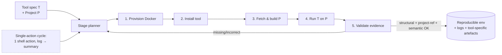
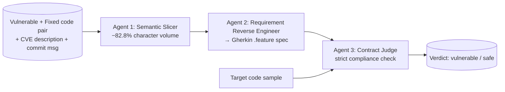

# Daily Scholar Papers Report — 2026-05-01

**[Download PDF](Daily_Papers_Report_2026-05-01.pdf)**

**Window covered:** 2026-04-30 → 2026-05-01 (Google Scholar alerts + user-curated self-emails, last 24 h)

---

## Executive Summary

A four-paper Scholar-alert day with no user-curated picks. The day's clear standout is **AnalysisAgent** (Bouzenia, Cadar, Pradel — CISPA + Imperial), which formalises *automated software analysis* as an end-to-end agentic task and presents both a benchmark (AnalysisBench: 35 tool–project pairs across AFL++, KLEE, CSA, cflow, Infer, WALA, SJK on five C/C++ and five Java projects) and a winning architecture combining staged execution, single-action cycles with log condensation, and evidence-based validation. With Gemini-3-Flash held fixed, AnalysisAgent reaches a manually verified 94 % (33/35) versus 77 % for the strongest baseline (ExecutionAgent), with a 20-percentage-point gap that holds up under Cochran-Mantel-Haenszel adjustment for backend choice. The headline reusable result is the *self-validated–vs–verified gap*: RAG-Agent reports 73 ± 7 % on GPT-5-nano while only 9 % is verified; even Mini-SWE-Agent on DeepSeek-V3.2 self-reports 100 % on a verified 57 %. This is the cleanest empirical case this year against unguarded LLM-as-judge validation, and the evidence-based success criteria (structural + project-reference + semantic) generalise as a default eval rubric for any LLM-agent system that produces analysis artefacts.

The day's two Keep papers each move along an adjacent axis. **Phoenix** (Wang & Huang, NUAA) is a training-free multi-agent vulnerability detector that addresses the *semantic ambiguity* problem on PrimeVul — that identical or near-identical code can be labelled vulnerable or safe across different CVEs in the same project — by introducing Gherkin behavioural specifications as an explicit intermediate representation. A three-stage pipeline (Semantic Slicer → Requirement Reverse Engineer → Contract Judge) reaches F1 = 0.825 and Pair-Correct = 64.4 % on PrimeVul Paired with open-source 7-14 B models, beating RASM-Vul (DeepSeek-V3 671 B, F1 = 0.668) and VulTrial (GPT-4o ×4, F1 = 0.563). Across 25 ablation configurations the Gherkin specification contributes +0.09 to +0.35 F1, and 18 % of false positives flag genuine security issues in patched code (in one case mirroring a developer's own TODO comment in QEMU's `send_control_msg`). Methodologically the takeaway is simple: a structured intermediate representation lets a 9-14 B contract verifier outperform 671 B free-form classifiers — Phoenix's authors call this an *isomorphism between problem space and solution space*.

**RealBench** (Jia Li, Ge Li and collaborators at Wuhan / Peking / NTU / Beihang) shifts the lens to repo-level code generation, arguing that benchmarks evaluating LLMs from raw natural-language requirements are misaligned with industrial practice where developers work from structured designs. RealBench pairs natural-language requirements with UML diagrams across 61 post-2024-12 GitHub repositories binned into four LOC tiers (0-500, 500-1000, 1000-2000, ≥2000), comprehensive human-verified test suites averaging 50 tests / repo and 79.76 % line coverage, and a five-metric evaluation grid (Completion@k, Execution@k, Pass@k for class level; Requirement@k and Architecture@k for repo level). The headline finding is a steep cliff: the best Pass@1 cell is 43.13 % (DeepSeek-V3, holistic, level-1) but drops below 2 % on level-4. Strategy ranking flips with size: holistic generation wins on small repos, incremental (module-by-module) wins on large ones, and RAG underperforms both above level-1 — a useful empirical counterpoint to the "RAG always wins" narrative.

The Borderline-High entry, **HEAP LOCALIZATION** (Y. Lee, S. Roh, H. Kwon, B. Lee, T. Holz), is a kernel-exploitation paper combining cache side-channel techniques with Linux-kernel heap spraying. The Scholar alert reaches us from a followed-researcher feed (Holz, CISPA) but the paper is not yet mirrored on arXiv; treatment is summary-only until a full PDF surfaces. The thematic placement — microarchitectural side-channels feeding kernel-heap exploit primitives in the face of contemporary mitigations — is squarely in the security-systems track that Holz's group has been driving for the past several years.

**Read together**, today's papers map two directions in the same architectural shift: AnalysisAgent and Phoenix both substitute *evidence-based / contract-based* validation for free-form LLM judgement, with AnalysisAgent doing it at the system-orchestration layer (artefacts + structural checks) and Phoenix doing it at the per-instance reasoning layer (Gherkin scenarios as compliance contracts). RealBench provides the design-vs-code-gen benchmark that any future *design-aware* agentic system will need to compete on; HEAP LOCALIZATION reminds us that the underlying-systems substrate on which all these agents run is itself still moving.

**Outstanding:** 1 · **Keep:** 2 · **Borderline High-Priority:** 1

The full analysis follows.

---

## Highlighted Papers

| # | Title | Authors | Venue | Link |
|---|-------|---------|-------|------|
| 4.1 | Evaluating LLM Agents on Automated Software Analysis Tasks (AnalysisAgent / AnalysisBench) | Islem Bouzenia, Cristian Cadar, Michael Pradel | arXiv 2604.11270 [cs.SE] (preprint, ACM-formatted) | [arXiv](https://arxiv.org/abs/2604.11270) |
| 5.1 | Security Is Relative: Training-Free Vulnerability Detection via Multi-Agent Behavioral Contract Synthesis (Phoenix) | Yongchao Wang, Zhiqiu Huang | arXiv 2604.19012 [cs.CR] (preprint) | [arXiv](https://arxiv.org/abs/2604.19012) |
| 5.2 | RealBench: A Repo-Level Code Generation Benchmark Aligned with Real-World Software Development Practices | Jia Li, Hongyi Deng, Yiran Zhang, Kechi Zhang, Tianqi Shao, Tiankuo Zhao, Weinan Wang, Zhi Jin, Ge Li, Yang Liu, Yingtao Fang, Yihong Dong | arXiv 2604.22659 [cs.SE] (preprint, ACM-formatted) | [arXiv](https://arxiv.org/abs/2604.22659) |
| 6.1 | HEAP LOCALIZATION: Cache Side-Channel based Linux Kernel Heap Exploit Techniques | Y. Lee, S. Roh, H. Kwon, B. Lee, T. Holz | preprint / venue track (no arXiv mirror at time of write) | [Scholar lookup](https://scholar.google.com/scholar?q=%22HEAP+LOCALIZATION%22+Cache+Side-Channel+Linux+Kernel+Holz) |

---

## Outstanding Papers (Deep-Read)

<strong>4.1</strong> · SW-ANALYSIS-AGENT · AnalysisAgent reaches 94% verified success on a 35-tool-project benchmark, exposing a 20-pp gap over the best baseline and a 30-pp gap between LLM-self-validated and manually verified success<a href="https://github.com/MarkLee131/paper-digest/issues/new?title=%5Bfeedback%5D+2026-05-01-4.1+AnalysisAgent+reaches+94%25+verified+success+on+a+35-tool-project+benchmark%2C+exposing+a+20-pp+gap+over+the+best+baseline+and+a+30-pp+gap+between+LLM-self-validated+and+manually+verified+success+%F0%9F%91%8D&body=paper_id%3A+2026-05-01-4.1%0Atitle%3A+AnalysisAgent+reaches+94%25+verified+success+on+a+35-tool-project+benchmark%2C+exposing+a+20-pp+gap+over+the+best+baseline+and+a+30-pp+gap+between+LLM-self-validated+and+manually+verified+success%0Aauthors%3A+Islem+Bouzenia+%28CISPA+Helmholtz+Center+for+Information+Security%29%2C+Cristian+Cadar+%28Imperial+College+London%29%2C+Michael+Pradel+%28CISPA+Helmholtz+Center+for+Information+Security%29%0Avenue%3A+arXiv%3A2604.11270+%5Bcs.SE%5D+%E2%80%94+preprint%2C+ACM-formatted+%28Conference%2717+placeholder%29%2C+submitted+17+Apr+2026.%0Atopic%3A+SW-ANALYSIS-AGENT%0Arating%3A+thumbs-up%0A%0A%3C%21--+Optional+notes+below+this+line+are+read+by+preferences.py+as+soft+signals.+--%3E%0A&labels=feedback%2Cthumbs-up" target="_blank" rel="noopener" class="fb-thumbs-up" title="thumbs up" onclick="event.stopPropagation()">👍</a><a href="https://github.com/MarkLee131/paper-digest/issues/new?title=%5Bfeedback%5D+2026-05-01-4.1+AnalysisAgent+reaches+94%25+verified+success+on+a+35-tool-project+benchmark%2C+exposing+a+20-pp+gap+over+the+best+baseline+and+a+30-pp+gap+between+LLM-self-validated+and+manually+verified+success+%F0%9F%AB%A5&body=paper_id%3A+2026-05-01-4.1%0Atitle%3A+AnalysisAgent+reaches+94%25+verified+success+on+a+35-tool-project+benchmark%2C+exposing+a+20-pp+gap+over+the+best+baseline+and+a+30-pp+gap+between+LLM-self-validated+and+manually+verified+success%0Aauthors%3A+Islem+Bouzenia+%28CISPA+Helmholtz+Center+for+Information+Security%29%2C+Cristian+Cadar+%28Imperial+College+London%29%2C+Michael+Pradel+%28CISPA+Helmholtz+Center+for+Information+Security%29%0Avenue%3A+arXiv%3A2604.11270+%5Bcs.SE%5D+%E2%80%94+preprint%2C+ACM-formatted+%28Conference%2717+placeholder%29%2C+submitted+17+Apr+2026.%0Atopic%3A+SW-ANALYSIS-AGENT%0Arating%3A+thumbs-down%0A%0A%3C%21--+Optional+notes+below+this+line+are+read+by+preferences.py+as+soft+signals.+--%3E%0A&labels=feedback%2Cthumbs-down" target="_blank" rel="noopener" class="fb-thumbs-down" title="less interested" onclick="event.stopPropagation()">🫥</a><a href="https://github.com/MarkLee131/paper-digest/issues/new?title=%5Bfeedback%5D+2026-05-01-4.1+AnalysisAgent+reaches+94%25+verified+success+on+a+35-tool-project+benchmark%2C+exposing+a+20-pp+gap+over+the+best+baseline+and+a+30-pp+gap+between+LLM-self-validated+and+manually+verified+success+%F0%9F%94%96&body=paper_id%3A+2026-05-01-4.1%0Atitle%3A+AnalysisAgent+reaches+94%25+verified+success+on+a+35-tool-project+benchmark%2C+exposing+a+20-pp+gap+over+the+best+baseline+and+a+30-pp+gap+between+LLM-self-validated+and+manually+verified+success%0Aauthors%3A+Islem+Bouzenia+%28CISPA+Helmholtz+Center+for+Information+Security%29%2C+Cristian+Cadar+%28Imperial+College+London%29%2C+Michael+Pradel+%28CISPA+Helmholtz+Center+for+Information+Security%29%0Avenue%3A+arXiv%3A2604.11270+%5Bcs.SE%5D+%E2%80%94+preprint%2C+ACM-formatted+%28Conference%2717+placeholder%29%2C+submitted+17+Apr+2026.%0Atopic%3A+SW-ANALYSIS-AGENT%0Arating%3A+save-for-later%0A%0A%3C%21--+Optional+notes+below+this+line+are+read+by+preferences.py+as+soft+signals.+--%3E%0A&labels=feedback%2Csave-for-later" target="_blank" rel="noopener" class="fb-save-for-later" title="save for later" onclick="event.stopPropagation()">🔖</a>

### 4.1 Evaluating LLM Agents on Automated Software Analysis Tasks

[arXiv:2604.11270](https://arxiv.org/abs/2604.11270)

**Title:** Evaluating LLM Agents on Automated Software Analysis Tasks
**Authors:** Islem Bouzenia (CISPA Helmholtz Center for Information Security), Cristian Cadar (Imperial College London), Michael Pradel (CISPA Helmholtz Center for Information Security)
**Venue:** arXiv:2604.11270 [cs.SE] — preprint, ACM-formatted (Conference'17 placeholder), submitted 17 Apr 2026.
**Year:** 2026
**Link:** <https://arxiv.org/abs/2604.11270>
**License:** ACM (publication rights licensed to ACM, copyright held by the author(s)). Original figures not embedded; pipeline and outer loop recreated in Mermaid below.

#### Objective Summary

- **Problem.** Static analysers, symbolic-execution engines, fuzzers, and profilers exist in great variety, but applying any one of them to a new open-source project is hard: environment setup, dependency resolution, tool-specific prerequisites (e.g. LLVM bitcode, Java bytecode), and validation that the analysis actually ran and produced *project-specific* outputs each contribute friction. LLM-based agents are a natural candidate, but no prior systematic study has measured their effectiveness on the *automated software analysis* task as opposed to issue-solving or generic environment construction.
- **Benchmark — AnalysisBench.** A new benchmark of 35 (tool, project) pairs spanning seven analysis tools — AFL++, KLEE, Clang Static Analyzer (CSA), cflow, Infer, WALA, SJK — and ten projects (five C/C++: curl, ImageMagick, fastfetch, masscan, radare2; five Java: Tika, Closure Compiler, Saxon-HE, JMH, Checkstyle). Each task is defined by a tool spec `T` and a target project `P` plus an execution interface (writable workspace, terminal, 5 h / $2 budget). The agent must (i) provision a Docker container, (ii) install the tool, (iii) fetch and build the target, (iv) execute the tool on the target, and (v) emit verifiable evidence that the tool processed project-specific inputs and produced tool-specific output artefacts beyond trivial things like `--help` strings.
- **Validation rubric (the key methodological contribution).** Each task is paired with a manually constructed reference setup (Dockerfile + scripts) and a reference *evidence package* (logs, key build outputs, tool-specific artefacts). Agent submissions are validated through three layers: **structural** (expected files / directories exist, e.g. KLEE's `klee-out/`, AFL++'s `queue/`), **project-reference** (logs reference project-specific paths, symbols, or build artefacts), **semantic** (tool-specific indicators of analysis progress: AFL coverage growth, KLEE path-exploration, generated call graphs, static-analysis warnings). Outliers (e.g. unusually low coverage, empty reports) are flagged for inter-author discussion.
- **Baselines and the proposed agent.** Three baselines adapted from prior work — RAG-Agent (retrieval-augmented), Mini-SWE-Agent, ExecutionAgent — are compared against **AnalysisAgent**, designed against three observed failure modes: (1) *stage mixing* (interleaving install / build / analyse steps), (2) *poor error localisation* (verbose logs obscuring root causes), (3) *premature termination* (agent declares success without artefacts). AnalysisAgent's three-axis design is **explicitly staged execution** (separate planner stages for environment, tool install, target build, analysis, validation), **single-action cycles with log condensation** (one shell action per cycle; logs are summarised before the next prompt), and **evidence-based validation** (an LLM-as-judge step that checks artefacts against the evidence rubric before claiming success).

#### Headline Numbers (verbatim where possible from §4)

- AnalysisAgent on Gemini-3-Flash: 100 ± 0 % self-validated and **94 % manually verified** (33/35) — the highest verified success rate across all (agent × LLM) cells in Table 4.
- Best baseline: ExecutionAgent on Gemini-3-Flash, 86 ± 19 % self-validated, **77 % verified** — a 17-pp gap to AnalysisAgent on the same backend.
- Average verified success across the four LLM backends (GPT-5-nano, GPT-5-mini, DeepSeek-V3.2, Gemini-3-Flash): RAG-Agent 10 %, Mini-SWE-Agent 37 %, ExecutionAgent 57 %, **AnalysisAgent 79 %**.
- Self-validated-vs-verified inflation. RAG-Agent on GPT-5-mini reports 98 ± 1 % but verifies at 6 %; Mini-SWE-Agent on DeepSeek-V3.2 reports 100 % verified at 57 %. AnalysisAgent's gap on Gemini-3-Flash is small (100 % → 94 %).
- Statistical significance. Pairwise McNemar's exact tests with Holm-Bonferroni adjustment (3 baselines × 4 LLMs at α = 0.05); AnalysisAgent significantly outperforms ExecutionAgent on all four backends at *p*adj < 0.001 for self-validated success. Cochran-Mantel-Haenszel test confirms the advantage holds across LLM choice with common odds ratios 41.4 / 11.2 / 3.1 against RAG-Agent / Mini-SWE-Agent / ExecutionAgent (all 95% CI excluding 1).
- Tool / ecosystem patterns. cflow has the highest average verified success (63 %), CSA 54 %, AFL++ 50 %; WALA the lowest (34 %). Java tasks contribute 62 % of all failures vs. 38 % for C/C++ — the gap persists across all four agents and reflects classpath / JVM / whole-program-analysis complexity.
- Failure-mode distribution (182 failing trajectories, non-exclusive categories): Docker/build failure 67, analysis-tool misuse 73, malformed LLM output 42, budget/time exhausted 34, incorrect analysis result 21. AnalysisAgent has "largely solved environment setup" — only 7 % of its failures are environment-related; the remaining failures are tool-misuse-dominated (50 %).
- Cost. Failed runs consume **2.77×** more cycles and cost **1.27×** more than successful runs; AnalysisAgent's higher success rate therefore reduces aggregate cost.

#### Methodological Reusable Ideas

1. **Three-tier evidence rubric (structural + project-reference + semantic).** Replace LLM-as-judge with a structured rubric whose checks are tool-specific but whose template is reusable; the structural-evidence layer is essentially free to define for any tool that produces conventional output directories.
2. **Single-action cycles with log condensation.** Bound the agent's per-prompt context size by deliberately truncating tool logs into structured summaries before the next planning step. The paper attributes a substantial fraction of malformed-LLM-output failures (50 % for ExecutionAgent on DeepSeek-V3.2) to verbose logs blowing up context windows.
3. **Verified-vs-self-validated as a primary eval column.** Reporting both numbers in every cell — and visualising the gap (figures show RAG-Agent ≫ Mini-SWE-Agent ≫ ExecutionAgent in inflation, with AnalysisAgent close to verified) — is a transferable pattern for any agentic-eval paper. We can adopt this in our own future agent evaluations as a default.
4. **Staged execution as a planner discipline.** Forcing the agent to keep environment, tool install, target build, analysis, and validation as separate stages avoids the "stage mixing" failure mode and provides natural checkpoints for evidence collection.

#### Outer-Loop Recreation (Mermaid)

#### Critique / Limitations

- AnalysisBench restricts target projects to standalone command-line programs with clear entry points; libraries / frameworks (which need harness construction) are explicitly out of scope. The authors flag this as a generalisability threat in §5.
- Manual verification is performed by the authors; while the rubric is precise, the labour cost limits the benchmark's growth path beyond the current 35 tasks.
- For dynamic tools (AFL++, KLEE), the agent typically sets a 30-180 s timeout per invocation, leaving the dynamic-analysis depth shallow (median AFL++ coverage 0.44 %, median KLEE 2 generated test cases). Static analysers are largely unaffected by this budget constraint, so the benchmark may favour static-analysis success.
- The 20%-pp baseline-to-AnalysisAgent gap is partially explained by AnalysisAgent's evidence-based validation acting as an extra filter on top of the same shell-action-loop substrate; a fairer ablation would equip ExecutionAgent with the same LLM-as-judge step.

---

## Keep Papers (Deep-Read)

<strong>5.1</strong> · VULN-AGENT · Phoenix lifts PrimeVul Paired F1 to 0.825 with 7-14B open-source models by treating vulnerability detection as Gherkin contract verification, beating 671B and GPT-4o multi-agent baselines<a href="https://github.com/MarkLee131/paper-digest/issues/new?title=%5Bfeedback%5D+2026-05-01-5.1+Phoenix+lifts+PrimeVul+Paired+F1+to+0.825+with+7-14B+open-source+models+by+treating+vulnerability+detection+as+Gherkin+contract+verification%2C+beating+671B+and+GPT-4o+multi-agent+baselines+%F0%9F%91%8D&body=paper_id%3A+2026-05-01-5.1%0Atitle%3A+Phoenix+lifts+PrimeVul+Paired+F1+to+0.825+with+7-14B+open-source+models+by+treating+vulnerability+detection+as+Gherkin+contract+verification%2C+beating+671B+and+GPT-4o+multi-agent+baselines%0Aauthors%3A+Yongchao+Wang%2C+Zhiqiu+Huang+%28College+of+Computer+Science+and+Technology%2C+Nanjing+University+of+Aeronautics+and+Astronautics%29%0Avenue%3A+arXiv%3A2604.19012v1+%5Bcs.CR%5D+%E2%80%94+preprint%2C+submitted+21+Apr+2026.%0Atopic%3A+VULN-AGENT%0Arating%3A+thumbs-up%0A%0A%3C%21--+Optional+notes+below+this+line+are+read+by+preferences.py+as+soft+signals.+--%3E%0A&labels=feedback%2Cthumbs-up" target="_blank" rel="noopener" class="fb-thumbs-up" title="thumbs up" onclick="event.stopPropagation()">👍</a><a href="https://github.com/MarkLee131/paper-digest/issues/new?title=%5Bfeedback%5D+2026-05-01-5.1+Phoenix+lifts+PrimeVul+Paired+F1+to+0.825+with+7-14B+open-source+models+by+treating+vulnerability+detection+as+Gherkin+contract+verification%2C+beating+671B+and+GPT-4o+multi-agent+baselines+%F0%9F%AB%A5&body=paper_id%3A+2026-05-01-5.1%0Atitle%3A+Phoenix+lifts+PrimeVul+Paired+F1+to+0.825+with+7-14B+open-source+models+by+treating+vulnerability+detection+as+Gherkin+contract+verification%2C+beating+671B+and+GPT-4o+multi-agent+baselines%0Aauthors%3A+Yongchao+Wang%2C+Zhiqiu+Huang+%28College+of+Computer+Science+and+Technology%2C+Nanjing+University+of+Aeronautics+and+Astronautics%29%0Avenue%3A+arXiv%3A2604.19012v1+%5Bcs.CR%5D+%E2%80%94+preprint%2C+submitted+21+Apr+2026.%0Atopic%3A+VULN-AGENT%0Arating%3A+thumbs-down%0A%0A%3C%21--+Optional+notes+below+this+line+are+read+by+preferences.py+as+soft+signals.+--%3E%0A&labels=feedback%2Cthumbs-down" target="_blank" rel="noopener" class="fb-thumbs-down" title="less interested" onclick="event.stopPropagation()">🫥</a><a href="https://github.com/MarkLee131/paper-digest/issues/new?title=%5Bfeedback%5D+2026-05-01-5.1+Phoenix+lifts+PrimeVul+Paired+F1+to+0.825+with+7-14B+open-source+models+by+treating+vulnerability+detection+as+Gherkin+contract+verification%2C+beating+671B+and+GPT-4o+multi-agent+baselines+%F0%9F%94%96&body=paper_id%3A+2026-05-01-5.1%0Atitle%3A+Phoenix+lifts+PrimeVul+Paired+F1+to+0.825+with+7-14B+open-source+models+by+treating+vulnerability+detection+as+Gherkin+contract+verification%2C+beating+671B+and+GPT-4o+multi-agent+baselines%0Aauthors%3A+Yongchao+Wang%2C+Zhiqiu+Huang+%28College+of+Computer+Science+and+Technology%2C+Nanjing+University+of+Aeronautics+and+Astronautics%29%0Avenue%3A+arXiv%3A2604.19012v1+%5Bcs.CR%5D+%E2%80%94+preprint%2C+submitted+21+Apr+2026.%0Atopic%3A+VULN-AGENT%0Arating%3A+save-for-later%0A%0A%3C%21--+Optional+notes+below+this+line+are+read+by+preferences.py+as+soft+signals.+--%3E%0A&labels=feedback%2Csave-for-later" target="_blank" rel="noopener" class="fb-save-for-later" title="save for later" onclick="event.stopPropagation()">🔖</a>

### 5.1 Security Is Relative: Training-Free Vulnerability Detection via Multi-Agent Behavioral Contract Synthesis (Phoenix)

[arXiv:2604.19012](https://arxiv.org/abs/2604.19012)

**Title:** Security Is Relative: Training-Free Vulnerability Detection via Multi-Agent Behavioral Contract Synthesis
**Authors:** Yongchao Wang, Zhiqiu Huang (College of Computer Science and Technology, Nanjing University of Aeronautics and Astronautics)
**Venue:** arXiv:2604.19012v1 [cs.CR] — preprint, submitted 21 Apr 2026.
**Year:** 2026
**Link:** <https://arxiv.org/abs/2604.19012>
**License:** arXiv non-exclusive distribution (default). Original figures not embedded; pipeline recreated in Mermaid below.

#### Objective Summary

- **Problem.** Recent rigorous evaluations of deep-learning vulnerability detectors on PrimeVul (ICSE 2025) revealed catastrophic degradation: models that scored F1 > 0.68 on the legacy Big-Vul dataset collapse to as low as F1 = 0.031 under strict deduplication and temporal splitting, indistinguishable from random guessing. Phoenix's authors identify the root cause as the *semantic ambiguity problem* — identical or near-identical code can be vulnerable to one CVE and patched against another, so any global classifier f(code) → {safe, vulnerable} is fundamentally mis-specified.
- **Empirical anchor for "double standard".** The paper documents 10 cross-CVE pairs in PrimeVul Paired with > 75 % code similarity and opposite labels (e.g. mruby `gen_assignment()` at 100 % similarity with one entry labelled "good" for CVE-2022-0717 and "bad" for CVE-2022-1276 under the same CWE-125; TensorFlow `FractionalAvgPoolGrad` at 99.9 % similarity with opposite labels across CVE-2021-37651 and CVE-2022-21730). This is the empirical motivation that the labelling problem is contract-relative, not just noisy.
- **Approach.** Phoenix is a training-free three-agent pipeline that treats vulnerability detection as *Behavioral Contract Synthesis* + verification:
    1. **Agent 1 — Semantic Slicer.** Reads paired (vulnerable, fixed) code plus the CVE description and commit message, identifies the diff, preserves the patched lines and strictly necessary surrounding context, and prunes boilerplate. Reduces average function length from 5 298 → 911 characters (82.8 % reduction).
    2. **Agent 2 — Requirement Reverse Engineer.** Reverse-engineers the implicit security contract that the fixed code satisfies and the vulnerable code violates, expressing it as a Gherkin `.feature` specification with explicit `Feature` and `Scenario` blocks. Prompted to be exact ("mathematically or programmatically specify the boundary condition / null-check / type verification"), to describe secure behaviour only, and to be minimal.
    3. **Agent 3 — Contract Judge.** Reads the Gherkin specification as a "Golden Standard" and decides whether a target code sample satisfies all scenarios, returning a binary verdict.
- **Why it works.** The Gherkin contract decouples the *what is a vulnerability* reasoning (Agent 2, performed once per CVE pair) from the *does this code instance comply* reasoning (Agent 3, per-sample). Agent 3 reasons against a narrow contract instead of pattern-matching against an implicit, learnt notion of "vulnerable code", which the authors frame as a Domain-Driven-Design *Bounded Context*.

#### Headline Numbers (verbatim where possible from §5)

- Three-tier ablation (RAW vs Blind vs Feature) on PrimeVul Paired with each Agent 3 model: Qwen3.5-9B 0.448 / 0.510 / **0.800** (Δ +0.351); Qwen2.5-Coder-14B 0.534 / 0.531 / 0.797 (Δ +0.263); Qwen2.5-Coder-7B 0.558 / 0.555 / 0.760 (Δ +0.203); Gemma-3-12B-IT 0.643 / 0.647 / 0.736 (Δ +0.092).
- Cross-model A2 × A3 matrix peak F1: A2 = Qwen2.5-Coder-14B paired with A3 = Qwen3.5-9B, **F1 = 0.825**, Precision = 0.792, Recall = 0.860, Pair-Correct = 275/427 (64.4 %).
- vs. published baselines on PrimeVul Paired: Phoenix 0.825 / 0.792 / 0.860 / **275 P-C** beats RASM-Vul (DeepSeek-V3 671 B) 0.668 / 0.572 / 0.802 / 93 P-C and VulTrial (GPT-4o ×4) 0.563 / 0.53 / 0.60 / 81 P-C. The Blind baseline (Qwen3.5-9B alone) at 0.510 / 85 P-C already roughly matches VulTrial; Gherkin alone delivers a 3.2× P-C improvement (85 → 275).
- Behavioural profiles (averaged over three Agent-2 models): Qwen3.5-9B = balanced (P 0.750 / R 0.856 / F1 0.798); Qwen2.5-14B = recall-dominant (P 0.688 / R 0.881 / F1 0.769); Gemma-3-12B = precision-dominant (P 0.829 / R 0.661 / F1 0.735). Useful prior when assembling contract-verification ensembles.
- Format-compliance failure mode. Llama-3.1-8B failed to produce valid `<VERDICT>` tags in 80 %+ of Agent 3 outputs while functioning adequately as Agent 2 — generating structured *content* is not the same as producing structured *output format*.
- Error analysis on the best configuration. 18 % of false positives (17/97) flag genuine security concerns in patched code — including a QEMU `send_control_msg` case where the "fixed" code carries a developer-written TODO comment acknowledging the residual gap, and a Gpac case where the patch enlarged a buffer but introduced a new overflow via unchecked `strcpy`. 73 % of false negatives (44/60) come from Agent 3 confidently concluding compliance; failure modes split into incomplete specifications (~25), surface-level boundary checking (~15), partial-match rounding (~15), architecture-level blind spots (~5).

#### Methodological Reusable Ideas

1. **Gherkin behavioural specification as intermediate representation for security reasoning.** The structured `Feature` / `Scenario` form lets a code-specialised model (Qwen2.5-Coder-14B) compile contracts and a general-purpose reasoner (Qwen3.5-9B) verify compliance, rather than asking a single model to do both. The same authors' prior Project Prometheus uses the same recipe for Automated Program Repair, indicating that Gherkin-as-IR generalises across PL/security tasks.
2. **Open-ended → closed-form reframing.** Vulnerability detection becomes "does this code satisfy this specific contract?" rather than "is this code vulnerable?". The closed form is what enables 9 B-scale models to compete with 671 B-scale free-form classifiers.
3. **Decisive-driver ablation design.** A clean three-tier (RAW / Blind / Feature) ablation identifies the Gherkin specification — not the slicing or the multi-agent decomposition itself — as the +0.09 to +0.35 F1 contributor. This is a useful template for evaluating whether each architectural axis of any multi-agent pipeline carries its weight.
4. **Strict-compliance prompting for the judge.** The Contract Judge is explicitly instructed to treat the Gherkin contract as the "Golden Standard"; this produces the precision improvement (Blind→Feature precision 0.50-0.60 → 0.69-0.87) without much movement in recall, which is the desired direction for security tooling.

#### Pipeline Recreation (Mermaid)

#### Critique / Limitations

- Evaluation is on PrimeVul Paired — a single dataset, albeit a deliberately challenging one. Generalisation to other distributions / languages is asserted but not measured; the authors flag this.
- The Gherkin specification is reverse-engineered from the *paired* (vulnerable, fixed) code, so Phoenix presumes the existence of a fix at training-spec time. In a true pre-fix detection setting (where only the vulnerable code is available) the Requirement Reverse Engineer would lose half its input signal.
- Agent 1 fails XML formatting on 8 of 435 pairs (0.9 % drop rate); the effective evaluation set is 859 of 870 samples. This is small but the authors disclose it cleanly.
- The 18 % "false positives are genuine concerns" finding is striking but rests on qualitative re-labelling of 17 cases by the authors; an independent third-party security-expert re-labelling would strengthen the claim.
- The ACM-baseline comparison uses different models (DeepSeek-V3 671 B / GPT-4o ×4) than Phoenix's open-source 7-14 B stack; the most apples-to-apples comparison would be Phoenix vs. RASM-Vul both running on Qwen2.5-Coder-14B, which the paper does not report.

<strong>5.2</strong> · CODE-GEN-BENCH · RealBench pairs UML + NL specs across 61 post-2024-12 repos in four LOC tiers; best Pass@1 is 43.13% on small repos and drops below 2% above 2000 LOC, with strategy ranking flipping at scale<a href="https://github.com/MarkLee131/paper-digest/issues/new?title=%5Bfeedback%5D+2026-05-01-5.2+RealBench+pairs+UML+%2B+NL+specs+across+61+post-2024-12+repos+in+four+LOC+tiers%3B+best+Pass%401+is+43.13%25+on+small+repos+and+drops+below+2%25+above+2000+LOC%2C+with+strategy+ranking+flipping+at+scale+%F0%9F%91%8D&body=paper_id%3A+2026-05-01-5.2%0Atitle%3A+RealBench+pairs+UML+%2B+NL+specs+across+61+post-2024-12+repos+in+four+LOC+tiers%3B+best+Pass%401+is+43.13%25+on+small+repos+and+drops+below+2%25+above+2000+LOC%2C+with+strategy+ranking+flipping+at+scale%0Aauthors%3A+Jia+Li+%28Wuhan+University%29%2C+Hongyi+Deng+%28Peking+University%29%2C+Yiran+Zhang%2A+%28Nanyang+Technological+University%29%2C+Kechi+Zhang+and+Tianqi+Shao+%28Key+Lab+of+High+Confidence+Software+Technology%2C+PKU%29%2C+Tiankuo+Zhao+%28Wuhan+University%29%2C+Weinan+Wang+%28Peking+University%29%2C+Zhi+Jin%2A+%28Wuhan+University%29%2C+Ge+Li+%28Key+Lab+of+High+Confidence+Software+Technology%2C+PKU%29%2C+Yang+Liu+%28NTU%29%2C+Yingtao+Fang+%28Wuhan+University%29%2C+Yihong+Dong+%28Key+Lab+of+High+Confidence+Software+Technology%2C+PKU%29%0Avenue%3A+arXiv%3A2604.22659v1+%5Bcs.SE%5D+%E2%80%94+preprint%2C+ACM-formatted%2C+submitted+24+Apr+2026.%0Atopic%3A+CODE-GEN-BENCH%0Arating%3A+thumbs-up%0A%0A%3C%21--+Optional+notes+below+this+line+are+read+by+preferences.py+as+soft+signals.+--%3E%0A&labels=feedback%2Cthumbs-up" target="_blank" rel="noopener" class="fb-thumbs-up" title="thumbs up" onclick="event.stopPropagation()">👍</a><a href="https://github.com/MarkLee131/paper-digest/issues/new?title=%5Bfeedback%5D+2026-05-01-5.2+RealBench+pairs+UML+%2B+NL+specs+across+61+post-2024-12+repos+in+four+LOC+tiers%3B+best+Pass%401+is+43.13%25+on+small+repos+and+drops+below+2%25+above+2000+LOC%2C+with+strategy+ranking+flipping+at+scale+%F0%9F%AB%A5&body=paper_id%3A+2026-05-01-5.2%0Atitle%3A+RealBench+pairs+UML+%2B+NL+specs+across+61+post-2024-12+repos+in+four+LOC+tiers%3B+best+Pass%401+is+43.13%25+on+small+repos+and+drops+below+2%25+above+2000+LOC%2C+with+strategy+ranking+flipping+at+scale%0Aauthors%3A+Jia+Li+%28Wuhan+University%29%2C+Hongyi+Deng+%28Peking+University%29%2C+Yiran+Zhang%2A+%28Nanyang+Technological+University%29%2C+Kechi+Zhang+and+Tianqi+Shao+%28Key+Lab+of+High+Confidence+Software+Technology%2C+PKU%29%2C+Tiankuo+Zhao+%28Wuhan+University%29%2C+Weinan+Wang+%28Peking+University%29%2C+Zhi+Jin%2A+%28Wuhan+University%29%2C+Ge+Li+%28Key+Lab+of+High+Confidence+Software+Technology%2C+PKU%29%2C+Yang+Liu+%28NTU%29%2C+Yingtao+Fang+%28Wuhan+University%29%2C+Yihong+Dong+%28Key+Lab+of+High+Confidence+Software+Technology%2C+PKU%29%0Avenue%3A+arXiv%3A2604.22659v1+%5Bcs.SE%5D+%E2%80%94+preprint%2C+ACM-formatted%2C+submitted+24+Apr+2026.%0Atopic%3A+CODE-GEN-BENCH%0Arating%3A+thumbs-down%0A%0A%3C%21--+Optional+notes+below+this+line+are+read+by+preferences.py+as+soft+signals.+--%3E%0A&labels=feedback%2Cthumbs-down" target="_blank" rel="noopener" class="fb-thumbs-down" title="less interested" onclick="event.stopPropagation()">🫥</a><a href="https://github.com/MarkLee131/paper-digest/issues/new?title=%5Bfeedback%5D+2026-05-01-5.2+RealBench+pairs+UML+%2B+NL+specs+across+61+post-2024-12+repos+in+four+LOC+tiers%3B+best+Pass%401+is+43.13%25+on+small+repos+and+drops+below+2%25+above+2000+LOC%2C+with+strategy+ranking+flipping+at+scale+%F0%9F%94%96&body=paper_id%3A+2026-05-01-5.2%0Atitle%3A+RealBench+pairs+UML+%2B+NL+specs+across+61+post-2024-12+repos+in+four+LOC+tiers%3B+best+Pass%401+is+43.13%25+on+small+repos+and+drops+below+2%25+above+2000+LOC%2C+with+strategy+ranking+flipping+at+scale%0Aauthors%3A+Jia+Li+%28Wuhan+University%29%2C+Hongyi+Deng+%28Peking+University%29%2C+Yiran+Zhang%2A+%28Nanyang+Technological+University%29%2C+Kechi+Zhang+and+Tianqi+Shao+%28Key+Lab+of+High+Confidence+Software+Technology%2C+PKU%29%2C+Tiankuo+Zhao+%28Wuhan+University%29%2C+Weinan+Wang+%28Peking+University%29%2C+Zhi+Jin%2A+%28Wuhan+University%29%2C+Ge+Li+%28Key+Lab+of+High+Confidence+Software+Technology%2C+PKU%29%2C+Yang+Liu+%28NTU%29%2C+Yingtao+Fang+%28Wuhan+University%29%2C+Yihong+Dong+%28Key+Lab+of+High+Confidence+Software+Technology%2C+PKU%29%0Avenue%3A+arXiv%3A2604.22659v1+%5Bcs.SE%5D+%E2%80%94+preprint%2C+ACM-formatted%2C+submitted+24+Apr+2026.%0Atopic%3A+CODE-GEN-BENCH%0Arating%3A+save-for-later%0A%0A%3C%21--+Optional+notes+below+this+line+are+read+by+preferences.py+as+soft+signals.+--%3E%0A&labels=feedback%2Csave-for-later" target="_blank" rel="noopener" class="fb-save-for-later" title="save for later" onclick="event.stopPropagation()">🔖</a>

### 5.2 RealBench: A Repo-Level Code Generation Benchmark Aligned with Real-World Software Development Practices

[arXiv:2604.22659](https://arxiv.org/abs/2604.22659)

**Title:** RealBench: A Repo-Level Code Generation Benchmark Aligned with Real-World Software Development Practices
**Authors:** Jia Li (Wuhan University), Hongyi Deng (Peking University), Yiran Zhang* (Nanyang Technological University), Kechi Zhang and Tianqi Shao (Key Lab of High Confidence Software Technology, PKU), Tiankuo Zhao (Wuhan University), Weinan Wang (Peking University), Zhi Jin* (Wuhan University), Ge Li (Key Lab of High Confidence Software Technology, PKU), Yang Liu (NTU), Yingtao Fang (Wuhan University), Yihong Dong (Key Lab of High Confidence Software Technology, PKU)
**Venue:** arXiv:2604.22659v1 [cs.SE] — preprint, ACM-formatted, submitted 24 Apr 2026.
**Year:** 2026
**Link:** <https://arxiv.org/abs/2604.22659>
**License:** ACM (publication rights licensed to ACM, copyright held by the author(s)). Original tables / figures not embedded.

#### Objective Summary

- **Problem.** Function-level benchmarks like HumanEval (164 examples, 11.5 LoC each, 91-93 % Pass@1) and even repo-level efforts like CODES, JavaBench, EvoCodeBench, RepoEval evaluate code generation from raw natural-language requirements. In industrial waterfall-style development, however, developers receive *structured designs* (UML diagrams, class skeletons) that have already been derived from stakeholder requirements. RealBench's claim is that this gap makes existing benchmark scores unrepresentative of the LLM's actual contribution to enterprise software development.
- **Benchmark construction.** 61 repositories from 20 popular programming domains, all created after 2024-12 to mitigate data contamination against current LLM cut-offs. Each example provides both a natural-language requirement document and a UML diagram (encoded as a JSON string for prompting). Four LOC tiers — L1 0-500 / L2 500-1000 / L3 1000-2000 / L4 ≥ 2000 — give a graded scaling test. Each repository ships with a human-verified test suite averaging 50 tests per repo at 79.76 % line coverage.
- **Three generation strategies.** *Holistic* generation produces the entire repository in one shot. *Incremental* generation walks module-by-module, providing previously-generated modules as context. *RAG* retrieves relevant Python files and prepends them; truncation is from the front of the code sequence when context windows are exceeded.
- **Five evaluation metrics, two granularities.** Class-level: Completion@k (component generation), Execution@k (component runs without error), Pass@k (component passes its tests). Repo-level: Requirement@k and Architecture@k — rubric-graded 0-4 ratings against the requirement document and against the ground-truth UML, scored by invited PhD-level developers.
- **Core formula (verbatim).** Equation (1):

    Completion / Execution / Pass@k = EProblems [ 1 − C(n−c, k) / C(n, k) ]

    where *n* is the number of solutions sampled per task and *c* is the number of correct solutions — the standard Pass@k unbiased estimator extended to the completion / execution events.

#### Headline Numbers (verbatim where possible from Table 5 and §4)

- Best (model × strategy × difficulty) Pass@1 cell: **43.13 %** — DeepSeek-V3, *Holistic*, level-1 (0-500 LOC). The next best at level-1 is GPT-4o (Holistic) at 24.28 %; Claude-Sonnet-4 at 28.65 %.
- Pass@1 cliff with size: across the average row, holistic Pass@1 drops 25.48 % (L1) → 7.30 (L2) → 16.38 (L3) → 5.81 (L4) — a non-monotonic but clearly sub-30 % regime above 500 LOC. The headline statement in the abstract is that average Pass@1 drops from over 40 % on level-1 to under 2 % on level-4 in the worst configurations.
- Strategy ranking flips with size. *Incremental* averages Pass@1 21.79 / 6.33 / **23.88** / 13.36 — outperforming Holistic on L3 and L4. *Holistic* dominates on L1 and L2. *RAG* averages 21.76 / 5.66 / 15.85 / 11.40 — below both other strategies on L3 and L4. The authors' Finding 3: *generating the entire repository at once is the best strategy on smaller repositories, while module-by-module is better on complex repositories*.
- Repo-level rubric (max 4): Architecture@1 averages stay below 3.0 across all configurations; the best cell is Gemini-2.5-Flash + RAG at L1 = 3.26. LLMs are good at *finding and creating* the modules defined in the UML (high Completion@1) but the *quality* of generated modules suffers from grammar / logic errors (lower Pass@1).
- Six evaluated LLMs, all 2024-2025 vintage: GPT-4o (May 2024, 128 K window), Claude-Sonnet-4 (May 2025, 200 K), Gemini-2.5-Flash (Apr 2025, 1.05 M), DeepSeek-V3 (Dec 2024, 671 B / 64 K), Qwen3-235B-A22B (Apr 2025, 235 B / 128 K), Qwen2.5-Coder-7B-Instruct (Nov 2024, 7 B / 128 K). Greedy decoding, single solution per task.
- Comparison vs. prior benchmarks (Table 1). RealBench is the only repository-level benchmark with `#Diag = ✓` (UML provided), `Real-R = ✓`, the largest function/class counts (2 484 functions / 544 classes / 538 files, average 1 201 LOC), repo-level metric `#Repo = ✓`, and the highest tests-per-example (50.05).

#### Methodological Reusable Ideas

1. **Architecture@k as a structured-design metric.** Rubric-graded 0-4 evaluation against ground-truth UML is more informative than a binary Pass@k for systems whose primary output is a *design* rather than a snippet. Generalises to any agentic system that emits diagrams, blueprints, or schemas.
2. **Strategy × LOC interaction as a routing signal.** The Holistic-vs-Incremental flip at the L2/L3 boundary is a candid empirical answer to "which decomposition strategy does my code-gen agent need?" — it is a function of repo size, not of model identity. Useful as a *router* condition in any code-generation orchestrator.
3. **Post-cut-off curation.** Restricting all sources to post-2024-12 GitHub repositories with hand-verified test suites is a simple, scalable recipe for keeping benchmarks honest; the data-leakage column in Table 1 makes the contrast with predecessors stark.
4. **UML-as-JSON prompting format.** UML diagrams are serialised into a JSON string and inserted via `${UML_JSON_String}`; this is a reusable representation for any agent that needs to consume a structured design without a dedicated diagram-parsing step.

#### Critique / Limitations

- Python only. The benchmark construction (system prompt: "You are a senior Python programmer familiar with Python programming and UML diagrams.") restricts generality; a Java / C++ counterpart would test whether Pass@1 cliffs replicate.
- Greedy decoding, single sample. Pass@k = Pass@1 throughout; whether higher-k regimes recover the cliff is not measured.
- Architecture / Requirement rubrics are scored by PhD-level developers on a 0-4 scale; inter-rater agreement is not reported in the headline tables we extracted, which makes the rubric-grade comparisons sensitive to scorer drift.
- The "real-world industry alignment" claim rests on the waterfall-style premise that designs precede code. Agile / TDD workflows where tests precede design are out of scope by construction.
- Benchmark-vs-tool ambiguity. RealBench is a benchmark, not a generator; downstream-impact claims depend on practitioners adopting the benchmark for evaluation, which is not measured.

---

## Borderline High-Priority Papers (Brief)

<strong>6.1</strong> · KERNEL-EXPLOIT · Cache-side-channel-driven kernel-heap exploit techniques targeting Linux against contemporary hardening — abstract-only entry, full PDF not yet on arXiv<a href="https://github.com/MarkLee131/paper-digest/issues/new?title=%5Bfeedback%5D+2026-05-01-6.1+Cache-side-channel-driven+kernel-heap+exploit+techniques+targeting+Linux+against+contemporary+hardening+%E2%80%94+abstract-only+entry%2C+full+PDF+not+yet+on+arXiv+%F0%9F%91%8D&body=paper_id%3A+2026-05-01-6.1%0Atitle%3A+Cache-side-channel-driven+kernel-heap+exploit+techniques+targeting+Linux+against+contemporary+hardening+%E2%80%94+abstract-only+entry%2C+full+PDF+not+yet+on+arXiv%0Aauthors%3A+Y.+Lee%2C+S.+Roh%2C+H.+Kwon%2C+B.+Lee%2C+T.+Holz%0Avenue%3A+preprint+%2F+venue+track+%28no+arXiv+mirror+at+time+of+write%29.%0Atopic%3A+KERNEL-EXPLOIT%0Arating%3A+thumbs-up%0A%0A%3C%21--+Optional+notes+below+this+line+are+read+by+preferences.py+as+soft+signals.+--%3E%0A&labels=feedback%2Cthumbs-up" target="_blank" rel="noopener" class="fb-thumbs-up" title="thumbs up" onclick="event.stopPropagation()">👍</a><a href="https://github.com/MarkLee131/paper-digest/issues/new?title=%5Bfeedback%5D+2026-05-01-6.1+Cache-side-channel-driven+kernel-heap+exploit+techniques+targeting+Linux+against+contemporary+hardening+%E2%80%94+abstract-only+entry%2C+full+PDF+not+yet+on+arXiv+%F0%9F%AB%A5&body=paper_id%3A+2026-05-01-6.1%0Atitle%3A+Cache-side-channel-driven+kernel-heap+exploit+techniques+targeting+Linux+against+contemporary+hardening+%E2%80%94+abstract-only+entry%2C+full+PDF+not+yet+on+arXiv%0Aauthors%3A+Y.+Lee%2C+S.+Roh%2C+H.+Kwon%2C+B.+Lee%2C+T.+Holz%0Avenue%3A+preprint+%2F+venue+track+%28no+arXiv+mirror+at+time+of+write%29.%0Atopic%3A+KERNEL-EXPLOIT%0Arating%3A+thumbs-down%0A%0A%3C%21--+Optional+notes+below+this+line+are+read+by+preferences.py+as+soft+signals.+--%3E%0A&labels=feedback%2Cthumbs-down" target="_blank" rel="noopener" class="fb-thumbs-down" title="less interested" onclick="event.stopPropagation()">🫥</a><a href="https://github.com/MarkLee131/paper-digest/issues/new?title=%5Bfeedback%5D+2026-05-01-6.1+Cache-side-channel-driven+kernel-heap+exploit+techniques+targeting+Linux+against+contemporary+hardening+%E2%80%94+abstract-only+entry%2C+full+PDF+not+yet+on+arXiv+%F0%9F%94%96&body=paper_id%3A+2026-05-01-6.1%0Atitle%3A+Cache-side-channel-driven+kernel-heap+exploit+techniques+targeting+Linux+against+contemporary+hardening+%E2%80%94+abstract-only+entry%2C+full+PDF+not+yet+on+arXiv%0Aauthors%3A+Y.+Lee%2C+S.+Roh%2C+H.+Kwon%2C+B.+Lee%2C+T.+Holz%0Avenue%3A+preprint+%2F+venue+track+%28no+arXiv+mirror+at+time+of+write%29.%0Atopic%3A+KERNEL-EXPLOIT%0Arating%3A+save-for-later%0A%0A%3C%21--+Optional+notes+below+this+line+are+read+by+preferences.py+as+soft+signals.+--%3E%0A&labels=feedback%2Csave-for-later" target="_blank" rel="noopener" class="fb-save-for-later" title="save for later" onclick="event.stopPropagation()">🔖</a>

### 6.1 HEAP LOCALIZATION: Cache Side-Channel based Linux Kernel Heap Exploit Techniques

**Title:** HEAP LOCALIZATION: Cache Side-Channel based Linux Kernel Heap Exploit Techniques
**Authors:** Y. Lee, S. Roh, H. Kwon, B. Lee, T. Holz
**Venue:** preprint / venue track (no arXiv mirror at time of write).
**Year:** 2026
**Link:** <https://scholar.google.com/scholar?q=%22HEAP+LOCALIZATION%22+Cache+Side-Channel+Linux+Kernel+Holz>
**License:** Unknown — no PDF retrieved at time of write.

#### Brief Summary

The Scholar alert positions this paper as a study of *kernel mitigations that reduce exploit success rates* and the techniques an attacker can use to compensate. The combination of authors and the title — "HEAP LOCALIZATION" + "Cache Side-Channel based Linux Kernel Heap Exploit Techniques" — places the work at the intersection of microarchitectural side-channels (cache-based leakage to localise kernel-heap object placement) and kernel-heap exploitation primitives (heap massaging / spraying against contemporary slab hardening such as randomised slab caches and CONFIG_RANDOM_KMALLOC_CACHES). T. Holz's CISPA group has been driving Linux-kernel exploit research consistently over the past several years; the alert source ("Thorsten Holz - new articles") is the followed-researcher signal that brings this paper into today's deep-read queue.

We could not retrieve a full PDF at the time of this digest run: arXiv search for "HEAP LOCALIZATION Holz" returned zero hits and dblp / Semantic Scholar were rate-limited. Treatment is therefore summary-only; we will reattempt the deep read on subsequent windows and promote the entry once a PDF surfaces. There is no preference posterior strong enough to demote (T. Holz is in `preferences.json` at n = 1 / posterior 0.6667, which is a *positive* soft signal but does not aggregate at n = 1 per SKILL.md), and no AUTHOR-LEVEL EXCLUSION conflict.

#### Why It Is Worth Watching

- Followed-researcher track record: CISPA's kernel-exploit work is consistently top-of-track at S&P / USENIX Security / CCS.
- Cache-side-channel-as-kernel-exploit-primitive is a thread that has accelerated this year (LeftoverLocals, KernHeapAlchemy, etc.); a fresh systematisation from the Holz group is high-value even if just for the related-work synthesis.
- Cross-references to today's other papers: AnalysisAgent's KLEE-on-masscan example ($0.39 in 12 min, 28 completed paths) shows agentic kernel-target reasoning is now within the cost regime where techniques like HEAP LOCALIZATION could be invoked from inside an LLM-driven exploit harness.

---

## Cross-Paper Synthesis

Two parallel themes structure today's read.

The first is *evidence-based validation* as an architectural alternative to LLM-as-judge. AnalysisAgent and Phoenix — published the same fortnight, in different sub-fields — both arrive at the same conclusion from opposite directions. AnalysisAgent attacks the system-orchestration layer and demands that an agent's success be *verified* through structural, project-reference, and semantic checks against a manually constructed evidence package; the resulting verified-vs-self-validated gap (RAG-Agent on GPT-5-mini reports 98 % but verifies at 6 %; AnalysisAgent on Gemini-3-Flash reports 100 % and verifies at 94 %) is the strongest empirical argument this year against accepting LLM-self-validation as a primary success metric. Phoenix attacks the per-sample reasoning layer and replaces "is this code vulnerable?" with "does this code satisfy this Gherkin contract?", with a 7-9 B contract verifier outperforming a 671 B free-form classifier by 16 F1 points and a multi-agent GPT-4o ensemble by 26 F1 points on PrimeVul Paired. Both papers' key claim is that the LLM is more reliable as a *constrained reasoner against a structured artefact* than as an unstructured judge.

The second is *scale dependence in code-generation pipelines*. RealBench shows that the best LLMs reach 43 % Pass@1 only on repositories below 500 LOC and crash to <10 % on repositories above 2000 LOC, with the optimal generation strategy flipping from Holistic to Incremental at the boundary. Phoenix reports an analogous flip in vulnerability detection: above a certain function size, Agent 1's Semantic Slicer (− 82.8 % character volume) is what enables Agent 3's contract-verification reasoning to fit in context. AnalysisAgent's "single-action cycles with log condensation" is a third instance of the same pattern: log volume in real software-analysis trajectories blows up the agent's context, and the answer is structural compression rather than larger windows.

The HEAP LOCALIZATION entry, even read summary-only, slots in as a reminder that all three of those agentic stacks ultimately run on a kernel substrate whose security properties are themselves still actively under research. Today's day-tracker for *evidence-based agentic systems* should not eclipse the parallel *kernel-exploit-mitigation* track that papers like HEAP LOCALIZATION continue to drive.

---

## Writing & Rationale Insights

A few observations carried over from reading today's drafts:

- **Naming the problem matters.** Phoenix's "Double Standard Problem" (formalised with concrete cross-CVE pairs and similarity numbers) and AnalysisAgent's "stage mixing / poor error localisation / premature termination" taxonomy are both examples of how giving a failure mode a name with a memorable phrase makes the rest of the paper easier to read and reuse. RealBench's choice to keep its three generation strategies as flat *Holistic / Incremental / RAG* without inventing new acronyms is a counter-example that also works.
- **Evidence-rubric papers benefit from showing the gap.** AnalysisAgent reports both self-validated and verified success rates in every cell of every table; the paper would be substantially weaker if it had reported only the verified column. RealBench likewise reports five metrics × four difficulty tiers × six models × three strategies in a single dense Table 5 and lets the reader find the strategy-flip diagonal themselves.
- **Three-tier ablations are an underused tool.** Phoenix's RAW / Blind / Feature ablation (no agents / Slicer only / Slicer+Gherkin) is the single most informative table in the paper because it answers "which architectural axis is the load-bearing one?". Most multi-agent papers run only an ablate-one-component-at-a-time grid and leave the structural ordering implicit.
- **Followed-researcher alerts continue to over-perform.** Three of today's four papers come from followed-researcher feeds (Holz, Pradel, Ge Li); the unfollowed-but-recommended Phoenix nonetheless cleared Stage-1 on methodological grounds. The followed-researcher rule is doing real work as a *floor* for the digest.
