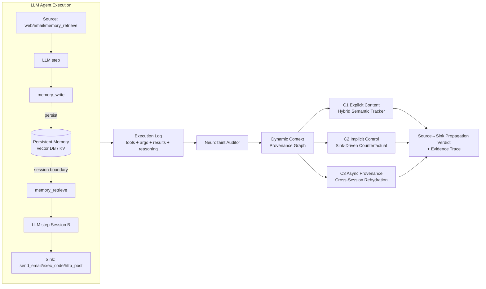

# Daily Scholar Papers Report — 2026-05-03

**[Download PDF](Daily_Papers_Report_2026-05-03.pdf)**

**Window covered:** 2026-05-02 → 2026-05-03 (Google Scholar alerts + user-curated self-emails, last 24 h)

---

## Executive Summary

Two Outstanding deep-reads today, both arriving via followed-researcher Scholar alerts (no user-curated self-emails landed inside the window). The first, **NeuroTaint** (Cai, Tang, Wen, Qin — HKUST + Xidian), reframes information-flow tracking for LLM agents around three orthogonal propagation classes — *explicit content propagation*, *implicit control influence*, and *asynchronous provenance reuse* — and ships an offline auditor built around a Dynamic Context Provenance Graph (DCPG) plus a sink-driven counterfactual analyzer. On a new 400-scenario benchmark **TaintBench** spanning 20 real-world agent frameworks (LangChain, AutoGen, CrewAI, smolagents, openai-agents, LangGraph, LlamaIndex, Mem0, AgentScope, browser-use, Skyvern, …), NeuroTaint reaches *Precision = 0.921 / Recall = 0.935 / F1 = 0.928* against IFC-style baseline FIDES at *0.505 / 0.540 / 0.522*, while adding only 0.25 s of offline audit per execution unit.

The second, **CoRE** (Gao, Peng, Qiao, … Xing, Ren — ZJU + CUHK + CSIRO Data61 + Fudan + Yale, ACL'26 Findings), challenges the standard "predict-the-output" code-reasoning evaluation with a benchmark designed around two new axes: **implementation invariance** (does the model give the same answer across functionally equivalent but stylistically distinct implementations?) and **process transparency** (does it correctly answer Arithmetic / Logic / State / Boundary intermediate-state probes, not just the final return?). Across 1,978 samples / 4.1 implementations per problem / 4.1 probes per problem, eight frontier LLMs (GPT-5, o3, Claude-4.5/3.7, DeepSeek-V3.2/R1, Gemini-2.5, Qwen-3) all expose what the authors call **superficial execution**: GPT-5's strict output accuracy *I = 84.62* collapses to a process-fidelity weight *Ws = 18.96* under Input-Output prompting, dragging the composite Reasoning Consistency Score *RCS* to 15.93. A second finding — *stylistic overfitting* — shows that each model family scores 4–10 absolute points higher on code generated by its own family (heatmap diagonal), with 1-gram Jaccard *J = 0.6* across implementations confirming surface-level lexical drift triggers the inconsistency.

Together, the two papers point in the same direction at very different layers of the LLM stack: **the unstructured LLM-as-reasoner is fragile in ways that single-instance, output-only evaluations systematically hide.** NeuroTaint solves it on the security side by replacing keyword-style taint with provenance-aware semantic+causal+temporal evidence; CoRE diagnoses it on the reasoning side by exposing the gap between final-output correctness and intermediate-state fidelity. One Skipped paper today (DL-vuln-detection saturation, Future Internet venue) is logged in the private report.

**Outstanding:** 2 · **Keep:** 0 · **Borderline High-Priority:** 0

The full analysis follows.

---

## Highlighted Papers

| # | Title | Authors | Venue | Link |
|---|-------|---------|-------|------|
| 4.1 | Ghost in the Agent: Redefining Information Flow Tracking for LLM Agents | Yuandao Cai, Wensheng Tang, Cheng Wen, Shengchao Qin | arXiv 2604.23374 [cs.CR] (preprint, 25 Apr 2026) | [arXiv](https://arxiv.org/abs/2604.23374) |
| 4.2 | CoRE: A Fine-Grained Code Reasoning Benchmark Beyond Output Prediction | Jun Gao, Yun Peng, Qian Qiao, Changhai Zhou, Yuhua Zhou, Shiyang Zhang, Shichao Weng, Zhenchang Xing, Xiaoxue Ren | arXiv 2604.25399 [cs.SE] · ACL'26 Findings | [arXiv](https://arxiv.org/abs/2604.25399) |

---

## Outstanding Papers (Deep-Read)

<strong>4.1</strong> · TAINT-LLM-AGENT · NeuroTaint reframes LLM-agent taint analysis around three propagation classes (explicit / implicit-control / async-memory) and reaches F1 = 0.928 vs FIDES 0.522 on a new 400-scenario, 20-framework TaintBench, with 0.25 s audit overhead per execution unit<a href="https://github.com/MarkLee131/paper-digest/issues/new?title=%5Bfeedback%5D+2026-05-03-4.1+NeuroTaint+reframes+LLM-agent+taint+analysis+around+three+propagation+classes+%28explicit+%2F+implicit-control+%2F+async-memory%29+and+reaches+F1+%3D+0.928+vs+FIDES+0.522+on+a+new+400-scenario%2C+20-framework+TaintBench%2C+with+0.25+s+audit+overhead+per+execution+unit+%F0%9F%91%8D&body=paper_id%3A+2026-05-03-4.1%0Atitle%3A+NeuroTaint+reframes+LLM-agent+taint+analysis+around+three+propagation+classes+%28explicit+%2F+implicit-control+%2F+async-memory%29+and+reaches+F1+%3D+0.928+vs+FIDES+0.522+on+a+new+400-scenario%2C+20-framework+TaintBench%2C+with+0.25+s+audit+overhead+per+execution+unit%0Aauthors%3A+Yuandao+Cai%2C+Wensheng+Tang+%28The+Hong+Kong+University+of+Science+and+Technology%29%3B+Cheng+Wen%2C+Shengchao+Qin+%28Xidian+University%29.%0Avenue%3A+arXiv%3A2604.23374v1+%5Bcs.CR%5D+%E2%80%94+preprint%2C+ACM-formatted+%28Conference%2717+placeholder+header%29%2C+submitted+25+Apr+2026.%0Atopic%3A+TAINT-LLM-AGENT%0Arating%3A+thumbs-up%0A%0A%3C%21--+Optional+notes+below+this+line+are+read+by+preferences.py+as+soft+signals.+--%3E%0A&labels=feedback%2Cthumbs-up" target="_blank" rel="noopener" class="fb-thumbs-up" title="thumbs up" onclick="event.stopPropagation()">👍</a><a href="https://github.com/MarkLee131/paper-digest/issues/new?title=%5Bfeedback%5D+2026-05-03-4.1+NeuroTaint+reframes+LLM-agent+taint+analysis+around+three+propagation+classes+%28explicit+%2F+implicit-control+%2F+async-memory%29+and+reaches+F1+%3D+0.928+vs+FIDES+0.522+on+a+new+400-scenario%2C+20-framework+TaintBench%2C+with+0.25+s+audit+overhead+per+execution+unit+%F0%9F%AB%A5&body=paper_id%3A+2026-05-03-4.1%0Atitle%3A+NeuroTaint+reframes+LLM-agent+taint+analysis+around+three+propagation+classes+%28explicit+%2F+implicit-control+%2F+async-memory%29+and+reaches+F1+%3D+0.928+vs+FIDES+0.522+on+a+new+400-scenario%2C+20-framework+TaintBench%2C+with+0.25+s+audit+overhead+per+execution+unit%0Aauthors%3A+Yuandao+Cai%2C+Wensheng+Tang+%28The+Hong+Kong+University+of+Science+and+Technology%29%3B+Cheng+Wen%2C+Shengchao+Qin+%28Xidian+University%29.%0Avenue%3A+arXiv%3A2604.23374v1+%5Bcs.CR%5D+%E2%80%94+preprint%2C+ACM-formatted+%28Conference%2717+placeholder+header%29%2C+submitted+25+Apr+2026.%0Atopic%3A+TAINT-LLM-AGENT%0Arating%3A+thumbs-down%0A%0A%3C%21--+Optional+notes+below+this+line+are+read+by+preferences.py+as+soft+signals.+--%3E%0A&labels=feedback%2Cthumbs-down" target="_blank" rel="noopener" class="fb-thumbs-down" title="less interested" onclick="event.stopPropagation()">🫥</a><a href="https://github.com/MarkLee131/paper-digest/issues/new?title=%5Bfeedback%5D+2026-05-03-4.1+NeuroTaint+reframes+LLM-agent+taint+analysis+around+three+propagation+classes+%28explicit+%2F+implicit-control+%2F+async-memory%29+and+reaches+F1+%3D+0.928+vs+FIDES+0.522+on+a+new+400-scenario%2C+20-framework+TaintBench%2C+with+0.25+s+audit+overhead+per+execution+unit+%F0%9F%94%96&body=paper_id%3A+2026-05-03-4.1%0Atitle%3A+NeuroTaint+reframes+LLM-agent+taint+analysis+around+three+propagation+classes+%28explicit+%2F+implicit-control+%2F+async-memory%29+and+reaches+F1+%3D+0.928+vs+FIDES+0.522+on+a+new+400-scenario%2C+20-framework+TaintBench%2C+with+0.25+s+audit+overhead+per+execution+unit%0Aauthors%3A+Yuandao+Cai%2C+Wensheng+Tang+%28The+Hong+Kong+University+of+Science+and+Technology%29%3B+Cheng+Wen%2C+Shengchao+Qin+%28Xidian+University%29.%0Avenue%3A+arXiv%3A2604.23374v1+%5Bcs.CR%5D+%E2%80%94+preprint%2C+ACM-formatted+%28Conference%2717+placeholder+header%29%2C+submitted+25+Apr+2026.%0Atopic%3A+TAINT-LLM-AGENT%0Arating%3A+save-for-later%0A%0A%3C%21--+Optional+notes+below+this+line+are+read+by+preferences.py+as+soft+signals.+--%3E%0A&labels=feedback%2Csave-for-later" target="_blank" rel="noopener" class="fb-save-for-later" title="save for later" onclick="event.stopPropagation()">🔖</a>

### 4.1 Ghost in the Agent: Redefining Information Flow Tracking for LLM Agents

[arXiv:2604.23374](https://arxiv.org/abs/2604.23374)

**Title:** Ghost in the Agent: Redefining Information Flow Tracking for LLM Agents
**Authors:** Yuandao Cai, Wensheng Tang (The Hong Kong University of Science and Technology); Cheng Wen, Shengchao Qin (Xidian University).
**Venue:** arXiv:2604.23374v1 [cs.CR] — preprint, ACM-formatted (Conference'17 placeholder header), submitted 25 Apr 2026.
**Year:** 2026
**Link:** <https://arxiv.org/abs/2604.23374>
**License:** arXiv non-exclusive distribution. Original figures not embedded; pipeline recreated in Mermaid below.
**Source:** Scholar alert ("Cheng Wen — new articles" + "Shengchao Qin — new articles", both 2026-05-02 15:00 UTC).

#### Objective Summary

- **Problem.** Existing IFC-style defenses for LLM agents (FIDES, Task Shield, …) are designed around runtime label propagation over deterministic program states. They miss three classes of information flow that matter for prompt-injection / tool-misuse attacks but cannot be expressed in lexical-anchor or single-session terms: (C1) *explicit content propagation through semantic transformations* — the LLM paraphrases / summarises / translates the source payload before it reaches the sink; (C2) *implicit control influence* — the source content never appears in the sink arguments but counterfactually changes whether or which sink is called (e.g. a "policy email" that triggers `forward_to_attacker` without being quoted); (C3) *asynchronous provenance reuse* — the source enters memory in Session A and the sink fires in Session B, with the propagation path split across a vector-DB / key-value-store boundary that drops runtime-local IFC labels.
- **Approach.** **NeuroTaint** is a *provenance-oriented offline auditor* that ingests the full execution log (user prompts, intermediate LLM reasoning traces, tool execution records, memory operations) after-the-fact and reconstructs source→sink provenance via three coordinated components.
  - **Dynamic Context Provenance Graph (DCPG).** A persistent graph that records how source content enters the agent context, flows through tool calls and memory operations, persists lineage across storage boundaries, and rehydrates that lineage when stored content is later retrieved. The DCPG is the time-extended provenance backbone for all three flow classes.
  - **Sink-Time Explicit Content Propagation Analysis (C1).** A hybrid semantic tracker over DCPG that combines lexical anchors with embedding-based semantic similarity, so paraphrases / summaries / translations of the source payload still match.
  - **Sink-Time Implicit Control Influence Analysis (C2).** A *Sink-Driven Causal Analyzer* that perturbs or removes the candidate source lineage and asks the auditor LLM whether the sink decision would still occur — counterfactual evidence that the recovered lineage actually effected the action.
  - **Asynchronous Provenance Reuse (C3).** Memory writes/reads are first-class DCPG events: taint state is serialised across sessions, and `load_state()` / `memory_retrieve` rehydrates lineage so a Session-A source can be reconnected to a Session-B sink.
- **Evaluation.** Built **TaintBench** — a 400-scenario benchmark spanning 20 real-world agent frameworks (gpt-researcher, AutoGen, CrewAI, smolagents, openai-agents, LangGraph, LlamaIndex, LangChain-Memory, Mem0, Semantic Kernel, PydanticAI, Google ADK, Haystack, Letta, AgentScope, Agno, CAMEL, MetaGPT, browser-use, Skyvern). Comparison against **FIDES**, an IFC-style baseline. Cross-benchmark transfer checks on InjecAgent and ToolEmu under their native unsafe-action labels.

#### Formal Definitions (verbatim from §3)

The paper formalises the agent execution as a step sequence

$$\Pi = s_1, s_2, \ldots, s_n,$$

where each step $s_i = \langle \text{tool}_i, \text{args}_i, \text{result}_i \rangle$ records the tool called, its arguments, and the value it returned (NeuroTaint, Eq. unnumbered, §3.2).

Three definitions anchor the propagation taxonomy:

- **Definition 4 (Explicit Content Propagation).** From source event $s_i$ to sink event $s_j$ ($i < j$): a fragment of $\text{result}_i$ is *present or semantically recoverable* in $\text{args}_j$ — direct reuse, partial lexical overlap, or meaning-preserving rewriting all qualify (NeuroTaint, Definition 4).
- **Definition 5 (Implicit Control Influence).** $\text{result}_i$ counterfactually influences whether or which sink is invoked, but no fragment of $\text{result}_i$ is semantically present in $\text{args}_j$. Formally, with $\Pi'$ the execution in which $\text{result}_i$ is replaced by neutral content $\varepsilon$, implicit control influence holds when

  $$\text{tool}_j \notin \Pi' \quad \text{or} \quad \text{args}_j^{\Pi'} \neq \text{args}_j^{\Pi}$$

  (NeuroTaint, Definition 5).
- **Definition 6 (Asynchronous Provenance Reuse).** Source event $s_i$ and sink event $s_j$ belong to different agent sessions or are separated by a persistent-memory boundary; the path requires at least one intermediate memory-access step $s_k$ with $\text{tool}_k \in \mathcal{M}$ (the memory-access tool set) and the taint label of $s_i$ must be persisted across the boundary to be recovered at $s_{k^+}$ (NeuroTaint, Definition 6).

The three classes are orthogonal along four properties (NeuroTaint, Table 2): data-visible-in-sink-args (E ✔ / I ✗ / A ✔/✗), single-session-trace (E ✔ / I ✔ / A ✗), counterfactual-evidence-needed (E ✗ / I ✔ / A ✗), persistent-state-required (E ✗ / I ✗ / A ✔). The orthogonality is what justifies the three separate analyzers — each class needs a different evidence type.

#### Headline Numbers (verbatim where possible from §5)

- **TaintBench overall (400 scenarios, 20 frameworks):** NeuroTaint *Precision 0.921 / Recall 0.935 / F1 = 0.928* vs FIDES *0.505 / 0.540 / 0.522* — a +0.406 absolute F1 gap on the propagation-detection task that is aligned with the design intent (NeuroTaint, Table 4).
- **TaintBench per-framework (Table 4 highlights).** F1 = 1.000 on AutoGen, smolagents, openai-agents, LangGraph (FIDES 0.824, 0.560, 0.560, 0.889 respectively). On Mem0 — the most challenging cross-session memory framework — NeuroTaint scores F1 = 0.824 (Recall 0.700) vs FIDES 0.444. On Google ADK, AgentScope, browser-use, Skyvern, FIDES emits *zero* positive predictions (precision/F1 undefined, R = 0.000); NeuroTaint sustains F1 ≥ 0.909 on all four.
- **Stage-level recall on the 200 propagation-positive scenarios (Table 5).** Canary exact match 1.000 (FIDES 0.600), string provenance 1.000 (0.800), semantic explicit evidence 0.882 (0.471), multi-fragment coverage 1.000 (0.400), sink-driven counterfactual 0.925 (0.425). Semantic-explicit is both the largest bucket (85 / 200) and the dominant remaining recall loss; sink-driven counterfactual is the second-largest contribution and is where the +0.500 recall over FIDES is most concentrated.
- **Cross-benchmark (Table 3, native unsafe-action labels).** InjecAgent-base 1.000 / 0.989 / 0.994 (FIDES 1.000 / 0.985 / 0.993). InjecAgent-enhanced 1.000 / 1.000 / 1.000 (FIDES 1.000 / 0.997 / 0.999). ToolEmu (filtered 79-case injection-like subset) 0.623 / 0.974 / 0.760 — tied with FIDES because the metric still follows ToolEmu's broader unsafe-action labels rather than provenance-specific relabeling.
- **Auditing cost (RQ4, §5.5).** Audit adds 0.25 s per execution unit on average on the gpt-4.1-mini TaintBench run. Sink-driven causal analysis invokes the auditor-side LLM only when needed; among cases with available token traces, queries average 457 tokens.
- **Execution-model effect (Table 6).** NeuroTaint recovers most of the unsafe propagations even when the underlying execution model is upgraded; the gap to FIDES persists across gpt-4.1, claude-sonnet-4-6, claude-opus-4-6 — better execution models reduce some unsafe attempts before they reach the sink, but **do not replace provenance analysis**.
- **Judge-cascade (Table 7).** Layering an additional unsafe-action judge on top of NeuroTaint-flagged candidates yields *Unsafe P / R / F1 = up to 1.000 / 0.895 / 0.945* across the 400-scenario benchmark — NeuroTaint surfaces 203 candidates of which 187 are propagation positives.

#### Failure Boundary (RQ3, §5.4)

NeuroTaint misses 13 of 200 propagation-positive scenarios on TaintBench and raises 16 false alarms in the 400-scenario run. Three failure clusters:

1. **Semantic attenuation (10 false negatives):** seven semantic multi-hop cases, two cross-session / cross-agent rehydration cases, one semantic-boundary stress case. Repeated paraphrase or delayed memory rehydration preserves the source signal only indirectly, falling below the operating threshold.
2. **Causal ambiguity (3 false negatives):** sink-driven counterfactual analysis cases where tainted content changes the sink invocation through control mediation or indirect redirection while the final sink arguments expose little stable lexical or semantic evidence — boundary of black-box counterfactual attribution.
3. **Provenance over-attribution (16 false positives):** topical-overlap or prior-knowledge controls near the decision boundary; sink output remains topically close to the tainted source or recoverable from general model priors but should not count as genuine source-to-sink propagation under benchmark semantics.

By contrast, FIDES produces 106 false positives and 92 false negatives — its FPs are dominated by non-propagating overlap controls (it treats any source–sink path as strong evidence of propagation), and its FNs span semantic, coverage, trusted-source, cross-session, and implicit-control settings that lexical IFC labels cannot capture.

#### Methodological Reusable Ideas

1. **The three-class propagation taxonomy itself.** Explicit / implicit-control / async-memory is the cleanest decomposition of "what can go wrong in LLM-agent information flow" the literature has produced so far. It generalises beyond NeuroTaint's auditor — any agent-side IFC system can be evaluated against the same axes, and any new defence proposal should be expected to label which class(es) it targets.
2. **Counterfactual sink-time analysis as the implicit-control evidence.** Replacing $\text{result}_i$ with neutral content $\varepsilon$ and asking the auditor LLM whether the sink decision would still occur is a deployable test, not a theoretical construct. It works because the auditor LLM does not need to introspect the agent's weights — only re-evaluate the sink decision under perturbed context. This is the most reusable individual mechanism in the paper.
3. **DCPG persistence across session boundaries.** First-class memory-write / memory-retrieve events plus a `save_state` / `load_state` taint serialiser is the right primitive for closing the cross-session gap — and it is independent of the underlying memory backend (Mem0, vector DB, key-value store).
4. **Auditor-side LLM as an "on-demand" component, not a per-step oracle.** The 457-token, 0.25 s per execution unit cost is what makes the auditor deployable; sink-driven causal analysis is invoked only when explicit evidence is absent. This staging discipline is worth copying.
5. **TaintBench framework matrix as a reproducibility template.** 20 frameworks × 20 scenarios each, with three label classes (explicit / implicit / async) tagged per scenario, is a directly reusable evaluation structure for any future agent-IFC paper. Per-framework breakdown (Table 4) — not just aggregate F1 — is what surfaces the FIDES-emits-zero-positives failure on Google ADK / AgentScope / browser-use / Skyvern.

#### Pipeline Recreation (Mermaid)

#### Critical Reading

- **Comparison-set narrowness.** FIDES is the only IFC-style baseline; LLM-as-judge baselines for unsafe-action classification are reported on InjecAgent / ToolEmu but not adapted to the propagation labels. A comparison against, say, Task Shield on TaintBench would tighten the evaluation.
- **TaintBench is the authors' own benchmark.** Construction details and label-quality controls live in Appendix B (Table 10 family-level breakdown). The +0.406 F1 gap is large, but the benchmark labels are aligned with the design — see the §5.2 disclaimer that the rows in Table 3 "are not label-identical tasks and should not be read as a single cross-benchmark leaderboard". The InjecAgent / ToolEmu cross-benchmark numbers (where labels are external) show NeuroTaint matching FIDES rather than dominating it — that is the right cross-check to keep in mind.
- **Threshold-sensitivity reporting (§5.6 + Fig. 4) is well done.** Six panels each varying one threshold over five rounded values, with default red-dashed line — this is the right way to show that the 0.928 F1 is not a hand-tuned operating-point coincidence.
- **What the paper does not claim.** Multi-modal attacks (adversarial image patches) and semantic steganography (Unicode homoglyphs) are explicitly out of scope (§3.1) — important for any future system that wants to consume NeuroTaint's design.

<strong>4.2</strong> · CODE-REASONING · CoRE exposes superficial execution and stylistic overfitting across 8 frontier LLMs — GPT-5's I = 84.62 strict-output collapses to Ws = 18.96 process fidelity (RCS = 15.93) under IO prompting; OpenAI models score 98.18 on own-family code vs 71.96 cross-family<a href="https://github.com/MarkLee131/paper-digest/issues/new?title=%5Bfeedback%5D+2026-05-03-4.2+CoRE+exposes+superficial+execution+and+stylistic+overfitting+across+8+frontier+LLMs+%E2%80%94+GPT-5%27s+I+%3D+84.62+strict-output+collapses+to+Ws+%3D+18.96+process+fidelity+%28RCS+%3D+15.93%29+under+IO+prompting%3B+OpenAI+models+score+98.18+on+own-family+code+vs+71.96+cross-family+%F0%9F%91%8D&body=paper_id%3A+2026-05-03-4.2%0Atitle%3A+CoRE+exposes+superficial+execution+and+stylistic+overfitting+across+8+frontier+LLMs+%E2%80%94+GPT-5%27s+I+%3D+84.62+strict-output+collapses+to+Ws+%3D+18.96+process+fidelity+%28RCS+%3D+15.93%29+under+IO+prompting%3B+OpenAI+models+score+98.18+on+own-family+code+vs+71.96+cross-family%0Aauthors%3A+Jun+Gao%2C+Yuhua+Zhou%2C+Xiaoxue+Ren%2A+%28corresponding%29+%28School+of+Software+Technology%2C+Zhejiang+University%29%3B+Yun+Peng+%28Chinese+University+of+Hong+Kong%29%3B+Qian+Qiao+%28Independent%29%3B+Changhai+Zhou%2C+Shichao+Weng+%28Fudan+University%29%3B+Shiyang+Zhang+%28Yale+University%29%3B+Zhenchang+Xing+%28CSIRO%27s+Data61%29.%0Avenue%3A+ACL%2726+Findings+%C2%B7+arXiv%3A2604.25399v1+%5Bcs.SE%5D%2C+submitted+28+Apr+2026.%0Atopic%3A+CODE-REASONING%0Arating%3A+thumbs-up%0A%0A%3C%21--+Optional+notes+below+this+line+are+read+by+preferences.py+as+soft+signals.+--%3E%0A&labels=feedback%2Cthumbs-up" target="_blank" rel="noopener" class="fb-thumbs-up" title="thumbs up" onclick="event.stopPropagation()">👍</a><a href="https://github.com/MarkLee131/paper-digest/issues/new?title=%5Bfeedback%5D+2026-05-03-4.2+CoRE+exposes+superficial+execution+and+stylistic+overfitting+across+8+frontier+LLMs+%E2%80%94+GPT-5%27s+I+%3D+84.62+strict-output+collapses+to+Ws+%3D+18.96+process+fidelity+%28RCS+%3D+15.93%29+under+IO+prompting%3B+OpenAI+models+score+98.18+on+own-family+code+vs+71.96+cross-family+%F0%9F%AB%A5&body=paper_id%3A+2026-05-03-4.2%0Atitle%3A+CoRE+exposes+superficial+execution+and+stylistic+overfitting+across+8+frontier+LLMs+%E2%80%94+GPT-5%27s+I+%3D+84.62+strict-output+collapses+to+Ws+%3D+18.96+process+fidelity+%28RCS+%3D+15.93%29+under+IO+prompting%3B+OpenAI+models+score+98.18+on+own-family+code+vs+71.96+cross-family%0Aauthors%3A+Jun+Gao%2C+Yuhua+Zhou%2C+Xiaoxue+Ren%2A+%28corresponding%29+%28School+of+Software+Technology%2C+Zhejiang+University%29%3B+Yun+Peng+%28Chinese+University+of+Hong+Kong%29%3B+Qian+Qiao+%28Independent%29%3B+Changhai+Zhou%2C+Shichao+Weng+%28Fudan+University%29%3B+Shiyang+Zhang+%28Yale+University%29%3B+Zhenchang+Xing+%28CSIRO%27s+Data61%29.%0Avenue%3A+ACL%2726+Findings+%C2%B7+arXiv%3A2604.25399v1+%5Bcs.SE%5D%2C+submitted+28+Apr+2026.%0Atopic%3A+CODE-REASONING%0Arating%3A+thumbs-down%0A%0A%3C%21--+Optional+notes+below+this+line+are+read+by+preferences.py+as+soft+signals.+--%3E%0A&labels=feedback%2Cthumbs-down" target="_blank" rel="noopener" class="fb-thumbs-down" title="less interested" onclick="event.stopPropagation()">🫥</a><a href="https://github.com/MarkLee131/paper-digest/issues/new?title=%5Bfeedback%5D+2026-05-03-4.2+CoRE+exposes+superficial+execution+and+stylistic+overfitting+across+8+frontier+LLMs+%E2%80%94+GPT-5%27s+I+%3D+84.62+strict-output+collapses+to+Ws+%3D+18.96+process+fidelity+%28RCS+%3D+15.93%29+under+IO+prompting%3B+OpenAI+models+score+98.18+on+own-family+code+vs+71.96+cross-family+%F0%9F%94%96&body=paper_id%3A+2026-05-03-4.2%0Atitle%3A+CoRE+exposes+superficial+execution+and+stylistic+overfitting+across+8+frontier+LLMs+%E2%80%94+GPT-5%27s+I+%3D+84.62+strict-output+collapses+to+Ws+%3D+18.96+process+fidelity+%28RCS+%3D+15.93%29+under+IO+prompting%3B+OpenAI+models+score+98.18+on+own-family+code+vs+71.96+cross-family%0Aauthors%3A+Jun+Gao%2C+Yuhua+Zhou%2C+Xiaoxue+Ren%2A+%28corresponding%29+%28School+of+Software+Technology%2C+Zhejiang+University%29%3B+Yun+Peng+%28Chinese+University+of+Hong+Kong%29%3B+Qian+Qiao+%28Independent%29%3B+Changhai+Zhou%2C+Shichao+Weng+%28Fudan+University%29%3B+Shiyang+Zhang+%28Yale+University%29%3B+Zhenchang+Xing+%28CSIRO%27s+Data61%29.%0Avenue%3A+ACL%2726+Findings+%C2%B7+arXiv%3A2604.25399v1+%5Bcs.SE%5D%2C+submitted+28+Apr+2026.%0Atopic%3A+CODE-REASONING%0Arating%3A+save-for-later%0A%0A%3C%21--+Optional+notes+below+this+line+are+read+by+preferences.py+as+soft+signals.+--%3E%0A&labels=feedback%2Csave-for-later" target="_blank" rel="noopener" class="fb-save-for-later" title="save for later" onclick="event.stopPropagation()">🔖</a>

### 4.2 CoRE: A Fine-Grained Code Reasoning Benchmark Beyond Output Prediction

[arXiv:2604.25399](https://arxiv.org/abs/2604.25399) · [Download PDF](../../papers/CoRE_Gao_2026.pdf) · [GitHub](https://github.com/ZJUSig/CoRE)

**Title:** CoRE: A Fine-Grained Code Reasoning Benchmark Beyond Output Prediction
**Authors:** Jun Gao, Yuhua Zhou, Xiaoxue Ren* (corresponding) (School of Software Technology, Zhejiang University); Yun Peng (Chinese University of Hong Kong); Qian Qiao (Independent); Changhai Zhou, Shichao Weng (Fudan University); Shiyang Zhang (Yale University); Zhenchang Xing (CSIRO's Data61).
**Venue:** ACL'26 Findings · arXiv:2604.25399v1 [cs.SE], submitted 28 Apr 2026.
**Year:** 2026
**Link:** <https://arxiv.org/abs/2604.25399>
**License:** **CC BY 4.0** (arXiv-displayed). Original figures embeddable with attribution.
**Source:** Scholar alert ("Zhenchang Xing — new articles", 2026-05-02 15:00 UTC).

#### Objective Summary

- **Problem.** Existing code-reasoning benchmarks (CruxEval, LiveCodeBench-O, REval) evaluate LLMs on a *single canonical implementation* per problem and primarily score *final output correctness*. This leaves two critical aspects underexplored: (1) *implementation invariance* — does the model maintain consistency across functionally equivalent but stylistically distinct implementations? — and (2) *process transparency* — does it correctly reason about intermediate execution states, not just the final return?
- **Approach.** CoRE is a 1,978-sample benchmark constructed in two stages.
  - **Stage I — Constructing Diverse Code Implementations.** From an aggregate pool of 164 HumanEval + 880 LiveCodeBench problems, seven diverse LLMs $\mathcal{M}$ generate solutions, formulating $\mathcal{S} = \{s \mid s \sim m(p), \forall p \in \mathcal{P}, \forall m \in \mathcal{M}\}$ — 7,308 candidate implementations across 1,044 unique problems. After execution-verification, lexical-similarity deduplication, and expert verification, the curated benchmark contains **60 coding problems with 4.1 implementations each (255 unique implementations total)**, average 1-gram Jaccard $J = 0.6$ across implementations (lower = more diverse), 7.8 test cases per problem, and average cyclomatic complexity 5.0.
  - **Stage II — Formulating Intermediate State Probes.** Five LLMs synthesise probing questions targeting intermediate execution states across **four reasoning dimensions**: *Arithmetic* (numerical precision), *Logic* (boolean / branching evaluation), *State* (cumulative variable tracking), *Boundary* (loop-exit / off-by-one). 4.1 probes per problem on average; each probe covers 2.2 dimensions on average.
- **Metrics.** Three quantitative + one consistency metric.
  - *Strict Output Consistency* $I$: fraction of problems where the model's output is correct on every single one of the 4.1 implementations.
  - *Soft Implementation Score* $I_s$: average per-implementation accuracy.
  - *Strict Fidelity Indicator* $W \in \{0, 1\}$: 1 if and only if the model answers all intermediate probes correctly ($W_s = 1$).
  - *Process Fidelity Weight* $W_s(P) = \frac{\sum_{(q_i, a_i) \in Q_P} \mathbb{1}(M(q_i, P) = a_i)}{|Q_P|}$ — the fraction of probes correctly answered.
  - *Reasoning Consistency Score* $\text{RCS}(P) = I \times W_s$ — the composite that "ensures any failure in implementation invariance nullifies the final score, while scaling that score by the depth of its internal execution probing" (CoRE, Eq. 9).

#### Headline Numbers (verbatim where possible from §5.2 / Table 1)

- **The headline gap — *superficial execution* on GPT-5 under IO prompting:** $I = 84.62$ (strict output) / $W_s = 18.96$ (process fidelity) → $\text{RCS} = 15.93$. The model "often hallucinates intermediate states despite generating correct final answers" (CoRE, §5.2).
- **CoT mostly fixes the gap on top-tier models.** GPT-5 IO → CoT: $W_s$ 18.96 → 64.93, $\text{RCS}$ 15.93 → 55.75 (+39.82 absolute). o3 IO → CoT: $W_s$ 9.73 → 67.60, $\text{RCS}$ 8.90 → 54.25. CoC and RHDA give incremental further gains; RHDA-2 is the best overall reasoning baseline (GPT-5 RCS = 58.48; o3 RCS = 59.16).
- **Smaller / older / open-source models show weaker recovery.** Qwen-3 IO $W_s = 0$ across the board ($W_s$ caps at 22.20 even under RHDA-2). Claude-3.7 IO $\text{RCS} = 6.81$ (lifts to 42.77 under RHDA-2). Gemini-2.5 IO $W_s = 27.73$ (lifts to 64.54 under RHDA-2). The lift varies across families — RHDA helps Claude family most (+34 RCS), Qwen-3 least.
- **Stylistic overfitting (Fig. 5 heatmap).** OpenAI models score $I_s$ = **98.18** on OpenAI-generated implementations vs **71.96** on Qwen-generated ones — a 26-point own-family premium. DeepSeek scores 91.54 on DeepSeek code vs 76.23 on Qwen. Claude scores 94.12 on Claude code, 70.12 on Qwen. The diagonal is pronounced across all five families. With Jaccard $J = 0.6$ across implementations, surface-level lexical drift is enough to trigger the inconsistency.
- **Dimensional challenges (Table 2, IO column).** GPT-5 Arithmetic = 11.11, o3 Arithmetic = 9.26 — *the Arithmetic dimension exposes a severe lack of numerical precision*. Boundary is uniformly the easiest dimension (47.17 average across models under IO). CoT lifts Arithmetic dramatically for top models (GPT-5 11.11 → 68.52, o3 9.26 → 77.78) but barely moves the needle for Qwen-3 (11.11 → 18.52). Boundary remains the easiest dimension under CoT and CoC as well.
- **Benchmark scale comparison (Fig. 2, right).** CoRE: 1,978 samples / 7.8 tests/instance / 4.3 implementations/problem / Jaccard $J = 0.6$ / cyclomatic complexity 5.0 / 4.1 intermediate probes. CruxEval: 800 / 1.0 / 1.0 / 1.0 / 2.4 / no probes. LiveCodeBench-O: 478 / 5.2 / 1.0 / 1.0 / 4.1 / no probes. REval: 955 / 6.4 / 1.0 / 1.0 / 4.0 / 3.0 probes. CoRE is uniquely the only benchmark with multiple implementations per problem and the lowest Jaccard similarity.

#### Methodological Reusable Ideas

1. **The implementation-invariance axis itself.** Every evaluation result for an LLM-on-code task should now be reportable along (canonical) and (multi-implementation) axes. The 26-point own-family premium under $I_s$ is a damning result for benchmarks that report only canonical-implementation scores — a model can look 30 points better than it actually is on the cross-family case. This is directly applicable to our own slicing-detector evals: we should generate paraphrased implementations of the same vulnerability and check that the verdict is invariant.
2. **The four-dimension intermediate-probe schema (Arithmetic / Logic / State / Boundary).** Cleanly separable, each one diagnoses a different failure mode. Arithmetic is the cheapest one to add to any code-reasoning eval and exposes the largest model-tier gap (GPT-5 IO $W_s = 11.11$ on Arithmetic, vs Claude-4.5 68.52 on Arithmetic — *Claude is dramatically better at intermediate arithmetic under IO, even though GPT-5 wins at final output*).
3. **The composite RCS score $\text{RCS} = I \times W_s$.** Multiplying strict output correctness by process fidelity is the right design choice when both are necessary — a model that gets the output right by accident gets credit for the output but pays the full Ws penalty. This is a generalisable pattern for any benchmark that wants to penalise shortcut reasoning without fully discarding correct-output instances.
4. **The construction pipeline (Stage I + II) is reusable.** Seven LLMs to generate, execution-verification + lexical-Jaccard deduplication + expert verification to curate. The 7,308 → 255 funnel ratio is the right mental model for how aggressive curation needs to be to reach the $J = 0.6$ diversity target.
5. **Heatmap-based family-bias visualisation (Fig. 5).** Reporting LLM-on-LLM-generated-code scores as a heatmap with diagonal-emphasis annotations (rank-1 red, rank-2 gold) makes the stylistic-overfitting story visually unmistakable. We should adopt this visualisation any time we evaluate LLMs on artefacts produced by other LLMs.

#### Critical Reading

- **The 60-coding-problem core may be small for some claims.** The 1,978 samples are 60 problems × 4.1 implementations × 8 LLMs × multiple prompts; the underlying problem diversity is bounded by the 60 selected problems. The 4.1 implementations and 4.1 probes per problem are what keep the benchmark non-trivial despite the small base.
- **The "CoT mostly fixes it" finding has nuance.** RHDA-2 lifts GPT-5 $\text{RCS}$ from 15.93 (IO) to 58.48 — a 3.7× gain. But the strict-fidelity rate $W$ remains at 0.33 (column "Cons." in Table 1): only one in three problems is answered consistently across implementations *and* with all probes correct. This is the right number to quote when arguing that "code reasoning is solved" is premature.
- **Stylistic-overfitting interpretation is suggestive but underspecified.** The diagonal pattern is consistent with style-conditioning at training time, but could also reflect data-distribution overlap (own family's training data more similar to own family's generated code). The paper notes the pattern, does not attempt a causal disentangling — fair scope, but worth flagging for any downstream use.
- **Cross-citation potential.** The "structured-rubric beats free-form" thread of yesterday's reports (AnalysisAgent, Phoenix, VulWeaver) gets a complementary diagnostic from CoRE: when you *do* want free-form LLM reasoning over code, CoRE shows you what gets lost — process fidelity and cross-implementation consistency. The two threads point at the same underlying problem from opposite directions.

---

## Cross-Paper Synthesis

The two Outstanding papers today share a single observation at very different layers of the LLM stack: **the unstructured, single-instance, output-only evaluation systematically masks LLM fragility, and the fix in both cases is to add an orthogonal evidence dimension that the unstructured pipeline cannot game.**

| Layer | Paper | Hidden failure mode | Orthogonal dimension added |
|---|---|---|---|
| Security / IFC | NeuroTaint | Lexical-anchor IFC misses paraphrased / counterfactual / cross-session propagation (FIDES recall = 0.540) | Three propagation classes (explicit-semantic, implicit-control via counterfactual perturbation, async via DCPG persistence) |
| Reasoning / Eval | CoRE | Single-canonical-implementation + output-only scoring hides superficial execution + stylistic overfitting (GPT-5 I = 84.62 / Ws = 18.96) | Implementation invariance (multi-implementation $I$ vs $I_s$) + process transparency (intermediate probes $W_s$) |

In both cases, the *measured* baseline gap is roughly 0.4 absolute (NeuroTaint's +0.406 F1 over FIDES; CoRE's $I - W_s$ gap of 65.66 points for GPT-5 IO). And in both cases, the orthogonal dimension changes which model wins: NeuroTaint changes which framework looks "secure" (Google ADK / AgentScope / browser-use go from "FIDES emits zero positives" to F1 ≥ 0.91); CoRE changes which model looks best at code reasoning (GPT-5 wins on $I = 84.62$ but Claude-4.5 wins on Arithmetic $W_s = 68.52$ vs GPT-5's 11.11 under IO).

A second, more methodological convergence: **the auditor / probe is staged on top of the running system rather than replacing it.** NeuroTaint's auditor is offline, post-hoc, and 0.25 s per execution unit — it does not block the agent's interactive path. CoRE's intermediate probes are added on top of the canonical-output evaluation, not replacing it (the $I$ score is still reported alongside $W_s$). The "additive evidence" pattern is cheaper to deploy than rebuilding the underlying system, and it is the same architectural choice the structured-rubric papers made earlier in the week: layer the discipline on top, do not retrain the LLM.

A third thread, less universal: **counterfactual reasoning is becoming a first-class evidence type.** NeuroTaint's Sink-Driven Causal Analyzer perturbs $\text{result}_i$ → $\varepsilon$ and re-asks the sink question; CoRE's stylistic-overfitting heatmap is effectively a counterfactual over implementation style. We should expect more papers in the next quarter to use counterfactual perturbation as the second-stage evidence after lexical/standard evaluation has been exhausted.

---

## Writing & Rationale Insights

NeuroTaint's writing is unusually disciplined for a 2026 LLM-security preprint: the introduction's three-Case framing (C1 / C2 / C3) is mirrored by Definitions 4 / 5 / 6, the three-component approach (DCPG + Explicit-Content Tracker + Sink-Driven Counterfactual), and the per-class Recall analysis in Table 5. The reader can trace each problem statement to a definition, an architectural component, an evaluation row, and a failure cluster — each with the same naming convention. We should adopt this *single-naming-axis-throughout* discipline whenever a paper introduces a taxonomy in the introduction; the alternative (introducing the taxonomy in §1, abandoning it in §3, re-naming the components in §4) is a much more common 2026 failure mode.

A specific writerly device worth lifting: **Table 2's orthogonality grid** — four properties × three classes, with explicit ✔ / ✗ / ✔/✗ entries — converts a verbal taxonomy into a one-glance correctness check. Any time we introduce a $k$-class decomposition we should be able to produce the analogous grid. If the rows fail to discriminate, the decomposition is probably collapsible.

CoRE's rhetorical move is more conventional but very effective: the paper builds the "superficial execution" finding by *contradiction within a single number* — GPT-5's $I = 84.62$ and $W_s = 18.96$ — and then the entire paper is organised around explaining that contradiction. Single-number-contradictions are uniquely persuasive in benchmark papers because they require no methodological novelty to *understand*, only to *fix*. We should look for the corresponding single-number-contradiction in our own benchmark designs before we write the introduction.

Finally, the **figure-vs-table allocation** in CoRE is a useful template. Fig. 5 is a heatmap because the story is geometric (diagonal vs off-diagonal). Table 1 is a table because the story is per-cell (which prompting method × which model). Fig. 2 is a scatter because the story is comparative-against-existing-benchmarks. The medium follows the message — not the other way around.
