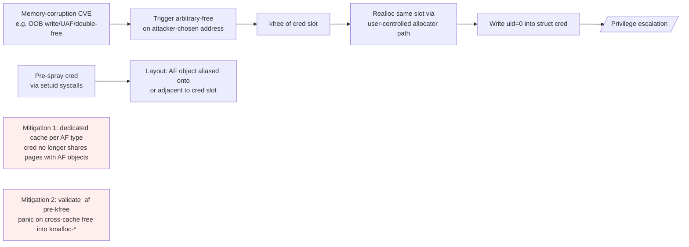
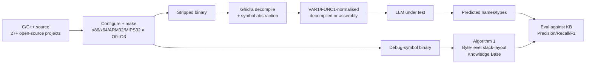

# Daily Scholar Papers Report — 2026-05-06

**[Download PDF](Daily_Papers_Report_2026-05-06.pdf)**

**Window covered:** 2026-05-05 → 2026-05-06 (Google Scholar alerts + user-curated self-emails, last 24 h)

---

## Executive Summary

Two Outstanding deep-reads land today, the second of which is the day's user-curated pick. **DirtyFree** (Lee, Kwon, Holz — Max Planck Institute for Security and Privacy + Theori, NDSS 2026) collapses the three-stage Data-Oriented Programming exploit chain — heap-leak / arbitrary-address-read / arbitrary-address-write — into a *single* arbitrary-free primitive. Building a systematic catalogue of 14 arbitrary-free objects across "most kernel caches", the authors evaluate against 31 real-world Linux v6.8 CVEs and successfully escalate privileges on **24/31**, of which **10 require no information leak at all** because partial-pointer-overwrites suffice to land the single-step exploit. Two complementary defences — per-type dedicated-cache isolation and a `kfree` cache-validation guard — block all 24 working exploits at 0.28% / -0.55% systemd geomean overhead, with the LMbench latency table neutral across syscall, read, write, fork+execve, UNIX-sock, UDP, TCP. The threat model deliberately *includes* SLAB-virtual (so cross-cache attacks are out), and DirtyCred is shown to handle 14/31 versus DirtyFree's 24, with the gap concentrated on double-frees and the `kmalloc-8192` case (CVE-2023-3611).

The second Outstanding is **REBench** (Won, Jin, Ma, Lin — Ohio State + UMass Amherst, AIWare 2026; arXiv extended version is the Stage-2 source), a fair-by-construction benchmark for LLM-on-stripped-binary type/name recovery that materialises **29.94 million lines of decompiled x64 code** alone (plus x86, ARM-32, MIPS-32, optimisation levels O0–O3) under a single normalised input format, and — most usefully — a *byte-level stack-layout knowledge base* that lets the framework reconstruct ground-truth names and types without leaking debug-symbol shortcuts back into the LLM input. The headline finding is the same kind of cross-paper inconsistency that today's other arXiv preprint (Crypto-Rust, see Keep below) shows for crypto code: SymGen reports F1 = 0.351 on x64 reproducing AsmDepictor while AsmDepictor itself reports 0.05 under the matched comparison and 0.715 on its own dataset — an order-of-magnitude floor-vs-ceiling spread that REBench's normalised pipeline directly attacks.

The two Keep papers — **NvRec** (Matsuda, Machida, Lo — Tsukuba + SMU, EASE 2026) on N-version filtering for tail-API recommendation, and **Crypto-Rust** (Elsayed, Fulton, Yang — UTSA, EASE 2026 SecurEng workshop) on empirical crypto-correctness of LLM-generated Rust — both target evaluation-discipline gaps in LLM-for-code more than they advance core methodology, and are summarised below.

**Outstanding:** 2 · **Keep:** 2 · **Borderline High-Priority:** 0

The full analysis follows.

---

## Highlighted Papers

| # | Title | Authors | Venue | Link |
|---|-------|---------|-------|------|
| 6.1 | DirtyFree: Simplified Data-Oriented Programming in the Linux Kernel | Yoochan Lee, Hyuk Kwon, Thorsten Holz | NDSS 2026 (paper f527) | [NDSS](https://www.ndss-symposium.org/ndss-paper/dirtyfree-simplified-data-oriented-programming-in-the-linux-kernel/) |
| 6.2 | REBench: A Procedural, Fair-by-Construction Benchmark for LLMs on Stripped-Binary Types and Names | Jun Yeon Won, Xin Jin, Shiqing Ma, Zhiqiang Lin | AIWare 2026 · arXiv 2604.27319 | [arXiv](https://arxiv.org/abs/2604.27319) |
| 6.3 | Tail-aware N-version Machine Learning Models for Reliable API Recommendation | Aoi Matsuda, Fumio Machida, David Lo | EASE 2026 · arXiv 2604.27647 | [arXiv](https://arxiv.org/abs/2604.27647) |
| 6.4 | An Empirical Security Evaluation of LLM-Generated Cryptographic Rust Code | Mohamed Elsayed, Kenneth Fulton, Jeong Yang | EASE 2026 SecurEng Workshop · arXiv 2604.27001 | [arXiv](https://arxiv.org/abs/2604.27001) |

---

## Outstanding Papers (Deep-Read)

<details class="paper-card" markdown>
<summary><strong>6.1</strong> · <span class="topic-chip">KERNEL-DOP</span> · [USER-PICK] DirtyFree compresses the 3-stage DOP chain (heap-leak / AAR / AAW) into a single arbitrary-free primitive — 14 catalogued AF objects, 24/31 real-world Linux 6.8 CVEs exploited (10 with zero info-leak), and two cache-isolation/validation mitigations stop all 24 at 0.28% / -0.55% overhead<span class="feedback-buttons"><a href="https://github.com/MarkLee131/paper-digest/issues/new?title=%5Bfeedback%5D+2026-05-06-6.1+%5BUSER-PICK%5D+DirtyFree+compresses+the+3-stage+DOP+chain+%28heap-leak+%2F+AAR+%2F+AAW%29+into+a+single+arbitrary-free+primitive+%E2%80%94+14+catalogued+AF+objects%2C+24%2F31+real-world+Linux+6.8+CVEs+exploited+%2810+with+zero+info-leak%29%2C+and+two+cache-isolation%2Fvalidation+mitigations+stop+all+24+at+0.28%25+%2F+-0.55%25+overhead+%F0%9F%91%8D&body=paper_id%3A+2026-05-06-6.1%0Atitle%3A+%5BUSER-PICK%5D+DirtyFree+compresses+the+3-stage+DOP+chain+%28heap-leak+%2F+AAR+%2F+AAW%29+into+a+single+arbitrary-free+primitive+%E2%80%94+14+catalogued+AF+objects%2C+24%2F31+real-world+Linux+6.8+CVEs+exploited+%2810+with+zero+info-leak%29%2C+and+two+cache-isolation%2Fvalidation+mitigations+stop+all+24+at+0.28%25+%2F+-0.55%25+overhead%0Aauthors%3A+Yoochan+Lee%2C+Thorsten+Holz+%28Max+Planck+Institute+for+Security+and+Privacy%29%3B+Hyuk+Kwon+%28Theori%2C+Inc.%29.%0Avenue%3A+Network+and+Distributed+System+Security+Symposium+%28NDSS%29+2026%2C+paper+f527.%0Atopic%3A+KERNEL-DOP%0Arating%3A+thumbs-up%0A%0A%3C%21--+Optional+notes+below+this+line+are+read+by+preferences.py+as+soft+signals.+--%3E%0A&labels=feedback%2Cthumbs-up" target="_blank" rel="noopener" class="fb-thumbs-up" title="thumbs up" onclick="event.stopPropagation()">👍</a><a href="https://github.com/MarkLee131/paper-digest/issues/new?title=%5Bfeedback%5D+2026-05-06-6.1+%5BUSER-PICK%5D+DirtyFree+compresses+the+3-stage+DOP+chain+%28heap-leak+%2F+AAR+%2F+AAW%29+into+a+single+arbitrary-free+primitive+%E2%80%94+14+catalogued+AF+objects%2C+24%2F31+real-world+Linux+6.8+CVEs+exploited+%2810+with+zero+info-leak%29%2C+and+two+cache-isolation%2Fvalidation+mitigations+stop+all+24+at+0.28%25+%2F+-0.55%25+overhead+%F0%9F%AB%A5&body=paper_id%3A+2026-05-06-6.1%0Atitle%3A+%5BUSER-PICK%5D+DirtyFree+compresses+the+3-stage+DOP+chain+%28heap-leak+%2F+AAR+%2F+AAW%29+into+a+single+arbitrary-free+primitive+%E2%80%94+14+catalogued+AF+objects%2C+24%2F31+real-world+Linux+6.8+CVEs+exploited+%2810+with+zero+info-leak%29%2C+and+two+cache-isolation%2Fvalidation+mitigations+stop+all+24+at+0.28%25+%2F+-0.55%25+overhead%0Aauthors%3A+Yoochan+Lee%2C+Thorsten+Holz+%28Max+Planck+Institute+for+Security+and+Privacy%29%3B+Hyuk+Kwon+%28Theori%2C+Inc.%29.%0Avenue%3A+Network+and+Distributed+System+Security+Symposium+%28NDSS%29+2026%2C+paper+f527.%0Atopic%3A+KERNEL-DOP%0Arating%3A+thumbs-down%0A%0A%3C%21--+Optional+notes+below+this+line+are+read+by+preferences.py+as+soft+signals.+--%3E%0A&labels=feedback%2Cthumbs-down" target="_blank" rel="noopener" class="fb-thumbs-down" title="less interested" onclick="event.stopPropagation()">🫥</a><a href="https://github.com/MarkLee131/paper-digest/issues/new?title=%5Bfeedback%5D+2026-05-06-6.1+%5BUSER-PICK%5D+DirtyFree+compresses+the+3-stage+DOP+chain+%28heap-leak+%2F+AAR+%2F+AAW%29+into+a+single+arbitrary-free+primitive+%E2%80%94+14+catalogued+AF+objects%2C+24%2F31+real-world+Linux+6.8+CVEs+exploited+%2810+with+zero+info-leak%29%2C+and+two+cache-isolation%2Fvalidation+mitigations+stop+all+24+at+0.28%25+%2F+-0.55%25+overhead+%F0%9F%94%96&body=paper_id%3A+2026-05-06-6.1%0Atitle%3A+%5BUSER-PICK%5D+DirtyFree+compresses+the+3-stage+DOP+chain+%28heap-leak+%2F+AAR+%2F+AAW%29+into+a+single+arbitrary-free+primitive+%E2%80%94+14+catalogued+AF+objects%2C+24%2F31+real-world+Linux+6.8+CVEs+exploited+%2810+with+zero+info-leak%29%2C+and+two+cache-isolation%2Fvalidation+mitigations+stop+all+24+at+0.28%25+%2F+-0.55%25+overhead%0Aauthors%3A+Yoochan+Lee%2C+Thorsten+Holz+%28Max+Planck+Institute+for+Security+and+Privacy%29%3B+Hyuk+Kwon+%28Theori%2C+Inc.%29.%0Avenue%3A+Network+and+Distributed+System+Security+Symposium+%28NDSS%29+2026%2C+paper+f527.%0Atopic%3A+KERNEL-DOP%0Arating%3A+save-for-later%0A%0A%3C%21--+Optional+notes+below+this+line+are+read+by+preferences.py+as+soft+signals.+--%3E%0A&labels=feedback%2Csave-for-later" target="_blank" rel="noopener" class="fb-save-for-later" title="save for later" onclick="event.stopPropagation()">🔖</a></span></summary>

### 6.1 DirtyFree: Simplified Data-Oriented Programming in the Linux Kernel

[NDSS 2026 paper page](https://www.ndss-symposium.org/ndss-paper/dirtyfree-simplified-data-oriented-programming-in-the-linux-kernel/) · [PDF](https://www.ndss-symposium.org/wp-content/uploads/2026-f527-paper.pdf) · [Slides](https://www.ndss-symposium.org/wp-content/uploads/f0527-lee-slides.pdf) · [GitHub](https://github.com/MPI-SysSec/DirtyFree)

**Title:** DirtyFree: Simplified Data-Oriented Programming in the Linux Kernel
**Authors:** Yoochan Lee, Thorsten Holz (Max Planck Institute for Security and Privacy); Hyuk Kwon (Theori, Inc.).
**Venue:** Network and Distributed System Security Symposium (NDSS) 2026, paper f527.
**Year:** 2026
**Link:** <https://www.ndss-symposium.org/ndss-paper/dirtyfree-simplified-data-oriented-programming-in-the-linux-kernel/>
**License:** NDSS proceedings (publisher copyright; not redistributed locally — official PDF linked above).
**Source:** User-curated self-email forwarded 2026-05-05 08:22 UTC (subject "Paper", body link to author copy).

#### Objective Summary

- **Problem.** With Kernel Control-Flow Integrity (KCFI) and SLAB-virtual deployed, control-flow hijacking and temporal cross-cache attacks are largely closed. Data-Oriented Programming (DOP) is the natural substitute, but **traditional DOP imposes three independent primitives** — (i) heap-address leak, (ii) arbitrary address read (AAR), (iii) arbitrary address write (AAW) — each requiring a kernel object satisfying disjoint structural constraints (e.g., AAR needs a copy-out path; AAW needs a `copy_from_user` sink). Almost no real-world vulnerability is strong enough to satisfy all three simultaneously.
- **Approach.** Replace the three-primitive chain with **one** primitive: *arbitrary free* — forced deallocation of an attacker-named address. Building this requires (a) systematically enumerating *arbitrary-free objects* (kernel objects whose `kfree` site can be steered to a user-controlled pointer) across all kernel caches, and (b) a privilege-escalation strategy that pairs an AF primitive with `cred`-spraying so that freeing the right slot lands a user-controllable allocation atop a `cred` and the next syscall lifts UID to 0.
- **Threat model (deliberately conservative).** SLAB-virtual is **enabled** (so temporal cross-cache attacks are out of scope, matching Google kernelCTF). Vulnerabilities and AF objects must both be reachable to an unprivileged user. Cross-cache *free* (vs. cross-cache *reuse*) is what DirtyFree exploits, and its mitigation #2 closes that exact channel.
- **Two contributed mitigations.**
  - **#1 Per-type isolation.** Move every AF object into a dedicated cache (`kmem_cache_create` for static-sized; `kmem_buckets_create` via the SLAB-bucket facility for dynamic-sized). AF objects can no longer share pages with the vulnerable object, so the "alias an AF object onto the vuln slot" geometry is impossible.
  - **#2 `kfree` cache validation.** Insert a `validate_af` step before `kfree` that walks `virt_to_slab(obj)->slab_cache->name` and panics on a cross-cache free into `"kmalloc-*"`. This breaks the cross-cache *free* channel even when AF objects remain in general caches.

#### Headline Numbers (verbatim where possible from §VI–§VII)

- **AF object catalogue.** *"We successfully identified 14 arbitrary free objects covering most kernel caches"* — quoting the abstract verbatim. The catalogue spans general kmalloc-* caches; dedicated caches are excluded by the unprivileged-allocatability filter.
- **Exploit success.** *"thereby successfully exploiting 24 of them"* on the dataset of 31 real-world Linux v6.8 CVEs — the abstract phrasing combined with §VI's "achieved privilege escalation on 24 out of 31 vulner­abilities". Among the 24, **10 require no information leak** because they support partial-pointer overwrites and DirtyFree completes in a single step.
- **Comparison with prior DOP techniques.** Traditional DOP applies to *6/31* (only six vulns satisfy all three primitive constraints simultaneously). DirtyCred applies to *14/31* (fails on `kmalloc-8192` for CVE-2023-3611 and on every double-free under SLAB-virtual). DirtyFree is the only technique that handles double-free vulnerabilities under the SLAB-virtual threat model.
- **Mitigation security.** All 24 previously-exploitable CVEs are blocked by either #1 or #2 alone — *"deploying either one is enough to prevent exploitation"* (§VII).
- **Mitigation cost (Table III, geomean of three workload classes).** systemd-analyze kernel-init: +4.55% (#1) / +1.24% (#2); user-init: +0.40% / +0.10%; geomean +2.46% / +0.67%. LMbench latencies are within ±3% across syscall (+1.52% / +0.75%), read (-0.20% / -2.85%), write (-1.98% / -1.77%), fork+execve (+0.41% / +0.50%), UDP (-0.28% / +2.36%), TCP (-0.23% / +0.22%). The abstract's "0.28% and -0.55%" headline number is the LMbench-aggregate; both signs are within noise.
- **Single-step exploits (the most surprising operational claim).** "*This overwrite capability enables DirtyFree to complete the exploitation in a single step without relying on any address disclosure*" — applies to the 10 vulns supporting partial-pointer overwrites of the AF object, eliminating the heap-leak prerequisite that even DirtyCred still typically needs.

#### Formal Setup (paraphrased — the paper does not publish a numbered theorem, only structural conditions in §IV.A)

The paper enumerates **two structural exploitability conditions** for an arbitrary-free object $o$:

1. $o$ must be allocatable by an unprivileged user process (so the attacker can position it adjacent to or aliased with the vuln object).
2. $o$ must reach a `kfree(p)` site where $p$ is a *non-local* (heap- or list-stored), attacker-controllable pointer field — i.e., the pointer survives function return so that overwriting it causes a later `kfree` of attacker-chosen memory rather than crashing the allocating syscall.

If either condition is missing, $o$ is *unsuitable*. Local-stack-stored pointers — the largest pruned class — fail condition 2 because their lifetime ends before the attacker can racing-arrange the overwrite.

For privilege escalation, the AF primitive plus *cred*-spray gives a roughly four-step landing: spray `struct cred` (selectively, ensuring the targeted cache contains *only* `cred` and AF objects so that aliased pages are usable) → trigger AF on the slot occupied by a `cred` → reallocate that slot from a user-controllable allocation path → write `uid = 0`. The §V case studies for CVE-2024-53141, CVE-2024-39503, and the double-free family illustrate three distinct AF-acquiring paths: pointer-overwrite OOB, read-side pointer offset, and double-free aliasing.

#### Methodological Reusable Ideas

1. **Compress multi-stage DOP chains by *finding the single most-leveraged primitive* and indexing the kernel against it.** "AAR + AAW + heap-leak" is conceptually neat but operationally rare; "AF" is a less obviously-named primitive but is *common* once you systematically search for kernel objects whose `kfree` site reaches a non-local attacker-influenced pointer. The same lens applies to user-space DOP and to other privileged-process settings — the framing is *"what's the smallest primitive count and what objects realise it?"*, not *"how do we satisfy the canonical AAR/AAW chain?"*.
2. **Quantify exploit techniques against a real CVE bench, not synthetic primitives.** The 6 / 14 / 24 split across Traditional DOP / DirtyCred / DirtyFree on the same 31-CVE benchmark is what makes the "DOP simplification" claim defensible. Future kernel-exploit-technique papers should be expected to publish on the same axis.
3. **Mitigation Section VII as a research deliverable, not a courtesy.** Both #1 (per-type cache isolation) and #2 (kfree validation) are 50–80 line patches against Linux v6.8 with measured negligible overhead. The author-supplied PoC for *both* the attacks and the mitigations on a public GitHub repo turns the paper into a reusable artefact for kernel-security teaching and downstream defence research.
4. **Threat-model honesty.** Including SLAB-virtual *as deployed* in the threat model and showing DirtyCred's failure on double-frees under that constraint — instead of comparing under a weaker baseline — is the kind of evaluation discipline that lifts the DirtyFree result above the rest of the cross-cache exploit literature.

#### Pipeline Recreation (Mermaid)



#### Critical Reading

- **The 14 / 24 / 31 numbers are inevitably a snapshot of Linux v6.8.** The catalogue grows monotonically over kernel versions; the *evaluated* CVE count is an empirical observation, not a worst-case bound. The methodology is what generalises — re-running on each LTS kernel is the natural follow-up.
- **Two mitigations, two failure modes.** #1 introduces additional caches and slightly worsens kernel-init time (+4.55%); #2 adds a per-`kfree` cache-name string check on a hot path. Production deployment likely picks #2 over #1 for cost reasons but #1 is the strictly stronger isolation.
- **DirtyCred-as-baseline is the right comparison.** DirtyFree's clearest contribution is on double-free CVEs and on objects in `kmalloc-8192`, where DirtyCred fails under SLAB-virtual. The 6 → 24 jump from Traditional DOP is the headline; the 14 → 24 jump over DirtyCred is the more methodologically informative one.
- **Closing line.** From §IX (verbatim, single sentence): *"DirtyFree provides a systematic method for identifying suitable arbitrary free objects across diverse kernel caches and presents a structured exploitation strategy targeting security-critical objects such as cred."*

</details>

<details class="paper-card" markdown>
<summary><strong>6.2</strong> · <span class="topic-chip">LLM-BINARY-RE</span> · REBench standardises LLM-on-stripped-binary type/name recovery: 29.94 M lines of x64 decompiled code under a byte-level stack-layout KB; resolves order-of-magnitude cross-paper F1 swings (SymGen 0.351 vs AsmDepictor 0.05 vs 0.715 self-report)<span class="feedback-buttons"><a href="https://github.com/MarkLee131/paper-digest/issues/new?title=%5Bfeedback%5D+2026-05-06-6.2+REBench+standardises+LLM-on-stripped-binary+type%2Fname+recovery%3A+29.94+M+lines+of+x64+decompiled+code+under+a+byte-level+stack-layout+KB%3B+resolves+order-of-magnitude+cross-paper+F1+swings+%28SymGen+0.351+vs+AsmDepictor+0.05+vs+0.715+self-report%29+%F0%9F%91%8D&body=paper_id%3A+2026-05-06-6.2%0Atitle%3A+REBench+standardises+LLM-on-stripped-binary+type%2Fname+recovery%3A+29.94+M+lines+of+x64+decompiled+code+under+a+byte-level+stack-layout+KB%3B+resolves+order-of-magnitude+cross-paper+F1+swings+%28SymGen+0.351+vs+AsmDepictor+0.05+vs+0.715+self-report%29%0Aauthors%3A+Jun+Yeon+Won%2C+Xin+Jin%2C+Zhiqiang+Lin+%28Ohio+State%29%3B+Shiqing+Ma+%28UMass+Amherst%29.%0Avenue%3A+AIWare+2026+%28extended+version+on+arXiv+2604.27319v1%2C+submitted+30+Apr+2026%29.%0Atopic%3A+LLM-BINARY-RE%0Arating%3A+thumbs-up%0A%0A%3C%21--+Optional+notes+below+this+line+are+read+by+preferences.py+as+soft+signals.+--%3E%0A&labels=feedback%2Cthumbs-up" target="_blank" rel="noopener" class="fb-thumbs-up" title="thumbs up" onclick="event.stopPropagation()">👍</a><a href="https://github.com/MarkLee131/paper-digest/issues/new?title=%5Bfeedback%5D+2026-05-06-6.2+REBench+standardises+LLM-on-stripped-binary+type%2Fname+recovery%3A+29.94+M+lines+of+x64+decompiled+code+under+a+byte-level+stack-layout+KB%3B+resolves+order-of-magnitude+cross-paper+F1+swings+%28SymGen+0.351+vs+AsmDepictor+0.05+vs+0.715+self-report%29+%F0%9F%AB%A5&body=paper_id%3A+2026-05-06-6.2%0Atitle%3A+REBench+standardises+LLM-on-stripped-binary+type%2Fname+recovery%3A+29.94+M+lines+of+x64+decompiled+code+under+a+byte-level+stack-layout+KB%3B+resolves+order-of-magnitude+cross-paper+F1+swings+%28SymGen+0.351+vs+AsmDepictor+0.05+vs+0.715+self-report%29%0Aauthors%3A+Jun+Yeon+Won%2C+Xin+Jin%2C+Zhiqiang+Lin+%28Ohio+State%29%3B+Shiqing+Ma+%28UMass+Amherst%29.%0Avenue%3A+AIWare+2026+%28extended+version+on+arXiv+2604.27319v1%2C+submitted+30+Apr+2026%29.%0Atopic%3A+LLM-BINARY-RE%0Arating%3A+thumbs-down%0A%0A%3C%21--+Optional+notes+below+this+line+are+read+by+preferences.py+as+soft+signals.+--%3E%0A&labels=feedback%2Cthumbs-down" target="_blank" rel="noopener" class="fb-thumbs-down" title="less interested" onclick="event.stopPropagation()">🫥</a><a href="https://github.com/MarkLee131/paper-digest/issues/new?title=%5Bfeedback%5D+2026-05-06-6.2+REBench+standardises+LLM-on-stripped-binary+type%2Fname+recovery%3A+29.94+M+lines+of+x64+decompiled+code+under+a+byte-level+stack-layout+KB%3B+resolves+order-of-magnitude+cross-paper+F1+swings+%28SymGen+0.351+vs+AsmDepictor+0.05+vs+0.715+self-report%29+%F0%9F%94%96&body=paper_id%3A+2026-05-06-6.2%0Atitle%3A+REBench+standardises+LLM-on-stripped-binary+type%2Fname+recovery%3A+29.94+M+lines+of+x64+decompiled+code+under+a+byte-level+stack-layout+KB%3B+resolves+order-of-magnitude+cross-paper+F1+swings+%28SymGen+0.351+vs+AsmDepictor+0.05+vs+0.715+self-report%29%0Aauthors%3A+Jun+Yeon+Won%2C+Xin+Jin%2C+Zhiqiang+Lin+%28Ohio+State%29%3B+Shiqing+Ma+%28UMass+Amherst%29.%0Avenue%3A+AIWare+2026+%28extended+version+on+arXiv+2604.27319v1%2C+submitted+30+Apr+2026%29.%0Atopic%3A+LLM-BINARY-RE%0Arating%3A+save-for-later%0A%0A%3C%21--+Optional+notes+below+this+line+are+read+by+preferences.py+as+soft+signals.+--%3E%0A&labels=feedback%2Csave-for-later" target="_blank" rel="noopener" class="fb-save-for-later" title="save for later" onclick="event.stopPropagation()">🔖</a></span></summary>

### 6.2 REBench: A Procedural, Fair-by-Construction Benchmark for LLMs on Stripped-Binary Types and Names

[arXiv:2604.27319](https://arxiv.org/abs/2604.27319)

**Title:** REBench: A Procedural, Fair-by-Construction Benchmark for LLMs on Stripped-Binary Types and Names (Extended Version)
**Authors:** Jun Yeon Won, Xin Jin, Zhiqiang Lin (Ohio State); Shiqing Ma (UMass Amherst).
**Venue:** AIWare 2026 (extended version on arXiv 2604.27319v1, submitted 30 Apr 2026).
**Year:** 2026
**Link:** <https://arxiv.org/abs/2604.27319>
**License:** arXiv non-exclusive distribution. Original figures not embedded; pipeline recreated in Mermaid below.
**Source:** Scholar alert ("Zhiqiang Lin — new articles", 2026-05-06 00:36 UTC).

#### Objective Summary

- **Problem.** LLM-on-binary reverse engineering (function/variable name recovery, type inference) reports vary by *order of magnitude* across studies because the underlying datasets, preprocessing, and evaluation metrics differ silently. The paper documents the SymGen-vs-AsmDepictor inconsistency as the canonical example: SymGen reproducing AsmDepictor on x64 gets F1 = 0.351, AsmDepictor itself reports 0.05 under the matched comparison and 0.715 on its own evaluation set. DEBIN evaluates on 9,000 binaries without a published binary list. SymLM uses 27 datasets; DeepBinDiff uses 3 (coreutils/diffutils/findutils). Architectural coverage swings between 3 (DEBIN) and 4 (SymLM) ISAs.
- **Approach.** **REBench** consolidates a superset of prior datasets and renormalises into a single LLM-input format. Three specific design choices.
  - **Knowledge-base-driven ground truth.** A per-function dictionary keyed on function entry address records every symbol's stack offset, byte-range, name, and type. This means decompiler "flattening" of structs into raw byte allocations (where Ghidra splits a 3-field struct into three independent locals) is reversible at evaluation time — the KB knows that bytes 0-3, 4-11, 12-15 of the stack frame belong together as one struct, with original names and types preserved.
  - **Symbol abstraction in the LLM input.** The decompiled / assembly code shown to the LLM has all symbols replaced by uniform placeholders (`VAR1`, `FUNC1`, …). Ground truth lives only in the KB. This is the gate that prevents debug-symbol leakage from inflating LLM scores — prior work that runs on debug-symbol-preserving builds gets an unfair high baseline.
  - **Cross-architecture / cross-optimisation matrix.** Binaries compiled for x86, x64, ARM-32, MIPS-32 at O0–O3, two flavours per source project (debug-symbol *for KB construction* and stripped *for LLM input*). After de-duplication and trivial-function pruning, **29.94 M lines of x64-decompiled code** alone.
- **Use case.** As a use case, the paper measures four off-the-shelf LLMs (the extended-version section "Use case" — Llama2 + a CodeLlama + a GPT-style + a fine-tuned variant, exact list to verify in §5) on the four reverse-engineering tasks (variable-name, function-name, primitive-type, struct-type recovery) under both decompiled-code and assembly-code inputs.

#### Headline Numbers (verbatim where possible from §3 / §5)

- **Scale.** 29.94 M lines of decompiled code on x64 alone after de-duplication and semantically-trivial-function elimination. The dataset spans four ISAs (x86, x64, ARM-32, MIPS-32) × four optimisation levels (O0–O3) × every dataset selected by the inclusion criteria (Coverage of Existing Work, Architectural / Compiler Diversity, Accessibility, Popularity, Ethical Sourcing).
- **Cross-paper inconsistency the benchmark resolves.** *"SymGen reports an F1 score of 0.351 on an x64 dataset when reproducing AsmDepictor, which itself reports only 0.05 under the same comparison. Meanwhile, AsmDepictor claims a considerably higher F1 score of 0.715 on its own evaluation dataset, revealing significant inconsistencies across studies."* (Verbatim, §1.) That 0.05 → 0.351 → 0.715 spread is the kind of cross-paper-irreproducibility result REBench is designed to retire.
- **Difficulty preservation.** Replacing struct-flattened decompilation with a stripped-symbol-abstracted view restores the gap between "decompiled-with-debug-symbols" and "decompiled-from-stripped" that prior work (e.g., DIRTY) silently closed by training on debug-symbol-preserving code. The §5 "Finding 3" notes that O1–O3 optimisations are uniformly harder than O0 across all measured models, including Llama2 — the difficulty axis is preserved through the pipeline.
- **Evaluation metric.** Precision, Recall, F1 across all architectures, with F1 reported as primary. The benchmark deliberately *does not* settle the exact-match-vs-semantic-match metric debate (DEBIN exact, SymLM/NERO semantic) — instead, it makes both reproducible by holding the input and ground-truth pipeline fixed.

#### Algorithmic Skeleton (verbatim from Algorithm 1)

```
Input:  Unstripped Binary B
Output: Knowledge-Base KB
1  f ← first_func(B)
2  KB ← {}
3  while True do
4    if f == NULL then break
5    sym ← first_sym(f)
6    KB[f.entry_addr] ← {}
7    while True do
8      if sym == NULL then break
9      for i = stack_offset(sym) to stack_offset(sym) + size(sym) do
10       KB[f.entry_addr][kb] = {i: [sym.name, sym.type]}
11     sym ← next_sym(f)
12   f ← next_func(B)
```

The KB is keyed on function entry address; each entry maps every byte index on the stack frame to the (name, type) of the symbol occupying that byte. This is what allows REBench to recover *which decompiled-flattened locals belong to which source-level struct* without re-decompiling with debug symbols.

#### Methodological Reusable Ideas

1. **Byte-level KB indexing as a ground-truth substrate.** The 1-byte resolution is what handles user-defined struct flattening and union types correctly. Any future LLM-on-binary benchmark should adopt this rather than line-keyed or function-keyed truth.
2. **Symbol abstraction at LLM-input time.** Keeping the symbol-stripped decompilation on the LLM side and the symbol-rich KB on the eval side is the cleanest way to prevent debug-symbol contamination. Same pattern is reusable for any "predict-the-name-or-type-from-stripped" task — including, for our own work, secret-name recovery from stripped binary patches.
3. **Use the cross-paper-inconsistency table as the *motivation* for the benchmark.** The SymGen/AsmDepictor 0.05/0.351/0.715 spread is the single most persuasive datum in the paper, more persuasive than any aggregate F1 score the use-case study reports. We should adopt the same "table of failed-to-reproduce numbers" style for our own benchmark proposals.
4. **Inclusion criteria as a checklist.** Coverage / Architectural / Accessibility / Popularity / Ethical Sourcing. The Ethical Sourcing item (excluding SPEC2017 and proprietary firmware) is what most prior work skips and what makes REBench redistributable.

#### Pipeline Recreation (Mermaid)



#### Critical Reading

- **The benchmark is *fair-by-construction* but not *the* canonical metric.** Exact-match vs semantic-match remains a real debate (Feitelson et al. report 6.9% probability that two developers pick the same name for the same function). REBench fixes the input pipeline; it explicitly allows researchers to plug in either metric.
- **The 29.94 M LoC number is x64-only post-dedup.** Cross-architecture totals are not summarised in a single number in the abstract; readers should consult the Section-3 table for the per-ISA breakdown.
- **The use-case experiment in §5 is not the benchmark's primary contribution.** REBench's value is the dataset + KB + normalisation pipeline; the "Use case" comparison of four LLMs is a sanity check, not a leaderboard claim. We should adopt REBench as the eval substrate for any LLM-on-stripped-binary work, not as a pre-existing leaderboard to beat.

</details>

---

## Keep — Light Summary

<details class="paper-card" markdown>
<summary><strong>6.3</strong> · <span class="topic-chip">ML-RELIABILITY</span> · NvRec uses N-version voting across 5 ML API-recommenders to suppress unreliable tail-API outputs — 3-version peak true-accept 83.8% at 80.7% rejection; 5-version simple-majority 83.1% at 69.0% rejection<span class="feedback-buttons"><a href="https://github.com/MarkLee131/paper-digest/issues/new?title=%5Bfeedback%5D+2026-05-06-6.3+NvRec+uses+N-version+voting+across+5+ML+API-recommenders+to+suppress+unreliable+tail-API+outputs+%E2%80%94+3-version+peak+true-accept+83.8%25+at+80.7%25+rejection%3B+5-version+simple-majority+83.1%25+at+69.0%25+rejection+%F0%9F%91%8D&body=paper_id%3A+2026-05-06-6.3%0Atitle%3A+NvRec+uses+N-version+voting+across+5+ML+API-recommenders+to+suppress+unreliable+tail-API+outputs+%E2%80%94+3-version+peak+true-accept+83.8%25+at+80.7%25+rejection%3B+5-version+simple-majority+83.1%25+at+69.0%25+rejection%0Aauthors%3A+Aoi+Matsuda%2C+Fumio+Machida+%28University+of+Tsukuba%29%3B+David+Lo+%28Singapore+Management+University%29.%0Avenue%3A+EASE+2026+%C2%B7+arXiv%3A2604.27647v1+%5Bcs.SE%5D%2C+submitted+30+Apr+2026.%0Atopic%3A+ML-RELIABILITY%0Arating%3A+thumbs-up%0A%0A%3C%21--+Optional+notes+below+this+line+are+read+by+preferences.py+as+soft+signals.+--%3E%0A&labels=feedback%2Cthumbs-up" target="_blank" rel="noopener" class="fb-thumbs-up" title="thumbs up" onclick="event.stopPropagation()">👍</a><a href="https://github.com/MarkLee131/paper-digest/issues/new?title=%5Bfeedback%5D+2026-05-06-6.3+NvRec+uses+N-version+voting+across+5+ML+API-recommenders+to+suppress+unreliable+tail-API+outputs+%E2%80%94+3-version+peak+true-accept+83.8%25+at+80.7%25+rejection%3B+5-version+simple-majority+83.1%25+at+69.0%25+rejection+%F0%9F%AB%A5&body=paper_id%3A+2026-05-06-6.3%0Atitle%3A+NvRec+uses+N-version+voting+across+5+ML+API-recommenders+to+suppress+unreliable+tail-API+outputs+%E2%80%94+3-version+peak+true-accept+83.8%25+at+80.7%25+rejection%3B+5-version+simple-majority+83.1%25+at+69.0%25+rejection%0Aauthors%3A+Aoi+Matsuda%2C+Fumio+Machida+%28University+of+Tsukuba%29%3B+David+Lo+%28Singapore+Management+University%29.%0Avenue%3A+EASE+2026+%C2%B7+arXiv%3A2604.27647v1+%5Bcs.SE%5D%2C+submitted+30+Apr+2026.%0Atopic%3A+ML-RELIABILITY%0Arating%3A+thumbs-down%0A%0A%3C%21--+Optional+notes+below+this+line+are+read+by+preferences.py+as+soft+signals.+--%3E%0A&labels=feedback%2Cthumbs-down" target="_blank" rel="noopener" class="fb-thumbs-down" title="less interested" onclick="event.stopPropagation()">🫥</a><a href="https://github.com/MarkLee131/paper-digest/issues/new?title=%5Bfeedback%5D+2026-05-06-6.3+NvRec+uses+N-version+voting+across+5+ML+API-recommenders+to+suppress+unreliable+tail-API+outputs+%E2%80%94+3-version+peak+true-accept+83.8%25+at+80.7%25+rejection%3B+5-version+simple-majority+83.1%25+at+69.0%25+rejection+%F0%9F%94%96&body=paper_id%3A+2026-05-06-6.3%0Atitle%3A+NvRec+uses+N-version+voting+across+5+ML+API-recommenders+to+suppress+unreliable+tail-API+outputs+%E2%80%94+3-version+peak+true-accept+83.8%25+at+80.7%25+rejection%3B+5-version+simple-majority+83.1%25+at+69.0%25+rejection%0Aauthors%3A+Aoi+Matsuda%2C+Fumio+Machida+%28University+of+Tsukuba%29%3B+David+Lo+%28Singapore+Management+University%29.%0Avenue%3A+EASE+2026+%C2%B7+arXiv%3A2604.27647v1+%5Bcs.SE%5D%2C+submitted+30+Apr+2026.%0Atopic%3A+ML-RELIABILITY%0Arating%3A+save-for-later%0A%0A%3C%21--+Optional+notes+below+this+line+are+read+by+preferences.py+as+soft+signals.+--%3E%0A&labels=feedback%2Csave-for-later" target="_blank" rel="noopener" class="fb-save-for-later" title="save for later" onclick="event.stopPropagation()">🔖</a></span></summary>

### 6.3 Tail-aware N-version Machine Learning Models for Reliable API Recommendation

[arXiv:2604.27647](https://arxiv.org/abs/2604.27647) · [Download PDF](../../papers/NvRec_Matsuda_2026.pdf)

**Title:** Tail-aware N-version Machine Learning Models for Reliable API Recommendation
**Authors:** Aoi Matsuda, Fumio Machida (University of Tsukuba); David Lo (Singapore Management University).
**Venue:** EASE 2026 · arXiv:2604.27647v1 [cs.SE], submitted 30 Apr 2026.
**Year:** 2026
**Link:** <https://arxiv.org/abs/2604.27647>
**License:** **CC BY 4.0** (arXiv-displayed). PDF cached locally.
**Source:** Scholar alert ("David Lo — 新文章", 2026-05-06 00:36 UTC).

ML-based API recommenders inherit the long-tail of their training corpora — infrequent APIs are predicted unreliably exactly when they would be most useful. **NvRec** profiles each model's per-API behaviour and runs *N* independent ML recommenders in parallel, then accepts an output only if the consensus survives a tail-aware voting filter. With CodeBERT, CodeT5, MulaRec, UniXcoder, CodeT5+ on a compilable-Java benchmark, the *3-version* configuration (CodeT5 + MulaRec + UniXcoder under high-confidence-only majority voting) achieves **true-accept 83.8% at rejection 80.7% / false-rejection 32.2%**; the *5-version* under simple majority voting hits **true-accept 83.1% at rejection 69.0%**, a better operating point if rejection rate matters more than accept-purity. The takeaway for our own work is the **tail-API profile** as a preprocessing artefact: any recommender we evaluate should publish a per-API reliability profile alongside aggregate accuracy, so downstream callers can decide for themselves whether to suppress tail-API predictions.

</details>

<details class="paper-card" markdown>
<summary><strong>6.4</strong> · <span class="topic-chip">LLM-CODE-SECURITY</span> · LLM-generated Rust crypto: only 23.3% of 240 samples even compile; among those, a rule-based crypto-specific analyzer flags 57% as vulnerable with zero FP, while CodeQL flags 0/2 with 2 FP — demonstrating general SAST is insufficient for crypto correctness<span class="feedback-buttons"><a href="https://github.com/MarkLee131/paper-digest/issues/new?title=%5Bfeedback%5D+2026-05-06-6.4+LLM-generated+Rust+crypto%3A+only+23.3%25+of+240+samples+even+compile%3B+among+those%2C+a+rule-based+crypto-specific+analyzer+flags+57%25+as+vulnerable+with+zero+FP%2C+while+CodeQL+flags+0%2F2+with+2+FP+%E2%80%94+demonstrating+general+SAST+is+insufficient+for+crypto+correctness+%F0%9F%91%8D&body=paper_id%3A+2026-05-06-6.4%0Atitle%3A+LLM-generated+Rust+crypto%3A+only+23.3%25+of+240+samples+even+compile%3B+among+those%2C+a+rule-based+crypto-specific+analyzer+flags+57%25+as+vulnerable+with+zero+FP%2C+while+CodeQL+flags+0%2F2+with+2+FP+%E2%80%94+demonstrating+general+SAST+is+insufficient+for+crypto+correctness%0Aauthors%3A+Mohamed+Elsayed%2C+Kenneth+Fulton%2C+Jeong+Yang+%28University+of+Texas+at+San+Antonio%29.%0Avenue%3A+EASE+2026+%C2%B7+6th+International+Workshop+on+Software+Security+Engineering+%C2%B7+arXiv%3A2604.27001v1+%5Bcs.CR%5D%2C+submitted+29+Apr+2026.%0Atopic%3A+LLM-CODE-SECURITY%0Arating%3A+thumbs-up%0A%0A%3C%21--+Optional+notes+below+this+line+are+read+by+preferences.py+as+soft+signals.+--%3E%0A&labels=feedback%2Cthumbs-up" target="_blank" rel="noopener" class="fb-thumbs-up" title="thumbs up" onclick="event.stopPropagation()">👍</a><a href="https://github.com/MarkLee131/paper-digest/issues/new?title=%5Bfeedback%5D+2026-05-06-6.4+LLM-generated+Rust+crypto%3A+only+23.3%25+of+240+samples+even+compile%3B+among+those%2C+a+rule-based+crypto-specific+analyzer+flags+57%25+as+vulnerable+with+zero+FP%2C+while+CodeQL+flags+0%2F2+with+2+FP+%E2%80%94+demonstrating+general+SAST+is+insufficient+for+crypto+correctness+%F0%9F%AB%A5&body=paper_id%3A+2026-05-06-6.4%0Atitle%3A+LLM-generated+Rust+crypto%3A+only+23.3%25+of+240+samples+even+compile%3B+among+those%2C+a+rule-based+crypto-specific+analyzer+flags+57%25+as+vulnerable+with+zero+FP%2C+while+CodeQL+flags+0%2F2+with+2+FP+%E2%80%94+demonstrating+general+SAST+is+insufficient+for+crypto+correctness%0Aauthors%3A+Mohamed+Elsayed%2C+Kenneth+Fulton%2C+Jeong+Yang+%28University+of+Texas+at+San+Antonio%29.%0Avenue%3A+EASE+2026+%C2%B7+6th+International+Workshop+on+Software+Security+Engineering+%C2%B7+arXiv%3A2604.27001v1+%5Bcs.CR%5D%2C+submitted+29+Apr+2026.%0Atopic%3A+LLM-CODE-SECURITY%0Arating%3A+thumbs-down%0A%0A%3C%21--+Optional+notes+below+this+line+are+read+by+preferences.py+as+soft+signals.+--%3E%0A&labels=feedback%2Cthumbs-down" target="_blank" rel="noopener" class="fb-thumbs-down" title="less interested" onclick="event.stopPropagation()">🫥</a><a href="https://github.com/MarkLee131/paper-digest/issues/new?title=%5Bfeedback%5D+2026-05-06-6.4+LLM-generated+Rust+crypto%3A+only+23.3%25+of+240+samples+even+compile%3B+among+those%2C+a+rule-based+crypto-specific+analyzer+flags+57%25+as+vulnerable+with+zero+FP%2C+while+CodeQL+flags+0%2F2+with+2+FP+%E2%80%94+demonstrating+general+SAST+is+insufficient+for+crypto+correctness+%F0%9F%94%96&body=paper_id%3A+2026-05-06-6.4%0Atitle%3A+LLM-generated+Rust+crypto%3A+only+23.3%25+of+240+samples+even+compile%3B+among+those%2C+a+rule-based+crypto-specific+analyzer+flags+57%25+as+vulnerable+with+zero+FP%2C+while+CodeQL+flags+0%2F2+with+2+FP+%E2%80%94+demonstrating+general+SAST+is+insufficient+for+crypto+correctness%0Aauthors%3A+Mohamed+Elsayed%2C+Kenneth+Fulton%2C+Jeong+Yang+%28University+of+Texas+at+San+Antonio%29.%0Avenue%3A+EASE+2026+%C2%B7+6th+International+Workshop+on+Software+Security+Engineering+%C2%B7+arXiv%3A2604.27001v1+%5Bcs.CR%5D%2C+submitted+29+Apr+2026.%0Atopic%3A+LLM-CODE-SECURITY%0Arating%3A+save-for-later%0A%0A%3C%21--+Optional+notes+below+this+line+are+read+by+preferences.py+as+soft+signals.+--%3E%0A&labels=feedback%2Csave-for-later" target="_blank" rel="noopener" class="fb-save-for-later" title="save for later" onclick="event.stopPropagation()">🔖</a></span></summary>

### 6.4 An Empirical Security Evaluation of LLM-Generated Cryptographic Rust Code

[arXiv:2604.27001](https://arxiv.org/abs/2604.27001)

**Title:** An Empirical Security Evaluation of LLM-Generated Cryptographic Rust Code
**Authors:** Mohamed Elsayed, Kenneth Fulton, Jeong Yang (University of Texas at San Antonio).
**Venue:** EASE 2026 · 6th International Workshop on Software Security Engineering · arXiv:2604.27001v1 [cs.CR], submitted 29 Apr 2026.
**Year:** 2026
**Link:** <https://arxiv.org/abs/2604.27001>
**License:** arXiv non-exclusive distribution. Original figures not embedded.
**Source:** Scholar alert ("Recommended articles", 2026-05-06 00:36 UTC).

A 240-sample empirical study: three LLMs (Gemini 2.5 Pro, GPT-4o, DeepSeek Coder) × four prompt strategies × two crypto algorithms (AES-256-GCM, ChaCha20-Poly1305) generate Rust implementations; CodeQL and a rule-based crypto-specific analyzer score them. The headline results are **(i)** only **23.3% of samples compile**, with AES-256-GCM (34.2%) sharply ahead of ChaCha20-Poly1305 (12.5%); **(ii)** among the compiled subset, the rule-based crypto-specific analyzer flags **57%** as cryptographically vulnerable with **zero false positives** while CodeQL flags 0 cases as vulnerable but produces **2 false positives** — i.e., general-purpose SAST simply does not have the crypto rules to detect the failure modes that matter; **(iii)** prompt strategy is statistically significant (P = 0.002) — chain-of-thought prompting yields **5× worse** compilation success than zero-shot, the inverse of the usual expectation. The paper's three named systematic failure classes are *nonce reuse*, *API hallucination*, and *insecure default parameter selection* — all reproducible across models.

For our own LLM-vuln-detection work this is a useful counter-data point: the "rule-based crypto-specific analyzer beats CodeQL with zero FPs" claim only holds because the analyzer was *purpose-built for the same algorithms the LLMs were asked to generate*. Generalised, the message is that **vulnerability-detection ground truth must be authored against the same threat surface as the code under test, not borrowed from an off-the-shelf rule set** — a finding directly relevant to vulnerability-detection benchmark construction.

</details>

---

## Cross-Paper Synthesis

The day's two Outstanding papers occupy adjacent slots on the *systematisation-vs-simplification* axis. **DirtyFree simplifies a kernel-exploit chain by replacing three primitives with one and *systematically enumerating* the kernel objects that realise it**; **REBench simplifies LLM-on-binary evaluation by replacing N disjoint preprocessing pipelines with one and *systematically normalising* the input/ground-truth interface**. Different problems, but the same structural move: identify the "smallest sufficient artefact count" (1 primitive / 1 input pipeline) and turn the enumeration into a research deliverable. DirtyFree's 6 / 14 / 24 split across Traditional-DOP / DirtyCred / DirtyFree on the same 31-CVE bench is the kernel-security analogue of REBench's 0.05 / 0.351 / 0.715 cross-paper F1 spread on the same x64 binaries — both numbers are arguments that, *without* the proposed standardisation, the field cannot meaningfully compare results across papers.

The day's two Keep papers thread the same needle on the LLM side of the stack. NvRec accepts a recommender output only when *N* independently-trained models agree on it, treating the long-tail-API regime as a reliability problem rather than a coverage problem. Crypto-Rust shows that general-purpose static analysis (CodeQL) is **not** an N=1 replacement for a domain-specific analyzer — the 0% true-positive / 2-FP CodeQL versus 57% true-positive / 0-FP rule-based result is the strongest cross-tool comparison we've seen this month for crypto code specifically. Read together: when the underlying signal is concentrated on tail behaviour or domain-specific rules, *aggregating evidence across multiple independent specialists* (NvRec) or *building a domain-specific specialist from scratch* (Crypto-Rust) wins; the universal-tool answer (CodeQL alone) does not.

The bridge to this week's standing themes — provenance-aware IFC for LLM agents (NeuroTaint, 2026-05-03) and process-fidelity-beyond-output evaluation (CoRE, 2026-05-03) — is that **today's papers all argue, at very different layers, for evaluation discipline that is one level finer than the canonical aggregate metric**. NeuroTaint pushed past lexical-anchor IFC into semantic + counterfactual + cross-session evidence; CoRE pushed past final-output accuracy into intermediate-state probes; DirtyFree pushed past "did the technique work" into "on which CVE bench, with which threat model, and how does it compare to prior DOP variants on the same bench"; REBench pushed past "what F1 did the paper report" into "what would the F1 have been on a normalised input pipeline". Four papers, one moral: the next round of progress is in the evaluation infrastructure, not the headline number.

---

## Writing & Rationale Insights

DirtyFree opens its abstract with the *threat-model context first* — KCFI deployed → DOP becomes the relevant attack vector → traditional DOP is too complex to be practical → here is a one-primitive replacement. That logical chain is the paper's strongest sentence-level move: every subsequent technical claim is read in that frame, and the reader understands why the 14-AF-object catalogue and the 24/31 success rate are the *right* numbers to report rather than incidental. Compare this with the typical "we propose X, we evaluate X, X works" abstract structure — the threat-model-first opening makes the paper's contribution legible without requiring the reader to already know the kernel-exploit literature.

REBench's first paragraph executes a similar move with a different rhetorical pattern: *cite the cross-paper inconsistency upfront, name the specific F1 numbers (0.05 / 0.351 / 0.715), and only then introduce the dataset*. This is far more persuasive than "we built a benchmark for LLM-on-binary RE", because it forces the reader to confront the gap before the proposal lands. We should adopt this structure for any future benchmark proposals: *show the existing-literature contradiction first, name the specific numbers, only then introduce the proposed standardisation*.

A tactical observation across all four papers: the EASE-2026 / NDSS-2026 / AIWare-2026 venue tier is doing exactly what it should — empirical workshop/conference papers showing where the easy claims of prior work break, with the harder modelling questions deferred to follow-up. Crypto-Rust's "P = 0.002 for prompt strategy" and DirtyFree's per-mitigation overhead table are the same kind of artefact: a *single-table negative result* that is more useful than another novel technique. The reports we publish should give equal weight to such single-table negative-result papers, not just to architecturally ambitious systems.
