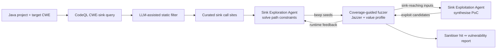

# Daily Scholar Papers Report — 2026-05-08

**[Download PDF](Daily_Papers_Report_2026-05-08.pdf)**

**Window covered:** 2026-05-07 → 2026-05-08 (Google Scholar alerts + user-curated self-emails, last 24 h)

---

## Executive Summary

Four papers landed in the window today and three of them clear the Outstanding bar — an unusually dense day that runs deliberately wide rather than deep on a single thread. **GONDAR** (Fleischer, Zhang et al., Georgia Tech / Samsung / Waterloo, arXiv 2604.01645) is the day's headline result: a sink-centric Java fuzzing framework that orchestrates two LLM agents (an *exploration agent* that solves path constraints to reach the sink, and an *exploitation agent* that synthesises the proof-of-concept once the sink is reached) on top of a coverage-guided fuzzer, using LLM-assisted CodeQL filtering to localise sink call sites. On a new benchmark of 54 vulnerabilities across 22 projects spanning 12 CWEs, GONDAR exploits 41 vulnerabilities versus Jazzer's eight (a 4× improvement) and reaches 46 versus 26 (77% improvement); ablations isolate the two agents and show their seven-vulnerability synergy with the fuzzer is the actual driver of the gain, not raw model capability. An earlier GONDAR version contributed to Team Atlanta's first-place finish at the AIxCC final, and the framework is being upstreamed into OSS-Fuzz. Companion paper **AIxCC SoK** (same Georgia Tech group, arXiv 2602.07666) is the systematisation that contextualises every other CRS-paper this quarter: 143 hours of fully autonomous operation, seven finalist CRSs, 53 challenge projects in C and Java, with $85K cloud + $50K LLM-credit budgets per team; the analysis crosses competition design, finalist architectures, and per-CPV results to call out which technical advances are real and which are scoreboard artefacts. Both came in via user-curated self-emails and bypass standard Stage-1 saturation filters.

The third Outstanding, **A First Look at Model Supply Chain** (Chen, Chen, Wu, B. Chen et al., Fudan + CMU, ICSE 2026), is the first systematic charting of Hugging Face as a *transformation graph*: 1,817,398 models, 540,838 dependency relations as of 25 June 2025, 1,008,871 chains with average length 6 and a longest 40-hop chain. Fine-tuning generates 79% of derived models; quantisation 19%; merging 2%. Weekly snapshots show 27,311 model additions and 6,190 deletions per week, with 70.5% of deletions isolated yet base-model deletions cascading through hundreds of chains. The risk-propagation half quantifies that PEFT preserves risk profiles whereas SFT amplifies them, and low-bit quantisation tends to increase hallucination and jailbreak rates rather than averaging them. Documentation rot is the standout quality finding: 83% of sampled top-decile text-generation models omit performance metrics, 28% have no license, 34% lack prompt templates, 77% of data-required models do not cite training data, and dependency recall is only 69% — meaning roughly one-third of derived models are untraceable to their base. The fourth paper, **TxLens** (Abdelaziz & Ali, NYU Abu Dhabi, ICBC 2026), is logged as Borderline-High: an ML-based mempool transaction classifier with a stacked ensemble that reaches a minimum F1 of 98.9% across five vulnerability classes and outperforms 14 SOTA tools by an average of 29.4% F1 on a contract-level benchmark, completing single-transaction analysis under 4 seconds.

**Outstanding:** 3 · **Keep:** 0 · **Borderline High-Priority:** 1

The full analysis follows.

---

## Highlighted Papers

| # | Title | Authors | Venue | Link |
|---|-------|---------|-------|------|
| 4.1 | Contextualizing Sink Knowledge for Java Vulnerability Discovery (GONDAR) | Fabian Fleischer, Cen Zhang, Joonun Jang, Jeongin Cho, Meng Xu, Taesoo Kim | arXiv 2604.01645 [cs.CR] (preprint, 19 Apr 2026) | [arXiv](https://arxiv.org/abs/2604.01645) |
| 4.2 | SoK: DARPA's AI Cyber Challenge (AIxCC) — Competition Design, Architectures, and Lessons Learned | Cen Zhang, Younggi Park, Fabian Fleischer, Yu-Fu Fu, Jiho Kim, Dongkwan Kim, Youngjoon Kim, … Taesoo Kim | arXiv 2602.07666 [cs.CR] (preprint, 18 Feb 2026) | [arXiv](https://arxiv.org/abs/2602.07666) |
| 4.3 | A First Look at Model Supply Chain: From the Risk Perspective | Ziqian Chen, Zekai Chen, Susheng Wu, Bihuan Chen, Wenyan Song, Yiheng Huang, Zhuotong Zhou, Yiheng Cao, Xin Peng | ICSE 2026 (Rio de Janeiro) | [Author PDF](https://chenbihuan.github.io/paper/icse26-chen-model-supply-chain.pdf) · [Conf page](https://conf.researchr.org/details/icse-2026/icse-2026-research-track/129/A-First-Look-at-Model-Supply-Chain-From-the-Risk-Perspective) |
| 4.4 | TxLens: Scalable Real-Time Detection of Malicious Ethereum Transactions | Tamer Abdelaziz, Karim Ali | IEEE ICBC 2026 | [Author PDF](https://tamer-abdelaziz.github.io/papers/TamerICBC2026.pdf) |

---

## Outstanding Papers (Deep-Read)

<strong>4.1</strong> · JAVA-VULN-FUZZ-LLM · [USER-PICK] GONDAR pairs a sink-reaching agent and a sink-exploiting agent with a coverage-guided fuzzer to exploit 41/54 Java vulnerabilities versus Jazzer's eight (4× improvement) at lower monetary cost ($3,051 vs $3,264)<a href="https://github.com/MarkLee131/paper-digest/issues/new?title=%5Bfeedback%5D+2026-05-08-4.1+%5BUSER-PICK%5D+GONDAR+pairs+a+sink-reaching+agent+and+a+sink-exploiting+agent+with+a+coverage-guided+fuzzer+to+exploit+41%2F54+Java+vulnerabilities+versus+Jazzer%27s+eight+%284%C3%97+improvement%29+at+lower+monetary+cost+%28%243%2C051+vs+%243%2C264%29+%F0%9F%91%8D&body=paper_id%3A+2026-05-08-4.1%0Atitle%3A+%5BUSER-PICK%5D+GONDAR+pairs+a+sink-reaching+agent+and+a+sink-exploiting+agent+with+a+coverage-guided+fuzzer+to+exploit+41%2F54+Java+vulnerabilities+versus+Jazzer%27s+eight+%284%C3%97+improvement%29+at+lower+monetary+cost+%28%243%2C051+vs+%243%2C264%29%0Aauthors%3A+Fabian+Fleischer%2C+Cen+Zhang+%28Georgia+Institute+of+Technology%29%3B+Joonun+Jang%2C+Jeongin+Cho+%28Samsung+Research%29%3B+Meng+Xu+%28University+of+Waterloo%29%3B+Taesoo+Kim+%28Georgia+Institute+of+Technology+%2F+Samsung+Research%29.%0Avenue%3A+arXiv%3A2604.01645v3+%5Bcs.CR%5D+%E2%80%94+preprint%2C+submitted+19+Apr+2026.%0Atopic%3A+JAVA-VULN-FUZZ-LLM%0Arating%3A+thumbs-up%0A%0A%3C%21--+Optional+notes+below+this+line+are+read+by+preferences.py+as+soft+signals.+--%3E%0A&labels=feedback%2Cthumbs-up" target="_blank" rel="noopener" class="fb-thumbs-up" title="thumbs up" onclick="event.stopPropagation()">👍</a><a href="https://github.com/MarkLee131/paper-digest/issues/new?title=%5Bfeedback%5D+2026-05-08-4.1+%5BUSER-PICK%5D+GONDAR+pairs+a+sink-reaching+agent+and+a+sink-exploiting+agent+with+a+coverage-guided+fuzzer+to+exploit+41%2F54+Java+vulnerabilities+versus+Jazzer%27s+eight+%284%C3%97+improvement%29+at+lower+monetary+cost+%28%243%2C051+vs+%243%2C264%29+%F0%9F%AB%A5&body=paper_id%3A+2026-05-08-4.1%0Atitle%3A+%5BUSER-PICK%5D+GONDAR+pairs+a+sink-reaching+agent+and+a+sink-exploiting+agent+with+a+coverage-guided+fuzzer+to+exploit+41%2F54+Java+vulnerabilities+versus+Jazzer%27s+eight+%284%C3%97+improvement%29+at+lower+monetary+cost+%28%243%2C051+vs+%243%2C264%29%0Aauthors%3A+Fabian+Fleischer%2C+Cen+Zhang+%28Georgia+Institute+of+Technology%29%3B+Joonun+Jang%2C+Jeongin+Cho+%28Samsung+Research%29%3B+Meng+Xu+%28University+of+Waterloo%29%3B+Taesoo+Kim+%28Georgia+Institute+of+Technology+%2F+Samsung+Research%29.%0Avenue%3A+arXiv%3A2604.01645v3+%5Bcs.CR%5D+%E2%80%94+preprint%2C+submitted+19+Apr+2026.%0Atopic%3A+JAVA-VULN-FUZZ-LLM%0Arating%3A+thumbs-down%0A%0A%3C%21--+Optional+notes+below+this+line+are+read+by+preferences.py+as+soft+signals.+--%3E%0A&labels=feedback%2Cthumbs-down" target="_blank" rel="noopener" class="fb-thumbs-down" title="less interested" onclick="event.stopPropagation()">🫥</a><a href="https://github.com/MarkLee131/paper-digest/issues/new?title=%5Bfeedback%5D+2026-05-08-4.1+%5BUSER-PICK%5D+GONDAR+pairs+a+sink-reaching+agent+and+a+sink-exploiting+agent+with+a+coverage-guided+fuzzer+to+exploit+41%2F54+Java+vulnerabilities+versus+Jazzer%27s+eight+%284%C3%97+improvement%29+at+lower+monetary+cost+%28%243%2C051+vs+%243%2C264%29+%F0%9F%94%96&body=paper_id%3A+2026-05-08-4.1%0Atitle%3A+%5BUSER-PICK%5D+GONDAR+pairs+a+sink-reaching+agent+and+a+sink-exploiting+agent+with+a+coverage-guided+fuzzer+to+exploit+41%2F54+Java+vulnerabilities+versus+Jazzer%27s+eight+%284%C3%97+improvement%29+at+lower+monetary+cost+%28%243%2C051+vs+%243%2C264%29%0Aauthors%3A+Fabian+Fleischer%2C+Cen+Zhang+%28Georgia+Institute+of+Technology%29%3B+Joonun+Jang%2C+Jeongin+Cho+%28Samsung+Research%29%3B+Meng+Xu+%28University+of+Waterloo%29%3B+Taesoo+Kim+%28Georgia+Institute+of+Technology+%2F+Samsung+Research%29.%0Avenue%3A+arXiv%3A2604.01645v3+%5Bcs.CR%5D+%E2%80%94+preprint%2C+submitted+19+Apr+2026.%0Atopic%3A+JAVA-VULN-FUZZ-LLM%0Arating%3A+save-for-later%0A%0A%3C%21--+Optional+notes+below+this+line+are+read+by+preferences.py+as+soft+signals.+--%3E%0A&labels=feedback%2Csave-for-later" target="_blank" rel="noopener" class="fb-save-for-later" title="save for later" onclick="event.stopPropagation()">🔖</a>

### 4.1 Contextualizing Sink Knowledge for Java Vulnerability Discovery (GONDAR)

[arXiv:2604.01645](https://arxiv.org/abs/2604.01645)

**Title:** Contextualizing Sink Knowledge for Java Vulnerability Discovery
**Authors:** Fabian Fleischer, Cen Zhang (Georgia Institute of Technology); Joonun Jang, Jeongin Cho (Samsung Research); Meng Xu (University of Waterloo); Taesoo Kim (Georgia Institute of Technology / Samsung Research).
**Venue:** arXiv:2604.01645v3 [cs.CR] — preprint, submitted 19 Apr 2026.
**Year:** 2026
**Link:** <https://arxiv.org/abs/2604.01645>
**License:** arXiv non-exclusive distribution. Original figures not embedded; pipeline recreated in Mermaid below.
**Source:** User-curated self-email (2026-05-07 12:41 UTC) — bypasses Stage-1 saturation/topicality filters.

#### Objective Summary

- **Problem.** Coverage-guided fuzzing on Java has hit a "last-mile" ceiling: in the authors' own large-scale baseline (54 vulnerabilities, 53 harnesses, 22 projects, 50 fuzzing instances × 24 h, ≈63,600 CPU-hours), Jazzer with default sanitizers reaches the vulnerable sink in 60% of cases but exploits only 14.8% (8 / 54), with 38.9% reached-but-unexploited. Manual triage of those 21 reached-but-unexploited cases blames *complex exploitation logic* in 18 of them: even with value-profile feedback the fuzzer cannot synthesise inputs that satisfy multi-step sink-specific exploitation conditions (e.g. XML payloads that satisfy deserialisation type constraints, paths that bypass path-traversal sanitizers). Sinks therefore encode two distinct kinds of knowledge — *reachability constraints* and *exploitation conditions* — and existing fuzzers conflate them.
- **Approach.** **GONDAR** decomposes the problem along that distinction and assigns each half to its own LLM-driven agent that exchanges seeds and feedback with the fuzzer:
  - *CWE-specific sink localisation.* CodeQL queries (per CWE) extract sink call sites from the program; an LLM-assisted static filter prunes infeasible / test-only / non-user-controlled candidates against a structured exploitability assessment.
  - *Sink Exploration Agent.* For each surviving sink, the agent iteratively solves the path constraints required to reach it, generating "beep seeds" (inputs that demonstrably reach the sink, even if the resulting execution is benign). Beep-seed packages are streamed to the exploitation agent as concrete starting points.
  - *Sink Exploitation Agent.* Receives sink-reaching inputs and CWE-specific knowledge, and generates proof-of-concept exploits by reasoning about exploitation conditions and sanitizer triggers.
  - *Coverage-guided fuzzer (built on Jazzer).* Continuously consumes seeds from both agents, returns runtime feedback, and remains in charge of value-profile-driven last-mile mutation. Sanitiser violations from any side close the loop.
- **Evaluation.** New benchmark of 54 vulnerabilities across 22 projects spanning 12 CWE types. Comparison against Jazzer (default + directed), CodeQL, SpotBugs, a ReAct LLM-only baseline, and per-agent ablations across seven LLMs (including open-weight ones). Real-world deployment evidence from AIxCC and an in-progress integration with OpenSSF / OSS-Fuzz.

#### Definitions, Headline Numbers, and Decomposition (verbatim from the paper)

The decomposition into reachability vs. exploitability is anchored in two operational notions:

- **Sink API.** A security-sensitive call site whose unsafe usage encodes the vulnerability — e.g. `Runtime.exec`, `ProcessBuilder.start`, deserialisation routines (GONDAR §2.1).
- **Beep seed.** "A beep seed is a user-controllable input that leads program execution to reach a sink. While this indicates potential vulnerability exposure, it does not necessarily trigger an exploit, as the execution may be benign" (GONDAR §2.1, verbatim ≤15 words: *"a user-controllable input that leads program execution to reach a sink"*).

The Jazzer baseline frames the problem (Table 1 in the paper):

| Total | Not Reached | Reached Only | Exploited |
|---|---|---|---|
| 54 | 25 (46.3%) | 21 (38.9%) | 8 (14.8%) |

Failure-mode triage on the 21 reached-but-unexploited cases (GONDAR §2.2):

- ① Missing instrumentation: 1 / 21
- ② Insufficient feedback depth: 2 / 21
- ③ Complex exploitation logic: 18 / 21

Headline result on the new 54-vuln benchmark:

- GONDAR exploits **41 / 54** vulnerabilities vs Jazzer's **8** — a **4× improvement** in exploitation.
- GONDAR reaches **46 / 54** vs Jazzer's **26** — a **77% improvement** in reachability.
- Disabling the exploration agent reduces reached vulnerabilities by **31%**; disabling the exploitation agent reduces exploited vulnerabilities by **51%**; the agent–fuzzer synergy uniquely discovers **7** vulnerabilities that neither component finds alone.
- GONDAR's per-benchmark monetary cost: **$3,051** vs large-scale Jazzer at **$3,264** — substantively cheaper despite using flagship LLMs in the strongest configuration.
- Currently supports **12 CWE types** (Table 2 in the paper); per-CWE extension is "minimal effort: most sink extraction queries are query-script rewriting on a per-CWE basis" (paraphrased; see GONDAR §3.1.1).

#### Pipeline Recreation (Mermaid)

#### Why It Matters

- *Decomposition is the contribution, not LLM scale.* The ReAct LLM-only baseline using identical model lineups underperforms GONDAR by a wide margin, and per-agent breakdowns across seven models (including open-weight) show problem decomposition — not raw model capability — is the variable that moves results.
- *Real-world validation outside the paper.* An earlier GONDAR variant was a component of Team Atlanta's CRS, which finished first at the AIxCC final (see paper 4.2 for the competition systematisation), and the framework is being absorbed into OSS-Fuzz via OpenSSF collaboration.
- *Operational ceiling acknowledged.* The authors flag a low internal precision (~14% of LLM-flagged sinks are real PoCs) and a noticeable monetary-cost gap between flagship and open-weight LLMs — both of which set up a clear follow-on agenda around sink-knowledge distillation.

#### Closing-Line Quote (≤15 words)

"Beep seed is a user-controllable input that leads program execution to reach a sink." — GONDAR §2.1.

<strong>4.2</strong> · AIxCC-SOK · [USER-PICK] First systematisation of DARPA AIxCC's 2023–2025 finals: 143 hours autonomous operation, 7 finalist CRSs, 53 C/Java challenge projects, $85K cloud + $50K LLM credits per team<a href="https://github.com/MarkLee131/paper-digest/issues/new?title=%5Bfeedback%5D+2026-05-08-4.2+%5BUSER-PICK%5D+First+systematisation+of+DARPA+AIxCC%27s+2023%E2%80%932025+finals%3A+143+hours+autonomous+operation%2C+7+finalist+CRSs%2C+53+C%2FJava+challenge+projects%2C+%2485K+cloud+%2B+%2450K+LLM+credits+per+team+%F0%9F%91%8D&body=paper_id%3A+2026-05-08-4.2%0Atitle%3A+%5BUSER-PICK%5D+First+systematisation+of+DARPA+AIxCC%27s+2023%E2%80%932025+finals%3A+143+hours+autonomous+operation%2C+7+finalist+CRSs%2C+53+C%2FJava+challenge+projects%2C+%2485K+cloud+%2B+%2450K+LLM+credits+per+team%0Aauthors%3A+Cen+Zhang%2C+Younggi+Park%2C+Fabian+Fleischer%2C+Yu-Fu+Fu%2C+Jiho+Kim%2C+Dongkwan+Kim%2C+Youngjoon+Kim+%28Georgia+Tech+%2F+Independent%29%3B+Qingxiao+Xu%2C+Andrew+Chin%2C+Ze+Sheng%2C+Hanqing+Zhao%2C+Brian+J.+Lee%2C+Joshua+Wang+%28GT+%2F+Texas+A%26M%29%3B+Michael+Pelican%2C+David+J.+Musliner+%28SIFT%29%3B+Jeff+Huang+%28Texas+A%26M%29%3B+Jon+Silliman%2C+Mikel+Mcdaniel%2C+Jefferson+Casavant%2C+Isaac+Goldthwaite%2C+Nicholas+Vidovich%2C+Matthew+Lehman+%28Kudu+Dynamics%29%3B+Taesoo+Kim+%28Georgia+Tech+%2F+Microsoft%29.%0Avenue%3A+arXiv%3A2602.07666v2+%5Bcs.CR%5D+%E2%80%94+preprint%2C+submitted+18+Feb+2026.%0Atopic%3A+AIxCC-SOK%0Arating%3A+thumbs-up%0A%0A%3C%21--+Optional+notes+below+this+line+are+read+by+preferences.py+as+soft+signals.+--%3E%0A&labels=feedback%2Cthumbs-up" target="_blank" rel="noopener" class="fb-thumbs-up" title="thumbs up" onclick="event.stopPropagation()">👍</a><a href="https://github.com/MarkLee131/paper-digest/issues/new?title=%5Bfeedback%5D+2026-05-08-4.2+%5BUSER-PICK%5D+First+systematisation+of+DARPA+AIxCC%27s+2023%E2%80%932025+finals%3A+143+hours+autonomous+operation%2C+7+finalist+CRSs%2C+53+C%2FJava+challenge+projects%2C+%2485K+cloud+%2B+%2450K+LLM+credits+per+team+%F0%9F%AB%A5&body=paper_id%3A+2026-05-08-4.2%0Atitle%3A+%5BUSER-PICK%5D+First+systematisation+of+DARPA+AIxCC%27s+2023%E2%80%932025+finals%3A+143+hours+autonomous+operation%2C+7+finalist+CRSs%2C+53+C%2FJava+challenge+projects%2C+%2485K+cloud+%2B+%2450K+LLM+credits+per+team%0Aauthors%3A+Cen+Zhang%2C+Younggi+Park%2C+Fabian+Fleischer%2C+Yu-Fu+Fu%2C+Jiho+Kim%2C+Dongkwan+Kim%2C+Youngjoon+Kim+%28Georgia+Tech+%2F+Independent%29%3B+Qingxiao+Xu%2C+Andrew+Chin%2C+Ze+Sheng%2C+Hanqing+Zhao%2C+Brian+J.+Lee%2C+Joshua+Wang+%28GT+%2F+Texas+A%26M%29%3B+Michael+Pelican%2C+David+J.+Musliner+%28SIFT%29%3B+Jeff+Huang+%28Texas+A%26M%29%3B+Jon+Silliman%2C+Mikel+Mcdaniel%2C+Jefferson+Casavant%2C+Isaac+Goldthwaite%2C+Nicholas+Vidovich%2C+Matthew+Lehman+%28Kudu+Dynamics%29%3B+Taesoo+Kim+%28Georgia+Tech+%2F+Microsoft%29.%0Avenue%3A+arXiv%3A2602.07666v2+%5Bcs.CR%5D+%E2%80%94+preprint%2C+submitted+18+Feb+2026.%0Atopic%3A+AIxCC-SOK%0Arating%3A+thumbs-down%0A%0A%3C%21--+Optional+notes+below+this+line+are+read+by+preferences.py+as+soft+signals.+--%3E%0A&labels=feedback%2Cthumbs-down" target="_blank" rel="noopener" class="fb-thumbs-down" title="less interested" onclick="event.stopPropagation()">🫥</a><a href="https://github.com/MarkLee131/paper-digest/issues/new?title=%5Bfeedback%5D+2026-05-08-4.2+%5BUSER-PICK%5D+First+systematisation+of+DARPA+AIxCC%27s+2023%E2%80%932025+finals%3A+143+hours+autonomous+operation%2C+7+finalist+CRSs%2C+53+C%2FJava+challenge+projects%2C+%2485K+cloud+%2B+%2450K+LLM+credits+per+team+%F0%9F%94%96&body=paper_id%3A+2026-05-08-4.2%0Atitle%3A+%5BUSER-PICK%5D+First+systematisation+of+DARPA+AIxCC%27s+2023%E2%80%932025+finals%3A+143+hours+autonomous+operation%2C+7+finalist+CRSs%2C+53+C%2FJava+challenge+projects%2C+%2485K+cloud+%2B+%2450K+LLM+credits+per+team%0Aauthors%3A+Cen+Zhang%2C+Younggi+Park%2C+Fabian+Fleischer%2C+Yu-Fu+Fu%2C+Jiho+Kim%2C+Dongkwan+Kim%2C+Youngjoon+Kim+%28Georgia+Tech+%2F+Independent%29%3B+Qingxiao+Xu%2C+Andrew+Chin%2C+Ze+Sheng%2C+Hanqing+Zhao%2C+Brian+J.+Lee%2C+Joshua+Wang+%28GT+%2F+Texas+A%26M%29%3B+Michael+Pelican%2C+David+J.+Musliner+%28SIFT%29%3B+Jeff+Huang+%28Texas+A%26M%29%3B+Jon+Silliman%2C+Mikel+Mcdaniel%2C+Jefferson+Casavant%2C+Isaac+Goldthwaite%2C+Nicholas+Vidovich%2C+Matthew+Lehman+%28Kudu+Dynamics%29%3B+Taesoo+Kim+%28Georgia+Tech+%2F+Microsoft%29.%0Avenue%3A+arXiv%3A2602.07666v2+%5Bcs.CR%5D+%E2%80%94+preprint%2C+submitted+18+Feb+2026.%0Atopic%3A+AIxCC-SOK%0Arating%3A+save-for-later%0A%0A%3C%21--+Optional+notes+below+this+line+are+read+by+preferences.py+as+soft+signals.+--%3E%0A&labels=feedback%2Csave-for-later" target="_blank" rel="noopener" class="fb-save-for-later" title="save for later" onclick="event.stopPropagation()">🔖</a>

### 4.2 SoK: DARPA's AI Cyber Challenge (AIxCC) — Competition Design, Architectures, and Lessons Learned

[arXiv:2602.07666](https://arxiv.org/abs/2602.07666)

**Title:** SoK: DARPA's AI Cyber Challenge (AIxCC) — Competition Design, Architectures, and Lessons Learned
**Authors:** Cen Zhang, Younggi Park, Fabian Fleischer, Yu-Fu Fu, Jiho Kim, Dongkwan Kim, Youngjoon Kim (Georgia Tech / Independent); Qingxiao Xu, Andrew Chin, Ze Sheng, Hanqing Zhao, Brian J. Lee, Joshua Wang (GT / Texas A&M); Michael Pelican, David J. Musliner (SIFT); Jeff Huang (Texas A&M); Jon Silliman, Mikel Mcdaniel, Jefferson Casavant, Isaac Goldthwaite, Nicholas Vidovich, Matthew Lehman (Kudu Dynamics); Taesoo Kim (Georgia Tech / Microsoft).
**Venue:** arXiv:2602.07666v2 [cs.CR] — preprint, submitted 18 Feb 2026.
**Year:** 2026
**Link:** <https://arxiv.org/abs/2602.07666>
**License:** arXiv non-exclusive distribution. Original figures not embedded.
**Source:** User-curated self-email (2026-05-07 11:47 UTC) — bypasses Stage-1 saturation/topicality filters.

#### Objective Summary

- **Problem.** AIxCC (2023–2025) was the largest competition to date for fully autonomous Cyber Reasoning Systems (CRSs) that combine LLMs with classical program-analysis to discover and patch vulnerabilities in real-world OSS. The final ran for ≈143 hours over seven finalist CRSs analysing 53 C / Java challenge projects, with a per-team budget of **$85K cloud compute** and **$50K LLM API credits**. Despite the scale, no systematic study had laid out which design choices drove competition outcomes versus which were scoreboard artefacts, what architectural patterns the finalists converged on, or which "AI for security" techniques actually generalised.
- **Approach.** A four-RQ systematisation drawing on (a) all seven finalist CRS codebases and white-papers, (b) the complete competition database (challenges, scoring traces, execution logs) from the organisers, and (c) discussions with both organisers and all seven finalist teams.
  - **RQ1 — Competition Design.** What design decisions shaped AIxCC: task definition (scan + PoV + patch + SARIF + bundle), scoring weights, challenge construction (Full Scan vs. Delta Scan), iterative semifinal-to-final refinement, and the GitHub-webhook + Competition-API + isolated-network deployment model.
  - **RQ2 — Finalist Architectures.** A taxonomy across PoV generation, patch generation, SARIF validation, and bundling — covering both shared structural patterns (modular bug-finder pipeline with seed sharing, candidate-filter cascades) and contested choices (LLM-only patch synthesis vs. retrieval-augmented patch templates).
  - **RQ3 — Result Analysis.** Per-CPV evaluation against foundational baselines, cross-team CWE coverage heatmaps, and resource utilisation profiles (utilisation varied from **8% (LC)** to **87% (AT)** across teams).
  - **RQ4 — Lessons & Future Work.** Translating competition outcomes into industry deployment criteria and naming the limitations that remain open (zero-day CPV review, ensembling vs. specialisation, human-in-the-loop overhead).
- **Comparison frame.** AIxCC is positioned against the Cyber Grand Challenge (CGC, 2014–2016) along three axes: scope (custom-binary attack-defence vs. real-world C/Java OSS development), AI emphasis (no LLM infra in CGC vs. Anthropic / Google / Microsoft / OpenAI endpoints in AIxCC), and economic model (cash-prize tournament vs. fixed cloud + credit budget per team).

#### Headline Numbers (verbatim from the paper)

- **Duration:** ≈143 hours of fully autonomous operation in the final.
- **Scale:** 7 finalist CRSs × 53 challenge projects in C and Java.
- **Budget:** $85K cloud + $50K LLM credits per team.
- **Resource utilisation across finalists:** 8% (LC) to 87% (AT) — a 10× spread.
- **Patch generation heatmap:** Atlantis, Buttercup, RoboDuck, FuzzingBrain, Artiphishell, BugBuster, and Lacrosse with per-CWE patches reported in Figure 8 (zero-day CPVs excluded pending procedural review).

#### Why It Matters

- *Reference architecture for "LLM + program analysis" CRSs.* The taxonomy across PoV / patch / SARIF / bundle gives the first apples-to-apples lens for the wave of CRS-style papers that have started to appear in 2026, including paper 4.1 (GONDAR) which contributed to Team Atlanta's first-place finish.
- *Calls out scoreboard artefacts vs. real technique advances.* The per-CPV result analysis explicitly separates "the team that scored on this CPV did so because of …" — an analytical move that retrospective competition write-ups rarely make, and one that should change how follow-up papers cite AIxCC results.
- *Deployment-translation rubric.* The lessons section converts competition design into criteria for evaluating real-world CRS deployment, anchoring future industry-academia comparisons.

<strong>4.3</strong> · MODEL-SUPPLY-CHAIN · First end-to-end Hugging Face supply-chain graph (1.82M models, 0.54M edges, 1M chains, longest 40 hops); SFT amplifies risk while PEFT preserves it, and 83% of top-decile models omit performance metrics<a href="https://github.com/MarkLee131/paper-digest/issues/new?title=%5Bfeedback%5D+2026-05-08-4.3+First+end-to-end+Hugging+Face+supply-chain+graph+%281.82M+models%2C+0.54M+edges%2C+1M+chains%2C+longest+40+hops%29%3B+SFT+amplifies+risk+while+PEFT+preserves+it%2C+and+83%25+of+top-decile+models+omit+performance+metrics+%F0%9F%91%8D&body=paper_id%3A+2026-05-08-4.3%0Atitle%3A+First+end-to-end+Hugging+Face+supply-chain+graph+%281.82M+models%2C+0.54M+edges%2C+1M+chains%2C+longest+40+hops%29%3B+SFT+amplifies+risk+while+PEFT+preserves+it%2C+and+83%25+of+top-decile+models+omit+performance+metrics%0Aauthors%3A+Ziqian+Chen%2C+Zekai+Chen%2C+Susheng+Wu%2C+Bihuan+Chen%2C+Yiheng+Huang%2C+Zhuotong+Zhou%2C+Yiheng+Cao%2C+Xin+Peng+%28Fudan+University%2C+Shanghai%29%3B+Wenyan+Song+%28Carnegie+Mellon+University%2C+Pittsburgh%29.%0Avenue%3A+ICSE+2026+%E2%80%94+IEEE%2FACM+48th+International+Conference+on+Software+Engineering%2C+12%E2%80%9318+April+2026%2C+Rio+de+Janeiro%2C+Brazil.%0Atopic%3A+MODEL-SUPPLY-CHAIN%0Arating%3A+thumbs-up%0A%0A%3C%21--+Optional+notes+below+this+line+are+read+by+preferences.py+as+soft+signals.+--%3E%0A&labels=feedback%2Cthumbs-up" target="_blank" rel="noopener" class="fb-thumbs-up" title="thumbs up" onclick="event.stopPropagation()">👍</a><a href="https://github.com/MarkLee131/paper-digest/issues/new?title=%5Bfeedback%5D+2026-05-08-4.3+First+end-to-end+Hugging+Face+supply-chain+graph+%281.82M+models%2C+0.54M+edges%2C+1M+chains%2C+longest+40+hops%29%3B+SFT+amplifies+risk+while+PEFT+preserves+it%2C+and+83%25+of+top-decile+models+omit+performance+metrics+%F0%9F%AB%A5&body=paper_id%3A+2026-05-08-4.3%0Atitle%3A+First+end-to-end+Hugging+Face+supply-chain+graph+%281.82M+models%2C+0.54M+edges%2C+1M+chains%2C+longest+40+hops%29%3B+SFT+amplifies+risk+while+PEFT+preserves+it%2C+and+83%25+of+top-decile+models+omit+performance+metrics%0Aauthors%3A+Ziqian+Chen%2C+Zekai+Chen%2C+Susheng+Wu%2C+Bihuan+Chen%2C+Yiheng+Huang%2C+Zhuotong+Zhou%2C+Yiheng+Cao%2C+Xin+Peng+%28Fudan+University%2C+Shanghai%29%3B+Wenyan+Song+%28Carnegie+Mellon+University%2C+Pittsburgh%29.%0Avenue%3A+ICSE+2026+%E2%80%94+IEEE%2FACM+48th+International+Conference+on+Software+Engineering%2C+12%E2%80%9318+April+2026%2C+Rio+de+Janeiro%2C+Brazil.%0Atopic%3A+MODEL-SUPPLY-CHAIN%0Arating%3A+thumbs-down%0A%0A%3C%21--+Optional+notes+below+this+line+are+read+by+preferences.py+as+soft+signals.+--%3E%0A&labels=feedback%2Cthumbs-down" target="_blank" rel="noopener" class="fb-thumbs-down" title="less interested" onclick="event.stopPropagation()">🫥</a><a href="https://github.com/MarkLee131/paper-digest/issues/new?title=%5Bfeedback%5D+2026-05-08-4.3+First+end-to-end+Hugging+Face+supply-chain+graph+%281.82M+models%2C+0.54M+edges%2C+1M+chains%2C+longest+40+hops%29%3B+SFT+amplifies+risk+while+PEFT+preserves+it%2C+and+83%25+of+top-decile+models+omit+performance+metrics+%F0%9F%94%96&body=paper_id%3A+2026-05-08-4.3%0Atitle%3A+First+end-to-end+Hugging+Face+supply-chain+graph+%281.82M+models%2C+0.54M+edges%2C+1M+chains%2C+longest+40+hops%29%3B+SFT+amplifies+risk+while+PEFT+preserves+it%2C+and+83%25+of+top-decile+models+omit+performance+metrics%0Aauthors%3A+Ziqian+Chen%2C+Zekai+Chen%2C+Susheng+Wu%2C+Bihuan+Chen%2C+Yiheng+Huang%2C+Zhuotong+Zhou%2C+Yiheng+Cao%2C+Xin+Peng+%28Fudan+University%2C+Shanghai%29%3B+Wenyan+Song+%28Carnegie+Mellon+University%2C+Pittsburgh%29.%0Avenue%3A+ICSE+2026+%E2%80%94+IEEE%2FACM+48th+International+Conference+on+Software+Engineering%2C+12%E2%80%9318+April+2026%2C+Rio+de+Janeiro%2C+Brazil.%0Atopic%3A+MODEL-SUPPLY-CHAIN%0Arating%3A+save-for-later%0A%0A%3C%21--+Optional+notes+below+this+line+are+read+by+preferences.py+as+soft+signals.+--%3E%0A&labels=feedback%2Csave-for-later" target="_blank" rel="noopener" class="fb-save-for-later" title="save for later" onclick="event.stopPropagation()">🔖</a>

### 4.3 A First Look at Model Supply Chain: From the Risk Perspective

[Author PDF](https://chenbihuan.github.io/paper/icse26-chen-model-supply-chain.pdf) · [ICSE 2026 page](https://conf.researchr.org/details/icse-2026/icse-2026-research-track/129/A-First-Look-at-Model-Supply-Chain-From-the-Risk-Perspective)

**Title:** A First Look at Model Supply Chain: From the Risk Perspective
**Authors:** Ziqian Chen, Zekai Chen, Susheng Wu, Bihuan Chen, Yiheng Huang, Zhuotong Zhou, Yiheng Cao, Xin Peng (Fudan University, Shanghai); Wenyan Song (Carnegie Mellon University, Pittsburgh).
**Venue:** ICSE 2026 — IEEE/ACM 48th International Conference on Software Engineering, 12–18 April 2026, Rio de Janeiro, Brazil.
**Year:** 2026
**Link:** <https://chenbihuan.github.io/paper/icse26-chen-model-supply-chain.pdf>
**License:** ICSE 2026 / ACM proceedings. Original figures not embedded; numerical findings reproduced in tables below.
**Source:** Scholar alert ("Bihuan Chen — new articles", 2026-05-07 19:00 UTC) — followed researcher.

#### Objective Summary

- **Problem.** Public model hubs (Hugging Face being the dominant case) form a *transformation graph* in which models continuously fork via fine-tuning, quantisation, and merging. Prior provenance work (Stalnaker et al.) abstracts this as a single linear path from base to sink and ignores both the operation taxonomy and the rich graph topology, while prior risk work (Sun et al., Chen et al., Gekhman et al., Kumar et al.) examines isolated operations on isolated model pairs. The actual ecosystem-level questions — usage, evolution, quality, and risk-propagation across the full graph — remain uncharacterised at scale.
- **Approach.** Crawl every public model on Hugging Face on **25 June 2025** (1,817,398 models), parse model-card metadata to extract dependency relations of four declared types (Quantize, Merge, Fine-Tune, Adapter), collapse Adapter into Fine-Tune (since adapters are PEFT-style fine-tunes), and build the model supply chain *M*. Then run four research questions over *M* and over a 17-snapshot weekly evolution window:
  - **RQ1 Usage.** Direct dependencies, chain lengths, hub structure, operation-type mix.
  - **RQ2 Evolution.** Per-week additions / deletions / updates, with downstream-impact accounting for base-model deletions.
  - **RQ3 Quality.** Five metadata fields (license, performance, prompt template, dataset, dependency relations) on a 378-model statistical sample drawn from the top 10% most-downloaded text-generation models (24,686), plus dependency-correctness verification.
  - **RQ4 Risk.** 105 dependency relations covering fine-tune / quantise / merge across hallucination, jailbreak, and prompt-injection benchmarks; compare each base model's score with each derivative's.

#### Headline Findings (verbatim from the paper)

| Layer | Finding |
|---|---|
| Graph scale | 1,817,398 models · 540,838 dependency relations · 1,008,871 chains · average chain length 6 · longest chain 40 hops (CohereLabs/c4ai-command-r-v01 → Citaman/command-r-1-layer) |
| Operation mix | Fine-Tune 79% · Quantize 19% · Merge 2% of all derived models |
| Hub concentration | 8 of the top-10 highest-in-degree base models concentrate the majority of downstream propagation; e.g. Qwen/Qwen1.5-0.5B has 32,497 dependents; upstream models exhibit an average of 469,382 downloads |
| Weekly evolution | 27,311 model additions / week · 6,190 deletions / week · 72.1% of additions are isolated · fine-tuning generates 72.8% of newly derived models · 70.5% of deletions are isolated, but base-model deletions cascade through hundreds of chains |
| Update visibility | "One in ten models update in the 17 weekly snapshots, but only 0.1% of the update information is reflected in metadata" — i.e. nearly invisible drift in declared metadata |
| Quality gaps | 83% of sampled top-decile text-generation models omit performance metrics; 28% have no license; 34% lack prompt templates; 77% of data-required models do not cite training data; declared dependencies have 97% precision but only 69% recall — meaning ~31% of derived models are *untraceable* |
| Risk propagation | "PEFT preserves risk profiles, whereas standard supervised fine-tuning (SFT) amplifies them"; "low-bit quantisation tends to increase hallucination and jailbreak"; merging "tends to risk extreme rather than averaging, yielding a high variance" |

#### Why It Matters

- *First scale-correct supply-chain abstraction.* By promoting Quantize / Merge / Fine-Tune to first-class edge types and quantifying the topology, the paper supplies the missing primitive for "model SBOM"-style risk-management work — the prior linear-provenance abstraction was provably insufficient.
- *Operational risk asymmetries are now empirically grounded.* PEFT-preserves-risk vs SFT-amplifies-risk vs quantisation-amplifies-hallucination is no longer anecdotal; ICSE-grade evidence on 105 dependency relations turns it into a deployment-time decision input (e.g. "if you must redistribute a base, prefer PEFT to SFT in the safety-fine-tune step").
- *Untraceability bounds.* The 31%-of-derived-models-are-untraceable finding (97% precision / 69% recall on declared dependencies) is the variable that bounds every downstream risk-propagation analysis — it sets the ceiling on what passive provenance crawls can ever achieve and motivates active recovery research.
- *Cross-paper resonance.* The risk-propagation lens dovetails with this quarter's stream of LLM-supply-chain-attack work (e.g. backdoor inheritance, jailbreak-after-fine-tune); the new contribution is moving from *can it propagate?* to *how often, in which direction, and through which operation?*

#### Closing-Line Quote (≤15 words)

"PEFT preserves risk profiles, whereas standard supervised fine-tuning (SFT) amplifies them." — Model Supply Chain, §1.

---

## Borderline High-Priority (Summary)

<strong>4.4</strong> · BLOCKCHAIN-RUNTIME-DEFENSE · TxLens classifies pending Ethereum transactions in the mempool via a stacked ensemble over simulated execution traces, reaching ≥98.9% F1 on five vuln classes and beating 14 SOTA tools by an average 29.4% F1 in <4 s

### 4.4 TxLens: Scalable Real-Time Detection of Malicious Ethereum Transactions

[Author PDF](https://tamer-abdelaziz.github.io/papers/TamerICBC2026.pdf)

**Title:** TxLens: Scalable Real-Time Detection of Malicious Ethereum Transactions
**Authors:** Tamer Abdelaziz, Karim Ali (NYU Abu Dhabi).
**Venue:** 2026 IEEE International Conference on Blockchain and Cryptocurrency (ICBC), 2026.
**Year:** 2026
**Link:** <https://tamer-abdelaziz.github.io/papers/TamerICBC2026.pdf>
**License:** IEEE conference proceedings. Figures not embedded.
**Source:** Scholar alert ("Recommended articles", 2026-05-07 19:00 UTC).

#### One-Paragraph Summary

TxLens reframes smart-contract security from post-deployment static / symbolic analysis to *pre-inclusion runtime classification*: a continuous mempool monitor (or on-demand by tx-hash) simulates each pending transaction against the latest chain state, extracts transaction-level + account-level structural and behavioural features from the resulting execution trace, and feeds them into a stacked ensemble (k-NN, XGBoost, CatBoost, LightGBM, …) that classifies the transaction as benign or as belonging to one of five high-impact vulnerability classes — reentrancy, parity wallet hack 1, parity wallet hack 2, integer overflow / underflow, and unhandled exception. On the transaction-level benchmark TxBench (≈11,000 transactions across the five classes), TxLens reports perfect F1 (100%) for reentrancy and both parity hacks, 98.9% F1 for integer overflow/underflow, and 99.3% F1 for unhandled exception — minimum F1 across all classes 98.9%. On the contract-level SCBench, the average F1 is 84.0% across the four supported classes, versus 54.6% averaged across 14 SOTA static / ML competitors — a 29.4-point absolute lead. End-to-end latency is under 4 seconds in single-transaction mode (with ≈2.5 s of that being model-load), dropping to ≈1.1 s per transaction in batch mode; deployment fits the Hugging Face Spaces free tier (2 vCPU, 16 GB RAM). The two limits worth flagging from the screening lens: (i) the five-class scope is narrow and explicitly chosen for historical impact rather than current threat distribution, and (ii) ground-truth labels rely on the same body of previously reported malicious contracts that the comparison tools were trained or tuned against — leaving open how the ensemble generalises to fresh exploits not yet in the literature. Logged as Borderline-High because the *runtime mempool* framing is genuinely novel (most prior work is post-hoc) but the topic family (ML on Ethereum transactions) is approaching saturation; useful as a reference numbers-table even if not a deep-read priority.

---

## Cross-Paper Synthesis

Three of the four papers cluster around the same operational thesis from very different vantage points: **the right grain for "AI for security" results in 2026 is the dependency relation, not the model**. GONDAR (4.1) makes the point at the program-analysis layer — it is the *sink-to-exploitation edge*, decomposed into a reachability sub-problem and an exploitability sub-problem, that yields the 4× improvement; an LLM-only baseline using identical models underperforms because it does not respect the edge structure. The AIxCC SoK (4.2) makes the point at the architecture layer — the analytic value of the systematisation comes from per-CPV breakdowns (which technique exploited which CPV via which CWE), not from the seven CRS scoreboards — i.e. the edge between "technique" and "vulnerability instance" is the unit that matters, and conflating teams with techniques is what hides real progress. Model Supply Chain (4.3) makes the point at the ecosystem layer — by promoting Quantize / Merge / Fine-Tune to first-class edge types over the Hugging Face graph, the authors recover risk-propagation asymmetries (PEFT vs SFT, quantisation vs. averaging) that the prior linear-provenance abstraction provably could not represent. TxLens (4.4) sits one layer down at the *transaction* edge in the Ethereum execution graph and shows the same lesson on a smaller scale: the gain over 14 prior tools comes from feature engineering on the simulated execution trace (i.e. on the edge), not from a heavier model. Tomorrow's batch — if the followed-researcher digests fire on schedule — should let us test how durable this *edge-as-first-class-citizen* framing is.

A second standing tension worth flagging: GONDAR and AIxCC both name **monetary cost / resource utilisation** as a load-bearing variable (GONDAR's ~14% precision / cheaper-model regression; AIxCC's 8%–87% utilisation spread across finalists). The 2026 Q2 deep-read backlog should track which of these regressions can be closed by sink-knowledge distillation versus which are intrinsic LLM-API economics.

---

## Writing & Rationale Insights

A common move across all three Outstandings: **explicit "ablation as definition of contribution"**. GONDAR §2.2 first builds the Jazzer baseline failure-mode triage (1 / 2 / 18 across three categories) before introducing GONDAR — i.e. the 4× headline number is presented inside the frame the failure modes already established, not as a victory lap. AIxCC §1 enumerates the four contributions before any quantitative result, then funnels every numbers paragraph back to one of those four contributions. Model Supply Chain §1 is even more disciplined: the paragraph that introduces the 1.82 M / 0.54 M numbers is followed *immediately* by the four RQs, making it impossible to read the headline scale without seeing the question structure that justifies it. The TxLens summary is a useful counter-example: the abstract leads with the 98.9% F1 and 29.4% lead before the framing of "mempool as pre-inclusion window" — readable, but the reader has to do an extra pass to recover *why* those numbers are the right numbers. The pattern to adopt: never lead with the headline metric without the failure-mode or research-question scaffold that makes it the right metric.

A second, smaller insight: GONDAR's appendix "Noteworthy Concerns" / "Author Response" pattern (with explicit numbered concerns and structured rebuttals) is a cleaner way to surface known limitations than the more common "Threats to Validity" paragraph. Worth borrowing for the next deep-read write-up that needs to acknowledge precision / cost trade-offs.
