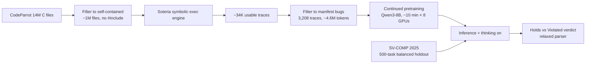

# Daily Scholar Papers Report — 2026-05-09

**[Download PDF](Daily_Papers_Report_2026-05-09.pdf)**

**Window covered:** 2026-05-08 → 2026-05-09 (Google Scholar alerts + user-curated self-emails, last 24 h)

---

## Executive Summary

Today's window contained no Google Scholar alert hits but two user-curated arXiv submissions, both squarely on the *LLM-meets-program-semantics* axis and complementary in scope. **Symbolic Execution Traces (SET)** by Bayer, Zetzsche, Bouissou, Delmas, Tautschnig, and Kong (Cambridge / AWS, arXiv 2605.06184) introduces a 500-task SV-COMP-derived C verification benchmark covering five property categories and shows that across 14 models the gap between *property-holds* and *property-violated* accuracy is the dominant failure mode rather than scale: four of fourteen models clear 84% on holds yet detect under 50% of violations, and even at the frontier the per-program-length curve falls sharply past 100 LOC. The training-side contribution is the cleaner result — running the open-source Soteria symbolic-execution engine on roughly one million self-contained C files from CodeParrot yields ~34,000 usable traces, and continued pretraining of Qwen3-8B on just **3,208** filtered manifest-bug traces (~4.6 M tokens, ~10 minutes on 8 GPUs) combined with chain-of-thought at inference time delivers **+17.9 percentage points** on violation detection (49.4% → 67.3%) without degrading holds accuracy on parseable responses. The result is *superadditive*: CPT alone adds +7.3 pp, thinking alone subtracts 1.4 pp, the combination adds +10.6 pp beyond CPT, and 28 ablations confirm the gains come from trace semantics rather than code volume. **Cottontail** by Tu, Lee, Li, Chen, Jiang, and Böhme (SMU / UCLA / MPI-SP, arXiv 2504.17542v2) takes the symmetric route — using LLMs *inside* a concolic-execution loop rather than training on traces — and re-architects three pieces of SymCC simultaneously: an Expressive Coverage Tree (ECT) that promotes branch type, call stack, taken/visit counts, and depth into a single source-level tree and a node-weight selector with three tunable parameters; a Solve-Complete LLM constraint solver that fills a Constraint Mask `[k!n]` and a Flexible Mask `[xxx]` together with a falsifying validator that falls back to Z3 when the LLM result fails; and a history-guided seed acquisition module that uses CoT prompts over the historical coverage map to mutate or freshly generate seeds when coverage saturates. Across eight parser libraries spanning XML, SQL, JavaScript, and JSON, Cottontail beats SymCC and Marco by **30.73%** lines / **41.32%** branches on average, raises parser-checking pass rate up to **62.69%** (vs Z3's 0.1%–46.0%), and yields **six new memory-related CVEs** (four already fixed). Both are logged as USER-PICK Outstanding because they triangulate the same underlying claim — *symbolic-execution artefacts are the right intermediate representation for the next round of LLM-for-code work* — from training and inference sides respectively.

**Outstanding:** 2 · **Keep:** 0 · **Borderline High-Priority:** 0

The full analysis follows.

---

## Highlighted Papers

| # | Title | Authors | Venue | Link |
|---|-------|---------|-------|------|
| 5.1 | Teaching LLMs Program Semantics via Symbolic Execution Traces | Jonas Bayer, Stefan Zetzsche, Olivier Bouissou, Remi Delmas, Michael Tautschnig, Soonho Kong | arXiv 2605.06184 [cs.SE] (preprint, 7 May 2026) | [arXiv](https://arxiv.org/abs/2605.06184) |
| 5.2 | Cottontail: Large Language Model-Driven Concolic Execution for Highly Structured Test Input Generation | Haoxin Tu, Seongmin Lee, Yuxian Li, Peng Chen, Lingxiao Jiang, Marcel Böhme | arXiv 2504.17542 [cs.SE] (preprint v2, 14 Oct 2025) | [arXiv](https://arxiv.org/abs/2504.17542) |

---

## Outstanding Papers (Deep-Read)

<details class="paper-card" markdown>
<summary><strong>5.1</strong> · <span class="topic-chip">SYMBOLIC-EXEC-LLM-CPT</span> · [USER-PICK] CPT on just 3,208 Soteria manifest-bug traces (~4.6 M tokens, ~10 min on 8 GPUs) plus thinking lifts Qwen3-8B violation detection from 49.4% to 67.3% (+17.9 pp), with the CPT–thinking interaction proven superadditive across 28 configurations<span class="feedback-buttons"><a href="https://github.com/MarkLee131/paper-digest/issues/new?title=%5Bfeedback%5D+2026-05-09-5.1+%5BUSER-PICK%5D+CPT+on+just+3%2C208+Soteria+manifest-bug+traces+%28~4.6+M+tokens%2C+~10+min+on+8+GPUs%29+plus+thinking+lifts+Qwen3-8B+violation+detection+from+49.4%25+to+67.3%25+%28%2B17.9+pp%29%2C+with+the+CPT%E2%80%93thinking+interaction+proven+superadditive+across+28+configurations+%F0%9F%91%8D&body=paper_id%3A+2026-05-09-5.1%0Atitle%3A+%5BUSER-PICK%5D+CPT+on+just+3%2C208+Soteria+manifest-bug+traces+%28~4.6+M+tokens%2C+~10+min+on+8+GPUs%29+plus+thinking+lifts+Qwen3-8B+violation+detection+from+49.4%25+to+67.3%25+%28%2B17.9+pp%29%2C+with+the+CPT%E2%80%93thinking+interaction+proven+superadditive+across+28+configurations%0Aauthors%3A+Jonas+Bayer+%28University+of+Cambridge%3B+intern+at+AWS%29%3B+Stefan+Zetzsche%2C+Olivier+Bouissou%2C+Remi+Delmas%2C+Michael+Tautschnig%2C+Soonho+Kong+%28Amazon+Web+Services%29.%0Avenue%3A+arXiv%3A2605.06184v1+%5Bcs.SE%5D+%E2%80%94+preprint%2C+submitted+7+May+2026.%0Atopic%3A+SYMBOLIC-EXEC-LLM-CPT%0Arating%3A+thumbs-up%0A%0A%3C%21--+Optional+notes+below+this+line+are+read+by+preferences.py+as+soft+signals.+--%3E%0A&labels=feedback%2Cthumbs-up" target="_blank" rel="noopener" class="fb-thumbs-up" title="thumbs up" onclick="event.stopPropagation()">👍</a><a href="https://github.com/MarkLee131/paper-digest/issues/new?title=%5Bfeedback%5D+2026-05-09-5.1+%5BUSER-PICK%5D+CPT+on+just+3%2C208+Soteria+manifest-bug+traces+%28~4.6+M+tokens%2C+~10+min+on+8+GPUs%29+plus+thinking+lifts+Qwen3-8B+violation+detection+from+49.4%25+to+67.3%25+%28%2B17.9+pp%29%2C+with+the+CPT%E2%80%93thinking+interaction+proven+superadditive+across+28+configurations+%F0%9F%AB%A5&body=paper_id%3A+2026-05-09-5.1%0Atitle%3A+%5BUSER-PICK%5D+CPT+on+just+3%2C208+Soteria+manifest-bug+traces+%28~4.6+M+tokens%2C+~10+min+on+8+GPUs%29+plus+thinking+lifts+Qwen3-8B+violation+detection+from+49.4%25+to+67.3%25+%28%2B17.9+pp%29%2C+with+the+CPT%E2%80%93thinking+interaction+proven+superadditive+across+28+configurations%0Aauthors%3A+Jonas+Bayer+%28University+of+Cambridge%3B+intern+at+AWS%29%3B+Stefan+Zetzsche%2C+Olivier+Bouissou%2C+Remi+Delmas%2C+Michael+Tautschnig%2C+Soonho+Kong+%28Amazon+Web+Services%29.%0Avenue%3A+arXiv%3A2605.06184v1+%5Bcs.SE%5D+%E2%80%94+preprint%2C+submitted+7+May+2026.%0Atopic%3A+SYMBOLIC-EXEC-LLM-CPT%0Arating%3A+thumbs-down%0A%0A%3C%21--+Optional+notes+below+this+line+are+read+by+preferences.py+as+soft+signals.+--%3E%0A&labels=feedback%2Cthumbs-down" target="_blank" rel="noopener" class="fb-thumbs-down" title="less interested" onclick="event.stopPropagation()">🫥</a><a href="https://github.com/MarkLee131/paper-digest/issues/new?title=%5Bfeedback%5D+2026-05-09-5.1+%5BUSER-PICK%5D+CPT+on+just+3%2C208+Soteria+manifest-bug+traces+%28~4.6+M+tokens%2C+~10+min+on+8+GPUs%29+plus+thinking+lifts+Qwen3-8B+violation+detection+from+49.4%25+to+67.3%25+%28%2B17.9+pp%29%2C+with+the+CPT%E2%80%93thinking+interaction+proven+superadditive+across+28+configurations+%F0%9F%94%96&body=paper_id%3A+2026-05-09-5.1%0Atitle%3A+%5BUSER-PICK%5D+CPT+on+just+3%2C208+Soteria+manifest-bug+traces+%28~4.6+M+tokens%2C+~10+min+on+8+GPUs%29+plus+thinking+lifts+Qwen3-8B+violation+detection+from+49.4%25+to+67.3%25+%28%2B17.9+pp%29%2C+with+the+CPT%E2%80%93thinking+interaction+proven+superadditive+across+28+configurations%0Aauthors%3A+Jonas+Bayer+%28University+of+Cambridge%3B+intern+at+AWS%29%3B+Stefan+Zetzsche%2C+Olivier+Bouissou%2C+Remi+Delmas%2C+Michael+Tautschnig%2C+Soonho+Kong+%28Amazon+Web+Services%29.%0Avenue%3A+arXiv%3A2605.06184v1+%5Bcs.SE%5D+%E2%80%94+preprint%2C+submitted+7+May+2026.%0Atopic%3A+SYMBOLIC-EXEC-LLM-CPT%0Arating%3A+save-for-later%0A%0A%3C%21--+Optional+notes+below+this+line+are+read+by+preferences.py+as+soft+signals.+--%3E%0A&labels=feedback%2Csave-for-later" target="_blank" rel="noopener" class="fb-save-for-later" title="save for later" onclick="event.stopPropagation()">🔖</a></span></summary>

### 5.1 Teaching LLMs Program Semantics via Symbolic Execution Traces

[arXiv:2605.06184](https://arxiv.org/abs/2605.06184)

**Title:** Teaching LLMs Program Semantics via Symbolic Execution Traces
**Authors:** Jonas Bayer (University of Cambridge; intern at AWS); Stefan Zetzsche, Olivier Bouissou, Remi Delmas, Michael Tautschnig, Soonho Kong (Amazon Web Services).
**Venue:** arXiv:2605.06184v1 [cs.SE] — preprint, submitted 7 May 2026.
**Year:** 2026
**Link:** <https://arxiv.org/abs/2605.06184>
**License:** arXiv non-exclusive distribution. Original figures not embedded; pipeline recreated in Mermaid below.
**Source:** User-curated self-email (2026-05-09 08:08 UTC) — bypasses Stage-1 saturation/topicality filters.

#### Objective Summary

- **Problem.** Existing LLM code-understanding benchmarks have largely saturated on high-level languages (Python, etc.), but C verification — which requires reasoning about pointer arithmetic, memory safety, and undefined behavior — remains unevaluated under a controlled framework. The authors argue this gap matters because the *property-holds vs property-violated* asymmetry is the dominant failure mode in security-critical reasoning yet has been hidden by overall-accuracy reporting.
- **Approach.** Two complementary contributions:
  - *Evaluation framework.* A 500-task balanced holdout drawn from SV-COMP 2025, covering five property categories (memory safety, absence of overflows, termination, reachability, absence of data races), each with a 50/50 holds/violated split and varying program lengths (0–400 LOC, balanced per bin). Comments are stripped from source so models cannot leak through them. A relaxed answer parser tolerates output-format variation.
  - *Training pipeline.* Run the open-source Soteria symbolic-execution engine on ~1 M self-contained C files filtered from the CodeParrot dataset, yielding ~34,000 usable traces. Continued pretraining (CPT) of Qwen3-8B on filtered subsets, with systematic variation along trace filtering (manifest bugs only, manifest+latent, balanced 50/50, all traces), trace format (HTML / plain text / informalised), and inference-time thinking on/off. The training data is independent of the SV-COMP benchmark.
- **Evaluation.** Baseline run of 14 models from six families against the 500-task benchmark; 28 training configurations on Qwen3-8B; per-property breakdowns and significance tests (paired t-test across runs and per-task McNemar's test).

#### Definitions, Headline Numbers, and Decomposition

The benchmark distribution itself is the framing the rest of the paper builds on (paper §3.1):

| Length bin (LOC) | Count |
|---|---|
| 0–25 | 49 |
| 26–50 | 157 |
| 51–100 | 186 |
| 101–200 | 50 |
| 201–400 | 46 |
| **Total** | **488 unique programs across 500 tasks (median 56 LOC, range 8–398)** |

Baseline asymmetry on the 14-model evaluation (paper §3.2 and Figure 1):

- Frontier model Claude Opus 4.7: 98.3% holds vs 92.0% violated.
- Four of fourteen models score **<50%** on violation detection despite **>84%** on holds.
- Length effect (paper Figure 2): Qwen3-32B violation accuracy drops from **90.0% (0–25 LOC)** to **32.1% (101–200 LOC)**; even Claude Opus 4.7 dips to **77.7%** on 101–200 LOC.
- LLM-as-judge analysis of 1,069 false negatives: missing the triggering edge case **44%**, identifying the bug but rationalising it away **27%**, incorrect reasoning **19%**, universal/existential confusion **8%** (concentrated in termination), superficial analysis **1%**.

CPT result on Qwen3-8B (paper Table 1 and §5):

- Manifest-bug traces only (3,208 traces, HTML format) + thinking: **67.3%** violated vs 49.4% baseline-no-thinking, a **+17.9 pp** lift on violation detection (p<0.01 paired t-test; per-task McNemar's p<10⁻⁷).
- Net **+2.7 pp** on overall accuracy (p<0.05).
- *Superadditive interaction.* CPT alone (no thinking): +7.3 pp on violated. Thinking alone (no CPT): −1.4 pp. CPT + thinking: +19.3 pp on violated, i.e. **+10.6 pp beyond CPT alone**.
- *Volume is not the driver.* Training on all 34,495 traces yields **39.9%** violated; training on the same 3,208 underlying *C files alone* yields **40.2%** — both *worse* than the 49.4% baseline.
- *Format matters.* HTML traces beat plain text (56.7% vs 53.7% no-thinking; 67.3% vs 33.2% with thinking, with plain-text collapsing to 45% unparsed). Informalised natural-language summaries collapse to **25.2%** with 62% unparsed.
- *Per-property gains with thinking enabled* (relative to thinking baseline): Overflow +28.5 pp (66.0%); Memory Safety +28.0 pp (47.0%); Termination +16.0 pp (94.5%); Data Races +11.5 pp (69.0%); Reachability +5.5 pp (60.0%) — improvements transfer to properties Soteria does not specifically check.
- *Scale comparison.* Best 8B configuration reaches 72.7% overall, approaching Qwen3-32B no-thinking (76.2%) and substantially exceeding it on violations (67.3% vs 56.9%).

#### Pipeline Recreation (Mermaid)



#### Why It Matters

- *Holds–violated asymmetry is now first-class.* The macro-average reporting style (treating each side equally regardless of natural class distribution) makes a previously-hidden failure mode visible — and the per-property breakdown shows it generalises. Future LLM-for-verification benchmarks should adopt this convention as default.
- *A reproducible recipe for cheap CPT gains.* 3,208 traces and ~10 minutes on 8 GPUs is well inside academic-budget territory; the dependence on a publicly available symbolic-execution tool (Soteria) means the same recipe can be re-run with KLEE, CBMC traces, abstract-interpreter dumps, or fuzzer logs — anything that emits structured textual artefacts.
- *Training-side beats inference-side at the same scale.* The few-shot prompting baseline (two example traces in the prompt) actually *hurt* violation detection (−8.3 pp), confirming that for verification reasoning the benefit comes from internalising trace patterns through CPT rather than in-context demonstrations.
- *HTML structure is the load-bearing detail.* The collapse of plain-text and informalised traces under thinking-mode (33.2% and 25.2% respectively) suggests the explicit hierarchical anchoring of nested HTML tags and log-level annotations is what lets chain-of-thought stay on rails — a non-obvious finding that pushes back on "tools should produce clean text for LLMs".
- *No fundamental scaling claim.* The authors only test one base model (Qwen3-8B), one symbolic-execution engine (Soteria), and one language (C). The recipe at 32B is flagged as a promising direction; reproducing the superadditive interaction at frontier scale is the obvious next experiment.

#### Closing-Line Quote (≤15 words)

"Improvements transfer across all five property types, including ones the training traces do not target." — SET, Abstract.

</details>

<details class="paper-card" markdown>
<summary><strong>5.2</strong> · <span class="topic-chip">CONCOLIC-LLM-FUZZ</span> · [USER-PICK] Cottontail re-architects SymCC with an Expressive Coverage Tree, an LLM Solve-Complete constraint solver with Z3 fallback, and history-guided seed generation, beating SymCC/Marco by 30.73% lines and 41.32% branches across eight parsers and finding six new CVEs (four already fixed)<span class="feedback-buttons"><a href="https://github.com/MarkLee131/paper-digest/issues/new?title=%5Bfeedback%5D+2026-05-09-5.2+%5BUSER-PICK%5D+Cottontail+re-architects+SymCC+with+an+Expressive+Coverage+Tree%2C+an+LLM+Solve-Complete+constraint+solver+with+Z3+fallback%2C+and+history-guided+seed+generation%2C+beating+SymCC%2FMarco+by+30.73%25+lines+and+41.32%25+branches+across+eight+parsers+and+finding+six+new+CVEs+%28four+already+fixed%29+%F0%9F%91%8D&body=paper_id%3A+2026-05-09-5.2%0Atitle%3A+%5BUSER-PICK%5D+Cottontail+re-architects+SymCC+with+an+Expressive+Coverage+Tree%2C+an+LLM+Solve-Complete+constraint+solver+with+Z3+fallback%2C+and+history-guided+seed+generation%2C+beating+SymCC%2FMarco+by+30.73%25+lines+and+41.32%25+branches+across+eight+parsers+and+finding+six+new+CVEs+%28four+already+fixed%29%0Aauthors%3A+Haoxin+Tu+%28Singapore+Management+University%29%3B+Seongmin+Lee+%28UCLA%29%3B+Yuxian+Li+%28Singapore+Management+University%29%3B+Peng+Chen+%28independent%29%3B+Lingxiao+Jiang+%28Singapore+Management+University%29%3B+Marcel+B%C3%B6hme+%28Max+Planck+Institute+for+Security+and+Privacy%29.%0Avenue%3A+arXiv%3A2504.17542v2+%5Bcs.SE%5D+%E2%80%94+preprint%2C+last+revised+14+Oct+2025%3B+system+released+as+GPL-v3+software+%28paper+%C2%A71.4+of+artefact+appendix%29.+Targeted+at+top-tier+S%26P-track+venues+%28per+references+and+writing+style%29.%0Atopic%3A+CONCOLIC-LLM-FUZZ%0Arating%3A+thumbs-up%0A%0A%3C%21--+Optional+notes+below+this+line+are+read+by+preferences.py+as+soft+signals.+--%3E%0A&labels=feedback%2Cthumbs-up" target="_blank" rel="noopener" class="fb-thumbs-up" title="thumbs up" onclick="event.stopPropagation()">👍</a><a href="https://github.com/MarkLee131/paper-digest/issues/new?title=%5Bfeedback%5D+2026-05-09-5.2+%5BUSER-PICK%5D+Cottontail+re-architects+SymCC+with+an+Expressive+Coverage+Tree%2C+an+LLM+Solve-Complete+constraint+solver+with+Z3+fallback%2C+and+history-guided+seed+generation%2C+beating+SymCC%2FMarco+by+30.73%25+lines+and+41.32%25+branches+across+eight+parsers+and+finding+six+new+CVEs+%28four+already+fixed%29+%F0%9F%AB%A5&body=paper_id%3A+2026-05-09-5.2%0Atitle%3A+%5BUSER-PICK%5D+Cottontail+re-architects+SymCC+with+an+Expressive+Coverage+Tree%2C+an+LLM+Solve-Complete+constraint+solver+with+Z3+fallback%2C+and+history-guided+seed+generation%2C+beating+SymCC%2FMarco+by+30.73%25+lines+and+41.32%25+branches+across+eight+parsers+and+finding+six+new+CVEs+%28four+already+fixed%29%0Aauthors%3A+Haoxin+Tu+%28Singapore+Management+University%29%3B+Seongmin+Lee+%28UCLA%29%3B+Yuxian+Li+%28Singapore+Management+University%29%3B+Peng+Chen+%28independent%29%3B+Lingxiao+Jiang+%28Singapore+Management+University%29%3B+Marcel+B%C3%B6hme+%28Max+Planck+Institute+for+Security+and+Privacy%29.%0Avenue%3A+arXiv%3A2504.17542v2+%5Bcs.SE%5D+%E2%80%94+preprint%2C+last+revised+14+Oct+2025%3B+system+released+as+GPL-v3+software+%28paper+%C2%A71.4+of+artefact+appendix%29.+Targeted+at+top-tier+S%26P-track+venues+%28per+references+and+writing+style%29.%0Atopic%3A+CONCOLIC-LLM-FUZZ%0Arating%3A+thumbs-down%0A%0A%3C%21--+Optional+notes+below+this+line+are+read+by+preferences.py+as+soft+signals.+--%3E%0A&labels=feedback%2Cthumbs-down" target="_blank" rel="noopener" class="fb-thumbs-down" title="less interested" onclick="event.stopPropagation()">🫥</a><a href="https://github.com/MarkLee131/paper-digest/issues/new?title=%5Bfeedback%5D+2026-05-09-5.2+%5BUSER-PICK%5D+Cottontail+re-architects+SymCC+with+an+Expressive+Coverage+Tree%2C+an+LLM+Solve-Complete+constraint+solver+with+Z3+fallback%2C+and+history-guided+seed+generation%2C+beating+SymCC%2FMarco+by+30.73%25+lines+and+41.32%25+branches+across+eight+parsers+and+finding+six+new+CVEs+%28four+already+fixed%29+%F0%9F%94%96&body=paper_id%3A+2026-05-09-5.2%0Atitle%3A+%5BUSER-PICK%5D+Cottontail+re-architects+SymCC+with+an+Expressive+Coverage+Tree%2C+an+LLM+Solve-Complete+constraint+solver+with+Z3+fallback%2C+and+history-guided+seed+generation%2C+beating+SymCC%2FMarco+by+30.73%25+lines+and+41.32%25+branches+across+eight+parsers+and+finding+six+new+CVEs+%28four+already+fixed%29%0Aauthors%3A+Haoxin+Tu+%28Singapore+Management+University%29%3B+Seongmin+Lee+%28UCLA%29%3B+Yuxian+Li+%28Singapore+Management+University%29%3B+Peng+Chen+%28independent%29%3B+Lingxiao+Jiang+%28Singapore+Management+University%29%3B+Marcel+B%C3%B6hme+%28Max+Planck+Institute+for+Security+and+Privacy%29.%0Avenue%3A+arXiv%3A2504.17542v2+%5Bcs.SE%5D+%E2%80%94+preprint%2C+last+revised+14+Oct+2025%3B+system+released+as+GPL-v3+software+%28paper+%C2%A71.4+of+artefact+appendix%29.+Targeted+at+top-tier+S%26P-track+venues+%28per+references+and+writing+style%29.%0Atopic%3A+CONCOLIC-LLM-FUZZ%0Arating%3A+save-for-later%0A%0A%3C%21--+Optional+notes+below+this+line+are+read+by+preferences.py+as+soft+signals.+--%3E%0A&labels=feedback%2Csave-for-later" target="_blank" rel="noopener" class="fb-save-for-later" title="save for later" onclick="event.stopPropagation()">🔖</a></span></summary>

### 5.2 Cottontail: Large Language Model-Driven Concolic Execution for Highly Structured Test Input Generation

[arXiv:2504.17542](https://arxiv.org/abs/2504.17542)

**Title:** Cottontail: Large Language Model-Driven Concolic Execution for Highly Structured Test Input Generation
**Authors:** Haoxin Tu (Singapore Management University); Seongmin Lee (UCLA); Yuxian Li (Singapore Management University); Peng Chen (independent); Lingxiao Jiang (Singapore Management University); Marcel Böhme (Max Planck Institute for Security and Privacy).
**Venue:** arXiv:2504.17542v2 [cs.SE] — preprint, last revised 14 Oct 2025; system released as GPL-v3 software (paper §1.4 of artefact appendix). Targeted at top-tier S&P-track venues (per references and writing style).
**Year:** 2025
**Link:** <https://arxiv.org/abs/2504.17542>
**License:** arXiv non-exclusive distribution; codebase GPL-v3. Original figures not embedded; ECT structure recreated in Mermaid below.
**Source:** User-curated self-email (2026-05-08 11:58 UTC) — bypasses Stage-1 saturation/topicality filters.

#### Objective Summary

- **Problem.** Existing concolic-execution engines such as SymCC and Marco hit three structural limits when used to test parsing programs: (L1) *which* path constraints to solve — input-structure-agnostic selection wastes effort or drops interesting coverage; (L2) *how* to solve them — Z3 produces satisfying but syntactically-invalid inputs and cannot grow input sizes flexibly; (L3) *how* to acquire seeds — manual collection is slow and random restart after saturation rarely helps.
- **Approach.** Cottontail decomposes the engine into three new components on top of SymCC:
  - *Expressive Coverage Tree (ECT) and ECT-guided selector.* A source-level tree T = (N, E) whose nodes carry a 6-tuple identifier `fileName_funcName_lineNum_colNum_brType_brId` plus visiting status, visit count, branch type, call-stack size, and branch id. A two-phase selector applies a node-weight ranking inside a single concolic run and across runs.
  - *Solve-Complete LLM constraint solver + test-case validator.* The path constraint and seed are decorated with two masks: `[k!n]` (Constraint Mask, must satisfy the symbolic constraint) and `[xxx]` (Flexible Mask, must keep the surrounding string syntactically valid). A CoT system prompt walks the LLM through (1) solve `[k!n]`, (2) complete `[xxx]`, (3) emit the new test input. The validator checks the constraint and falls back to Z3 + `refineTestCase` when the LLM result fails — preserving soundness.
  - *History-guided seed acquisition.* Two regimes: *initial* prompts the LLM to draft structured seeds from its memory of bug repositories; *fresh* — when external `gcov` indicates saturation (no coverage gain in three minutes) — uses a CoT seed-generation prompt over the per-input coverage map to either mutate prior inputs or synthesise new ones using identifier-naming hints from the test program.
- **Evaluation.** Eight widely-tested open-source libraries across four formats (Libxml2, Libexpat, SQLite, UnQLite, MuJS, QuickJS, JSON-C, Jansson) under three timeout settings (1 h vs 1 h, 1 h vs 12 h, 12 h vs 12 h). Comparators: SymCC, SymCC(¬MAP), Marco, Marco(MC), Marco(CFG). Median of five repeats reported. RQ1 measures coverage; RQ2 ablates each component; RQ3 reports new vulnerabilities.

#### Formal Characterisation (verbatim from the paper)

The selector ranks each ECT node by paper Equation 1:

$$\text{Node weight} = \alpha \cdot \mathit{untaken} + \beta \cdot \mathit{visit\_cnt} + \gamma \cdot \mathit{depth}$$

with the parameter sweep choosing α = 1.0, β = 3.0, γ = 0.8 as the operating point (paper §4). The interpretation, per paper §3.1.4: α prioritises untaken branches (new paths), β rebalances toward rarely-visited nodes (avoiding over-emphasis on hot paths), and γ rewards deeper nodes (encouraging deeply-nested-bug exploration).

#### Headline Numbers

Coverage on RQ1, Setting 1 (1 h vs 1 h), Cottontail vs the strongest comparator (paper Table 2):

| Format | Lib | Cottontail (Lines / Branches) | SymCC (L / B) | Marco (L / B) |
|---|---|---|---|---|
| XML | Libxml2 | 5,298 / 3,848 | 3,917 / 2,693 | 5,252 / 3,790 |
| XML | Libexpat | 2,838 / 1,876 | 2,379 / 1,250 | 1,902 / 1,271 |
| SQL | SQLite | 18,708 / 11,849 | 17,143 / 10,827 | 11,768 / 7,229 |
| SQL | UnQLite | 3,257 / 1,749 | 2,927 / 1,503 | 3,087 / 1,629 |
| JS | MuJS | 4,120 / 2,070 | 3,669 / 1,815 | 2,947 / 1,588 |
| JS | QuickJS | 9,414 / 4,266 | 5,890 / 2,389 | 6,756 / 2,912 |
| JSON | JSON-C | 1,040 / 686 | 968 / 568 | 990 / 637 |
| JSON | Jansson | 1,140 / 699 | 1,021 / 578 | 1,084 / 650 |
| **Total** | — | **45,815 / 27,043** | 37,914 / 21,623 | 33,886 / 19,706 |
| **Average improvement** | — | — | **+20.77% / +31.64%** | **+25.44% / +26.56%** |
| **Average improvement vs strongest comparator** | — | — | — | **+30.73% / +41.32%** |

Other headline measurements:

- *Parser-checking pass rate.* Z3 vs Cottontail's LLM solver — Libxml2 4.74% vs 32.61% (588% relative lift); MuJS 0.48% vs 61.54%; SQLite 2.59% vs 31.49%; QuickJS 0.07% vs 11.84%; JSON-C 3.80% vs 40.28% (paper Figure 1).
- *Two-phase selector reduction.* First-phase path-constraint counts collapse from NoMap → Bitmap → ECT (e.g. JSON-C 223 → 106 → 67) while preserving identical line coverage (paper Table 3). Second phase: JSON-C 7,024 → 355 → 926; SQLite 3,618 → 313 → 687.
- *Solve-Complete success rate.* The LLM solver returns a constraint-satisfying answer **70.08%** of the time on average; the **29.92%** failures are caught by the validator and refined with Z3, preserving the soundness guarantee.
- *Vulnerabilities.* **Six** previously unknown memory-related vulnerabilities discovered, **six CVE IDs** assigned; **four already fixed** by upstream developers at the time of writing.
- *LLM cost.* Default uses gpt-4o-mini (gpt-4o only in RQ1 Setting 1); deepseek-v3 and gpt-4.1-nano are reported to work comparably, decoupling the gain from a single proprietary model.

#### ECT Schema Recreation (Mermaid)

```mermaid
flowchart TB
    root[ECT root]
    sw[switch_jslex.c_jsY_lexx_9_3<br/>tk=1 cs=10 vc=1]
    c40[case 40<br/>'(' branch]
    c41[case 41<br/>')' branch]
    c44[case 44<br/>',' branch]
    root --> sw
    sw --> c40
    sw --> c41
    sw --> c44
    note[node id = fileName_funcName_lineNum_colNum_brType_brId<br/>attributes: tk taken, cs call-stack size, vc visit count, br branch id, depth]
    sw -.-> note
```

#### Why It Matters

- *Soundness preserved by construction.* The Z3 fallback inside `refineTestCase` means the LLM never breaks the soundness guarantee of concolic execution — a deal-breaker concern for any prior LLM-fuzzing work that relied entirely on model outputs.
- *Three orthogonal contributions, each independently ablation-validated.* RQ2 separates ECT (selector), Solve-Complete (CoT vs normal), validator on/off, and seed acquisition variants — each removal individually degrades coverage substantially, so the gains are not stacked accidentally.
- *Real-world impact, not benchmark-only.* Six fresh CVEs across MuJS, QuickJS, UnQLite, and JSON-C, with four already patched, anchor the paper in practical defensive value rather than synthetic benchmark wins.
- *Cheap-LLM compatibility.* The reported equivalence between gpt-4o, gpt-4o-mini, deepseek-v3, and gpt-4.1-nano is a useful operational signal: structured prompts with masks and a strong validator are doing the work, not the frontier model.
- *Source-level coverage map fixes a long-standing pain.* The ECT replaces AFL-style binary bitmaps that suffered from hash collisions and missing semantic granularity — the gains over Marco's CSTG (which is also binary-derived) suggest source-level coverage is the right substrate for parser fuzzing more broadly.

#### Closing-Line Quote (≤15 words)

"Cottontail significantly outperforms baseline approaches by 30.73% and 41.32% on average in line and branch coverage." — Cottontail, Abstract.

</details>

---

## Cross-Paper Synthesis

The two papers triangulate the same claim — *symbolic-execution artefacts are the right intermediate representation for the next round of LLM-for-code work* — from opposite ends of the inference/training spectrum, and the points where they agree are more interesting than the points where they differ. Both treat the LLM as the *flexible* component (synthesising natural-language reasoning over structured constraint information in 5.1, generating syntactically-valid completions over masked symbolic constraints in 5.2), and both treat a non-LLM tool as the *load-bearing* component for soundness (Soteria's manifest-bug traces define the training signal in 5.1; Z3's fallback guarantees the soundness invariant in 5.2). Both papers explicitly de-emphasise model-scale: 5.1 by showing CPT'd Qwen3-8B beats Qwen3-32B baseline on violations, 5.2 by showing gpt-4o-mini, deepseek-v3, and gpt-4.1-nano all match flagship gpt-4o under structured prompts. Both also concentrate gains via *small-but-curated* trace/data: 3,208 manifest-bug traces (5.1) and ~3,208-class structured prompt templates (5.2) feel like the same instinct expressed in two registers — *signal concentration over volume*. Read together, they suggest the 2026 follow-on agenda is to use LLM-augmented symbolic execution loops (à la Cottontail) to generate the next generation of training traces (à la SET), closing the loop between trace generation and trace-based pretraining. The two papers also share a writing pattern worth noting in the rationale section.

A second axis: both papers spend disproportionate care on the *failure mode of the structured tool*. 5.1's HTML-vs-plain-text-vs-informalised collapse is not a side note — it is the load-bearing experiment that justifies the whole format-preservation argument. 5.2's `refineTestCase` is structurally analogous: an explicit fallback for when the LLM's output fails the structural constraint. The shared lesson: when LLMs are bolted onto a structured-tool pipeline, the *interface format* between the two systems is the place where most of the experimental risk concentrates.

---

## Writing & Rationale Insights

Both papers lead with their *failure-mode framing* before any positive result — 5.1's §3.2 establishes the holds-vs-violated asymmetry (with the 1,069-false-negative breakdown into five buckets) before introducing CPT, and 5.2's §1 enumerates limitations L1/L2/L3 before naming the three new components. Each contribution then maps cleanly back to a numbered failure mode (5.1's CPT improves violation detection across all five property types; 5.2's ECT addresses L1, Solve-Complete addresses L2, history-guided acquisition addresses L3). The same pattern was visible across yesterday's GONDAR / Model Supply Chain digest, and consolidating on it for our own write-ups is now overdue. A second pattern: both papers carve their headline-quote candidates into the *transferability* claim rather than the headline number — 5.1 closes on "improvements transfer across all five property types"; 5.2's headline is the 30.73% / 41.32% improvement *on average across eight libraries spanning four formats*. The transferability framing absorbs the headline number while doing extra interpretive work, which is consistently a stronger move than leading with the metric alone.

A practical rationale lift for the deep-read style going forward: 5.1's per-property breakdown table (Total / Mem.Safety / Overflow / Termin. / Reach. / Data Race) is a direct template for any future deep-read of a multi-property benchmark — the per-cell variance bands let the reader inspect non-obvious patterns (e.g. plain text wins on overflow but loses on memory safety), and the macro-average row anchors the headline. The Bayesian reading: the table format itself is a forcing function for honesty about per-property variance. Adopt it.
