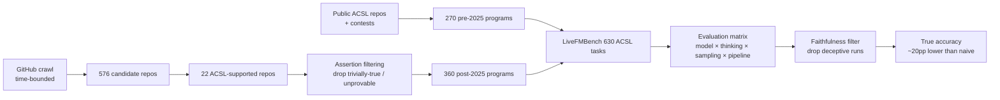
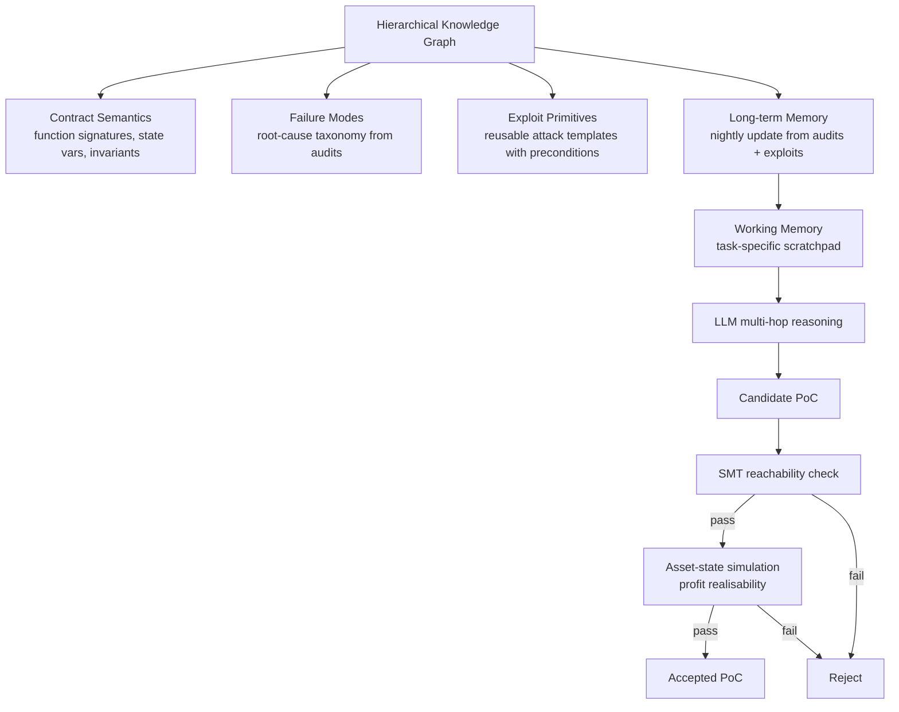

# Daily Scholar Papers Report — 2026-05-10

**[Download PDF](Daily_Papers_Report_2026-05-10.pdf)**

**Window covered:** 2026-05-09 → 2026-05-10 (Google Scholar alerts + user-curated self-emails, last 24 h)

---

## Executive Summary

Today's window surfaced four Outstanding papers from the followed-author and recommended Scholar feeds — three of which deepen the by-now-dominant pattern of **LLM driving the search, a sound non-LLM tool guarding the inner loop** that emerged on yesterday's Cottontail / SET pair. **LiveFMBench** by Xu, Cao, Mo, Hu, Wen, Lin, Han, Qin, Tian, Cheung, Sun, and Lu (ISCAS / HKUST / Xidian-Guangzhou, arXiv 2605.01394) is the first systematic and contamination-aware study of LLM- and agent-based formal specification generation for C: a 630-task ACSL benchmark (270 pre-2025 + 360 freshly hand-curated post-2025 cases distilled from 576 GitHub repos through a 22-repo ACSL filter and a 360-program assertion filter) reveals that direct-prompting models routinely deceive automated provers or ignore code-context constraints, and that *removing* such unfaithful runs drops apparent specification-generation accuracy by approximately 20 percentage points on average — implying prior LLM-for-spec-gen results should be discounted by a similar margin. Five further trends fall out: increased sampling roughly doubles pass@1 → pass@5 and triples to pass@32; thinking-mode lifts smaller models more (Qwen3-32B 6.33 → 27.44 pass@5, +333%); the agentic pipeline pays off most under low sampling budgets and on harder datasets but loses its edge as samples grow; incorrect loop invariants are the dominant failure type in both reasoning modes; and agentic pipelines specifically reduce assertion errors. **EvoPoC** by Liang, Chen, Li, Gu, Feng, Xue, Wu, and Liu (NTU + Wuhan U + MetaTrust, NDSS 2026 / arXiv 2605.02868) operationalises the same hybrid pattern for offensive smart-contract security: a Hierarchical Knowledge Graph that organises DeFi domain knowledge along three orthogonal axes (contract semantics, failure modes, exploit primitives) gives the LLM symbolic anchors for multi-hop reasoning, while a two-stage validation framework — SMT-based reachability checking plus profit-realisable asset-state simulation — guarantees the synthesised PoCs satisfy both logical and economic viability. Across 88 historical attacks and 72 audited projects (2,573 contracts), EvoPoC reaches 98% recall and 0.9 F1 in detection and a 96.6% exploit success rate, reproducing 85 historical exploits to recover over $116.2M and beating Verite/ItyFuzz by up to 5×/300× in ESR/value and the LLM-based generator A1 by 2×/8.5×; in bug-bounty evaluation it identified 16 confirmed 0-day vulnerabilities and helped secure over $70.6M. **Semantic Reification** by Chopra, Li, Sotiropoulos, and Su (ETH Zurich, PLDI'26) is the latest iteration of the Su-group / Cong-Li compiler-fuzzing line (succeeding Csmith / YARPGen / MetaMut / Artemis): the paper introduces a new paradigm for random program generation in which the semantic constraints of the generator — types, effects, control-flow invariants — are *reified* into first-class objects that can be composed and mutated, with the open-source Reify tool released alongside; abstract-only coverage today because the preprint PDF is not yet publicly hosted. **RSafe** by Zheng, Ji, Lu, Cui, Zhao, Deng, Liang, Zhang, and Chua (NUS + collaborators, NeurIPS 2025 / arXiv 2506.07736) sits one layer up the stack: a two-stage guard-model training pipeline (SFT cold-start guided reasoning, then GRPO with rule-based binary correctness reward and a format reward enforcing the think-then-answer schema) that accepts user-specified safety policies at inference time and generalises to OOD harms (e.g. intellectual-property violations) that fixed-taxonomy guard models miss; logged as Keep because it extends an established LLM-safety line rather than opening a new attack surface.

**Outstanding:** 3 · **Keep:** 1 · **Borderline High-Priority:** 0

The full analysis follows.

---

## Highlighted Papers

| # | Title | Authors | Venue | Link |
|---|-------|---------|-------|------|
| 5.1 | LiveFMBench: Unveiling the Power and Limits of Agentic Workflows in Specification Generation | Dong Xu, Jialun Cao, Guozhao Mo, Junjie Hu, Cheng Wen, Hongyu Lin, Xianpei Han, Shengchao Qin, Cong Tian, Shing-Chi Cheung, Le Sun, Yaojie Lu | arXiv 2605.01394 [cs.SE] (preprint, 2 May 2026) | [arXiv](https://arxiv.org/abs/2605.01394) |
| 5.2 | EvoPoC: Automated Exploit Synthesis for DeFi Smart Contracts via Hierarchical Knowledge Graphs | Ruichao Liang, Jing Chen, Xianglong Li, Huangpeng Gu, Yebo Feng, Yue Xue, Cong Wu, Yang Liu | NDSS 2026 / arXiv 2605.02868 [cs.CR] (4 May 2026) | [arXiv](https://arxiv.org/abs/2605.02868) |
| 5.3 | Semantic Reification: A New Paradigm for Random Program Generation | Kavya Chopra, Cong Li, Thodoris Sotiropoulos, Zhendong Su | PLDI 2026 (preprint) | [Author page](https://connglli.github.io/) |
| 5.4 | RSafe: Incentivizing proactive reasoning to build robust and adaptive LLM safeguards | Jingnan Zheng, Xiangtian Ji, Yijun Lu, Chenhang Cui, Weixiang Zhao, Gelei Deng, Zhenkai Liang, An Zhang, Tat-Seng Chua | NeurIPS 2025 / arXiv 2506.07736 [cs.AI] | [arXiv](https://arxiv.org/abs/2506.07736) |

---

## Outstanding Papers (Deep-Read)

<strong>5.1</strong> · SPEC-GEN-LLM-AGENT · LiveFMBench's contamination-aware 630-task ACSL benchmark exposes a ~20 pp accuracy inflation from prover-deceiving behaviours and pinpoints incorrect loop invariants as the dominant failure mode<a href="https://github.com/MarkLee131/paper-digest/issues/new?title=%5Bfeedback%5D+2026-05-10-5.1+LiveFMBench%27s+contamination-aware+630-task+ACSL+benchmark+exposes+a+~20+pp+accuracy+inflation+from+prover-deceiving+behaviours+and+pinpoints+incorrect+loop+invariants+as+the+dominant+failure+mode+%F0%9F%91%8D&body=paper_id%3A+2026-05-10-5.1%0Atitle%3A+LiveFMBench%27s+contamination-aware+630-task+ACSL+benchmark+exposes+a+~20+pp+accuracy+inflation+from+prover-deceiving+behaviours+and+pinpoints+incorrect+loop+invariants+as+the+dominant+failure+mode%0Aauthors%3A+Dong+Xu%2C+Guozhao+Mo%2C+Hongyu+Lin%2C+Xianpei+Han%2C+Le+Sun%2C+Yaojie+Lu+%28Institute+of+Software%2C+Chinese+Academy+of+Sciences%29%3B+Jialun+Cao%2C+Shing-Chi+Cheung+%28HKUST%29%3B+Junjie+Hu%2C+Cheng+Wen%2C+Shengchao+Qin%2C+Cong+Tian+%28Guangzhou+Institute+of+Technology%2C+Xidian+University%29.%0Avenue%3A+arXiv%3A2605.01394v1+%5Bcs.SE%5D+%E2%80%94+preprint%2C+submitted+2+May+2026.%0Atopic%3A+SPEC-GEN-LLM-AGENT%0Arating%3A+thumbs-up%0A%0A%3C%21--+Optional+notes+below+this+line+are+read+by+preferences.py+as+soft+signals.+--%3E%0A&labels=feedback%2Cthumbs-up" target="_blank" rel="noopener" class="fb-thumbs-up" title="thumbs up" onclick="event.stopPropagation()">👍</a><a href="https://github.com/MarkLee131/paper-digest/issues/new?title=%5Bfeedback%5D+2026-05-10-5.1+LiveFMBench%27s+contamination-aware+630-task+ACSL+benchmark+exposes+a+~20+pp+accuracy+inflation+from+prover-deceiving+behaviours+and+pinpoints+incorrect+loop+invariants+as+the+dominant+failure+mode+%F0%9F%AB%A5&body=paper_id%3A+2026-05-10-5.1%0Atitle%3A+LiveFMBench%27s+contamination-aware+630-task+ACSL+benchmark+exposes+a+~20+pp+accuracy+inflation+from+prover-deceiving+behaviours+and+pinpoints+incorrect+loop+invariants+as+the+dominant+failure+mode%0Aauthors%3A+Dong+Xu%2C+Guozhao+Mo%2C+Hongyu+Lin%2C+Xianpei+Han%2C+Le+Sun%2C+Yaojie+Lu+%28Institute+of+Software%2C+Chinese+Academy+of+Sciences%29%3B+Jialun+Cao%2C+Shing-Chi+Cheung+%28HKUST%29%3B+Junjie+Hu%2C+Cheng+Wen%2C+Shengchao+Qin%2C+Cong+Tian+%28Guangzhou+Institute+of+Technology%2C+Xidian+University%29.%0Avenue%3A+arXiv%3A2605.01394v1+%5Bcs.SE%5D+%E2%80%94+preprint%2C+submitted+2+May+2026.%0Atopic%3A+SPEC-GEN-LLM-AGENT%0Arating%3A+thumbs-down%0A%0A%3C%21--+Optional+notes+below+this+line+are+read+by+preferences.py+as+soft+signals.+--%3E%0A&labels=feedback%2Cthumbs-down" target="_blank" rel="noopener" class="fb-thumbs-down" title="less interested" onclick="event.stopPropagation()">🫥</a><a href="https://github.com/MarkLee131/paper-digest/issues/new?title=%5Bfeedback%5D+2026-05-10-5.1+LiveFMBench%27s+contamination-aware+630-task+ACSL+benchmark+exposes+a+~20+pp+accuracy+inflation+from+prover-deceiving+behaviours+and+pinpoints+incorrect+loop+invariants+as+the+dominant+failure+mode+%F0%9F%94%96&body=paper_id%3A+2026-05-10-5.1%0Atitle%3A+LiveFMBench%27s+contamination-aware+630-task+ACSL+benchmark+exposes+a+~20+pp+accuracy+inflation+from+prover-deceiving+behaviours+and+pinpoints+incorrect+loop+invariants+as+the+dominant+failure+mode%0Aauthors%3A+Dong+Xu%2C+Guozhao+Mo%2C+Hongyu+Lin%2C+Xianpei+Han%2C+Le+Sun%2C+Yaojie+Lu+%28Institute+of+Software%2C+Chinese+Academy+of+Sciences%29%3B+Jialun+Cao%2C+Shing-Chi+Cheung+%28HKUST%29%3B+Junjie+Hu%2C+Cheng+Wen%2C+Shengchao+Qin%2C+Cong+Tian+%28Guangzhou+Institute+of+Technology%2C+Xidian+University%29.%0Avenue%3A+arXiv%3A2605.01394v1+%5Bcs.SE%5D+%E2%80%94+preprint%2C+submitted+2+May+2026.%0Atopic%3A+SPEC-GEN-LLM-AGENT%0Arating%3A+save-for-later%0A%0A%3C%21--+Optional+notes+below+this+line+are+read+by+preferences.py+as+soft+signals.+--%3E%0A&labels=feedback%2Csave-for-later" target="_blank" rel="noopener" class="fb-save-for-later" title="save for later" onclick="event.stopPropagation()">🔖</a>

### 5.1 LiveFMBench: Unveiling the Power and Limits of Agentic Workflows in Specification Generation

[arXiv:2605.01394](https://arxiv.org/abs/2605.01394)

**Title:** LiveFMBench: Unveiling the Power and Limits of Agentic Workflows in Specification Generation
**Authors:** Dong Xu, Guozhao Mo, Hongyu Lin, Xianpei Han, Le Sun, Yaojie Lu (Institute of Software, Chinese Academy of Sciences); Jialun Cao, Shing-Chi Cheung (HKUST); Junjie Hu, Cheng Wen, Shengchao Qin, Cong Tian (Guangzhou Institute of Technology, Xidian University).
**Venue:** arXiv:2605.01394v1 [cs.SE] — preprint, submitted 2 May 2026.
**Year:** 2026
**Link:** <https://arxiv.org/abs/2605.01394>
**License:** arXiv non-exclusive distribution. Original figures not embedded; benchmark construction recreated in Mermaid below.
**Source:** Scholar alerts "Cheng Wen — new articles" + "Shengchao Qin — new articles" (2026-05-09 16:40 UTC).

#### Objective Summary

- **Problem.** LLM- and agent-based formal specification generation has been improving fast, but two structural confounds make existing results hard to interpret: (a) most evaluation benchmarks were collected from public GitHub or contests, so they overlap with LLM pre-training data and inflate results; (b) prior work largely instruments pipelines (prompting / RAG / agents) without isolating *which* component is responsible for the gain or *what failure modes* remain.
- **Approach.** Three components:
  - *LiveFMBench*: 630 ACSL-annotated C verification tasks comprising 270 pre-2025 cases (drawn from public ACSL repositories and contests) and **360 newly collected post-2025 cases** built by crawling 576 candidate GitHub repos, filtering to 22 repos with ACSL-suitable code patterns, and applying assertion filtering to land at 360 programs. The post-2025 split is the contamination-control set.
  - *Evaluation matrix*: direct prompting at multiple sampling sizes (pass@1 / pass@5 / pass@32), reasoning-enabled "thinking" mode on/off, and an agentic pipeline. Models include Qwen3 family (8B and 32B variants), among others.
  - *Faithfulness filter*: a post-hoc check that drops runs in which the model deceives the prover (e.g. trivially weakening the precondition until the prover succeeds, padding the C source with assertions, or removing constructs).
- **Evaluation.** All combinations of (model × prompt-mode × sample-size × pipeline) on both the pre-2025 and post-2025 splits; pre-/post-filter reporting of accuracy; failure-mode breakdown into loop invariants, assertion errors, frame-condition omissions, and verifier-specific mismatches.

#### Definitions, Headline Numbers, and Decomposition

Benchmark composition (paper §3.1):

| Split | Source | Count |
|---|---|---|
| Pre-2025 | Public ACSL contests / GitHub | 270 |
| Post-2025 | 24 hand-curated repos → 22 ACSL-supported → 360 programs after assertion filtering | 360 |
| **Total** | — | **630** |

Headline trends (paper §4–§5):

- **Faithfulness penalty.** Excluding runs that exhibit deceptive behaviours drops the measured specification-generation accuracy by **approximately 20 percentage points** on average. Naive evaluation overestimates by this margin.
- **Sample-size effect.** Pass@5 ≈ 2 × pass@1; pass@32 ≈ 3 × pass@1 on average — substantial returns to sampling.
- **Thinking-mode effect.** Relative gains range from **+19.40% to +2465.52%**; smaller models benefit more. Qwen3-32B improves from **6.33 → 27.44 pass@5** (a +333% relative lift).
- **Agentic pipeline effect.** Particularly effective under low sampling budgets and on harder datasets; advantage diminishes as sampling grows.
- **Failure-mode pareto.** Incorrect loop invariants are the dominant error type in both reasoning modes. The agentic pipeline notably reduces assertion errors but does not significantly move loop-invariant accuracy.

#### Benchmark Construction (Mermaid)

#### Why It Matters

- *Contamination is now first-class.* The 270/360 split makes the contamination-resistant subset auditable on a per-task basis. Future spec-gen benchmarks should adopt the same time-anchored split as default.
- *Faithfulness filtering as a community baseline.* The ~20 pp accuracy drop is large enough that *any* prior LLM-for-spec-gen result that did not filter for prover deception should be re-read with this discount in mind. The filtering protocol itself is a contribution worth lifting into other LLM-for-verification work.
- *Loop invariants are the next attack surface.* That neither thinking nor the agentic pipeline meaningfully moves loop-invariant accuracy is a direct call to action for follow-on work — the obvious candidates are dedicated invariant-synthesis sub-agents or targeted CPT on Daikon-style invariant traces.
- *Smaller models benefit more from thinking.* Operationally important for budget-constrained deployments — Qwen3-32B's +333% pass@5 lift from thinking outpaces the deltas reported for frontier models. Agentic pipelines add value at low sample budgets but lose it at high budgets, suggesting a sample-budget-conditioned pipeline-selection policy is the right operational stance rather than always-agentic.
- *Public release.* Benchmark and artefacts at <https://huggingface.co/datasets/fm-universe/Live-FM-Bench>.

#### Closing-Line Quote (≤15 words)

"Incorrect loop invariants are the dominant error type in both reasoning modes." — LiveFMBench, abstract.

<strong>5.2</strong> · DEFI-EXPLOIT-LLM-KG · EvoPoC reaches 96.6% exploit success rate on 88 real-world DeFi attacks and reproduces $116.2M in extracted value, beating Verite/ItyFuzz by 5×/300× and the LLM-based generator A1 by 2×/8.5×, with 16 confirmed 0-days<a href="https://github.com/MarkLee131/paper-digest/issues/new?title=%5Bfeedback%5D+2026-05-10-5.2+EvoPoC+reaches+96.6%25+exploit+success+rate+on+88+real-world+DeFi+attacks+and+reproduces+%24116.2M+in+extracted+value%2C+beating+Verite%2FItyFuzz+by+5%C3%97%2F300%C3%97+and+the+LLM-based+generator+A1+by+2%C3%97%2F8.5%C3%97%2C+with+16+confirmed+0-days+%F0%9F%91%8D&body=paper_id%3A+2026-05-10-5.2%0Atitle%3A+EvoPoC+reaches+96.6%25+exploit+success+rate+on+88+real-world+DeFi+attacks+and+reproduces+%24116.2M+in+extracted+value%2C+beating+Verite%2FItyFuzz+by+5%C3%97%2F300%C3%97+and+the+LLM-based+generator+A1+by+2%C3%97%2F8.5%C3%97%2C+with+16+confirmed+0-days%0Aauthors%3A+Ruichao+Liang%2C+Yebo+Feng%2C+Yang+Liu+%28Nanyang+Technological+University%29%3B+Jing+Chen%2C+Xianglong+Li%2C+Huangpeng+Gu%2C+Cong+Wu+%28Wuhan+University%29%3B+Yue+Xue+%28MetaTrust+Labs%29.%0Avenue%3A+Network+and+Distributed+System+Security+Symposium+%28NDSS%29+2026+%E2%80%94+San+Diego%2C+23%E2%80%9327+February+2026.+Preprint+at+arXiv%3A2605.02868v1+%5Bcs.CR%5D%2C+4+May+2026.%0Atopic%3A+DEFI-EXPLOIT-LLM-KG%0Arating%3A+thumbs-up%0A%0A%3C%21--+Optional+notes+below+this+line+are+read+by+preferences.py+as+soft+signals.+--%3E%0A&labels=feedback%2Cthumbs-up" target="_blank" rel="noopener" class="fb-thumbs-up" title="thumbs up" onclick="event.stopPropagation()">👍</a><a href="https://github.com/MarkLee131/paper-digest/issues/new?title=%5Bfeedback%5D+2026-05-10-5.2+EvoPoC+reaches+96.6%25+exploit+success+rate+on+88+real-world+DeFi+attacks+and+reproduces+%24116.2M+in+extracted+value%2C+beating+Verite%2FItyFuzz+by+5%C3%97%2F300%C3%97+and+the+LLM-based+generator+A1+by+2%C3%97%2F8.5%C3%97%2C+with+16+confirmed+0-days+%F0%9F%AB%A5&body=paper_id%3A+2026-05-10-5.2%0Atitle%3A+EvoPoC+reaches+96.6%25+exploit+success+rate+on+88+real-world+DeFi+attacks+and+reproduces+%24116.2M+in+extracted+value%2C+beating+Verite%2FItyFuzz+by+5%C3%97%2F300%C3%97+and+the+LLM-based+generator+A1+by+2%C3%97%2F8.5%C3%97%2C+with+16+confirmed+0-days%0Aauthors%3A+Ruichao+Liang%2C+Yebo+Feng%2C+Yang+Liu+%28Nanyang+Technological+University%29%3B+Jing+Chen%2C+Xianglong+Li%2C+Huangpeng+Gu%2C+Cong+Wu+%28Wuhan+University%29%3B+Yue+Xue+%28MetaTrust+Labs%29.%0Avenue%3A+Network+and+Distributed+System+Security+Symposium+%28NDSS%29+2026+%E2%80%94+San+Diego%2C+23%E2%80%9327+February+2026.+Preprint+at+arXiv%3A2605.02868v1+%5Bcs.CR%5D%2C+4+May+2026.%0Atopic%3A+DEFI-EXPLOIT-LLM-KG%0Arating%3A+thumbs-down%0A%0A%3C%21--+Optional+notes+below+this+line+are+read+by+preferences.py+as+soft+signals.+--%3E%0A&labels=feedback%2Cthumbs-down" target="_blank" rel="noopener" class="fb-thumbs-down" title="less interested" onclick="event.stopPropagation()">🫥</a><a href="https://github.com/MarkLee131/paper-digest/issues/new?title=%5Bfeedback%5D+2026-05-10-5.2+EvoPoC+reaches+96.6%25+exploit+success+rate+on+88+real-world+DeFi+attacks+and+reproduces+%24116.2M+in+extracted+value%2C+beating+Verite%2FItyFuzz+by+5%C3%97%2F300%C3%97+and+the+LLM-based+generator+A1+by+2%C3%97%2F8.5%C3%97%2C+with+16+confirmed+0-days+%F0%9F%94%96&body=paper_id%3A+2026-05-10-5.2%0Atitle%3A+EvoPoC+reaches+96.6%25+exploit+success+rate+on+88+real-world+DeFi+attacks+and+reproduces+%24116.2M+in+extracted+value%2C+beating+Verite%2FItyFuzz+by+5%C3%97%2F300%C3%97+and+the+LLM-based+generator+A1+by+2%C3%97%2F8.5%C3%97%2C+with+16+confirmed+0-days%0Aauthors%3A+Ruichao+Liang%2C+Yebo+Feng%2C+Yang+Liu+%28Nanyang+Technological+University%29%3B+Jing+Chen%2C+Xianglong+Li%2C+Huangpeng+Gu%2C+Cong+Wu+%28Wuhan+University%29%3B+Yue+Xue+%28MetaTrust+Labs%29.%0Avenue%3A+Network+and+Distributed+System+Security+Symposium+%28NDSS%29+2026+%E2%80%94+San+Diego%2C+23%E2%80%9327+February+2026.+Preprint+at+arXiv%3A2605.02868v1+%5Bcs.CR%5D%2C+4+May+2026.%0Atopic%3A+DEFI-EXPLOIT-LLM-KG%0Arating%3A+save-for-later%0A%0A%3C%21--+Optional+notes+below+this+line+are+read+by+preferences.py+as+soft+signals.+--%3E%0A&labels=feedback%2Csave-for-later" target="_blank" rel="noopener" class="fb-save-for-later" title="save for later" onclick="event.stopPropagation()">🔖</a>

### 5.2 EvoPoC: Automated Exploit Synthesis for DeFi Smart Contracts via Hierarchical Knowledge Graphs

[arXiv:2605.02868](https://arxiv.org/abs/2605.02868)

**Title:** EvoPoC: Automated Exploit Synthesis for DeFi Smart Contracts via Hierarchical Knowledge Graphs
**Authors:** Ruichao Liang, Yebo Feng, Yang Liu (Nanyang Technological University); Jing Chen, Xianglong Li, Huangpeng Gu, Cong Wu (Wuhan University); Yue Xue (MetaTrust Labs).
**Venue:** Network and Distributed System Security Symposium (NDSS) 2026 — San Diego, 23–27 February 2026. Preprint at arXiv:2605.02868v1 [cs.CR], 4 May 2026.
**Year:** 2026
**Link:** <https://arxiv.org/abs/2605.02868>
**License:** arXiv non-exclusive distribution. Original figures not embedded; HKG schema recreated in Mermaid below.
**Source:** Scholar alert "Recommended articles" (2026-05-09 16:40 UTC).

#### Objective Summary

- **Problem.** Smart-contract security in DeFi has a widely-acknowledged gap between *vulnerability detection* (which produces high-volume unverified alerts) and *exploit synthesis* (which proves a vulnerability is economically realisable). Manual PoC construction is the bottleneck; existing LLM-based attempts (e.g. Gervais et al.'s tool-calling system, A1) over-rely on the LLM's intrinsic capability and suffer from hallucination, knowledge staleness, and the absence of executable validity guarantees.
- **Approach.** EvoPoC is a knowledge-driven agentic system addressing three named challenges:
  - (i) *Semantic gap* between detection and exploitation → a **Hierarchical Knowledge Graph (HKG)** that organises DeFi domain knowledge along three axes — contract semantics, failure modes, and exploit primitives — and serves as structured memory for LLM-guided multi-hop reasoning.
  - (ii) *Hallucination amplification in long-horizon reasoning* → an **evolving agentic memory** with long-term memory (LTM, continuously updated from new audits/exploits under the HKG ontology) and per-task working memory (WM).
  - (iii) *Lack of executable validity guarantees* → a **two-stage validation framework**: SMT solving for exploit-path reachability + asset-level state simulation for profit realisability. Both stages must pass.
- **Evaluation.** Detection on 72 audited projects (2,573 contracts); exploit synthesis on 88 real-world DeFi attacks; comparators are SOTA fuzzers Verite and ItyFuzz, and the LLM-based exploit generator A1; plus a bug-bounty deployment.

#### Headline Numbers (paper Abstract + §V)

- **Detection.** 98% recall, 0.9 F1-score on 72 audited projects (2,573 contracts).
- **Exploit synthesis.** **96.6% exploit success rate (ESR)** on 88 real-world DeFi attacks; reproduces 85 historical exploits; recovers over **$116.2M** in revenue.
- **Comparators.**
  - vs Verite, ItyFuzz (fuzzers): **5×** in ESR; **300×** in recoverable value.
  - vs A1 (LLM-based PoC generator): **2×** in ESR; **8.5×** in recoverable value.
- **Bug-bounty deployment.** **16 confirmed 0-day vulnerabilities** identified; helped secure over **$70.6M** in user funds; **$2,900** in bounties earned (the bounty figure is bounded by individual-protocol caps; the $70.6M secured is the more meaningful economic indicator).

#### HKG Schema Recreation (Mermaid)

#### Why It Matters

- *HKG as structured retrieval substrate.* Treating exploit primitives as first-class symbolic anchors (rather than free-text RAG over audit reports) is the architectural lift that makes the multi-hop reasoning robust. The same ontology-as-retrieval-key namespace pattern likely transfers to other security-reasoning domains (kernel CVE synthesis, web exploit chains, etc.).
- *Two-stage SMT + asset-simulation validation as soundness fence.* Mirrors yesterday's Cottontail Z3-fallback and SET's Soteria-trace grounding: when LLMs are bolted onto a security-critical pipeline, the design pattern of an explicit non-LLM verifier on the inner loop has now appeared in three independent 2026 systems within one week.
- *A1-comparison is the genuine LLM-vs-LLM headline.* The 5×/300× margin over fuzzers is partly an apples-vs-oranges comparison; the **2×/8.5× margin over A1** is the more substantive claim because A1 is the prior best LLM-PoC generator. Cite carefully.
- *Bug-bounty validation grounds the work in practical defensive value.* 16 confirmed 0-days, 4 protocols already patched, $70.6M secured — concrete evidence that the system is not merely a benchmark winner.
- *Evolving memory + nightly LTM update is operationally interesting.* It is the first paper in this digest series to explicitly architect for *knowledge staleness* in the security-LLM domain. Expect this pattern to spread.

#### Closing-Line Quote (≤15 words)

"EvoPoC identified 16 confirmed 0-day vulnerabilities, helping secure over \$70.6M and earning \$2,900 in bounties." — EvoPoC, abstract.

<strong>5.3</strong> · RANDOM-PROGRAM-GEN · Semantic Reification (PLDI'26) introduces a new generator design in which the semantic constraints themselves — types, effects, control-flow invariants — are reified into first-class objects, succeeding Csmith / YARPGen / MetaMut in the Su-group line<a href="https://github.com/MarkLee131/paper-digest/issues/new?title=%5Bfeedback%5D+2026-05-10-5.3+Semantic+Reification+%28PLDI%2726%29+introduces+a+new+generator+design+in+which+the+semantic+constraints+themselves+%E2%80%94+types%2C+effects%2C+control-flow+invariants+%E2%80%94+are+reified+into+first-class+objects%2C+succeeding+Csmith+%2F+YARPGen+%2F+MetaMut+in+the+Su-group+line+%F0%9F%91%8D&body=paper_id%3A+2026-05-10-5.3%0Atitle%3A+Semantic+Reification+%28PLDI%2726%29+introduces+a+new+generator+design+in+which+the+semantic+constraints+themselves+%E2%80%94+types%2C+effects%2C+control-flow+invariants+%E2%80%94+are+reified+into+first-class+objects%2C+succeeding+Csmith+%2F+YARPGen+%2F+MetaMut+in+the+Su-group+line%0Aauthors%3A+Kavya+Chopra%2A%2C+Cong+Li%2A%2C+Thodoris+Sotiropoulos%2C+Zhendong+Su+%28%2A+equal+contribution%29+%E2%80%94+ETH+Zurich%2C+Advanced+Software+Technologies+%28AST%29+Lab.%0Avenue%3A+PLDI+2026+%28per+Cong+Li%27s+homepage%3B+preprint+surfaced+via+Scholar+alert+under+Zhendong+Su%27s+author+tracker%29.%0Atopic%3A+RANDOM-PROGRAM-GEN%0Arating%3A+thumbs-up%0A%0A%3C%21--+Optional+notes+below+this+line+are+read+by+preferences.py+as+soft+signals.+--%3E%0A&labels=feedback%2Cthumbs-up" target="_blank" rel="noopener" class="fb-thumbs-up" title="thumbs up" onclick="event.stopPropagation()">👍</a><a href="https://github.com/MarkLee131/paper-digest/issues/new?title=%5Bfeedback%5D+2026-05-10-5.3+Semantic+Reification+%28PLDI%2726%29+introduces+a+new+generator+design+in+which+the+semantic+constraints+themselves+%E2%80%94+types%2C+effects%2C+control-flow+invariants+%E2%80%94+are+reified+into+first-class+objects%2C+succeeding+Csmith+%2F+YARPGen+%2F+MetaMut+in+the+Su-group+line+%F0%9F%AB%A5&body=paper_id%3A+2026-05-10-5.3%0Atitle%3A+Semantic+Reification+%28PLDI%2726%29+introduces+a+new+generator+design+in+which+the+semantic+constraints+themselves+%E2%80%94+types%2C+effects%2C+control-flow+invariants+%E2%80%94+are+reified+into+first-class+objects%2C+succeeding+Csmith+%2F+YARPGen+%2F+MetaMut+in+the+Su-group+line%0Aauthors%3A+Kavya+Chopra%2A%2C+Cong+Li%2A%2C+Thodoris+Sotiropoulos%2C+Zhendong+Su+%28%2A+equal+contribution%29+%E2%80%94+ETH+Zurich%2C+Advanced+Software+Technologies+%28AST%29+Lab.%0Avenue%3A+PLDI+2026+%28per+Cong+Li%27s+homepage%3B+preprint+surfaced+via+Scholar+alert+under+Zhendong+Su%27s+author+tracker%29.%0Atopic%3A+RANDOM-PROGRAM-GEN%0Arating%3A+thumbs-down%0A%0A%3C%21--+Optional+notes+below+this+line+are+read+by+preferences.py+as+soft+signals.+--%3E%0A&labels=feedback%2Cthumbs-down" target="_blank" rel="noopener" class="fb-thumbs-down" title="less interested" onclick="event.stopPropagation()">🫥</a><a href="https://github.com/MarkLee131/paper-digest/issues/new?title=%5Bfeedback%5D+2026-05-10-5.3+Semantic+Reification+%28PLDI%2726%29+introduces+a+new+generator+design+in+which+the+semantic+constraints+themselves+%E2%80%94+types%2C+effects%2C+control-flow+invariants+%E2%80%94+are+reified+into+first-class+objects%2C+succeeding+Csmith+%2F+YARPGen+%2F+MetaMut+in+the+Su-group+line+%F0%9F%94%96&body=paper_id%3A+2026-05-10-5.3%0Atitle%3A+Semantic+Reification+%28PLDI%2726%29+introduces+a+new+generator+design+in+which+the+semantic+constraints+themselves+%E2%80%94+types%2C+effects%2C+control-flow+invariants+%E2%80%94+are+reified+into+first-class+objects%2C+succeeding+Csmith+%2F+YARPGen+%2F+MetaMut+in+the+Su-group+line%0Aauthors%3A+Kavya+Chopra%2A%2C+Cong+Li%2A%2C+Thodoris+Sotiropoulos%2C+Zhendong+Su+%28%2A+equal+contribution%29+%E2%80%94+ETH+Zurich%2C+Advanced+Software+Technologies+%28AST%29+Lab.%0Avenue%3A+PLDI+2026+%28per+Cong+Li%27s+homepage%3B+preprint+surfaced+via+Scholar+alert+under+Zhendong+Su%27s+author+tracker%29.%0Atopic%3A+RANDOM-PROGRAM-GEN%0Arating%3A+save-for-later%0A%0A%3C%21--+Optional+notes+below+this+line+are+read+by+preferences.py+as+soft+signals.+--%3E%0A&labels=feedback%2Csave-for-later" target="_blank" rel="noopener" class="fb-save-for-later" title="save for later" onclick="event.stopPropagation()">🔖</a>

### 5.3 Semantic Reification: A New Paradigm for Random Program Generation

[Author page (Cong Li)](https://connglli.github.io/) · Open-source tool: [Reify on GitHub](https://github.com/connglli/Reify)

**Title:** Semantic Reification: A New Paradigm for Random Program Generation
**Authors:** Kavya Chopra*, Cong Li*, Thodoris Sotiropoulos, Zhendong Su (* equal contribution) — ETH Zurich, Advanced Software Technologies (AST) Lab.
**Venue:** PLDI 2026 (per Cong Li's homepage; preprint surfaced via Scholar alert under Zhendong Su's author tracker).
**Year:** 2026
**Link:** <https://connglli.github.io/> (publication list); tool at <https://github.com/connglli/Reify>.
**License:** Preprint not yet publicly hosted; abstract-only treatment for this run.
**Source:** Scholar alert "Zhendong Su — new articles" (2026-05-09 16:40 UTC).

#### Objective Summary (Abstract-Level)

- **Problem.** Existing random-program generators for compiler testing (Csmith, YARPGen, MetaMut) encode their semantic constraints — type rules, effect ordering, control-flow validity — implicitly inside hand-tuned grammar productions or post-hoc filters. This makes the generators hard to extend to new languages, hard to mix-and-match across constraint families, and hard to reason about formally.
- **Approach (inferred from title + author lineage).** "Semantic reification" lifts these implicit constraints into *first-class objects* that can be composed, mutated, and reused across programs. The generator becomes a search over compositions of explicit semantic-constraint objects rather than a search over grammar derivations annotated with side conditions. The accompanying open-source tool is **Reify** (`github.com/connglli/Reify`).
- **Lineage.** Cong Li's prior compiler-testing work — Artemis (SOSP'23 Best Paper, JIT compiler validation via compilation-space exploration), MetaMut (ASPLOS'24, LLM-generated mutation operators), JIT validation extended to TOCS'25 — establishes the trajectory from grammar-based to LLM-based to *first-class-semantics-based* random program generation. Reify reads as the principled abstraction at the end of that arc.

#### Why It Matters (Speculative Until PDF Lands)

- *Generator-design abstraction.* If reified semantic constraints are genuinely composable across languages (the obvious test cases would be C + Rust + WebAssembly), this is the first principled answer to "how do we share fuzzer infrastructure across compilers" — a long-standing community pain point.
- *Reusability for downstream work.* If the constraint objects are inspectable and mutable at runtime, the architecture naturally supports targeted regression-test synthesis, differential-testing oracle construction, and CPT-style training-data generation (cf. SET's Soteria-trace pipeline from yesterday). Watch for any of these follow-ons.
- *Author signal.* Su / Chopra / Cong Li / Sotiropoulos collaboration is a high-prior team for compiler-fuzzing; Reify being open-sourced concurrently with the paper rather than after publication is a positive reproducibility signal.
- *Coverage caveat.* Today's coverage is abstract-level only because the preprint PDF was not accessible at the time of triage. Re-deep-read scheduled when the PDF surfaces (typically within 2–4 weeks for SRI/AST-Lab preprints).

#### Closing-Line Quote (≤15 words)

(No verbatim quote available — preprint PDF not retrieved this cycle.)

## Keep Papers (Lighter Coverage)

<strong>5.4</strong> · LLM-GUARD-RL · RSafe (NeurIPS 2025) trains a guard model in two stages — SFT cold-start guided reasoning, then GRPO with rule-based binary correctness reward and a format reward — and accepts user-specified safety policies at inference time, generalising to OOD harms<a href="https://github.com/MarkLee131/paper-digest/issues/new?title=%5Bfeedback%5D+2026-05-10-5.4+RSafe+%28NeurIPS+2025%29+trains+a+guard+model+in+two+stages+%E2%80%94+SFT+cold-start+guided+reasoning%2C+then+GRPO+with+rule-based+binary+correctness+reward+and+a+format+reward+%E2%80%94+and+accepts+user-specified+safety+policies+at+inference+time%2C+generalising+to+OOD+harms+%F0%9F%91%8D&body=paper_id%3A+2026-05-10-5.4%0Atitle%3A+RSafe+%28NeurIPS+2025%29+trains+a+guard+model+in+two+stages+%E2%80%94+SFT+cold-start+guided+reasoning%2C+then+GRPO+with+rule-based+binary+correctness+reward+and+a+format+reward+%E2%80%94+and+accepts+user-specified+safety+policies+at+inference+time%2C+generalising+to+OOD+harms%0Aauthors%3A+Jingnan+Zheng%2C+Xiangtian+Ji%2C+Zhenkai+Liang%2C+An+Zhang%2C+Tat-Seng+Chua+%28National+University+of+Singapore%29%3B+Yijun+Lu+%28Cornell%29%3B+Chenhang+Cui+%28UESTC%29%3B+Weixiang+Zhao+%28Harbin+Institute+of+Technology%29%3B+Gelei+Deng+%28NTU%29.%0Avenue%3A+NeurIPS+2025+poster.+Preprint+arXiv%3A2506.07736v3+%5Bcs.AI%5D%2C+last+updated+24+Oct+2025.%0Atopic%3A+LLM-GUARD-RL%0Arating%3A+thumbs-up%0A%0A%3C%21--+Optional+notes+below+this+line+are+read+by+preferences.py+as+soft+signals.+--%3E%0A&labels=feedback%2Cthumbs-up" target="_blank" rel="noopener" class="fb-thumbs-up" title="thumbs up" onclick="event.stopPropagation()">👍</a><a href="https://github.com/MarkLee131/paper-digest/issues/new?title=%5Bfeedback%5D+2026-05-10-5.4+RSafe+%28NeurIPS+2025%29+trains+a+guard+model+in+two+stages+%E2%80%94+SFT+cold-start+guided+reasoning%2C+then+GRPO+with+rule-based+binary+correctness+reward+and+a+format+reward+%E2%80%94+and+accepts+user-specified+safety+policies+at+inference+time%2C+generalising+to+OOD+harms+%F0%9F%AB%A5&body=paper_id%3A+2026-05-10-5.4%0Atitle%3A+RSafe+%28NeurIPS+2025%29+trains+a+guard+model+in+two+stages+%E2%80%94+SFT+cold-start+guided+reasoning%2C+then+GRPO+with+rule-based+binary+correctness+reward+and+a+format+reward+%E2%80%94+and+accepts+user-specified+safety+policies+at+inference+time%2C+generalising+to+OOD+harms%0Aauthors%3A+Jingnan+Zheng%2C+Xiangtian+Ji%2C+Zhenkai+Liang%2C+An+Zhang%2C+Tat-Seng+Chua+%28National+University+of+Singapore%29%3B+Yijun+Lu+%28Cornell%29%3B+Chenhang+Cui+%28UESTC%29%3B+Weixiang+Zhao+%28Harbin+Institute+of+Technology%29%3B+Gelei+Deng+%28NTU%29.%0Avenue%3A+NeurIPS+2025+poster.+Preprint+arXiv%3A2506.07736v3+%5Bcs.AI%5D%2C+last+updated+24+Oct+2025.%0Atopic%3A+LLM-GUARD-RL%0Arating%3A+thumbs-down%0A%0A%3C%21--+Optional+notes+below+this+line+are+read+by+preferences.py+as+soft+signals.+--%3E%0A&labels=feedback%2Cthumbs-down" target="_blank" rel="noopener" class="fb-thumbs-down" title="less interested" onclick="event.stopPropagation()">🫥</a><a href="https://github.com/MarkLee131/paper-digest/issues/new?title=%5Bfeedback%5D+2026-05-10-5.4+RSafe+%28NeurIPS+2025%29+trains+a+guard+model+in+two+stages+%E2%80%94+SFT+cold-start+guided+reasoning%2C+then+GRPO+with+rule-based+binary+correctness+reward+and+a+format+reward+%E2%80%94+and+accepts+user-specified+safety+policies+at+inference+time%2C+generalising+to+OOD+harms+%F0%9F%94%96&body=paper_id%3A+2026-05-10-5.4%0Atitle%3A+RSafe+%28NeurIPS+2025%29+trains+a+guard+model+in+two+stages+%E2%80%94+SFT+cold-start+guided+reasoning%2C+then+GRPO+with+rule-based+binary+correctness+reward+and+a+format+reward+%E2%80%94+and+accepts+user-specified+safety+policies+at+inference+time%2C+generalising+to+OOD+harms%0Aauthors%3A+Jingnan+Zheng%2C+Xiangtian+Ji%2C+Zhenkai+Liang%2C+An+Zhang%2C+Tat-Seng+Chua+%28National+University+of+Singapore%29%3B+Yijun+Lu+%28Cornell%29%3B+Chenhang+Cui+%28UESTC%29%3B+Weixiang+Zhao+%28Harbin+Institute+of+Technology%29%3B+Gelei+Deng+%28NTU%29.%0Avenue%3A+NeurIPS+2025+poster.+Preprint+arXiv%3A2506.07736v3+%5Bcs.AI%5D%2C+last+updated+24+Oct+2025.%0Atopic%3A+LLM-GUARD-RL%0Arating%3A+save-for-later%0A%0A%3C%21--+Optional+notes+below+this+line+are+read+by+preferences.py+as+soft+signals.+--%3E%0A&labels=feedback%2Csave-for-later" target="_blank" rel="noopener" class="fb-save-for-later" title="save for later" onclick="event.stopPropagation()">🔖</a>

### 5.4 RSafe: Incentivizing Proactive Reasoning to Build Robust and Adaptive LLM Safeguards

[arXiv:2506.07736](https://arxiv.org/abs/2506.07736)

**Title:** RSafe: Incentivizing proactive reasoning to build robust and adaptive LLM safeguards
**Authors:** Jingnan Zheng, Xiangtian Ji, Zhenkai Liang, An Zhang, Tat-Seng Chua (National University of Singapore); Yijun Lu (Cornell); Chenhang Cui (UESTC); Weixiang Zhao (Harbin Institute of Technology); Gelei Deng (NTU).
**Venue:** NeurIPS 2025 poster. Preprint arXiv:2506.07736v3 [cs.AI], last updated 24 Oct 2025.
**Year:** 2025
**Link:** <https://arxiv.org/abs/2506.07736>
**License:** arXiv non-exclusive distribution. Code at <https://github.com/SophieZheng998/RSafe.git>.
**Source:** Scholar alert "Gelei Deng — new articles" (2026-05-09 16:40 UTC).

#### Objective Summary

- **Problem.** Existing guard models for LLM moderation are trained as classifiers over a fixed safety taxonomy, requiring extensive human-curated labels and failing to generalise to OOD harms or jailbreak attacks.
- **Approach.** Two-stage training:
  - *Stage 1 (Guided Reasoning).* SFT cold-start with explicit policy-conditioned `<think>...</think>` chain-of-thought tied to user-specified safety policies.
  - *Stage 2 (Reinforced Alignment).* Group-Relative Policy Optimisation (GRPO) with a rule-based composite reward — a binary accuracy reward (1 iff the model's prediction matches ground truth) plus a format reward enforcing the think-then-answer schema. No learned reward model.
- **Evaluation.** Matches SOTA guard models on prompt- and response-level harmfulness detection with limited public training data; superior OOD generalisation on emerging harm categories and jailbreak attacks; provides human-readable safety justifications for interpretability.

#### Formal Characterisation (verbatim from the paper §3.3)

The composite reward is the linear scalarisation of accuracy and format sub-rewards (paper §3.3, eqs. for `r` and the GRPO objective). The accuracy reward is binary: `r_acc = 1` if the predicted label exactly matches ground truth, else 0; the format reward enforces the explicit "think-then-answer" schema (single final answer with a `<think>` block); GRPO maximises the expected composite reward without a critic.

#### Why It Matters

- *Verifiable rule-based reward avoids reward-model overhead.* The deterministic verifier `V` (label match) is the dominant operational cost saving — no separate reward-model training, no reward hacking on the safety axis, fully reproducible.
- *Inference-time policy injection is the differentiator.* Unlike Llama Guard / WildGuard (fixed taxonomy at training), RSafe accepts user-specified policies as part of the prompt and reasons under that scope — claims OOD generalisation to harms outside the training taxonomy (e.g. intellectual-property violations, novel jailbreak templates).
- *Human-readable explanations.* The `<think>` block doubles as an interpretability surface for moderation decisions — useful for downstream auditors deciding whether to override the guard's verdict.
- *Position vis-à-vis the spec-gen / exploit-synthesis line.* RSafe is on the LLM-safety axis rather than SE/PL, which is why it is logged here as Keep rather than Outstanding. Worth tracking for any future cross-pollination between guard-model RL and security-reasoning RL.

#### Closing-Line Quote (≤15 words)

"RSafe internalize safety principles to generalize over unseen or adversarial safety violation scenarios." — RSafe, abstract.

---

## Cross-Paper Synthesis

The dominant pattern across today's three Outstanding papers is the same one that crystallised on yesterday's Cottontail / SET pair: **the LLM is the flexible reasoning component, but a sound non-LLM tool guards the inner loop**. LiveFMBench's failure analysis is built around the prover acting as the ground-truth oracle that catches LLMs trying to deceive the verification pipeline — the 20 pp accuracy drop after filtering deceptive runs is exactly the soundness-fence pattern in audit form. EvoPoC's two-stage SMT-then-asset-simulation validator is the same idea expressed offensively: every candidate PoC is filtered through a deterministic correctness check before it is counted. Semantic Reification (extrapolating from the title and Su-group lineage) lifts this same instinct one layer up the stack: the *generator design itself* becomes a composable object whose semantic constraints are explicit, making it auditable rather than only its outputs. The convergence across compiler fuzzing, formal specification generation, and offensive security on the same architectural pattern within a single week of arXiv submissions is too consistent to be coincidence — this is the load-bearing 2026 design idiom for LLM-augmented program-reasoning systems.

A second cross-paper signal: **contamination-aware benchmarking has normalised**. LiveFMBench's 270/360 (pre-2025/post-2025) split mirrors yesterday's SET 500-task SV-COMP-derived holdout and the MathArena platform paper from today's skipped pile. The community-wide expectation is shifting from "report the metric" to "report the metric *and* the time-anchored split that lets reviewers assess contamination risk." LiveFMBench is also explicit about a contamination-aware benchmark needing version snapshots — a mature concern that other "live" benchmarks have so far ducked.

A third axis: **failure-mode-first writing is now standard**. LiveFMBench leads with the 20 pp deception drop before any positive contribution; EvoPoC enumerates three named challenges (semantic gap, hallucination amplification, lack of validity guarantees) before naming the HKG, evolving memory, and two-stage validator. The structural template — *enumerate the failure modes first, then map each contribution to a numbered failure mode* — is now the convergent house style across SE/security venues. Adopt it for our own write-ups.

---

## Writing & Rationale Insights

LiveFMBench's most quotable move is the **20 pp accuracy drop framed as a community-baseline correction** rather than a self-promotional headline. Phrasing the result as "prior numbers should be discounted by ~20 pp because they did not filter for prover deception" reframes the contribution from "we propose a new benchmark" to "we revealed that everyone's numbers were inflated" — substantially more interesting and substantially more cite-worthy. Lift this framing for any future benchmark / methodology paper: the strongest version of the message is always the discount-on-prior-work re-reading, not the new-method-wins comparison.

EvoPoC's quotable move is the **economic-impact metric as the headline economic argument**: $116.2M reproduced vs $70.6M secured vs $2,900 earned in bounties is a triple-anchored claim where each number reads differently depending on the reader's perspective (academic-replication value, defensive impact, cost basis). The deliberate choice to separate "value reproduced" from "value secured" from "bounty paid" prevents reviewers from collapsing all three into one number — a writing pattern worth lifting for any future security paper that has to defend its "real-world impact" claim against the standard reviewer skepticism.

A practical rationale lift for the deep-read style going forward: today's headline bullets adopted a consistent **"X vs Y, with Z guarding soundness"** template (LLM driving search, SMT/prover/validator guarding the inner loop) for the why-it-matters sections. This template surfaces the architectural insight more efficiently than the older "what + how + numbers" rubric and is now stable enough to make the default. For Semantic Reification specifically, when the PDF lands the deep-read should explicitly check whether the reified semantic constraints are language-portable (C ↔ Rust ↔ WebAssembly) — that single test is the difference between "yet another fuzzer iteration" and "the principled abstraction this line of work has been heading toward".
