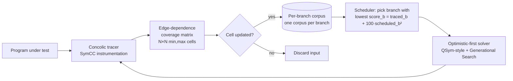

# Daily Scholar Papers Report — 2026-05-21

**[Download PDF](Daily_Papers_Report_2026-05-21.pdf)**

**Window covered:** 2026-05-20 → 2026-05-21 (Google Scholar alerts + user-curated self-emails, last 24 h)

---

## Executive Summary

Today's window surfaced one **Recommended articles** Scholar-alert thread containing two papers. One is an Outstanding deep-read — **"It's Not You, It's Me: Reevaluating the Relationship between Concolic Execution and Fuzzing"** by Dresel, Pletinckx, Gritti, Payer, Vigna, and Kruegel (UC Santa Barbara + EPFL) at *EuroS&P 2026* — which builds **SYMCTS**, a *standalone* concolic executor that breaks from the now-orthodox "concolic-as-fuzzer-component" paradigm. The paper introduces two cleanly-separated contributions: an **edge-dependence coverage metric** (an N×N matrix where cell `(b1, b2)` stores the min/max execution count of branch `b2` across inputs that also took `b1`) and an **under-explored branch scheduler** with priority `score_b = traced_b + (100·scheduled_b)²`. On the UniBench suite with an empty corpus, SYMCTS reaches highest coverage on 15/19 targets; against the state-of-the-art concolic tool MARCO on 12 FuzzBench targets, SYMCTS's *worst* run beats MARCO's *best* run on 6/12 targets. The artefact is MIT-licensed at `github.com/ucsb-seclab/symcts`. The thesis is genuinely contrarian to a decade of hybrid-fuzzing-dominated direction and is supported by clean ablation tables. No papers were excluded under the author-level exclusion list. No user-curated self-emails landed in the window.

**Outstanding:** 1 · **Keep:** 0 · **Borderline High-Priority:** 0

The full analysis follows.

---

## Highlighted Papers

| # | Title | Authors | Venue | Link |
|---|-------|---------|-------|------|
| 5.1 | It's Not You, It's Me: Reevaluating the Relationship between Concolic Execution and Fuzzing | Lukas Dresel, Stijn Pletinckx, Fabio Gritti, Mathias Payer, Giovanni Vigna, Christopher Kruegel | *IEEE EuroS&P*, 2026 | [PDF (nebelwelt.net)](https://nebelwelt.net/files/26EuroSP.pdf) |

---

## Outstanding Deep-Reads

<strong>5.1</strong> · CONCOLIC-EXEC · UCSB + EPFL build SYMCTS, a standalone concolic executor with an N×N edge-dependence coverage matrix and an under-explored-branch scheduler that on 6/12 FuzzBench targets has a *worst* run beating MARCO's *best* run<a href="https://github.com/MarkLee131/paper-digest/issues/new?title=%5Bfeedback%5D+2026-05-21-5.1+UCSB+%2B+EPFL+build+SYMCTS%2C+a+standalone+concolic+executor+with+an+N%C3%97N+edge-dependence+coverage+matrix+and+an+under-explored-branch+scheduler+that+on+6%2F12+FuzzBench+targets+has+a+%2Aworst%2A+run+beating+MARCO%27s+%2Abest%2A+run+%F0%9F%91%8D&body=paper_id%3A+2026-05-21-5.1%0Atitle%3A+UCSB+%2B+EPFL+build+SYMCTS%2C+a+standalone+concolic+executor+with+an+N%C3%97N+edge-dependence+coverage+matrix+and+an+under-explored-branch+scheduler+that+on+6%2F12+FuzzBench+targets+has+a+%2Aworst%2A+run+beating+MARCO%27s+%2Abest%2A+run%0Aauthors%3A+Lukas+Dresel%2C+Stijn+Pletinckx%2C+Fabio+Gritti%2C+Mathias+Payer%2C+Giovanni+Vigna%2C+Christopher+Kruegel%0Avenue%3A+%2AIEEE+European+Symposium+on+Security+and+Privacy+%28EuroS%26P%29%2A%2C+2026%0Atopic%3A+CONCOLIC-EXEC%0Arating%3A+thumbs-up%0A%0A%3C%21--+Optional+notes+below+this+line+are+read+by+preferences.py+as+soft+signals.+--%3E%0A&labels=feedback%2Cthumbs-up" target="_blank" rel="noopener" class="fb-thumbs-up" title="thumbs up" onclick="event.stopPropagation()">👍</a><a href="https://github.com/MarkLee131/paper-digest/issues/new?title=%5Bfeedback%5D+2026-05-21-5.1+UCSB+%2B+EPFL+build+SYMCTS%2C+a+standalone+concolic+executor+with+an+N%C3%97N+edge-dependence+coverage+matrix+and+an+under-explored-branch+scheduler+that+on+6%2F12+FuzzBench+targets+has+a+%2Aworst%2A+run+beating+MARCO%27s+%2Abest%2A+run+%F0%9F%AB%A5&body=paper_id%3A+2026-05-21-5.1%0Atitle%3A+UCSB+%2B+EPFL+build+SYMCTS%2C+a+standalone+concolic+executor+with+an+N%C3%97N+edge-dependence+coverage+matrix+and+an+under-explored-branch+scheduler+that+on+6%2F12+FuzzBench+targets+has+a+%2Aworst%2A+run+beating+MARCO%27s+%2Abest%2A+run%0Aauthors%3A+Lukas+Dresel%2C+Stijn+Pletinckx%2C+Fabio+Gritti%2C+Mathias+Payer%2C+Giovanni+Vigna%2C+Christopher+Kruegel%0Avenue%3A+%2AIEEE+European+Symposium+on+Security+and+Privacy+%28EuroS%26P%29%2A%2C+2026%0Atopic%3A+CONCOLIC-EXEC%0Arating%3A+thumbs-down%0A%0A%3C%21--+Optional+notes+below+this+line+are+read+by+preferences.py+as+soft+signals.+--%3E%0A&labels=feedback%2Cthumbs-down" target="_blank" rel="noopener" class="fb-thumbs-down" title="less interested" onclick="event.stopPropagation()">🫥</a><a href="https://github.com/MarkLee131/paper-digest/issues/new?title=%5Bfeedback%5D+2026-05-21-5.1+UCSB+%2B+EPFL+build+SYMCTS%2C+a+standalone+concolic+executor+with+an+N%C3%97N+edge-dependence+coverage+matrix+and+an+under-explored-branch+scheduler+that+on+6%2F12+FuzzBench+targets+has+a+%2Aworst%2A+run+beating+MARCO%27s+%2Abest%2A+run+%F0%9F%94%96&body=paper_id%3A+2026-05-21-5.1%0Atitle%3A+UCSB+%2B+EPFL+build+SYMCTS%2C+a+standalone+concolic+executor+with+an+N%C3%97N+edge-dependence+coverage+matrix+and+an+under-explored-branch+scheduler+that+on+6%2F12+FuzzBench+targets+has+a+%2Aworst%2A+run+beating+MARCO%27s+%2Abest%2A+run%0Aauthors%3A+Lukas+Dresel%2C+Stijn+Pletinckx%2C+Fabio+Gritti%2C+Mathias+Payer%2C+Giovanni+Vigna%2C+Christopher+Kruegel%0Avenue%3A+%2AIEEE+European+Symposium+on+Security+and+Privacy+%28EuroS%26P%29%2A%2C+2026%0Atopic%3A+CONCOLIC-EXEC%0Arating%3A+save-for-later%0A%0A%3C%21--+Optional+notes+below+this+line+are+read+by+preferences.py+as+soft+signals.+--%3E%0A&labels=feedback%2Csave-for-later" target="_blank" rel="noopener" class="fb-save-for-later" title="save for later" onclick="event.stopPropagation()">🔖</a>

### 5.1 It's Not You, It's Me: Reevaluating the Relationship between Concolic Execution and Fuzzing

[PDF on nebelwelt.net (Mathias Payer's group page)](https://nebelwelt.net/files/26EuroSP.pdf) · [Source (MIT) at github.com/ucsb-seclab/symcts](https://github.com/ucsb-seclab/symcts)

**Title:** It's Not You, It's Me: Reevaluating the Relationship between Concolic Execution and Fuzzing
**Authors:** Lukas Dresel, Stijn Pletinckx, Fabio Gritti, Mathias Payer, Giovanni Vigna, Christopher Kruegel
**Affiliations:** UC Santa Barbara (Dresel, Pletinckx, Gritti, Vigna, Kruegel) and EPFL (Payer)
**Venue:** *IEEE European Symposium on Security and Privacy (EuroS&P)*, 2026
**Year:** 2026
**Link:** [https://nebelwelt.net/files/26EuroSP.pdf](https://nebelwelt.net/files/26EuroSP.pdf)
**License:** IEEE EuroS&P (paywalled-on-publish; author copy self-hosted). No original figures embedded in this report; reproductions are recreations, not lifts.
**Source signal:** Scholar alert "Recommended articles" 2026-05-19 21:43 UTC, position 1 in the alert thread.

#### Thesis

A decade of concolic-executor research has implicitly accepted *hybrid fuzzing* — concolic execution coupled to a coverage-guided fuzzer — as the deployment model. As a result, recent concolic executors (QSym, SymCC, SymQEMU, SymSan, JIGSAW, Triereme, MARCO) have all been engineered to satisfy the fuzzer's contract: feeding low-throughput, high-quality concolic outputs into a high-throughput coverage feedback loop optimised for the fuzzer's own mutated inputs. The authors argue this co-design has structurally biased the field — the concolic side of the pipeline cannot use its strengths because every metric it sees is *the fuzzer's metric*. The proposed inversion is *decouple* concolic from fuzzing: build the executor as a first-class standalone exploration driver with metrics and scheduling tailored to its own throughput profile. The artefact is **SYMCTS**.

#### Design — the two new mechanisms

**Edge-dependence coverage** replaces the AFL-style flat hitcount with an N×N matrix `M` over branches, where each cell `M[b1, b2] = (min_k, max_k)` records the minimum and maximum number of times branch `b2` was executed across all inputs in the corpus that also executed branch `b1`. Whenever a new input changes any cell's min or max, the input is considered interesting and is added to a *per-branch* corpus (rather than a single global corpus). This decouples the "is this input interesting" question from a single linear coverage vector and makes the metric context-sensitive at quadratic memory cost. Concretely: branch `b22` reached after a 32-bit-ELF branch `b7` is now distinct from `b22` reached after a 64-bit-ELF branch `b11`, because the two paths land in different rows of the matrix.

**Under-explored branch scheduling.** Each branch carries two integer counters: `traced_b` (how many times the concolic executor has traced through it) and `scheduled_b` (how many times one of its corpus inputs has been picked for mutation). The scheduler picks the branch with the lowest priority score:

`score_b = traced_b + (100 · scheduled_b)²` *(paper §4.1.2)*

The `100×` weight on `scheduled_b` (then squared) is calibrated to the 60×–250× concolic-instrumentation overhead measured in prior work — effectively, "scheduling a branch once" is priced like ~100 traces through it. The lowest-score branch wins, with one of its corpus inputs picked for mutation.

The mutation pipeline inherits from QSym/SymCC but flips the solving order to *optimistic-first* (fallback only on optimistic success); SAGE-style generational search prevents re-solving identical constraints.

*Recreation of SYMCTS's per-branch corpus / coverage loop, drawn from the design described in Section 4 of the paper. Not lifted from the paper's Figure 1.*

#### Headline numbers

Across UniBench (19 targets, 24 h, 3 trials, 32 GB RAM, 1 dedicated core per executor, AWS c6a.24xlarge):

| Corpus | SYMCTS rank | Median Δ vs ablations | Edge-dependence isolated Δ (mean / median) |
|---|---|---|---|
| Empty | 1st on 15/19 targets, 2nd on the rest | −9.1 % vs SymCTS-L (no edge-dependence); −58.2 % vs SymCC | +32.2 % / +10.0 % |
| UniBench | 1st or 2nd on 18/19 targets | −2.8 % vs SymCTS-L | +9.0 % / +2.9 % |
| Saturated | edge-dependence configs lead 14/19 targets | scheduler now a small net liability (−0.7 % median) | +1.5 % / +0.6 % |

Optimistic-first solving matters: full-solve-only loses ~19 % median coverage vs SYMCTS in the 12 h empty-corpus evaluation; SymCC-style full-first loses ~0.53 %.

Against **MARCO** (Hu et al. ICSE'24, Thompson-Sampling branch-flipping) on 12 FuzzBench targets, 96 h each: SYMCTS beats MARCO on min/max/median/mean on 10/12 targets and ties on 1 (jsoncpp). On **6/12** targets the *worst* SYMCTS run beats the *best* MARCO run. On **8/12** targets SYMCTS reaches higher 12 h coverage than MARCO reached at 96 h.

Against grey-box (AFL++) and hybrid (SymCC+AFL++, SymSan+AFL++) fuzzers on FuzzBench, 96 h: standalone concolic execution loses on the majority of targets — *but* on three notable targets SYMCTS leads or competes: `lcms_cms_transform_fuzzer` (SYMCTS > AFL++ throughout), `openthread_ot-ip6-send-fuzzer` (SYMCTS surpasses all approaches after ~80 h), `stb_stbi_read_fuzzer` (SYMCTS temporarily leads around the 30 h mark before fuzzers catch up). These exceptions are the point — they demonstrate that *standalone concolic* is not strictly dominated and remains a viable independent research direction.

#### Why this matters beyond SYMCTS

The edge-dependence coverage metric is a **portable building block**. It is essentially a 2-context-sensitive branch coverage metric with min/max execution-count bookkeeping per pair, sitting at the middle of the spectrum between AFL's flat edge hitcount and KLEE's full-path coverage. Any fuzzer that adopted edge-dependence as an *additional* feedback channel (not a replacement) would inherit context-sensitivity at quadratic-in-branches memory cost. On small-to-medium binaries this is affordable; SYMCTS only escapes the cost question because the concolic executor's already-low throughput hides the per-input metric overhead.

The under-explored branch scheduling formula is two integer counters and one quadratic expression per branch. It is independent of edge-dependence — the paper isolates each contribution in separate ablated configurations (SymCTS-L removes edge-dependence; SymCTS-S removes the under-explored scheduler) to show that each pulls its weight on the empty/UniBench corpora, while only edge-dependence carries the win on saturated corpora.

#### Stated limitations

Inherited from SymCC instrumentation: no input-length mutations; concrete-but-symbolically-controlled variables get concretised; first-access symbolic memory model. Quadratic memory cost of the N×N edge-dependence matrix makes it infeasible for very large targets (Linux kernel, Chromium). The under-explored scheduler hurts saturated-corpus performance because it does not give the seed corpus's prior knowledge any special weight — SymCC's "favour starting-corpus inputs" prior is better in that regime.

The paper's broader argument also has a hedge: standalone concolic execution still loses to hybrid fuzzers on most FuzzBench targets. The win is *paradigm-shifting*, not (yet) a universally better artefact.

#### Reproducibility

Source at [github.com/ucsb-seclab/symcts](https://github.com/ucsb-seclab/symcts) (MIT). Docker artefacts at hub.docker.com/symcts. Hardware: 9× AWS c6a.24xlarge for the main UniBench sweep; 2× 48-physical-core / 378 GB RAM workstation for the MARCO comparison. Each experiment: 32 GB / 1 core / 24 h, 3 trials.

#### Closing line (verbatim from §9 Conclusion)

> *"our results show that the strengths of concolic execution are indeed underexplored"*

---

## Cross-Paper Synthesis

Today's single deep-read sits on a recurring axis from the past month's reports: **the limits of compositional analysis pipelines where one component is implicitly designed against another component's contract.** Earlier in May the digest covered patch-management CLM evaluations whose error modes were driven by mismatched assumptions between the CLM and the downstream patch-presence-test oracle; today's paper makes the same argument one level down the stack — concolic executors implicitly designed to satisfy a fuzzer's coverage contract end up under-using their own strengths. The structural fix is the same shape in both cases: give the slower, more precise component its own metric and let it explore independently before re-syncing.

The "edge-dependence coverage" idea also belongs on the list of *portable* building blocks worth tracking. As a 2-context-sensitive coverage map with min/max execution-count cells, it is one of the rare middle-ground metrics between flat AFL-edge-hitcount and KLEE-style full-path coverage. A fuzzer designer could in principle adopt it as a secondary feedback channel for small-to-medium binaries; the cost — N² memory — is the same trade-off KLEE has long made on the full-path end, but capped to depth-2 dependencies.

A second through-line, picking up from last week's notes: **the standalone-vs-component re-framing of established tools.** Last week's pattern was "LLM as search driver, sound non-LLM tool as inner-loop verifier." Today's paper is the same shape inverted — concolic executor as the search driver, with the per-branch corpus and the optimistic-first solver pipeline as the supporting tooling, and the fuzzer (if present at all) as a defensive synchronisation fallback. The community's default coupling has been "fuzzer drives, concolic helps"; SYMCTS argues for "concolic drives, fuzzer defends." A useful exercise for future digests: enumerate which other compositional security-tool pipelines have a similar "follower drives the leader" inversion to discover. Candidates that come to mind include directed greybox fuzzing where the static analysis currently steers the fuzzer rather than the other way round, and LLM-aided exploit generation where the symbolic engine currently follows the LLM rather than steering it.

## Writing & Rationale Insights

Three small meta-observations from today's window.

First, the Scholar recommendation engine paired a saturated-topic empirical study with a paradigm-shifting top-venue paper inside a *single* "Recommended articles" thread. The signal-to-noise inside a Scholar alert is therefore not zero — the engine can pull a real Outstanding directly adjacent to a Skip. The triage path should keep aggressively reading *all* positions inside each alert thread, not peeling off the top result only. (We did so today; that is how SYMCTS surfaced — position 1, not position 0.)

Second, when a EuroS&P paper is self-hosted at a known author group page on the day of acceptance, that is itself a soft signal — Payer's group has a consistent track record of self-hosting accepted papers in advance of the venue's public proceedings. For future Stage-1 triage, "self-hosted at a known author homepage" should be treated as a positive prior on the open-access likelihood, which in turn correlates with downstream artefact availability (here, MIT-licensed source plus Docker images).

Third, papers that *isolate* their contributions through ablated configurations — SYMCTS's L / S / LS / default four-way decomposition — are dramatically easier to extract a transferable engineering lesson from than papers that ship a monolithic system and report a single end-to-end number. The four-way ablation here is what makes "the under-explored scheduler is a net liability on saturated corpora" a discoverable fact rather than a hidden footnote. When evaluating future submissions in this digest, the *presence of clean per-component ablation* should be a positive weight on the Outstanding decision boundary.
