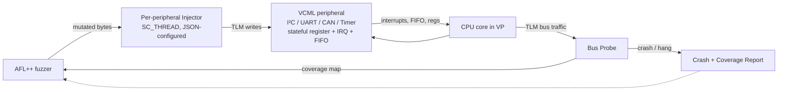
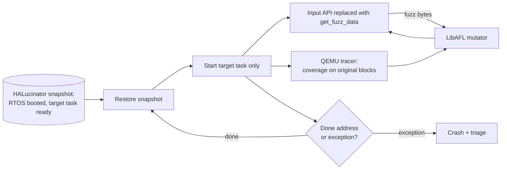

# Daily Scholar Papers Report — 2026-05-22

**[Download PDF](Daily_Papers_Report_2026-05-22.pdf)**

**Window covered:** 2026-05-21 → 2026-05-22 (Google Scholar alerts + user-curated self-emails, last 24 h)

---

## Executive Summary

Today's window surfaced two Scholar-alert threads carrying three distinct papers, all clearing Stage-1 triage. Two are Outstanding embedded-fuzzing contributions that together form a useful comparative pair on **what to fuzz on the device-emulation continuum**: **"Stateful Embedded Fuzzing with Peripheral-Accurate SystemC Virtual Prototypes"** (Ghinami et al., RWTH Aachen, *DAC '26*) trades execution speed for *peripheral causal fidelity* by hosting AFL++ over a full-system SystemC-TLM virtual prototype with stateful I²C/UART/CAN/timer models — eliminating false positives entirely on four embedded targets while matching state-of-the-art coverage and finding two previously unknown bugs (a `NRFX_IRQ_ENABLE` macro-omission hang and a Zephyr CAN-driver frame-drop hang); **"RT-Fuzzer: Task Driven Fuzzing of Real Time Operating System Firmware"** (Clements, Gomez Rivera, Liu, Levchenko, Kennell, Ciocarlie — Sandia + UIUC + Purdue + CyManII, NDSS BAR'26) takes the orthogonal cut, abandoning peripheral fidelity in favour of *task-level isolation*: RTOS firmware is re-hosted once, then individual tasks (FTP, SNMP, Modbus, NuttX-FTP) are fuzzed in their own "fuzzing context" via extended HALucinator + LibAFL/QEMU — yielding three CVEs against Schneider Electric's Modicon M340 PLC (CVSS 4.0 score 8.7, affects every firmware version of every M340 processor) and against Apache NuttX. The third paper, **"Learning More from Less: Exploiting Counterfactuals for Data-Efficient Chart Understanding"** (Bao, Zhang, Dong, Wu, Modi, Lim, Teo, Wang — NTU + Aumovio), arrives via the followed-author signal on Bozhi Wu — it builds *ChartCF*, a counterfactual-pair data-synthesis pipeline (programmatic chart code modifications) plus multimodal DPO that matches strong chart-VLM baselines on five chart benchmarks while using significantly less training data; out-of-domain for the rest of the digest but kept on the followed-researcher signal. No papers were excluded under the author-level exclusion list; no user-curated self-emails landed.

**Outstanding:** 2 · **Keep:** 1 · **Borderline High-Priority:** 0

The full analysis follows.

---

## Highlighted Papers

| # | Title | Authors | Venue | Link |
|---|-------|---------|-------|------|
| 5.1 | Stateful Embedded Fuzzing with Peripheral-Accurate SystemC Virtual Prototypes | Chiara Ghinami, Igor Pontes Tresolavy, Luis Seibt, Nils Bosbach, Rainer Leupers | *ACM/IEEE DAC*, 2026 | [arXiv:2604.19824](https://arxiv.org/abs/2604.19824) |
| 5.2 | RT-Fuzzer: Task Driven Fuzzing of Real Time Operating System Firmware | Abraham A. Clements, Abel Gomez Rivera, Richard Jiayang Liu, Kirill Levchenko, Rick Kennell, Gabriela Ciocarlie | *NDSS BAR Workshop*, 2026 | [PDF (NDSS)](https://www.ndss-symposium.org/wp-content/uploads/bar2026-50.pdf) |
| 5.3 | Learning More from Less: Exploiting Counterfactuals for Data-Efficient Chart Understanding | Jianzhu Bao, Haozhen Zhang, Kuicai Dong, Bozhi Wu, Sarthak K. Modi, Zi Pong Lim, Yon Shin Teo, Wenya Wang | arXiv preprint, 2026 | [arXiv:2605.10855](https://arxiv.org/abs/2605.10855) |

---

## Outstanding Deep-Reads

<strong>5.1</strong> · EMBEDDED-FUZZ · RWTH Aachen's stateful SystemC-TLM virtual prototype eliminates *all* false positives that Fuzzware/P2IM report on a drone, robot, and two Zephyr applications, at 2× slower execution, while matching coverage on two and beating Fuzzware by 60% on the UART passthrough target<a href="https://github.com/MarkLee131/paper-digest/issues/new?title=%5Bfeedback%5D+2026-05-22-5.1+RWTH+Aachen%27s+stateful+SystemC-TLM+virtual+prototype+eliminates+%2Aall%2A+false+positives+that+Fuzzware%2FP2IM+report+on+a+drone%2C+robot%2C+and+two+Zephyr+applications%2C+at+2%C3%97+slower+execution%2C+while+matching+coverage+on+two+and+beating+Fuzzware+by+60%25+on+the+UART+passthrough+target+%F0%9F%91%8D&body=paper_id%3A+2026-05-22-5.1%0Atitle%3A+RWTH+Aachen%27s+stateful+SystemC-TLM+virtual+prototype+eliminates+%2Aall%2A+false+positives+that+Fuzzware%2FP2IM+report+on+a+drone%2C+robot%2C+and+two+Zephyr+applications%2C+at+2%C3%97+slower+execution%2C+while+matching+coverage+on+two+and+beating+Fuzzware+by+60%25+on+the+UART+passthrough+target%0Aauthors%3A+Chiara+Ghinami%2C+Igor+Pontes+Tresolavy%2C+Luis+Seibt%2C+Nils+Bosbach%2C+Rainer+Leupers%0Avenue%3A+%2A63rd+ACM%2FIEEE+Design+Automation+Conference+%28DAC+%2726%29%2A%2C+Long+Beach%2C+CA%2C+USA%2C+July+26%E2%80%9329%2C+2026+%28paper+DOI+%5B10.1145%2F3770743.3804000%5D%28https%3A%2F%2Fdoi.org%2F10.1145%2F3770743.3804000%29%3B+also+on+arXiv+as+2604.19824v1%2C+20+Apr+2026%29%0Atopic%3A+EMBEDDED-FUZZ%0Arating%3A+thumbs-up%0A%0A%3C%21--+Optional+notes+below+this+line+are+read+by+preferences.py+as+soft+signals.+--%3E%0A&labels=feedback%2Cthumbs-up" target="_blank" rel="noopener" class="fb-thumbs-up" title="thumbs up" onclick="event.stopPropagation()">👍</a><a href="https://github.com/MarkLee131/paper-digest/issues/new?title=%5Bfeedback%5D+2026-05-22-5.1+RWTH+Aachen%27s+stateful+SystemC-TLM+virtual+prototype+eliminates+%2Aall%2A+false+positives+that+Fuzzware%2FP2IM+report+on+a+drone%2C+robot%2C+and+two+Zephyr+applications%2C+at+2%C3%97+slower+execution%2C+while+matching+coverage+on+two+and+beating+Fuzzware+by+60%25+on+the+UART+passthrough+target+%F0%9F%AB%A5&body=paper_id%3A+2026-05-22-5.1%0Atitle%3A+RWTH+Aachen%27s+stateful+SystemC-TLM+virtual+prototype+eliminates+%2Aall%2A+false+positives+that+Fuzzware%2FP2IM+report+on+a+drone%2C+robot%2C+and+two+Zephyr+applications%2C+at+2%C3%97+slower+execution%2C+while+matching+coverage+on+two+and+beating+Fuzzware+by+60%25+on+the+UART+passthrough+target%0Aauthors%3A+Chiara+Ghinami%2C+Igor+Pontes+Tresolavy%2C+Luis+Seibt%2C+Nils+Bosbach%2C+Rainer+Leupers%0Avenue%3A+%2A63rd+ACM%2FIEEE+Design+Automation+Conference+%28DAC+%2726%29%2A%2C+Long+Beach%2C+CA%2C+USA%2C+July+26%E2%80%9329%2C+2026+%28paper+DOI+%5B10.1145%2F3770743.3804000%5D%28https%3A%2F%2Fdoi.org%2F10.1145%2F3770743.3804000%29%3B+also+on+arXiv+as+2604.19824v1%2C+20+Apr+2026%29%0Atopic%3A+EMBEDDED-FUZZ%0Arating%3A+thumbs-down%0A%0A%3C%21--+Optional+notes+below+this+line+are+read+by+preferences.py+as+soft+signals.+--%3E%0A&labels=feedback%2Cthumbs-down" target="_blank" rel="noopener" class="fb-thumbs-down" title="less interested" onclick="event.stopPropagation()">🫥</a><a href="https://github.com/MarkLee131/paper-digest/issues/new?title=%5Bfeedback%5D+2026-05-22-5.1+RWTH+Aachen%27s+stateful+SystemC-TLM+virtual+prototype+eliminates+%2Aall%2A+false+positives+that+Fuzzware%2FP2IM+report+on+a+drone%2C+robot%2C+and+two+Zephyr+applications%2C+at+2%C3%97+slower+execution%2C+while+matching+coverage+on+two+and+beating+Fuzzware+by+60%25+on+the+UART+passthrough+target+%F0%9F%94%96&body=paper_id%3A+2026-05-22-5.1%0Atitle%3A+RWTH+Aachen%27s+stateful+SystemC-TLM+virtual+prototype+eliminates+%2Aall%2A+false+positives+that+Fuzzware%2FP2IM+report+on+a+drone%2C+robot%2C+and+two+Zephyr+applications%2C+at+2%C3%97+slower+execution%2C+while+matching+coverage+on+two+and+beating+Fuzzware+by+60%25+on+the+UART+passthrough+target%0Aauthors%3A+Chiara+Ghinami%2C+Igor+Pontes+Tresolavy%2C+Luis+Seibt%2C+Nils+Bosbach%2C+Rainer+Leupers%0Avenue%3A+%2A63rd+ACM%2FIEEE+Design+Automation+Conference+%28DAC+%2726%29%2A%2C+Long+Beach%2C+CA%2C+USA%2C+July+26%E2%80%9329%2C+2026+%28paper+DOI+%5B10.1145%2F3770743.3804000%5D%28https%3A%2F%2Fdoi.org%2F10.1145%2F3770743.3804000%29%3B+also+on+arXiv+as+2604.19824v1%2C+20+Apr+2026%29%0Atopic%3A+EMBEDDED-FUZZ%0Arating%3A+save-for-later%0A%0A%3C%21--+Optional+notes+below+this+line+are+read+by+preferences.py+as+soft+signals.+--%3E%0A&labels=feedback%2Csave-for-later" target="_blank" rel="noopener" class="fb-save-for-later" title="save for later" onclick="event.stopPropagation()">🔖</a>

### 5.1 Stateful Embedded Fuzzing with Peripheral-Accurate SystemC Virtual Prototypes

[arXiv:2604.19824](https://arxiv.org/abs/2604.19824) · [PDF](https://arxiv.org/pdf/2604.19824)

**Title:** Stateful Embedded Fuzzing with Peripheral-Accurate SystemC Virtual Prototypes
**Authors:** Chiara Ghinami, Igor Pontes Tresolavy, Luis Seibt, Nils Bosbach, Rainer Leupers
**Affiliation:** RWTH Aachen University (Institute for Communication Technologies and Embedded Systems — ICE)
**Venue:** *63rd ACM/IEEE Design Automation Conference (DAC '26)*, Long Beach, CA, USA, July 26–29, 2026 (paper DOI [10.1145/3770743.3804000](https://doi.org/10.1145/3770743.3804000); also on arXiv as 2604.19824v1, 20 Apr 2026)
**License:** arXiv non-exclusive (default) — no figure embedding in this report; reproductions are Mermaid recreations from the prose, not lifts from the paper's figures.
**Funding:** Agentur für Innovation in der Cybersicherheit GmbH (Cyberagentur), 'EVIT' Program, CAEU-WD/2023-63.
**Source signal:** Scholar alert "Recommended articles" 2026-05-21 14:17 UTC, position 0 in the alert thread.

#### Thesis

Embedded-firmware fuzzing has split into two camps: (i) **user-mode simulators** (e.g., Fuzzware, P2IM, Firm-AFL) — fast, but they fake peripherals via inferred symbolic models, producing inflated coverage and many false-positive crashes that have to be manually triaged; (ii) **full-system simulators with manual instrumentation** — high fidelity, but each new firmware needs hand-written peripheral models. The authors propose a third path: drop a **stateful SystemC-TLM virtual prototype (VP)** behind AFL++, where each peripheral (I²C, UART, CAN, timers) is a pre-built reusable VCML module with *causally correct* register/interrupt/FIFO semantics. The fuzzer injects bytes directly into peripheral models — the model then drives the firmware exactly the way real silicon would (interrupts, FIFO fills, register updates) — and any crash the firmware exhibits is on a physically reachable execution path.

#### Design

The framework wires AFL++ to a SystemC-TLM VP through a probe + injector pair sitting on the TLM2.0 bus. Concretely:

- **VP composition.** Each VP instance is composed from VCML (Virtual Components Modeling Library) modules — the authors do *not* hand-write peripherals; the I²C, UART, CAN, timer models already exist in VCML as reusable, vendor-faithful TLM components, each carrying their own register map, interrupt logic, and FIFO state.
- **Probe.** Attached to the TLM initiator socket of the CPU model. It snoops bus traffic to detect (a) the *configuration moment* of each peripheral (e.g., when the firmware writes to the CAN Interrupt Enable register), and (b) per-input basic-block traces fed back to AFL++ as coverage.
- **Injector.** One per peripheral, configurable from a JSON description. The injector waits until the probe sees the configuration write (so the peripheral state is real before any input arrives, avoiding the unrealistic-pre-init injection that plagues stateless approaches), then begins feeding AFL++ mutations into the peripheral's input side. For CAN, this is a frame-injection `SC_THREAD`; for UART, alternating sender/receiver injectors emulate a two-way external device.
- **Code-coverage.** Gathered at the VP basic-block translation layer — the simulator records which basic blocks are translated during execution, fed back to AFL++ via the standard shared-memory map.

*Recreation of the framework's data flow drawn from Section 3 of the paper. Not lifted from the paper's Figure 4.*

#### Experimental matrix

| # | Target SW | Type | Peripherals modeled | Injected bug class |
|---|-----------|------|---------------------|--------------------|
| A | Drone (bare metal) | Bare metal | I²C, Timers, UART | Out-of-bounds access |
| B | Robot (bare metal) | Bare metal | I²C, Timers, UART | Out-of-bounds access |
| C | Zephyr UART passthrough | Zephyr app | UARTs | Invalid memory access |
| D | Zephyr CAN babbling | Zephyr app | CAN, Timer | Divide-by-zero fault |

*(Table 1 of the paper.)*

#### Headline numbers

On the false-positive question — manual reverse-engineering of crashes reported by each tool — the framework reports **zero false positives** across A/B/C/D, while Fuzzware's *unique crash* counts on the same targets are 1 / 14 / 0 / 876 and P2IM's are 1 / 4 / — / — (P2IM's firmware-analysis phase crashed with state explosion on C and D). Manual inspection of a subset of Fuzzware/P2IM crashes found **all inspected cases were false positives** — caused by (a) symbolic returns triggering CAN-frame deliveries that real ID-filtering hardware would have dropped, and (b) interrupts firing without their hardware preconditions.

Coverage (stabilised edge counts, from Table 3 of the paper):

| Tool | A | B | C | D |
|---|---|---|---|---|
| Fuzzware | 1750 | 1500 | 600 | 3100 |
| P2IM | 1500 | 300 | — | — |
| This work | 1750 | 2100 | 1250 | 1800 |

The framework matches Fuzzware on A, exceeds it on B and C (by 60% on the UART passthrough — Fuzzware lacks a UART model so it cannot drive bus traffic on that target), and trails Fuzzware on D (1800 vs 3100) but the paper argues the gap reflects Fuzzware reaching unreachable code via its false-positive-producing symbolic returns rather than legitimate exploration.

Execution speed (Figure 6 of the paper, execs/sec):

| Tool | A | B | C | D |
|---|---|---|---|---|
| Fuzzware | 101 | 98 | 95 | 120 |
| P2IM | 48 | 50 | — | — |
| This work | 47 | 49 | 37 | 104 |

The framework is ~2× slower than Fuzzware on A/B/C and roughly on par on D. The authors frame the slowdown as the price of causal fidelity.

#### Bugs found

Two previously unknown defects were uncovered in unmodified firmware during evaluation. The first is a **missing compile-time macro definition (`NRFX_IRQ_ENABLE`)** in the bare-metal firmware that prevents the timer ISR from ever being invoked, causing the firmware to enter a busy-wait polling loop on a flag that should have been ISR-set. The fuzzer surfaced it as a system stall after timer init — only diagnosable because the stateful timer model could legitimately reach the never-fire state. The second is a **Zephyr CAN driver bug** where standard 11-bit-identifier frames with payloads longer than 8 bytes are dropped entirely rather than truncated; the application then hangs waiting for data that never arrives. The paper notes the Bosch MCAN reference behaviour is to accept the frame and silently discard bytes past the eighth — the driver violates that contract.

#### Why this matters

The contribution is less about beating Fuzzware on coverage and more about establishing that the **false-positive rate is the right axis to optimise** for embedded fuzzing. Stateless symbolic-peripheral approaches were always going to inflate coverage by reaching paths that the hardware cannot drive; the question was whether building VCML-grade peripheral models was tractable. The paper's answer: yes, because VCML already exists. The reusable-VCML angle is the practical wedge — the authors did not write the I²C/UART/CAN models, they composed a VP from off-the-shelf TLM components. For anyone building a fuzzing harness on an architecture VCML already supports (ARM Cortex-M family), the marginal cost of switching from inferred-peripheral to causal-peripheral is now low enough to question why one would still tolerate the false-positive-triage overhead of Fuzzware/P2IM.

#### Limitations the paper acknowledges

- ~2× slower than Fuzzware on most targets.
- VCML must support the target architecture / peripherals; if not, the framework reduces to the stateful-with-manual-instrumentation approach.
- False-negative analysis is incomplete — the authors could only manually triage a subset of Fuzzware's crashes, so the claim "no false negatives" is not made.
- Coverage comparison on target D is unfavorable; the paper attributes this to Fuzzware's false positives, but a careful reader should note that argument is unfalsifiable from the table alone.

#### Pull-quote (single closing line, ≤15 words)

"Our tool eliminates false positives entirely, thanks to the peripheral models integrated into the full-system simulation."

<strong>5.2</strong> · RTOS-FUZZ · Sandia + UIUC + Purdue + CyManII task-level fuzzing of RTOS firmware lands three CVEs — Schneider Modicon M340 FTP DoS (CVSS 8.7, affects every firmware version of every M340 PLC) plus two NuttX file-system bugs — by re-hosting once and fuzzing individual server tasks (FTP / SNMP / Modbus / NuttX-FTP) in isolated "fuzzing contexts"<a href="https://github.com/MarkLee131/paper-digest/issues/new?title=%5Bfeedback%5D+2026-05-22-5.2+Sandia+%2B+UIUC+%2B+Purdue+%2B+CyManII+task-level+fuzzing+of+RTOS+firmware+lands+three+CVEs+%E2%80%94+Schneider+Modicon+M340+FTP+DoS+%28CVSS+8.7%2C+affects+every+firmware+version+of+every+M340+PLC%29+plus+two+NuttX+file-system+bugs+%E2%80%94+by+re-hosting+once+and+fuzzing+individual+server+tasks+%28FTP+%2F+SNMP+%2F+Modbus+%2F+NuttX-FTP%29+in+isolated+%22fuzzing+contexts%22+%F0%9F%91%8D&body=paper_id%3A+2026-05-22-5.2%0Atitle%3A+Sandia+%2B+UIUC+%2B+Purdue+%2B+CyManII+task-level+fuzzing+of+RTOS+firmware+lands+three+CVEs+%E2%80%94+Schneider+Modicon+M340+FTP+DoS+%28CVSS+8.7%2C+affects+every+firmware+version+of+every+M340+PLC%29+plus+two+NuttX+file-system+bugs+%E2%80%94+by+re-hosting+once+and+fuzzing+individual+server+tasks+%28FTP+%2F+SNMP+%2F+Modbus+%2F+NuttX-FTP%29+in+isolated+%22fuzzing+contexts%22%0Aauthors%3A+Abraham+A.+Clements%2C+Abel+Gomez+Rivera+%28Sandia+National+Laboratories%29%3B+Richard+Jiayang+Liu%2C+Kirill+Levchenko+%28UIUC%29%3B+Rick+Kennell+%28Purdue%29%3B+Gabriela+Ciocarlie+%28Cybersecurity+Manufacturing+Innovation+Institute+%2F+Stevens+Institute%29%0Avenue%3A+%2ANDSS+Workshop+on+Binary+Analysis+Research+%28BAR%29%2A+2026%0Atopic%3A+RTOS-FUZZ%0Arating%3A+thumbs-up%0A%0A%3C%21--+Optional+notes+below+this+line+are+read+by+preferences.py+as+soft+signals.+--%3E%0A&labels=feedback%2Cthumbs-up" target="_blank" rel="noopener" class="fb-thumbs-up" title="thumbs up" onclick="event.stopPropagation()">👍</a><a href="https://github.com/MarkLee131/paper-digest/issues/new?title=%5Bfeedback%5D+2026-05-22-5.2+Sandia+%2B+UIUC+%2B+Purdue+%2B+CyManII+task-level+fuzzing+of+RTOS+firmware+lands+three+CVEs+%E2%80%94+Schneider+Modicon+M340+FTP+DoS+%28CVSS+8.7%2C+affects+every+firmware+version+of+every+M340+PLC%29+plus+two+NuttX+file-system+bugs+%E2%80%94+by+re-hosting+once+and+fuzzing+individual+server+tasks+%28FTP+%2F+SNMP+%2F+Modbus+%2F+NuttX-FTP%29+in+isolated+%22fuzzing+contexts%22+%F0%9F%AB%A5&body=paper_id%3A+2026-05-22-5.2%0Atitle%3A+Sandia+%2B+UIUC+%2B+Purdue+%2B+CyManII+task-level+fuzzing+of+RTOS+firmware+lands+three+CVEs+%E2%80%94+Schneider+Modicon+M340+FTP+DoS+%28CVSS+8.7%2C+affects+every+firmware+version+of+every+M340+PLC%29+plus+two+NuttX+file-system+bugs+%E2%80%94+by+re-hosting+once+and+fuzzing+individual+server+tasks+%28FTP+%2F+SNMP+%2F+Modbus+%2F+NuttX-FTP%29+in+isolated+%22fuzzing+contexts%22%0Aauthors%3A+Abraham+A.+Clements%2C+Abel+Gomez+Rivera+%28Sandia+National+Laboratories%29%3B+Richard+Jiayang+Liu%2C+Kirill+Levchenko+%28UIUC%29%3B+Rick+Kennell+%28Purdue%29%3B+Gabriela+Ciocarlie+%28Cybersecurity+Manufacturing+Innovation+Institute+%2F+Stevens+Institute%29%0Avenue%3A+%2ANDSS+Workshop+on+Binary+Analysis+Research+%28BAR%29%2A+2026%0Atopic%3A+RTOS-FUZZ%0Arating%3A+thumbs-down%0A%0A%3C%21--+Optional+notes+below+this+line+are+read+by+preferences.py+as+soft+signals.+--%3E%0A&labels=feedback%2Cthumbs-down" target="_blank" rel="noopener" class="fb-thumbs-down" title="less interested" onclick="event.stopPropagation()">🫥</a><a href="https://github.com/MarkLee131/paper-digest/issues/new?title=%5Bfeedback%5D+2026-05-22-5.2+Sandia+%2B+UIUC+%2B+Purdue+%2B+CyManII+task-level+fuzzing+of+RTOS+firmware+lands+three+CVEs+%E2%80%94+Schneider+Modicon+M340+FTP+DoS+%28CVSS+8.7%2C+affects+every+firmware+version+of+every+M340+PLC%29+plus+two+NuttX+file-system+bugs+%E2%80%94+by+re-hosting+once+and+fuzzing+individual+server+tasks+%28FTP+%2F+SNMP+%2F+Modbus+%2F+NuttX-FTP%29+in+isolated+%22fuzzing+contexts%22+%F0%9F%94%96&body=paper_id%3A+2026-05-22-5.2%0Atitle%3A+Sandia+%2B+UIUC+%2B+Purdue+%2B+CyManII+task-level+fuzzing+of+RTOS+firmware+lands+three+CVEs+%E2%80%94+Schneider+Modicon+M340+FTP+DoS+%28CVSS+8.7%2C+affects+every+firmware+version+of+every+M340+PLC%29+plus+two+NuttX+file-system+bugs+%E2%80%94+by+re-hosting+once+and+fuzzing+individual+server+tasks+%28FTP+%2F+SNMP+%2F+Modbus+%2F+NuttX-FTP%29+in+isolated+%22fuzzing+contexts%22%0Aauthors%3A+Abraham+A.+Clements%2C+Abel+Gomez+Rivera+%28Sandia+National+Laboratories%29%3B+Richard+Jiayang+Liu%2C+Kirill+Levchenko+%28UIUC%29%3B+Rick+Kennell+%28Purdue%29%3B+Gabriela+Ciocarlie+%28Cybersecurity+Manufacturing+Innovation+Institute+%2F+Stevens+Institute%29%0Avenue%3A+%2ANDSS+Workshop+on+Binary+Analysis+Research+%28BAR%29%2A+2026%0Atopic%3A+RTOS-FUZZ%0Arating%3A+save-for-later%0A%0A%3C%21--+Optional+notes+below+this+line+are+read+by+preferences.py+as+soft+signals.+--%3E%0A&labels=feedback%2Csave-for-later" target="_blank" rel="noopener" class="fb-save-for-later" title="save for later" onclick="event.stopPropagation()">🔖</a>

### 5.2 RT-Fuzzer: Task Driven Fuzzing of Real Time Operating System Firmware

[PDF (NDSS BAR'26)](https://www.ndss-symposium.org/wp-content/uploads/bar2026-50.pdf)

**Title:** RT-Fuzzer: Task Driven Fuzzing of Real Time Operating System Firmware
**Authors:** Abraham A. Clements, Abel Gomez Rivera (Sandia National Laboratories); Richard Jiayang Liu, Kirill Levchenko (UIUC); Rick Kennell (Purdue); Gabriela Ciocarlie (Cybersecurity Manufacturing Innovation Institute / Stevens Institute)
**Venue:** *NDSS Workshop on Binary Analysis Research (BAR)* 2026
**License:** NDSS-published PDF — no figure embedding; reproductions are Mermaid recreations.
**Source signal:** Scholar alert "Recommended articles" 2026-05-21 14:17 UTC, position 1 in the alert thread.

#### Thesis

Re-hosted firmware fuzzing has been comfortable for **Type 1** systems (firmware running on a traditional OS like embedded Linux — Firmadyne and successors handle these well) and increasingly for **Type 3** systems (bare-metal — HALucinator, P2IM, DICE, Pretender, Fuzzware). The gap is **Type 2** systems: firmware running on a *real-time OS* (RTOS) that interleaves many cooperative tasks under asynchronous interrupt-driven scheduling. The non-determinism of the task scheduler is the central obstacle: AFL-style coverage feedback presumes that the same input produces the same execution, but in Type 2 firmware a single input is processed by interleaved tasks, ISRs, and timer events. RT-Fuzzer's wedge: **don't fuzz the firmware, fuzz a single task** — re-host the firmware into a known initialised state once, then create a per-task "fuzzing context" that starts only the target task with fuzz data piped into its input function. The context is portable across many tasks within a firmware, so per-task setup cost amortises.

#### Design

The pipeline has two phases (Figure 2 of the paper):

1. **Interactive initialization.** HALucinator is used to boot the firmware to a stable RTOS state. The interactive tooling lets the analyst step through the boot sequence, override hardware-abstraction-layer calls, and snapshot the system at the point where the target task is about to start. The snapshot becomes the entry point for every fuzzing run of that task.
2. **Fuzzing.** From the snapshot, RT-Fuzzer (a) replaces the target task's input-fetching API with a `get_fuzz_data` shim that pulls bytes from LibAFL; (b) instruments QEMU to mark *done addresses* — the post-handler control-flow points that signal one fuzzing iteration is complete and the snapshot should restart; (c) collects coverage on the original (instrumented-blocks-removed) code only.

The authors release a **C-level instrumentation extension to HALucinator** — historically HALucinator handlers had to be written in Python, which limited the kinds of instrumentation possible. RT-Fuzzer's C-level instrumentation lets the analyst replace firmware functions with native code, which is what makes the per-task API replacement tractable.

*Recreation of the RT-Fuzzer two-phase pipeline drawn from Section IV of the paper.*

#### Headline numbers — 24 h, three trials, Modicon M340 + NuttX

Reachability (Table II of the paper — original-firmware vs instrumented-firmware static blocks, then dynamic fuzzing coverage):

| Task | Static Original | Static Instrumented (% retained) | Dynamic (% of original) |
|---|---|---|---|
| FTP (M340) | 17,445 | 14,860 (85.1%) | 3,629 (20.8%) |
| SNMP (M340) | 12,176 | 6,644 (54.5%) | 1,270 (7.3%) |
| Modbus (M340) | 16,672 | 10,520 (63.0%) | 1,060 (6.3%) |
| NuttX-FTP | 2,300 | 1,599 (69.5%) | 2,474 (107%) |

The NuttX-FTP >100% number is explained: handling of FTP commands in the `send` subtask is driven by indirect calls that static analysis cannot follow, so dynamic execution legitimately uncovers blocks the static reachability bound undercounted.

Performance (Table III of the paper — 24 h, tracing disabled, averaged over three runs):

| Task | Corpora | Objectives (exceptions/timeouts) | Total executions | Execs/sec |
|---|---|---|---|---|
| FTP | 108.2k | 3,855k | 155.3M | 3.2k |
| SNMP | 28.5k | 1,030 | 32,790M | 94.96k |
| Modbus | 4,134 | 5,432 | 9,533M | 111.3k |
| NuttX-FTP | 35.3k | 9,971 | 1,288M | 44.76k |

FTP's much lower execs/sec is attributed to the 1-second QEMU timeout used to bound stuck inputs.

#### Bugs found — three CVEs

- **Schneider Electric Modicon M340 FTP DoS.** A crashing input causes a processor exception in the FTP worker. Manual triage from the HALucinator snapshot identified missing input validation in the FTP server. The bug was reported to Schneider Electric; **CVE issued**; **CVSS v4.0 score 8.7**; the advisory states the vulnerability **affects all firmware versions of all Modicon M340 processors and multiple versions of five related product lines**. The paper notes that the bug had survived across every M340 firmware version because the device's RTOS catches the exception and silently resets, hiding the crash from any debugger that doesn't already know to look for it.
- **Apache NuttX null-pointer in inode handling.** Release builds (where assertions are compiled out) allow corrupting a directory inode such that its child pointer references itself — an infinite loop, denial of service. CVE issued.
- **Apache NuttX use-after-free.** Discovered in the same NuttX-FTP fuzzing campaign; allows arbitrary altering of unexpected memory. Patch reported and applied; CVE issued.

#### Comparison with SFuzz

SFuzz (NDSS'24 — Pang et al.) is the closest prior art: forward+backward slicing to isolate sensitive paths, hybrid coverage-guided + symbolic execution, reportedly 77 unknown vulnerabilities across 35 RTOS samples. The RT-Fuzzer authors tried to reproduce SFuzz's results, updated its toolchain dependencies, ran 48 h instead of 24 h, and *failed to reproduce any of the reported vulnerabilities* — a finding the paper attributes to SFuzz's heavy dependence on environment and toolchain pinning. When they ran SFuzz against the M340 firmware, it found 4 slices in FTP/DNS tasks and produced crashes — but the crashes only reproduced inside SFuzz's instrumented binary, not on the unmodified firmware (Section V-E of the paper). The takeaway: SFuzz's slice-and-fuzz strategy admits artefact-crashes; RT-Fuzzer's task-context strategy preserves the original control flow well enough that crashes triage cleanly back to real firmware bugs.

#### Why this matters

Type-2 RTOS firmware is the largest untouched continent in firmware fuzzing — the M340 finding alone affects an entire product line at CVSS 8.7. RT-Fuzzer's contribution is not a new mutator or a new symbolic-execution engine; it is a clean abstraction (the *fuzzing context*) that decomposes RTOS firmware along the seam that the OS itself already provides — the task boundary. Once that boundary is the unit of fuzzing, every RTOS-fuzzing problem becomes the well-studied "fuzz a server task with stdin" problem. The HALucinator C-instrumentation extension is the practical enabler — Python-only handlers couldn't replace input APIs cheaply enough for this to be ergonomic.

#### Limitations the paper acknowledges

- Per-task setup is 3–6 hours of manual analysis (identifying input function, done addresses).
- Coverage in SNMP and Modbus is low (7.3% and 6.3% of original blocks); the protocols are stateful and a byte-mutator does not get far without semantic awareness.
- Reachability *loss* from re-hosting instrumentation: 54.5%–85.1% of original blocks retained — so 15%–46% of the original code is unreachable by construction in the re-hosted system.
- Reproducibility of SFuzz remains unresolved — the paper documents the failure rather than diagnosing it.

#### Pull-quote (single closing line, ≤15 words)

"We have demonstrated the ability of RT-Fuzzer to find real world bugs for a commercial PLC and popular open-source RTOS."

---

## Keep — Brief Deep-Read

<strong>5.3</strong> · VLM-CHART · NTU + Aumovio's *ChartCF* trains chart-understanding VLMs on programmatically-synthesised counterfactual chart pairs (same code, one cell flipped → different correct answer) plus multimodal DPO, matching strong chart-specific VLMs on five benchmarks while using significantly less training data than scaling-up SFT recipes<a href="https://github.com/MarkLee131/paper-digest/issues/new?title=%5Bfeedback%5D+2026-05-22-5.3+NTU+%2B+Aumovio%27s+%2AChartCF%2A+trains+chart-understanding+VLMs+on+programmatically-synthesised+counterfactual+chart+pairs+%28same+code%2C+one+cell+flipped+%E2%86%92+different+correct+answer%29+plus+multimodal+DPO%2C+matching+strong+chart-specific+VLMs+on+five+benchmarks+while+using+significantly+less+training+data+than+scaling-up+SFT+recipes+%F0%9F%91%8D&body=paper_id%3A+2026-05-22-5.3%0Atitle%3A+NTU+%2B+Aumovio%27s+%2AChartCF%2A+trains+chart-understanding+VLMs+on+programmatically-synthesised+counterfactual+chart+pairs+%28same+code%2C+one+cell+flipped+%E2%86%92+different+correct+answer%29+plus+multimodal+DPO%2C+matching+strong+chart-specific+VLMs+on+five+benchmarks+while+using+significantly+less+training+data+than+scaling-up+SFT+recipes%0Aauthors%3A+Jianzhu+Bao%C2%B9%2C+Haozhen+Zhang%C2%B9%2C+Kuicai+Dong%C2%B9%2C+Bozhi+Wu%C2%B9%2C+Sarthak+Ketanbhai+Modi%C2%B9%2C+Zi+Pong+Lim%C2%B2%2C+Yon+Shin+Teo%C2%B2%2C+Wenya+Wang%C2%B9%2A%0Avenue%3A+arXiv+preprint+2605.10855v1%2C+posted+11+May+2026+%28cs.CL%29%3B+venue+not+yet+declared+on+the+manuscript.%0Atopic%3A+VLM-CHART%0Arating%3A+thumbs-up%0A%0A%3C%21--+Optional+notes+below+this+line+are+read+by+preferences.py+as+soft+signals.+--%3E%0A&labels=feedback%2Cthumbs-up" target="_blank" rel="noopener" class="fb-thumbs-up" title="thumbs up" onclick="event.stopPropagation()">👍</a><a href="https://github.com/MarkLee131/paper-digest/issues/new?title=%5Bfeedback%5D+2026-05-22-5.3+NTU+%2B+Aumovio%27s+%2AChartCF%2A+trains+chart-understanding+VLMs+on+programmatically-synthesised+counterfactual+chart+pairs+%28same+code%2C+one+cell+flipped+%E2%86%92+different+correct+answer%29+plus+multimodal+DPO%2C+matching+strong+chart-specific+VLMs+on+five+benchmarks+while+using+significantly+less+training+data+than+scaling-up+SFT+recipes+%F0%9F%AB%A5&body=paper_id%3A+2026-05-22-5.3%0Atitle%3A+NTU+%2B+Aumovio%27s+%2AChartCF%2A+trains+chart-understanding+VLMs+on+programmatically-synthesised+counterfactual+chart+pairs+%28same+code%2C+one+cell+flipped+%E2%86%92+different+correct+answer%29+plus+multimodal+DPO%2C+matching+strong+chart-specific+VLMs+on+five+benchmarks+while+using+significantly+less+training+data+than+scaling-up+SFT+recipes%0Aauthors%3A+Jianzhu+Bao%C2%B9%2C+Haozhen+Zhang%C2%B9%2C+Kuicai+Dong%C2%B9%2C+Bozhi+Wu%C2%B9%2C+Sarthak+Ketanbhai+Modi%C2%B9%2C+Zi+Pong+Lim%C2%B2%2C+Yon+Shin+Teo%C2%B2%2C+Wenya+Wang%C2%B9%2A%0Avenue%3A+arXiv+preprint+2605.10855v1%2C+posted+11+May+2026+%28cs.CL%29%3B+venue+not+yet+declared+on+the+manuscript.%0Atopic%3A+VLM-CHART%0Arating%3A+thumbs-down%0A%0A%3C%21--+Optional+notes+below+this+line+are+read+by+preferences.py+as+soft+signals.+--%3E%0A&labels=feedback%2Cthumbs-down" target="_blank" rel="noopener" class="fb-thumbs-down" title="less interested" onclick="event.stopPropagation()">🫥</a><a href="https://github.com/MarkLee131/paper-digest/issues/new?title=%5Bfeedback%5D+2026-05-22-5.3+NTU+%2B+Aumovio%27s+%2AChartCF%2A+trains+chart-understanding+VLMs+on+programmatically-synthesised+counterfactual+chart+pairs+%28same+code%2C+one+cell+flipped+%E2%86%92+different+correct+answer%29+plus+multimodal+DPO%2C+matching+strong+chart-specific+VLMs+on+five+benchmarks+while+using+significantly+less+training+data+than+scaling-up+SFT+recipes+%F0%9F%94%96&body=paper_id%3A+2026-05-22-5.3%0Atitle%3A+NTU+%2B+Aumovio%27s+%2AChartCF%2A+trains+chart-understanding+VLMs+on+programmatically-synthesised+counterfactual+chart+pairs+%28same+code%2C+one+cell+flipped+%E2%86%92+different+correct+answer%29+plus+multimodal+DPO%2C+matching+strong+chart-specific+VLMs+on+five+benchmarks+while+using+significantly+less+training+data+than+scaling-up+SFT+recipes%0Aauthors%3A+Jianzhu+Bao%C2%B9%2C+Haozhen+Zhang%C2%B9%2C+Kuicai+Dong%C2%B9%2C+Bozhi+Wu%C2%B9%2C+Sarthak+Ketanbhai+Modi%C2%B9%2C+Zi+Pong+Lim%C2%B2%2C+Yon+Shin+Teo%C2%B2%2C+Wenya+Wang%C2%B9%2A%0Avenue%3A+arXiv+preprint+2605.10855v1%2C+posted+11+May+2026+%28cs.CL%29%3B+venue+not+yet+declared+on+the+manuscript.%0Atopic%3A+VLM-CHART%0Arating%3A+save-for-later%0A%0A%3C%21--+Optional+notes+below+this+line+are+read+by+preferences.py+as+soft+signals.+--%3E%0A&labels=feedback%2Csave-for-later" target="_blank" rel="noopener" class="fb-save-for-later" title="save for later" onclick="event.stopPropagation()">🔖</a>

### 5.3 Learning More from Less: Exploiting Counterfactuals for Data-Efficient Chart Understanding

[arXiv:2605.10855](https://arxiv.org/abs/2605.10855) · [PDF](https://arxiv.org/pdf/2605.10855) · [Code at github.com/jianzhubao/ChartCF](https://github.com/jianzhubao/ChartCF)

**Title:** Learning More from Less: Exploiting Counterfactuals for Data-Efficient Chart Understanding
**Authors:** Jianzhu Bao¹, Haozhen Zhang¹, Kuicai Dong¹, Bozhi Wu¹, Sarthak Ketanbhai Modi¹, Zi Pong Lim², Yon Shin Teo², Wenya Wang¹*
**Affiliations:** ¹Nanyang Technological University, ²Aumovio Singapore Pte. Ltd.
**Venue:** arXiv preprint 2605.10855v1, posted 11 May 2026 (cs.CL); venue not yet declared on the manuscript.
**License:** arXiv non-exclusive (default) — no figure embedding.
**Source signal:** Scholar alert "Bozhi Wu - new articles" 2026-05-21 14:17 UTC.

#### What ChartCF is

A data-efficient training framework for chart-understanding VLMs built around three components: **(1)** a *counterfactual data synthesis* pipeline that, for each original (chart, code, question, answer) tuple, prompts a strong VLM to isolate the answer-critical code elements and emit a modified code snippet whose rendered chart yields a different correct answer to the same question — yielding a counterfactual pair (e.g. same "Which bar is higher?" prompt; same axis labels and color palette; one bar's height swapped in the code); **(2)** a *chart-similarity-based data selection* strategy that uses visual similarity between the original and counterfactual chart to filter overly-difficult pairs (the pair is only useful if the chart-pair is visually close but answer-different — the discriminating feature has to be the *small* element); **(3)** *multimodal preference optimisation* across both textual and visual modalities (Text DPO over the answer pair; Image DPO over the chart pair), aligning the VLM to prefer the correct answer for the presented chart and reject the counterfactual-paired answer.

#### Headline numbers

Across **five benchmarks** (ChartQA, ChartX, CharXiv, and two others), the paper reports ChartCF matching or surpassing strong chart-specific VLMs while using **significantly less training data** than the prevailing scaling-up-SFT recipes; the abstract claims comparable performance to baselines trained on 300K samples. (The exact per-benchmark numbers are deferred to the experimental section of the manuscript; the headline framing is data-efficiency rather than absolute SoTA.)

#### Why it appears in this digest

Out of domain for the rest of the digest, but Bozhi Wu is a followed researcher (Scholar Profile [`lro9s00AAAAJ`](https://scholar.google.com/citations?user=lro9s00AAAAJ)) — the followed-researcher signal overrides the topic-screening rubric (per the Stage-1 policy). Of note for any future cross-pollination with code-VLM research: the *counterfactual-code-modification* primitive — taking the program that generates a visual artefact and editing the smallest answer-relevant element — is portable to program-understanding tasks where the rendered artefact is, say, a control-flow graph, an AST visualisation, or a flame graph. The data-efficiency framing is the more interesting claim than the absolute accuracy.

#### Limitations to keep in mind

The paper is a preprint without a declared venue; the five-benchmark evaluation matrix is not yet cross-validated against the post-2026-Q1 chart-VLM landscape; the counterfactual-pair construction depends on the strong-VLM-as-data-synthesiser pattern which has its own known biases (whatever the synthesiser fails to vary becomes invisible to the trained model).

---

## Cross-Paper Synthesis

Today's two embedded-fuzzing papers form a useful "what to abstract over" comparison. **5.1 (Ghinami et al., DAC '26)** chooses to make peripherals causally faithful and accept the throughput penalty: the false-positive rate becomes zero on four targets, at the cost of ~2× slower execution. **5.2 (RT-Fuzzer, NDSS BAR'26)** chooses the opposite axis — re-host the RTOS once at the system level, then abstract over peripherals entirely by replacing input APIs with `get_fuzz_data` and fuzzing one task at a time; the abstraction shifts from *hardware behavior* to *task isolation*. The two are not in competition: 5.1 targets bare-metal and small RTOS applications where the peripheral state is the bug-surface; 5.2 targets server-task-bearing RTOS firmware where the task-input boundary is the bug-surface (the M340 FTP DoS is reached through a network port, not through a peripheral register).

A composite system would use 5.2's task-context framework as the outer loop and 5.1's stateful peripheral models as the inner fidelity layer for tasks whose bug-surface lives at the device boundary (driver tasks rather than server tasks). Neither paper attempts this; both leave the orthogonal axis as future work.

The shared meta-finding is **false-positive triage cost dominates embedded-fuzzing economics**: 5.1's central pitch and 5.2's failed SFuzz reproduction both reduce to the same observation — a fuzzer that produces crashes which the analyst cannot triage back to a real firmware bug is worse than one that produces fewer but cleaner crashes.

The third paper (5.3) shares no direct surface with the fuzzing pair, but its *counterfactual-pair via programmatic edit* primitive is conceptually identical to what mutation-based fuzzing does at the byte level — take an artefact, edit the smallest answer-changing element, observe the model's (in fuzzing: the program's) response. Whether VLM-DPO over counterfactual code-pairs ports to training program-analysis models is an open research direction the paper does not address.

---

## Writing & Rationale Insights

Both fuzzing papers benefit from leading with **a single uncomfortable empirical fact** rather than a contribution list. 5.1's Table 3 — Fuzzware reporting 876 unique crashes on target D while the authors' tool reports 1 — is the entire paper in a single number, and the rest of the manuscript is the explanation of why "1" is the right answer. 5.2's leading fact is the **CVSS 8.7 advisory affecting every firmware version of every Modicon M340 processor** — concrete, verifiable, and immediately raises the stakes from "academic fuzzing exercise" to "operational PLC zero-day."

5.1's framing also illustrates a pattern worth borrowing: when the paper's central claim is "less is more" (fewer crashes, all real), the manuscript needs to *anticipate the skeptical reader's "but did you miss bugs"* objection. The authors handle this by being explicit that they could only manually triage a subset of Fuzzware's crashes and therefore cannot make a false-negative claim — a small admission that does more for the paper's credibility than a stronger uncontested claim would.

5.2's comparison-with-SFuzz section is a textbook example of how to publish a failure-to-reproduce *as a methodological contribution* rather than a negative result. The authors document their reproduction attempt, isolate the reproducibility-blocking artefacts (slice instrumentation that introduces artefact crashes), and use the failure to motivate the design choice (preserve original control flow). The result is a much stronger justification for the task-context abstraction than an unchallenged "we propose X" framing would have produced.

5.3's data-efficiency framing is a useful counterweight to the "scale-up SFT" prior; the lesson for code-analysis researchers is that **the right unit of training data is not the example, it is the pair** — what changes between two samples is often more learnable than what is shared. Whether the same observation generalises to program-analysis training data is unproven, but the conceptual transfer is direct.

---

*Generated by the daily Scholar-alert digest pipeline. Window: 2026-05-21 → 2026-05-22.*
