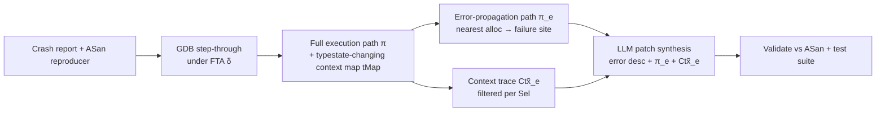
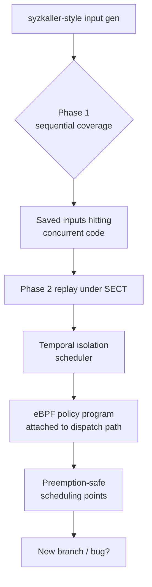
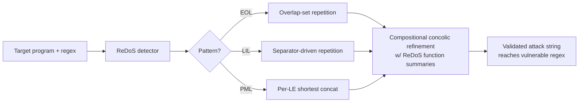

# Daily Scholar Papers Report — 2026-06-07

**[Download PDF](Daily_Papers_Report_2026-06-07.pdf)**

**Window covered:** 2026-06-06 → 2026-06-07 (Google Scholar alerts + user-curated self-emails, last 24 h)

---

## Executive Summary

A dense, security-conference-heavy window. The followed-researcher track surfaces **three Xiao Cheng / Yulei Sui papers** on the same day, each at a top venue: an FSE 2026 typestate-guided LLM repair framework for codebase-level C memory errors (TLR), an ICSE 2026 bottom-up LLM points-to spec generator with differential self-validation (SpecGuru), and an S&P 2026 ReDoS exploit generator with a three-pattern regex taxonomy and compositional concolic refinement (PUFFERDOS). The Scholar recommended track adds the **USENIX Security 2026 SECT** paper from Roychoudhury's group — the first eBPF-native Linux kernel concurrency fuzzer, retiring the hypervisor / kernel-patch approach used by Snowboard and SegFuzz. PeAR (arXiv) adds an extensibility-focused static-binary-rewriting fuzzing framework that finally treats SBI as competitive with DBI. Three short surfacings cover LLM training (Vechev), LRM evaluation (Solar-Lezama), and an agent-system-ops survey (David Lo). No user-curated self-emails arrived.

**Outstanding:** 2 · **Keep:** 3 · **Borderline High-Priority:** 3

---

## Highlighted Papers

| # | Title | Authors | Venue | Link |
|---|---|---|---|---|
| 1.1 | TLR: Codebase-Level C Memory Management Error Repair with Large Language Models | X. Cheng, Z. Guo, H. Huo, Y. Sui | PACMSE / FSE 2026 | [PDF](https://jumormt.github.io/data/fse26_tlr.pdf) |
| 1.2 | Concurrency Fuzzing of the Linux Kernel with eBPF (SECT) | J. Xu, D. Wolff, X. Y. Han, J. Li, A. Roychoudhury | USENIX Security 2026 | [PDF](https://abhikrc.com/pdf/UsenixSec26.pdf) |
| 2.1 | SpecGuru: Hierarchical LLM-Driven API Points-to Specification Generation with Self-Validation | S. Kan, Y. Li, X. Cheng, Y. Sui | ICSE 2026 | [PDF](https://jumormt.github.io/data/icse26.pdf) |
| 2.2 | PUFFERDOS: Efficient and Effective Attack String Generation for ReDoS Vulnerabilities | S. Xu, Z. Ding, X. Cheng, Y. Li, N. Sun, B. Turnbull, S. Kan, S. Ma | IEEE S&P 2026 | [PDF](https://jumormt.github.io/data/sp26.pdf) |
| 2.3 | PeAR: A Static Binary Rewriting Framework for Binary-Only Fuzzing | A. Charles, A. Herrera, P. Oslington, A. Tiu | arXiv 2606.02126 | [arXiv](https://arxiv.org/abs/2606.02126) |
| 3.1 | Learning from Saturated Data: Signals Beyond Correctness for LLM Training | H. Hiss, J. Dekoninck, M. Vechev | arXiv 2606.01436 | [arXiv](https://arxiv.org/abs/2606.01436) |
| 3.2 | An Enigma of Artificial Reason: Investigating the Production-Evaluation Gap in LRMs | M. Sun, T. Yeo, A. Solar-Lezama, T. Zhi-Xuan | arXiv 2606.01462 | [arXiv](https://arxiv.org/abs/2606.01462) |
| 3.3 | Agent System Operations: Categorization, Challenges, and Future Directions | Z. Wang, C. Pei, … D. Lo | arXiv 2606.01581 | [arXiv](https://arxiv.org/abs/2606.01581) |

---

## 1. Outstanding

<strong>1.1</strong> · PROGRAM REPAIR · FSE 2026 — typestate-FSA-guided GDB context extraction lets a single LLM call repair 37/49 real-world C memory errors across 14 projects (~1.57 M LoC), 14.5× SAVER and 2.36× ProveNFix, plus three accepted zero-days<a href="https://github.com/MarkLee131/paper-digest/issues/new?title=%5Bfeedback%5D+2026-06-07-1.1+FSE+2026+%E2%80%94+typestate-FSA-guided+GDB+context+extraction+lets+a+single+LLM+call+repair+37%2F49+real-world+C+memory+errors+across+14+projects+%28~1.57+M+LoC%29%2C+14.5%C3%97+SAVER+and+2.36%C3%97+ProveNFix%2C+plus+three+accepted+zero-days+%F0%9F%91%8D&body=paper_id%3A+2026-06-07-1.1%0Atitle%3A+FSE+2026+%E2%80%94+typestate-FSA-guided+GDB+context+extraction+lets+a+single+LLM+call+repair+37%2F49+real-world+C+memory+errors+across+14+projects+%28~1.57+M+LoC%29%2C+14.5%C3%97+SAVER+and+2.36%C3%97+ProveNFix%2C+plus+three+accepted+zero-days%0Aauthors%3A+Xiao+Cheng+%28Macquarie+University%29%2C+Zhihao+Guo+%28UTS%29%2C+Huan+Huo+%28UTS%29%2C+Yulei+Sui+%28UNSW%29%0Avenue%3A+Proc.+ACM+Softw.+Eng.+3%2C+FSE%2C+Article+FSE057+%28July+2026%29%2C+DOI+%5B10.1145%2F3797085%5D%28https%3A%2F%2Fdoi.org%2F10.1145%2F3797085%29%0Atopic%3A+PROGRAM+REPAIR%0Arating%3A+thumbs-up%0A%0A%3C%21--+Optional+notes+below+this+line+are+read+by+preferences.py+as+soft+signals.+--%3E%0A&labels=feedback%2Cthumbs-up" target="_blank" rel="noopener" class="fb-thumbs-up" title="thumbs up" onclick="event.stopPropagation()">👍</a><a href="https://github.com/MarkLee131/paper-digest/issues/new?title=%5Bfeedback%5D+2026-06-07-1.1+FSE+2026+%E2%80%94+typestate-FSA-guided+GDB+context+extraction+lets+a+single+LLM+call+repair+37%2F49+real-world+C+memory+errors+across+14+projects+%28~1.57+M+LoC%29%2C+14.5%C3%97+SAVER+and+2.36%C3%97+ProveNFix%2C+plus+three+accepted+zero-days+%F0%9F%AB%A5&body=paper_id%3A+2026-06-07-1.1%0Atitle%3A+FSE+2026+%E2%80%94+typestate-FSA-guided+GDB+context+extraction+lets+a+single+LLM+call+repair+37%2F49+real-world+C+memory+errors+across+14+projects+%28~1.57+M+LoC%29%2C+14.5%C3%97+SAVER+and+2.36%C3%97+ProveNFix%2C+plus+three+accepted+zero-days%0Aauthors%3A+Xiao+Cheng+%28Macquarie+University%29%2C+Zhihao+Guo+%28UTS%29%2C+Huan+Huo+%28UTS%29%2C+Yulei+Sui+%28UNSW%29%0Avenue%3A+Proc.+ACM+Softw.+Eng.+3%2C+FSE%2C+Article+FSE057+%28July+2026%29%2C+DOI+%5B10.1145%2F3797085%5D%28https%3A%2F%2Fdoi.org%2F10.1145%2F3797085%29%0Atopic%3A+PROGRAM+REPAIR%0Arating%3A+thumbs-down%0A%0A%3C%21--+Optional+notes+below+this+line+are+read+by+preferences.py+as+soft+signals.+--%3E%0A&labels=feedback%2Cthumbs-down" target="_blank" rel="noopener" class="fb-thumbs-down" title="less interested" onclick="event.stopPropagation()">🫥</a><a href="https://github.com/MarkLee131/paper-digest/issues/new?title=%5Bfeedback%5D+2026-06-07-1.1+FSE+2026+%E2%80%94+typestate-FSA-guided+GDB+context+extraction+lets+a+single+LLM+call+repair+37%2F49+real-world+C+memory+errors+across+14+projects+%28~1.57+M+LoC%29%2C+14.5%C3%97+SAVER+and+2.36%C3%97+ProveNFix%2C+plus+three+accepted+zero-days+%F0%9F%94%96&body=paper_id%3A+2026-06-07-1.1%0Atitle%3A+FSE+2026+%E2%80%94+typestate-FSA-guided+GDB+context+extraction+lets+a+single+LLM+call+repair+37%2F49+real-world+C+memory+errors+across+14+projects+%28~1.57+M+LoC%29%2C+14.5%C3%97+SAVER+and+2.36%C3%97+ProveNFix%2C+plus+three+accepted+zero-days%0Aauthors%3A+Xiao+Cheng+%28Macquarie+University%29%2C+Zhihao+Guo+%28UTS%29%2C+Huan+Huo+%28UTS%29%2C+Yulei+Sui+%28UNSW%29%0Avenue%3A+Proc.+ACM+Softw.+Eng.+3%2C+FSE%2C+Article+FSE057+%28July+2026%29%2C+DOI+%5B10.1145%2F3797085%5D%28https%3A%2F%2Fdoi.org%2F10.1145%2F3797085%29%0Atopic%3A+PROGRAM+REPAIR%0Arating%3A+save-for-later%0A%0A%3C%21--+Optional+notes+below+this+line+are+read+by+preferences.py+as+soft+signals.+--%3E%0A&labels=feedback%2Csave-for-later" target="_blank" rel="noopener" class="fb-save-for-later" title="save for later" onclick="event.stopPropagation()">🔖</a>

### 1.1 [TLR: Codebase-Level C Memory Management Error Repair with Large Language Models](https://jumormt.github.io/data/fse26_tlr.pdf) — Cheng, Guo, Huo, Sui (Macquarie U / UTS / UNSW), PACMSE FSE 2026

**Authors:** Xiao Cheng (Macquarie University), Zhihao Guo (UTS), Huan Huo (UTS), Yulei Sui (UNSW)
**Venue:** Proc. ACM Softw. Eng. 3, FSE, Article FSE057 (July 2026), DOI [10.1145/3797085](https://doi.org/10.1145/3797085)
**Mirrors:** [Author PDF](https://jumormt.github.io/data/fse26_tlr.pdf) · [ACM DL](https://doi.org/10.1145/3797085)
**License:** Creative Commons Attribution 4.0 International (CC BY 4.0) — figure embedding permitted.

**Why surfaced today.** Followed-researcher track (Xiao Cheng / Yulei Sui). The paper sits at the centre of the user's vuln-repair / memory-safety focus and lands at a top-tier venue.

**Problem.** Memory-management bugs in C — leaks, double-free, use-after-free — are the dominant vector for high-impact CVEs. Traditional template-/rule-based APR (SAVER, ProveNFix, CrashRepair) hard-codes fix shapes and struggles with interprocedural fixes; vanilla LLM-based APR sees only the buggy function and a generic prompt, and degrades on long contexts ("lost in the middle"). The paper's key empirical observation: in their motivating use-after-free, the correct fix synchronises edits at *three distinct call-graph sites spanning six functions*, well beyond what a function-local prompt — even one augmented with the call chain — can synthesise.

**Approach.** Three-stage pipeline mirroring developer practice (reproduce → debug → fix), with the LLM placed as a reasoning engine *behind* a program-analysis frontend rather than in front of raw source.

1. *Bug reproduction* — ASan-style reproduction surfaces the error site and triggering input.
2. *Typestate-guided context retrieval* — a per-error-kind finite typestate automaton drives a GDB-scripted step-through of the failing run, slicing exactly the statements that mutate the relevant memory object's typestate and recording per-statement context (location, transition, backtrace) into a typestate-changing context map. The error-propagation path runs from the nearest related allocation to the failing statement; a context trace is the per-statement context for the selected statements on that path.
3. *Patch synthesis* — the LLM receives the error description, the error-propagation path, and the context trace, and proposes a patch that is validated against the original ASan reproducer plus the project's test suite.

The formal scaffolding is laid out in the paper as the following objects (verbatim from the paper, cited by paper numbering):

> **Definition 1 (Finite Typestate Automaton).** *A finite typestate automaton (FTA) for an error E_T is a quintuple denoted as $\mathcal{A}_{E_T} = \langle \Sigma, T, T_u, \delta, T_{E_T} \rangle$. The language $\Sigma$ signifies the operations (e.g., function calls) that can be performed on the typestates. $T$ encompasses all the possible typestates, with $T_u \in T$ representing the initial state. $\delta : (T \times \Sigma) \to T$ is the state-transition table encoding ...*

> **Definition 2 (Full Execution Path π).** *A full execution path, denoted as $\pi = (s_i)_{i=1}^n$, is a chronologically ordered sequence of program statements, each assigned an index, such that $s_i = \langle \mathrm{sc}(s_i), i \rangle$.*

> **Definition 3 (Program Context Ctx).** *Given a full execution path π, for any statement $s_i \in \pi$, the program context of $s_i$ is defined as $\mathrm{Ctx}_{s_i} = \langle \mathrm{lc}, \mathrm{tr}, \mathrm{cp} \rangle$.*

> **Definition 6 (Context Trace $\widetilde{\mathrm{Ctx}}_e$).** *The context trace of an error-propagation path $\pi_e$ is formally defined as $\widetilde{\mathrm{Ctx}}_e = (\mathrm{Ctx}_{s_i} \mid s_i \in \pi_e \land \mathrm{Sel}(s_i))$, where each $\mathrm{Ctx}_{s_i}$ is the program context at $s_i$, and the sequence follows the order of statements in $\pi_e$.*

Algorithm 1 of the paper drives GDB to construct π and tMap step-by-step until an error state is reached; Figures 4–5 give the inference rule that derives the error-propagation path π_e and selection function for the context trace.

*Mermaid recreation of Fig. 1 — paper is CC BY 4.0 and the original figure could be embedded; the diagram above is provided as an equivalent overview.*

**Evaluation.** Two benchmarks: (i) SAVER's original dataset (carried over from the SAVER ISSTA evaluation, with conditions reverse-engineered) and (ii) a new 14-project, ~1.57 M-LoC real-world benchmark drawn from open-source C codebases, including 9 confirmed CVEs across multiple project versions. Backbone LLM is Claude 3.5 Sonnet.

* **vs traditional APR (RQ1):** TLR repairs 14.50× more memory errors than SAVER and 2.36× more than ProveNFix on the combined evaluation. On the double-free / use-after-free subset, TLR repairs all 7 cases vs CrashRepair's 1.
* **vs LLM-based APR (RQ2):** TLR repairs more errors than SWE-agent 1.0 and the tree-of-thought Sand2Patch agent, while introducing "far fewer harmful patches" (i.e., regressions that pass the reproducer but break test suite or correctness).
* **Headline aggregate:** 37/49 real-world memory errors fixed. Three of the fixes are zero-day errors that have been accepted and merged by upstream maintainers.
* **Ablation (RQ3):** removing the typestate-guided context retrieval (i.e., feeding the LLM only the function + call chain) collapses the fix rate, confirming that the FTA-driven slice — not raw context size — is what unlocks the LLM.

**Why this matters.** TLR is the cleanest demonstration to date that the right packaging of program-analysis output (a typestate slice of a debugger trace) is what makes an LLM tractable for interprocedural repair — not a bigger model and not a longer context window. The typestate-FSA + GDB-scripting pattern is directly transplantable to other resource-bug families (file handles, locks, refcount). It also clarifies the SWE-agent comparison: a long-running general-purpose agent loses on harmful-patch rate against a focused single-call repair pipeline. Worth shadowing for any future LLM-augmented APR work.

**Closing line (verbatim, ≤15 words):** *"a promising paradigm for codebase-level program repair through program analysis-guided, retrieval-augmented LLMs."*

<strong>1.2</strong> · KERNEL FUZZING · USENIX Security 2026 — SECT, the first kernel-native CCT scheduler embeds programmable temporal-isolation policies into the Linux dispatch path via eBPF, +38 % branch coverage / −57 % overhead / 11.4× faster bug exposure vs SegFuzz, 8 new Linux concurrency bugs (6 fixed)<a href="https://github.com/MarkLee131/paper-digest/issues/new?title=%5Bfeedback%5D+2026-06-07-1.2+USENIX+Security+2026+%E2%80%94+SECT%2C+the+first+kernel-native+CCT+scheduler+embeds+programmable+temporal-isolation+policies+into+the+Linux+dispatch+path+via+eBPF%2C+%2B38+%25+branch+coverage+%2F+%E2%88%9257+%25+overhead+%2F+11.4%C3%97+faster+bug+exposure+vs+SegFuzz%2C+8+new+Linux+concurrency+bugs+%286+fixed%29+%F0%9F%91%8D&body=paper_id%3A+2026-06-07-1.2%0Atitle%3A+USENIX+Security+2026+%E2%80%94+SECT%2C+the+first+kernel-native+CCT+scheduler+embeds+programmable+temporal-isolation+policies+into+the+Linux+dispatch+path+via+eBPF%2C+%2B38+%25+branch+coverage+%2F+%E2%88%9257+%25+overhead+%2F+11.4%C3%97+faster+bug+exposure+vs+SegFuzz%2C+8+new+Linux+concurrency+bugs+%286+fixed%29%0Aauthors%3A+Jiacheng+Xu+%28Zhejiang+U%2C+work+done+at+NUS%29%2C+Dylan+Wolff+%28NUS%2C+corresponding%29%2C+Xing+Yi+Han+%28NUS%29%2C+Jialin+Li+%28NUS%29%2C+Abhik+Roychoudhury+%28NUS%29%0Avenue%3A+USENIX+Security+Symposium+2026+%28pre-proceedings%29%0Atopic%3A+KERNEL+FUZZING%0Arating%3A+thumbs-up%0A%0A%3C%21--+Optional+notes+below+this+line+are+read+by+preferences.py+as+soft+signals.+--%3E%0A&labels=feedback%2Cthumbs-up" target="_blank" rel="noopener" class="fb-thumbs-up" title="thumbs up" onclick="event.stopPropagation()">👍</a><a href="https://github.com/MarkLee131/paper-digest/issues/new?title=%5Bfeedback%5D+2026-06-07-1.2+USENIX+Security+2026+%E2%80%94+SECT%2C+the+first+kernel-native+CCT+scheduler+embeds+programmable+temporal-isolation+policies+into+the+Linux+dispatch+path+via+eBPF%2C+%2B38+%25+branch+coverage+%2F+%E2%88%9257+%25+overhead+%2F+11.4%C3%97+faster+bug+exposure+vs+SegFuzz%2C+8+new+Linux+concurrency+bugs+%286+fixed%29+%F0%9F%AB%A5&body=paper_id%3A+2026-06-07-1.2%0Atitle%3A+USENIX+Security+2026+%E2%80%94+SECT%2C+the+first+kernel-native+CCT+scheduler+embeds+programmable+temporal-isolation+policies+into+the+Linux+dispatch+path+via+eBPF%2C+%2B38+%25+branch+coverage+%2F+%E2%88%9257+%25+overhead+%2F+11.4%C3%97+faster+bug+exposure+vs+SegFuzz%2C+8+new+Linux+concurrency+bugs+%286+fixed%29%0Aauthors%3A+Jiacheng+Xu+%28Zhejiang+U%2C+work+done+at+NUS%29%2C+Dylan+Wolff+%28NUS%2C+corresponding%29%2C+Xing+Yi+Han+%28NUS%29%2C+Jialin+Li+%28NUS%29%2C+Abhik+Roychoudhury+%28NUS%29%0Avenue%3A+USENIX+Security+Symposium+2026+%28pre-proceedings%29%0Atopic%3A+KERNEL+FUZZING%0Arating%3A+thumbs-down%0A%0A%3C%21--+Optional+notes+below+this+line+are+read+by+preferences.py+as+soft+signals.+--%3E%0A&labels=feedback%2Cthumbs-down" target="_blank" rel="noopener" class="fb-thumbs-down" title="less interested" onclick="event.stopPropagation()">🫥</a><a href="https://github.com/MarkLee131/paper-digest/issues/new?title=%5Bfeedback%5D+2026-06-07-1.2+USENIX+Security+2026+%E2%80%94+SECT%2C+the+first+kernel-native+CCT+scheduler+embeds+programmable+temporal-isolation+policies+into+the+Linux+dispatch+path+via+eBPF%2C+%2B38+%25+branch+coverage+%2F+%E2%88%9257+%25+overhead+%2F+11.4%C3%97+faster+bug+exposure+vs+SegFuzz%2C+8+new+Linux+concurrency+bugs+%286+fixed%29+%F0%9F%94%96&body=paper_id%3A+2026-06-07-1.2%0Atitle%3A+USENIX+Security+2026+%E2%80%94+SECT%2C+the+first+kernel-native+CCT+scheduler+embeds+programmable+temporal-isolation+policies+into+the+Linux+dispatch+path+via+eBPF%2C+%2B38+%25+branch+coverage+%2F+%E2%88%9257+%25+overhead+%2F+11.4%C3%97+faster+bug+exposure+vs+SegFuzz%2C+8+new+Linux+concurrency+bugs+%286+fixed%29%0Aauthors%3A+Jiacheng+Xu+%28Zhejiang+U%2C+work+done+at+NUS%29%2C+Dylan+Wolff+%28NUS%2C+corresponding%29%2C+Xing+Yi+Han+%28NUS%29%2C+Jialin+Li+%28NUS%29%2C+Abhik+Roychoudhury+%28NUS%29%0Avenue%3A+USENIX+Security+Symposium+2026+%28pre-proceedings%29%0Atopic%3A+KERNEL+FUZZING%0Arating%3A+save-for-later%0A%0A%3C%21--+Optional+notes+below+this+line+are+read+by+preferences.py+as+soft+signals.+--%3E%0A&labels=feedback%2Csave-for-later" target="_blank" rel="noopener" class="fb-save-for-later" title="save for later" onclick="event.stopPropagation()">🔖</a>

### 1.2 [Concurrency Fuzzing of the Linux Kernel with eBPF (SECT)](https://abhikrc.com/pdf/UsenixSec26.pdf) — Xu, Wolff, Han, Li, Roychoudhury (Zhejiang U / NUS), USENIX Security 2026

**Authors:** Jiacheng Xu (Zhejiang U, work done at NUS), Dylan Wolff (NUS, corresponding), Xing Yi Han (NUS), Jialin Li (NUS), Abhik Roychoudhury (NUS)
**Venue:** USENIX Security Symposium 2026 (pre-proceedings)
**Mirrors:** [Author PDF](https://abhikrc.com/pdf/UsenixSec26.pdf) · [Scholar lookup](https://scholar.google.com/scholar?q=Concurrency+Fuzzing+of+the+Linux+Kernel+with+eBPF)
**License:** USENIX open-access (author-retained, USENIX non-exclusive distribution). No CC. No figure embedding; diagrams below are Mermaid recreations.

**Why surfaced today.** Recommended track. Top-venue, kernel-vulnerability core fit, methodology directly relevant to the user's kernel-fuzzing reading.

**Problem.** Controlled Concurrency Testing (CCT) needs *fine-grained* control of thread interleavings to expose race / atomicity-violation bugs. State-of-the-art kernel-CCT fuzzers (Snowboard, SegFuzz, Krace) achieve that via heavyweight external mechanisms — custom hypervisors, kernel patches (Krace: 10k LoC across 105 files), delay injection — at the cost of ≥10× slowdowns (Snowboard), poor portability across kernel versions, and high maintenance burden. Coverage-guided sequential fuzzers like syzkaller barely cover the concurrency space at all (~10 % of their bugs are concurrency-related).

**Approach.** Treat *the scheduler itself* as a first-class fuzzing exploration mechanism, and embed the policy in the kernel via eBPF — no patches, no hypervisor.

* **Temporal isolation scheduling (TIS):** a new CCT scheduler that gives every observed thread a dedicated, isolated time window on a CPU, making interleaving choices explicit and replayable rather than an emergent property of CFS.
* **Programmable policies via eBPF:** scheduling policies are written as eBPF programs attached to dispatch-path hook points, letting different fuzzing strategies (random interleavings, coverage-directed, race-targeting) be swapped without rebuilding the kernel.
* **Preemption-safe instrumentation:** scheduling points are injected at critical kernel events with a discipline that avoids deadlocks and preserves kernel preemption invariants.
* **Two-phase fuzzing workflow:** phase 1 explores input space sequentially (syzkaller-style); phase 2 replays inputs that exercise concurrent code under SECT's scheduler to amplify interleaving coverage.

**Evaluation.** Against the leading state-of-the-art kernel concurrency fuzzer SegFuzz.

* **Coverage:** 38 % more branches than SegFuzz.
* **Overhead:** 57 % reduction in overhead vs SegFuzz.
* **Bug-exposure speed:** 11.4× speed-up on known concurrency bugs.
* **Bug-finding:** 8 previously unknown concurrency-related bugs in recent Linux kernels; 6 already confirmed and fixed by upstream maintainers.

**Why this matters.** The eBPF-as-scheduler-policy idea is the right answer to the "patch the kernel vs run a custom hypervisor" dilemma that the kernel-fuzzing literature has been stuck in since Krace and Snowboard. Once the policy is an eBPF program, the same testbed can host very different exploration strategies; this is the lever Snowboard could not pull. Concurrency-bug discovery is where it shows up empirically (11.4× speed-up), and the upstream fix count is the kind of validation reviewers care about. Likely to be replicated by other concurrency / kernel-vuln groups within a year.

**Methodology reusability.** High. The TIS + eBPF pattern is transferable to user-space race testing on Linux (eBPF tracepoints in `sched_*`) and to any future RCU / RT-aware kernel-bug class. Worth tracking the artefact when it's released.

---

## 2. Keep

<strong>2.1</strong> · STATIC ANALYSIS · ICSE 2026 — bottom-up LLM points-to spec generator: leaf-first abstraction + differential-testing self-validation, +21 % over Spectre and +46 % over c-summary on 15 third-party C libraries<a href="https://github.com/MarkLee131/paper-digest/issues/new?title=%5Bfeedback%5D+2026-06-07-2.1+ICSE+2026+%E2%80%94+bottom-up+LLM+points-to+spec+generator%3A+leaf-first+abstraction+%2B+differential-testing+self-validation%2C+%2B21+%25+over+Spectre+and+%2B46+%25+over+c-summary+on+15+third-party+C+libraries+%F0%9F%91%8D&body=paper_id%3A+2026-06-07-2.1%0Atitle%3A+ICSE+2026+%E2%80%94+bottom-up+LLM+points-to+spec+generator%3A+leaf-first+abstraction+%2B+differential-testing+self-validation%2C+%2B21+%25+over+Spectre+and+%2B46+%25+over+c-summary+on+15+third-party+C+libraries%0Aauthors%3A+Shuangxiang+Kan+%28UNSW%29%2C+YueKang+Li+%28UNSW%29%2C+Xiao+Cheng+%28Macquarie%29%2C+Yulei+Sui+%28UNSW%29%0Avenue%3A+ICSE+2026+%28Rio+de+Janeiro%2C+Apr+12%E2%80%9318%29.+DOI+%5B10.1145%2F3744916.3773209%5D%28https%3A%2F%2Fdoi.org%2F10.1145%2F3744916.3773209%29%0Atopic%3A+STATIC+ANALYSIS%0Arating%3A+thumbs-up%0A%0A%3C%21--+Optional+notes+below+this+line+are+read+by+preferences.py+as+soft+signals.+--%3E%0A&labels=feedback%2Cthumbs-up" target="_blank" rel="noopener" class="fb-thumbs-up" title="thumbs up" onclick="event.stopPropagation()">👍</a><a href="https://github.com/MarkLee131/paper-digest/issues/new?title=%5Bfeedback%5D+2026-06-07-2.1+ICSE+2026+%E2%80%94+bottom-up+LLM+points-to+spec+generator%3A+leaf-first+abstraction+%2B+differential-testing+self-validation%2C+%2B21+%25+over+Spectre+and+%2B46+%25+over+c-summary+on+15+third-party+C+libraries+%F0%9F%AB%A5&body=paper_id%3A+2026-06-07-2.1%0Atitle%3A+ICSE+2026+%E2%80%94+bottom-up+LLM+points-to+spec+generator%3A+leaf-first+abstraction+%2B+differential-testing+self-validation%2C+%2B21+%25+over+Spectre+and+%2B46+%25+over+c-summary+on+15+third-party+C+libraries%0Aauthors%3A+Shuangxiang+Kan+%28UNSW%29%2C+YueKang+Li+%28UNSW%29%2C+Xiao+Cheng+%28Macquarie%29%2C+Yulei+Sui+%28UNSW%29%0Avenue%3A+ICSE+2026+%28Rio+de+Janeiro%2C+Apr+12%E2%80%9318%29.+DOI+%5B10.1145%2F3744916.3773209%5D%28https%3A%2F%2Fdoi.org%2F10.1145%2F3744916.3773209%29%0Atopic%3A+STATIC+ANALYSIS%0Arating%3A+thumbs-down%0A%0A%3C%21--+Optional+notes+below+this+line+are+read+by+preferences.py+as+soft+signals.+--%3E%0A&labels=feedback%2Cthumbs-down" target="_blank" rel="noopener" class="fb-thumbs-down" title="less interested" onclick="event.stopPropagation()">🫥</a><a href="https://github.com/MarkLee131/paper-digest/issues/new?title=%5Bfeedback%5D+2026-06-07-2.1+ICSE+2026+%E2%80%94+bottom-up+LLM+points-to+spec+generator%3A+leaf-first+abstraction+%2B+differential-testing+self-validation%2C+%2B21+%25+over+Spectre+and+%2B46+%25+over+c-summary+on+15+third-party+C+libraries+%F0%9F%94%96&body=paper_id%3A+2026-06-07-2.1%0Atitle%3A+ICSE+2026+%E2%80%94+bottom-up+LLM+points-to+spec+generator%3A+leaf-first+abstraction+%2B+differential-testing+self-validation%2C+%2B21+%25+over+Spectre+and+%2B46+%25+over+c-summary+on+15+third-party+C+libraries%0Aauthors%3A+Shuangxiang+Kan+%28UNSW%29%2C+YueKang+Li+%28UNSW%29%2C+Xiao+Cheng+%28Macquarie%29%2C+Yulei+Sui+%28UNSW%29%0Avenue%3A+ICSE+2026+%28Rio+de+Janeiro%2C+Apr+12%E2%80%9318%29.+DOI+%5B10.1145%2F3744916.3773209%5D%28https%3A%2F%2Fdoi.org%2F10.1145%2F3744916.3773209%29%0Atopic%3A+STATIC+ANALYSIS%0Arating%3A+save-for-later%0A%0A%3C%21--+Optional+notes+below+this+line+are+read+by+preferences.py+as+soft+signals.+--%3E%0A&labels=feedback%2Csave-for-later" target="_blank" rel="noopener" class="fb-save-for-later" title="save for later" onclick="event.stopPropagation()">🔖</a>

### 2.1 [SpecGuru: Hierarchical LLM-Driven API Points-to Specification Generation with Self-Validation](https://jumormt.github.io/data/icse26.pdf) — Kan, Li, Cheng, Sui (UNSW / Macquarie), ICSE 2026

**Authors:** Shuangxiang Kan (UNSW), YueKang Li (UNSW), Xiao Cheng (Macquarie), Yulei Sui (UNSW)
**Venue:** ICSE 2026 (Rio de Janeiro, Apr 12–18). DOI [10.1145/3744916.3773209](https://doi.org/10.1145/3744916.3773209)
**Mirrors:** [Author PDF](https://jumormt.github.io/data/icse26.pdf) · [ACM DL](https://doi.org/10.1145/3744916.3773209)
**License:** CC BY 4.0.

**Why surfaced today.** Followed-researcher track (Cheng / Sui). Direct fit with the user's program-analysis / API-specification thread.

**Problem.** Whole-program static analysis of client code that calls third-party C APIs has long been stuck between two bad options: (i) inline the API source and accept exploding cost, or (ii) skip API analysis and lose soundness. API points-to specifications are the standard middle path, but manual annotation does not scale, static inference (Spectre, c-summary) is shape-limited, and dynamic inference is brittle.

**Approach.** Bottom-up, leaf-first LLM-driven inference with built-in validation.

1. *Hierarchical traversal.* Start at API leaf functions (no external dependencies), let the LLM synthesise the points-to spec for each.
2. *Self-validation by differential testing.* For each candidate spec, automatically synthesise C test cases that exercise it; differentially compare against the API's actual behaviour. Specs failing differential checks are rejected, preventing error propagation up the call graph.
3. *Compose upward.* Validated leaf specs become abstractions used to summarise higher-level callers. Because the leaves are already validated, errors do not propagate.

**Evaluation.** 15 third-party C libraries. SpecGuru generates 21 % more specifications than Spectre and 46 % more than c-summary, and matches the precision obtainable with full API source inlined — i.e., the abstraction loss is empirically negligible.

**Why this matters.** The bottom-up validation order is the principled answer to "LLMs hallucinate specs and the errors cascade". By gating each layer with concrete differential tests synthesised at the same layer, SpecGuru gives the downstream static analyser a spec that has actually been *exercised*. This is the same template that has made spec-mining work in modern dynamic verification, now ported to LLM-generated artefacts. Worth filing alongside the user's other "LLM + program analysis" reads as a model of validation discipline.

<strong>2.2</strong> · REDOS / FUZZING · IEEE S&P 2026 — three-pattern regex taxonomy (EOL / LIL / PML) + ReDoS-specific compositional concolic execution, 97.2×–3 872.4× faster than RENGAR over 17 962 regexes, 59 exploitable instances in 12 projects<a href="https://github.com/MarkLee131/paper-digest/issues/new?title=%5Bfeedback%5D+2026-06-07-2.2+IEEE+S%26P+2026+%E2%80%94+three-pattern+regex+taxonomy+%28EOL+%2F+LIL+%2F+PML%29+%2B+ReDoS-specific+compositional+concolic+execution%2C+97.2%C3%97%E2%80%933+872.4%C3%97+faster+than+RENGAR+over+17+962+regexes%2C+59+exploitable+instances+in+12+projects+%F0%9F%91%8D&body=paper_id%3A+2026-06-07-2.2%0Atitle%3A+IEEE+S%26P+2026+%E2%80%94+three-pattern+regex+taxonomy+%28EOL+%2F+LIL+%2F+PML%29+%2B+ReDoS-specific+compositional+concolic+execution%2C+97.2%C3%97%E2%80%933+872.4%C3%97+faster+than+RENGAR+over+17+962+regexes%2C+59+exploitable+instances+in+12+projects%0Aauthors%3A+Shangzhi+Xu%2C+Ziqi+Ding%2C+Xiao+Cheng%2C+Yuekang+Li%2C+Nan+Sun%2C+Benjamin+Turnbull%2C+Shuangxiang+Kan%2C+Siqi+Ma%0Avenue%3A+46th+IEEE+Symposium+on+Security+and+Privacy+%282026%29%0Atopic%3A+REDOS+%2F+FUZZING%0Arating%3A+thumbs-up%0A%0A%3C%21--+Optional+notes+below+this+line+are+read+by+preferences.py+as+soft+signals.+--%3E%0A&labels=feedback%2Cthumbs-up" target="_blank" rel="noopener" class="fb-thumbs-up" title="thumbs up" onclick="event.stopPropagation()">👍</a><a href="https://github.com/MarkLee131/paper-digest/issues/new?title=%5Bfeedback%5D+2026-06-07-2.2+IEEE+S%26P+2026+%E2%80%94+three-pattern+regex+taxonomy+%28EOL+%2F+LIL+%2F+PML%29+%2B+ReDoS-specific+compositional+concolic+execution%2C+97.2%C3%97%E2%80%933+872.4%C3%97+faster+than+RENGAR+over+17+962+regexes%2C+59+exploitable+instances+in+12+projects+%F0%9F%AB%A5&body=paper_id%3A+2026-06-07-2.2%0Atitle%3A+IEEE+S%26P+2026+%E2%80%94+three-pattern+regex+taxonomy+%28EOL+%2F+LIL+%2F+PML%29+%2B+ReDoS-specific+compositional+concolic+execution%2C+97.2%C3%97%E2%80%933+872.4%C3%97+faster+than+RENGAR+over+17+962+regexes%2C+59+exploitable+instances+in+12+projects%0Aauthors%3A+Shangzhi+Xu%2C+Ziqi+Ding%2C+Xiao+Cheng%2C+Yuekang+Li%2C+Nan+Sun%2C+Benjamin+Turnbull%2C+Shuangxiang+Kan%2C+Siqi+Ma%0Avenue%3A+46th+IEEE+Symposium+on+Security+and+Privacy+%282026%29%0Atopic%3A+REDOS+%2F+FUZZING%0Arating%3A+thumbs-down%0A%0A%3C%21--+Optional+notes+below+this+line+are+read+by+preferences.py+as+soft+signals.+--%3E%0A&labels=feedback%2Cthumbs-down" target="_blank" rel="noopener" class="fb-thumbs-down" title="less interested" onclick="event.stopPropagation()">🫥</a><a href="https://github.com/MarkLee131/paper-digest/issues/new?title=%5Bfeedback%5D+2026-06-07-2.2+IEEE+S%26P+2026+%E2%80%94+three-pattern+regex+taxonomy+%28EOL+%2F+LIL+%2F+PML%29+%2B+ReDoS-specific+compositional+concolic+execution%2C+97.2%C3%97%E2%80%933+872.4%C3%97+faster+than+RENGAR+over+17+962+regexes%2C+59+exploitable+instances+in+12+projects+%F0%9F%94%96&body=paper_id%3A+2026-06-07-2.2%0Atitle%3A+IEEE+S%26P+2026+%E2%80%94+three-pattern+regex+taxonomy+%28EOL+%2F+LIL+%2F+PML%29+%2B+ReDoS-specific+compositional+concolic+execution%2C+97.2%C3%97%E2%80%933+872.4%C3%97+faster+than+RENGAR+over+17+962+regexes%2C+59+exploitable+instances+in+12+projects%0Aauthors%3A+Shangzhi+Xu%2C+Ziqi+Ding%2C+Xiao+Cheng%2C+Yuekang+Li%2C+Nan+Sun%2C+Benjamin+Turnbull%2C+Shuangxiang+Kan%2C+Siqi+Ma%0Avenue%3A+46th+IEEE+Symposium+on+Security+and+Privacy+%282026%29%0Atopic%3A+REDOS+%2F+FUZZING%0Arating%3A+save-for-later%0A%0A%3C%21--+Optional+notes+below+this+line+are+read+by+preferences.py+as+soft+signals.+--%3E%0A&labels=feedback%2Csave-for-later" target="_blank" rel="noopener" class="fb-save-for-later" title="save for later" onclick="event.stopPropagation()">🔖</a>

### 2.2 [PUFFERDOS: Efficient and Effective Attack String Generation for ReDoS Vulnerabilities](https://jumormt.github.io/data/sp26.pdf) — Xu, Ding, Cheng, Li, Sun, Turnbull, Kan, Ma (UNSW / Macquarie / CSIRO / U Wollongong), IEEE S&P 2026

**Authors:** Shangzhi Xu, Ziqi Ding, Xiao Cheng, Yuekang Li, Nan Sun, Benjamin Turnbull, Shuangxiang Kan, Siqi Ma
**Venue:** 46th IEEE Symposium on Security and Privacy (2026)
**Mirrors:** [Author PDF](https://jumormt.github.io/data/sp26.pdf) · [Scholar lookup](https://scholar.google.com/scholar?q=PUFFERDOS+Efficient+Effective+Attack+String+ReDoS)
**License:** IEEE author-retained. No CC. No figure embed.

**Why surfaced today.** Followed-researcher track (Cheng). Top venue. Direct fit with the user's vulnerability-discovery thread.

**Problem.** Existing ReDoS attack-string generators (RENGAR and predecessors) either generate strings that are unrealistically long (impractical under real-world input-size limits) or fail to reach the vulnerable regex once data-flow constraints in the surrounding program are considered. The result: many "vulnerable" regexes flagged by static scanners cannot be exploited in practice.

**Approach.** Two contributions: a regex-vulnerability taxonomy with three patterns, and a ReDoS-aware compositional concolic refinement that checks reachability against the actual program.

*Regex vulnerability patterns* (verbatim, cited by paper numbering):

> **Pattern 1 (Exponential One-Loop, EOL).** *An EOL consists of a single pathological LE whose unfolding $U(\mathrm{LE})$ contains at least two distinct subregexes $r'_i, r'_j$ ($i \neq j$) such that $\Sigma(r'_i) \cap \Sigma(r'_j) \neq \emptyset$. For example, regex $\hat{}(ab|a|b)+\$$ exhibits EOL pattern.*

> **Pattern 2 (Loop-Intersect-Loop, LIL).** *An LIL consists of two adjacent LEs, separated by a non-loop segment $S_e$, written as $r = \mathrm{LE}_1 S_e \mathrm{LE}_2$. It holds that $\Sigma(\mathrm{LE}_1) \cap \Sigma(\mathrm{LE}_2) \neq \emptyset$ and $\Sigma(S_e) \subseteq \Sigma(\mathrm{LE}_1) \cap \Sigma(\mathrm{LE}_2)$. ... For example, regex $.\!\!^* a .\!\!^*$ exhibits LIL pattern.*

> **Pattern 3 (Polynomial Multi-Loop, PML).** *A PML consists of $k$ LEs, such that $\forall i \in [1, k-1], \Sigma(\mathrm{LE}_i) \cap \Sigma(\mathrm{LE}_{i+1}) = \emptyset$ or $\Sigma(S_e) \subsetneq \Sigma(\mathrm{LE}_i) \cap \Sigma(\mathrm{LE}_{i+1})$. ... For example, regex $\backslash s^* a \backslash s^*$ exhibits the PML pattern.*

The paper proves (Appendix A.2) that this taxonomy covers all patterns identified in prior ReDoS-detection work. For each pattern, the generator emits a structure-driven, low-cost attack-string template (overlap-set picks for EOL; separator-driven repetition for LIL; per-LE shortest-symbol concatenation for PML).

*Compositional concolic refinement.* Generated candidates are then validated and refined against the host program using ReDoS-specific function summaries — so the attack string is guaranteed to *reach* the vulnerable regex via the program's existing data-flow path before being scored.

**Evaluation.** 17 962 real-world vulnerable regexes (baseline corpus), 31 exploited ReDoS CVEs, 12 open-source projects (each with >10k monthly downloads).

* **Efficiency:** attack strings 97.2×–3 872.4× faster (in induced matching cost) than RENGAR's, within realistic input-length budgets.
* **In-the-wild discovery:** 59 exploitable ReDoS instances in the 12 projects — 25 more than RENGAR finds on the same set.

**Why this matters.** The three-pattern taxonomy is now the single best published characterisation of ReDoS-vulnerable regex shape, and the compositional concolic refinement is the right answer to the "I have a vulnerable regex but the program never reaches it with the right input" gap that has plagued the field. Expect this to become the new baseline.

<strong>2.3</strong> · BINARY FUZZING · arXiv preprint — SBI-based binary-only fuzzing finally matches DBI: PeAR instruments 88 % of FuzzBench targets with 4× throughput via persistent + shared-memory mode, coverage comparable to compiler-based instrumentation<a href="https://github.com/MarkLee131/paper-digest/issues/new?title=%5Bfeedback%5D+2026-06-07-2.3+arXiv+preprint+%E2%80%94+SBI-based+binary-only+fuzzing+finally+matches+DBI%3A+PeAR+instruments+88+%25+of+FuzzBench+targets+with+4%C3%97+throughput+via+persistent+%2B+shared-memory+mode%2C+coverage+comparable+to+compiler-based+instrumentation+%F0%9F%91%8D&body=paper_id%3A+2026-06-07-2.3%0Atitle%3A+arXiv+preprint+%E2%80%94+SBI-based+binary-only+fuzzing+finally+matches+DBI%3A+PeAR+instruments+88+%25+of+FuzzBench+targets+with+4%C3%97+throughput+via+persistent+%2B+shared-memory+mode%2C+coverage+comparable+to+compiler-based+instrumentation%0Aauthors%3A+Alvin+Charles%2C+Adrian+Herrera%2C+Peter+Oslington%2C+Alwen+Tiu+%28Australian+National+University%29%0Avenue%3A+arXiv+preprint+2606.02126+%28cs.CR%2C+1+Jun+2026%29%0Atopic%3A+BINARY+FUZZING%0Arating%3A+thumbs-up%0A%0A%3C%21--+Optional+notes+below+this+line+are+read+by+preferences.py+as+soft+signals.+--%3E%0A&labels=feedback%2Cthumbs-up" target="_blank" rel="noopener" class="fb-thumbs-up" title="thumbs up" onclick="event.stopPropagation()">👍</a><a href="https://github.com/MarkLee131/paper-digest/issues/new?title=%5Bfeedback%5D+2026-06-07-2.3+arXiv+preprint+%E2%80%94+SBI-based+binary-only+fuzzing+finally+matches+DBI%3A+PeAR+instruments+88+%25+of+FuzzBench+targets+with+4%C3%97+throughput+via+persistent+%2B+shared-memory+mode%2C+coverage+comparable+to+compiler-based+instrumentation+%F0%9F%AB%A5&body=paper_id%3A+2026-06-07-2.3%0Atitle%3A+arXiv+preprint+%E2%80%94+SBI-based+binary-only+fuzzing+finally+matches+DBI%3A+PeAR+instruments+88+%25+of+FuzzBench+targets+with+4%C3%97+throughput+via+persistent+%2B+shared-memory+mode%2C+coverage+comparable+to+compiler-based+instrumentation%0Aauthors%3A+Alvin+Charles%2C+Adrian+Herrera%2C+Peter+Oslington%2C+Alwen+Tiu+%28Australian+National+University%29%0Avenue%3A+arXiv+preprint+2606.02126+%28cs.CR%2C+1+Jun+2026%29%0Atopic%3A+BINARY+FUZZING%0Arating%3A+thumbs-down%0A%0A%3C%21--+Optional+notes+below+this+line+are+read+by+preferences.py+as+soft+signals.+--%3E%0A&labels=feedback%2Cthumbs-down" target="_blank" rel="noopener" class="fb-thumbs-down" title="less interested" onclick="event.stopPropagation()">🫥</a><a href="https://github.com/MarkLee131/paper-digest/issues/new?title=%5Bfeedback%5D+2026-06-07-2.3+arXiv+preprint+%E2%80%94+SBI-based+binary-only+fuzzing+finally+matches+DBI%3A+PeAR+instruments+88+%25+of+FuzzBench+targets+with+4%C3%97+throughput+via+persistent+%2B+shared-memory+mode%2C+coverage+comparable+to+compiler-based+instrumentation+%F0%9F%94%96&body=paper_id%3A+2026-06-07-2.3%0Atitle%3A+arXiv+preprint+%E2%80%94+SBI-based+binary-only+fuzzing+finally+matches+DBI%3A+PeAR+instruments+88+%25+of+FuzzBench+targets+with+4%C3%97+throughput+via+persistent+%2B+shared-memory+mode%2C+coverage+comparable+to+compiler-based+instrumentation%0Aauthors%3A+Alvin+Charles%2C+Adrian+Herrera%2C+Peter+Oslington%2C+Alwen+Tiu+%28Australian+National+University%29%0Avenue%3A+arXiv+preprint+2606.02126+%28cs.CR%2C+1+Jun+2026%29%0Atopic%3A+BINARY+FUZZING%0Arating%3A+save-for-later%0A%0A%3C%21--+Optional+notes+below+this+line+are+read+by+preferences.py+as+soft+signals.+--%3E%0A&labels=feedback%2Csave-for-later" target="_blank" rel="noopener" class="fb-save-for-later" title="save for later" onclick="event.stopPropagation()">🔖</a>

### 2.3 [PeAR: A Static Binary Rewriting Framework for Binary-Only Fuzzing](https://arxiv.org/abs/2606.02126) — Charles, Herrera, Oslington, Tiu (ANU School of Computing), arXiv 2606.02126

**Authors:** Alvin Charles, Adrian Herrera, Peter Oslington, Alwen Tiu (Australian National University)
**Venue:** arXiv preprint 2606.02126 (cs.CR, 1 Jun 2026)
**Mirrors:** [arXiv abs](https://arxiv.org/abs/2606.02126) · [PDF](https://arxiv.org/pdf/2606.02126)
**License:** arXiv author non-exclusive licence. No figure embed.

**Why surfaced today.** Recommended track. Directly relevant to the user's binary-only fuzzing reading.

**Problem.** Binary-only fuzzers overwhelmingly favour DBI (Pin / QEMU / Icicle) despite 10–100× runtime overhead on benchmarks like LAVA-M, because SBI has historically had two reputational problems: poor instrumentation accuracy on stripped real-world binaries, and missing modern fuzzer features (deferred init, persistent mode, shared-memory fuzzing). The result is a research-vs-practice gap: SBI has caught up on accuracy (StochFuzz, Zafl, etc.) but the engineering plumbing to expose it to fuzzer authors has not.

**Approach.** Build PeAR on top of GTIRB-rewriting (a modern accurate SBI framework) and engineer first-class support for the missing features:

* Deferred initialisation (skip slow startup before fuzzing loop).
* Persistent mode (one process, many inputs).
* Shared-memory fuzzing (avoid stdin/stdout pipe overhead).

The contribution is less algorithmic than architectural: a demonstration that the modern SBI substrate is sufficient, and that the perceived accuracy/extensibility deficit is a tooling deficit.

**Evaluation.** 4.25 CPU-years of fuzzing on FuzzBench.

* **Instrumentation success:** 88 % of FuzzBench targets, comparable to the best SBI-based fuzzers.
* **Throughput:** median 4× improvement when persistent mode and shared-memory fuzzing are enabled.
* **Coverage:** comparable to compiler-based instrumentation (the soundness ceiling) on instrumentable targets.

**Why this matters.** For close-source / kernel-driver / firmware fuzzing where DBI's 10× overhead is the binding constraint, PeAR demonstrates the SBI route is now viable end-to-end. Worth keeping as the reference implementation when SBI vs DBI is being weighed.

---

## 3. Borderline High-Priority

<strong>3.1</strong> · LLM TRAINING · arXiv preprint — once binary-correctness data saturate, pairwise LLM self-judgments and token-level entropy still carry trainable signal; Vechev lab probes whether perfect-accuracy examples are actually useless<a href="https://github.com/MarkLee131/paper-digest/issues/new?title=%5Bfeedback%5D+2026-06-07-3.1+arXiv+preprint+%E2%80%94+once+binary-correctness+data+saturate%2C+pairwise+LLM+self-judgments+and+token-level+entropy+still+carry+trainable+signal%3B+Vechev+lab+probes+whether+perfect-accuracy+examples+are+actually+useless+%F0%9F%91%8D&body=paper_id%3A+2026-06-07-3.1%0Atitle%3A+arXiv+preprint+%E2%80%94+once+binary-correctness+data+saturate%2C+pairwise+LLM+self-judgments+and+token-level+entropy+still+carry+trainable+signal%3B+Vechev+lab+probes+whether+perfect-accuracy+examples+are+actually+useless%0Aauthors%3A+Hanno+Hiss%2C+Jasper+Dekoninck%2C+Martin+Vechev+%28ETH+Z%C3%BCrich%29%0Avenue%3A+arXiv+preprint+2606.01436+%28cs.CL%2C+31+May+2026%29%0Atopic%3A+LLM+TRAINING%0Arating%3A+thumbs-up%0A%0A%3C%21--+Optional+notes+below+this+line+are+read+by+preferences.py+as+soft+signals.+--%3E%0A&labels=feedback%2Cthumbs-up" target="_blank" rel="noopener" class="fb-thumbs-up" title="thumbs up" onclick="event.stopPropagation()">👍</a><a href="https://github.com/MarkLee131/paper-digest/issues/new?title=%5Bfeedback%5D+2026-06-07-3.1+arXiv+preprint+%E2%80%94+once+binary-correctness+data+saturate%2C+pairwise+LLM+self-judgments+and+token-level+entropy+still+carry+trainable+signal%3B+Vechev+lab+probes+whether+perfect-accuracy+examples+are+actually+useless+%F0%9F%AB%A5&body=paper_id%3A+2026-06-07-3.1%0Atitle%3A+arXiv+preprint+%E2%80%94+once+binary-correctness+data+saturate%2C+pairwise+LLM+self-judgments+and+token-level+entropy+still+carry+trainable+signal%3B+Vechev+lab+probes+whether+perfect-accuracy+examples+are+actually+useless%0Aauthors%3A+Hanno+Hiss%2C+Jasper+Dekoninck%2C+Martin+Vechev+%28ETH+Z%C3%BCrich%29%0Avenue%3A+arXiv+preprint+2606.01436+%28cs.CL%2C+31+May+2026%29%0Atopic%3A+LLM+TRAINING%0Arating%3A+thumbs-down%0A%0A%3C%21--+Optional+notes+below+this+line+are+read+by+preferences.py+as+soft+signals.+--%3E%0A&labels=feedback%2Cthumbs-down" target="_blank" rel="noopener" class="fb-thumbs-down" title="less interested" onclick="event.stopPropagation()">🫥</a><a href="https://github.com/MarkLee131/paper-digest/issues/new?title=%5Bfeedback%5D+2026-06-07-3.1+arXiv+preprint+%E2%80%94+once+binary-correctness+data+saturate%2C+pairwise+LLM+self-judgments+and+token-level+entropy+still+carry+trainable+signal%3B+Vechev+lab+probes+whether+perfect-accuracy+examples+are+actually+useless+%F0%9F%94%96&body=paper_id%3A+2026-06-07-3.1%0Atitle%3A+arXiv+preprint+%E2%80%94+once+binary-correctness+data+saturate%2C+pairwise+LLM+self-judgments+and+token-level+entropy+still+carry+trainable+signal%3B+Vechev+lab+probes+whether+perfect-accuracy+examples+are+actually+useless%0Aauthors%3A+Hanno+Hiss%2C+Jasper+Dekoninck%2C+Martin+Vechev+%28ETH+Z%C3%BCrich%29%0Avenue%3A+arXiv+preprint+2606.01436+%28cs.CL%2C+31+May+2026%29%0Atopic%3A+LLM+TRAINING%0Arating%3A+save-for-later%0A%0A%3C%21--+Optional+notes+below+this+line+are+read+by+preferences.py+as+soft+signals.+--%3E%0A&labels=feedback%2Csave-for-later" target="_blank" rel="noopener" class="fb-save-for-later" title="save for later" onclick="event.stopPropagation()">🔖</a>

### 3.1 [Learning from Saturated Data: Signals Beyond Correctness for LLM Training](https://arxiv.org/abs/2606.01436) — Hiss, Dekoninck, Vechev (ETH Zürich), arXiv 2606.01436

**Authors:** Hanno Hiss, Jasper Dekoninck, Martin Vechev (ETH Zürich)
**Venue:** arXiv preprint 2606.01436 (cs.CL, 31 May 2026)
**Mirrors:** [arXiv abs](https://arxiv.org/abs/2606.01436) · [PDF](https://arxiv.org/pdf/2606.01436)

**Why surfaced today.** Followed-researcher track (Vechev). Off-core for the user's program-analysis / vuln-detection focus, but the methodological hook — recovering signal from "already-solved" examples — generalises.

**One-liner.** When a training set is empirically saturated (model already at 100 % correctness), the binary correctness label is useless, but (i) the model's own pairwise quality judgments between its samples and (ii) per-token entropy still distinguish better from worse solutions; the paper trains on these and reports gains in regimes where correctness-based methods (and recent entropy-minimisation-only work) plateau. Files alongside earlier Vechev work on data efficiency for reasoning models.

<strong>3.2</strong> · LLM REASONING · arXiv preprint — VAIR dataset (Valid Answer, Invalid Reasoning) measures whether LRMs can spot bad reasoning that ends in the right answer; humans evaluate better than they produce — do LRMs?<a href="https://github.com/MarkLee131/paper-digest/issues/new?title=%5Bfeedback%5D+2026-06-07-3.2+arXiv+preprint+%E2%80%94+VAIR+dataset+%28Valid+Answer%2C+Invalid+Reasoning%29+measures+whether+LRMs+can+spot+bad+reasoning+that+ends+in+the+right+answer%3B+humans+evaluate+better+than+they+produce+%E2%80%94+do+LRMs%3F+%F0%9F%91%8D&body=paper_id%3A+2026-06-07-3.2%0Atitle%3A+arXiv+preprint+%E2%80%94+VAIR+dataset+%28Valid+Answer%2C+Invalid+Reasoning%29+measures+whether+LRMs+can+spot+bad+reasoning+that+ends+in+the+right+answer%3B+humans+evaluate+better+than+they+produce+%E2%80%94+do+LRMs%3F%0Aauthors%3A+Mingzhong+Sun%2C+Teresa+Yeo%2C+Armando+Solar-Lezama%2C+Tan+Zhi-Xuan%0Avenue%3A+arXiv+preprint+2606.01462+%28cs.AI%2C+31+May+2026%29%0Atopic%3A+LLM+REASONING%0Arating%3A+thumbs-up%0A%0A%3C%21--+Optional+notes+below+this+line+are+read+by+preferences.py+as+soft+signals.+--%3E%0A&labels=feedback%2Cthumbs-up" target="_blank" rel="noopener" class="fb-thumbs-up" title="thumbs up" onclick="event.stopPropagation()">👍</a><a href="https://github.com/MarkLee131/paper-digest/issues/new?title=%5Bfeedback%5D+2026-06-07-3.2+arXiv+preprint+%E2%80%94+VAIR+dataset+%28Valid+Answer%2C+Invalid+Reasoning%29+measures+whether+LRMs+can+spot+bad+reasoning+that+ends+in+the+right+answer%3B+humans+evaluate+better+than+they+produce+%E2%80%94+do+LRMs%3F+%F0%9F%AB%A5&body=paper_id%3A+2026-06-07-3.2%0Atitle%3A+arXiv+preprint+%E2%80%94+VAIR+dataset+%28Valid+Answer%2C+Invalid+Reasoning%29+measures+whether+LRMs+can+spot+bad+reasoning+that+ends+in+the+right+answer%3B+humans+evaluate+better+than+they+produce+%E2%80%94+do+LRMs%3F%0Aauthors%3A+Mingzhong+Sun%2C+Teresa+Yeo%2C+Armando+Solar-Lezama%2C+Tan+Zhi-Xuan%0Avenue%3A+arXiv+preprint+2606.01462+%28cs.AI%2C+31+May+2026%29%0Atopic%3A+LLM+REASONING%0Arating%3A+thumbs-down%0A%0A%3C%21--+Optional+notes+below+this+line+are+read+by+preferences.py+as+soft+signals.+--%3E%0A&labels=feedback%2Cthumbs-down" target="_blank" rel="noopener" class="fb-thumbs-down" title="less interested" onclick="event.stopPropagation()">🫥</a><a href="https://github.com/MarkLee131/paper-digest/issues/new?title=%5Bfeedback%5D+2026-06-07-3.2+arXiv+preprint+%E2%80%94+VAIR+dataset+%28Valid+Answer%2C+Invalid+Reasoning%29+measures+whether+LRMs+can+spot+bad+reasoning+that+ends+in+the+right+answer%3B+humans+evaluate+better+than+they+produce+%E2%80%94+do+LRMs%3F+%F0%9F%94%96&body=paper_id%3A+2026-06-07-3.2%0Atitle%3A+arXiv+preprint+%E2%80%94+VAIR+dataset+%28Valid+Answer%2C+Invalid+Reasoning%29+measures+whether+LRMs+can+spot+bad+reasoning+that+ends+in+the+right+answer%3B+humans+evaluate+better+than+they+produce+%E2%80%94+do+LRMs%3F%0Aauthors%3A+Mingzhong+Sun%2C+Teresa+Yeo%2C+Armando+Solar-Lezama%2C+Tan+Zhi-Xuan%0Avenue%3A+arXiv+preprint+2606.01462+%28cs.AI%2C+31+May+2026%29%0Atopic%3A+LLM+REASONING%0Arating%3A+save-for-later%0A%0A%3C%21--+Optional+notes+below+this+line+are+read+by+preferences.py+as+soft+signals.+--%3E%0A&labels=feedback%2Csave-for-later" target="_blank" rel="noopener" class="fb-save-for-later" title="save for later" onclick="event.stopPropagation()">🔖</a>

### 3.2 [An Enigma of Artificial Reason: Investigating the Production-Evaluation Gap in Large Reasoning Models](https://arxiv.org/abs/2606.01462) — Sun, Yeo, Solar-Lezama, Zhi-Xuan (NUS / MIT EECS / A*STAR / SMART), arXiv 2606.01462

**Authors:** Mingzhong Sun, Teresa Yeo, Armando Solar-Lezama, Tan Zhi-Xuan
**Venue:** arXiv preprint 2606.01462 (cs.AI, 31 May 2026)
**Mirrors:** [arXiv abs](https://arxiv.org/abs/2606.01462) · [PDF](https://arxiv.org/pdf/2606.01462)

**Why surfaced today.** Followed-researcher track (Solar-Lezama). Off-core but worth a half-page placeholder for the user's LRM-evaluation thread.

**One-liner.** Humans evaluate reasoning better than they produce it; LRMs are trained to do the opposite. The paper introduces the VAIR dataset of math problems where a *valid answer* is reached via an *invalid reasoning chain* and measures whether LRMs can flag the bad chain. The asymmetry result is the interesting bit — relevant to anyone using LLM-as-judge in evaluation pipelines.

<strong>3.3</strong> · SURVEY · arXiv preprint / IEEE TSE-bound — first systematic categorisation of "Agent System Operations" (AgentOps) covering reliability, monitoring, and failure-mode taxonomies for LLM-agent systems<a href="https://github.com/MarkLee131/paper-digest/issues/new?title=%5Bfeedback%5D+2026-06-07-3.3+arXiv+preprint+%2F+IEEE+TSE-bound+%E2%80%94+first+systematic+categorisation+of+%22Agent+System+Operations%22+%28AgentOps%29+covering+reliability%2C+monitoring%2C+and+failure-mode+taxonomies+for+LLM-agent+systems+%F0%9F%91%8D&body=paper_id%3A+2026-06-07-3.3%0Atitle%3A+arXiv+preprint+%2F+IEEE+TSE-bound+%E2%80%94+first+systematic+categorisation+of+%22Agent+System+Operations%22+%28AgentOps%29+covering+reliability%2C+monitoring%2C+and+failure-mode+taxonomies+for+LLM-agent+systems%0Aauthors%3A+Zexin+Wang%2C+Changhua+Pei%2C+Yuanhao+Liu%2C+Jingjing+Li%2C+Yintong+Huo%2C+Quan+Zhou%2C+Haotian+Si%2C+Hang+Cui%2C+Zihan+Liu%2C+Jianhui+Li%2C+Gaogang+Xie%2C+Fei+Sun%2C+Dan+Pei%2C+David+Lo%0Avenue%3A+arXiv+preprint+2606.01581+%28cs.MA%2C+1+Jun+2026%29%3B+IEEE+TSE-bound+per+header.%0Atopic%3A+SURVEY%0Arating%3A+thumbs-up%0A%0A%3C%21--+Optional+notes+below+this+line+are+read+by+preferences.py+as+soft+signals.+--%3E%0A&labels=feedback%2Cthumbs-up" target="_blank" rel="noopener" class="fb-thumbs-up" title="thumbs up" onclick="event.stopPropagation()">👍</a><a href="https://github.com/MarkLee131/paper-digest/issues/new?title=%5Bfeedback%5D+2026-06-07-3.3+arXiv+preprint+%2F+IEEE+TSE-bound+%E2%80%94+first+systematic+categorisation+of+%22Agent+System+Operations%22+%28AgentOps%29+covering+reliability%2C+monitoring%2C+and+failure-mode+taxonomies+for+LLM-agent+systems+%F0%9F%AB%A5&body=paper_id%3A+2026-06-07-3.3%0Atitle%3A+arXiv+preprint+%2F+IEEE+TSE-bound+%E2%80%94+first+systematic+categorisation+of+%22Agent+System+Operations%22+%28AgentOps%29+covering+reliability%2C+monitoring%2C+and+failure-mode+taxonomies+for+LLM-agent+systems%0Aauthors%3A+Zexin+Wang%2C+Changhua+Pei%2C+Yuanhao+Liu%2C+Jingjing+Li%2C+Yintong+Huo%2C+Quan+Zhou%2C+Haotian+Si%2C+Hang+Cui%2C+Zihan+Liu%2C+Jianhui+Li%2C+Gaogang+Xie%2C+Fei+Sun%2C+Dan+Pei%2C+David+Lo%0Avenue%3A+arXiv+preprint+2606.01581+%28cs.MA%2C+1+Jun+2026%29%3B+IEEE+TSE-bound+per+header.%0Atopic%3A+SURVEY%0Arating%3A+thumbs-down%0A%0A%3C%21--+Optional+notes+below+this+line+are+read+by+preferences.py+as+soft+signals.+--%3E%0A&labels=feedback%2Cthumbs-down" target="_blank" rel="noopener" class="fb-thumbs-down" title="less interested" onclick="event.stopPropagation()">🫥</a><a href="https://github.com/MarkLee131/paper-digest/issues/new?title=%5Bfeedback%5D+2026-06-07-3.3+arXiv+preprint+%2F+IEEE+TSE-bound+%E2%80%94+first+systematic+categorisation+of+%22Agent+System+Operations%22+%28AgentOps%29+covering+reliability%2C+monitoring%2C+and+failure-mode+taxonomies+for+LLM-agent+systems+%F0%9F%94%96&body=paper_id%3A+2026-06-07-3.3%0Atitle%3A+arXiv+preprint+%2F+IEEE+TSE-bound+%E2%80%94+first+systematic+categorisation+of+%22Agent+System+Operations%22+%28AgentOps%29+covering+reliability%2C+monitoring%2C+and+failure-mode+taxonomies+for+LLM-agent+systems%0Aauthors%3A+Zexin+Wang%2C+Changhua+Pei%2C+Yuanhao+Liu%2C+Jingjing+Li%2C+Yintong+Huo%2C+Quan+Zhou%2C+Haotian+Si%2C+Hang+Cui%2C+Zihan+Liu%2C+Jianhui+Li%2C+Gaogang+Xie%2C+Fei+Sun%2C+Dan+Pei%2C+David+Lo%0Avenue%3A+arXiv+preprint+2606.01581+%28cs.MA%2C+1+Jun+2026%29%3B+IEEE+TSE-bound+per+header.%0Atopic%3A+SURVEY%0Arating%3A+save-for-later%0A%0A%3C%21--+Optional+notes+below+this+line+are+read+by+preferences.py+as+soft+signals.+--%3E%0A&labels=feedback%2Csave-for-later" target="_blank" rel="noopener" class="fb-save-for-later" title="save for later" onclick="event.stopPropagation()">🔖</a>

### 3.3 [Agent System Operations: Categorization, Challenges, and Future Directions](https://arxiv.org/abs/2606.01581) — Wang, Pei, Liu, Li, Huo, … D. Lo (CNIC CAS / UCAS / Tsinghua / SMU), arXiv 2606.01581

**Authors:** Zexin Wang, Changhua Pei, Yuanhao Liu, Jingjing Li, Yintong Huo, Quan Zhou, Haotian Si, Hang Cui, Zihan Liu, Jianhui Li, Gaogang Xie, Fei Sun, Dan Pei, David Lo
**Venue:** arXiv preprint 2606.01581 (cs.MA, 1 Jun 2026); IEEE TSE-bound per header.
**Mirrors:** [arXiv abs](https://arxiv.org/abs/2606.01581) · [PDF](https://arxiv.org/pdf/2606.01581)

**Why surfaced today.** Followed-researcher track (D. Lo). Survey-style — flagged for reference value, not novelty.

**One-liner.** Categorisation of failure modes (hallucination, role-play collapse, cascading errors) and operational concerns (monitoring, telemetry, recovery) for LLM-agent systems. Useful as a citation map and as a list of open problems for anyone building reliability infrastructure around agent stacks.

---

## Cross-Paper Synthesis

**Program-analysis-guided LLMs are the dominant SE paradigm this window.** TLR (1.1) and SpecGuru (2.1), the two Cheng/Sui Outstanding/Keep papers, both put a program-analysis frontend (typestate FSA + GDB; bottom-up call-graph traversal + differential testing) *in front of* the LLM and treat the model as a synthesis engine constrained by the analysis output. The contrast with the SWE-agent / Sand2Patch baselines reported in TLR is clean: long-horizon general agents underperform a focused single-call pipeline because the analysis layer pre-filters the context to exactly what's load-bearing. The same pattern shows up at a different granularity in SpecGuru's bottom-up self-validation: every level's LLM output is differentially tested against the API itself before it propagates upward. This is the prescription for LLM-augmented program analysis going forward.

**Concurrency / kernel fuzzing has switched substrate.** SECT (1.2) replaces hypervisors and kernel patches with eBPF-attached scheduling policies. The platform-engineering implication is large: any new scheduling-aware fuzzer (RT, RCU, NUMA-aware) is now a few hundred lines of eBPF, not a 10k-LoC kernel patch. Expect a wave of derivatives within a year.

**Static binary rewriting has reached parity with DBI.** PeAR (2.3) closes the engineering gap on persistent / shared-memory / deferred-init modes; combined with the StochFuzz / Zafl accuracy advances, the long-running SBI-vs-DBI debate is now decided in favour of SBI for instrumentation-friendly targets. Closed-source / firmware / driver fuzzing should pick this up.

**Two complementary scaling-data hooks for LLM training.** Hiss/Dekoninck/Vechev (3.1) reframes "saturated" data as "still informative if you look at the right per-token signal" — a methodologically clean answer to the "we ran out of hard problems" anxiety driving 2025–26 LLM training research. The Solar-Lezama-coauthored VAIR work (3.2) is the dual: even when the answer is right, the reasoning may be wrong, and evaluation is asymmetric. Both are off-core but worth a one-paragraph mental note.

## Writing & Rationale Insights

The Cheng/Sui group's three-paper drop this window shows a deliberate style: a *named, lower-cased* analysis artefact (typestate FSA, points-to spec, regex pattern taxonomy) carries the methodological weight, and the LLM (TLR), differential test (SpecGuru), or concolic refinement (PUFFERDOS) is the post-hoc validation engine. The Outstanding-bar headline numbers are always cast as ratios over the strongest competing baseline (14.50× SAVER; 21 % over Spectre; 97.2× over RENGAR), not absolute, which keeps the reader anchored on improvement rather than benchmark-shopping. The shared rhetorical move worth borrowing: pick *one* motivating example that no prior tool can handle, walk it through completely (the six-function UAF in TLR's Section 3 is the model), then defer headline aggregates to the evaluation section.

SECT's writeup is structurally different — a USENIX-Security pitch leads with the limitation taxonomy (C0/C1/C2 in §1) and frames the eBPF-scheduler insight as the *single* lever that resolves all three. That framing — "everything everyone else does is a workaround for the same missing substrate, here is the substrate" — is the canonical way to land a kernel-systems paper at a security venue. Worth keeping as a template for any future hypervisor-style critique.
