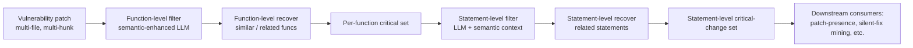

# Daily Scholar Papers Report — 2026-06-08

**[Download PDF](Daily_Papers_Report_2026-06-08.pdf)**

**Window covered:** 2026-06-07 → 2026-06-08 (Google Scholar alerts + user-curated self-emails, last 24 h)

---

## Executive Summary

A lighter, more diverse window than yesterday's Cheng / Sui burst. The Outstanding slot goes to a **Fudan ACM TOSEM** paper, *CoCoPat*, that targets the long-running "noisy patch" problem: vulnerability patches mixing critical fixes with refactors degrade every downstream tool that consumes them, and CoCoPat's two-phase *filtering-then-recovering* LLM workflow lifts F1 by +0.43 (≈98 %) over the prior state-of-the-art at statement granularity. The followed-researcher track contributes three Zhenchang Xing / Sun group preprints (an empirical study of Android data-minimization with 31 distilled coding guidelines; a permission framework for *agent skills* that drops contextual-injection ASR from 32 % to 23 %; and Andreas Zeller's *Neural Change Prediction*, a mutation-driven model that learns change↔effect bidirectionally on CSS and Python). The Borderline-High bucket adds a useful *Vul-RAG* replication study finding that even strong open-weight LLMs plateau at ≈0.30 pairwise accuracy on vulnerability classification, an industrial-OT remediation agent (SCARA) reporting 100 % precision on a 15-case OIS benchmark, a fine-grained network-protocol fuzzer from Tianjin U, and a Vechev-group cost-aware agentic theorem prover that cuts Lean proof-search compute by 25.8 % on PutnamBench. No user-curated self-emails arrived; no exclusion-list matches.

**Outstanding:** 1 · **Keep:** 3 · **Borderline High-Priority:** 4

---

## Highlighted Papers

| # | Title | Authors | Venue | Link |
|---|---|---|---|---|
| 1.1 | CoCoPat: Identifying Critical Changes in Vulnerability Patches | S. Wu, Y. Cao, X. Hu, Z. Zhou, Y. Wu, B. Chen, R. Wang, Y. Huang, K. Huang, X. Peng | ACM TOSEM 2026 | [DOI](https://doi.org/10.1145/3817052) |
| 2.1 | Many a Little Makes a Mickle: Code-Centric Empirical Study of Data Minimization in Android | D. Liao, S. Pan, Z. Xing, X. Sun | arXiv 2606.02960 | [arXiv](https://arxiv.org/abs/2606.02960) |
| 2.2 | SkillGuard: A Permission Framework for Agent Skills | S. Pan, X. Sun, T. Zhang, D. Liao, M. Si, Z. Xing | arXiv 2606.03024 | [arXiv](https://arxiv.org/abs/2606.03024) |
| 2.3 | Neural Change Prediction: Relating Software Changes to Their Effects and Vice Versa | L. Plein, S. Zidane, J. Samhi, A. Zeller | arXiv 2606.03378 | [arXiv](https://arxiv.org/abs/2606.03378) |
| 3.1 | Revisiting Vul-RAG: Reproducibility and Replicability with Open-Weight Models | S. Kaniewski, F. Schmidt, T. Heer | arXiv 2606.04739 | [arXiv](https://arxiv.org/abs/2606.04739) |
| 3.2 | SCARA: Semantics-Constrained Autonomous Remediation Agent for Opaque Industrial Software | B. Ning, X. Zong, L. Lian, K. He, G. Wang, Y. Sun, J. Liu | arXiv 2605.19668 | [arXiv](https://arxiv.org/abs/2605.19668) |
| 3.3 | UFG-AFLNET: Greybox Fuzzing with Fine-Grained State Modeling and Gradient-Guided Mutation | G. Xu, T. Chen, G. Xin, W. Yu, H. Bai, Z. Li | IEEE TNSM 2026 | [DOI](https://doi.org/10.1109/TNSM.2026.3695923) |
| 3.4 | Optimizing the Cost-Quality Tradeoff of Agentic Theorem Provers in Lean | K. Rögnvaldsson, C. Sun, J. Dekoninck, M. Vechev | arXiv 2606.04883 | [arXiv](https://arxiv.org/abs/2606.04883) |

---

## 1. Outstanding

<strong>1.1</strong> · VULN PATCH ANALYSIS · ACM TOSEM 2026 — statement-level critical-change identification via two-phase filtering-then-recovering with semantic-enhanced LLM, +0.43 F1 (≈98 % relative) over prior state-of-the-art, downstream tools gain in both effectiveness and efficiency<a href="https://github.com/MarkLee131/paper-digest/issues/new?title=%5Bfeedback%5D+2026-06-08-1.1+ACM+TOSEM+2026+%E2%80%94+statement-level+critical-change+identification+via+two-phase+filtering-then-recovering+with+semantic-enhanced+LLM%2C+%2B0.43+F1+%28%E2%89%8898+%25+relative%29+over+prior+state-of-the-art%2C+downstream+tools+gain+in+both+effectiveness+and+efficiency+%F0%9F%91%8D&body=paper_id%3A+2026-06-08-1.1%0Atitle%3A+ACM+TOSEM+2026+%E2%80%94+statement-level+critical-change+identification+via+two-phase+filtering-then-recovering+with+semantic-enhanced+LLM%2C+%2B0.43+F1+%28%E2%89%8898+%25+relative%29+over+prior+state-of-the-art%2C+downstream+tools+gain+in+both+effectiveness+and+efficiency%0Aauthors%3A+Susheng+Wu%2C+Yuhua+Cao%2C+Xin+Hu%2C+Zhuotong+Zhou%2C+Yijian+Wu%2C+Bihuan+Chen%2C+Ruisi+Wang%2C+Yiheng+Huang+%28Fudan%29%2C+Kaifeng+Huang+%28Tongji%29%2C+Xin+Peng+%28Fudan%29%0Avenue%3A+ACM+Transactions+on+Software+Engineering+and+Methodology%2C+published+2026-06-03.+DOI+%5B10.1145%2F3817052%5D%28https%3A%2F%2Fdoi.org%2F10.1145%2F3817052%29%0Atopic%3A+VULN+PATCH+ANALYSIS%0Arating%3A+thumbs-up%0A%0A%3C%21--+Optional+notes+below+this+line+are+read+by+preferences.py+as+soft+signals.+--%3E%0A&labels=feedback%2Cthumbs-up" target="_blank" rel="noopener" class="fb-thumbs-up" title="thumbs up" onclick="event.stopPropagation()">👍</a><a href="https://github.com/MarkLee131/paper-digest/issues/new?title=%5Bfeedback%5D+2026-06-08-1.1+ACM+TOSEM+2026+%E2%80%94+statement-level+critical-change+identification+via+two-phase+filtering-then-recovering+with+semantic-enhanced+LLM%2C+%2B0.43+F1+%28%E2%89%8898+%25+relative%29+over+prior+state-of-the-art%2C+downstream+tools+gain+in+both+effectiveness+and+efficiency+%F0%9F%AB%A5&body=paper_id%3A+2026-06-08-1.1%0Atitle%3A+ACM+TOSEM+2026+%E2%80%94+statement-level+critical-change+identification+via+two-phase+filtering-then-recovering+with+semantic-enhanced+LLM%2C+%2B0.43+F1+%28%E2%89%8898+%25+relative%29+over+prior+state-of-the-art%2C+downstream+tools+gain+in+both+effectiveness+and+efficiency%0Aauthors%3A+Susheng+Wu%2C+Yuhua+Cao%2C+Xin+Hu%2C+Zhuotong+Zhou%2C+Yijian+Wu%2C+Bihuan+Chen%2C+Ruisi+Wang%2C+Yiheng+Huang+%28Fudan%29%2C+Kaifeng+Huang+%28Tongji%29%2C+Xin+Peng+%28Fudan%29%0Avenue%3A+ACM+Transactions+on+Software+Engineering+and+Methodology%2C+published+2026-06-03.+DOI+%5B10.1145%2F3817052%5D%28https%3A%2F%2Fdoi.org%2F10.1145%2F3817052%29%0Atopic%3A+VULN+PATCH+ANALYSIS%0Arating%3A+thumbs-down%0A%0A%3C%21--+Optional+notes+below+this+line+are+read+by+preferences.py+as+soft+signals.+--%3E%0A&labels=feedback%2Cthumbs-down" target="_blank" rel="noopener" class="fb-thumbs-down" title="less interested" onclick="event.stopPropagation()">🫥</a><a href="https://github.com/MarkLee131/paper-digest/issues/new?title=%5Bfeedback%5D+2026-06-08-1.1+ACM+TOSEM+2026+%E2%80%94+statement-level+critical-change+identification+via+two-phase+filtering-then-recovering+with+semantic-enhanced+LLM%2C+%2B0.43+F1+%28%E2%89%8898+%25+relative%29+over+prior+state-of-the-art%2C+downstream+tools+gain+in+both+effectiveness+and+efficiency+%F0%9F%94%96&body=paper_id%3A+2026-06-08-1.1%0Atitle%3A+ACM+TOSEM+2026+%E2%80%94+statement-level+critical-change+identification+via+two-phase+filtering-then-recovering+with+semantic-enhanced+LLM%2C+%2B0.43+F1+%28%E2%89%8898+%25+relative%29+over+prior+state-of-the-art%2C+downstream+tools+gain+in+both+effectiveness+and+efficiency%0Aauthors%3A+Susheng+Wu%2C+Yuhua+Cao%2C+Xin+Hu%2C+Zhuotong+Zhou%2C+Yijian+Wu%2C+Bihuan+Chen%2C+Ruisi+Wang%2C+Yiheng+Huang+%28Fudan%29%2C+Kaifeng+Huang+%28Tongji%29%2C+Xin+Peng+%28Fudan%29%0Avenue%3A+ACM+Transactions+on+Software+Engineering+and+Methodology%2C+published+2026-06-03.+DOI+%5B10.1145%2F3817052%5D%28https%3A%2F%2Fdoi.org%2F10.1145%2F3817052%29%0Atopic%3A+VULN+PATCH+ANALYSIS%0Arating%3A+save-for-later%0A%0A%3C%21--+Optional+notes+below+this+line+are+read+by+preferences.py+as+soft+signals.+--%3E%0A&labels=feedback%2Csave-for-later" target="_blank" rel="noopener" class="fb-save-for-later" title="save for later" onclick="event.stopPropagation()">🔖</a>

### 1.1 [CoCoPat: Identifying Critical Changes in Vulnerability Patches](https://doi.org/10.1145/3817052) — Wu, Cao, Hu, Zhou, Wu, Chen, Wang, Huang, Huang, Peng et al. (Fudan University / Tongji University), ACM TOSEM 2026

**Authors:** Susheng Wu, Yuhua Cao, Xin Hu, Zhuotong Zhou, Yijian Wu, Bihuan Chen, Ruisi Wang, Yiheng Huang (Fudan), Kaifeng Huang (Tongji), Xin Peng (Fudan)
**Venue:** ACM Transactions on Software Engineering and Methodology, published 2026-06-03. DOI [10.1145/3817052](https://doi.org/10.1145/3817052)
**Mirrors:** [ACM DL](https://doi.org/10.1145/3817052) · [Scholar lookup](https://scholar.google.com/scholar?q=CoCoPat+Identifying+Critical+Changes+in+Vulnerability+Patches)
**License:** ACM author-retained (closed-access at publication, no CC). No figure embedding; structural diagrams below are Mermaid recreations.

**Why surfaced today.** Recommended track. Direct fit with the user's vulnerability-patch / patch-mining thread, and a top-tier journal venue (TOSEM).

**Problem.** Vulnerability patches are increasingly the primary substrate for downstream security tasks — patch-presence testing, silent-fix mining, vulnerability classification, patch-completeness checking, automated backporting. But real patches are *noisy*: most contain non-critical changes (refactors, log-edits, comment fixes, peripheral hardening) interleaved with the actual security-relevant edits. Existing critical-change identifiers either (i) work at coarse granularity (whole-function / whole-hunk), (ii) skip inter-procedural reasoning needed for cross-function fixes, or (iii) fail to scale on large patches with many touched files — leaving downstream tools to consume noisy ground truth.

**Approach.** Decompose the problem into two phases, with the same *filtering-then-recovering* discipline applied at each phase.

1. **Function-level phase** — semantic-enhanced LLM filtering picks a minimal candidate set of critical functions, then a recovery step adds back functions that are semantically similar or functionally related to the kept ones (so dependent helpers and call-target updates are not lost).
2. **Statement-level phase** — the same filter-then-recover discipline is applied to the statements inside each critical function: an LLM, prompted with semantic context (function signatures, called-callee specs, surrounding code), filters statements to a necessary minimum, and a recovery pass reinstates statements semantically tied to the kept ones (data-flow companions, error-handling siblings).

The combined pipeline yields a *statement-level* critical-change set per patch, where every statement is justified either (a) directly by LLM-judged criticality or (b) by recovery from a directly-kept anchor.

*Mermaid recreation of the two-phase pipeline; original TOSEM figures are not CC-licensed and are not reproduced.*

**Evaluation.** Compared against state-of-the-art critical-change identifiers on a vulnerability-patch dataset; integrated into three representative downstream tasks for end-to-end uplift.

* **Headline:** CoCoPat outperforms the previous best by at least **+0.43 F1 (≈98 % relative)** at the statement level.
* **Downstream impact:** integrating CoCoPat into three downstream security tools improves both *effectiveness* (the tools find more / report fewer false alerts) and *efficiency* (less noise reduces the analysis surface). The paper notes (verbatim, ≤15 words): *"those tools show the improvement both in effectiveness and efficiency."*

**Why this matters.** The two-phase filter-then-recover discipline is the cleanest framing yet of the patch-noise problem: the failure mode of one-shot LLM patch-pruning is *over-aggressive deletion of structurally-coupled statements*, and the explicit recovery step is the natural antidote. The +0.43 F1 jump is large enough that any future patch-consuming benchmark should consider rebuilding its labels through CoCoPat. The framework also suggests an obvious template for adjacent problems (bug-fix patch mining, refactor-aware blame, security-relevant change classification): keep the filter-then-recover skeleton, swap in a task-appropriate criticality oracle.

**Closing line (verbatim, ≤15 words):** *"underscoring the value of identifying critical changes in vulnerability patches."*

---

## 2. Keep

<strong>2.1</strong> · PRIVACY / ANDROID · arXiv (Xing group) — code-centric study of Android data minimization: 1 114-app formative set yields 10 recurring scenarios across 5 data-handling stages, 9 875-APK large-scale pass distils 31 coding guidelines that eliminate LLM-introduced data-min violations<a href="https://github.com/MarkLee131/paper-digest/issues/new?title=%5Bfeedback%5D+2026-06-08-2.1+arXiv+%28Xing+group%29+%E2%80%94+code-centric+study+of+Android+data+minimization%3A+1+114-app+formative+set+yields+10+recurring+scenarios+across+5+data-handling+stages%2C+9+875-APK+large-scale+pass+distils+31+coding+guidelines+that+eliminate+LLM-introduced+data-min+violations+%F0%9F%91%8D&body=paper_id%3A+2026-06-08-2.1%0Atitle%3A+arXiv+%28Xing+group%29+%E2%80%94+code-centric+study+of+Android+data+minimization%3A+1+114-app+formative+set+yields+10+recurring+scenarios+across+5+data-handling+stages%2C+9+875-APK+large-scale+pass+distils+31+coding+guidelines+that+eliminate+LLM-introduced+data-min+violations%0Aauthors%3A+Dianshu+Liao%2C+Shidong+Pan%2C+Zhenchang+Xing%2C+Xiaoyu+Sun%0Avenue%3A+arXiv+preprint+2606.02960+%28cs.SE%2C+June+2026%29%0Atopic%3A+PRIVACY+%2F+ANDROID%0Arating%3A+thumbs-up%0A%0A%3C%21--+Optional+notes+below+this+line+are+read+by+preferences.py+as+soft+signals.+--%3E%0A&labels=feedback%2Cthumbs-up" target="_blank" rel="noopener" class="fb-thumbs-up" title="thumbs up" onclick="event.stopPropagation()">👍</a><a href="https://github.com/MarkLee131/paper-digest/issues/new?title=%5Bfeedback%5D+2026-06-08-2.1+arXiv+%28Xing+group%29+%E2%80%94+code-centric+study+of+Android+data+minimization%3A+1+114-app+formative+set+yields+10+recurring+scenarios+across+5+data-handling+stages%2C+9+875-APK+large-scale+pass+distils+31+coding+guidelines+that+eliminate+LLM-introduced+data-min+violations+%F0%9F%AB%A5&body=paper_id%3A+2026-06-08-2.1%0Atitle%3A+arXiv+%28Xing+group%29+%E2%80%94+code-centric+study+of+Android+data+minimization%3A+1+114-app+formative+set+yields+10+recurring+scenarios+across+5+data-handling+stages%2C+9+875-APK+large-scale+pass+distils+31+coding+guidelines+that+eliminate+LLM-introduced+data-min+violations%0Aauthors%3A+Dianshu+Liao%2C+Shidong+Pan%2C+Zhenchang+Xing%2C+Xiaoyu+Sun%0Avenue%3A+arXiv+preprint+2606.02960+%28cs.SE%2C+June+2026%29%0Atopic%3A+PRIVACY+%2F+ANDROID%0Arating%3A+thumbs-down%0A%0A%3C%21--+Optional+notes+below+this+line+are+read+by+preferences.py+as+soft+signals.+--%3E%0A&labels=feedback%2Cthumbs-down" target="_blank" rel="noopener" class="fb-thumbs-down" title="less interested" onclick="event.stopPropagation()">🫥</a><a href="https://github.com/MarkLee131/paper-digest/issues/new?title=%5Bfeedback%5D+2026-06-08-2.1+arXiv+%28Xing+group%29+%E2%80%94+code-centric+study+of+Android+data+minimization%3A+1+114-app+formative+set+yields+10+recurring+scenarios+across+5+data-handling+stages%2C+9+875-APK+large-scale+pass+distils+31+coding+guidelines+that+eliminate+LLM-introduced+data-min+violations+%F0%9F%94%96&body=paper_id%3A+2026-06-08-2.1%0Atitle%3A+arXiv+%28Xing+group%29+%E2%80%94+code-centric+study+of+Android+data+minimization%3A+1+114-app+formative+set+yields+10+recurring+scenarios+across+5+data-handling+stages%2C+9+875-APK+large-scale+pass+distils+31+coding+guidelines+that+eliminate+LLM-introduced+data-min+violations%0Aauthors%3A+Dianshu+Liao%2C+Shidong+Pan%2C+Zhenchang+Xing%2C+Xiaoyu+Sun%0Avenue%3A+arXiv+preprint+2606.02960+%28cs.SE%2C+June+2026%29%0Atopic%3A+PRIVACY+%2F+ANDROID%0Arating%3A+save-for-later%0A%0A%3C%21--+Optional+notes+below+this+line+are+read+by+preferences.py+as+soft+signals.+--%3E%0A&labels=feedback%2Csave-for-later" target="_blank" rel="noopener" class="fb-save-for-later" title="save for later" onclick="event.stopPropagation()">🔖</a>

### 2.1 [Many a Little Makes a Mickle: A Code-Centric Empirical Study of Data Minimization Principle in Android App Development](https://arxiv.org/abs/2606.02960) — Liao, Pan, Xing, Sun (Australian National U / CSIRO Data61), arXiv 2606.02960

**Authors:** Dianshu Liao, Shidong Pan, Zhenchang Xing, Xiaoyu Sun
**Venue:** arXiv preprint 2606.02960 (cs.SE, June 2026)
**Mirrors:** [arXiv abs](https://arxiv.org/abs/2606.02960) · [PDF](https://arxiv.org/pdf/2606.02960)
**License:** arXiv author non-exclusive licence. No figure embed.

**Why surfaced today.** Followed-researcher track (Zhenchang Xing). Privacy / Android compliance is adjacent to the user's mobile-security thread, and the study is unusual for being a *code-side* take on data minimization rather than the usual policy-text analysis.

**Problem.** Data minimization is the GDPR / CCPA principle that apps should collect, process, and retain only the data strictly necessary for declared purposes. Prior work overwhelmingly studies compliance from the *policy-text* side (Polisis-style NLP on privacy policies), leaving developers without code-level guidance: which API patterns violate data minimization, at which stage of the data-handling lifecycle, and how to fix them.

**Approach.** Two-stage empirical pipeline.

1. *Formative study* on 1 114 open-source Android apps to identify **10 recurring data-minimization scenarios** across **5 data-handling stages** (collection, transmission, storage, processing, retention).
2. *Large-scale analysis* on 9 875 real-world APKs to measure prevalence; from this, the authors distil **31 actionable coding guidelines** mapped onto the 10 scenarios.
3. *LLM-as-developer study* — they replay code-completion prompts to several state-of-the-art LLMs and find the models "consistently reproduce data-minimization-risky practices", inheriting them from their training distribution. Injecting the 31 guidelines into the prompt eliminates the violations across *all* evaluated models.

**Why this matters.** It re-anchors the data-minimization compliance discussion from policy text to code, which is where developer action actually lives. The "LLMs inherit and amplify risky patterns" finding is the more important one — it predicts that as code-completion adoption rises, baseline privacy hygiene of Android apps will *worsen* unless prompts (or fine-tuning) bake in guidelines. The 31 guidelines are a tangible compliance artefact that downstream tools (linters, code-review bots) could ingest directly.

**Closing line (verbatim, ≤15 words):** *"enabling better compliance in both human and AI-assisted programming."*

<strong>2.2</strong> · AGENT SECURITY · arXiv (Xing group) — skill-centric permission framework treats Anthropic-style skills as permission-bearing artefacts; manifest taxonomy covers 99.76 % of protected objects, 91.0 % F1 auto-manifest, drops contextual-injection ASR 32.37 %→23.02 %<a href="https://github.com/MarkLee131/paper-digest/issues/new?title=%5Bfeedback%5D+2026-06-08-2.2+arXiv+%28Xing+group%29+%E2%80%94+skill-centric+permission+framework+treats+Anthropic-style+skills+as+permission-bearing+artefacts%3B+manifest+taxonomy+covers+99.76+%25+of+protected+objects%2C+91.0+%25+F1+auto-manifest%2C+drops+contextual-injection+ASR+32.37+%25%E2%86%9223.02+%25+%F0%9F%91%8D&body=paper_id%3A+2026-06-08-2.2%0Atitle%3A+arXiv+%28Xing+group%29+%E2%80%94+skill-centric+permission+framework+treats+Anthropic-style+skills+as+permission-bearing+artefacts%3B+manifest+taxonomy+covers+99.76+%25+of+protected+objects%2C+91.0+%25+F1+auto-manifest%2C+drops+contextual-injection+ASR+32.37+%25%E2%86%9223.02+%25%0Aauthors%3A+Shidong+Pan%2C+Xiaoyu+Sun%2C+Tianyi+Zhang%2C+Dianshu+Liao%2C+Meixue+Si%2C+Zhenchang+Xing%0Avenue%3A+arXiv+preprint+2606.03024+%28cs.CR%2C+June+2026%29%0Atopic%3A+AGENT+SECURITY%0Arating%3A+thumbs-up%0A%0A%3C%21--+Optional+notes+below+this+line+are+read+by+preferences.py+as+soft+signals.+--%3E%0A&labels=feedback%2Cthumbs-up" target="_blank" rel="noopener" class="fb-thumbs-up" title="thumbs up" onclick="event.stopPropagation()">👍</a><a href="https://github.com/MarkLee131/paper-digest/issues/new?title=%5Bfeedback%5D+2026-06-08-2.2+arXiv+%28Xing+group%29+%E2%80%94+skill-centric+permission+framework+treats+Anthropic-style+skills+as+permission-bearing+artefacts%3B+manifest+taxonomy+covers+99.76+%25+of+protected+objects%2C+91.0+%25+F1+auto-manifest%2C+drops+contextual-injection+ASR+32.37+%25%E2%86%9223.02+%25+%F0%9F%AB%A5&body=paper_id%3A+2026-06-08-2.2%0Atitle%3A+arXiv+%28Xing+group%29+%E2%80%94+skill-centric+permission+framework+treats+Anthropic-style+skills+as+permission-bearing+artefacts%3B+manifest+taxonomy+covers+99.76+%25+of+protected+objects%2C+91.0+%25+F1+auto-manifest%2C+drops+contextual-injection+ASR+32.37+%25%E2%86%9223.02+%25%0Aauthors%3A+Shidong+Pan%2C+Xiaoyu+Sun%2C+Tianyi+Zhang%2C+Dianshu+Liao%2C+Meixue+Si%2C+Zhenchang+Xing%0Avenue%3A+arXiv+preprint+2606.03024+%28cs.CR%2C+June+2026%29%0Atopic%3A+AGENT+SECURITY%0Arating%3A+thumbs-down%0A%0A%3C%21--+Optional+notes+below+this+line+are+read+by+preferences.py+as+soft+signals.+--%3E%0A&labels=feedback%2Cthumbs-down" target="_blank" rel="noopener" class="fb-thumbs-down" title="less interested" onclick="event.stopPropagation()">🫥</a><a href="https://github.com/MarkLee131/paper-digest/issues/new?title=%5Bfeedback%5D+2026-06-08-2.2+arXiv+%28Xing+group%29+%E2%80%94+skill-centric+permission+framework+treats+Anthropic-style+skills+as+permission-bearing+artefacts%3B+manifest+taxonomy+covers+99.76+%25+of+protected+objects%2C+91.0+%25+F1+auto-manifest%2C+drops+contextual-injection+ASR+32.37+%25%E2%86%9223.02+%25+%F0%9F%94%96&body=paper_id%3A+2026-06-08-2.2%0Atitle%3A+arXiv+%28Xing+group%29+%E2%80%94+skill-centric+permission+framework+treats+Anthropic-style+skills+as+permission-bearing+artefacts%3B+manifest+taxonomy+covers+99.76+%25+of+protected+objects%2C+91.0+%25+F1+auto-manifest%2C+drops+contextual-injection+ASR+32.37+%25%E2%86%9223.02+%25%0Aauthors%3A+Shidong+Pan%2C+Xiaoyu+Sun%2C+Tianyi+Zhang%2C+Dianshu+Liao%2C+Meixue+Si%2C+Zhenchang+Xing%0Avenue%3A+arXiv+preprint+2606.03024+%28cs.CR%2C+June+2026%29%0Atopic%3A+AGENT+SECURITY%0Arating%3A+save-for-later%0A%0A%3C%21--+Optional+notes+below+this+line+are+read+by+preferences.py+as+soft+signals.+--%3E%0A&labels=feedback%2Csave-for-later" target="_blank" rel="noopener" class="fb-save-for-later" title="save for later" onclick="event.stopPropagation()">🔖</a>

### 2.2 [SkillGuard: A Permission Framework for Agent Skills](https://arxiv.org/abs/2606.03024) — Pan, Sun, Zhang, Liao, Si, Xing (ANU / Purdue / CSIRO), arXiv 2606.03024

**Authors:** Shidong Pan, Xiaoyu Sun, Tianyi Zhang, Dianshu Liao, Meixue Si, Zhenchang Xing
**Venue:** arXiv preprint 2606.03024 (cs.CR, June 2026)
**Mirrors:** [arXiv abs](https://arxiv.org/abs/2606.03024) · [PDF](https://arxiv.org/pdf/2606.03024)
**License:** arXiv author non-exclusive licence. No figure embed.

**Why surfaced today.** Followed-researcher track (Xing). Directly relevant to the user's LLM-agent / skill-ecosystem reading and to current production deployment of skill-style agent extensions.

**Problem.** Modern agent skills (Anthropic-style skill packages — reusable instructions, scripts, tool bindings, contextual dependencies) load on a *trust-based* model: a skill manifest is inspected statically, then the skill is allowed to inject text into the agent's context and call any tool the agent has. This gap — between what a skill statically *declares* and what it can *cause at runtime* — opens up two attack surfaces (contextual injection, action side-effects) that existing per-tool-call guards do not close, because they don't model the skill itself as a principal.

**Approach.** Treat each skill as a *permission-bearing executable artefact* and enforce a **dual-plane governance model**:

* *Context plane* — controls what a skill can inject into the agent's context (instructions, data, tool descriptions).
* *Action plane* — controls what side effects the skill's tool calls can produce.

Both planes share six mechanisms: skill manifests (declared capabilities), runtime access control, user-mediated authorization, deny-by-default enforcement, capability inference (auto-derive a manifest if missing), and behaviour monitoring.

**Evaluation.** 315 real-world skills + a benchmark called SkillInject.

* **Taxonomy coverage:** the permission taxonomy covers **99.76 %** of observed protected objects across the 315-skill corpus.
* **Manifest auto-generation:** **91.0 % F1** when SkillGuard infers a manifest from the skill payload.
* **Adversarial:** contextual-injection ASR drops from **32.37 % → 23.02 %**; obvious-injection ASR drops from **25.56 % → 16.67 %**. Benign-task utility preserved.

**Why this matters.** Skill ecosystems are converging on a deployment model that mirrors mobile-app permissions ca. 2010 — pre-Android-6 install-time consent, no runtime checks — and SkillGuard is the first paper to import the modern runtime-permission model into the skill setting. The dual-plane split (context vs action) is a clean abstraction and the deny-by-default + capability-inference combination is what makes it deployable to an existing skill corpus without breakage. The residual ASR (≈23 % even after enforcement) is the open frontier; expect follow-up work to close it with stronger context-flow tracking.

<strong>2.3</strong> · CHANGE PREDICTION · arXiv (Zeller group) — bidirectional change↔effect learner trained on automatic mutation-execution pairs; demonstrated on CSS configs and Python programs as a unified primitive for feature localization, evolution, repair, and effect prediction<a href="https://github.com/MarkLee131/paper-digest/issues/new?title=%5Bfeedback%5D+2026-06-08-2.3+arXiv+%28Zeller+group%29+%E2%80%94+bidirectional+change%E2%86%94effect+learner+trained+on+automatic+mutation-execution+pairs%3B+demonstrated+on+CSS+configs+and+Python+programs+as+a+unified+primitive+for+feature+localization%2C+evolution%2C+repair%2C+and+effect+prediction+%F0%9F%91%8D&body=paper_id%3A+2026-06-08-2.3%0Atitle%3A+arXiv+%28Zeller+group%29+%E2%80%94+bidirectional+change%E2%86%94effect+learner+trained+on+automatic+mutation-execution+pairs%3B+demonstrated+on+CSS+configs+and+Python+programs+as+a+unified+primitive+for+feature+localization%2C+evolution%2C+repair%2C+and+effect+prediction%0Aauthors%3A+Laura+Plein%2C+Souhila+Zidane%2C+Jordan+Samhi%2C+Andreas+Zeller%0Avenue%3A+arXiv+preprint+2606.03378+%28cs.SE%2C+June+2026%29%0Atopic%3A+CHANGE+PREDICTION%0Arating%3A+thumbs-up%0A%0A%3C%21--+Optional+notes+below+this+line+are+read+by+preferences.py+as+soft+signals.+--%3E%0A&labels=feedback%2Cthumbs-up" target="_blank" rel="noopener" class="fb-thumbs-up" title="thumbs up" onclick="event.stopPropagation()">👍</a><a href="https://github.com/MarkLee131/paper-digest/issues/new?title=%5Bfeedback%5D+2026-06-08-2.3+arXiv+%28Zeller+group%29+%E2%80%94+bidirectional+change%E2%86%94effect+learner+trained+on+automatic+mutation-execution+pairs%3B+demonstrated+on+CSS+configs+and+Python+programs+as+a+unified+primitive+for+feature+localization%2C+evolution%2C+repair%2C+and+effect+prediction+%F0%9F%AB%A5&body=paper_id%3A+2026-06-08-2.3%0Atitle%3A+arXiv+%28Zeller+group%29+%E2%80%94+bidirectional+change%E2%86%94effect+learner+trained+on+automatic+mutation-execution+pairs%3B+demonstrated+on+CSS+configs+and+Python+programs+as+a+unified+primitive+for+feature+localization%2C+evolution%2C+repair%2C+and+effect+prediction%0Aauthors%3A+Laura+Plein%2C+Souhila+Zidane%2C+Jordan+Samhi%2C+Andreas+Zeller%0Avenue%3A+arXiv+preprint+2606.03378+%28cs.SE%2C+June+2026%29%0Atopic%3A+CHANGE+PREDICTION%0Arating%3A+thumbs-down%0A%0A%3C%21--+Optional+notes+below+this+line+are+read+by+preferences.py+as+soft+signals.+--%3E%0A&labels=feedback%2Cthumbs-down" target="_blank" rel="noopener" class="fb-thumbs-down" title="less interested" onclick="event.stopPropagation()">🫥</a><a href="https://github.com/MarkLee131/paper-digest/issues/new?title=%5Bfeedback%5D+2026-06-08-2.3+arXiv+%28Zeller+group%29+%E2%80%94+bidirectional+change%E2%86%94effect+learner+trained+on+automatic+mutation-execution+pairs%3B+demonstrated+on+CSS+configs+and+Python+programs+as+a+unified+primitive+for+feature+localization%2C+evolution%2C+repair%2C+and+effect+prediction+%F0%9F%94%96&body=paper_id%3A+2026-06-08-2.3%0Atitle%3A+arXiv+%28Zeller+group%29+%E2%80%94+bidirectional+change%E2%86%94effect+learner+trained+on+automatic+mutation-execution+pairs%3B+demonstrated+on+CSS+configs+and+Python+programs+as+a+unified+primitive+for+feature+localization%2C+evolution%2C+repair%2C+and+effect+prediction%0Aauthors%3A+Laura+Plein%2C+Souhila+Zidane%2C+Jordan+Samhi%2C+Andreas+Zeller%0Avenue%3A+arXiv+preprint+2606.03378+%28cs.SE%2C+June+2026%29%0Atopic%3A+CHANGE+PREDICTION%0Arating%3A+save-for-later%0A%0A%3C%21--+Optional+notes+below+this+line+are+read+by+preferences.py+as+soft+signals.+--%3E%0A&labels=feedback%2Csave-for-later" target="_blank" rel="noopener" class="fb-save-for-later" title="save for later" onclick="event.stopPropagation()">🔖</a>

### 2.3 [Neural Change Prediction: Relating Software Changes to Their Effects and Vice Versa](https://arxiv.org/abs/2606.03378) — Plein, Zidane, Samhi, Zeller (CISPA Helmholtz Center / Saarland U), arXiv 2606.03378

**Authors:** Laura Plein, Souhila Zidane, Jordan Samhi, Andreas Zeller
**Venue:** arXiv preprint 2606.03378 (cs.SE, June 2026)
**Mirrors:** [arXiv abs](https://arxiv.org/abs/2606.03378) · [PDF](https://arxiv.org/pdf/2606.03378)
**License:** arXiv author non-exclusive licence. No figure embed.

**Why surfaced today.** Followed-researcher track (Andreas Zeller). The "predict the *effect* of a code change without running it" goal is foundational to several user-tracked threads (program repair, regression analysis, fuzzing seed selection).

**Problem.** Many SE tasks reduce to the same primitive: given a code change, predict its dynamic effect on program output, or — going the other direction — given a desired change in behaviour, predict where and how to change the code. Today these are handled by separate, hand-built tools: SLDE for feature localization, APR for repair, regression-test selection for effect prediction, etc. Each is bespoke and brittle.

**Approach.** A general bidirectional learner trained on automatically-generated (change, behavioural-effect) pairs.

1. Given a program and a test suite, apply *numerous* automatic mutations to the code.
2. Execute each mutated program on the test inputs and record the resulting output diffs.
3. Train two models on the resulting pair distribution:
   * *Forward*: code change → predicted behavioural effect (effect prediction, regression triage).
   * *Inverse*: desired behavioural change → predicted code change (feature localization, evolution, repair).

The same training corpus serves both directions.

**Evaluation.** Detailed case study on CSS configuration files (where the "behaviour" is the rendered DOM diff), plus a generality evaluation on Python programs. The paper's core claim is that the *unified primitive* approach works across very different program-change-effect modalities.

**Why this matters.** The mutation-execution training-corpus generator is the under-recognised contribution: it sidesteps the historic bottleneck of (change, effect) labelled data, at the cost of compute. For domains where executions are cheap (CSS, small Python scripts, config DSLs) this is immediately practical; for larger systems it becomes a question of whether selective mutation strategies (PIT-style) bring the cost into range. The bidirectional framing is also philosophically clean — both directions share a representation, so improvements to one transfer.

---

## 3. Borderline High-Priority

<strong>3.1</strong> · VULN DETECTION REPLICATION · arXiv — open-weight replication of Vul-RAG finds a hard ~0.30 pairwise-accuracy plateau across recent code / general / reasoning LLMs of varying sizes; capacity alone does not unlock the task<a href="https://github.com/MarkLee131/paper-digest/issues/new?title=%5Bfeedback%5D+2026-06-08-3.1+arXiv+%E2%80%94+open-weight+replication+of+Vul-RAG+finds+a+hard+~0.30+pairwise-accuracy+plateau+across+recent+code+%2F+general+%2F+reasoning+LLMs+of+varying+sizes%3B+capacity+alone+does+not+unlock+the+task+%F0%9F%91%8D&body=paper_id%3A+2026-06-08-3.1%0Atitle%3A+arXiv+%E2%80%94+open-weight+replication+of+Vul-RAG+finds+a+hard+~0.30+pairwise-accuracy+plateau+across+recent+code+%2F+general+%2F+reasoning+LLMs+of+varying+sizes%3B+capacity+alone+does+not+unlock+the+task%0Aauthors%3A+Sabrina+Kaniewski%2C+Fabian+Schmidt%2C+Tobias+Heer%0Avenue%3A+arXiv+preprint+2606.04739+%28cs.SE+%2F+cs.CR%2C+June+2026%29%0Atopic%3A+VULN+DETECTION+REPLICATION%0Arating%3A+thumbs-up%0A%0A%3C%21--+Optional+notes+below+this+line+are+read+by+preferences.py+as+soft+signals.+--%3E%0A&labels=feedback%2Cthumbs-up" target="_blank" rel="noopener" class="fb-thumbs-up" title="thumbs up" onclick="event.stopPropagation()">👍</a><a href="https://github.com/MarkLee131/paper-digest/issues/new?title=%5Bfeedback%5D+2026-06-08-3.1+arXiv+%E2%80%94+open-weight+replication+of+Vul-RAG+finds+a+hard+~0.30+pairwise-accuracy+plateau+across+recent+code+%2F+general+%2F+reasoning+LLMs+of+varying+sizes%3B+capacity+alone+does+not+unlock+the+task+%F0%9F%AB%A5&body=paper_id%3A+2026-06-08-3.1%0Atitle%3A+arXiv+%E2%80%94+open-weight+replication+of+Vul-RAG+finds+a+hard+~0.30+pairwise-accuracy+plateau+across+recent+code+%2F+general+%2F+reasoning+LLMs+of+varying+sizes%3B+capacity+alone+does+not+unlock+the+task%0Aauthors%3A+Sabrina+Kaniewski%2C+Fabian+Schmidt%2C+Tobias+Heer%0Avenue%3A+arXiv+preprint+2606.04739+%28cs.SE+%2F+cs.CR%2C+June+2026%29%0Atopic%3A+VULN+DETECTION+REPLICATION%0Arating%3A+thumbs-down%0A%0A%3C%21--+Optional+notes+below+this+line+are+read+by+preferences.py+as+soft+signals.+--%3E%0A&labels=feedback%2Cthumbs-down" target="_blank" rel="noopener" class="fb-thumbs-down" title="less interested" onclick="event.stopPropagation()">🫥</a><a href="https://github.com/MarkLee131/paper-digest/issues/new?title=%5Bfeedback%5D+2026-06-08-3.1+arXiv+%E2%80%94+open-weight+replication+of+Vul-RAG+finds+a+hard+~0.30+pairwise-accuracy+plateau+across+recent+code+%2F+general+%2F+reasoning+LLMs+of+varying+sizes%3B+capacity+alone+does+not+unlock+the+task+%F0%9F%94%96&body=paper_id%3A+2026-06-08-3.1%0Atitle%3A+arXiv+%E2%80%94+open-weight+replication+of+Vul-RAG+finds+a+hard+~0.30+pairwise-accuracy+plateau+across+recent+code+%2F+general+%2F+reasoning+LLMs+of+varying+sizes%3B+capacity+alone+does+not+unlock+the+task%0Aauthors%3A+Sabrina+Kaniewski%2C+Fabian+Schmidt%2C+Tobias+Heer%0Avenue%3A+arXiv+preprint+2606.04739+%28cs.SE+%2F+cs.CR%2C+June+2026%29%0Atopic%3A+VULN+DETECTION+REPLICATION%0Arating%3A+save-for-later%0A%0A%3C%21--+Optional+notes+below+this+line+are+read+by+preferences.py+as+soft+signals.+--%3E%0A&labels=feedback%2Csave-for-later" target="_blank" rel="noopener" class="fb-save-for-later" title="save for later" onclick="event.stopPropagation()">🔖</a>

### 3.1 [Revisiting Vul-RAG: Reproducibility and Replicability of RAG-based Vulnerability Detection with Open-Weight Models](https://arxiv.org/abs/2606.04739) — Kaniewski, Schmidt, Heer, arXiv 2606.04739

**Authors:** Sabrina Kaniewski, Fabian Schmidt, Tobias Heer
**Venue:** arXiv preprint 2606.04739 (cs.SE / cs.CR, June 2026)
**Mirrors:** [arXiv abs](https://arxiv.org/abs/2606.04739) · [PDF](https://arxiv.org/pdf/2606.04739)
**License:** arXiv author non-exclusive licence.

**Why surfaced today.** Recommended track. Replication studies on heavily-cited LLM-for-vuln-detection pipelines are exactly the kind of "is the headline number real" check the user explicitly tracks; Vul-RAG is the prevailing RAG baseline.

**TL;DR.** A clean reproducibility study of Vul-RAG (RAG-based vulnerability detection using high-level vulnerability knowledge). Three findings: (a) Vul-RAG's numbers reproduce locally with open-weight baselines, with only minor deviations; (b) extending across a diverse open-weight pool — code-specialised, general-purpose, and reasoning models, of varying parameter sizes — yields a sharp **performance plateau at ≈0.30 pairwise accuracy** (a *pair* is correct only if the LLM classifies both the vulnerable and the patched version correctly); (c) the plateau persists even for the more recent / advanced models, indicating that *capacity* is not the missing ingredient.

**Why this matters.** The pairwise-accuracy metric is the unforgiving variant — it forces the model to actually understand the patch's semantic delta rather than guessing "looks vulnerable". A 0.30 ceiling across model families is a strong negative result against the "bigger code-LLM will eventually solve vuln detection" thesis, and reframes the research question: what would let the model cross 0.30? Plausible answers (typing the diff, oracle-grounded retrieval, multi-step verification) become the natural follow-up frontier. Useful as a citation any time someone proposes yet another LLM-only vuln detector.

<strong>3.2</strong> · LLM AGENT / OT VULN REPAIR · arXiv — four-stage source-unavailable remediation pipeline (OSVA → RSA → CVA) connects binary-level discovery to validated remedies; 100 % observed precision on a 15-case OIS benchmark spanning firmware / protocol handlers / ICS-PLC<a href="https://github.com/MarkLee131/paper-digest/issues/new?title=%5Bfeedback%5D+2026-06-08-3.2+arXiv+%E2%80%94+four-stage+source-unavailable+remediation+pipeline+%28OSVA+%E2%86%92+RSA+%E2%86%92+CVA%29+connects+binary-level+discovery+to+validated+remedies%3B+100+%25+observed+precision+on+a+15-case+OIS+benchmark+spanning+firmware+%2F+protocol+handlers+%2F+ICS-PLC+%F0%9F%91%8D&body=paper_id%3A+2026-06-08-3.2%0Atitle%3A+arXiv+%E2%80%94+four-stage+source-unavailable+remediation+pipeline+%28OSVA+%E2%86%92+RSA+%E2%86%92+CVA%29+connects+binary-level+discovery+to+validated+remedies%3B+100+%25+observed+precision+on+a+15-case+OIS+benchmark+spanning+firmware+%2F+protocol+handlers+%2F+ICS-PLC%0Aauthors%3A+Bowei+Ning%2C+Xuejun+Zong%2C+Lian+Lian%2C+Kan+He%2C+Guogang+Wang%2C+Yifei+Sun%2C+Jinyang+Liu%0Avenue%3A+arXiv+preprint+2605.19668+%28cs.CR%2C+May+2026%29%0Atopic%3A+LLM+AGENT+%2F+OT+VULN+REPAIR%0Arating%3A+thumbs-up%0A%0A%3C%21--+Optional+notes+below+this+line+are+read+by+preferences.py+as+soft+signals.+--%3E%0A&labels=feedback%2Cthumbs-up" target="_blank" rel="noopener" class="fb-thumbs-up" title="thumbs up" onclick="event.stopPropagation()">👍</a><a href="https://github.com/MarkLee131/paper-digest/issues/new?title=%5Bfeedback%5D+2026-06-08-3.2+arXiv+%E2%80%94+four-stage+source-unavailable+remediation+pipeline+%28OSVA+%E2%86%92+RSA+%E2%86%92+CVA%29+connects+binary-level+discovery+to+validated+remedies%3B+100+%25+observed+precision+on+a+15-case+OIS+benchmark+spanning+firmware+%2F+protocol+handlers+%2F+ICS-PLC+%F0%9F%AB%A5&body=paper_id%3A+2026-06-08-3.2%0Atitle%3A+arXiv+%E2%80%94+four-stage+source-unavailable+remediation+pipeline+%28OSVA+%E2%86%92+RSA+%E2%86%92+CVA%29+connects+binary-level+discovery+to+validated+remedies%3B+100+%25+observed+precision+on+a+15-case+OIS+benchmark+spanning+firmware+%2F+protocol+handlers+%2F+ICS-PLC%0Aauthors%3A+Bowei+Ning%2C+Xuejun+Zong%2C+Lian+Lian%2C+Kan+He%2C+Guogang+Wang%2C+Yifei+Sun%2C+Jinyang+Liu%0Avenue%3A+arXiv+preprint+2605.19668+%28cs.CR%2C+May+2026%29%0Atopic%3A+LLM+AGENT+%2F+OT+VULN+REPAIR%0Arating%3A+thumbs-down%0A%0A%3C%21--+Optional+notes+below+this+line+are+read+by+preferences.py+as+soft+signals.+--%3E%0A&labels=feedback%2Cthumbs-down" target="_blank" rel="noopener" class="fb-thumbs-down" title="less interested" onclick="event.stopPropagation()">🫥</a><a href="https://github.com/MarkLee131/paper-digest/issues/new?title=%5Bfeedback%5D+2026-06-08-3.2+arXiv+%E2%80%94+four-stage+source-unavailable+remediation+pipeline+%28OSVA+%E2%86%92+RSA+%E2%86%92+CVA%29+connects+binary-level+discovery+to+validated+remedies%3B+100+%25+observed+precision+on+a+15-case+OIS+benchmark+spanning+firmware+%2F+protocol+handlers+%2F+ICS-PLC+%F0%9F%94%96&body=paper_id%3A+2026-06-08-3.2%0Atitle%3A+arXiv+%E2%80%94+four-stage+source-unavailable+remediation+pipeline+%28OSVA+%E2%86%92+RSA+%E2%86%92+CVA%29+connects+binary-level+discovery+to+validated+remedies%3B+100+%25+observed+precision+on+a+15-case+OIS+benchmark+spanning+firmware+%2F+protocol+handlers+%2F+ICS-PLC%0Aauthors%3A+Bowei+Ning%2C+Xuejun+Zong%2C+Lian+Lian%2C+Kan+He%2C+Guogang+Wang%2C+Yifei+Sun%2C+Jinyang+Liu%0Avenue%3A+arXiv+preprint+2605.19668+%28cs.CR%2C+May+2026%29%0Atopic%3A+LLM+AGENT+%2F+OT+VULN+REPAIR%0Arating%3A+save-for-later%0A%0A%3C%21--+Optional+notes+below+this+line+are+read+by+preferences.py+as+soft+signals.+--%3E%0A&labels=feedback%2Csave-for-later" target="_blank" rel="noopener" class="fb-save-for-later" title="save for later" onclick="event.stopPropagation()">🔖</a>

### 3.2 [SCARA: A Semantics-Constrained Autonomous Remediation Agent for Opaque Industrial Software Vulnerabilities](https://arxiv.org/abs/2605.19668) — Ning, Zong, Lian, He, Wang, Sun, Liu, arXiv 2605.19668

**Authors:** Bowei Ning, Xuejun Zong, Lian Lian, Kan He, Guogang Wang, Yifei Sun, Jinyang Liu
**Venue:** arXiv preprint 2605.19668 (cs.CR, May 2026)
**Mirrors:** [arXiv abs](https://arxiv.org/abs/2605.19668) · [PDF](https://arxiv.org/pdf/2605.19668)
**License:** arXiv author non-exclusive licence.

**TL;DR.** Most APR systems assume source, compilable artefacts, sanitizer feedback, or instrumentable builds — none of which hold for *opaque industrial software* (OIS: stripped firmware, proprietary protocol handlers, compiled control logic). SCARA proposes a source-unavailable defender model and pipelines four stages: (1) **OSVA** — Operational-State-aware Verification Adapter filters infeasible vulnerability candidates with a nine-component industrial state model; (2) **RSA** — Remediation Synthesis Adapter selects the strongest available remedy from {protocol-level mitigation, binary hardening, SSCKG-constrained source patch}; (3) **CVA** — Correctness Validation Adapter supplies conditional correctness evidence via behavioural-coverage preservation, independent replay, and typed rejection feedback. On *OIS-RemedBench* (15 cases spanning firmware, protocol handlers, ICS/PLC artefacts) the paper reports 100 % observed precision with no false positives.

**Why this matters.** The OIS niche is genuinely under-served: ICS-CERT advisories increasingly land on systems where the defender has neither source nor a working build. A four-adapter discipline that explicitly models *operational state* (rather than naive program-state) is a productive abstraction for control-system patching, and the multi-tier remedy menu (protocol > binary > source) matches how operators actually mitigate in the field. Caveats: 15 cases is a small benchmark, and 100 % precision should be read as "no FP in this sample" rather than a precision *bound*. Worth watching as a building block for industrial-CV remediation tooling.

<strong>3.3</strong> · NETWORK FUZZING · IEEE TNSM 2026 — single-pass clustering refines RSM into a fine-grained path state machine; RNN-derived sensitivity gradients pick mutation points; dynamic-taint byte weighting; outperforms baselines on five widely used protocol implementations<a href="https://github.com/MarkLee131/paper-digest/issues/new?title=%5Bfeedback%5D+2026-06-08-3.3+IEEE+TNSM+2026+%E2%80%94+single-pass+clustering+refines+RSM+into+a+fine-grained+path+state+machine%3B+RNN-derived+sensitivity+gradients+pick+mutation+points%3B+dynamic-taint+byte+weighting%3B+outperforms+baselines+on+five+widely+used+protocol+implementations+%F0%9F%91%8D&body=paper_id%3A+2026-06-08-3.3%0Atitle%3A+IEEE+TNSM+2026+%E2%80%94+single-pass+clustering+refines+RSM+into+a+fine-grained+path+state+machine%3B+RNN-derived+sensitivity+gradients+pick+mutation+points%3B+dynamic-taint+byte+weighting%3B+outperforms+baselines+on+five+widely+used+protocol+implementations%0Aauthors%3A+Guangquan+Xu%2C+Tuoyu+Chen%2C+Guohua+Xin%2C+Wei+Yu%2C+Hongpeng+Bai+%28Tianjin+University%29%2C+Z.+Li+%28Shihezi+University%29%0Avenue%3A+IEEE+Transactions+on+Network+and+Service+Management%2C+2026.+DOI+%5B10.1109%2FTNSM.2026.3695923%5D%28https%3A%2F%2Fdoi.org%2F10.1109%2FTNSM.2026.3695923%29%0Atopic%3A+NETWORK+FUZZING%0Arating%3A+thumbs-up%0A%0A%3C%21--+Optional+notes+below+this+line+are+read+by+preferences.py+as+soft+signals.+--%3E%0A&labels=feedback%2Cthumbs-up" target="_blank" rel="noopener" class="fb-thumbs-up" title="thumbs up" onclick="event.stopPropagation()">👍</a><a href="https://github.com/MarkLee131/paper-digest/issues/new?title=%5Bfeedback%5D+2026-06-08-3.3+IEEE+TNSM+2026+%E2%80%94+single-pass+clustering+refines+RSM+into+a+fine-grained+path+state+machine%3B+RNN-derived+sensitivity+gradients+pick+mutation+points%3B+dynamic-taint+byte+weighting%3B+outperforms+baselines+on+five+widely+used+protocol+implementations+%F0%9F%AB%A5&body=paper_id%3A+2026-06-08-3.3%0Atitle%3A+IEEE+TNSM+2026+%E2%80%94+single-pass+clustering+refines+RSM+into+a+fine-grained+path+state+machine%3B+RNN-derived+sensitivity+gradients+pick+mutation+points%3B+dynamic-taint+byte+weighting%3B+outperforms+baselines+on+five+widely+used+protocol+implementations%0Aauthors%3A+Guangquan+Xu%2C+Tuoyu+Chen%2C+Guohua+Xin%2C+Wei+Yu%2C+Hongpeng+Bai+%28Tianjin+University%29%2C+Z.+Li+%28Shihezi+University%29%0Avenue%3A+IEEE+Transactions+on+Network+and+Service+Management%2C+2026.+DOI+%5B10.1109%2FTNSM.2026.3695923%5D%28https%3A%2F%2Fdoi.org%2F10.1109%2FTNSM.2026.3695923%29%0Atopic%3A+NETWORK+FUZZING%0Arating%3A+thumbs-down%0A%0A%3C%21--+Optional+notes+below+this+line+are+read+by+preferences.py+as+soft+signals.+--%3E%0A&labels=feedback%2Cthumbs-down" target="_blank" rel="noopener" class="fb-thumbs-down" title="less interested" onclick="event.stopPropagation()">🫥</a><a href="https://github.com/MarkLee131/paper-digest/issues/new?title=%5Bfeedback%5D+2026-06-08-3.3+IEEE+TNSM+2026+%E2%80%94+single-pass+clustering+refines+RSM+into+a+fine-grained+path+state+machine%3B+RNN-derived+sensitivity+gradients+pick+mutation+points%3B+dynamic-taint+byte+weighting%3B+outperforms+baselines+on+five+widely+used+protocol+implementations+%F0%9F%94%96&body=paper_id%3A+2026-06-08-3.3%0Atitle%3A+IEEE+TNSM+2026+%E2%80%94+single-pass+clustering+refines+RSM+into+a+fine-grained+path+state+machine%3B+RNN-derived+sensitivity+gradients+pick+mutation+points%3B+dynamic-taint+byte+weighting%3B+outperforms+baselines+on+five+widely+used+protocol+implementations%0Aauthors%3A+Guangquan+Xu%2C+Tuoyu+Chen%2C+Guohua+Xin%2C+Wei+Yu%2C+Hongpeng+Bai+%28Tianjin+University%29%2C+Z.+Li+%28Shihezi+University%29%0Avenue%3A+IEEE+Transactions+on+Network+and+Service+Management%2C+2026.+DOI+%5B10.1109%2FTNSM.2026.3695923%5D%28https%3A%2F%2Fdoi.org%2F10.1109%2FTNSM.2026.3695923%29%0Atopic%3A+NETWORK+FUZZING%0Arating%3A+save-for-later%0A%0A%3C%21--+Optional+notes+below+this+line+are+read+by+preferences.py+as+soft+signals.+--%3E%0A&labels=feedback%2Csave-for-later" target="_blank" rel="noopener" class="fb-save-for-later" title="save for later" onclick="event.stopPropagation()">🔖</a>

### 3.3 [UFG-AFLNET: A Greybox Fuzzing Framework With Fine-Grained State Modeling and Gradient-Guided Mutation for Network Protocols](https://doi.org/10.1109/TNSM.2026.3695923) — Xu, Chen, Xin, Yu, Bai, Li (Tianjin U / Shihezi U), IEEE TNSM 2026

**Authors:** Guangquan Xu, Tuoyu Chen, Guohua Xin, Wei Yu, Hongpeng Bai (Tianjin University), Z. Li (Shihezi University)
**Venue:** IEEE Transactions on Network and Service Management, 2026. DOI [10.1109/TNSM.2026.3695923](https://doi.org/10.1109/TNSM.2026.3695923)
**Mirrors:** [IEEE Xplore](https://doi.org/10.1109/TNSM.2026.3695923) · [Scholar lookup](https://scholar.google.com/scholar?q=UFG-AFLNET+greybox+fuzzing+fine-grained+state+modeling)
**License:** IEEE author-retained, closed-access. No CC.

**TL;DR.** AFLNet-style stateful network-protocol fuzzers suffer three documented coarseness problems: (i) response-state machines (RSM) miss subtle transitions; (ii) only the *first* mutation point reaching the target state is exploited, ignoring other regions with equal influence; (iii) bytes within a message contribute non-uniformly to coverage but are mutated uniformly. UFG-AFLNET addresses all three: (a) a **single-pass clustering learner** extends the RSM into a finer-grained *path* state machine; (b) an **RNN** computes sensitivity gradients between target path states and message regions to pick the most influential mutation points; (c) a **dynamic-taint message-sequence mutator** weights each byte by its likelihood of exposing new execution paths. Tested on five widely-used protocol implementations; the paper reports path-coverage and vulnerability-discovery gains over baseline fuzzers.

**Why this matters.** Gradient-guided mutation for protocol fuzzing is a sensible cross-pollination from binary fuzzing (NEUZZ-line of work) into the stateful domain. The path-state-machine refinement is independently useful — even other AFLNet derivatives could consume it. TNSM is not a top-tier security venue, so the empirical results need replication, but the engineering recipe is clean enough to be reused.

<strong>3.4</strong> · LLM-FOR-FORMAL · arXiv (Vechev group) — action-routing agent for Lean: data plane samples lemma decompositions + proof attempts, control plane decides continue-vs-restart from prior failure traces; 25.8 % avg cost reduction on a PutnamBench subset at fixed performance<a href="https://github.com/MarkLee131/paper-digest/issues/new?title=%5Bfeedback%5D+2026-06-08-3.4+arXiv+%28Vechev+group%29+%E2%80%94+action-routing+agent+for+Lean%3A+data+plane+samples+lemma+decompositions+%2B+proof+attempts%2C+control+plane+decides+continue-vs-restart+from+prior+failure+traces%3B+25.8+%25+avg+cost+reduction+on+a+PutnamBench+subset+at+fixed+performance+%F0%9F%91%8D&body=paper_id%3A+2026-06-08-3.4%0Atitle%3A+arXiv+%28Vechev+group%29+%E2%80%94+action-routing+agent+for+Lean%3A+data+plane+samples+lemma+decompositions+%2B+proof+attempts%2C+control+plane+decides+continue-vs-restart+from+prior+failure+traces%3B+25.8+%25+avg+cost+reduction+on+a+PutnamBench+subset+at+fixed+performance%0Aauthors%3A+K%C3%A1ri+R%C3%B6gnvaldsson%2C+Chenhao+Sun%2C+Jasper+Dekoninck%2C+Martin+Vechev%0Avenue%3A+arXiv+preprint+2606.04883+%28cs.LG+%2F+cs.LO%2C+June+2026%29%0Atopic%3A+LLM-FOR-FORMAL%0Arating%3A+thumbs-up%0A%0A%3C%21--+Optional+notes+below+this+line+are+read+by+preferences.py+as+soft+signals.+--%3E%0A&labels=feedback%2Cthumbs-up" target="_blank" rel="noopener" class="fb-thumbs-up" title="thumbs up" onclick="event.stopPropagation()">👍</a><a href="https://github.com/MarkLee131/paper-digest/issues/new?title=%5Bfeedback%5D+2026-06-08-3.4+arXiv+%28Vechev+group%29+%E2%80%94+action-routing+agent+for+Lean%3A+data+plane+samples+lemma+decompositions+%2B+proof+attempts%2C+control+plane+decides+continue-vs-restart+from+prior+failure+traces%3B+25.8+%25+avg+cost+reduction+on+a+PutnamBench+subset+at+fixed+performance+%F0%9F%AB%A5&body=paper_id%3A+2026-06-08-3.4%0Atitle%3A+arXiv+%28Vechev+group%29+%E2%80%94+action-routing+agent+for+Lean%3A+data+plane+samples+lemma+decompositions+%2B+proof+attempts%2C+control+plane+decides+continue-vs-restart+from+prior+failure+traces%3B+25.8+%25+avg+cost+reduction+on+a+PutnamBench+subset+at+fixed+performance%0Aauthors%3A+K%C3%A1ri+R%C3%B6gnvaldsson%2C+Chenhao+Sun%2C+Jasper+Dekoninck%2C+Martin+Vechev%0Avenue%3A+arXiv+preprint+2606.04883+%28cs.LG+%2F+cs.LO%2C+June+2026%29%0Atopic%3A+LLM-FOR-FORMAL%0Arating%3A+thumbs-down%0A%0A%3C%21--+Optional+notes+below+this+line+are+read+by+preferences.py+as+soft+signals.+--%3E%0A&labels=feedback%2Cthumbs-down" target="_blank" rel="noopener" class="fb-thumbs-down" title="less interested" onclick="event.stopPropagation()">🫥</a><a href="https://github.com/MarkLee131/paper-digest/issues/new?title=%5Bfeedback%5D+2026-06-08-3.4+arXiv+%28Vechev+group%29+%E2%80%94+action-routing+agent+for+Lean%3A+data+plane+samples+lemma+decompositions+%2B+proof+attempts%2C+control+plane+decides+continue-vs-restart+from+prior+failure+traces%3B+25.8+%25+avg+cost+reduction+on+a+PutnamBench+subset+at+fixed+performance+%F0%9F%94%96&body=paper_id%3A+2026-06-08-3.4%0Atitle%3A+arXiv+%28Vechev+group%29+%E2%80%94+action-routing+agent+for+Lean%3A+data+plane+samples+lemma+decompositions+%2B+proof+attempts%2C+control+plane+decides+continue-vs-restart+from+prior+failure+traces%3B+25.8+%25+avg+cost+reduction+on+a+PutnamBench+subset+at+fixed+performance%0Aauthors%3A+K%C3%A1ri+R%C3%B6gnvaldsson%2C+Chenhao+Sun%2C+Jasper+Dekoninck%2C+Martin+Vechev%0Avenue%3A+arXiv+preprint+2606.04883+%28cs.LG+%2F+cs.LO%2C+June+2026%29%0Atopic%3A+LLM-FOR-FORMAL%0Arating%3A+save-for-later%0A%0A%3C%21--+Optional+notes+below+this+line+are+read+by+preferences.py+as+soft+signals.+--%3E%0A&labels=feedback%2Csave-for-later" target="_blank" rel="noopener" class="fb-save-for-later" title="save for later" onclick="event.stopPropagation()">🔖</a>

### 3.4 [Optimizing the Cost-Quality Tradeoff of Agentic Theorem Provers in Lean](https://arxiv.org/abs/2606.04883) — Rögnvaldsson, Sun, Dekoninck, Vechev (ETH Zürich), arXiv 2606.04883

**Authors:** Kári Rögnvaldsson, Chenhao Sun, Jasper Dekoninck, Martin Vechev
**Venue:** arXiv preprint 2606.04883 (cs.LG / cs.LO, June 2026)
**Mirrors:** [arXiv abs](https://arxiv.org/abs/2606.04883) · [PDF](https://arxiv.org/pdf/2606.04883)
**License:** arXiv author non-exclusive licence.

**TL;DR.** Agentic Lean provers decompose problems into lemmas, sample many proof attempts, and steer search with Lean compiler feedback — but they spend a lot of compute on attempts that ultimately fail. The paper introduces an **action-routing agent** with two planes: a *data plane* that generates natural-language lemma decompositions, formalises them in Lean, and samples proof attempts; and a *control plane* that observes prior failed Lean attempts, estimates each next-attempt's probability of success *and* its cost, and decides whether to continue on the current target or restart from a new decomposition. On a PutnamBench subset, the routing agent yields a **25.8 % average cost reduction** over a fixed-step baseline while preserving performance.

**Why this matters.** The control-plane / data-plane split — and the use of *failed* trajectories as the signal for cost-aware allocation — is a transferable pattern beyond theorem proving. Any agentic loop where attempts are expensive and feedback is structured (formal-verification search, repair-loop validation, scientific code generation) can plausibly bolt on a similar "estimate-then-route" controller. The Putnam result is modest in absolute terms but the design discipline is the contribution.

---

## Cross-Paper Synthesis

The window's strongest cross-cut is the **"LLM-as-component, not LLM-as-oracle"** discipline showing up across very different problems. CoCoPat's two-phase filter-then-recover treats the LLM as a *criticality oracle* whose mistakes are partially undone by a downstream recovery step; SkillGuard treats skills as principals so the LLM's runtime authority is gated, not assumed; the Vechev-group action-routing prover treats failed Lean attempts as signal for a separate control plane that decides whether to keep paying. In each case the LLM is *one stage of a larger pipeline*, with explicit handling of its failure modes — the Vul-RAG replication paper is the negative-control: when the LLM is the *only* stage, performance plateaus at 0.30 regardless of model size.

A second cross-cut is **automatic dataset generation by execution**. Zeller's Neural Change Prediction generates its (change, effect) corpus by mutating + executing programs; PUFFERDOS yesterday and CoCoPat today both lean on programmatic ground-truth construction (concolic refinement; LLM-judged + recovery-validated). The "execute to label" pattern is becoming the default response to label-scarcity in code-ML.

A third, narrower observation: **privacy / compliance work is shifting from policy text to code**. Liao et al.'s Android data-minimization study explicitly reframes GDPR compliance as a code-side problem, distils 31 concrete guidelines, and shows LLMs amplify pre-existing risky patterns — a finding that lines up with the broader "LLMs as pattern-faithful generators" thread and that has direct implications for any guideline-based compliance tooling.

## Writing & Rationale Insights

CoCoPat's prose is unusually clean for a Chinese-group TOSEM paper: the contribution is staged as a single sentence — *"decompose critical change identification into function-level and statement-level phases, each with a filter-then-recover strategy"* — and every subsequent design decision lands as a justification of one or the other half. This is a useful template: a thesis that is one sentence long and *factorisable into two clauses* makes the rest of the paper write itself.

SkillGuard and SCARA both adopt the *adapter-named pipeline* style (RSA / CVA / OSVA; or context-plane / action-plane). It is a common Chinese-systems-paper convention — name every stage, then describe each by its name — and is readable once internalised, but loses brand recognition if the adapters do not also have descriptive prose names. SCARA's "Operational-State-aware Verification Adapter" is the better of the two; SkillGuard's "dual-plane governance model" is cleaner still because the planes correspond to *substantive abstractions* (context vs action), not just stages.

The Vul-RAG replication paper is the model for *useful negative results*: it doesn't just report a plateau, it characterises the plateau as a *property of the metric and task* (pairwise accuracy under code-pair classification) rather than of any single model. That reframing is what makes the result citable as "this is the new frontier" rather than "this model is bad".
