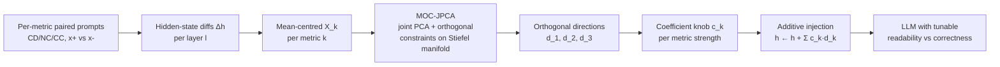

# Daily Scholar Papers Report — 2026-06-09

**[Download PDF](Daily_Papers_Report_2026-06-09.pdf)**

**Window covered:** 2026-06-08 → 2026-06-09 (Google Scholar alerts + user-curated self-emails, last 24 h)

---

## Executive Summary

A small, quiet window. The Keep slot goes to a Shengchao-Qin-group preprint that re-frames LLM code-readability steering as a **multitask representation-engineering** problem under multidimensional orthogonal constraints (MOC-JPCA), with two formal theorems bounding the readability gain (lower) and the correctness loss (upper). The bounded-tradeoff framing is the methodologically interesting part: at tuned coefficient combinations, correctness drops by **0.28 % / 0.79 % / 0.95 %** across Codellama 13b / Deepseek R1 14b / Qwen2.5coder 14b Instruct while readability metrics rise. The Borderline-High bucket holds three AsiaCCS-class entries available abstract-only: a hardware-fuzzing × sanitizer hybrid from the Texas A&M / TU Darmstadt / Intel group (**FUZZItizer**); an LLM-driven REST API security fuzzer from Würzburg / Duisburg-Essen (**RESTing-LLAMA**); and a Zhenchang-Xing-coauthored **SoK on XR Privacy-UX tradeoffs**. No user-curated self-emails arrived; no exclusion-list matches.

**Outstanding:** 0 · **Keep:** 1 · **Borderline High-Priority:** 3

---

## Highlighted Papers

| # | Title | Authors | Venue | Link |
|---|---|---|---|---|
| 2.1 | Towards the Readability of LLM-Generated Codes through Multitask Representation Engineering | H. Gao, L. He, Y. Pan, S. Yu, Y. Zeng, S. Qin, W. Sun | arXiv 2606.06214 | [arXiv](https://arxiv.org/abs/2606.06214) |
| 3.1 | FUZZItizer: Hardware Sanitizer-Assisted Fuzzing for Automated SoC Vulnerability Detection | R. Kande, M. Rostami, C. Chen, H. Khattri, J.M. Fung, A.-R. Sadeghi, J. Rajendran | AsiaCCS 2026 | [DOI](https://doi.org/10.1145/3779208.3806078) |
| 3.2 | RESTing-LLAMA: Large Language Model based REST API Fuzzing | V. Gadey, C. Sendner, K. Zimmermann, A. Dmitrienko | AsiaCCS 2026 | [DOI](https://doi.org/10.1145/3779208.3785383) |
| 3.3 | SoK: Navigating the Privacy-UX Trade-offs in Extended Reality (XR) — A Socio-Technical Taxonomy and Research Roadmap | S. Wang, M.A.P. Chamikara, M. Baruwal Chhetri, Z. Xing, et al. | Proc. ACM 2026 | [DOI](https://doi.org/10.1145/3779208.3807495) |

---

## 2. Keep

<strong>2.1</strong> · LLM CODE READABILITY · arXiv 2026 — multitask representation engineering with orthogonality-constrained joint PCA (MOC-JPCA); two theorems bound readability gain (lower) and correctness loss (upper); <1 % correctness loss across three 13–14B models

### 2.1 [Towards the Readability of LLM-Generated Codes through Multitask Representation Engineering](https://arxiv.org/abs/2606.06214) — Gao, He, Pan, Yu, Zeng, Qin, Sun (Xiamen U / Shenzhen U / Fujian Normal U / Northumbria U / Xidian U / Peking U), arXiv 2026

**Authors:** Huifan Gao, Liuhua He, Yinghui Pan, Shenbao Yu, Yifeng Zeng, **Shengchao Qin**, Weidi Sun.
**Venue:** arXiv 2606.06214, IEEE journal submission, 4 Jun 2026. Mirrors: [PDF](https://arxiv.org/pdf/2606.06214) · [Scholar lookup](https://scholar.google.com/scholar?q=Towards+the+Readability+of+LLM-Generated+Codes+through+Multitask+Representation+Engineering).
**License:** arXiv non-exclusive — no figure embedding; structural diagrams are Mermaid recreations.

**Why surfaced today.** Followed-researcher track (Shengchao Qin).

**Problem.** LLM-code research mostly optimises *correctness*; *readability* is multi-dimensional and subjective, and existing work either evaluates readability post-hoc or relies on unstable prompt engineering. Representation-engineering (RepE) steering is a natural fit because it is low-data, low-compute, and inference-only — but prior RepE is single-property. Extracting per-property steering vectors independently via PCA produces *correlated* directions that interfere when injected together for multi-property control.

**Approach — MRepE.** Three stages:

1. **Data preparation.** For each readability metric k ∈ {comment density (CD), naming conventions (NC), cyclomatic complexity (CC)}, build M_k contrastive prompt pairs (x⁺_{k,i}, x⁻_{k,i}) and compute mean-centred hidden-state differences at layer l:

   $$\Delta h^{(l)}_{k,i} = h^{(l)}_\theta(x^+_{k,i}) - h^{(l)}_\theta(x^-_{k,i})$$

2. **Steering vector extraction — MOC-JPCA.** Jointly extract one principal direction per dataset under multidimensional orthogonal constraints (d_i ⊥ d_j for i ≠ j). Solved on the Stiefel manifold via Riemannian gradient + Armijo backtracking + QR retraction.
3. **Steering vector injection.** Apply additive perturbation at selected layers:

   $$h^{(l)}_{\theta,v^{(l)}} \leftarrow h^{(l)}_\theta + v^{(l)}_1 + \dots + v^{(l)}_K \quad \text{(Eq. 2)}$$

   where v^{(l)}_k = c_k · d^{(l)}_k, with c_k tuning per-metric strength.

*Mermaid recreation of the MRepE pipeline; original Fig. 2 is not CC-licensed.*

**Formal results.** From the paper:

- **Theorem 2.** Lower-bounds the increase in expected probability of positive answers to readability-related queries after injection, as a function of c_k.
- **Theorem 3.** Upper-bounds the decline in expected probability of correct answers to correctness-related queries, again parametrised by c_k.

Together they convert RepE from a heuristic toolkit into a *coefficient-tunable system with provable worst-case bounds*. The reader can pick c per metric, predict the worst-case correctness drop, and stop tuning when the predicted loss exceeds tolerance.

**Evaluation.**

- **Datasets:** MBPP-CR (readability-paired) and MBPP-CC (multiple-choice correctness), each 300 samples extended from MBPP.
- **Models:** Deepseek R1 14b · Qwen2.5coder 14b Instruct · Codellama 13b Instruct.
- **Best-found operating points (paper's verbatim Sec. V.D summary, ≤15 words each):**

| Model | c1 (CD) | c2 (NC) | c3 (CC) | Correctness loss |
|---|---|---|---|---|
| Codellama 13b Instruct | 5.0 | 4.5 | 5.0 | 0.28 % |
| Deepseek R1 14b | 1.0 | 4.0 | 5.0 | 0.79 % |
| Qwen2.5coder 14b Instruct | 3.5 | 5.0 | 3.0 | 0.95 % |

- **Stat sig:** behaviour changes significant at p < 1.7 × 10⁻⁴ across model × metric combinations (Table III).
- **Bound tightness:** Fig. 5 surface plots show measured readability gain vs Theorem-2 lower bound — the green (measured) and red (theoretical bound) surfaces track each other across c ∈ [0, 5].

**Why this matters.** Three reasons. (i) The orthogonality-constrained joint PCA is a clean fix for the multi-vector interference problem in steering, and the Stiefel-manifold derivation transfers beyond code. (ii) The theorems make RepE a tunable engineering knob with worst-case-loss guarantees, not a heuristic — exactly what is needed when a downstream user demands "improve property X without breaking property Y by more than ε." (iii) The judgment-task-as-proxy methodology (validated by Fig. 3 correlation with sequence-level NLL) is itself a reusable analysis pattern, because it sidesteps the length-normalisation and attribute-irrelevant-token confounds that plague sequence-level intrinsic-evaluations.

**Caveats.** Readability proxies (CD, NC, CC) are themselves imperfect — the paper acknowledges this. The formal analysis is on QA-probability proxies, not raw generation, although Fig. 3 establishes empirical correlation. Three models, all 13–14B class — generalisation to frontier-scale models open.

---

## 3. Borderline High-Priority

<strong>3.1</strong> · HARDWARE FUZZING · AsiaCCS 2026 — ports software-style sanitizers (ASan/UBSan analogues) into the RTL/SoC verification fuzzing loop; TAMU × TU Darmstadt × Intel; abstract-only<a href="https://github.com/MarkLee131/paper-digest/issues/new?title=%5Bfeedback%5D+2026-06-09-3.1+AsiaCCS+2026+%E2%80%94+ports+software-style+sanitizers+%28ASan%2FUBSan+analogues%29+into+the+RTL%2FSoC+verification+fuzzing+loop%3B+TAMU+%C3%97+TU+Darmstadt+%C3%97+Intel%3B+abstract-only+%F0%9F%91%8D&body=paper_id%3A+2026-06-09-3.1%0Atitle%3A+AsiaCCS+2026+%E2%80%94+ports+software-style+sanitizers+%28ASan%2FUBSan+analogues%29+into+the+RTL%2FSoC+verification+fuzzing+loop%3B+TAMU+%C3%97+TU+Darmstadt+%C3%97+Intel%3B+abstract-only%0Aauthors%3A+Rahul+Kande%2C+Mohamadreza+Rostami%2C+Chen+Chen%2C+Hareesh+Khattri%2C+Jason+M.+Fung%2C+Ahmad-Reza+Sadeghi%2C+Jeyavijayan+Rajendran.%0Avenue%3A+AsiaCCS+2026%2C+cycle-1+%28%5Baccepted-papers+list%5D%28https%3A%2F%2Fasiaccs2026.cse.iitkgp.ac.in%2Fcycle-1-papers%2F%29%29+%C2%B7+DOI+%5B10.1145%2F3779208.3806078%5D%28https%3A%2F%2Fdoi.org%2F10.1145%2F3779208.3806078%29+%C2%B7+ACM+author-retained%2C+paywalled.%0Atopic%3A+HARDWARE+FUZZING%0Arating%3A+thumbs-up%0A%0A%3C%21--+Optional+notes+below+this+line+are+read+by+preferences.py+as+soft+signals.+--%3E%0A&labels=feedback%2Cthumbs-up" target="_blank" rel="noopener" class="fb-thumbs-up" title="thumbs up" onclick="event.stopPropagation()">👍</a><a href="https://github.com/MarkLee131/paper-digest/issues/new?title=%5Bfeedback%5D+2026-06-09-3.1+AsiaCCS+2026+%E2%80%94+ports+software-style+sanitizers+%28ASan%2FUBSan+analogues%29+into+the+RTL%2FSoC+verification+fuzzing+loop%3B+TAMU+%C3%97+TU+Darmstadt+%C3%97+Intel%3B+abstract-only+%F0%9F%AB%A5&body=paper_id%3A+2026-06-09-3.1%0Atitle%3A+AsiaCCS+2026+%E2%80%94+ports+software-style+sanitizers+%28ASan%2FUBSan+analogues%29+into+the+RTL%2FSoC+verification+fuzzing+loop%3B+TAMU+%C3%97+TU+Darmstadt+%C3%97+Intel%3B+abstract-only%0Aauthors%3A+Rahul+Kande%2C+Mohamadreza+Rostami%2C+Chen+Chen%2C+Hareesh+Khattri%2C+Jason+M.+Fung%2C+Ahmad-Reza+Sadeghi%2C+Jeyavijayan+Rajendran.%0Avenue%3A+AsiaCCS+2026%2C+cycle-1+%28%5Baccepted-papers+list%5D%28https%3A%2F%2Fasiaccs2026.cse.iitkgp.ac.in%2Fcycle-1-papers%2F%29%29+%C2%B7+DOI+%5B10.1145%2F3779208.3806078%5D%28https%3A%2F%2Fdoi.org%2F10.1145%2F3779208.3806078%29+%C2%B7+ACM+author-retained%2C+paywalled.%0Atopic%3A+HARDWARE+FUZZING%0Arating%3A+thumbs-down%0A%0A%3C%21--+Optional+notes+below+this+line+are+read+by+preferences.py+as+soft+signals.+--%3E%0A&labels=feedback%2Cthumbs-down" target="_blank" rel="noopener" class="fb-thumbs-down" title="less interested" onclick="event.stopPropagation()">🫥</a><a href="https://github.com/MarkLee131/paper-digest/issues/new?title=%5Bfeedback%5D+2026-06-09-3.1+AsiaCCS+2026+%E2%80%94+ports+software-style+sanitizers+%28ASan%2FUBSan+analogues%29+into+the+RTL%2FSoC+verification+fuzzing+loop%3B+TAMU+%C3%97+TU+Darmstadt+%C3%97+Intel%3B+abstract-only+%F0%9F%94%96&body=paper_id%3A+2026-06-09-3.1%0Atitle%3A+AsiaCCS+2026+%E2%80%94+ports+software-style+sanitizers+%28ASan%2FUBSan+analogues%29+into+the+RTL%2FSoC+verification+fuzzing+loop%3B+TAMU+%C3%97+TU+Darmstadt+%C3%97+Intel%3B+abstract-only%0Aauthors%3A+Rahul+Kande%2C+Mohamadreza+Rostami%2C+Chen+Chen%2C+Hareesh+Khattri%2C+Jason+M.+Fung%2C+Ahmad-Reza+Sadeghi%2C+Jeyavijayan+Rajendran.%0Avenue%3A+AsiaCCS+2026%2C+cycle-1+%28%5Baccepted-papers+list%5D%28https%3A%2F%2Fasiaccs2026.cse.iitkgp.ac.in%2Fcycle-1-papers%2F%29%29+%C2%B7+DOI+%5B10.1145%2F3779208.3806078%5D%28https%3A%2F%2Fdoi.org%2F10.1145%2F3779208.3806078%29+%C2%B7+ACM+author-retained%2C+paywalled.%0Atopic%3A+HARDWARE+FUZZING%0Arating%3A+save-for-later%0A%0A%3C%21--+Optional+notes+below+this+line+are+read+by+preferences.py+as+soft+signals.+--%3E%0A&labels=feedback%2Csave-for-later" target="_blank" rel="noopener" class="fb-save-for-later" title="save for later" onclick="event.stopPropagation()">🔖</a>

### 3.1 [FUZZItizer: Hardware Sanitizer-Assisted Fuzzing for Automated SoC Vulnerability Detection](https://doi.org/10.1145/3779208.3806078) — Kande, Rostami, Chen, Khattri, Fung, Sadeghi, Rajendran (Texas A&M / TU Darmstadt / Intel), AsiaCCS 2026

**Authors:** Rahul Kande, Mohamadreza Rostami, Chen Chen, Hareesh Khattri, Jason M. Fung, Ahmad-Reza Sadeghi, Jeyavijayan Rajendran.
**Venue:** AsiaCCS 2026, cycle-1 ([accepted-papers list](https://asiaccs2026.cse.iitkgp.ac.in/cycle-1-papers/)) · DOI [10.1145/3779208.3806078](https://doi.org/10.1145/3779208.3806078) · ACM author-retained, paywalled.
**Access:** No public preprint surfaced at posting time. Summary based on alert abstract snippet and the cycle-1 accepted-papers listing.

**Picture.** Hardware fuzzing has matured (TheHuzz, HyPFuzz, Fuzzerfly Effect from the same group), but bug *detection* in hardware fuzzers still leans on coarse signals — assertion violations, simulator hangs, or post-hoc waveform inspection — which leaves silent vulnerabilities undetected. FUZZItizer's pitch is to import the *sanitizer* idea from software fuzzing (ASan / UBSan / MSan) into the SoC verification loop: instrument the RTL with hardware-level sanitizer probes (memory access bounds, taint analogues, undefined-behaviour analogues), so the fuzzer detects violations *during* simulation rather than relying on post-hoc crash triage. The Intel co-authorship (Khattri, Fung) suggests evaluation on industrial SoC IP.

**Why surfaced.** Top security venue (AsiaCCS), well-known hardware-fuzzing lineage, and a directly transferable methodology: sanitizer + fuzzer is the canonical software-side recipe, and the question of "what is the right sanitizer abstraction for RTL" is the natural next step.

**Open question.** What exactly the "hardware sanitizer" abstraction is — a runtime check inserted by an RTL pass, a co-simulation gadget, or a wrapper around existing UVM/assertion infrastructure — determines how reusable the framework is. Revisit when the PDF lands.

<strong>3.2</strong> · LLM API FUZZING · AsiaCCS 2026 — LLM-driven REST API security fuzzer; Würzburg × Duisburg-Essen; abstract-only<a href="https://github.com/MarkLee131/paper-digest/issues/new?title=%5Bfeedback%5D+2026-06-09-3.2+AsiaCCS+2026+%E2%80%94+LLM-driven+REST+API+security+fuzzer%3B+W%C3%BCrzburg+%C3%97+Duisburg-Essen%3B+abstract-only+%F0%9F%91%8D&body=paper_id%3A+2026-06-09-3.2%0Atitle%3A+AsiaCCS+2026+%E2%80%94+LLM-driven+REST+API+security+fuzzer%3B+W%C3%BCrzburg+%C3%97+Duisburg-Essen%3B+abstract-only%0Aauthors%3A+Varun+Gadey%2C+Christoph+Sendner%2C+Keven+Zimmermann%2C+Alexandra+Dmitrienko.%0Avenue%3A+AsiaCCS+2026%2C+cycle-1+%28%5Baccepted-papers+list%5D%28https%3A%2F%2Fasiaccs2026.cse.iitkgp.ac.in%2Fcycle-1-papers%2F%29%29+%C2%B7+DOI+%5B10.1145%2F3779208.3785383%5D%28https%3A%2F%2Fdoi.org%2F10.1145%2F3779208.3785383%29+%C2%B7+ACM+paywall.%0Atopic%3A+LLM+API+FUZZING%0Arating%3A+thumbs-up%0A%0A%3C%21--+Optional+notes+below+this+line+are+read+by+preferences.py+as+soft+signals.+--%3E%0A&labels=feedback%2Cthumbs-up" target="_blank" rel="noopener" class="fb-thumbs-up" title="thumbs up" onclick="event.stopPropagation()">👍</a><a href="https://github.com/MarkLee131/paper-digest/issues/new?title=%5Bfeedback%5D+2026-06-09-3.2+AsiaCCS+2026+%E2%80%94+LLM-driven+REST+API+security+fuzzer%3B+W%C3%BCrzburg+%C3%97+Duisburg-Essen%3B+abstract-only+%F0%9F%AB%A5&body=paper_id%3A+2026-06-09-3.2%0Atitle%3A+AsiaCCS+2026+%E2%80%94+LLM-driven+REST+API+security+fuzzer%3B+W%C3%BCrzburg+%C3%97+Duisburg-Essen%3B+abstract-only%0Aauthors%3A+Varun+Gadey%2C+Christoph+Sendner%2C+Keven+Zimmermann%2C+Alexandra+Dmitrienko.%0Avenue%3A+AsiaCCS+2026%2C+cycle-1+%28%5Baccepted-papers+list%5D%28https%3A%2F%2Fasiaccs2026.cse.iitkgp.ac.in%2Fcycle-1-papers%2F%29%29+%C2%B7+DOI+%5B10.1145%2F3779208.3785383%5D%28https%3A%2F%2Fdoi.org%2F10.1145%2F3779208.3785383%29+%C2%B7+ACM+paywall.%0Atopic%3A+LLM+API+FUZZING%0Arating%3A+thumbs-down%0A%0A%3C%21--+Optional+notes+below+this+line+are+read+by+preferences.py+as+soft+signals.+--%3E%0A&labels=feedback%2Cthumbs-down" target="_blank" rel="noopener" class="fb-thumbs-down" title="less interested" onclick="event.stopPropagation()">🫥</a><a href="https://github.com/MarkLee131/paper-digest/issues/new?title=%5Bfeedback%5D+2026-06-09-3.2+AsiaCCS+2026+%E2%80%94+LLM-driven+REST+API+security+fuzzer%3B+W%C3%BCrzburg+%C3%97+Duisburg-Essen%3B+abstract-only+%F0%9F%94%96&body=paper_id%3A+2026-06-09-3.2%0Atitle%3A+AsiaCCS+2026+%E2%80%94+LLM-driven+REST+API+security+fuzzer%3B+W%C3%BCrzburg+%C3%97+Duisburg-Essen%3B+abstract-only%0Aauthors%3A+Varun+Gadey%2C+Christoph+Sendner%2C+Keven+Zimmermann%2C+Alexandra+Dmitrienko.%0Avenue%3A+AsiaCCS+2026%2C+cycle-1+%28%5Baccepted-papers+list%5D%28https%3A%2F%2Fasiaccs2026.cse.iitkgp.ac.in%2Fcycle-1-papers%2F%29%29+%C2%B7+DOI+%5B10.1145%2F3779208.3785383%5D%28https%3A%2F%2Fdoi.org%2F10.1145%2F3779208.3785383%29+%C2%B7+ACM+paywall.%0Atopic%3A+LLM+API+FUZZING%0Arating%3A+save-for-later%0A%0A%3C%21--+Optional+notes+below+this+line+are+read+by+preferences.py+as+soft+signals.+--%3E%0A&labels=feedback%2Csave-for-later" target="_blank" rel="noopener" class="fb-save-for-later" title="save for later" onclick="event.stopPropagation()">🔖</a>

### 3.2 [RESTing-LLAMA: Large Language Model based REST API Fuzzing](https://doi.org/10.1145/3779208.3785383) — Gadey, Sendner, Zimmermann, Dmitrienko (U Duisburg-Essen / U Würzburg), AsiaCCS 2026

**Authors:** Varun Gadey, Christoph Sendner, Keven Zimmermann, Alexandra Dmitrienko.
**Venue:** AsiaCCS 2026, cycle-1 ([accepted-papers list](https://asiaccs2026.cse.iitkgp.ac.in/cycle-1-papers/)) · DOI [10.1145/3779208.3785383](https://doi.org/10.1145/3779208.3785383) · ACM paywall.
**Access:** No public preprint located. Summary from alert abstract snippet.

**Picture.** Yet another entry in the rapidly-growing LLM-for-REST-API-fuzzing line (RESTler → RESTLess → LlamaRestTest → RESTing-LLAMA). The Würzburg / Duisburg-Essen affiliation, combined with the AsiaCCS placement, suggests focus on *security* fuzzing (auth bypass, parameter pollution, IDORs) rather than purely functional bug-finding. Top-venue acceptance earns it a Borderline-High slot even without full text.

**Why noted but not Keep.** The LLM-API-fuzzing space is now crowded; a real differentiator would be (a) head-to-head against prior LLM baselines on the same benchmark, (b) CVE disclosures, or (c) a methodological insight about *prompt strategy* for security-oriented (vs functional) fuzzing. Defer the deep read until the PDF is available.

<strong>3.3</strong> · XR PRIVACY SOK · Proc. ACM 2026 — socio-technical taxonomy of XR privacy-vs-immersion tradeoffs; followed-researcher track (Zhenchang Xing); abstract-only<a href="https://github.com/MarkLee131/paper-digest/issues/new?title=%5Bfeedback%5D+2026-06-09-3.3+Proc.+ACM+2026+%E2%80%94+socio-technical+taxonomy+of+XR+privacy-vs-immersion+tradeoffs%3B+followed-researcher+track+%28Zhenchang+Xing%29%3B+abstract-only+%F0%9F%91%8D&body=paper_id%3A+2026-06-09-3.3%0Atitle%3A+Proc.+ACM+2026+%E2%80%94+socio-technical+taxonomy+of+XR+privacy-vs-immersion+tradeoffs%3B+followed-researcher+track+%28Zhenchang+Xing%29%3B+abstract-only%0Aauthors%3A+Shaobo+Wang%2C+M.A.P.+Chamikara%2C+Mohan+Baruwal+Chhetri%2C+%2A%2AZhenchang+Xing%2A%2A%2C+et+al.%0Avenue%3A+Proceedings+of+the+ACM+2026%2C+DOI+%5B10.1145%2F3779208.3807495%5D%28https%3A%2F%2Fdoi.org%2F10.1145%2F3779208.3807495%29.+Mirrors%3A+%5BScholar+lookup%5D%28https%3A%2F%2Fscholar.google.com%2Fscholar%3Fq%3DSoK%2BNavigating%2Bthe%2BPrivacy-UX%2BTrade-offs%2Bin%2BExtended%2BReality%29.%0Atopic%3A+XR+PRIVACY+SOK%0Arating%3A+thumbs-up%0A%0A%3C%21--+Optional+notes+below+this+line+are+read+by+preferences.py+as+soft+signals.+--%3E%0A&labels=feedback%2Cthumbs-up" target="_blank" rel="noopener" class="fb-thumbs-up" title="thumbs up" onclick="event.stopPropagation()">👍</a><a href="https://github.com/MarkLee131/paper-digest/issues/new?title=%5Bfeedback%5D+2026-06-09-3.3+Proc.+ACM+2026+%E2%80%94+socio-technical+taxonomy+of+XR+privacy-vs-immersion+tradeoffs%3B+followed-researcher+track+%28Zhenchang+Xing%29%3B+abstract-only+%F0%9F%AB%A5&body=paper_id%3A+2026-06-09-3.3%0Atitle%3A+Proc.+ACM+2026+%E2%80%94+socio-technical+taxonomy+of+XR+privacy-vs-immersion+tradeoffs%3B+followed-researcher+track+%28Zhenchang+Xing%29%3B+abstract-only%0Aauthors%3A+Shaobo+Wang%2C+M.A.P.+Chamikara%2C+Mohan+Baruwal+Chhetri%2C+%2A%2AZhenchang+Xing%2A%2A%2C+et+al.%0Avenue%3A+Proceedings+of+the+ACM+2026%2C+DOI+%5B10.1145%2F3779208.3807495%5D%28https%3A%2F%2Fdoi.org%2F10.1145%2F3779208.3807495%29.+Mirrors%3A+%5BScholar+lookup%5D%28https%3A%2F%2Fscholar.google.com%2Fscholar%3Fq%3DSoK%2BNavigating%2Bthe%2BPrivacy-UX%2BTrade-offs%2Bin%2BExtended%2BReality%29.%0Atopic%3A+XR+PRIVACY+SOK%0Arating%3A+thumbs-down%0A%0A%3C%21--+Optional+notes+below+this+line+are+read+by+preferences.py+as+soft+signals.+--%3E%0A&labels=feedback%2Cthumbs-down" target="_blank" rel="noopener" class="fb-thumbs-down" title="less interested" onclick="event.stopPropagation()">🫥</a><a href="https://github.com/MarkLee131/paper-digest/issues/new?title=%5Bfeedback%5D+2026-06-09-3.3+Proc.+ACM+2026+%E2%80%94+socio-technical+taxonomy+of+XR+privacy-vs-immersion+tradeoffs%3B+followed-researcher+track+%28Zhenchang+Xing%29%3B+abstract-only+%F0%9F%94%96&body=paper_id%3A+2026-06-09-3.3%0Atitle%3A+Proc.+ACM+2026+%E2%80%94+socio-technical+taxonomy+of+XR+privacy-vs-immersion+tradeoffs%3B+followed-researcher+track+%28Zhenchang+Xing%29%3B+abstract-only%0Aauthors%3A+Shaobo+Wang%2C+M.A.P.+Chamikara%2C+Mohan+Baruwal+Chhetri%2C+%2A%2AZhenchang+Xing%2A%2A%2C+et+al.%0Avenue%3A+Proceedings+of+the+ACM+2026%2C+DOI+%5B10.1145%2F3779208.3807495%5D%28https%3A%2F%2Fdoi.org%2F10.1145%2F3779208.3807495%29.+Mirrors%3A+%5BScholar+lookup%5D%28https%3A%2F%2Fscholar.google.com%2Fscholar%3Fq%3DSoK%2BNavigating%2Bthe%2BPrivacy-UX%2BTrade-offs%2Bin%2BExtended%2BReality%29.%0Atopic%3A+XR+PRIVACY+SOK%0Arating%3A+save-for-later%0A%0A%3C%21--+Optional+notes+below+this+line+are+read+by+preferences.py+as+soft+signals.+--%3E%0A&labels=feedback%2Csave-for-later" target="_blank" rel="noopener" class="fb-save-for-later" title="save for later" onclick="event.stopPropagation()">🔖</a>

### 3.3 [SoK: Navigating the Privacy-UX Trade-offs in Extended Reality (XR) — A Socio-Technical Taxonomy and Research Roadmap](https://doi.org/10.1145/3779208.3807495) — Wang, Chamikara, Baruwal Chhetri, Xing, et al., Proc. ACM 2026

**Authors:** Shaobo Wang, M.A.P. Chamikara, Mohan Baruwal Chhetri, **Zhenchang Xing**, et al.
**Venue:** Proceedings of the ACM 2026, DOI [10.1145/3779208.3807495](https://doi.org/10.1145/3779208.3807495). Mirrors: [Scholar lookup](https://scholar.google.com/scholar?q=SoK+Navigating+the+Privacy-UX+Trade-offs+in+Extended+Reality).
**Access:** ACM paywall; abstract-only from alert snippet.

**Picture.** SoK structuring privacy-versus-UX tradeoffs in XR. Extended Reality integrates physical and digital environments through continuous multimodal sensing, creating tension between privacy protection and user experience: strong privacy controls (face/iris anonymisation, biometric stripping, sensor gating) protect users but disrupt immersion; weak controls preserve immersion but leak continuous multimodal sensor data. The paper builds a socio-technical taxonomy and a research roadmap.

**Why surfaced.** Followed-researcher track (Zhenchang Xing). Adjacent rather than central to the code-and-security thread — kept on the radar for the taxonomy framing rather than for the technical content.

---

## Cross-Paper Synthesis

Two visible threads.

**Hardware-software fuzzing convergence.** FUZZItizer ports the sanitizer idiom from ASan/UBSan into RTL/SoC verification — completing a years-long migration. The classical software-fuzzing playbook (coverage-guided + sanitizer) is now the de-facto template for hardware fuzzing, with the open question being *which* sanitizer abstractions are tractable at gate/RTL level. RESTing-LLAMA, by contrast, occupies the protocol/API frontier where LLMs replace hand-written grammars. Both papers, both AsiaCCS cycle-1: a quiet snapshot of where the non-ML-vs-protocol-fuzzing centre of mass is now (hardware-down and LLM-up).

**Property-level decoding-time control with bounded loss.** The Qin-group readability paper makes a small but instructive move: representation engineering, once a single-property steering trick, becomes a *multi-property and provably bounded* control mechanism. The Stiefel-manifold MOC-JPCA construction should generalise to any setting where the goal is to steer several conflicting properties with worst-case loss bounds — safety + helpfulness + correctness for chat models; readability + security + performance for code generators.

## Writing & Rationale Insights

The Qin paper executes two stylistic moves worth copying. First, *the bounded-loss framing*: instead of pitching "we improved metric M without breaking metric M′," the paper writes "Theorem 3 upper-bounds the M′ loss; here are coefficient combinations where the bound holds with <1 % observed loss." This converts an empirical claim into a tunable guarantee — much harder to dismiss. Second, *separating judgment-task probability from generation behaviour*: rather than claim the steering vectors *cause* better generation, the paper uses positive-answer probability on QA queries as a tractable proxy, validates the correlation empirically (Fig. 3), and confines the formal analysis to the proxy. This is a cleaner way to handle the inferential gap between intrinsic-probe results and downstream behaviour than the usual "we improve metric X therefore the model is better" rhetoric.

The two AsiaCCS abstract-only entries are reminders that when the full text is unavailable the right move is brevity and honesty: surface the venue/group signal, summarise the snippet, flag what is missing, and defer the deep read.
