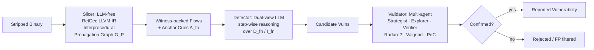
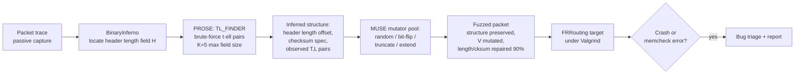

# Daily Scholar Papers Report — 2026-06-11

**[Download PDF](Daily_Papers_Report_2026-06-11.pdf)**

**Window covered:** 2026-06-10 → 2026-06-11 (Google Scholar alerts + user-curated self-emails, last 24 h)

---

## Executive Summary

A focused window with one strongly Outstanding entry and two solid Keeps. **Veritas** (UCL / BynarIO / Columbia) is a three-stage hybrid pipeline for binary memory-corruption vulnerability detection that strictly brackets the LLM between a deterministic LLVM-IR slicer and a multi-agent debugger-grounded validator; on 20 ground-truth BMCVs across 10 projects it reports **90 % recall**, **0 false positives** in 623 exhaustively-validated detector candidates vs 21–299 from Meta Infer / Semgrep / cwe_checker / RepoAudit / Codex / Claude Code on the same subset, and an Apple macOS zero-day discovered in `libusd_ms.dylib` (CVE-assigned). The Keep slot holds two complementary papers: a Princeton (Danqi Chen) preprint **WEBGRAPHMIX** that selects LM pretraining data by *web-graph centrality* over the Common Crawl host graph (13.9M nodes, 439.6M edges) and lifts a 23-task average from 39.8 % to 41.4 % structurally and to 43.8 % when combined with content quality; and **PROSE+MUSE**, an IFIP Networking 2026 generic structure-aware routing-protocol fuzzer (UCLouvain) that discovered three previously unknown EIGRP bugs and one IS-IS bug in FRRouting, all now fixed upstream. **RULEDROID** (LLM-augmented SAST rule synthesis for Android, IEEE Transactions) sits in Borderline-High as abstract-only — paywalled and no public preprint surfaced.

**Outstanding:** 1 · **Keep:** 2 · **Borderline High-Priority:** 1

---

## Highlighted Papers

| # | Title | Authors | Venue | Link |
|---|---|---|---|---|
| 1.1 | Veritas: A Semantically Grounded Agentic Framework for Memory Corruption Vulnerability Detection in Binaries | X. Zheng, A. Pesoli, M. Valleri, S. Jana, L. Cavallaro | arXiv 2605.15097 | [arXiv](https://arxiv.org/abs/2605.15097) |
| 2.1 | Hubs or Fringes? Pretraining Data Selection via Web Graph Centrality | V. Badoni, D. Chen, X. Wang | Preprint (Princeton PLI) 2026 | [PDF](https://wangxinyilinda.github.io/pdf/WebGraphMix.pdf) |
| 2.2 | Automatically Fuzzing Routing Protocols | M. Vivian, O. Bonaventure | IFIP Networking 2026 | [PDF](https://dl.ifip.org/db/conf/networking/networking2026/1571262103.pdf) |
| 3.1 | RULEDROID: LLM-Augmented Synthesis of Static Security Detection Rules for Android Apps | Z. Xie, M. Chen, Y. Gao, S. Yang, W. Diao, X. Liu, K. Zhang | IEEE Transactions 2026 | [DOI](https://ieeexplore.ieee.org/abstract/document/11551147/) |

---

## 1. Outstanding

<strong>1.1</strong> · BINARY VULN DETECTION · arXiv 2026 — three-stage hybrid (LLM-free Slicer / Dual-view LLM Detector / multi-agent Validator); 90 % recall, 0 FP in 623 exhaustively-validated candidates, Apple macOS 0day in libusd_ms.dylib (CVE-assigned)<a href="https://github.com/MarkLee131/paper-digest/issues/new?title=%5Bfeedback%5D+2026-06-11-1.1+arXiv+2026+%E2%80%94+three-stage+hybrid+%28LLM-free+Slicer+%2F+Dual-view+LLM+Detector+%2F+multi-agent+Validator%29%3B+90+%25+recall%2C+0+FP+in+623+exhaustively-validated+candidates%2C+Apple+macOS+0day+in+libusd_ms.dylib+%28CVE-assigned%29+%F0%9F%91%8D&body=paper_id%3A+2026-06-11-1.1%0Atitle%3A+arXiv+2026+%E2%80%94+three-stage+hybrid+%28LLM-free+Slicer+%2F+Dual-view+LLM+Detector+%2F+multi-agent+Validator%29%3B+90+%25+recall%2C+0+FP+in+623+exhaustively-validated+candidates%2C+Apple+macOS+0day+in+libusd_ms.dylib+%28CVE-assigned%29%0Aauthors%3A+Xinran+Zheng+%28UCL%29%2C+Alfredo+Pesoli+%28BynarIO%29%2C+Marco+Valleri+%28BynarIO%29%2C+Suman+Jana+%28Columbia%29%2C+Lorenzo+Cavallaro+%28UCL+%2F+BynarIO%29.%0Avenue%3A+arXiv+2605.15097%2C+14+May+2026+%28%5Babs%5D%28https%3A%2F%2Farxiv.org%2Fabs%2F2605.15097%29+%C2%B7+%5Bpdf%5D%28https%3A%2F%2Farxiv.org%2Fpdf%2F2605.15097%29%29.+Paper+carries+the+ACM+%22Conference+acronym+%27XX%22+placeholder+%E2%80%94+final+conference+undeclared%3B+treat+as+preprint.%0Atopic%3A+BINARY+VULN+DETECTION%0Arating%3A+thumbs-up%0A%0A%3C%21--+Optional+notes+below+this+line+are+read+by+preferences.py+as+soft+signals.+--%3E%0A&labels=feedback%2Cthumbs-up" target="_blank" rel="noopener" class="fb-thumbs-up" title="thumbs up" onclick="event.stopPropagation()">👍</a><a href="https://github.com/MarkLee131/paper-digest/issues/new?title=%5Bfeedback%5D+2026-06-11-1.1+arXiv+2026+%E2%80%94+three-stage+hybrid+%28LLM-free+Slicer+%2F+Dual-view+LLM+Detector+%2F+multi-agent+Validator%29%3B+90+%25+recall%2C+0+FP+in+623+exhaustively-validated+candidates%2C+Apple+macOS+0day+in+libusd_ms.dylib+%28CVE-assigned%29+%F0%9F%AB%A5&body=paper_id%3A+2026-06-11-1.1%0Atitle%3A+arXiv+2026+%E2%80%94+three-stage+hybrid+%28LLM-free+Slicer+%2F+Dual-view+LLM+Detector+%2F+multi-agent+Validator%29%3B+90+%25+recall%2C+0+FP+in+623+exhaustively-validated+candidates%2C+Apple+macOS+0day+in+libusd_ms.dylib+%28CVE-assigned%29%0Aauthors%3A+Xinran+Zheng+%28UCL%29%2C+Alfredo+Pesoli+%28BynarIO%29%2C+Marco+Valleri+%28BynarIO%29%2C+Suman+Jana+%28Columbia%29%2C+Lorenzo+Cavallaro+%28UCL+%2F+BynarIO%29.%0Avenue%3A+arXiv+2605.15097%2C+14+May+2026+%28%5Babs%5D%28https%3A%2F%2Farxiv.org%2Fabs%2F2605.15097%29+%C2%B7+%5Bpdf%5D%28https%3A%2F%2Farxiv.org%2Fpdf%2F2605.15097%29%29.+Paper+carries+the+ACM+%22Conference+acronym+%27XX%22+placeholder+%E2%80%94+final+conference+undeclared%3B+treat+as+preprint.%0Atopic%3A+BINARY+VULN+DETECTION%0Arating%3A+thumbs-down%0A%0A%3C%21--+Optional+notes+below+this+line+are+read+by+preferences.py+as+soft+signals.+--%3E%0A&labels=feedback%2Cthumbs-down" target="_blank" rel="noopener" class="fb-thumbs-down" title="less interested" onclick="event.stopPropagation()">🫥</a><a href="https://github.com/MarkLee131/paper-digest/issues/new?title=%5Bfeedback%5D+2026-06-11-1.1+arXiv+2026+%E2%80%94+three-stage+hybrid+%28LLM-free+Slicer+%2F+Dual-view+LLM+Detector+%2F+multi-agent+Validator%29%3B+90+%25+recall%2C+0+FP+in+623+exhaustively-validated+candidates%2C+Apple+macOS+0day+in+libusd_ms.dylib+%28CVE-assigned%29+%F0%9F%94%96&body=paper_id%3A+2026-06-11-1.1%0Atitle%3A+arXiv+2026+%E2%80%94+three-stage+hybrid+%28LLM-free+Slicer+%2F+Dual-view+LLM+Detector+%2F+multi-agent+Validator%29%3B+90+%25+recall%2C+0+FP+in+623+exhaustively-validated+candidates%2C+Apple+macOS+0day+in+libusd_ms.dylib+%28CVE-assigned%29%0Aauthors%3A+Xinran+Zheng+%28UCL%29%2C+Alfredo+Pesoli+%28BynarIO%29%2C+Marco+Valleri+%28BynarIO%29%2C+Suman+Jana+%28Columbia%29%2C+Lorenzo+Cavallaro+%28UCL+%2F+BynarIO%29.%0Avenue%3A+arXiv+2605.15097%2C+14+May+2026+%28%5Babs%5D%28https%3A%2F%2Farxiv.org%2Fabs%2F2605.15097%29+%C2%B7+%5Bpdf%5D%28https%3A%2F%2Farxiv.org%2Fpdf%2F2605.15097%29%29.+Paper+carries+the+ACM+%22Conference+acronym+%27XX%22+placeholder+%E2%80%94+final+conference+undeclared%3B+treat+as+preprint.%0Atopic%3A+BINARY+VULN+DETECTION%0Arating%3A+save-for-later%0A%0A%3C%21--+Optional+notes+below+this+line+are+read+by+preferences.py+as+soft+signals.+--%3E%0A&labels=feedback%2Csave-for-later" target="_blank" rel="noopener" class="fb-save-for-later" title="save for later" onclick="event.stopPropagation()">🔖</a>

### 1.1 [Veritas: A Semantically Grounded Agentic Framework for Memory Corruption Vulnerability Detection in Binaries](https://arxiv.org/abs/2605.15097) — Zheng, Pesoli, Valleri, Jana, Cavallaro (UCL / BynarIO / Columbia), arXiv 2026

**Authors:** Xinran Zheng (UCL), Alfredo Pesoli (BynarIO), Marco Valleri (BynarIO), Suman Jana (Columbia), Lorenzo Cavallaro (UCL / BynarIO).
**Venue:** arXiv 2605.15097, 14 May 2026 ([abs](https://arxiv.org/abs/2605.15097) · [pdf](https://arxiv.org/pdf/2605.15097)). Paper carries the ACM "Conference acronym 'XX" placeholder — final conference undeclared; treat as preprint.
**License:** arXiv non-exclusive — no figure embedding; structural diagrams are Mermaid recreations.

**Why surfaced today.** Recommended-articles track. Followed-researcher posture is implicit: Jana / Cavallaro are well-established in binary security and ML-for-security; BynarIO industrial co-authorship suggests evaluation against real macOS IP.

**Problem.** Binary memory-corruption vulnerability (BMCV) detection on stripped binaries is *semantic reconstruction* from artefacts whose object boundaries and high-level control structure have been erased by compilation and stripping. Three demands the paper identifies: track interprocedural propagation of attacker-controlled values across functions and shared state; decide whether a sink-reaching access violates object safety under feasible path conditions; do this on the *actually-deployed* artefact (stripped binary). Pure static analysis over-approximates (Meta Infer, Semgrep, cwe_checker yield 77–299 FPs on the same subset); pure fuzzing catches 2/20 of the ground-truth set; pure LLM agents (RepoAudit, Codex, Claude-Code) generate 21–186 FPs on the same exhaustive subset.

**Architecture — three stages, two grounding layers.**

*Mermaid recreation of Veritas Figure 3 (Workflow); original figure is not CC-licensed.*

1. **Semantic-driven Context Slicer (LLM-free).** Lifts binary via RetDec to LLVM IR; extracts an interprocedural fact base (SSA def-use chains, call relations, actual-to-formal parameter mappings, return-value propagation, global-access summaries, pointer-manipulation records, sink-related facts); materialises the typed interprocedural propagation graph $G_P = (\mathcal{F}, \mathcal{E}, \kappa, \mu)$ where $\kappa$ assigns each edge a propagation kind (call / return / global) and $\mu$ stores metadata for taint transfer. Witness extraction validates a bounded path $w: f_0 \xrightarrow{e_0} f_1 \cdots \xrightarrow{e_{k-1}} f_k$ only when taint reaches a dangerous-API argument or memory-safety-relevant pointer op in $f_k$. Each retained function carries a *provenance class* ∈ {witness, global_proven, defuse_proven, context_only} and the propagation tokens, endpoint annotations, and provenance class together form the **anchor cues** $\mathcal{A}(f_n)$.
2. **Dual-view Vulnerability Detector.** Step-wise LLM reasoning over witness-backed flows. The per-function input representation is paper Eq. 1:

   $$\mathcal{R}(f_t) = \begin{cases} \langle I(f_t), D(f_t) \rangle, & f_t \in \mathcal{F}_{src} \cup \mathcal{F}_{sink}, \\ D(f_t), & \text{otherwise.} \end{cases}$$

   Lifted IR is consulted at source/sink (where decompilation collapses memory ops into opaque offset expressions); intermediate functions are reasoned over decompiled C alone, anchored by $\mathcal{A}(f_n)$. Trie-based prefix memoisation amortises shared flow prefixes.
3. **Automatic Vulnerability Validator (multi-agent).** Strategist sets breakpoints + triggering modality; Explorer constructs PoCs and probes alternative states; Verifier diagnoses failure with Radare2 + Valgrind oracles. Only validator-confirmed candidates are reported.

**Headline numbers (from paper Tables 3, 5, 6, 7).**

*Slicer context quality (Table 5)* — Slicer achieves 20/20 sink coverage, 20/20 flow coverage, and 20/20 flow connectivity at an average of **5.16 functions per flow**. The 4-hop call-graph expansion (CG-4) achieves the same coverage but only 6/20 connectivity at **408.9 functions per flow** — i.e. ≈80× more context for *no* improvement in propagation correctness.

*Detector filtering (Table 6).* On the 7-project exhaustive subset, Slicer emits 2,002 witness-backed flows; Detector narrows to **623 candidates** (68.88 % reduction) while keeping **9 TPs / 0 FNs**.

*False-positive comparison (Table 3).* On the same 623-candidate exhaustive subset:

| Tool | False Positives |
|---|---|
| **Veritas** | **0** |
| AFL++ | 0 (but only 2/20 TP) |
| RepoAudit | 21 |
| Codex | 24 |
| Semgrep | 77 |
| cwe_checker | 93 |
| Claude Code | 186 |
| Meta Infer | 299 |

*Full-pipeline numbers.* 957 of 3,967 candidates validated (24.12 %); **2 FPs total**, both traceable to RetDec preamble-recovery loss. Recall on the full 20-case set: **90 %** (2 FNs from the same RetDec failure mode).

*Cost (Table 4).* Non-deduplicated: 11,901 flows → 3,967 candidates → 33.40 h Discovery on 50 threads ($1,190.10) + 12.67 days Validator time ($7,140.60). Content-level deduplication cuts each by ~30 % to $789.80 + $4,738.80. Validator at ~$1.80 / candidate is the bottleneck.

**Real-world finding.** Apple macOS Universal Scene Description (`libusd_ms.dylib`) zero-day. Vulnerability: in `importNodeAnimations`, an attacker-controlled `channel.sampler` index is loaded into `iVar6`, scaled by sampler-object size (`0xe0`), and added to the `samplers`-array base address. When the index exceeds the array bounds, the computed pointer leaves the allocation and is dereferenced inside `getAccessorElementCount`, producing an OOB read. Validator constructed a PoC glTF with `sampler = 0x1000000`, set a breakpoint at the arithmetic site, and confirmed boundary violation under debugger. Vendor-confirmed; CVE-2025-[REDACTED] assigned.

**Failure-mode analysis.** Two FNs in project-set P1 share a root cause: RetDec failed to recover a function preamble fully, so the destination-object's full extent was absent from both decompiled C and lifted IR. Detector identified the correct vulnerability class and missing-bounds condition but hypothesised a smaller destination object. Those FNs cascaded into the two observed FPs: Validator confirmed the Detector-claimed write length, but it fell inside the larger true allocation. The paper labels this a *coupled failure mode caused by representation loss in recovered binary artefacts* — i.e. a tool-chain limit (RetDec), not an algorithmic limit of the framework.

**Why this matters.** Five compounding signals make Veritas the clear Outstanding pick of the window.

1. *Architectural insight.* The strict separation of "what to look at" (Slicer, deterministic), "what does it mean" (Detector, LLM-controlled, witness-anchored), and "is it real" (Validator, executable evidence) is exactly the modular factoring the field has been groping for. Recent industry write-ups (referenced in the paper) make the same argument: capability lives in the *system around the model*, not the model alone.
2. *Crushing FP profile vs all reasonable baselines.* 0 FP against 21–299 from established static analysers and against 24–186 from LLM-agentic baselines, on the same exhaustive subset, is unusual; the 2 FPs that *do* appear in the full pipeline reduce to a documented tool-chain artefact rather than the framework's reasoning.
3. *Real CVE.* Not a synthetic-benchmark hit but an Apple zero-day confirmed and CVE-assigned by the vendor.
4. *Reusable interface design.* The witness-backed flow + anchor-cue representation is the right interface between static analysis and an LLM reasoner — it answers "what tokens should I track here" and "how confident am I about this function's relevance" *before* reasoning starts. Most other LLM-for-binary-vuln systems (VulBinLLM, LATTE) lack this layer.
5. *Closing-line verbatim:* "These results support semantic grounding as an operational design principle for practical binary vulnerability detection."

**Caveats.**

- Dataset is 20 instances / 10 projects — the paper acknowledges this and explains the four simultaneous criteria each sample must satisfy (compilable, ground-truth annotatable, etc.); fine-grained annotation runs ~2 person-days per case.
- Validator cost is high; deduplication helps ~30 % but the bottleneck is structural.
- Evaluation focuses on OOB-read / write; extending to UAF, double-free, type-confusion requires new source models, sink models, and oracles.
- Three FNs trace to RetDec preamble recovery — the 90 % recall partly reflects the binary front-end's recovery floor, not the framework's reasoning.
- Architecture is *complementary* to coverage-guided fuzzing (which caught only 2/20 in their setup) but isn't itself adaptive; combining with directed fuzzing is the natural follow-on.

---

## 2. Keep

<strong>2.1</strong> · LLM PRETRAINING DATA · Preprint 2026 — selects pretraining data by Common Crawl host-graph centrality (Betweenness / Katz; 13.9M nodes, 439.6M edges); 50/50 mix lifts 23-task average 39.8 % → 41.4 %, centrality × quality reaches 43.8 %<a href="https://github.com/MarkLee131/paper-digest/issues/new?title=%5Bfeedback%5D+2026-06-11-2.1+Preprint+2026+%E2%80%94+selects+pretraining+data+by+Common+Crawl+host-graph+centrality+%28Betweenness+%2F+Katz%3B+13.9M+nodes%2C+439.6M+edges%29%3B+50%2F50+mix+lifts+23-task+average+39.8+%25+%E2%86%92+41.4+%25%2C+centrality+%C3%97+quality+reaches+43.8+%25+%F0%9F%91%8D&body=paper_id%3A+2026-06-11-2.1%0Atitle%3A+Preprint+2026+%E2%80%94+selects+pretraining+data+by+Common+Crawl+host-graph+centrality+%28Betweenness+%2F+Katz%3B+13.9M+nodes%2C+439.6M+edges%29%3B+50%2F50+mix+lifts+23-task+average+39.8+%25+%E2%86%92+41.4+%25%2C+centrality+%C3%97+quality+reaches+43.8+%25%0Aauthors%3A+Vedant+Badoni%2C+%2A%2ADanqi+Chen%2A%2A%2C+Xinyi+Wang.%0Avenue%3A+Preprint%2C+Princeton+Language+and+Intelligence+%28PLI%29.+Mirrors%3A+%5BPDF%5D%28https%3A%2F%2Fwangxinyilinda.github.io%2Fpdf%2FWebGraphMix.pdf%29+%C2%B7+%5BScholar+lookup%5D%28https%3A%2F%2Fscholar.google.com%2Fscholar%3Fq%3DHubs%2Bor%2BFringes%2BPretraining%2BData%2BSelection%2Bvia%2BWeb%2BGraph%2BCentrality%29.%0Atopic%3A+LLM+PRETRAINING+DATA%0Arating%3A+thumbs-up%0A%0A%3C%21--+Optional+notes+below+this+line+are+read+by+preferences.py+as+soft+signals.+--%3E%0A&labels=feedback%2Cthumbs-up" target="_blank" rel="noopener" class="fb-thumbs-up" title="thumbs up" onclick="event.stopPropagation()">👍</a><a href="https://github.com/MarkLee131/paper-digest/issues/new?title=%5Bfeedback%5D+2026-06-11-2.1+Preprint+2026+%E2%80%94+selects+pretraining+data+by+Common+Crawl+host-graph+centrality+%28Betweenness+%2F+Katz%3B+13.9M+nodes%2C+439.6M+edges%29%3B+50%2F50+mix+lifts+23-task+average+39.8+%25+%E2%86%92+41.4+%25%2C+centrality+%C3%97+quality+reaches+43.8+%25+%F0%9F%AB%A5&body=paper_id%3A+2026-06-11-2.1%0Atitle%3A+Preprint+2026+%E2%80%94+selects+pretraining+data+by+Common+Crawl+host-graph+centrality+%28Betweenness+%2F+Katz%3B+13.9M+nodes%2C+439.6M+edges%29%3B+50%2F50+mix+lifts+23-task+average+39.8+%25+%E2%86%92+41.4+%25%2C+centrality+%C3%97+quality+reaches+43.8+%25%0Aauthors%3A+Vedant+Badoni%2C+%2A%2ADanqi+Chen%2A%2A%2C+Xinyi+Wang.%0Avenue%3A+Preprint%2C+Princeton+Language+and+Intelligence+%28PLI%29.+Mirrors%3A+%5BPDF%5D%28https%3A%2F%2Fwangxinyilinda.github.io%2Fpdf%2FWebGraphMix.pdf%29+%C2%B7+%5BScholar+lookup%5D%28https%3A%2F%2Fscholar.google.com%2Fscholar%3Fq%3DHubs%2Bor%2BFringes%2BPretraining%2BData%2BSelection%2Bvia%2BWeb%2BGraph%2BCentrality%29.%0Atopic%3A+LLM+PRETRAINING+DATA%0Arating%3A+thumbs-down%0A%0A%3C%21--+Optional+notes+below+this+line+are+read+by+preferences.py+as+soft+signals.+--%3E%0A&labels=feedback%2Cthumbs-down" target="_blank" rel="noopener" class="fb-thumbs-down" title="less interested" onclick="event.stopPropagation()">🫥</a><a href="https://github.com/MarkLee131/paper-digest/issues/new?title=%5Bfeedback%5D+2026-06-11-2.1+Preprint+2026+%E2%80%94+selects+pretraining+data+by+Common+Crawl+host-graph+centrality+%28Betweenness+%2F+Katz%3B+13.9M+nodes%2C+439.6M+edges%29%3B+50%2F50+mix+lifts+23-task+average+39.8+%25+%E2%86%92+41.4+%25%2C+centrality+%C3%97+quality+reaches+43.8+%25+%F0%9F%94%96&body=paper_id%3A+2026-06-11-2.1%0Atitle%3A+Preprint+2026+%E2%80%94+selects+pretraining+data+by+Common+Crawl+host-graph+centrality+%28Betweenness+%2F+Katz%3B+13.9M+nodes%2C+439.6M+edges%29%3B+50%2F50+mix+lifts+23-task+average+39.8+%25+%E2%86%92+41.4+%25%2C+centrality+%C3%97+quality+reaches+43.8+%25%0Aauthors%3A+Vedant+Badoni%2C+%2A%2ADanqi+Chen%2A%2A%2C+Xinyi+Wang.%0Avenue%3A+Preprint%2C+Princeton+Language+and+Intelligence+%28PLI%29.+Mirrors%3A+%5BPDF%5D%28https%3A%2F%2Fwangxinyilinda.github.io%2Fpdf%2FWebGraphMix.pdf%29+%C2%B7+%5BScholar+lookup%5D%28https%3A%2F%2Fscholar.google.com%2Fscholar%3Fq%3DHubs%2Bor%2BFringes%2BPretraining%2BData%2BSelection%2Bvia%2BWeb%2BGraph%2BCentrality%29.%0Atopic%3A+LLM+PRETRAINING+DATA%0Arating%3A+save-for-later%0A%0A%3C%21--+Optional+notes+below+this+line+are+read+by+preferences.py+as+soft+signals.+--%3E%0A&labels=feedback%2Csave-for-later" target="_blank" rel="noopener" class="fb-save-for-later" title="save for later" onclick="event.stopPropagation()">🔖</a>

### 2.1 [Hubs or Fringes? Pretraining Data Selection via Web Graph Centrality](https://wangxinyilinda.github.io/pdf/WebGraphMix.pdf) — Badoni, Chen, Wang (Princeton Language and Intelligence), Preprint 2026

**Authors:** Vedant Badoni, **Danqi Chen**, Xinyi Wang.
**Venue:** Preprint, Princeton Language and Intelligence (PLI). Mirrors: [PDF](https://wangxinyilinda.github.io/pdf/WebGraphMix.pdf) · [Scholar lookup](https://scholar.google.com/scholar?q=Hubs+or+Fringes+Pretraining+Data+Selection+via+Web+Graph+Centrality).
**License:** preprint, non-exclusive — no figure embedding; structural diagrams in Mermaid.

**Why surfaced today.** Followed-researcher track (Danqi Chen).

**Problem.** Modern LM pretraining pipelines treat documents as independent units and apply heuristic quality filters or domain classifiers; they ignore that the web is a *graph*, with documents and hosts connected by hyperlinks that encode topical structure and citation patterns. The paper's hypothesis: a document's *structural position* in this graph correlates with the *type and transferability* of knowledge it provides — central hosts expose models to broadly reusable abstractions; peripheral hosts encode specialised long-tail knowledge.

**Approach — WEBGRAPHMIX.** Four moves:

1. **Host-level web graph.** Common Crawl `cc-main-2023-24-sep-nov-feb-host`; 13.9M nodes (hosts), 439.6M directed edges (hyperlinks). ~5 % of pretraining-corpus documents whose host is missing from the graph are dropped; remaining documents inherit their host's centrality.
2. **Centrality measures** (paper Eqs. 1 and 2):

   $$c_B(v) = \sum_{s \neq v \neq t} \frac{\sigma(s, t \mid v)}{\sigma(s, t)}$$

   $$c_K(v_i) = \eta \sum_j A_{ij} c_K(v_j) + \tau, \quad 0 < \eta < 1/\lambda_{\max}$$

   PageRank / eigenvector centrality was tried as ablation — "did not yield improvements over the baseline", consistent with the DCLM paper's earlier observation. Betweenness emphasises cross-community connectivity; Katz reflects global influence.
3. **Centrality-guided sampling** (paper Eq. 3):

   $$\text{Dataset} = \alpha \cdot \text{TopK} + (1 - \alpha) \cdot \text{BottomK}, \quad \alpha \in \{0, 0.25, 0.5, 0.75, 1\}$$
4. **Combining structural + quality signals.** Normalisation (paper Eq. 4): $\hat{s}_i = \exp(s_i - \max_j s_j)$. Additive / multiplicative for "high centrality × high quality" TopK selection; subtractive / divisive for "high quality × low centrality" BottomK selection. Quality scores from DCLM-fasttext.

**Evaluation.**

- **Setup.** DataComp-LM pipeline. Train 400M and 1B parameter models with 8B and 28B tokens respectively. 23 downstream tasks across factual / commonsense / symbolic-reasoning categories.
- **Headline numbers (paper's main results table).**

  | Method | Reasoning | Symbolic | Multi-tail | Coding | Commonsense | Avg |
  |---|---|---|---|---|---|---|
  | Random | 57.3 | 37.9 | 34.2 | 19.0 | 39.9 | **39.8** |
  | WebOrganizer | 59.6 | 39.2 | 38.0 | 22.5 | 38.3 | 42.1 |
  | WebOrganizer+ | 61.9 | 41.4 | 39.1 | 21.9 | 38.8 | 43.4 |
  | PageRank | 56.9 | 37.4 | 34.8 | 19.3 | 38.1 | 39.6 |
  | **WEBGRAPHMIX** | 59.5 | 39.4 | 35.4 | 21.4 | 40.2 | **41.4** |
  | **WEBGRAPHMIX+** | 60.8 | **42.6** | **39.7** | 22.6 | **41.9** | **43.8** |

- **Robustness.** 18 of 18 reported configurations of WEBGRAPHMIX+ exceed the quality-only baseline (42.3 %), with gains of 0.5 % – 1.5 %.
- **Compute budget.** Betweenness < 6 h on 4 H100s (cuGraph); Katz < 3 h on 1 H100. One-time preprocessing — sampling adds essentially zero overhead.
- **Qualitative spectrum (Table 1).** High-betweenness hosts (Wikipedia, Google, YouTube, Facebook, LinkedIn) tend toward broadly reusable cross-domain content; low-betweenness hosts (niche personal, creative, regulatory) tend toward specialised long-tail content.

**Why noted.** Three reasons.

1. *Followed-researcher signal.* Princeton PLI / Danqi Chen.
2. *Compute-efficient one-time preprocessing.* Most prior data-selection methods (DoGE, Skill-it!, Aioli, Nemotron-CLIMB) require repeated model training or proxy evaluation; WEBGRAPHMIX doesn't.
3. *Orthogonality is the strongest claim.* The +4.0 absolute over random and +1.5 absolute over quality-only, combined with 18/18 combined-configuration robustness, suggests centrality captures something content classifiers miss. The bounded gain (≤1.5 % over the quality-only baseline) is modest by frontier standards but the *signal independence* is the interesting part.

**Caveats.**

- The "central → reasoning, peripheral → commonsense" claim is supported by category-level deltas but the causal story is hypothesised rather than mechanistically tested.
- Evaluation at 400M / 1B parameter scale with 8B / 28B tokens — modest by 2026 standards; frontier-scale generalisation untested.
- Single host-graph snapshot; temporal stability under web evolution is not measured.

<strong>2.2</strong> · PROTOCOL FUZZING · IFIP Networking 2026 — generic structure-aware fuzzer for routing protocols; PROSE infers TLV layout, MUSE mutates while preserving structure; 3 EIGRP + 1 IS-IS bugs disclosed and fixed in FRRouting 10.3/10.4<a href="https://github.com/MarkLee131/paper-digest/issues/new?title=%5Bfeedback%5D+2026-06-11-2.2+IFIP+Networking+2026+%E2%80%94+generic+structure-aware+fuzzer+for+routing+protocols%3B+PROSE+infers+TLV+layout%2C+MUSE+mutates+while+preserving+structure%3B+3+EIGRP+%2B+1+IS-IS+bugs+disclosed+and+fixed+in+FRRouting+10.3%2F10.4+%F0%9F%91%8D&body=paper_id%3A+2026-06-11-2.2%0Atitle%3A+IFIP+Networking+2026+%E2%80%94+generic+structure-aware+fuzzer+for+routing+protocols%3B+PROSE+infers+TLV+layout%2C+MUSE+mutates+while+preserving+structure%3B+3+EIGRP+%2B+1+IS-IS+bugs+disclosed+and+fixed+in+FRRouting+10.3%2F10.4%0Aauthors%3A+Martin+Vivian+%28UCLouvain%29%2C+Olivier+Bonaventure+%28UCLouvain+%2F+WELRI%29.%0Avenue%3A+IFIP+Networking+2026%2C+ISBN+978-3-903176-82-9+%28%5Bproceedings+PDF%5D%28https%3A%2F%2Fdl.ifip.org%2Fdb%2Fconf%2Fnetworking%2Fnetworking2026%2F1571262103.pdf%29%29.+Mirrors%3A+%5BScholar+lookup%5D%28https%3A%2F%2Fscholar.google.com%2Fscholar%3Fq%3DAutomatically%2BFuzzing%2BRouting%2BProtocols%2BVivian%2BBonaventure%29.%0Atopic%3A+PROTOCOL+FUZZING%0Arating%3A+thumbs-up%0A%0A%3C%21--+Optional+notes+below+this+line+are+read+by+preferences.py+as+soft+signals.+--%3E%0A&labels=feedback%2Cthumbs-up" target="_blank" rel="noopener" class="fb-thumbs-up" title="thumbs up" onclick="event.stopPropagation()">👍</a><a href="https://github.com/MarkLee131/paper-digest/issues/new?title=%5Bfeedback%5D+2026-06-11-2.2+IFIP+Networking+2026+%E2%80%94+generic+structure-aware+fuzzer+for+routing+protocols%3B+PROSE+infers+TLV+layout%2C+MUSE+mutates+while+preserving+structure%3B+3+EIGRP+%2B+1+IS-IS+bugs+disclosed+and+fixed+in+FRRouting+10.3%2F10.4+%F0%9F%AB%A5&body=paper_id%3A+2026-06-11-2.2%0Atitle%3A+IFIP+Networking+2026+%E2%80%94+generic+structure-aware+fuzzer+for+routing+protocols%3B+PROSE+infers+TLV+layout%2C+MUSE+mutates+while+preserving+structure%3B+3+EIGRP+%2B+1+IS-IS+bugs+disclosed+and+fixed+in+FRRouting+10.3%2F10.4%0Aauthors%3A+Martin+Vivian+%28UCLouvain%29%2C+Olivier+Bonaventure+%28UCLouvain+%2F+WELRI%29.%0Avenue%3A+IFIP+Networking+2026%2C+ISBN+978-3-903176-82-9+%28%5Bproceedings+PDF%5D%28https%3A%2F%2Fdl.ifip.org%2Fdb%2Fconf%2Fnetworking%2Fnetworking2026%2F1571262103.pdf%29%29.+Mirrors%3A+%5BScholar+lookup%5D%28https%3A%2F%2Fscholar.google.com%2Fscholar%3Fq%3DAutomatically%2BFuzzing%2BRouting%2BProtocols%2BVivian%2BBonaventure%29.%0Atopic%3A+PROTOCOL+FUZZING%0Arating%3A+thumbs-down%0A%0A%3C%21--+Optional+notes+below+this+line+are+read+by+preferences.py+as+soft+signals.+--%3E%0A&labels=feedback%2Cthumbs-down" target="_blank" rel="noopener" class="fb-thumbs-down" title="less interested" onclick="event.stopPropagation()">🫥</a><a href="https://github.com/MarkLee131/paper-digest/issues/new?title=%5Bfeedback%5D+2026-06-11-2.2+IFIP+Networking+2026+%E2%80%94+generic+structure-aware+fuzzer+for+routing+protocols%3B+PROSE+infers+TLV+layout%2C+MUSE+mutates+while+preserving+structure%3B+3+EIGRP+%2B+1+IS-IS+bugs+disclosed+and+fixed+in+FRRouting+10.3%2F10.4+%F0%9F%94%96&body=paper_id%3A+2026-06-11-2.2%0Atitle%3A+IFIP+Networking+2026+%E2%80%94+generic+structure-aware+fuzzer+for+routing+protocols%3B+PROSE+infers+TLV+layout%2C+MUSE+mutates+while+preserving+structure%3B+3+EIGRP+%2B+1+IS-IS+bugs+disclosed+and+fixed+in+FRRouting+10.3%2F10.4%0Aauthors%3A+Martin+Vivian+%28UCLouvain%29%2C+Olivier+Bonaventure+%28UCLouvain+%2F+WELRI%29.%0Avenue%3A+IFIP+Networking+2026%2C+ISBN+978-3-903176-82-9+%28%5Bproceedings+PDF%5D%28https%3A%2F%2Fdl.ifip.org%2Fdb%2Fconf%2Fnetworking%2Fnetworking2026%2F1571262103.pdf%29%29.+Mirrors%3A+%5BScholar+lookup%5D%28https%3A%2F%2Fscholar.google.com%2Fscholar%3Fq%3DAutomatically%2BFuzzing%2BRouting%2BProtocols%2BVivian%2BBonaventure%29.%0Atopic%3A+PROTOCOL+FUZZING%0Arating%3A+save-for-later%0A%0A%3C%21--+Optional+notes+below+this+line+are+read+by+preferences.py+as+soft+signals.+--%3E%0A&labels=feedback%2Csave-for-later" target="_blank" rel="noopener" class="fb-save-for-later" title="save for later" onclick="event.stopPropagation()">🔖</a>

### 2.2 [Automatically Fuzzing Routing Protocols](https://dl.ifip.org/db/conf/networking/networking2026/1571262103.pdf) — Vivian, Bonaventure (UCLouvain / WELRI), IFIP Networking 2026

**Authors:** Martin Vivian (UCLouvain), Olivier Bonaventure (UCLouvain / WELRI).
**Venue:** IFIP Networking 2026, ISBN 978-3-903176-82-9 ([proceedings PDF](https://dl.ifip.org/db/conf/networking/networking2026/1571262103.pdf)). Mirrors: [Scholar lookup](https://scholar.google.com/scholar?q=Automatically+Fuzzing+Routing+Protocols+Vivian+Bonaventure).
**License:** © 2026 IFIP — no figure embedding; pipeline diagram in Mermaid.

**Why surfaced today.** Recommended-articles track. Research-value and methodology-reusability are both high: routing-protocol fuzzing is under-served compared to application-protocol fuzzing, and the TLV-inference algorithm is reusable beyond routing.

**Problem.** Message-based routing protocols (OSPF, IS-IS, EIGRP, Babel, RIP, RSVP, IGMP) are critical control-plane infrastructure where a single malformed packet can crash a router and degrade an enterprise or ISP network. Existing protocol fuzzers either require known message templates (Polymorph, mqtt_fuzzing), are restricted to a single protocol (BGP boofuzzer, EIGRP MITM fuzzer of Wen et al.), or have limited structural awareness. The paper's research question, verbatim: *"By observing the packets exchanged by routers, is it possible to develop a generic fuzzer which can take into account the protocol structure without explicit knowledge of the protocol?"*

**Approach.** Two tools that compose into a generic structure-aware fuzzer.

*Mermaid recreation of Vivian–Bonaventure Figure 4 (Fuzzer workflow); original figure is not CC-licensed.*

1. **PROSE (PROtocol Structure Extractor).** Pure observational analysis of a passive packet trace:
   - **Header length field.** Invoke BinaryInferno (Chandler et al., NDSS 2023) to identify the byte offset of the header length field; store as $H$.
   - **Checksum.** Slide candidate computation regions across each packet; test every supported checksum algorithm (Internet checksum, Fletcher) at every possible offset until the recomputed checksum matches.
   - **TLV search (Algorithm 1, TL_FINDER).** $K = 5$ bounds the maximum byte size of Type and Length fields. For every $(t, \ell)$ pair with $1 \le t \le K - 1$ and $1 \le \ell \le K - t$: call OFFSET_RATES to find candidate TLV-start offsets, then COLLECT_TL to enumerate observed $(T, L)$ pairs. Select the configuration that maximises the number of distinct $(T, L)$ pairs observed across all packets. Algorithm 2 (`offsetRates`) and Algorithm 3 (`loopOK`) provide the inner predicates.

2. **MUSE (Mutation & Stress Engine).** Receives PROSE's output and generates structure-preserving mutations:
   - Walk the packet, recognise each TLV.
   - High probability: fuzz **values**. Low probability: fuzz **types** / **lengths**.
   - Four mutators: random byte mutation, bit-flip, truncate, extend.
   - For extend / truncate, recompute the TLV length and any header length 90 % of the time; the remaining 10 % deliberately produces malformed length fields.
   - Recompute checksum after mutation, if PROSE detected one.

**Evaluation.**

- **Setup.** Containerlab five-router topology with FRRouting v10.3.1. Three protocols: IS-IS, EIGRP, Babel.
- **TLV inference (paper Table I).**

  |  | IS-IS | Babel | EIGRP |
  |---|---|---|---|
  | Precision | 68.57 % | 100 % | 100 % |
  | Recall | 75 % | 88.89 % | 100 % |

  PROSE correctly inferred all 16 top-level IS-IS TLVs, all 7 Babel TLVs (one length-0 sub-TLV missed), and all 4 EIGRP TLVs. Sub-TLV inference degrades for IS-IS (8 / 16 sub-TLVs detected) — long packets contain inner byte values that look like valid lengths and violate the T-L-V structural assumption.
- **Fuzzing.** Three previously unknown EIGRP bugs and one previously unknown IS-IS bug in FRRouting, all reported and fixed upstream in FRR 10.3 and 10.4. One of the EIGRP findings is a uninitialised memory read detected via Valgrind; another rendered the `vtysh` interface unresponsive after a sub-TLV length-0 misinterpretation.

**Why noted.** Three reasons.

1. *Concrete bug findings* in a real, widely deployed open-source router, with upstream fixes — strongest possible validation for a fuzzer paper.
2. *Reusable methodology.* TLV inference + structure-aware mutation generalises naturally to any TLV-based protocol (the paper lists Diameter, RADIUS as future candidates), and the BinaryInferno-bootstrapped header-length detection is a clean trick other network-protocol fuzzers could adopt.
3. *Author signal.* Olivier Bonaventure (UCLouvain) brings the right realism — containerlab, FRRouting, real fix landings — and the paper is methodologically honest about its inference limits.

**Caveats.**

- The 68.57 % IS-IS precision and 75 % recall reflect a real algorithmic limit when packet sizes are large enough that byte values inside the value field can look like valid lengths.
- Only stateless message fuzzing; stream-based routing protocols (BGP) are out of scope.
- No head-to-head with the BGP boofuzzer or Wen et al.'s MITM-based EIGRP fuzzer — the paper argues coverage-criterion mismatches preclude meaningful comparison.
- The fuzzer requires a packet *trace*, not a protocol spec — operationally this is a feature (works on proprietary protocols) but assumes the operator can capture representative traffic.

---

## 3. Borderline High-Priority

<strong>3.1</strong> · ANDROID SAST · IEEE Transactions 2026 — LLM-augmented synthesis of static security detection rules for Android (vs MobSF/APKHunt/AUSERA manual rule sets); paywalled, abstract-only<a href="https://github.com/MarkLee131/paper-digest/issues/new?title=%5Bfeedback%5D+2026-06-11-3.1+IEEE+Transactions+2026+%E2%80%94+LLM-augmented+synthesis+of+static+security+detection+rules+for+Android+%28vs+MobSF%2FAPKHunt%2FAUSERA+manual+rule+sets%29%3B+paywalled%2C+abstract-only+%F0%9F%91%8D&body=paper_id%3A+2026-06-11-3.1%0Atitle%3A+IEEE+Transactions+2026+%E2%80%94+LLM-augmented+synthesis+of+static+security+detection+rules+for+Android+%28vs+MobSF%2FAPKHunt%2FAUSERA+manual+rule+sets%29%3B+paywalled%2C+abstract-only%0Aauthors%3A+Z.+Xie%2C+M.+Chen%2C+Y.+Gao%2C+S.+Yang%2C+%2A%2AW.+Diao%2A%2A%2C+X.+Liu%2C+K.+Zhang.%0Avenue%3A+IEEE+Transactions+%28likely+TIFS+%2F+TDSC+class%29%2C+2026%2C+DOI+%5B%6010.1109%2F...11551147%60%5D%28https%3A%2F%2Fieeexplore.ieee.org%2Fabstract%2Fdocument%2F11551147%2F%29.+Mirrors%3A+%5BScholar+lookup%5D%28https%3A%2F%2Fscholar.google.com%2Fscholar%3Fq%3DRULEDROID%2BLLM-Augmented%2BSynthesis%2BStatic%2BSecurity%2BDetection%2BAndroid%29.%0Atopic%3A+ANDROID+SAST%0Arating%3A+thumbs-up%0A%0A%3C%21--+Optional+notes+below+this+line+are+read+by+preferences.py+as+soft+signals.+--%3E%0A&labels=feedback%2Cthumbs-up" target="_blank" rel="noopener" class="fb-thumbs-up" title="thumbs up" onclick="event.stopPropagation()">👍</a><a href="https://github.com/MarkLee131/paper-digest/issues/new?title=%5Bfeedback%5D+2026-06-11-3.1+IEEE+Transactions+2026+%E2%80%94+LLM-augmented+synthesis+of+static+security+detection+rules+for+Android+%28vs+MobSF%2FAPKHunt%2FAUSERA+manual+rule+sets%29%3B+paywalled%2C+abstract-only+%F0%9F%AB%A5&body=paper_id%3A+2026-06-11-3.1%0Atitle%3A+IEEE+Transactions+2026+%E2%80%94+LLM-augmented+synthesis+of+static+security+detection+rules+for+Android+%28vs+MobSF%2FAPKHunt%2FAUSERA+manual+rule+sets%29%3B+paywalled%2C+abstract-only%0Aauthors%3A+Z.+Xie%2C+M.+Chen%2C+Y.+Gao%2C+S.+Yang%2C+%2A%2AW.+Diao%2A%2A%2C+X.+Liu%2C+K.+Zhang.%0Avenue%3A+IEEE+Transactions+%28likely+TIFS+%2F+TDSC+class%29%2C+2026%2C+DOI+%5B%6010.1109%2F...11551147%60%5D%28https%3A%2F%2Fieeexplore.ieee.org%2Fabstract%2Fdocument%2F11551147%2F%29.+Mirrors%3A+%5BScholar+lookup%5D%28https%3A%2F%2Fscholar.google.com%2Fscholar%3Fq%3DRULEDROID%2BLLM-Augmented%2BSynthesis%2BStatic%2BSecurity%2BDetection%2BAndroid%29.%0Atopic%3A+ANDROID+SAST%0Arating%3A+thumbs-down%0A%0A%3C%21--+Optional+notes+below+this+line+are+read+by+preferences.py+as+soft+signals.+--%3E%0A&labels=feedback%2Cthumbs-down" target="_blank" rel="noopener" class="fb-thumbs-down" title="less interested" onclick="event.stopPropagation()">🫥</a><a href="https://github.com/MarkLee131/paper-digest/issues/new?title=%5Bfeedback%5D+2026-06-11-3.1+IEEE+Transactions+2026+%E2%80%94+LLM-augmented+synthesis+of+static+security+detection+rules+for+Android+%28vs+MobSF%2FAPKHunt%2FAUSERA+manual+rule+sets%29%3B+paywalled%2C+abstract-only+%F0%9F%94%96&body=paper_id%3A+2026-06-11-3.1%0Atitle%3A+IEEE+Transactions+2026+%E2%80%94+LLM-augmented+synthesis+of+static+security+detection+rules+for+Android+%28vs+MobSF%2FAPKHunt%2FAUSERA+manual+rule+sets%29%3B+paywalled%2C+abstract-only%0Aauthors%3A+Z.+Xie%2C+M.+Chen%2C+Y.+Gao%2C+S.+Yang%2C+%2A%2AW.+Diao%2A%2A%2C+X.+Liu%2C+K.+Zhang.%0Avenue%3A+IEEE+Transactions+%28likely+TIFS+%2F+TDSC+class%29%2C+2026%2C+DOI+%5B%6010.1109%2F...11551147%60%5D%28https%3A%2F%2Fieeexplore.ieee.org%2Fabstract%2Fdocument%2F11551147%2F%29.+Mirrors%3A+%5BScholar+lookup%5D%28https%3A%2F%2Fscholar.google.com%2Fscholar%3Fq%3DRULEDROID%2BLLM-Augmented%2BSynthesis%2BStatic%2BSecurity%2BDetection%2BAndroid%29.%0Atopic%3A+ANDROID+SAST%0Arating%3A+save-for-later%0A%0A%3C%21--+Optional+notes+below+this+line+are+read+by+preferences.py+as+soft+signals.+--%3E%0A&labels=feedback%2Csave-for-later" target="_blank" rel="noopener" class="fb-save-for-later" title="save for later" onclick="event.stopPropagation()">🔖</a>

### 3.1 [RULEDROID: LLM-Augmented Synthesis of Static Security Detection Rules for Android Apps](https://ieeexplore.ieee.org/abstract/document/11551147/) — Xie, Chen, Gao, Yang, Diao, Liu, Zhang, IEEE Transactions 2026

**Authors:** Z. Xie, M. Chen, Y. Gao, S. Yang, **W. Diao**, X. Liu, K. Zhang.
**Venue:** IEEE Transactions (likely TIFS / TDSC class), 2026, DOI [`10.1109/...11551147`](https://ieeexplore.ieee.org/abstract/document/11551147/). Mirrors: [Scholar lookup](https://scholar.google.com/scholar?q=RULEDROID+LLM-Augmented+Synthesis+Static+Security+Detection+Android).
**Access:** IEEE Xplore paywall; no public preprint located via Scholar / arXiv / web search. Summary from alert snippet.

**Picture.** Android's vast and rapidly evolving API surface poses a serious challenge to SAST tools such as MobSF, APKHunt, and AUSERA, which depend on manually crafted detection rules. Crafting these rules is expensive, the rules go stale fast as Android APIs evolve, and coverage is patchy. RULEDROID proposes an LLM-augmented pipeline that *generates* such rules at scale, positioning the LLM as the synthesizer of rules a deterministic checker will then run — closer to the RulePilot / Example-based Synthesis of Static Analysis Rules (Garg et al., AWS AI) line than to the now-saturated "LLM as direct vulnerability detector" approach.

**Why noted.** Top journal venue, and the meta-tooling framing ("LLM as analysis-tool author") is the more durable architectural position than end-to-end LLM detection in a year where the latter is showing diminishing returns and ballooning FP rates (cf the Veritas Table-3 comparison).

**Open questions** (defer the deep read until the PDF lands):

- *Synthesis methodology* — example-driven (CWE + vulnerable code → rule), spec-driven (CWE description → rule), or feedback-driven (existing rule + FP/FN log → updated rule)?
- *Rule format* — Semgrep-style pattern matching, CodeQL, an MobSF-internal DSL, or something new?
- *Evaluation rigour* — true-positive coverage on a CVE-Android benchmark; FP rate; head-to-head against manual MobSF / APKHunt / AUSERA rule sets.
- *Refresh cadence* — Android API churn is the motivating problem; cross-Android-version rule durability is the key longitudinal question.

---

## Cross-Paper Synthesis

Three threads run through today's window.

**Thread 1: LLM-as-grounded-reasoner vs LLM-as-pattern-source.** Veritas and RULEDROID sit at two ends of the same architectural question: *what is the LLM responsible for?* In Veritas, the LLM is bracketed by deterministic grounding — static analysis chooses what to look at, runtime evidence confirms what's real — and the LLM does the middle-band semantic reasoning (control-flow feasibility, object correspondence, arithmetic bounds) that neither static analysis nor runtime evidence does well alone. The Veritas Table 3 numbers make a clean case that *agentic LLMs without semantic grounding produce 20–200× more false positives* than the same scaffolding with grounding. RULEDROID, abstract-only, sits at the meta-tool end: the LLM doesn't reason about the program; it writes the rules a deterministic checker will run. Both architectures avoid letting the LLM do everything end-to-end. The pattern recurs in the field's strongest 2026 papers: the LLM is most reliable when it's a *bounded translator between two grounded representations* rather than a free agent.

**Thread 2: Structure-aware over content-aware, at every scale.** WEBGRAPHMIX and PROSE/MUSE share a deeper observation: when the content space is large and noisy, *the structural / topological position of an item carries information that content-only methods miss*. WEBGRAPHMIX's web-graph centrality is structural at the document-source level — central hosts encode reusable abstractions, peripheral hosts encode long-tail specialisation, and combining the two outperforms either pole and is largely orthogonal to content-quality classifiers. PROSE's TLV inference is structural at the bit level — once you know where the header length and TLV boundaries are, mutating values productively becomes tractable. Both papers also share an honest negative result about second-order popularity scoring: WEBGRAPHMIX explicitly notes PageRank fails to beat uniform sampling; PROSE explicitly excludes protocols that forgo TLV structure (RIP).

**Thread 3: Real-CVE validation is the new normal for fuzz / vuln papers.** Veritas reports an Apple macOS zero-day in `libusd_ms.dylib`; Vivian–Bonaventure report three previously unknown EIGRP bugs and one IS-IS bug fixed upstream in FRRouting 10.3 / 10.4. The 2026 expectation for vulnerability-detection papers is no longer "high recall on a synthetic benchmark" but "we found and disclosed something real in production code." This raises the entry bar but also separates the field: papers without a real-CVE attachment will increasingly read as benchmark exercises.

## Writing & Rationale Insights

Three moves worth copying from today's papers.

**(1) Veritas does cost honesty.** Section 4.5 / Table 4 explicitly extrapolates the per-run cost: 33.40 h Discovery at $1,190.10 on 50 threads + 12.67 days Validator at $7,140.60 non-deduplicated; ~30 % savings after content-level deduplication. The paper attributes the cost to *binary-level analysis itself*, not framework inefficiency, and uses it to motivate the *mixed validation protocol* (exhaustive on tractable projects, sampled on larger ones). This is the right rhetorical move for any expensive-LLM-agent paper in 2026: the reviewer will ask about cost, so pre-empt them with a table that justifies the architecture rather than burying the figure in an appendix.

**(2) WEBGRAPHMIX exhausts the combination space rather than picking one.** When combining centrality with quality, the paper tries *both* directions — additive and multiplicative for "high centrality × high quality" TopK selection, subtractive and divisive for "high quality × low centrality" BottomK selection. Rather than choose one combination heuristic, the paper presents all four and lets the data speak. The result is that 18 of 18 configurations beat the quality-only baseline, which makes the *robustness* of the orthogonality claim much harder to dismiss than a single best result would.

**(3) Vivian–Bonaventure pre-emptively bound their algorithm.** Algorithm 1 declares $K = 5$ as "the only parameter in the program" and motivates it by domain knowledge: TL field sizes are never large in real protocols. This bounded search space is what makes the brute-force loop over $(t, \ell)$ pairs computationally tractable. Naming "the only parameter" up front is a powerful expectation-setting move; it tells the reviewer "this is not a black box with 50 dials."
