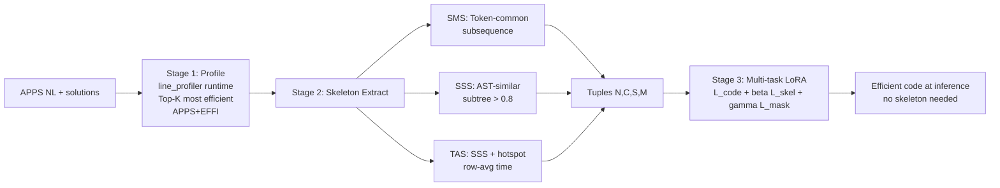
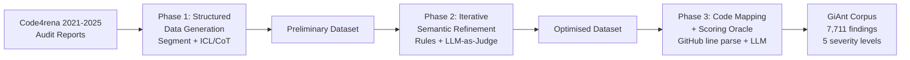

# Daily Scholar Papers Report — 2026-06-13

**[Download PDF](Daily_Papers_Report_2026-06-13.pdf)**

**Window covered:** 2026-06-12 → 2026-06-13 (Google Scholar alerts + user-curated self-emails, last 24 h)

---

## Executive Summary

A high-yield day. The Outstanding pick is **EffiSkel** (PACMPL FSE 2026, CC BY), a multi-task framework that explicitly supervises the *structural skeleton* of efficient code — three complementary extractors (token-level SMS, AST-level SSS, time-aware TAS) plus three jointly-trained losses; on Mercury with DeepSeek-Coder-6.7B it lifts Efficiency Ratio by **+11.11 % vs EffiCoder** and **+3.71 % vs CodeDPO** *while also raising Pass@1 to 73.05* (vs 70.70 / 69.92). Three Keeps complement it: **GiAnt** (arXiv preprint, ZJU + Xin Xia) — an LLM-driven Code4rena-report distiller producing 7,711 smart-contract vulnerability findings across five severity levels with manual quality score 4.76 ± 0.37 (kappa = 0.88); **CoCoPat** (TOSEM 2026, Bihuan Chen / Fudan, abstract-only) — extracts the critical change from a vulnerability patch, a foundational primitive for downstream SCA / matching / hotpatching; and **AFG** (SOAP'26 workshop, Texas A&M Corpus Christi, CC BY) — a vision/prototype for *cross-user* taint analysis in multi-tenant LLM-Powered Apps, with auto-discovered taint sources via function-signature mining (MUMP) plus a user-scoped pointer-based propagator (STPA). **kAPR** (Info & SW Tech, abstract-only) sits in Borderline-High as a kernel-targeted coverage-guided LLM-agent APR system.

**Outstanding:** 1 · **Keep:** 3 · **Borderline High-Priority:** 1

---

## Highlighted Papers

| # | Title | Authors | Venue | Link |
|---|---|---|---|---|
| 1.1 | Chiseling Out Efficiency: Structured Skeleton Supervision for Efficient Code Generation | Y. Yu, Z. Sun, J. Li, Y. Wan, C. Li, H. Zhang, R. Wang, T. Huang, Z. Jin, G. Li, C. Lyu | PACMPL FSE 2026 (Article FSE187) | [DOI](https://doi.org/10.1145/3808194) |
| 2.1 | On the Shoulders of Giants: Empowering Automated Smart Contract Auditing via the GiAnt Corpus | X. Zhang, Z. Gao, Y. Lv, X. Hu, F. Niu, X. Xia | arXiv 2606.07363 | [arXiv](https://arxiv.org/abs/2606.07363) |
| 2.2 | CoCoPat: Identifying Critical Changes in Vulnerability Patches | S. Wu, Y. Cao, X. Hu, Z. Zhou, Y. Wu, B. Chen, R. Wang, Y. Huang, K. Huang, X. Peng | ACM TOSEM 2026 (accepted) | [DOI](https://dl.acm.org/doi/10.1145/3817052) |
| 2.3 | Detecting Data Leaks in Multi-User LLM Apps via Automated User-Scoped Taint Analysis | S. K. Sen, B. Liu | SOAP '26 (PLDI workshop) | [PDF](https://bozhen-liu.github.io/assets/pdf/AFG_SOAP26-preprint.pdf) |
| 3.1 | kAPR: A coverage-guided, context-aware agent for automated repair of Linux kernel bugs | B. Li, X. Yin, Y. Zhang, S. Liu, S. Ji | Info & Software Technology 2026 | [DOI](https://www.sciencedirect.com/science/article/pii/S0950584926001874) |

---

## 1. Outstanding

<strong>1.1</strong> · EFFICIENT CODE GEN · PACMPL FSE 2026 — multi-task LM fine-tuning with explicit *efficiency-skeleton* supervision (SMS/SSS/TAS extractors + three losses); +11.11 % ER vs EffiCoder, +3.71 % vs CodeDPO on Mercury (DeepSeek-Coder-6.7B), with Pass@1 also rising to 73.05<a href="https://github.com/MarkLee131/paper-digest/issues/new?title=%5Bfeedback%5D+2026-06-13-1.1+PACMPL+FSE+2026+%E2%80%94+multi-task+LM+fine-tuning+with+explicit+%2Aefficiency-skeleton%2A+supervision+%28SMS%2FSSS%2FTAS+extractors+%2B+three+losses%29%3B+%2B11.11+%25+ER+vs+EffiCoder%2C+%2B3.71+%25+vs+CodeDPO+on+Mercury+%28DeepSeek-Coder-6.7B%29%2C+with+Pass%401+also+rising+to+73.05+%F0%9F%91%8D&body=paper_id%3A+2026-06-13-1.1%0Atitle%3A+PACMPL+FSE+2026+%E2%80%94+multi-task+LM+fine-tuning+with+explicit+%2Aefficiency-skeleton%2A+supervision+%28SMS%2FSSS%2FTAS+extractors+%2B+three+losses%29%3B+%2B11.11+%25+ER+vs+EffiCoder%2C+%2B3.71+%25+vs+CodeDPO+on+Mercury+%28DeepSeek-Coder-6.7B%29%2C+with+Pass%401+also+rising+to+73.05%0Aauthors%3A+Yu+Yu%2C+Zhihong+Sun%2C+Jia+Li%2C+Yao+Wan%2C+Chuanyi+Li%2C+Hongyu+Zhang%2C+Ruyun+Wang%2C+Tao+Huang%2C+Zhi+Jin%2C+Ge+Li%2C+Chen+Lyu+%28corresponding%29.%0Avenue%3A+%2AProc.+ACM+Softw.+Eng.%2A+Vol.+3%2C+FSE%2C+Article+FSE187+%28July+2026%29.+23+pages.+DOI+%5B10.1145%2F3808194%5D%28https%3A%2F%2Fdoi.org%2F10.1145%2F3808194%29.+arXiv+mirror%3A+%5B2606.06821%5D%28https%3A%2F%2Farxiv.org%2Fabs%2F2606.06821%29.%0Atopic%3A+EFFICIENT+CODE+GEN%0Arating%3A+thumbs-up%0A%0A%3C%21--+Optional+notes+below+this+line+are+read+by+preferences.py+as+soft+signals.+--%3E%0A&labels=feedback%2Cthumbs-up" target="_blank" rel="noopener" class="fb-thumbs-up" title="thumbs up" onclick="event.stopPropagation()">👍</a><a href="https://github.com/MarkLee131/paper-digest/issues/new?title=%5Bfeedback%5D+2026-06-13-1.1+PACMPL+FSE+2026+%E2%80%94+multi-task+LM+fine-tuning+with+explicit+%2Aefficiency-skeleton%2A+supervision+%28SMS%2FSSS%2FTAS+extractors+%2B+three+losses%29%3B+%2B11.11+%25+ER+vs+EffiCoder%2C+%2B3.71+%25+vs+CodeDPO+on+Mercury+%28DeepSeek-Coder-6.7B%29%2C+with+Pass%401+also+rising+to+73.05+%F0%9F%AB%A5&body=paper_id%3A+2026-06-13-1.1%0Atitle%3A+PACMPL+FSE+2026+%E2%80%94+multi-task+LM+fine-tuning+with+explicit+%2Aefficiency-skeleton%2A+supervision+%28SMS%2FSSS%2FTAS+extractors+%2B+three+losses%29%3B+%2B11.11+%25+ER+vs+EffiCoder%2C+%2B3.71+%25+vs+CodeDPO+on+Mercury+%28DeepSeek-Coder-6.7B%29%2C+with+Pass%401+also+rising+to+73.05%0Aauthors%3A+Yu+Yu%2C+Zhihong+Sun%2C+Jia+Li%2C+Yao+Wan%2C+Chuanyi+Li%2C+Hongyu+Zhang%2C+Ruyun+Wang%2C+Tao+Huang%2C+Zhi+Jin%2C+Ge+Li%2C+Chen+Lyu+%28corresponding%29.%0Avenue%3A+%2AProc.+ACM+Softw.+Eng.%2A+Vol.+3%2C+FSE%2C+Article+FSE187+%28July+2026%29.+23+pages.+DOI+%5B10.1145%2F3808194%5D%28https%3A%2F%2Fdoi.org%2F10.1145%2F3808194%29.+arXiv+mirror%3A+%5B2606.06821%5D%28https%3A%2F%2Farxiv.org%2Fabs%2F2606.06821%29.%0Atopic%3A+EFFICIENT+CODE+GEN%0Arating%3A+thumbs-down%0A%0A%3C%21--+Optional+notes+below+this+line+are+read+by+preferences.py+as+soft+signals.+--%3E%0A&labels=feedback%2Cthumbs-down" target="_blank" rel="noopener" class="fb-thumbs-down" title="less interested" onclick="event.stopPropagation()">🫥</a><a href="https://github.com/MarkLee131/paper-digest/issues/new?title=%5Bfeedback%5D+2026-06-13-1.1+PACMPL+FSE+2026+%E2%80%94+multi-task+LM+fine-tuning+with+explicit+%2Aefficiency-skeleton%2A+supervision+%28SMS%2FSSS%2FTAS+extractors+%2B+three+losses%29%3B+%2B11.11+%25+ER+vs+EffiCoder%2C+%2B3.71+%25+vs+CodeDPO+on+Mercury+%28DeepSeek-Coder-6.7B%29%2C+with+Pass%401+also+rising+to+73.05+%F0%9F%94%96&body=paper_id%3A+2026-06-13-1.1%0Atitle%3A+PACMPL+FSE+2026+%E2%80%94+multi-task+LM+fine-tuning+with+explicit+%2Aefficiency-skeleton%2A+supervision+%28SMS%2FSSS%2FTAS+extractors+%2B+three+losses%29%3B+%2B11.11+%25+ER+vs+EffiCoder%2C+%2B3.71+%25+vs+CodeDPO+on+Mercury+%28DeepSeek-Coder-6.7B%29%2C+with+Pass%401+also+rising+to+73.05%0Aauthors%3A+Yu+Yu%2C+Zhihong+Sun%2C+Jia+Li%2C+Yao+Wan%2C+Chuanyi+Li%2C+Hongyu+Zhang%2C+Ruyun+Wang%2C+Tao+Huang%2C+Zhi+Jin%2C+Ge+Li%2C+Chen+Lyu+%28corresponding%29.%0Avenue%3A+%2AProc.+ACM+Softw.+Eng.%2A+Vol.+3%2C+FSE%2C+Article+FSE187+%28July+2026%29.+23+pages.+DOI+%5B10.1145%2F3808194%5D%28https%3A%2F%2Fdoi.org%2F10.1145%2F3808194%29.+arXiv+mirror%3A+%5B2606.06821%5D%28https%3A%2F%2Farxiv.org%2Fabs%2F2606.06821%29.%0Atopic%3A+EFFICIENT+CODE+GEN%0Arating%3A+save-for-later%0A%0A%3C%21--+Optional+notes+below+this+line+are+read+by+preferences.py+as+soft+signals.+--%3E%0A&labels=feedback%2Csave-for-later" target="_blank" rel="noopener" class="fb-save-for-later" title="save for later" onclick="event.stopPropagation()">🔖</a>

### 1.1 [Chiseling Out Efficiency: Structured Skeleton Supervision for Efficient Code Generation](https://doi.org/10.1145/3808194) — Yu, Sun, Li, Wan, Li, Zhang, Wang, Huang, Jin, Li, Lyu (Shandong Normal / Nanjing / Tsinghua / HUST / Chongqing / IIE-CAS / Peking), PACMPL FSE 2026

**Authors:** Yu Yu, Zhihong Sun, Jia Li, Yao Wan, Chuanyi Li, Hongyu Zhang, Ruyun Wang, Tao Huang, Zhi Jin, Ge Li, Chen Lyu (corresponding).
**Venue:** *Proc. ACM Softw. Eng.* Vol. 3, FSE, Article FSE187 (July 2026). 23 pages. DOI [10.1145/3808194](https://doi.org/10.1145/3808194). arXiv mirror: [2606.06821](https://arxiv.org/abs/2606.06821).
**License:** CC BY 4.0 — figure embedding allowed.
**Artefact:** [github.com/YYYY-YuYu/EffiSkel](https://github.com/YYYY-YuYu/EffiSkel).

**Problem.** LLM-generated code is correct but slow: GPT-4-generated programs are on average 1.69× slower than human-optimised code, and the degradation reaches 45.49× in extreme cases. Two existing fix families have structural limits:

- *Iterative optimisation* (Effi-Learner, LLM4EFFI, Afterburner) — re-prompt the model after a profile; adds inference-time compute, often converges to local optima around the initial draft.
- *Fine-tuning on efficient code* (EffiCoder, CodeDPO) — supervise on raw efficient programs or DPO over efficient/inefficient pairs; exposes the model only to complete optimised solutions, never names *why* a transformation accelerated the program.

Two challenges:

- **C1 — Representing and extracting efficiency skeletons.** Efficiency-critical structures (algorithmic-selection patterns, control-flow shapes, memory-management idioms) are implicit in the surface tokens; extracting an abstract-yet-expressive skeleton without losing performance-critical semantics is non-obvious.
- **C2 — Learning skeletons without destabilising the LM.** End-to-end training entangles structural signals with semantics; naive multi-objective optimisation degrades generation quality.

**Approach — EffiSkel.**

*Dataset profiling.* For each NL description in APPS, execute candidate solutions, rank by execution time, retain top-5 most-efficient; drop problems lacking unit tests or with no passing solution. Result: **APPS+EFFI** — 3,742 problems and 18,710 efficient solutions distilled from the 5,000 / 117,232 APPS training set.

*Three skeleton-extraction strategies* (Algorithm 1):

- **SMS (String-based Matching Skeleton).** Tokenise each $C_i$ to $T_i$; compute the token common subsequence $L^*$ across all sequences; project back to a reference $T_{\text{ref}}$ to build a binary mask $M_{\text{SMS}}$ over shared lexical patterns.
- **SSS (Similar Subtree Skeleton).** Parse each $C_i$ into a normalised AST $\widetilde T_i$; extract `similar_subtree(...)` across all $\widetilde T_i$ using a relaxed match on node types and hierarchical levels with similarity > 0.8; map shared subtrees back to $T_{\text{ref}}$. Captures structural alignment (e.g. `for-in-zip` loops) even when variable names differ.
- **TAS (Time-Aware Skeleton).** Extends SSS with `line_profiler` runtime profiling; for every structure $s$ outside the SSS-shared core whose mean execution time $\bar\tau(s)$ exceeds the row-average threshold $\delta$, add to a hotspot set $S^{\text{extra}}_{\text{hot}}$. Final skeleton $S^+ = S^* \cup S^{\text{extra}}_{\text{hot}}$.

*Multi-task training objective* (paper Eqs. 1–4):

$$\mathcal{L}_{\text{code}} = -\sum_{i=1}^{n} \log P(C_i \mid N, C_{<i})$$
$$\mathcal{L}_{\text{skeleton}} = -\sum_{i=1}^{n} \log P(S_i \mid N, S_{<i})$$
$$\mathcal{L}_{\text{mask}} = -\sum_{i=1}^{n} M_i \log P(C_i \mid N, C_{<i})$$
$$\mathcal{L}_{\text{total}} = \alpha\,\mathcal{L}_{\text{code}} + \beta\,\mathcal{L}_{\text{skeleton}} + \gamma\,\mathcal{L}_{\text{mask}}$$

The primary task ($\mathcal{L}_{\text{code}}$) preserves correctness; $\mathcal{L}_{\text{skeleton}}$ injects the structural inductive bias by asking the model to generate the skeleton sequence from the same NL input; $\mathcal{L}_{\text{mask}}$ over-weights tokens that fall inside performance-critical regions.

*Mermaid recreation of EffiSkel Figure 3 pipeline.*

*Training.* LoRA fine-tuning, 5 epochs, learning rate 2e-5, batch size 64, max sequence length 1,600. 4× RTX 5880-48GB cluster. Inference temperature 0.8, top-p 0.95. Baseline CodeDPO* runs two-stage preference training (correctness pairs, then efficiency pairs).

**Headline numbers (paper Tables 1, 3).**

*Feasibility on CodeT5 (Table 1, pairwise ER, 1k APPS test problems):* EffiSkel beats VanCode 67.05 %, beats EffiCoder 54.09 %; Pass@10 2.67 (vs VanCode 2.29 / EffiCoder 2.24). Skeleton-supervised training is both more correct and more efficient than fine-tuning on either raw or efficiency-curated code.

*RQ1 — Mercury + ENAMEL (Table 3, five base LMs, Pass@1 / ER% / AS):*

| Base LM | Method | Mercury Pass@1 / ER / AS | ENAMEL Pass@1 / ER / AS |
|---|---|---|---|
| Qwen2.5-Coder-1.5B | Instruct | 26.17 / 50.00 / 1.00 | 21.13 / 50.00 / 1.00 |
| | EffiCoder* | 39.45 / 54.17 / 1.04 | 30.98 / 55.56 / 1.13 |
| | CodeDPO* | 41.02 / 54.17 / 1.13 | 38.73 / 55.56 / 1.22 |
| | **EffiSkel** | **41.41 / 62.50 / 1.14** | **38.73 / 61.11 / 1.28** |
| StarCoder2-3B | EffiCoder* | 43.75 / 52.94 / 1.04 | 13.38 / 55.56 / 1.04 |
| | CodeDPO* | 43.75 / 58.82 / 1.12 | 17.61 / 55.56 / 1.05 |
| | **EffiSkel** | **47.27 / 58.82 / 1.20** | **20.42 / 66.67 / 1.09** |
| DeepSeek-Coder-6.7B | EffiCoder* | 70.70 / 55.56 / 1.11 | 39.44 / 52.00 / 1.03 |
| | CodeDPO* | 69.92 / 62.96 / 1.25 | 43.66 / 56.00 / 1.11 |
| | **EffiSkel** | **73.05 / 66.67 / 1.47** | **45.77 / 64.00 / 1.18** |
| CodeLlama-7B-Python | EffiCoder* | 48.05 / 52.17 / 1.07 | 24.65 / 56.25 / 1.06 |
| | CodeDPO* | 47.27 / 56.52 / 1.14 | 26.06 / 50.00 / 1.03 |
| | **EffiSkel** | **48.44 / 65.22 / 1.30** | **29.58 / 68.75 / 1.24** |
| Qwen2.5-Coder-7B | EffiCoder* | 58.59 / 51.61 / 1.02 | 41.55 / 54.55 / 1.01 |
| | CodeDPO* | 58.98 / 54.83 / 1.09 | 47.18 / 59.09 / 1.12 |
| | **EffiSkel** | **64.06 / 58.06 / 1.16** | **50.71 / 63.64 / 1.27** |

*Headline:* on Mercury with DeepSeek-Coder 6.7B, EffiSkel scores **+11.11 % ER vs EffiCoder, +3.71 % ER vs CodeDPO, and +0.36 / +0.22 AS** — and the Pass@1 *also* improves to 73.05 (from 70.70 / 69.92). Efficiency improves *without* a correctness regression.

**Closing-line verbatim.** "These results highlight the effectiveness of explicitly modeling efficiency skeletons in improving the runtime performance of code generated by LLMs."

**Why this matters.** Cleanly factored hypothesis — efficient-code fine-tuning teaches *what* looks fast but not *why*, and explicit skeleton supervision fixes that. Multi-model breadth (five base LMs from 1.5B → 7B, two benchmarks for the main RQ, plus transfer for RQ2 and ablations for RQ3/4) controls for tokenizer idiosyncrasies. Across nearly every (model × benchmark) cell, EffiSkel beats both EffiCoder* and CodeDPO* in both Pass@1 and ER/AS — efficiency gain without giving back correctness, the rare combination prior work over-claimed. SMS / SSS / TAS recipe and the APPS+EFFI distillation are reusable in any code-LM fine-tuning pipeline. Public GitHub artefact under CC BY 4.0.

**Caveats.**

- Skeleton extraction relies on AST normalisation + `line_profiler`; porting to languages without comparable tooling (low-level systems) is non-trivial.
- LoRA-only fine-tuning — full fine-tuning behaviour is uncharacterised.
- Mercury / ENAMEL / APPS / EffiBench are competition-style algorithmic benchmarks; industrial-codebase efficiency (allocator behaviour, I/O, JIT) is not measured.
- ER is pairwise and normalised against "the fastest solution from different models" — comparator-coupled; AS partially compensates but inherits the same coupling.
- Whether the loss-mixture coefficients $(\alpha,\beta,\gamma)$ transfer to 30B+ models is unknown.

---

## 2. Keep

<strong>2.1</strong> · SMART CONTRACT AUDIT · arXiv 2026 — LLM pipeline (divide-and-conquer + CoT + LLM-as-judge) distils 7,711 vulnerability findings from 388 Code4rena audit reports across five severity levels; manual quality 4.76 ± 0.37 / 5, κ = 0.88<a href="https://github.com/MarkLee131/paper-digest/issues/new?title=%5Bfeedback%5D+2026-06-13-2.1+arXiv+2026+%E2%80%94+LLM+pipeline+%28divide-and-conquer+%2B+CoT+%2B+LLM-as-judge%29+distils+7%2C711+vulnerability+findings+from+388+Code4rena+audit+reports+across+five+severity+levels%3B+manual+quality+4.76+%C2%B1+0.37+%2F+5%2C+%CE%BA+%3D+0.88+%F0%9F%91%8D&body=paper_id%3A+2026-06-13-2.1%0Atitle%3A+arXiv+2026+%E2%80%94+LLM+pipeline+%28divide-and-conquer+%2B+CoT+%2B+LLM-as-judge%29+distils+7%2C711+vulnerability+findings+from+388+Code4rena+audit+reports+across+five+severity+levels%3B+manual+quality+4.76+%C2%B1+0.37+%2F+5%2C+%CE%BA+%3D+0.88%0Aauthors%3A+Xiaoting+Zhang%2C+Zhipeng+Gao+%28co-corresponding%29%2C+Yiran+Lv%2C+Xing+Hu+%28Zhejiang+U.%29%2C+Feifei+Niu+%28U.+Ottawa%29%2C+Xin+Xia+%28ZJU%2C+co-corresponding%29.%0Avenue%3A+%5BarXiv%3A2606.07363v1%5D%28https%3A%2F%2Farxiv.org%2Fabs%2F2606.07363%29+%5Bcs.CR%5D%2C+5+Jun+2026.%0Atopic%3A+SMART+CONTRACT+AUDIT%0Arating%3A+thumbs-up%0A%0A%3C%21--+Optional+notes+below+this+line+are+read+by+preferences.py+as+soft+signals.+--%3E%0A&labels=feedback%2Cthumbs-up" target="_blank" rel="noopener" class="fb-thumbs-up" title="thumbs up" onclick="event.stopPropagation()">👍</a><a href="https://github.com/MarkLee131/paper-digest/issues/new?title=%5Bfeedback%5D+2026-06-13-2.1+arXiv+2026+%E2%80%94+LLM+pipeline+%28divide-and-conquer+%2B+CoT+%2B+LLM-as-judge%29+distils+7%2C711+vulnerability+findings+from+388+Code4rena+audit+reports+across+five+severity+levels%3B+manual+quality+4.76+%C2%B1+0.37+%2F+5%2C+%CE%BA+%3D+0.88+%F0%9F%AB%A5&body=paper_id%3A+2026-06-13-2.1%0Atitle%3A+arXiv+2026+%E2%80%94+LLM+pipeline+%28divide-and-conquer+%2B+CoT+%2B+LLM-as-judge%29+distils+7%2C711+vulnerability+findings+from+388+Code4rena+audit+reports+across+five+severity+levels%3B+manual+quality+4.76+%C2%B1+0.37+%2F+5%2C+%CE%BA+%3D+0.88%0Aauthors%3A+Xiaoting+Zhang%2C+Zhipeng+Gao+%28co-corresponding%29%2C+Yiran+Lv%2C+Xing+Hu+%28Zhejiang+U.%29%2C+Feifei+Niu+%28U.+Ottawa%29%2C+Xin+Xia+%28ZJU%2C+co-corresponding%29.%0Avenue%3A+%5BarXiv%3A2606.07363v1%5D%28https%3A%2F%2Farxiv.org%2Fabs%2F2606.07363%29+%5Bcs.CR%5D%2C+5+Jun+2026.%0Atopic%3A+SMART+CONTRACT+AUDIT%0Arating%3A+thumbs-down%0A%0A%3C%21--+Optional+notes+below+this+line+are+read+by+preferences.py+as+soft+signals.+--%3E%0A&labels=feedback%2Cthumbs-down" target="_blank" rel="noopener" class="fb-thumbs-down" title="less interested" onclick="event.stopPropagation()">🫥</a><a href="https://github.com/MarkLee131/paper-digest/issues/new?title=%5Bfeedback%5D+2026-06-13-2.1+arXiv+2026+%E2%80%94+LLM+pipeline+%28divide-and-conquer+%2B+CoT+%2B+LLM-as-judge%29+distils+7%2C711+vulnerability+findings+from+388+Code4rena+audit+reports+across+five+severity+levels%3B+manual+quality+4.76+%C2%B1+0.37+%2F+5%2C+%CE%BA+%3D+0.88+%F0%9F%94%96&body=paper_id%3A+2026-06-13-2.1%0Atitle%3A+arXiv+2026+%E2%80%94+LLM+pipeline+%28divide-and-conquer+%2B+CoT+%2B+LLM-as-judge%29+distils+7%2C711+vulnerability+findings+from+388+Code4rena+audit+reports+across+five+severity+levels%3B+manual+quality+4.76+%C2%B1+0.37+%2F+5%2C+%CE%BA+%3D+0.88%0Aauthors%3A+Xiaoting+Zhang%2C+Zhipeng+Gao+%28co-corresponding%29%2C+Yiran+Lv%2C+Xing+Hu+%28Zhejiang+U.%29%2C+Feifei+Niu+%28U.+Ottawa%29%2C+Xin+Xia+%28ZJU%2C+co-corresponding%29.%0Avenue%3A+%5BarXiv%3A2606.07363v1%5D%28https%3A%2F%2Farxiv.org%2Fabs%2F2606.07363%29+%5Bcs.CR%5D%2C+5+Jun+2026.%0Atopic%3A+SMART+CONTRACT+AUDIT%0Arating%3A+save-for-later%0A%0A%3C%21--+Optional+notes+below+this+line+are+read+by+preferences.py+as+soft+signals.+--%3E%0A&labels=feedback%2Csave-for-later" target="_blank" rel="noopener" class="fb-save-for-later" title="save for later" onclick="event.stopPropagation()">🔖</a>

### 2.1 [On the Shoulders of Giants: Empowering Automated Smart Contract Auditing via the GiAnt Corpus](https://arxiv.org/abs/2606.07363) — Zhang, Gao, Lv, Hu, Niu, Xia (ZJU / Hangzhou Binjiang Blockchain Institute / U. Ottawa), arXiv 2026

**Authors:** Xiaoting Zhang, Zhipeng Gao (co-corresponding), Yiran Lv, Xing Hu (Zhejiang U.), Feifei Niu (U. Ottawa), Xin Xia (ZJU, co-corresponding).
**Venue:** [arXiv:2606.07363v1](https://arxiv.org/abs/2606.07363) [cs.CR], 5 Jun 2026.
**License:** arXiv default non-exclusive — no figure embedding.

**Problem.** Existing smart-contract auditing datasets have two structural defects: (1) *scalability bottleneck* — DAppScan required 22 participants × 44 person-months to cover 1,199 audit reports; (2) *limited granularity / diversity* — SmartBugs-CURATED, ScrawlD focus on tool-detectable bugs (reentrancy, overflow) labelled heuristically, missing the business-logic flaws that now dominate real losses (Access Control, Business Logic Flaws, Price Oracle Manipulation, Flash Loan Attacks). The decentralised ecosystem saw $3.67 B lost in 2025 across 135 documented major incidents; $1.42 B in 2024 across 149 incidents — a shift from syntax-error exploits toward complex business-logic exploitation.

**Approach — GiAnt.** Three-phase LLM-driven pipeline.

1. **Structured Data Generation.** Crawl Code4rena reports 2021–2025 (Markdown + PDF formats). Segment by inherent hierarchical structure. Use In-Context Learning + Chain-of-Thought prompting to extract per-vulnerability multi-dimensional records: description, impact assessment, severity, mitigation strategy.
2. **Iterative Semantic Refinement.** Rule-based logical consistency validator + source-tracing knowledge recovery, then **LLM-as-a-Judge** across correctness / completeness / consistency; iterate until threshold.
3. **Code Mapping & Scoring Oracle.** Dual-path mapping — precise GitHub `#L` parsing where available, LLM inference for context analysis where not. Align extracted code regions to source.

*Mermaid recreation of GiAnt Figure 1 workflow.*

**Headline numbers.**

- 388 real-world Code4rena reports → **7,711 vulnerability findings** across 5 severity levels (High Risk / Medium Risk / Low Risk / Non-Critical / Gas Optimisation).
- Manual quality assessment: mean **4.76 ± 0.37 / 5**; inter-rater agreement **κ = 0.88**.
- Benchmark baselines on 4 SOTA LLMs across 4 tasks: vulnerability detection, code summarisation, mitigation recommendation, gas optimisation.

**Why Keep.** The framework's novelty is in the pipeline engineering — Code4rena's hierarchical structure unlocked by a divide-and-conquer parser, combined with LLM-as-judge QA — rather than in the auditing technique itself. The dataset is genuinely useful (Code4rena's competitive bounty model produces unusually rich PoCs and verified sponsor mitigations), and the κ = 0.88 inter-rater number is strong. The benchmarking pass establishes baselines rather than proving a new method, which is the right framing for a data-infrastructure contribution.

**Caveats.** Pipeline is entirely Code4rena-bound; portability to Sherlock / Cantina / Spearbit unclear. LLM-as-judge introduces a self-referential risk (same model class extracts and judges). Manual-sample size used to compute κ = 0.88 is not stated in the section read.

<strong>2.2</strong> · VULN PATCH ANALYSIS · TOSEM 2026 — abstract-only: identifies the critical change inside a vulnerability patch so that downstream tasks (matching, SCA, hotpatching, patch-presence testing) get the security-relevant substructure rather than the full commit<a href="https://github.com/MarkLee131/paper-digest/issues/new?title=%5Bfeedback%5D+2026-06-13-2.2+TOSEM+2026+%E2%80%94+abstract-only%3A+identifies+the+critical+change+inside+a+vulnerability+patch+so+that+downstream+tasks+%28matching%2C+SCA%2C+hotpatching%2C+patch-presence+testing%29+get+the+security-relevant+substructure+rather+than+the+full+commit+%F0%9F%91%8D&body=paper_id%3A+2026-06-13-2.2%0Atitle%3A+TOSEM+2026+%E2%80%94+abstract-only%3A+identifies+the+critical+change+inside+a+vulnerability+patch+so+that+downstream+tasks+%28matching%2C+SCA%2C+hotpatching%2C+patch-presence+testing%29+get+the+security-relevant+substructure+rather+than+the+full+commit%0Aauthors%3A+Susheng+Wu%2C+Yiheng+Cao%2C+Xin+Hu%2C+Zhuotong+Zhou%2C+Yijian+Wu%2C+Bihuan+Chen%2C+Ruisi+Wang%2C+Yiheng+Huang%2C+Kaifeng+Huang%2C+Xin+Peng+%28Fudan+University%29.%0Avenue%3A+ACM+Transactions+on+Software+Engineering+and+Methodology%2C+2026+%28accepted%29.+DOI%3A+%5B10.1145%2F3817052%5D%28https%3A%2F%2Fdl.acm.org%2Fdoi%2F10.1145%2F3817052%29.%0Atopic%3A+VULN+PATCH+ANALYSIS%0Arating%3A+thumbs-up%0A%0A%3C%21--+Optional+notes+below+this+line+are+read+by+preferences.py+as+soft+signals.+--%3E%0A&labels=feedback%2Cthumbs-up" target="_blank" rel="noopener" class="fb-thumbs-up" title="thumbs up" onclick="event.stopPropagation()">👍</a><a href="https://github.com/MarkLee131/paper-digest/issues/new?title=%5Bfeedback%5D+2026-06-13-2.2+TOSEM+2026+%E2%80%94+abstract-only%3A+identifies+the+critical+change+inside+a+vulnerability+patch+so+that+downstream+tasks+%28matching%2C+SCA%2C+hotpatching%2C+patch-presence+testing%29+get+the+security-relevant+substructure+rather+than+the+full+commit+%F0%9F%AB%A5&body=paper_id%3A+2026-06-13-2.2%0Atitle%3A+TOSEM+2026+%E2%80%94+abstract-only%3A+identifies+the+critical+change+inside+a+vulnerability+patch+so+that+downstream+tasks+%28matching%2C+SCA%2C+hotpatching%2C+patch-presence+testing%29+get+the+security-relevant+substructure+rather+than+the+full+commit%0Aauthors%3A+Susheng+Wu%2C+Yiheng+Cao%2C+Xin+Hu%2C+Zhuotong+Zhou%2C+Yijian+Wu%2C+Bihuan+Chen%2C+Ruisi+Wang%2C+Yiheng+Huang%2C+Kaifeng+Huang%2C+Xin+Peng+%28Fudan+University%29.%0Avenue%3A+ACM+Transactions+on+Software+Engineering+and+Methodology%2C+2026+%28accepted%29.+DOI%3A+%5B10.1145%2F3817052%5D%28https%3A%2F%2Fdl.acm.org%2Fdoi%2F10.1145%2F3817052%29.%0Atopic%3A+VULN+PATCH+ANALYSIS%0Arating%3A+thumbs-down%0A%0A%3C%21--+Optional+notes+below+this+line+are+read+by+preferences.py+as+soft+signals.+--%3E%0A&labels=feedback%2Cthumbs-down" target="_blank" rel="noopener" class="fb-thumbs-down" title="less interested" onclick="event.stopPropagation()">🫥</a><a href="https://github.com/MarkLee131/paper-digest/issues/new?title=%5Bfeedback%5D+2026-06-13-2.2+TOSEM+2026+%E2%80%94+abstract-only%3A+identifies+the+critical+change+inside+a+vulnerability+patch+so+that+downstream+tasks+%28matching%2C+SCA%2C+hotpatching%2C+patch-presence+testing%29+get+the+security-relevant+substructure+rather+than+the+full+commit+%F0%9F%94%96&body=paper_id%3A+2026-06-13-2.2%0Atitle%3A+TOSEM+2026+%E2%80%94+abstract-only%3A+identifies+the+critical+change+inside+a+vulnerability+patch+so+that+downstream+tasks+%28matching%2C+SCA%2C+hotpatching%2C+patch-presence+testing%29+get+the+security-relevant+substructure+rather+than+the+full+commit%0Aauthors%3A+Susheng+Wu%2C+Yiheng+Cao%2C+Xin+Hu%2C+Zhuotong+Zhou%2C+Yijian+Wu%2C+Bihuan+Chen%2C+Ruisi+Wang%2C+Yiheng+Huang%2C+Kaifeng+Huang%2C+Xin+Peng+%28Fudan+University%29.%0Avenue%3A+ACM+Transactions+on+Software+Engineering+and+Methodology%2C+2026+%28accepted%29.+DOI%3A+%5B10.1145%2F3817052%5D%28https%3A%2F%2Fdl.acm.org%2Fdoi%2F10.1145%2F3817052%29.%0Atopic%3A+VULN+PATCH+ANALYSIS%0Arating%3A+save-for-later%0A%0A%3C%21--+Optional+notes+below+this+line+are+read+by+preferences.py+as+soft+signals.+--%3E%0A&labels=feedback%2Csave-for-later" target="_blank" rel="noopener" class="fb-save-for-later" title="save for later" onclick="event.stopPropagation()">🔖</a>

### 2.2 [CoCoPat: Identifying Critical Changes in Vulnerability Patches](https://dl.acm.org/doi/10.1145/3817052) — Wu, Cao, Hu, Zhou, Wu, Chen, Wang, Huang, Huang, Peng (Fudan), ACM TOSEM 2026

**Authors:** Susheng Wu, Yiheng Cao, Xin Hu, Zhuotong Zhou, Yijian Wu, Bihuan Chen, Ruisi Wang, Yiheng Huang, Kaifeng Huang, Xin Peng (Fudan University).
**Venue:** ACM Transactions on Software Engineering and Methodology, 2026 (accepted). DOI: [10.1145/3817052](https://dl.acm.org/doi/10.1145/3817052).
**License:** ACM (paywalled) — no figure embedding; abstract-only read.

**Problem (from snippet).** Open-source software vulnerabilities are increasingly handled via *patches*, which are consumed downstream for security tasks (matching, transferability analysis, hotpatching, SCA, patch-presence testing). But patches typically bundle the security-critical fix with cosmetic refactors, comment changes, dependency tweaks, and test additions — and downstream tasks need just the *critical* change. Reliably extracting that signal is the missing primitive.

**Likely approach (inferred from group trajectory).** "Identifying critical changes" is the natural follow-on to the same group's ISSTA'24 *C2D2: Extracting Critical Changes for Real-World Bugs with Dependency-Sensitive Delta Debugging*. The C2D2 thesis was that dependency-sensitive delta debugging can isolate the minimal change that causes or fixes a bug; CoCoPat likely extends that line to security patches with the constraint set tightened around vulnerability-class semantics. (Inferred from the group's trajectory, not from the paper text read.)

**Why Keep.** Patch-criticality extraction is a foundational primitive — if CoCoPat works at TOSEM-acceptance quality, it slots into a wide range of downstream pipelines: CVE-to-fix matching, fix backporting, SBoM consumption, patch-presence-testing oracles. Worth tracking and a re-read once the PDF is fetchable.

**Caveats.** Abstract-only; methodology, evaluation set, and headline numbers are unknown to this digest.

<strong>2.3</strong> · MULTI-USER LPA TAINT · SOAP '26 — auto-discover taint sources by mining function-signature patterns from open-source LPAs (MUMP), then propagate user-tagged objects through a Pointer Assignment Graph (STPA) to flag cross-user data-scope overlap<a href="https://github.com/MarkLee131/paper-digest/issues/new?title=%5Bfeedback%5D+2026-06-13-2.3+SOAP+%2726+%E2%80%94+auto-discover+taint+sources+by+mining+function-signature+patterns+from+open-source+LPAs+%28MUMP%29%2C+then+propagate+user-tagged+objects+through+a+Pointer+Assignment+Graph+%28STPA%29+to+flag+cross-user+data-scope+overlap+%F0%9F%91%8D&body=paper_id%3A+2026-06-13-2.3%0Atitle%3A+SOAP+%2726+%E2%80%94+auto-discover+taint+sources+by+mining+function-signature+patterns+from+open-source+LPAs+%28MUMP%29%2C+then+propagate+user-tagged+objects+through+a+Pointer+Assignment+Graph+%28STPA%29+to+flag+cross-user+data-scope+overlap%0Aauthors%3A+Sanjib+Kumar+Sen%2C+Bozhen+Liu.%0Avenue%3A+Proceedings+of+the+15th+ACM+SIGPLAN+International+Workshop+on+the+State+Of+the+Art+in+Program+Analysis+%28SOAP+%2726%29%2C+15%E2%80%9319+June+2026%2C+Boulder%2C+CO.+DOI%3A+%5B10.1145%2F3814987.3814995%5D%28https%3A%2F%2Fdoi.org%2F10.1145%2F3814987.3814995%29.+7+pages.%0Atopic%3A+MULTI-USER+LPA+TAINT%0Arating%3A+thumbs-up%0A%0A%3C%21--+Optional+notes+below+this+line+are+read+by+preferences.py+as+soft+signals.+--%3E%0A&labels=feedback%2Cthumbs-up" target="_blank" rel="noopener" class="fb-thumbs-up" title="thumbs up" onclick="event.stopPropagation()">👍</a><a href="https://github.com/MarkLee131/paper-digest/issues/new?title=%5Bfeedback%5D+2026-06-13-2.3+SOAP+%2726+%E2%80%94+auto-discover+taint+sources+by+mining+function-signature+patterns+from+open-source+LPAs+%28MUMP%29%2C+then+propagate+user-tagged+objects+through+a+Pointer+Assignment+Graph+%28STPA%29+to+flag+cross-user+data-scope+overlap+%F0%9F%AB%A5&body=paper_id%3A+2026-06-13-2.3%0Atitle%3A+SOAP+%2726+%E2%80%94+auto-discover+taint+sources+by+mining+function-signature+patterns+from+open-source+LPAs+%28MUMP%29%2C+then+propagate+user-tagged+objects+through+a+Pointer+Assignment+Graph+%28STPA%29+to+flag+cross-user+data-scope+overlap%0Aauthors%3A+Sanjib+Kumar+Sen%2C+Bozhen+Liu.%0Avenue%3A+Proceedings+of+the+15th+ACM+SIGPLAN+International+Workshop+on+the+State+Of+the+Art+in+Program+Analysis+%28SOAP+%2726%29%2C+15%E2%80%9319+June+2026%2C+Boulder%2C+CO.+DOI%3A+%5B10.1145%2F3814987.3814995%5D%28https%3A%2F%2Fdoi.org%2F10.1145%2F3814987.3814995%29.+7+pages.%0Atopic%3A+MULTI-USER+LPA+TAINT%0Arating%3A+thumbs-down%0A%0A%3C%21--+Optional+notes+below+this+line+are+read+by+preferences.py+as+soft+signals.+--%3E%0A&labels=feedback%2Cthumbs-down" target="_blank" rel="noopener" class="fb-thumbs-down" title="less interested" onclick="event.stopPropagation()">🫥</a><a href="https://github.com/MarkLee131/paper-digest/issues/new?title=%5Bfeedback%5D+2026-06-13-2.3+SOAP+%2726+%E2%80%94+auto-discover+taint+sources+by+mining+function-signature+patterns+from+open-source+LPAs+%28MUMP%29%2C+then+propagate+user-tagged+objects+through+a+Pointer+Assignment+Graph+%28STPA%29+to+flag+cross-user+data-scope+overlap+%F0%9F%94%96&body=paper_id%3A+2026-06-13-2.3%0Atitle%3A+SOAP+%2726+%E2%80%94+auto-discover+taint+sources+by+mining+function-signature+patterns+from+open-source+LPAs+%28MUMP%29%2C+then+propagate+user-tagged+objects+through+a+Pointer+Assignment+Graph+%28STPA%29+to+flag+cross-user+data-scope+overlap%0Aauthors%3A+Sanjib+Kumar+Sen%2C+Bozhen+Liu.%0Avenue%3A+Proceedings+of+the+15th+ACM+SIGPLAN+International+Workshop+on+the+State+Of+the+Art+in+Program+Analysis+%28SOAP+%2726%29%2C+15%E2%80%9319+June+2026%2C+Boulder%2C+CO.+DOI%3A+%5B10.1145%2F3814987.3814995%5D%28https%3A%2F%2Fdoi.org%2F10.1145%2F3814987.3814995%29.+7+pages.%0Atopic%3A+MULTI-USER+LPA+TAINT%0Arating%3A+save-for-later%0A%0A%3C%21--+Optional+notes+below+this+line+are+read+by+preferences.py+as+soft+signals.+--%3E%0A&labels=feedback%2Csave-for-later" target="_blank" rel="noopener" class="fb-save-for-later" title="save for later" onclick="event.stopPropagation()">🔖</a>

### 2.3 [Detecting Data Leaks in Multi-User LLM Apps via Automated User-Scoped Taint Analysis](https://bozhen-liu.github.io/assets/pdf/AFG_SOAP26-preprint.pdf) — Sen, Liu (Texas A&M Corpus Christi), SOAP '26

**Authors:** Sanjib Kumar Sen, Bozhen Liu.
**Venue:** Proceedings of the 15th ACM SIGPLAN International Workshop on the State Of the Art in Program Analysis (SOAP '26), 15–19 June 2026, Boulder, CO. DOI: [10.1145/3814987.3814995](https://doi.org/10.1145/3814987.3814995). 7 pages.
**License:** CC BY 4.0 — figure embedding allowed.

**Problem.** LLM-Powered Apps (LPAs) — apps built around external LLM APIs (Gemini, GPT, LLaMA) — are increasingly deployed on shared cloud servers where multiple users hit the same process. The single-user assumption of consumer LLM apps no longer holds: shared RAG indexes, cached results, misconfigured access-control policies, and concurrency bugs in event-driven / multi-threaded handlers can leak one user's private data into another user's session. Existing taint analysers don't fit: they (1) need manual source / sink marking, (2) only track control + data flow, (3) ignore access-control policies and runtime environments. Dynamic taint analysis runs at 30–50× slowdown; even libdft (state of the art) imposes up to 6× slowdown.

**Approach — AFG (Access Flow Guard).** Two components.

- **MUMP (Multi-User, Multi-Permission setup).** Mines a dataset of popular open-source LPAs for *function-signature patterns* corresponding to user-input entry points. At analysis time, MUMP matches signatures in the target app and automatically tags each input with the user's identity and permission level — eliminating manual source/sink annotation.
- **STPA (Scoped Taint Pointer Analysis).** Extends pointer-based taint analysis. Propagates user-tagged objects through a Pointer Assignment Graph; flags edges where different users' data scopes overlap, i.e. potential cross-user data leak sites. The base pointer-analysis complexity floor it inherits is $O(E \times D^3)$ (Andersen-style); the contribution is the *user-scope* dimension layered on top.

**Why Keep.** Two reasons:

1. *Topic novelty.* Cross-user taint framed as a first-class concern for LLM-app deployments is genuinely under-explored — prior LPA security work focuses on prompt injection, jailbreak, or single-user data exposure. Multi-tenant LPA taint as its own analysis problem is a clean new framing.
2. *Pattern-mining source/sink discovery.* Mine open-source LPAs for function-signature patterns → use as automatic source/sink seeds. Transferable idea: the same recipe could apply to other multi-tenant frameworks (Web SaaS, MCP servers, agent runtimes) where source/sink marking has always been the friction point.

**Caveats.** Workshop paper, 7 pages — vision / position + early prototype, not a fully-evaluated tool. End-to-end detection numbers on a labelled benchmark are not yet reported. Treat as a research agenda + early prototype.

---

## 3. Borderline High-Priority

<strong>3.1</strong> · KERNEL APR · Info & SW Tech 2026 — abstract-only: coverage-guided LLM-agent loop with explicit context-awareness, applied to the unresolved-kernel-bug backlog<a href="https://github.com/MarkLee131/paper-digest/issues/new?title=%5Bfeedback%5D+2026-06-13-3.1+Info+%26+SW+Tech+2026+%E2%80%94+abstract-only%3A+coverage-guided+LLM-agent+loop+with+explicit+context-awareness%2C+applied+to+the+unresolved-kernel-bug+backlog+%F0%9F%91%8D&body=paper_id%3A+2026-06-13-3.1%0Atitle%3A+Info+%26+SW+Tech+2026+%E2%80%94+abstract-only%3A+coverage-guided+LLM-agent+loop+with+explicit+context-awareness%2C+applied+to+the+unresolved-kernel-bug+backlog%0Aauthors%3A+B.+Li%2C+X.+Yin%2C+Y.+Zhang%2C+S.+Liu%2C+S.+Ji.%0Avenue%3A+Information+and+Software+Technology%2C+2026.+%5BDOI%5D%28https%3A%2F%2Fwww.sciencedirect.com%2Fscience%2Farticle%2Fpii%2FS0950584926001874%29.%0Atopic%3A+KERNEL+APR%0Arating%3A+thumbs-up%0A%0A%3C%21--+Optional+notes+below+this+line+are+read+by+preferences.py+as+soft+signals.+--%3E%0A&labels=feedback%2Cthumbs-up" target="_blank" rel="noopener" class="fb-thumbs-up" title="thumbs up" onclick="event.stopPropagation()">👍</a><a href="https://github.com/MarkLee131/paper-digest/issues/new?title=%5Bfeedback%5D+2026-06-13-3.1+Info+%26+SW+Tech+2026+%E2%80%94+abstract-only%3A+coverage-guided+LLM-agent+loop+with+explicit+context-awareness%2C+applied+to+the+unresolved-kernel-bug+backlog+%F0%9F%AB%A5&body=paper_id%3A+2026-06-13-3.1%0Atitle%3A+Info+%26+SW+Tech+2026+%E2%80%94+abstract-only%3A+coverage-guided+LLM-agent+loop+with+explicit+context-awareness%2C+applied+to+the+unresolved-kernel-bug+backlog%0Aauthors%3A+B.+Li%2C+X.+Yin%2C+Y.+Zhang%2C+S.+Liu%2C+S.+Ji.%0Avenue%3A+Information+and+Software+Technology%2C+2026.+%5BDOI%5D%28https%3A%2F%2Fwww.sciencedirect.com%2Fscience%2Farticle%2Fpii%2FS0950584926001874%29.%0Atopic%3A+KERNEL+APR%0Arating%3A+thumbs-down%0A%0A%3C%21--+Optional+notes+below+this+line+are+read+by+preferences.py+as+soft+signals.+--%3E%0A&labels=feedback%2Cthumbs-down" target="_blank" rel="noopener" class="fb-thumbs-down" title="less interested" onclick="event.stopPropagation()">🫥</a><a href="https://github.com/MarkLee131/paper-digest/issues/new?title=%5Bfeedback%5D+2026-06-13-3.1+Info+%26+SW+Tech+2026+%E2%80%94+abstract-only%3A+coverage-guided+LLM-agent+loop+with+explicit+context-awareness%2C+applied+to+the+unresolved-kernel-bug+backlog+%F0%9F%94%96&body=paper_id%3A+2026-06-13-3.1%0Atitle%3A+Info+%26+SW+Tech+2026+%E2%80%94+abstract-only%3A+coverage-guided+LLM-agent+loop+with+explicit+context-awareness%2C+applied+to+the+unresolved-kernel-bug+backlog%0Aauthors%3A+B.+Li%2C+X.+Yin%2C+Y.+Zhang%2C+S.+Liu%2C+S.+Ji.%0Avenue%3A+Information+and+Software+Technology%2C+2026.+%5BDOI%5D%28https%3A%2F%2Fwww.sciencedirect.com%2Fscience%2Farticle%2Fpii%2FS0950584926001874%29.%0Atopic%3A+KERNEL+APR%0Arating%3A+save-for-later%0A%0A%3C%21--+Optional+notes+below+this+line+are+read+by+preferences.py+as+soft+signals.+--%3E%0A&labels=feedback%2Csave-for-later" target="_blank" rel="noopener" class="fb-save-for-later" title="save for later" onclick="event.stopPropagation()">🔖</a>

### 3.1 [kAPR: A coverage-guided, context-aware agent for automated repair of Linux kernel bugs](https://www.sciencedirect.com/science/article/pii/S0950584926001874) — Li, Yin, Zhang, Liu, Ji, Information and Software Technology 2026

**Authors:** B. Li, X. Yin, Y. Zhang, S. Liu, S. Ji.
**Venue:** Information and Software Technology, 2026. [DOI](https://www.sciencedirect.com/science/article/pii/S0950584926001874).
**License:** Elsevier (closed) — abstract-only.

**Problem (from snippet).** Fuzzing has produced a large backlog of unresolved kernel bugs; automated program repair (APR) is needed but the kernel-specific challenges (build/test infrastructure, coverage feedback, broad code context) limit naive LLM-agent APR.

**Approach (from snippet).** Coverage-guided agent loop with explicit context-awareness. The loop uses coverage as a feedback signal (analogous to fuzzing-side guidance) and assembles relevant context (call sites, configs, headers) before each repair attempt.

**Why Borderline.** Kernel APR is a real and important target — the unresolved-syzbot backlog has been a long-running pain point — and coverage-guided framing is sensible. But it's adjacent to a saturated category (LLM-agent APR with coverage / context tooling), and the venue, while a respectable Q1 journal, is below the top-tier bar. Without the full PDF, the question of whether kAPR contributes a new mechanism or simply integrates established LLM-agent + coverage tooling for the kernel domain is open. Worth a follow-up read if/when a preprint surfaces.

**Caveats.** Abstract-only; headline numbers, baseline comparisons, and benchmark composition are unknown.

---

## Cross-Paper Synthesis

Three threads run through today's queue:

1. **Structural supervision beats outcome imitation.** EffiSkel's central claim — that explicitly supervising the *structural skeleton* of efficient code outperforms fine-tuning on the efficient programs themselves — is methodologically the same shape as CoCoPat's plausible thesis: extract the *critical-change* substructure of a vulnerability patch and supervise on that rather than the whole commit. In both cases the move is: don't train on the artefact, train on the part of the artefact that carries the signal.
2. **Pattern-mining as a source-of-truth shortcut.** GiAnt mines Code4rena for vulnerability records; AFG mines popular LPAs for taint-source signatures. Both treat an open-source corpus of human-written artefacts as a queryable knowledge base. The recipe — find a large structured corpus → distil → use as seed knowledge for a downstream LLM/SA pipeline — is increasingly load-bearing.
3. **Code generation efficiency is structurally a security problem.** EffiSkel + kAPR sit on opposite ends of the same axis: EffiSkel says LMs generate code that's correct-but-slow; kAPR says fuzzers find bugs in code that's deployed-but-broken. The shared underlying claim — that LM output as written is insufficient and needs structural-feedback loops (skeleton extraction / coverage profiling) to be deployment-ready — is one of the cleanest unifying observations of the day.

## Writing & Rationale Insights

EffiSkel illustrates the cleanest possible way to frame a "we add an auxiliary loss" story: factor the contribution into a representation question (how do we extract skeletons?) and a learning question (how do we incorporate them?), answer each independently, then ablate. The 11.11 % ER lift is the headline, but the *correctness improvement alongside efficiency improvement* is the rarer signal — and the paper keeps it visible by reporting Pass@1 next to ER/AS in every table.

GiAnt's framing — data infrastructure first, benchmark second — works because Code4rena reports really are a uniquely rich source, and the dataset is the durable artefact even after specific benchmark numbers age out. The "establish baselines" framing inoculates against the natural critique that benchmarking four off-the-shelf LLMs is not itself a contribution.

The kAPR / CoCoPat pair illustrates the cost of paywalled-only journal publication: both papers might be excellent, but neither is fetchable today, so both default to abstract-only Keeps. Author-page preprints are the right durable habit; arXiv mirrors at submission time are even better.
