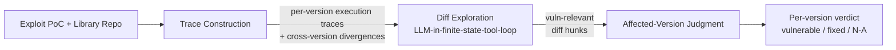

# Daily Scholar Papers Report — 2026-06-15

**[Download PDF](Daily_Papers_Report_2026-06-15.pdf)**

**Window covered:** 2026-06-14 → 2026-06-15 (Google Scholar alerts + user-curated self-emails, last 24 h)

---

## Executive Summary

A vulnerability-lifecycle day. The Outstanding pick is **ATTAIN** (Mao, Chen, Hu, Xia — Zhejiang University) — a trace-driven diff-analysis framework that retires both ends of the affected-version-labelling problem: it executes the exploit across the version chain, lets an LLM in a *finite-state tool loop* explore the resulting behavioural divergences and the surrounding diffs, and emits a per-version vulnerable/fixed verdict. On **224 CVEs × 25,943 library versions × 128 libraries** the system reaches **F1 93.24%**, beating V-SZZ by **116.28%** and the recent LLM4SZZ by **33.30%** — among the largest evaluation sets ever published for this task. Two Keeps follow: **"Mind your key"** (Gao, Wang, Zhang, Yang — Wake Forest) — the first systematic study of LLM API credential leakage in iOS apps; out of **444 apps**, **282 (64%)** leak exploitable credentials, and three months after responsible disclosure only **28%** are remediated; concrete prior incident: **$46K/day** drained from one victim org. **Acoda** (Rao, Dong, Zhao, Li, Wang — Huazhong UST, **ICSE-Companion 2026, CC-BY-NC-ND**) is the Borderline-High pick — a genetic-algorithm-driven adversarial-obfuscation framework that flips the LLM-as-analyst threat model on its head: instead of helping LLMs analyse code, prevent them; 8 semantics-preserving transforms targeting safety-alignment and tokenization mechanisms achieve **up to 70% ASR** across **7 SOTA LLMs**.

**Outstanding:** 1 · **Keep:** 1 · **Borderline High-Priority:** 1

---

## Highlighted Papers

| # | Title | Authors | Venue | Link |
|---|---|---|---|---|
| 1.1 | ATTAIN: Automated Exploit Failure Analysis through Trace-Driven Diff Analysis | X. Mao, Z. Chen, X. Hu, X. Xia | arXiv 2606.09060 | [arXiv](https://arxiv.org/abs/2606.09060) |
| 2.1 | Mind your key: An Empirical Study of LLM API Credential Leakage in iOS Apps | P. Gao, W. Lingxiang, Y. Zhang, F. Yang | arXiv 2606.12212 | [arXiv](https://arxiv.org/abs/2606.12212) |
| 3.1 | Acoda: Adversarial Code Obfuscation for Defending against LLM-based Analysis | H. Rao, Z. Dong, Y. Zhao, H. Li, H. Wang | ICSE-Companion 2026 | [DOI](https://doi.org/10.1145/3774748.3793624) |

---

## 1. Outstanding

<strong>1.1</strong> · EXPLOIT-DRIVEN VERSION LABELLING · arXiv 2026 — trace-driven diff exploration with an LLM in a finite-state tool loop; F1 93.24% on 224 CVEs × 25,943 versions × 128 libraries, +116.28% over V-SZZ and +33.30% over LLM4SZZ<a href="https://github.com/MarkLee131/paper-digest/issues/new?title=%5Bfeedback%5D+2026-06-15-1.1+arXiv+2026+%E2%80%94+trace-driven+diff+exploration+with+an+LLM+in+a+finite-state+tool+loop%3B+F1+93.24%25+on+224+CVEs+%C3%97+25%2C943+versions+%C3%97+128+libraries%2C+%2B116.28%25+over+V-SZZ+and+%2B33.30%25+over+LLM4SZZ+%F0%9F%91%8D&body=paper_id%3A+2026-06-15-1.1%0Atitle%3A+arXiv+2026+%E2%80%94+trace-driven+diff+exploration+with+an+LLM+in+a+finite-state+tool+loop%3B+F1+93.24%25+on+224+CVEs+%C3%97+25%2C943+versions+%C3%97+128+libraries%2C+%2B116.28%25+over+V-SZZ+and+%2B33.30%25+over+LLM4SZZ%0Aauthors%3A+Xinwei+Mao%2C+Zirui+Chen%2C+Xing+Hu+%28corresponding%29%2C+Xin+Xia.%0Avenue%3A+%5BarXiv%3A2606.09060%5D%28https%3A%2F%2Farxiv.org%2Fabs%2F2606.09060%29%2C+8+Jun+2026.+ACM+submission-formatted+preprint.%0Atopic%3A+EXPLOIT-DRIVEN+VERSION+LABELLING%0Arating%3A+thumbs-up%0A%0A%3C%21--+Optional+notes+below+this+line+are+read+by+preferences.py+as+soft+signals.+--%3E%0A&labels=feedback%2Cthumbs-up" target="_blank" rel="noopener" class="fb-thumbs-up" title="thumbs up" onclick="event.stopPropagation()">👍</a><a href="https://github.com/MarkLee131/paper-digest/issues/new?title=%5Bfeedback%5D+2026-06-15-1.1+arXiv+2026+%E2%80%94+trace-driven+diff+exploration+with+an+LLM+in+a+finite-state+tool+loop%3B+F1+93.24%25+on+224+CVEs+%C3%97+25%2C943+versions+%C3%97+128+libraries%2C+%2B116.28%25+over+V-SZZ+and+%2B33.30%25+over+LLM4SZZ+%F0%9F%AB%A5&body=paper_id%3A+2026-06-15-1.1%0Atitle%3A+arXiv+2026+%E2%80%94+trace-driven+diff+exploration+with+an+LLM+in+a+finite-state+tool+loop%3B+F1+93.24%25+on+224+CVEs+%C3%97+25%2C943+versions+%C3%97+128+libraries%2C+%2B116.28%25+over+V-SZZ+and+%2B33.30%25+over+LLM4SZZ%0Aauthors%3A+Xinwei+Mao%2C+Zirui+Chen%2C+Xing+Hu+%28corresponding%29%2C+Xin+Xia.%0Avenue%3A+%5BarXiv%3A2606.09060%5D%28https%3A%2F%2Farxiv.org%2Fabs%2F2606.09060%29%2C+8+Jun+2026.+ACM+submission-formatted+preprint.%0Atopic%3A+EXPLOIT-DRIVEN+VERSION+LABELLING%0Arating%3A+thumbs-down%0A%0A%3C%21--+Optional+notes+below+this+line+are+read+by+preferences.py+as+soft+signals.+--%3E%0A&labels=feedback%2Cthumbs-down" target="_blank" rel="noopener" class="fb-thumbs-down" title="less interested" onclick="event.stopPropagation()">🫥</a><a href="https://github.com/MarkLee131/paper-digest/issues/new?title=%5Bfeedback%5D+2026-06-15-1.1+arXiv+2026+%E2%80%94+trace-driven+diff+exploration+with+an+LLM+in+a+finite-state+tool+loop%3B+F1+93.24%25+on+224+CVEs+%C3%97+25%2C943+versions+%C3%97+128+libraries%2C+%2B116.28%25+over+V-SZZ+and+%2B33.30%25+over+LLM4SZZ+%F0%9F%94%96&body=paper_id%3A+2026-06-15-1.1%0Atitle%3A+arXiv+2026+%E2%80%94+trace-driven+diff+exploration+with+an+LLM+in+a+finite-state+tool+loop%3B+F1+93.24%25+on+224+CVEs+%C3%97+25%2C943+versions+%C3%97+128+libraries%2C+%2B116.28%25+over+V-SZZ+and+%2B33.30%25+over+LLM4SZZ%0Aauthors%3A+Xinwei+Mao%2C+Zirui+Chen%2C+Xing+Hu+%28corresponding%29%2C+Xin+Xia.%0Avenue%3A+%5BarXiv%3A2606.09060%5D%28https%3A%2F%2Farxiv.org%2Fabs%2F2606.09060%29%2C+8+Jun+2026.+ACM+submission-formatted+preprint.%0Atopic%3A+EXPLOIT-DRIVEN+VERSION+LABELLING%0Arating%3A+save-for-later%0A%0A%3C%21--+Optional+notes+below+this+line+are+read+by+preferences.py+as+soft+signals.+--%3E%0A&labels=feedback%2Csave-for-later" target="_blank" rel="noopener" class="fb-save-for-later" title="save for later" onclick="event.stopPropagation()">🔖</a>

### 1.1 [ATTAIN: Automated Exploit Failure Analysis through Trace-Driven Diff Analysis](https://arxiv.org/abs/2606.09060) — Mao, Chen, Hu, Xia (Zhejiang University), arXiv 2026

**Authors:** Xinwei Mao, Zirui Chen, Xing Hu (corresponding), Xin Xia.
**Venue:** [arXiv:2606.09060](https://arxiv.org/abs/2606.09060), 8 Jun 2026. ACM submission-formatted preprint.
**License:** © author(s), publication rights licensed to ACM — no figure embedding; Mermaid recreation only.

**Problem.** Two prevailing approaches for marking the affected-version range of a CVE both have systematic failure modes:

- *Exploit-based checks* — replay a PoC against each candidate library version. Sound when it runs, but exploits routinely **stop running** across versions due to API removals, signature changes, dependency drift, or build-environment differences. The result is an ambiguous *exploit-run-failed* outcome rather than a clean vulnerable / not-vulnerable verdict. Long chains of versions end up *unlabelled* rather than *judged*.
- *Commit-based methods* — SZZ-style line-blame on the fixing commit (V-SZZ, LLM4SZZ) — often miss the *introducing* commit and propagate labels incorrectly along long version chains, especially when the fix is far from the introduction in commit-distance terms.

The motivating example is CVE-2023-51080 in Hutool: the introducing commit in 5.8.22 adds a recursive fallback in `toBigDecimal`; the fix in 5.8.25 adds an input assertion. Existing patch-based approach Vision treats *every version < 5.8.25* as affected, because it locates the fix but not the introduction.

**Approach — ATTAIN's three modules.**

1. **Trace construction.** Execute the exploit across historical versions; capture execution traces; compute cross-version behavioural divergences — *where* and *how* the same exploit produces different runtime behaviour. The divergence localises the region of code likely to carry the vulnerability-relevant change.

2. **Diff exploration.** The divergence drives an LLM agent operating in a **finite-state tool loop**: the LLM may take a small, fixed set of actions (read diff hunk, inspect callgraph context, query commit history, compare adjacent versions) and iterate for a fixed maximum number of rounds. The finite-state envelope is the key engineering choice — it bounds token usage and makes runs reproducible while still letting the model decide *which* tool to call next based on what it has seen.

3. **Affected-version judgment.** Reasons over the collected diff hunks to emit a per-version verdict: vulnerable, fixed, or non-applicable, and aggregates into an affected-version range.

**Headline numbers (verbatim from §1 of the paper).**

- Dataset: **224 CVEs, 25,943 library versions, 128 libraries** — substantially larger than typical SZZ-style evaluations.
- **F1-score 93.24%**, outperforming **V-SZZ by 116.28%** and **LLM4SZZ by 33.30%**.
- "Short tool-guided prompts and a fixed number of iterations, keeping token usage low" — bounded cost is a design contribution, not just a side-effect.
- "Matches or surpasses existing methods on frequent CWE types, including cases where exploit runs fail" — direct empirical attack on the *exploit-died-in-transit* failure mode.

**Why Outstanding.** Three reasons:

- **The right framing.** Most prior work either fixates on the patch side (commit-classifier) or the exploit side (replay-and-check). ATTAIN treats the two as complementary signals: the exploit's *behavioural divergence* localises the search, and the *diff hunks* explain the divergence; neither alone is sufficient.
- **A reusable architectural pattern.** The finite-state LLM-tool-loop sits in the sweet spot between fully-free agent loops (slow, expensive, non-reproducible) and fully-hardcoded workflows (no flexibility). The same envelope plausibly transfers to patch backporting, vulnerability triage, exploit-derivative classification, and other long-tail security analyses.
- **Evaluation scale.** 25,943 versions is an order of magnitude larger than most affected-version-labelling evaluations; the gap to baselines (especially +33.30% over the most recent LLM-based SZZ variant) is too large to be noise.

**Caveats.** Exploit replay requires a runnable PoC and a buildable historical version — both are fragile assumptions, and the paper does not appear to characterise the rate at which PoCs are simply non-recoverable. The judgment module's ground-truth labels are presumably hand-curated; their quality determines the F1 ceiling. Generalisation to ecosystems without a rich version graph (private code, monorepos with squashed history) is unclear.

**Closing-line verbatim.** "Attain achieves an F1-score of 93.24%, outperforming the commit-based methods V-SZZ and LLM4SZZ by 116.28% and 33.30% respectively."

---

## 2. Keep

<strong>2.1</strong> · LLM CREDENTIAL LEAKAGE · arXiv 2026 — first systematic iOS-side study; 282/444 (64%) apps leak exploitable LLM API credentials; three patterns (JWT 48%, unauth backend 33%, plaintext 19%); only 28% remediated three months after disclosure<a href="https://github.com/MarkLee131/paper-digest/issues/new?title=%5Bfeedback%5D+2026-06-15-2.1+arXiv+2026+%E2%80%94+first+systematic+iOS-side+study%3B+282%2F444+%2864%25%29+apps+leak+exploitable+LLM+API+credentials%3B+three+patterns+%28JWT+48%25%2C+unauth+backend+33%25%2C+plaintext+19%25%29%3B+only+28%25+remediated+three+months+after+disclosure+%F0%9F%91%8D&body=paper_id%3A+2026-06-15-2.1%0Atitle%3A+arXiv+2026+%E2%80%94+first+systematic+iOS-side+study%3B+282%2F444+%2864%25%29+apps+leak+exploitable+LLM+API+credentials%3B+three+patterns+%28JWT+48%25%2C+unauth+backend+33%25%2C+plaintext+19%25%29%3B+only+28%25+remediated+three+months+after+disclosure%0Aauthors%3A+Pinran+Gao%2C+Wang+Lingxiang+%28equal+contribution%29%2C+Ying+Zhang%2C+Fan+Yang.%0Avenue%3A+%5BarXiv%3A2606.12212%5D%28https%3A%2F%2Farxiv.org%2Fabs%2F2606.12212%29%2C+10+Jun+2026.%0Atopic%3A+LLM+CREDENTIAL+LEAKAGE%0Arating%3A+thumbs-up%0A%0A%3C%21--+Optional+notes+below+this+line+are+read+by+preferences.py+as+soft+signals.+--%3E%0A&labels=feedback%2Cthumbs-up" target="_blank" rel="noopener" class="fb-thumbs-up" title="thumbs up" onclick="event.stopPropagation()">👍</a><a href="https://github.com/MarkLee131/paper-digest/issues/new?title=%5Bfeedback%5D+2026-06-15-2.1+arXiv+2026+%E2%80%94+first+systematic+iOS-side+study%3B+282%2F444+%2864%25%29+apps+leak+exploitable+LLM+API+credentials%3B+three+patterns+%28JWT+48%25%2C+unauth+backend+33%25%2C+plaintext+19%25%29%3B+only+28%25+remediated+three+months+after+disclosure+%F0%9F%AB%A5&body=paper_id%3A+2026-06-15-2.1%0Atitle%3A+arXiv+2026+%E2%80%94+first+systematic+iOS-side+study%3B+282%2F444+%2864%25%29+apps+leak+exploitable+LLM+API+credentials%3B+three+patterns+%28JWT+48%25%2C+unauth+backend+33%25%2C+plaintext+19%25%29%3B+only+28%25+remediated+three+months+after+disclosure%0Aauthors%3A+Pinran+Gao%2C+Wang+Lingxiang+%28equal+contribution%29%2C+Ying+Zhang%2C+Fan+Yang.%0Avenue%3A+%5BarXiv%3A2606.12212%5D%28https%3A%2F%2Farxiv.org%2Fabs%2F2606.12212%29%2C+10+Jun+2026.%0Atopic%3A+LLM+CREDENTIAL+LEAKAGE%0Arating%3A+thumbs-down%0A%0A%3C%21--+Optional+notes+below+this+line+are+read+by+preferences.py+as+soft+signals.+--%3E%0A&labels=feedback%2Cthumbs-down" target="_blank" rel="noopener" class="fb-thumbs-down" title="less interested" onclick="event.stopPropagation()">🫥</a><a href="https://github.com/MarkLee131/paper-digest/issues/new?title=%5Bfeedback%5D+2026-06-15-2.1+arXiv+2026+%E2%80%94+first+systematic+iOS-side+study%3B+282%2F444+%2864%25%29+apps+leak+exploitable+LLM+API+credentials%3B+three+patterns+%28JWT+48%25%2C+unauth+backend+33%25%2C+plaintext+19%25%29%3B+only+28%25+remediated+three+months+after+disclosure+%F0%9F%94%96&body=paper_id%3A+2026-06-15-2.1%0Atitle%3A+arXiv+2026+%E2%80%94+first+systematic+iOS-side+study%3B+282%2F444+%2864%25%29+apps+leak+exploitable+LLM+API+credentials%3B+three+patterns+%28JWT+48%25%2C+unauth+backend+33%25%2C+plaintext+19%25%29%3B+only+28%25+remediated+three+months+after+disclosure%0Aauthors%3A+Pinran+Gao%2C+Wang+Lingxiang+%28equal+contribution%29%2C+Ying+Zhang%2C+Fan+Yang.%0Avenue%3A+%5BarXiv%3A2606.12212%5D%28https%3A%2F%2Farxiv.org%2Fabs%2F2606.12212%29%2C+10+Jun+2026.%0Atopic%3A+LLM+CREDENTIAL+LEAKAGE%0Arating%3A+save-for-later%0A%0A%3C%21--+Optional+notes+below+this+line+are+read+by+preferences.py+as+soft+signals.+--%3E%0A&labels=feedback%2Csave-for-later" target="_blank" rel="noopener" class="fb-save-for-later" title="save for later" onclick="event.stopPropagation()">🔖</a>

### 2.1 [Mind your key: An Empirical Study of LLM API Credential Leakage in iOS Apps](https://arxiv.org/abs/2606.12212) — Gao, Wang, Zhang, Yang (Wake Forest University), arXiv 2026

**Authors:** Pinran Gao, Wang Lingxiang (equal contribution), Ying Zhang, Fan Yang.
**Venue:** [arXiv:2606.12212](https://arxiv.org/abs/2606.12212), 10 Jun 2026.
**License:** arXiv default non-exclusive — no figure embedding.

**Problem.** Android-side credential leakage has been studied extensively (Zhou et al. — 1000+ Apps with plaintext cloud creds; Wei et al. — full attack chain; Ibrahim et al. — 2,600 Android apps with hardcoded LLM API keys). iOS has been largely left alone because **FairPlay DRM** makes static binary scanning infeasible without jailbreaking; even successful decryption can produce false positives from inactive or obfuscated credentials. Yet LLM-powered apps account for **13% of all mobile app downloads (17B downloads as of 2025)**, and the financial blast radius of a leaked LLM API key is concrete — Sysdig documented an attack that drained **$46,000/day** from a single victim.

**Approach — LLMKeyLens.**

- *Dynamic-analysis pipeline.* Avoid the binary-scan problem entirely: intercept network traffic, extract provider-specific key patterns from outgoing requests, and **actively validate** captured keys against the provider's API. No source code, no decryption, no jailbreak required.
- *Three-stage funnel.* (1) 5,619 LLM-related iOS apps collected from the US App Store via iTunes search APIs (Oct 2025); (2) 1,092 candidate apps filtered to (3) **444 evaluated apps** through a standardised process.
- *Provider coverage.* Detected leakage across **at least ten LLM providers** (OpenAI, Anthropic, Google Gemini, OpenRouter, and others identified by provider-specific key prefixes / endpoint signatures).

**Headline numbers (verbatim from abstract and findings list).**

- **282 of 444 (≈64%)** apps expose exploitable LLM API credentials in network traffic.
- **Three distinct leakage patterns:**
  - **JWT-based token leakage — 48%** (tokens that enable LLM API service abuse).
  - **Unauthenticated backend proxy access — 33%** (no auth at all to reach the proxy).
  - **Plaintext API key transmission — 19%**, with **47% of the plaintext-leaking apps simultaneously leaking proprietary system prompts**.
- **Remediation.** Re-analysed the same 282 vulnerable apps three months after responsible disclosure: **only 28% remediated**; **72% remained exploitable**. The persistent vulnerabilities concentrate in unauthenticated backends and broken JWT implementations.
- Highest leakage rate by app category: **47%**; popular apps with over **2,305,613 ratings** appear among affected.

**Why Keep.** Three reasons:

- **Fills the iOS gap.** The Android-side credential-leakage literature is mature; the iOS side has been blocked by FairPlay. Switching the threat model from "scan the binary" to "watch the wire" sidesteps the DRM problem entirely and produces a methodology that should generalise to other iOS credential classes (cloud storage, geo-APIs, payment-provider sandboxes).
- **Concrete economic stakes.** The Sysdig $46K/day anecdote, the 17B-download market context, and the 64%-leak rate make this a paper that downstream platform-security teams can act on.
- **Disclosure-effect measurement.** The follow-up scan three months post-disclosure is the methodological highlight: it converts a snapshot study into a *responsiveness* study, and the 28% remediation rate is itself a publishable finding about industry hygiene.

**Caveats.** Dynamic interception necessarily misses keys never exercised at runtime (silent / fallback paths); the 444-app analysis floor is small relative to the 5,619-app catalogue; "LLM-related" filtering criteria are not detailed in the abstract. The remediation re-scan cannot distinguish *fixed* from *abandoned* — an app removed from the store also shows up as un-remediated. None of these undermines the headline result.

---

## 3. Borderline High-Priority

<strong>3.1</strong> · ADVERSARIAL OBFUSCATION VS LLM · ICSE-Companion 2026 — genetic-algorithm framework with 8 semantics-preserving transforms targeting LLM safety-alignment and tokenization; up to 70% ASR across GPT-4o, DeepSeek, Qwen, Llama, Gemma<a href="https://github.com/MarkLee131/paper-digest/issues/new?title=%5Bfeedback%5D+2026-06-15-3.1+ICSE-Companion+2026+%E2%80%94+genetic-algorithm+framework+with+8+semantics-preserving+transforms+targeting+LLM+safety-alignment+and+tokenization%3B+up+to+70%25+ASR+across+GPT-4o%2C+DeepSeek%2C+Qwen%2C+Llama%2C+Gemma+%F0%9F%91%8D&body=paper_id%3A+2026-06-15-3.1%0Atitle%3A+ICSE-Companion+2026+%E2%80%94+genetic-algorithm+framework+with+8+semantics-preserving+transforms+targeting+LLM+safety-alignment+and+tokenization%3B+up+to+70%25+ASR+across+GPT-4o%2C+DeepSeek%2C+Qwen%2C+Llama%2C+Gemma%0Aauthors%3A+Hongzhou+Rao%2C+Zikan+Dong+%28equal+contribution%29%2C+Yanjie+Zhao+%28corresponding%29%2C+Haodong+Li%2C+Haoyu+Wang.%0Avenue%3A+ICSE-Companion+%2726%2C+Rio+de+Janeiro%2C+April+12%E2%80%9318%2C+2026.+DOI%3A+%5B10.1145%2F3774748.3793624%5D%28https%3A%2F%2Fdoi.org%2F10.1145%2F3774748.3793624%29.+arXiv+mirror%3A+%5B2606.11755%5D%28https%3A%2F%2Farxiv.org%2Fabs%2F2606.11755%29.+Local+PDF%3A+%5BAcoda_Rao_2026.pdf%5D%28..%2F..%2Fpapers%2FAcoda_Rao_2026.pdf%29.%0Atopic%3A+ADVERSARIAL+OBFUSCATION+VS+LLM%0Arating%3A+thumbs-up%0A%0A%3C%21--+Optional+notes+below+this+line+are+read+by+preferences.py+as+soft+signals.+--%3E%0A&labels=feedback%2Cthumbs-up" target="_blank" rel="noopener" class="fb-thumbs-up" title="thumbs up" onclick="event.stopPropagation()">👍</a><a href="https://github.com/MarkLee131/paper-digest/issues/new?title=%5Bfeedback%5D+2026-06-15-3.1+ICSE-Companion+2026+%E2%80%94+genetic-algorithm+framework+with+8+semantics-preserving+transforms+targeting+LLM+safety-alignment+and+tokenization%3B+up+to+70%25+ASR+across+GPT-4o%2C+DeepSeek%2C+Qwen%2C+Llama%2C+Gemma+%F0%9F%AB%A5&body=paper_id%3A+2026-06-15-3.1%0Atitle%3A+ICSE-Companion+2026+%E2%80%94+genetic-algorithm+framework+with+8+semantics-preserving+transforms+targeting+LLM+safety-alignment+and+tokenization%3B+up+to+70%25+ASR+across+GPT-4o%2C+DeepSeek%2C+Qwen%2C+Llama%2C+Gemma%0Aauthors%3A+Hongzhou+Rao%2C+Zikan+Dong+%28equal+contribution%29%2C+Yanjie+Zhao+%28corresponding%29%2C+Haodong+Li%2C+Haoyu+Wang.%0Avenue%3A+ICSE-Companion+%2726%2C+Rio+de+Janeiro%2C+April+12%E2%80%9318%2C+2026.+DOI%3A+%5B10.1145%2F3774748.3793624%5D%28https%3A%2F%2Fdoi.org%2F10.1145%2F3774748.3793624%29.+arXiv+mirror%3A+%5B2606.11755%5D%28https%3A%2F%2Farxiv.org%2Fabs%2F2606.11755%29.+Local+PDF%3A+%5BAcoda_Rao_2026.pdf%5D%28..%2F..%2Fpapers%2FAcoda_Rao_2026.pdf%29.%0Atopic%3A+ADVERSARIAL+OBFUSCATION+VS+LLM%0Arating%3A+thumbs-down%0A%0A%3C%21--+Optional+notes+below+this+line+are+read+by+preferences.py+as+soft+signals.+--%3E%0A&labels=feedback%2Cthumbs-down" target="_blank" rel="noopener" class="fb-thumbs-down" title="less interested" onclick="event.stopPropagation()">🫥</a><a href="https://github.com/MarkLee131/paper-digest/issues/new?title=%5Bfeedback%5D+2026-06-15-3.1+ICSE-Companion+2026+%E2%80%94+genetic-algorithm+framework+with+8+semantics-preserving+transforms+targeting+LLM+safety-alignment+and+tokenization%3B+up+to+70%25+ASR+across+GPT-4o%2C+DeepSeek%2C+Qwen%2C+Llama%2C+Gemma+%F0%9F%94%96&body=paper_id%3A+2026-06-15-3.1%0Atitle%3A+ICSE-Companion+2026+%E2%80%94+genetic-algorithm+framework+with+8+semantics-preserving+transforms+targeting+LLM+safety-alignment+and+tokenization%3B+up+to+70%25+ASR+across+GPT-4o%2C+DeepSeek%2C+Qwen%2C+Llama%2C+Gemma%0Aauthors%3A+Hongzhou+Rao%2C+Zikan+Dong+%28equal+contribution%29%2C+Yanjie+Zhao+%28corresponding%29%2C+Haodong+Li%2C+Haoyu+Wang.%0Avenue%3A+ICSE-Companion+%2726%2C+Rio+de+Janeiro%2C+April+12%E2%80%9318%2C+2026.+DOI%3A+%5B10.1145%2F3774748.3793624%5D%28https%3A%2F%2Fdoi.org%2F10.1145%2F3774748.3793624%29.+arXiv+mirror%3A+%5B2606.11755%5D%28https%3A%2F%2Farxiv.org%2Fabs%2F2606.11755%29.+Local+PDF%3A+%5BAcoda_Rao_2026.pdf%5D%28..%2F..%2Fpapers%2FAcoda_Rao_2026.pdf%29.%0Atopic%3A+ADVERSARIAL+OBFUSCATION+VS+LLM%0Arating%3A+save-for-later%0A%0A%3C%21--+Optional+notes+below+this+line+are+read+by+preferences.py+as+soft+signals.+--%3E%0A&labels=feedback%2Csave-for-later" target="_blank" rel="noopener" class="fb-save-for-later" title="save for later" onclick="event.stopPropagation()">🔖</a>

### 3.1 [Acoda: Adversarial Code Obfuscation for Defending against LLM-based Analysis](https://doi.org/10.1145/3774748.3793624) — Rao, Dong, Zhao, Li, Wang (Huazhong University of Science and Technology), ICSE-Companion 2026

**Authors:** Hongzhou Rao, Zikan Dong (equal contribution), Yanjie Zhao (corresponding), Haodong Li, Haoyu Wang.
**Venue:** ICSE-Companion '26, Rio de Janeiro, April 12–18, 2026. DOI: [10.1145/3774748.3793624](https://doi.org/10.1145/3774748.3793624). arXiv mirror: [2606.11755](https://arxiv.org/abs/2606.11755). Local PDF: [Acoda_Rao_2026.pdf](../../papers/Acoda_Rao_2026.pdf).
**License:** Creative Commons Attribution-NonCommercial-NoDerivatives 4.0 International (CC-BY-NC-ND 4.0). Figure recreation allowed; verbatim extracts attributed.

**Problem framing — the threat model flips.** Traditional code obfuscation (Obfuscator-LLVM, Tigress, ProGuard, JavaScript Obfuscator) is designed to **defend against human analysts**: it disrupts readability, breaks naming, hides structure. LLMs reverse all of that — they have shown the ability to recover the high-level logic of obfuscated code, can be fine-tuned per-target, and benefit from prompt engineering. The asset to protect (proprietary algorithm, trade secret, vulnerability-relevant logic) is now at risk from an LLM analyst, not a human one. Hence the question Acoda asks: *how do you obfuscate against a model rather than a person?*

**Three challenges the paper identifies (verbatim framing).**

- **Selection of obfuscation methods.** Strong transforms can destroy functionality; semantics-preserving transforms tend to be weak.
- **Quantifying LLM analysis.** LLM responses are free-form (natural language and/or code); evaluating "did the LLM understand?" needs an objective measure.
- **Cross-model transferability.** Many LLMs; an attack that works only on GPT-4o is of limited use.

**Approach — Acoda.**

- *Eight semantics-preserving transforms* targeting two mechanisms common to all modern LLMs:
  - **Safety alignment** — exploit refusal triggers so the obfuscated code looks "unsafe" and the model declines to analyse it.
  - **Token-based information processing** — disrupt tokenisation so the surface form fragments into uninformative subwords, breaking the LLM's ability to recover semantic groups.
- *Genetic-algorithm optimiser* iterates obfuscation strategies, generating adversarial samples that maximise defensive effectiveness while preserving semantics.
- *Quantitative evaluation framework* — an auxiliary LLM plus four metrics scores how much the target LLM's analysis degrades on the obfuscated code, giving an objective ASR (attack success rate) measure.

**Headline numbers (verbatim from abstract).**

- **7 SOTA LLMs evaluated**: GPT-4o, DeepSeek, Qwen, Llama, Gemma (+2 others).
- **Up to 70% ASR** — the obfuscated code makes the target LLM either *refuse* or *misinterpret* the analysis.
- "Strong cross-model transferability and minimal runtime overhead, while ensuring that the semantics of the original code remain unchanged."

**Why Borderline-High.** The threat-model inversion is the contribution: *protect code from LLMs* rather than *use LLMs to analyse code*. The genetic-algorithm + safety-alignment-exploitation combination is novel for the obfuscation literature, and the framework is general enough to be a benchmark target for future LLM-robustness work. The reasons it sits at Borderline rather than Keep: it appears in ICSE-Companion (workshop track, not the main ICSE programme); the 70% ASR ceiling is achieved against general-purpose chat models, not code-specialised analysis pipelines (CodeT5+, Codex-style fine-tunes for vulnerability detection) — the relevant adversarial direction; and the "semantics-preserving" claim hinges on the eight transforms not introducing observable behavioural differences, which the abstract asserts but does not quantify.

**Caveats.** Workshop venue. Cross-model transferability needs scrutiny — genetic-algorithm searches that find a single high-ASR sample are easy to over-report. The defensive use case (protect proprietary code) is in tension with the offensive one (evade LLM-based vulnerability detection or malware analysis) — the same techniques could be used to hide malicious code from LLM-based scanners. The paper would benefit from a public benchmark and threat-model decomposition.

---

## Cross-Paper Synthesis

**LLMs as both the engine and the adversary in security workflows.** All three papers today instrument LLMs in a security pipeline, but the relationship varies:

- ATTAIN puts the LLM *in* a finite-state envelope to reason about exploit-divergence and diffs — the LLM is the analyst, the envelope is the engineering discipline that makes it reproducible. The pattern is worth borrowing.
- "Mind your key" uses LLMs only as the *protected asset* — the leaked credentials are LLM API keys, the harm is unauthorised inference use; the analysis itself (LLMKeyLens) is classical dynamic interception. The paper is a reminder that LLM integration is now a credential-management problem, not just an ML problem.
- Acoda treats the LLM as the *adversary* — code obfuscation, but the adversary doing the de-obfuscation is a model, not a person.

Two architectural-design takeaways:

- **Bounded LLM-tool-loops are becoming a standard pattern.** ATTAIN's finite-state envelope joins a growing class of designs (e.g. tool-restricted ReAct variants, FSM-guarded agent loops) that bound an LLM's freedom without hardcoding the workflow. The right primitive is *which tools, in what order, for how many rounds* — defined per-task.
- **Dynamic-only methodologies sidestep entire classes of platform restrictions.** LLMKeyLens shows that watching the wire produces stronger evidence than scanning the binary on a DRM-protected platform; the analogue in vuln-research is shifting from "scan the source" to "watch the build/test exhaust" when source access is constrained.

**Threat-model coherence.** Acoda's offensive-vs-defensive duality is the paper to keep an eye on: a defensive technique that hides proprietary logic from LLMs is, by construction, an offensive technique that hides malicious logic from LLM-based scanners. Future work on LLM-based vulnerability detection will need explicit robustness criteria against this class of perturbations, or the deployed pipelines will eat the same adversarial perturbations Acoda demonstrates.

---

## Writing & Rationale Insights

**ATTAIN's headline construction.** The paper leads with *F1 93.24%, +116.28% over V-SZZ, +33.30% over LLM4SZZ*. The framing is the right one — large absolute number, two relative-improvement numbers anchored against the most recent and the most established baseline. Every paper in this niche should report both relative improvements, not just one.

**"Mind your key"'s remediation re-scan.** The methodological highlight is not the 64%-leak finding but the three-months-later follow-up. Most empirical security papers stop at disclosure; including a re-scan converts a *snapshot* into a *responsiveness* measurement. The 28% remediation rate is itself a publishable finding about industry hygiene, and it changes the policy conversation from "fix the apps" to "fix the disclosure-to-fix pipeline".

**Acoda's challenge enumeration.** The introduction enumerates *three* challenges (selection / quantification / transferability) and the approach section answers each in turn. The structure is mechanical but effective — it forces the reader to track which challenge each design choice addresses. Worth borrowing for any methods paper that has more than two design decisions to defend.

**The finite-state LLM-tool-loop is the most reusable idea today.** It is a specific, copyable design pattern: bounded action set, bounded iteration count, LLM as action-selector. When proposing LLM-augmented analyses, default to this envelope before considering an unconstrained agent loop.
