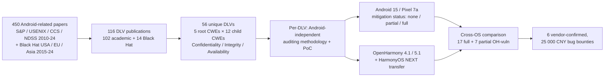

# Daily Scholar Papers Report — 2026-06-22

**[Download PDF](Daily_Papers_Report_2026-06-22.pdf)**

**Window covered:** 2026-06-21 → 2026-06-22 (Google Scholar alerts + user-curated self-emails, last 24 h)

---

## Executive Summary

A *systematize-and-transfer* day. The Outstanding pick is **SoK: History Doesn't Repeat Itself, but Android Design-Level Vulnerabilities Rhyme in OpenHarmony** (Chen, Yang, Wang, Nandi, Schloegel, Bao, R. Wang, Doupé, Lin, Shoshitaishvili — ASU / CISPA / OSU; USENIX Security 2026) — the first academic systematization of Android *design-level* vulnerabilities (DLVs) and the first peer-reviewed security study of HarmonyOS-style reimplementations. Starting from **450 Android-related papers** at the four top security venues plus Black Hat, the authors distil **116 publications** and **56 unique DLVs**, build an Android-independent auditing methodology per DLV, verify Android's current mitigation status on Pixel 7a / Android 15, and re-apply the methodology to **OpenHarmony 4.1/5.1**: **46 of 56 DLVs apply**, **OpenHarmony is fully vulnerable to 17 and partially to 7**, **15 of 19 known-date mitigations were fixed in Android *after* OpenHarmony's reimplementation began**, and **20** of the same exploits transfer to commercial **HarmonyOS NEXT** (deployed on > 1 billion devices). Six findings vendor-confirmed pre-submission; **25 000 CNY** in bug bounties already paid. Two Keeps follow: **MultiVulnBench** (Pushkar, Kabra, Kumar, Challa — BITS Pilani) — a **40 000-file** benchmark across C/C++/Python/JS with controlled vulnerability counts ∈ {1, 3, 5, 9}, showing Llama-3.3-70B's **F1 0.97** on single-vuln C drops by **up to 40 %** at high density and Python recall collapses below **0.30**; and **Unsupervised Learning by Program Synthesis** (Ellis, Solar-Lezama, Tenenbaum — MIT) — a methodology-level preprint treating latent program structure as the unsupervised-learning target. Plus one Borderline-High on static array-recognition for fuzzer harness construction.

**Outstanding:** 1 · **Keep:** 2 · **Borderline High-Priority:** 1

---

## Highlighted Papers

| # | Title | Authors | Venue | Link |
|---|---|---|---|---|
| 1.1 | SoK: History Doesn't Repeat Itself, but Android Design-Level Vulnerabilities Rhyme in OpenHarmony | H. Chen, Y. Yang, C. Wang, A. Nandi, M. Schloegel, T. Bao, R. Wang, A. Doupé, Z. Lin, Y. Shoshitaishvili | USENIX Security 2026 | [USENIX PDF](https://yancomm.net/papers/2026%20-%20USENIX%20Security%20-%20SoK:%20History%20Doesn%27t%20Repeat%20Itself,%20but%20Android%20Design-Level%20Vulnerabilities%20Rhyme%20in%20OpenHarmony.pdf) |
| 2.1 | Beyond Single Bugs — Benchmarking LLMs for Multi-Vulnerability Detection (MultiVulnBench) | C. Pushkar, S. Kabra, D. Kumar, J. S. Challa | arXiv 2512.22306 / OpenReview | [arXiv](https://arxiv.org/abs/2512.22306) |
| 2.2 | Unsupervised Learning by Program Synthesis | K. Ellis, A. Solar-Lezama, J. B. Tenenbaum | MIT DSpace preprint 2026 | [MIT DSpace](https://dspace.mit.edu/server/api/core/bitstreams/5bed6c7d-ab4a-4297-ac2f-c315e129bd73/content) |
| 3.1 | Static analyzer for array recognition in C programs for fuzzing | D. V. Koznov, D. A. Usachev | Proceedings of ISP RAS, 2026 | [mathnet.ru](https://www.mathnet.ru/eng/tisp1171) |

---

## 1. Outstanding

<strong>1.1</strong> · DESIGN-LEVEL VULN SYSTEMATIZATION · USENIX Security 2026 — 56 Android design-level vulns systematized; 46/56 apply to OpenHarmony, 17 fully + 7 partially live; 20 transfer to HarmonyOS NEXT (>1 B devices); 25 000 CNY in bounties paid<a href="https://github.com/MarkLee131/paper-digest/issues/new?title=%5Bfeedback%5D+2026-06-22-1.1+USENIX+Security+2026+%E2%80%94+56+Android+design-level+vulns+systematized%3B+46%2F56+apply+to+OpenHarmony%2C+17+fully+%2B+7+partially+live%3B+20+transfer+to+HarmonyOS+NEXT+%28%3E1+B+devices%29%3B+25+000+CNY+in+bounties+paid+%F0%9F%91%8D&body=paper_id%3A+2026-06-22-1.1%0Atitle%3A+USENIX+Security+2026+%E2%80%94+56+Android+design-level+vulns+systematized%3B+46%2F56+apply+to+OpenHarmony%2C+17+fully+%2B+7+partially+live%3B+20+transfer+to+HarmonyOS+NEXT+%28%3E1+B+devices%29%3B+25+000+CNY+in+bounties+paid%0Aauthors%3A+%23%23%23+1.1+%5BSoK%3A+History+Doesn%27t+Repeat+Itself%2C+but+Android+Design-Level+Vulnerabilities+Rhyme+in+OpenHarmony%5D%28https%3A%2F%2Fyancomm.net%2Fpapers%2F2026%2520-%2520USENIX%2520Security%2520-%2520SoK%3A%2520History%2520Doesn%2527t%2520R%0Avenue%3A+preprint%0Atopic%3A+DESIGN-LEVEL+VULN+SYSTEMATIZATION%0Arating%3A+thumbs-up%0A%0A%3C%21--+Optional+notes+below+this+line+are+read+by+preferences.py+as+soft+signals.+--%3E%0A&labels=feedback%2Cthumbs-up" target="_blank" rel="noopener" class="fb-thumbs-up" title="thumbs up" onclick="event.stopPropagation()">👍</a><a href="https://github.com/MarkLee131/paper-digest/issues/new?title=%5Bfeedback%5D+2026-06-22-1.1+USENIX+Security+2026+%E2%80%94+56+Android+design-level+vulns+systematized%3B+46%2F56+apply+to+OpenHarmony%2C+17+fully+%2B+7+partially+live%3B+20+transfer+to+HarmonyOS+NEXT+%28%3E1+B+devices%29%3B+25+000+CNY+in+bounties+paid+%F0%9F%AB%A5&body=paper_id%3A+2026-06-22-1.1%0Atitle%3A+USENIX+Security+2026+%E2%80%94+56+Android+design-level+vulns+systematized%3B+46%2F56+apply+to+OpenHarmony%2C+17+fully+%2B+7+partially+live%3B+20+transfer+to+HarmonyOS+NEXT+%28%3E1+B+devices%29%3B+25+000+CNY+in+bounties+paid%0Aauthors%3A+%23%23%23+1.1+%5BSoK%3A+History+Doesn%27t+Repeat+Itself%2C+but+Android+Design-Level+Vulnerabilities+Rhyme+in+OpenHarmony%5D%28https%3A%2F%2Fyancomm.net%2Fpapers%2F2026%2520-%2520USENIX%2520Security%2520-%2520SoK%3A%2520History%2520Doesn%2527t%2520R%0Avenue%3A+preprint%0Atopic%3A+DESIGN-LEVEL+VULN+SYSTEMATIZATION%0Arating%3A+thumbs-down%0A%0A%3C%21--+Optional+notes+below+this+line+are+read+by+preferences.py+as+soft+signals.+--%3E%0A&labels=feedback%2Cthumbs-down" target="_blank" rel="noopener" class="fb-thumbs-down" title="less interested" onclick="event.stopPropagation()">🫥</a><a href="https://github.com/MarkLee131/paper-digest/issues/new?title=%5Bfeedback%5D+2026-06-22-1.1+USENIX+Security+2026+%E2%80%94+56+Android+design-level+vulns+systematized%3B+46%2F56+apply+to+OpenHarmony%2C+17+fully+%2B+7+partially+live%3B+20+transfer+to+HarmonyOS+NEXT+%28%3E1+B+devices%29%3B+25+000+CNY+in+bounties+paid+%F0%9F%94%96&body=paper_id%3A+2026-06-22-1.1%0Atitle%3A+USENIX+Security+2026+%E2%80%94+56+Android+design-level+vulns+systematized%3B+46%2F56+apply+to+OpenHarmony%2C+17+fully+%2B+7+partially+live%3B+20+transfer+to+HarmonyOS+NEXT+%28%3E1+B+devices%29%3B+25+000+CNY+in+bounties+paid%0Aauthors%3A+%23%23%23+1.1+%5BSoK%3A+History+Doesn%27t+Repeat+Itself%2C+but+Android+Design-Level+Vulnerabilities+Rhyme+in+OpenHarmony%5D%28https%3A%2F%2Fyancomm.net%2Fpapers%2F2026%2520-%2520USENIX%2520Security%2520-%2520SoK%3A%2520History%2520Doesn%2527t%2520R%0Avenue%3A+preprint%0Atopic%3A+DESIGN-LEVEL+VULN+SYSTEMATIZATION%0Arating%3A+save-for-later%0A%0A%3C%21--+Optional+notes+below+this+line+are+read+by+preferences.py+as+soft+signals.+--%3E%0A&labels=feedback%2Csave-for-later" target="_blank" rel="noopener" class="fb-save-for-later" title="save for later" onclick="event.stopPropagation()">🔖</a>

### 1.1 [SoK: History Doesn't Repeat Itself, but Android Design-Level Vulnerabilities Rhyme in OpenHarmony](https://yancomm.net/papers/2026%20-%20USENIX%20Security%20-%20SoK:%20History%20Doesn%27t%20Repeat%20Itself,%20but%20Android%20Design-Level%20Vulnerabilities%20Rhyme%20in%20OpenHarmony.pdf) — Chen, Yang, Wang, Nandi, Schloegel, Bao, Wang, Doupé, Lin, Shoshitaishvili (ASU / CISPA / OSU), USENIX Security 2026

**Authors.** Hongkai Chen (Arizona State University), Yuqing Yang (CISPA Helmholtz Center for Information Security), Chao Wang (The Ohio State University), Arpit Nandi (ASU), Moritz Schloegel (CISPA), Tiffany Bao (ASU), Ruoyu Wang (ASU), Adam Doupé (ASU), Zhiqiang Lin (OSU), Yan Shoshitaishvili (ASU).
**Venue.** USENIX Security 2026.
**License.** USENIX-Security author-retained copyright — no figure embedding; Mermaid recreation only.

**Problem.** Android's *design-level vulnerabilities* (DLVs) — flaws in intended logic, not implementation bugs — have been studied for over a decade but never systematized academically. Meanwhile, Huawei (HarmonyOS NEXT, OpenHarmony), Xiaomi (HyperOS), and Vivo (BlueOS) have begun reimplementing their own mobile OSes, often starting from Android-shaped designs (Want vs Intent, ability vs activity). HarmonyOS NEXT contains zero Android code yet runs on more than one billion devices, with essentially no academic security scrutiny. The paper's posit: *Android's historical DLVs — including ones already patched in Android — silently re-emerge in these emerging mobile OSes, leaving attackers familiar with Android well-prepared to exploit them.*

**Methodology — four-stage SoK pipeline.**

1. Review 450 candidate Android-related papers (S&P, USENIX Security, CCS, NDSS 2010-2024; Black Hat USA/EU/Asia 2015-2024). Filter to 116 DLV-focused publications.
2. Extract 56 unique DLVs; for each, derive an Android-independent *auditing methodology* and build a portable PoC.
3. Verify each DLV's mitigation status on an up-to-date Pixel 7a (Android 15): *none / partial / full*.
4. Apply the systematized auditing model to OpenHarmony 4.1/5.1 and validate transfer to commercial HarmonyOS NEXT.

**Taxonomy.** 5 root CWEs and 12 child CWEs, anchored on CWE-284 Improper Access Control (36 DLVs — by far the largest class), CWE-221 Information Loss/Omission, CWE-664 Improper Resource Lifetime Control, CWE-311 Missing Encryption. Children include CWE-269 Privilege Management, CWE-346 Origin Validation, CWE-923 Improper Channel Restriction, CWE-921 Sensitive Storage Without Access Control, CWE-514 Covert Channel, CWE-319 Cleartext Transmission, CWE-1038 Insecure Automated Optimizations.

**Headline numbers — verbatim from the paper.**

- "we review 116 publications on Android from industry and academia."
- "we extract 56 unique vulnerabilities reported in Android's design."
- "46 of the 56 DLVs are applicable to OpenHarmony."
- "OpenHarmony is vulnerable to 24 of the vulnerabilities."
- "43 of 46 DLVs have already been fixed in Android."
- "OpenHarmony remains fully vulnerable to 17 and partially vulnerable to 7."
- "15 of the 19 DLVs with known mitigation dates were fixed in Android after OpenHarmony's reimplementation began."
- "we confirmed that 20 of them work" (on commercial HarmonyOS NEXT).
- "awarded bug bounties of 25,000 CNY."
- "more than 3 billion active devices and a worldwide market share of 72%" (Android scope).

**Concrete OpenHarmony findings.** Implicit Want hijacking (mirroring the Android implicit-Intent attack class, cf. CVE-2019-2225-style), DataAbility access-control bypass, no certificate-pinning configuration files, motion-sensor rate-limiting absence, covert Bluetooth pairing / scan-mode manipulation, /proc/net/tcp packet-counter leakage, /sys/class/power_supply leakage, kernel panic via /sys/kernel/debug/usb/musb-hdrc.2.auto/regdump, weakened ASLR via appspawn, cleartext HTTP by default, system-app global log access. Artefacts: Zenodo DOI [10.5281/zenodo.20655878](https://doi.org/10.5281/zenodo.20655878).

**Why Outstanding.**

- *Reusable systematization.* The Android-independent auditing-methodology library is the durable contribution — future emerging mobile OSes (Xiaomi HyperOS, Vivo BlueOS, automotive stacks) can be audited as soon as they ship, without re-deriving each DLV from scratch.
- *Sound transfer-of-knowledge framing.* Prior cross-OS security work is mostly one-off (find a single bug, port to one new OS). This paper is the first to argue that the *design-level* class is what transfers, and to show the transfer is overwhelming (43/46 already-fixed-in-Android DLVs still live in OpenHarmony, 20 transferring to HarmonyOS NEXT).
- *Pragmatic deliverable.* Six vendor-confirmed CVE-class findings already, 25 000 CNY in bug bounties paid before camera-ready — evidence that the methodology is operational, not just retrospective.

**Caveats.** The 56-DLV corpus is bounded by what 116 papers chose to write up; tacit vendor-internal fixes (Pixel-only mitigations, OEM bug fixes never published) are out of scope. The "Android 15 fully mitigates" verdict is observational on a single Pixel 7a configuration. Generalisation to non-OpenHarmony forks (HyperOS, BlueOS) is asserted as future work, not measured.

**Closing-line verbatim.** "Those who don't learn from history are doomed to repeat it."

---

## 2. Keep

<strong>2.1</strong> · LLM MULTI-VULN BENCHMARK · arXiv 2025 — 40 000-file benchmark with controlled vuln counts {1,3,5,9}; Llama-3.3-70B F1 0.97 single-vuln drops 40 % at density; Python recall collapses below 0.30<a href="https://github.com/MarkLee131/paper-digest/issues/new?title=%5Bfeedback%5D+2026-06-22-2.1+arXiv+2025+%E2%80%94+40+000-file+benchmark+with+controlled+vuln+counts+%7B1%2C3%2C5%2C9%7D%3B+Llama-3.3-70B+F1+0.97+single-vuln+drops+40+%25+at+density%3B+Python+recall+collapses+below+0.30+%F0%9F%91%8D&body=paper_id%3A+2026-06-22-2.1%0Atitle%3A+arXiv+2025+%E2%80%94+40+000-file+benchmark+with+controlled+vuln+counts+%7B1%2C3%2C5%2C9%7D%3B+Llama-3.3-70B+F1+0.97+single-vuln+drops+40+%25+at+density%3B+Python+recall+collapses+below+0.30%0Aauthors%3A+%23%23%23+2.1+%5BBeyond+Single+Bugs%3A+Benchmarking+Large+Language+Models+for+Multi-Vulnerability+Detection%5D%28https%3A%2F%2Farxiv.org%2Fabs%2F2512.22306%29+%E2%80%94+Pushkar%2C+Kabra%2C+Kumar%2C+Challa+%28BITS+Pilani%29%2C+arXiv+2025+%2F+Under+R%0Avenue%3A+preprint%0Atopic%3A+LLM+MULTI-VULN+BENCHMARK%0Arating%3A+thumbs-up%0A%0A%3C%21--+Optional+notes+below+this+line+are+read+by+preferences.py+as+soft+signals.+--%3E%0A&labels=feedback%2Cthumbs-up" target="_blank" rel="noopener" class="fb-thumbs-up" title="thumbs up" onclick="event.stopPropagation()">👍</a><a href="https://github.com/MarkLee131/paper-digest/issues/new?title=%5Bfeedback%5D+2026-06-22-2.1+arXiv+2025+%E2%80%94+40+000-file+benchmark+with+controlled+vuln+counts+%7B1%2C3%2C5%2C9%7D%3B+Llama-3.3-70B+F1+0.97+single-vuln+drops+40+%25+at+density%3B+Python+recall+collapses+below+0.30+%F0%9F%AB%A5&body=paper_id%3A+2026-06-22-2.1%0Atitle%3A+arXiv+2025+%E2%80%94+40+000-file+benchmark+with+controlled+vuln+counts+%7B1%2C3%2C5%2C9%7D%3B+Llama-3.3-70B+F1+0.97+single-vuln+drops+40+%25+at+density%3B+Python+recall+collapses+below+0.30%0Aauthors%3A+%23%23%23+2.1+%5BBeyond+Single+Bugs%3A+Benchmarking+Large+Language+Models+for+Multi-Vulnerability+Detection%5D%28https%3A%2F%2Farxiv.org%2Fabs%2F2512.22306%29+%E2%80%94+Pushkar%2C+Kabra%2C+Kumar%2C+Challa+%28BITS+Pilani%29%2C+arXiv+2025+%2F+Under+R%0Avenue%3A+preprint%0Atopic%3A+LLM+MULTI-VULN+BENCHMARK%0Arating%3A+thumbs-down%0A%0A%3C%21--+Optional+notes+below+this+line+are+read+by+preferences.py+as+soft+signals.+--%3E%0A&labels=feedback%2Cthumbs-down" target="_blank" rel="noopener" class="fb-thumbs-down" title="less interested" onclick="event.stopPropagation()">🫥</a><a href="https://github.com/MarkLee131/paper-digest/issues/new?title=%5Bfeedback%5D+2026-06-22-2.1+arXiv+2025+%E2%80%94+40+000-file+benchmark+with+controlled+vuln+counts+%7B1%2C3%2C5%2C9%7D%3B+Llama-3.3-70B+F1+0.97+single-vuln+drops+40+%25+at+density%3B+Python+recall+collapses+below+0.30+%F0%9F%94%96&body=paper_id%3A+2026-06-22-2.1%0Atitle%3A+arXiv+2025+%E2%80%94+40+000-file+benchmark+with+controlled+vuln+counts+%7B1%2C3%2C5%2C9%7D%3B+Llama-3.3-70B+F1+0.97+single-vuln+drops+40+%25+at+density%3B+Python+recall+collapses+below+0.30%0Aauthors%3A+%23%23%23+2.1+%5BBeyond+Single+Bugs%3A+Benchmarking+Large+Language+Models+for+Multi-Vulnerability+Detection%5D%28https%3A%2F%2Farxiv.org%2Fabs%2F2512.22306%29+%E2%80%94+Pushkar%2C+Kabra%2C+Kumar%2C+Challa+%28BITS+Pilani%29%2C+arXiv+2025+%2F+Under+R%0Avenue%3A+preprint%0Atopic%3A+LLM+MULTI-VULN+BENCHMARK%0Arating%3A+save-for-later%0A%0A%3C%21--+Optional+notes+below+this+line+are+read+by+preferences.py+as+soft+signals.+--%3E%0A&labels=feedback%2Csave-for-later" target="_blank" rel="noopener" class="fb-save-for-later" title="save for later" onclick="event.stopPropagation()">🔖</a>

### 2.1 [Beyond Single Bugs: Benchmarking Large Language Models for Multi-Vulnerability Detection](https://arxiv.org/abs/2512.22306) — Pushkar, Kabra, Kumar, Challa (BITS Pilani), arXiv 2025 / Under Review

**Authors.** Chinmay Pushkar, Sanchit Kabra, Dhruv Kumar, Jagat Sesh Challa (BITS Pilani). (The Scholar-alert snippet listed an additional "M Gupta" first author; the arXiv version 2512.22306 and the OpenReview submission `nk4iCkoncE` list the four BITS authors — treated as the same paper, under review.)
**Venue.** [arXiv:2512.22306](https://arxiv.org/abs/2512.22306) (26 Dec 2025); OpenReview submission `nk4iCkoncE`.
**License.** arXiv non-exclusive — no figure embedding.

**Problem.** Standard LLM-vuln-detection benchmarks (e.g. SecVulEval) ship one bug per file. Real code holds *multiple* co-located vulnerabilities, and recent multi-label-classification work has shown LLMs exhibit *count bias* and *selection bias* — recall collapses as the number of true labels grows. Nobody had quantified this for code-security.

**Approach.** Synthetic benchmark — **40 000 files** across C, C++, Python, JavaScript, with controlled vulnerability counts ∈ {1, 3, 5, 9} injected into long-context (7.5k-10k tokens) code samples drawn from CodeParrot. Evaluate five SOTA LLMs: GPT-4o-mini, Llama-3.3-70B, Qwen-2.5 series.

**Headline numbers — verbatim.**

- "We construct a dataset of 40,000 files."
- "Llama-3.3-70B achieves near-perfect F1 scores (approximately 0.97) on single-vulnerability C tasks."
- "performance drops by up to 40% in high-density settings."
- "models exhibiting severe 'under-counting' (Recall dropping to less than 0.30) in complex Python files."

**Why Keep.** Three points. (1) The benchmark systematically isolates *count* from *vulnerability-class* — most prior benchmarks change both at once, so any observed degradation could be explained either way. (2) Python/JS under-counting is a previously-unreported failure-mode shape that argues against treating LLM-vuln-detection numbers as language-agnostic. (3) Cheap to extend — the injection protocol is reproducible, so future model releases can be re-tested without new data collection.

**Caveat.** Injected synthetic bugs are not real CVE patterns, so external validity to production vuln-detection numbers is bounded; the benchmark is best read as a measurement of *count-handling capacity* rather than *real-world vulnerability-finding capacity*.

<strong>2.2</strong> · PROGRAM SYNTHESIS · MIT preprint 2026 — programs-as-latent-variables for unsupervised structure discovery; methodologically close to LLM-agent finite-state tool loops<a href="https://github.com/MarkLee131/paper-digest/issues/new?title=%5Bfeedback%5D+2026-06-22-2.2+MIT+preprint+2026+%E2%80%94+programs-as-latent-variables+for+unsupervised+structure+discovery%3B+methodologically+close+to+LLM-agent+finite-state+tool+loops+%F0%9F%91%8D&body=paper_id%3A+2026-06-22-2.2%0Atitle%3A+MIT+preprint+2026+%E2%80%94+programs-as-latent-variables+for+unsupervised+structure+discovery%3B+methodologically+close+to+LLM-agent+finite-state+tool+loops%0Aauthors%3A+%23%23%23+2.2+%5BUnsupervised+Learning+by+Program+Synthesis%5D%28https%3A%2F%2Fdspace.mit.edu%2Fserver%2Fapi%2Fcore%2Fbitstreams%2F5bed6c7d-ab4a-4297-ac2f-c315e129bd73%2Fcontent%29+%E2%80%94+Ellis%2C+Solar-Lezama%2C+Tenenbaum+%28MIT%29%2C+DSpace+prep%0Avenue%3A+preprint%0Atopic%3A+PROGRAM+SYNTHESIS%0Arating%3A+thumbs-up%0A%0A%3C%21--+Optional+notes+below+this+line+are+read+by+preferences.py+as+soft+signals.+--%3E%0A&labels=feedback%2Cthumbs-up" target="_blank" rel="noopener" class="fb-thumbs-up" title="thumbs up" onclick="event.stopPropagation()">👍</a><a href="https://github.com/MarkLee131/paper-digest/issues/new?title=%5Bfeedback%5D+2026-06-22-2.2+MIT+preprint+2026+%E2%80%94+programs-as-latent-variables+for+unsupervised+structure+discovery%3B+methodologically+close+to+LLM-agent+finite-state+tool+loops+%F0%9F%AB%A5&body=paper_id%3A+2026-06-22-2.2%0Atitle%3A+MIT+preprint+2026+%E2%80%94+programs-as-latent-variables+for+unsupervised+structure+discovery%3B+methodologically+close+to+LLM-agent+finite-state+tool+loops%0Aauthors%3A+%23%23%23+2.2+%5BUnsupervised+Learning+by+Program+Synthesis%5D%28https%3A%2F%2Fdspace.mit.edu%2Fserver%2Fapi%2Fcore%2Fbitstreams%2F5bed6c7d-ab4a-4297-ac2f-c315e129bd73%2Fcontent%29+%E2%80%94+Ellis%2C+Solar-Lezama%2C+Tenenbaum+%28MIT%29%2C+DSpace+prep%0Avenue%3A+preprint%0Atopic%3A+PROGRAM+SYNTHESIS%0Arating%3A+thumbs-down%0A%0A%3C%21--+Optional+notes+below+this+line+are+read+by+preferences.py+as+soft+signals.+--%3E%0A&labels=feedback%2Cthumbs-down" target="_blank" rel="noopener" class="fb-thumbs-down" title="less interested" onclick="event.stopPropagation()">🫥</a><a href="https://github.com/MarkLee131/paper-digest/issues/new?title=%5Bfeedback%5D+2026-06-22-2.2+MIT+preprint+2026+%E2%80%94+programs-as-latent-variables+for+unsupervised+structure+discovery%3B+methodologically+close+to+LLM-agent+finite-state+tool+loops+%F0%9F%94%96&body=paper_id%3A+2026-06-22-2.2%0Atitle%3A+MIT+preprint+2026+%E2%80%94+programs-as-latent-variables+for+unsupervised+structure+discovery%3B+methodologically+close+to+LLM-agent+finite-state+tool+loops%0Aauthors%3A+%23%23%23+2.2+%5BUnsupervised+Learning+by+Program+Synthesis%5D%28https%3A%2F%2Fdspace.mit.edu%2Fserver%2Fapi%2Fcore%2Fbitstreams%2F5bed6c7d-ab4a-4297-ac2f-c315e129bd73%2Fcontent%29+%E2%80%94+Ellis%2C+Solar-Lezama%2C+Tenenbaum+%28MIT%29%2C+DSpace+prep%0Avenue%3A+preprint%0Atopic%3A+PROGRAM+SYNTHESIS%0Arating%3A+save-for-later%0A%0A%3C%21--+Optional+notes+below+this+line+are+read+by+preferences.py+as+soft+signals.+--%3E%0A&labels=feedback%2Csave-for-later" target="_blank" rel="noopener" class="fb-save-for-later" title="save for later" onclick="event.stopPropagation()">🔖</a>

### 2.2 [Unsupervised Learning by Program Synthesis](https://dspace.mit.edu/server/api/core/bitstreams/5bed6c7d-ab4a-4297-ac2f-c315e129bd73/content) — Ellis, Solar-Lezama, Tenenbaum (MIT), DSpace preprint 2026

**Authors.** Kevin Ellis (MIT Brain & Cognitive Sciences), Armando Solar-Lezama (MIT CSAIL), Joshua B. Tenenbaum (MIT BCS).
**Venue.** MIT DSpace deposit (preprint).
**License.** MIT DSpace author-retained — no figure embedding.

**One-line take.** Treats unsupervised structure-discovery as program synthesis: the learner searches over programs that *generate* observed data, with the program itself as the latent variable. Not vulnerability-detection-adjacent — appears in today's window because Solar-Lezama is on the followed list — but methodologically close to recent LLM-agent / finite-state tool-loop work on static analysis: in both cases the "answer" is a small executable artefact (a program, a tool trace) discovered by search under structural constraints. Worth a closing-time skim for the agent-loop crowd; the substrate (DSL + neural guidance + posterior over programs) maps cleanly onto the architectural patterns increasingly used for security analysis.

---

## 3. Borderline High-Priority

<strong>3.1</strong> · STATIC ANALYSIS FOR FUZZING · ISP RAS 2026 — static recognition of C array allocations to drive coverage-guided fuzzer harness construction<a href="https://github.com/MarkLee131/paper-digest/issues/new?title=%5Bfeedback%5D+2026-06-22-3.1+ISP+RAS+2026+%E2%80%94+static+recognition+of+C+array+allocations+to+drive+coverage-guided+fuzzer+harness+construction+%F0%9F%91%8D&body=paper_id%3A+2026-06-22-3.1%0Atitle%3A+ISP+RAS+2026+%E2%80%94+static+recognition+of+C+array+allocations+to+drive+coverage-guided+fuzzer+harness+construction%0Aauthors%3A+%23%23%23+3.1+%5BStatic+analyzer+for+array+recognition+in+C+programs+for+fuzzing%5D%28https%3A%2F%2Fwww.mathnet.ru%2Feng%2Ftisp1171%29+%E2%80%94+Koznov%2C+Usachev%2C+Proceedings+of+ISP+RAS%2C+2026%0Avenue%3A+preprint%0Atopic%3A+STATIC+ANALYSIS+FOR+FUZZING%0Arating%3A+thumbs-up%0A%0A%3C%21--+Optional+notes+below+this+line+are+read+by+preferences.py+as+soft+signals.+--%3E%0A&labels=feedback%2Cthumbs-up" target="_blank" rel="noopener" class="fb-thumbs-up" title="thumbs up" onclick="event.stopPropagation()">👍</a><a href="https://github.com/MarkLee131/paper-digest/issues/new?title=%5Bfeedback%5D+2026-06-22-3.1+ISP+RAS+2026+%E2%80%94+static+recognition+of+C+array+allocations+to+drive+coverage-guided+fuzzer+harness+construction+%F0%9F%AB%A5&body=paper_id%3A+2026-06-22-3.1%0Atitle%3A+ISP+RAS+2026+%E2%80%94+static+recognition+of+C+array+allocations+to+drive+coverage-guided+fuzzer+harness+construction%0Aauthors%3A+%23%23%23+3.1+%5BStatic+analyzer+for+array+recognition+in+C+programs+for+fuzzing%5D%28https%3A%2F%2Fwww.mathnet.ru%2Feng%2Ftisp1171%29+%E2%80%94+Koznov%2C+Usachev%2C+Proceedings+of+ISP+RAS%2C+2026%0Avenue%3A+preprint%0Atopic%3A+STATIC+ANALYSIS+FOR+FUZZING%0Arating%3A+thumbs-down%0A%0A%3C%21--+Optional+notes+below+this+line+are+read+by+preferences.py+as+soft+signals.+--%3E%0A&labels=feedback%2Cthumbs-down" target="_blank" rel="noopener" class="fb-thumbs-down" title="less interested" onclick="event.stopPropagation()">🫥</a><a href="https://github.com/MarkLee131/paper-digest/issues/new?title=%5Bfeedback%5D+2026-06-22-3.1+ISP+RAS+2026+%E2%80%94+static+recognition+of+C+array+allocations+to+drive+coverage-guided+fuzzer+harness+construction+%F0%9F%94%96&body=paper_id%3A+2026-06-22-3.1%0Atitle%3A+ISP+RAS+2026+%E2%80%94+static+recognition+of+C+array+allocations+to+drive+coverage-guided+fuzzer+harness+construction%0Aauthors%3A+%23%23%23+3.1+%5BStatic+analyzer+for+array+recognition+in+C+programs+for+fuzzing%5D%28https%3A%2F%2Fwww.mathnet.ru%2Feng%2Ftisp1171%29+%E2%80%94+Koznov%2C+Usachev%2C+Proceedings+of+ISP+RAS%2C+2026%0Avenue%3A+preprint%0Atopic%3A+STATIC+ANALYSIS+FOR+FUZZING%0Arating%3A+save-for-later%0A%0A%3C%21--+Optional+notes+below+this+line+are+read+by+preferences.py+as+soft+signals.+--%3E%0A&labels=feedback%2Csave-for-later" target="_blank" rel="noopener" class="fb-save-for-later" title="save for later" onclick="event.stopPropagation()">🔖</a>

### 3.1 [Static analyzer for array recognition in C programs for fuzzing](https://www.mathnet.ru/eng/tisp1171) — Koznov, Usachev, Proceedings of ISP RAS, 2026

**Authors.** D. V. Koznov, D. A. Usachev.
**Venue.** Proceedings of the Institute for System Programming of the Russian Academy of Sciences (ISP RAS), 2026.
**License.** ISP RAS journals are typically CC-BY 4.0; verify before any figure use.

**One-line take.** A static analyzer that recognises *array allocations and access patterns* in C programs to drive coverage-guided fuzzing. The narrow contribution is a deterministic procedure for converting program-level array information into fuzzer seed/input-structure annotations; useful as a building block for harness-generation work if it generalises beyond the in-house telecom-software target the authors validate on. The array-recognition primitive itself is reusable, but the paper has not yet been validated outside the authors' company corpus, and the venue is regional — hence Borderline-High rather than Keep.

---

## Cross-Paper Synthesis

Today's window is dominated by a *systematization* paper (SoK OpenHarmony) and a *benchmarking* paper (MultiVulnBench). Both push back against the field's drift toward incremental DL-for-vuln-detection results. The SoK does this by re-anchoring the conversation in *design-level* reasoning that transfers across operating systems — the "answer" to a vulnerability isn't a model, it's a portable auditing methodology. MultiVulnBench does it by quantifying a failure mode (count bias) that single-vulnerability benchmarks had hidden — exposing the gap between published F1 scores and production behaviour. The Solar-Lezama / Ellis preprint is methodologically on the same side of an architectural shift: *programs-as-latent-variables*, operationally close to the "LLM agent inside a finite-state tool loop" pattern that has been emerging in recent weeks (cf. ATTAIN, 2026-06-15). The combined message: the methodological frontier this week is in *transfer / generalisation*, not in another point estimate of F1.

## Writing & Rationale Insights

The SoK opens with a one-sentence posit — "Android's design-level vulnerabilities affect emerging mobile OSes" — and then spends its methodology section making that posit *empirically falsifiable*. Every subsequent claim is a count: how many DLVs, how many transferred, how many already vendor-fixed. The pattern is worth borrowing for any framing-led paper: state the bet on page one, then dedicate the methodology to operationalising the test.

MultiVulnBench's injection protocol is a textbook example of *isolating one variable at a time* in a benchmark — every subsequent F1 claim becomes interpretable because the confound (which vulnerability class is present) has been removed by construction rather than ablated later. The lesson: when a benchmark needs to attribute a measured effect to one specific input dimension, it is cheaper to *generate* the right axis than to *find* it in nature.
