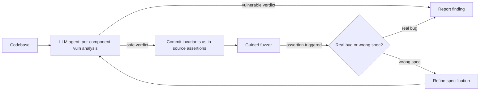
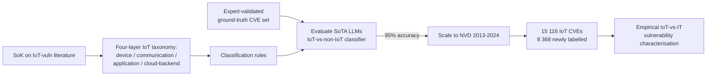
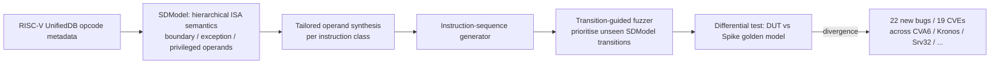

# Daily Scholar Papers Report — 2026-06-24

**[Download PDF](Daily_Papers_Report_2026-06-24.pdf)**

**Window covered:** 2026-06-23 → 2026-06-24 (Google Scholar alerts + user-curated self-emails, last 24 h)

---

## Executive Summary

A *make-the-tacit-explicit* day. Three Outstanding picks all win by isolating a single semantic axis and instrumenting against it. **Code-Augur** (Luo, Zafar, Wolff, Roychoudhury — NUS) turns implicit LLM-agent reasoning into in-source assertions and lets a guided fuzzer falsify them, surfacing **22 new vulnerabilities** in OSS projects using generic Sonnet / DeepSeek models — matching specialised models like Claude Mythos. **SoK: LLIoT** (Rezaei, Bayhan, Continella, van der Ham-de Vos, van Rijswijk-Deij — Utwente) systematises IoT-vulnerability literature into a four-layer ecosystem taxonomy and ships a labelled corpus of **15 116 IoT CVEs (8 368 newly classified)** using an LLM classifier that hits **95 % accuracy** vs an expert ground truth. **DRVFuzz** (Yu, Chen, Yan, Zhang, Xian, Jiang — Tsinghua / RUC, WingTecher) introduces *data-sensitive* RISC-V CPU fuzzing via a hierarchical Sensitive-Data Model and transition-guided exploration, uncovering **22 previously unknown bugs and 19 new CVEs** across six real RISC-V cores including CVA6, Kronos, Srv32. Three Keeps follow: **Calibration Without Comprehension** (Zibaeirad, Vieira) builds a leakage-controlled 834-sample, 74-CWE Linux-kernel benchmark and shows fine-tuning shifts the threshold without changing the policy — best detector reaches only **52.1 % (+2.1 pp above chance)** and exact CWE Top-1 stays below **1.3 %**; **TIGER** (Kalikman, Petrov, Dimitrov, Vechev — ETH SRI) reframes prior discrete subspace-attack tests as a continuous distance objective, enabling the first successful gradient-inversion reconstructions in DP-defended federated-learning decoders; **PBFDroid-J** (Sun, Su, Liang, Wang, Pu, Su — ECNU & ETH) extends FSE'23 property-based Android-DME fuzzing into a TSE 2026 journal version.

**Outstanding:** 3 · **Keep:** 3 · **Borderline High-Priority:** 0

---

## Highlighted Papers

| # | Title | Authors | Venue | Link |
|---|---|---|---|---|
| 1.1 | Code-Augur: Agentic Vulnerability Detection via Specification Inference | Z. Luo, M. Zafar, D. Wolff, A. Roychoudhury | arXiv 2606.18619, 2026 (NUS) | [arXiv](https://arxiv.org/abs/2606.18619) |
| 1.2 | SoK: Understanding the state of IoT-specific vulnerabilities via CVE characterization with LLIoT | T. Rezaei, S. Bayhan, A. Continella, J. van der Ham-de Vos, R. van Rijswijk-Deij | Preprint 2026 (U. Twente) | [PDF](https://conand.me/publications/rezaei-lliot-2026.pdf) |
| 1.3 | DRVFuzz: Data-Sensitive RISC-V CPU Fuzzing | Z. Yu, Y. Chen, Z. Yan, X. Zhang, Z. Xian, Y. Jiang | Preprint 2026 (Tsinghua / RUC) | [PDF](http://www.wingtecher.com/themes/WingTecherResearch/assets/papers/paper_from_26/DRVFuzz.pdf) |
| 2.1 | Calibration Without Comprehension: Diagnosing the Limits of Fine-Tuning LLMs for Vulnerability Detection in Systems Software | A. Zibaeirad, M. Vieira | arXiv 2606.20502, 2026 | [arXiv](https://arxiv.org/abs/2606.20502) |
| 2.2 | TIGER: Inverting Transformer Gradients via Embedding-Subspace Distance Optimization | W. Kalikman, I. Petrov, D. I. Dimitrov, M. Vechev | arXiv 2606.18312, 2026 (ETH SRI) | [arXiv](https://arxiv.org/abs/2606.18312) |
| 2.3 | Automated Property-Based Fuzzing for Finding Data Manipulation Errors in Android Apps | J. Sun, T. Su, X. Liang, J. Wang, G. Pu, Z. Su | IEEE TSE 2026 | [IEEEXplore](https://ieeexplore.ieee.org/abstract/document/11570133/) |

---

## 1. Outstanding

<strong>1.1</strong> · AGENTIC VULN DETECTION · arXiv 2026 — security-specification-first LLM agent commits invariants as in-source assertions, fuzzer falsifies them; 22 new OSS vulnerabilities with generic Sonnet/DeepSeek matching Claude Mythos<a href="https://github.com/MarkLee131/paper-digest/issues/new?title=%5Bfeedback%5D+2026-06-24-1.1+arXiv+2026+%E2%80%94+security-specification-first+LLM+agent+commits+invariants+as+in-source+assertions%2C+fuzzer+falsifies+them%3B+22+new+OSS+vulnerabilities+with+generic+Sonnet%2FDeepSeek+matching+Claude+Mythos+%F0%9F%91%8D&body=paper_id%3A+2026-06-24-1.1%0Atitle%3A+arXiv+2026+%E2%80%94+security-specification-first+LLM+agent+commits+invariants+as+in-source+assertions%2C+fuzzer+falsifies+them%3B+22+new+OSS+vulnerabilities+with+generic+Sonnet%2FDeepSeek+matching+Claude+Mythos%0Aauthors%3A+%23%23%23+1.1+%5BCode-Augur%3A+Agentic+Vulnerability+Detection+via+Specification+Inference%5D%28https%3A%2F%2Farxiv.org%2Fabs%2F2606.18619%29+%E2%80%94+Luo%2C+Zafar%2C+Wolff%2C+Roychoudhury+%28NUS%29%2C+arXiv+2606.18619%2C+June+2026%0Avenue%3A+preprint%0Atopic%3A+AGENTIC+VULN+DETECTION%0Arating%3A+thumbs-up%0A%0A%3C%21--+Optional+notes+below+this+line+are+read+by+preferences.py+as+soft+signals.+--%3E%0A&labels=feedback%2Cthumbs-up" target="_blank" rel="noopener" class="fb-thumbs-up" title="thumbs up" onclick="event.stopPropagation()">👍</a><a href="https://github.com/MarkLee131/paper-digest/issues/new?title=%5Bfeedback%5D+2026-06-24-1.1+arXiv+2026+%E2%80%94+security-specification-first+LLM+agent+commits+invariants+as+in-source+assertions%2C+fuzzer+falsifies+them%3B+22+new+OSS+vulnerabilities+with+generic+Sonnet%2FDeepSeek+matching+Claude+Mythos+%F0%9F%AB%A5&body=paper_id%3A+2026-06-24-1.1%0Atitle%3A+arXiv+2026+%E2%80%94+security-specification-first+LLM+agent+commits+invariants+as+in-source+assertions%2C+fuzzer+falsifies+them%3B+22+new+OSS+vulnerabilities+with+generic+Sonnet%2FDeepSeek+matching+Claude+Mythos%0Aauthors%3A+%23%23%23+1.1+%5BCode-Augur%3A+Agentic+Vulnerability+Detection+via+Specification+Inference%5D%28https%3A%2F%2Farxiv.org%2Fabs%2F2606.18619%29+%E2%80%94+Luo%2C+Zafar%2C+Wolff%2C+Roychoudhury+%28NUS%29%2C+arXiv+2606.18619%2C+June+2026%0Avenue%3A+preprint%0Atopic%3A+AGENTIC+VULN+DETECTION%0Arating%3A+thumbs-down%0A%0A%3C%21--+Optional+notes+below+this+line+are+read+by+preferences.py+as+soft+signals.+--%3E%0A&labels=feedback%2Cthumbs-down" target="_blank" rel="noopener" class="fb-thumbs-down" title="less interested" onclick="event.stopPropagation()">🫥</a><a href="https://github.com/MarkLee131/paper-digest/issues/new?title=%5Bfeedback%5D+2026-06-24-1.1+arXiv+2026+%E2%80%94+security-specification-first+LLM+agent+commits+invariants+as+in-source+assertions%2C+fuzzer+falsifies+them%3B+22+new+OSS+vulnerabilities+with+generic+Sonnet%2FDeepSeek+matching+Claude+Mythos+%F0%9F%94%96&body=paper_id%3A+2026-06-24-1.1%0Atitle%3A+arXiv+2026+%E2%80%94+security-specification-first+LLM+agent+commits+invariants+as+in-source+assertions%2C+fuzzer+falsifies+them%3B+22+new+OSS+vulnerabilities+with+generic+Sonnet%2FDeepSeek+matching+Claude+Mythos%0Aauthors%3A+%23%23%23+1.1+%5BCode-Augur%3A+Agentic+Vulnerability+Detection+via+Specification+Inference%5D%28https%3A%2F%2Farxiv.org%2Fabs%2F2606.18619%29+%E2%80%94+Luo%2C+Zafar%2C+Wolff%2C+Roychoudhury+%28NUS%29%2C+arXiv+2606.18619%2C+June+2026%0Avenue%3A+preprint%0Atopic%3A+AGENTIC+VULN+DETECTION%0Arating%3A+save-for-later%0A%0A%3C%21--+Optional+notes+below+this+line+are+read+by+preferences.py+as+soft+signals.+--%3E%0A&labels=feedback%2Csave-for-later" target="_blank" rel="noopener" class="fb-save-for-later" title="save for later" onclick="event.stopPropagation()">🔖</a>

### 1.1 [Code-Augur: Agentic Vulnerability Detection via Specification Inference](https://arxiv.org/abs/2606.18619) — Luo, Zafar, Wolff, Roychoudhury (NUS), arXiv 2606.18619, June 2026

**Authors.** Zixu Luo, Mehrdad Zafar, Daniel Wolff, Abhik Roychoudhury (National University of Singapore).
**Venue.** arXiv 2606.18619 (preprint, June 2026).
**License.** arXiv non-exclusive — no figure embedding; Mermaid recreation only.

**Problem.** Agentic vulnerability detection (autonomous LLM-agent auditors) is now uncovering long-dormant CVEs in foundational software, but the *reasoning* behind each verdict is opaque. When an agent declares a function safe, the implicit input assumptions it made are nowhere written down — a wrong assumption silently turns "no bug" into a missed CVE.

**Approach — security-specification-first agent harness.**

1. Per component, the agent runs an LLM-driven vulnerability analysis and, when it deems the component safe, *commits* the local invariants behind that judgment as **in-source assertions** (the agent's tacit assumptions made explicit).
2. A guided fuzzer is launched in parallel to falsify those committed assertions.
3. When the fuzzer triggers an assertion, the outcome is binary-disambiguating: either a genuine vulnerability surfaced *or* the assumption itself was wrong and the specification gets refined.
4. The loop grounds the agent's view of *code intent* in how the code *actually behaves*.

**Approach diagram (Mermaid recreation; no embedded figures).**

**Headline numbers — verbatim.**

- "Code-Augur effectively leverages security specifications to detect more vulnerabilities than other state-of-the-art agents."
- "Code-Augur found 22 new vulnerabilities in key open-source projects."
- "Code-Augur offers effective agentic vulnerability detection built on widely available LLMs like Sonnet and DeepSeek."

**Why Outstanding.**

- *Falsification turns silent failures into observable failures.* Pure LLM-agent auditors fail silently when they over-trust an assumption; making the assumption a runtime assertion changes the failure mode from "we'll never know" to "the fuzzer will tell us within a budget."
- *Decouples reasoning quality from specialised models.* By committing intermediate reasoning to executable artefacts, generic frontier models (Sonnet, DeepSeek) can match purpose-built models like Claude Mythos.
- *Operational evidence.* 22 newly-found vulnerabilities in real OSS projects is a meaningful operational result, not a benchmark-only claim.

**Caveats.** External validity of the 22-bug count depends on the project selection and fuzzing budget — both need PDF-level verification before being cited as a generalisable yield. The "specification" is committed as a runtime assertion, so any class of bug that cannot be encoded as a runtime check (timing side-channels, design-level access control failures à la yesterday's OpenHarmony SoK) is out of scope by construction.

**Closing-line verbatim.** "Code-Augur offers effective agentic vulnerability detection built on widely available LLMs like Sonnet and DeepSeek."

<strong>1.2</strong> · IoT-CVE SYSTEMATIZATION · Preprint 2026 — SoK over IoT-vuln literature yields four-layer taxonomy; LLM classifier hits 95% vs expert ground truth; 15 116 IoT-CVE labelled corpus (8 368 newly classified) shared<a href="https://github.com/MarkLee131/paper-digest/issues/new?title=%5Bfeedback%5D+2026-06-24-1.2+Preprint+2026+%E2%80%94+SoK+over+IoT-vuln+literature+yields+four-layer+taxonomy%3B+LLM+classifier+hits+95%25+vs+expert+ground+truth%3B+15+116+IoT-CVE+labelled+corpus+%288+368+newly+classified%29+shared+%F0%9F%91%8D&body=paper_id%3A+2026-06-24-1.2%0Atitle%3A+Preprint+2026+%E2%80%94+SoK+over+IoT-vuln+literature+yields+four-layer+taxonomy%3B+LLM+classifier+hits+95%25+vs+expert+ground+truth%3B+15+116+IoT-CVE+labelled+corpus+%288+368+newly+classified%29+shared%0Aauthors%3A+%23%23%23+1.2+%5BSoK%3A+Understanding+the+state+of+IoT-specific+vulnerabilities+via+CVE+characterization+with+LLIoT%5D%28https%3A%2F%2Fconand.me%2Fpublications%2Frezaei-lliot-2026.pdf%29+%E2%80%94+Rezaei%2C+Bayhan%2C+Continella%2C+van+der+H%0Avenue%3A+preprint%0Atopic%3A+IoT-CVE+SYSTEMATIZATION%0Arating%3A+thumbs-up%0A%0A%3C%21--+Optional+notes+below+this+line+are+read+by+preferences.py+as+soft+signals.+--%3E%0A&labels=feedback%2Cthumbs-up" target="_blank" rel="noopener" class="fb-thumbs-up" title="thumbs up" onclick="event.stopPropagation()">👍</a><a href="https://github.com/MarkLee131/paper-digest/issues/new?title=%5Bfeedback%5D+2026-06-24-1.2+Preprint+2026+%E2%80%94+SoK+over+IoT-vuln+literature+yields+four-layer+taxonomy%3B+LLM+classifier+hits+95%25+vs+expert+ground+truth%3B+15+116+IoT-CVE+labelled+corpus+%288+368+newly+classified%29+shared+%F0%9F%AB%A5&body=paper_id%3A+2026-06-24-1.2%0Atitle%3A+Preprint+2026+%E2%80%94+SoK+over+IoT-vuln+literature+yields+four-layer+taxonomy%3B+LLM+classifier+hits+95%25+vs+expert+ground+truth%3B+15+116+IoT-CVE+labelled+corpus+%288+368+newly+classified%29+shared%0Aauthors%3A+%23%23%23+1.2+%5BSoK%3A+Understanding+the+state+of+IoT-specific+vulnerabilities+via+CVE+characterization+with+LLIoT%5D%28https%3A%2F%2Fconand.me%2Fpublications%2Frezaei-lliot-2026.pdf%29+%E2%80%94+Rezaei%2C+Bayhan%2C+Continella%2C+van+der+H%0Avenue%3A+preprint%0Atopic%3A+IoT-CVE+SYSTEMATIZATION%0Arating%3A+thumbs-down%0A%0A%3C%21--+Optional+notes+below+this+line+are+read+by+preferences.py+as+soft+signals.+--%3E%0A&labels=feedback%2Cthumbs-down" target="_blank" rel="noopener" class="fb-thumbs-down" title="less interested" onclick="event.stopPropagation()">🫥</a><a href="https://github.com/MarkLee131/paper-digest/issues/new?title=%5Bfeedback%5D+2026-06-24-1.2+Preprint+2026+%E2%80%94+SoK+over+IoT-vuln+literature+yields+four-layer+taxonomy%3B+LLM+classifier+hits+95%25+vs+expert+ground+truth%3B+15+116+IoT-CVE+labelled+corpus+%288+368+newly+classified%29+shared+%F0%9F%94%96&body=paper_id%3A+2026-06-24-1.2%0Atitle%3A+Preprint+2026+%E2%80%94+SoK+over+IoT-vuln+literature+yields+four-layer+taxonomy%3B+LLM+classifier+hits+95%25+vs+expert+ground+truth%3B+15+116+IoT-CVE+labelled+corpus+%288+368+newly+classified%29+shared%0Aauthors%3A+%23%23%23+1.2+%5BSoK%3A+Understanding+the+state+of+IoT-specific+vulnerabilities+via+CVE+characterization+with+LLIoT%5D%28https%3A%2F%2Fconand.me%2Fpublications%2Frezaei-lliot-2026.pdf%29+%E2%80%94+Rezaei%2C+Bayhan%2C+Continella%2C+van+der+H%0Avenue%3A+preprint%0Atopic%3A+IoT-CVE+SYSTEMATIZATION%0Arating%3A+save-for-later%0A%0A%3C%21--+Optional+notes+below+this+line+are+read+by+preferences.py+as+soft+signals.+--%3E%0A&labels=feedback%2Csave-for-later" target="_blank" rel="noopener" class="fb-save-for-later" title="save for later" onclick="event.stopPropagation()">🔖</a>

### 1.2 [SoK: Understanding the state of IoT-specific vulnerabilities via CVE characterization with LLIoT](https://conand.me/publications/rezaei-lliot-2026.pdf) — Rezaei, Bayhan, Continella, van der Ham-de Vos, van Rijswijk-Deij (U. Twente), Preprint 2026

**Authors.** Tina Rezaei, Suzan Bayhan, Andrea Continella, Jeroen van der Ham-de Vos, Roland van Rijswijk-Deij (University of Twente).
**Venue.** Preprint (author copy on conand.me); venue header absent in PDF; likely 2026 EuroS&P / ACSAC-class submission.
**License.** No CC label declared — no figure embedding; Mermaid only.

**Problem.** IoT-specific CVE counts have exploded yet there is no consistent IoT definition, no scalable classifier, and no high-quality IoT-CVE dataset. Prior work relies on CPE metadata or keyword filters, both noisy and unscalable; manual review is expensive.

**Approach.**

1. SoK over prior IoT-vuln literature → derive a **four-layer IoT ecosystem taxonomy** (device, communication, application, cloud-backend) with classification criteria.
2. Build an **expert-validated ground-truth** CVE set.
3. Evaluate state-of-the-art LLMs as IoT-vs-non-IoT CVE classifiers against the ground truth.
4. Apply the validated classifier to all CVEs 2013-2024 → labelled IoT-CVE corpus, then characterise how IoT vulnerabilities differ from traditional IT vulnerabilities.

**Approach diagram (Mermaid recreation; no embedded figures).**

**Headline numbers — verbatim.**

- "LLMs can reliably distinguish IoT from non-IoT CVEs with a high accuracy of 95%."
- "we build a dataset of 15,116 IoT-specific vulnerabilities."
- "of which 8,368 are newly classified with respect to previous datasets."
- "LLMs exhibit fewer cognitive errors on ambiguous phrasing and bridge domain knowledge gaps in humans."

**Why Outstanding.**

- *Durable artefact.* A shared 15 116-CVE labelled dataset (8 368 new vs prior collections) is reusable as both a benchmark and a baseline for any future IoT-vuln-detection work.
- *Methodological transferability.* The "SoK → ground-truth → LLM classifier → scale-up" pipeline is directly portable to other domain-specific CVE-tagging problems (medical-device, automotive, ICS) where CPE-based filters have the same failure modes.
- *Realistic baseline framing.* Compares LLM classification head-to-head with human experts and quantifies the bridge across human cognitive errors and domain gaps — useful framing for any agent-vs-analyst study.

**Caveats.** The 95% accuracy hinges on the quality of the expert-labelled ground truth; sample size and inter-annotator agreement need a PDF-level check before reusing the dataset downstream. "IoT" in this taxonomy includes cloud-backend layers — pipeline consumers should re-read the four-layer definition before assuming compatibility with a narrower IoT scope.

**Closing-line verbatim.** "we provide actionable recommendations for responsible stakeholders."

<strong>1.3</strong> · HARDWARE FUZZING · Preprint 2026 — Sensitive-Data Model + transition-guided fuzzing for RISC-V CPUs; 22 previously unknown bugs and 19 CVEs across six real cores including CVA6, Kronos, Srv32<a href="https://github.com/MarkLee131/paper-digest/issues/new?title=%5Bfeedback%5D+2026-06-24-1.3+Preprint+2026+%E2%80%94+Sensitive-Data+Model+%2B+transition-guided+fuzzing+for+RISC-V+CPUs%3B+22+previously+unknown+bugs+and+19+CVEs+across+six+real+cores+including+CVA6%2C+Kronos%2C+Srv32+%F0%9F%91%8D&body=paper_id%3A+2026-06-24-1.3%0Atitle%3A+Preprint+2026+%E2%80%94+Sensitive-Data+Model+%2B+transition-guided+fuzzing+for+RISC-V+CPUs%3B+22+previously+unknown+bugs+and+19+CVEs+across+six+real+cores+including+CVA6%2C+Kronos%2C+Srv32%0Aauthors%3A+%23%23%23+1.3+%5BDRVFuzz%3A+Data-Sensitive+RISC-V+CPU+Fuzzing%5D%28http%3A%2F%2Fwww.wingtecher.com%2Fthemes%2FWingTecherResearch%2Fassets%2Fpapers%2Fpaper_from_26%2FDRVFuzz.pdf%29+%E2%80%94+Yu%2C+Chen%2C+Yan%2C+Zhang%2C+Xian%2C+Jiang+%28Tsinghua+%26+RUC%2C+W%0Avenue%3A+preprint%0Atopic%3A+HARDWARE+FUZZING%0Arating%3A+thumbs-up%0A%0A%3C%21--+Optional+notes+below+this+line+are+read+by+preferences.py+as+soft+signals.+--%3E%0A&labels=feedback%2Cthumbs-up" target="_blank" rel="noopener" class="fb-thumbs-up" title="thumbs up" onclick="event.stopPropagation()">👍</a><a href="https://github.com/MarkLee131/paper-digest/issues/new?title=%5Bfeedback%5D+2026-06-24-1.3+Preprint+2026+%E2%80%94+Sensitive-Data+Model+%2B+transition-guided+fuzzing+for+RISC-V+CPUs%3B+22+previously+unknown+bugs+and+19+CVEs+across+six+real+cores+including+CVA6%2C+Kronos%2C+Srv32+%F0%9F%AB%A5&body=paper_id%3A+2026-06-24-1.3%0Atitle%3A+Preprint+2026+%E2%80%94+Sensitive-Data+Model+%2B+transition-guided+fuzzing+for+RISC-V+CPUs%3B+22+previously+unknown+bugs+and+19+CVEs+across+six+real+cores+including+CVA6%2C+Kronos%2C+Srv32%0Aauthors%3A+%23%23%23+1.3+%5BDRVFuzz%3A+Data-Sensitive+RISC-V+CPU+Fuzzing%5D%28http%3A%2F%2Fwww.wingtecher.com%2Fthemes%2FWingTecherResearch%2Fassets%2Fpapers%2Fpaper_from_26%2FDRVFuzz.pdf%29+%E2%80%94+Yu%2C+Chen%2C+Yan%2C+Zhang%2C+Xian%2C+Jiang+%28Tsinghua+%26+RUC%2C+W%0Avenue%3A+preprint%0Atopic%3A+HARDWARE+FUZZING%0Arating%3A+thumbs-down%0A%0A%3C%21--+Optional+notes+below+this+line+are+read+by+preferences.py+as+soft+signals.+--%3E%0A&labels=feedback%2Cthumbs-down" target="_blank" rel="noopener" class="fb-thumbs-down" title="less interested" onclick="event.stopPropagation()">🫥</a><a href="https://github.com/MarkLee131/paper-digest/issues/new?title=%5Bfeedback%5D+2026-06-24-1.3+Preprint+2026+%E2%80%94+Sensitive-Data+Model+%2B+transition-guided+fuzzing+for+RISC-V+CPUs%3B+22+previously+unknown+bugs+and+19+CVEs+across+six+real+cores+including+CVA6%2C+Kronos%2C+Srv32+%F0%9F%94%96&body=paper_id%3A+2026-06-24-1.3%0Atitle%3A+Preprint+2026+%E2%80%94+Sensitive-Data+Model+%2B+transition-guided+fuzzing+for+RISC-V+CPUs%3B+22+previously+unknown+bugs+and+19+CVEs+across+six+real+cores+including+CVA6%2C+Kronos%2C+Srv32%0Aauthors%3A+%23%23%23+1.3+%5BDRVFuzz%3A+Data-Sensitive+RISC-V+CPU+Fuzzing%5D%28http%3A%2F%2Fwww.wingtecher.com%2Fthemes%2FWingTecherResearch%2Fassets%2Fpapers%2Fpaper_from_26%2FDRVFuzz.pdf%29+%E2%80%94+Yu%2C+Chen%2C+Yan%2C+Zhang%2C+Xian%2C+Jiang+%28Tsinghua+%26+RUC%2C+W%0Avenue%3A+preprint%0Atopic%3A+HARDWARE+FUZZING%0Arating%3A+save-for-later%0A%0A%3C%21--+Optional+notes+below+this+line+are+read+by+preferences.py+as+soft+signals.+--%3E%0A&labels=feedback%2Csave-for-later" target="_blank" rel="noopener" class="fb-save-for-later" title="save for later" onclick="event.stopPropagation()">🔖</a>

### 1.3 [DRVFuzz: Data-Sensitive RISC-V CPU Fuzzing](http://www.wingtecher.com/themes/WingTecherResearch/assets/papers/paper_from_26/DRVFuzz.pdf) — Yu, Chen, Yan, Zhang, Xian, Jiang (Tsinghua & RUC, WingTecher), Preprint 2026

**Authors.** Zehong Yu, Yuanliang Chen (corresponding, RUC), Zhen Yan, Xudong Zhang, Zhensheng Xian, Yu Jiang (corresponding, Tsinghua).
**Venue.** Preprint (author copy on wingtecher.com); USENIX/CCS-class submission. Artefact: Zenodo DOI [10.5281/zenodo.20343558](https://doi.org/10.5281/zenodo.20343558).
**License.** No license label in extracted text — no figure embedding; Mermaid recreation only.

**Problem.** Existing RISC-V hardware fuzzers (Cascade, DiveFuzz, MorFuzz, GenHuzz, HardFuzz, …) are *operand-agnostic*: they treat instruction operands as incidental random values, so guarded microarchitectural states that activate only under precise bit-patterns (NaN propagation, page-fault triggers, privileged-mode transitions) are almost never hit.

**Approach — two contributions.**

1. **SDModel (Sensitive Data Model)** — a hierarchical codification of RISC-V ISA semantics. For each instruction class, SDModel synthesises tailored operands (boundary values, IEEE-754 corner values, exception triggers, privileged-mode markers). Categories implemented: base integer (I, M, A in 32/64-bit), bit-manipulation (Zba/Zbb/Zbc/Zbs), floating-point F/D/Q + Zfa, control-flow & memory (JAL, JALR, branches, compressed C, cache-block Zicbo*), synchronisation/fences (Zifencei, FENCE), and trap/privilege state-machine handling (PPFSM, DWNPRV, MEDELEG, TVECFSM, EPCFSM).
2. **Transition-guided fuzzing** — prioritises test programs that trigger previously-unseen state transitions as labelled by SDModel, instead of optimising for raw writeback-coverage as DiveFuzz does.

**Approach diagram (Mermaid recreation; no embedded figures).**

**Headline numbers — verbatim.**

- "we present DRVFuzz, a data-sensitive fuzzing framework."
- "uncovering 22 previously unknown bugs (19 new CVEs)."
- "evaluated DRVFuzz on six real-world RISC-V CPUs."
- Bug classes: "FPU logic errors to speculative corruption" leading to "denial-of-service and control-flow hijacking."

**Why Outstanding.**

- *Names a real coverage blind spot.* Operand-agnostic hardware fuzzers systematically miss data-guarded paths — the paper is precise about *which* (NaN, page-fault, privilege transition) and *why* random operands cannot exercise them within a reasonable budget.
- *Reusable artefact.* SDModel is keyed off the RISC-V UnifiedDB opcode metadata, so it scales with the ecosystem (new extensions register automatically); the Zenodo artefact is self-contained.
- *Real-world bug yield.* 19 CVEs across six cores is a concrete operational result and validates that *data-dependence*, not sequence diversity, is the right next axis for hardware fuzzing.

**Caveats.** Bug counts are weighted toward simpler cores (Srv32, Kronos) where reachability is easier; high-complexity cores like CVA6 show different yield. The differential oracle is Spike, so any class of bug present in Spike too will be missed (the standard hardware-fuzzing limitation). The framework is RISC-V-specific; porting SDModel to ARM/x86 would require re-deriving the ISA-semantics hierarchy by hand.

**Closing-line verbatim.** "DRVFuzz leverages the sensitive data model and constructs transition-guided instruction sequences to explore guarded microarchitectural states."

---

## 2. Keep

<strong>2.1</strong> · LLM-VULN EVALUATION · arXiv 2026 — 834-sample Linux-kernel benchmark (74 CWEs) with strict pre-2025/post-cutoff split; fine-tuning shifts threshold not policy, best detector 52.1% (+2.1 pp above chance), CWE Top-1 below 1.3%<a href="https://github.com/MarkLee131/paper-digest/issues/new?title=%5Bfeedback%5D+2026-06-24-2.1+arXiv+2026+%E2%80%94+834-sample+Linux-kernel+benchmark+%2874+CWEs%29+with+strict+pre-2025%2Fpost-cutoff+split%3B+fine-tuning+shifts+threshold+not+policy%2C+best+detector+52.1%25+%28%2B2.1+pp+above+chance%29%2C+CWE+Top-1+below+1.3%25+%F0%9F%91%8D&body=paper_id%3A+2026-06-24-2.1%0Atitle%3A+arXiv+2026+%E2%80%94+834-sample+Linux-kernel+benchmark+%2874+CWEs%29+with+strict+pre-2025%2Fpost-cutoff+split%3B+fine-tuning+shifts+threshold+not+policy%2C+best+detector+52.1%25+%28%2B2.1+pp+above+chance%29%2C+CWE+Top-1+below+1.3%25%0Aauthors%3A+%23%23%23+2.1+%5BCalibration+Without+Comprehension%3A+Diagnosing+the+Limits+of+Fine-Tuning+LLMs+for+Vulnerability+Detection+in+Systems+Software%5D%28https%3A%2F%2Farxiv.org%2Fabs%2F2606.20502%29+%E2%80%94+Zibaeirad%2C+Vieira%2C+arXiv+2606%0Avenue%3A+preprint%0Atopic%3A+LLM-VULN+EVALUATION%0Arating%3A+thumbs-up%0A%0A%3C%21--+Optional+notes+below+this+line+are+read+by+preferences.py+as+soft+signals.+--%3E%0A&labels=feedback%2Cthumbs-up" target="_blank" rel="noopener" class="fb-thumbs-up" title="thumbs up" onclick="event.stopPropagation()">👍</a><a href="https://github.com/MarkLee131/paper-digest/issues/new?title=%5Bfeedback%5D+2026-06-24-2.1+arXiv+2026+%E2%80%94+834-sample+Linux-kernel+benchmark+%2874+CWEs%29+with+strict+pre-2025%2Fpost-cutoff+split%3B+fine-tuning+shifts+threshold+not+policy%2C+best+detector+52.1%25+%28%2B2.1+pp+above+chance%29%2C+CWE+Top-1+below+1.3%25+%F0%9F%AB%A5&body=paper_id%3A+2026-06-24-2.1%0Atitle%3A+arXiv+2026+%E2%80%94+834-sample+Linux-kernel+benchmark+%2874+CWEs%29+with+strict+pre-2025%2Fpost-cutoff+split%3B+fine-tuning+shifts+threshold+not+policy%2C+best+detector+52.1%25+%28%2B2.1+pp+above+chance%29%2C+CWE+Top-1+below+1.3%25%0Aauthors%3A+%23%23%23+2.1+%5BCalibration+Without+Comprehension%3A+Diagnosing+the+Limits+of+Fine-Tuning+LLMs+for+Vulnerability+Detection+in+Systems+Software%5D%28https%3A%2F%2Farxiv.org%2Fabs%2F2606.20502%29+%E2%80%94+Zibaeirad%2C+Vieira%2C+arXiv+2606%0Avenue%3A+preprint%0Atopic%3A+LLM-VULN+EVALUATION%0Arating%3A+thumbs-down%0A%0A%3C%21--+Optional+notes+below+this+line+are+read+by+preferences.py+as+soft+signals.+--%3E%0A&labels=feedback%2Cthumbs-down" target="_blank" rel="noopener" class="fb-thumbs-down" title="less interested" onclick="event.stopPropagation()">🫥</a><a href="https://github.com/MarkLee131/paper-digest/issues/new?title=%5Bfeedback%5D+2026-06-24-2.1+arXiv+2026+%E2%80%94+834-sample+Linux-kernel+benchmark+%2874+CWEs%29+with+strict+pre-2025%2Fpost-cutoff+split%3B+fine-tuning+shifts+threshold+not+policy%2C+best+detector+52.1%25+%28%2B2.1+pp+above+chance%29%2C+CWE+Top-1+below+1.3%25+%F0%9F%94%96&body=paper_id%3A+2026-06-24-2.1%0Atitle%3A+arXiv+2026+%E2%80%94+834-sample+Linux-kernel+benchmark+%2874+CWEs%29+with+strict+pre-2025%2Fpost-cutoff+split%3B+fine-tuning+shifts+threshold+not+policy%2C+best+detector+52.1%25+%28%2B2.1+pp+above+chance%29%2C+CWE+Top-1+below+1.3%25%0Aauthors%3A+%23%23%23+2.1+%5BCalibration+Without+Comprehension%3A+Diagnosing+the+Limits+of+Fine-Tuning+LLMs+for+Vulnerability+Detection+in+Systems+Software%5D%28https%3A%2F%2Farxiv.org%2Fabs%2F2606.20502%29+%E2%80%94+Zibaeirad%2C+Vieira%2C+arXiv+2606%0Avenue%3A+preprint%0Atopic%3A+LLM-VULN+EVALUATION%0Arating%3A+save-for-later%0A%0A%3C%21--+Optional+notes+below+this+line+are+read+by+preferences.py+as+soft+signals.+--%3E%0A&labels=feedback%2Csave-for-later" target="_blank" rel="noopener" class="fb-save-for-later" title="save for later" onclick="event.stopPropagation()">🔖</a>

### 2.1 [Calibration Without Comprehension: Diagnosing the Limits of Fine-Tuning LLMs for Vulnerability Detection in Systems Software](https://arxiv.org/abs/2606.20502) — Zibaeirad, Vieira, arXiv 2606.20502, June 2026

**Authors.** Arastoo Zibaeirad, Marco Vieira.
**Venue.** arXiv 2606.20502 (preprint, June 2026).
**License.** arXiv non-exclusive — no figure embedding.

**One-line take.** Counter-evidence to the saturated LLM-for-vuln-detection literature: a leakage-controlled benchmark of **834 manually curated Linux-kernel samples across 74 CWEs**, with a strict temporal split (pre-2025 historical / post-cutoff leakage-free) and context-aware vulnerable–patched pair preservation. Two new diagnostic metrics — **DFI (Directional Failure Index)** and **HDD (Hierarchical Distance and Direction)** — expose systematic directional priors. Evaluation of 8 vanilla + 15 LoRA-fine-tuned LLMs shows fine-tuning shifts the *output threshold* without changing the *decision policy* — "calibration without comprehension."

**Headline numbers — verbatim.**

- "framework for LLM vulnerability detection built from 834 manually curated Linux kernel samples spanning 74 CWEs."
- "We evaluate eight vanilla LLMs and 15 LoRA fine-tuned variants."
- "84% of nominally contaminated samples carry no usable memorization signal."
- "DFI ranging from -85.5 to +94.8 pp."
- "The best detection score reaches only 52.1% (+2.1 pp above chance)."
- "exact CWE ranking remains below 1.3% Top-1 accuracy."

**Why Keep.** Two reusable contributions independent of the (sobering) headline result: (1) **DFI** and **HDD** as evaluation metrics for systematic directional priors, applicable to any classifier-style detector; (2) the strict pre-2025 / post-cutoff temporal split with vulnerable–patched pair preservation as a template for any future LLM-vuln-detection benchmark that wants to defuse contamination claims. Detection and CWE-understanding are shown to be *decoupled capabilities* — a useful reframing for downstream agent loops.

**Caveats.** Linux-kernel-only — whether the priors-dominate-fine-tuning pattern transfers to other domains (Android, web, smart contracts) is the natural next study. The 52.1% / 1.3% numbers refer to *binary* and *exact-CWE* tasks; they do not preclude usefulness in narrower CWE-class settings.

<strong>2.2</strong> · GRADIENT-INVERSION ATTACK · arXiv 2026 — replaces discrete token-membership test with continuous distance-to-subspace objective on transformer embeddings; first successful reconstructions in DP-defended federated-learning decoders<a href="https://github.com/MarkLee131/paper-digest/issues/new?title=%5Bfeedback%5D+2026-06-24-2.2+arXiv+2026+%E2%80%94+replaces+discrete+token-membership+test+with+continuous+distance-to-subspace+objective+on+transformer+embeddings%3B+first+successful+reconstructions+in+DP-defended+federated-learning+decoders+%F0%9F%91%8D&body=paper_id%3A+2026-06-24-2.2%0Atitle%3A+arXiv+2026+%E2%80%94+replaces+discrete+token-membership+test+with+continuous+distance-to-subspace+objective+on+transformer+embeddings%3B+first+successful+reconstructions+in+DP-defended+federated-learning+decoders%0Aauthors%3A+%23%23%23+2.2+%5BTIGER%3A+Inverting+Transformer+Gradients+via+Embedding-Subspace+Distance+Optimization%5D%28https%3A%2F%2Farxiv.org%2Fabs%2F2606.18312%29+%E2%80%94+Kalikman%2C+Petrov%2C+Dimitrov%2C+Vechev+%28ETH+SRI%29%2C+arXiv+2606.18312%2C+June+2%0Avenue%3A+preprint%0Atopic%3A+GRADIENT-INVERSION+ATTACK%0Arating%3A+thumbs-up%0A%0A%3C%21--+Optional+notes+below+this+line+are+read+by+preferences.py+as+soft+signals.+--%3E%0A&labels=feedback%2Cthumbs-up" target="_blank" rel="noopener" class="fb-thumbs-up" title="thumbs up" onclick="event.stopPropagation()">👍</a><a href="https://github.com/MarkLee131/paper-digest/issues/new?title=%5Bfeedback%5D+2026-06-24-2.2+arXiv+2026+%E2%80%94+replaces+discrete+token-membership+test+with+continuous+distance-to-subspace+objective+on+transformer+embeddings%3B+first+successful+reconstructions+in+DP-defended+federated-learning+decoders+%F0%9F%AB%A5&body=paper_id%3A+2026-06-24-2.2%0Atitle%3A+arXiv+2026+%E2%80%94+replaces+discrete+token-membership+test+with+continuous+distance-to-subspace+objective+on+transformer+embeddings%3B+first+successful+reconstructions+in+DP-defended+federated-learning+decoders%0Aauthors%3A+%23%23%23+2.2+%5BTIGER%3A+Inverting+Transformer+Gradients+via+Embedding-Subspace+Distance+Optimization%5D%28https%3A%2F%2Farxiv.org%2Fabs%2F2606.18312%29+%E2%80%94+Kalikman%2C+Petrov%2C+Dimitrov%2C+Vechev+%28ETH+SRI%29%2C+arXiv+2606.18312%2C+June+2%0Avenue%3A+preprint%0Atopic%3A+GRADIENT-INVERSION+ATTACK%0Arating%3A+thumbs-down%0A%0A%3C%21--+Optional+notes+below+this+line+are+read+by+preferences.py+as+soft+signals.+--%3E%0A&labels=feedback%2Cthumbs-down" target="_blank" rel="noopener" class="fb-thumbs-down" title="less interested" onclick="event.stopPropagation()">🫥</a><a href="https://github.com/MarkLee131/paper-digest/issues/new?title=%5Bfeedback%5D+2026-06-24-2.2+arXiv+2026+%E2%80%94+replaces+discrete+token-membership+test+with+continuous+distance-to-subspace+objective+on+transformer+embeddings%3B+first+successful+reconstructions+in+DP-defended+federated-learning+decoders+%F0%9F%94%96&body=paper_id%3A+2026-06-24-2.2%0Atitle%3A+arXiv+2026+%E2%80%94+replaces+discrete+token-membership+test+with+continuous+distance-to-subspace+objective+on+transformer+embeddings%3B+first+successful+reconstructions+in+DP-defended+federated-learning+decoders%0Aauthors%3A+%23%23%23+2.2+%5BTIGER%3A+Inverting+Transformer+Gradients+via+Embedding-Subspace+Distance+Optimization%5D%28https%3A%2F%2Farxiv.org%2Fabs%2F2606.18312%29+%E2%80%94+Kalikman%2C+Petrov%2C+Dimitrov%2C+Vechev+%28ETH+SRI%29%2C+arXiv+2606.18312%2C+June+2%0Avenue%3A+preprint%0Atopic%3A+GRADIENT-INVERSION+ATTACK%0Arating%3A+save-for-later%0A%0A%3C%21--+Optional+notes+below+this+line+are+read+by+preferences.py+as+soft+signals.+--%3E%0A&labels=feedback%2Csave-for-later" target="_blank" rel="noopener" class="fb-save-for-later" title="save for later" onclick="event.stopPropagation()">🔖</a>

### 2.2 [TIGER: Inverting Transformer Gradients via Embedding-Subspace Distance Optimization](https://arxiv.org/abs/2606.18312) — Kalikman, Petrov, Dimitrov, Vechev (ETH SRI), arXiv 2606.18312, June 2026

**Authors.** William Kalikman, Ivo Petrov, Dimitar I. Dimitrov, Martin Vechev (ETH Zürich, SRI Lab).
**Venue.** arXiv 2606.18312 (preprint, June 2026).
**License.** arXiv non-exclusive — no figure embedding.

**One-line take.** First successful gradient-inversion attacks against DP-defended federated-learning *decoders* on transformers, by reframing the discrete token-membership test in prior subspace attacks as a *continuous distance-to-subspace* objective optimised over embeddings. On encoders, the continuous formulation also delivers reconstruction-quality and runtime improvements over prior subspace attacks.

**Headline numbers — verbatim.**

- "TIGER substantially improves both reconstruction quality and runtime over existing attacks." (encoder-only models)
- "the first successful reconstructions in DP-defended federated learning settings." (decoder models)

**Why Keep.** Off-core for the user's main software-security focus, but the *technique* — replacing a brittle discrete membership test with a differentiable subspace-distance objective — is a transferable methodological move worth knowing for any subspace-based reconstruction or extraction work. The DP-defence breakage is the headline single-line implication for FL-privacy practitioners.

**Caveats.** Empirical only; no formal characterisation of the (DP-noise, model-rank, batch-size) regime under which the continuous objective stays well-posed. Encoder and decoder behaviours are reported separately, which is honest but means there is no single headline claim across both.

<strong>2.3</strong> · PROPERTY-BASED ANDROID FUZZING · TSE 2026 — journal extension of FSE'23 PBFDroid; properties as UI↔data-model invariants for CRUD-style data-manipulation functions<a href="https://github.com/MarkLee131/paper-digest/issues/new?title=%5Bfeedback%5D+2026-06-24-2.3+TSE+2026+%E2%80%94+journal+extension+of+FSE%2723+PBFDroid%3B+properties+as+UI%E2%86%94data-model+invariants+for+CRUD-style+data-manipulation+functions+%F0%9F%91%8D&body=paper_id%3A+2026-06-24-2.3%0Atitle%3A+TSE+2026+%E2%80%94+journal+extension+of+FSE%2723+PBFDroid%3B+properties+as+UI%E2%86%94data-model+invariants+for+CRUD-style+data-manipulation+functions%0Aauthors%3A+%23%23%23+2.3+%5BAutomated+Property-Based+Fuzzing+for+Finding+Data+Manipulation+Errors+in+Android+Apps%5D%28https%3A%2F%2Fieeexplore.ieee.org%2Fabstract%2Fdocument%2F11570133%2F%29+%E2%80%94+Sun%2C+Su%2C+Liang%2C+Wang%2C+Pu%2C+Su%2C+IEEE+Transactio%0Avenue%3A+preprint%0Atopic%3A+PROPERTY-BASED+ANDROID+FUZZING%0Arating%3A+thumbs-up%0A%0A%3C%21--+Optional+notes+below+this+line+are+read+by+preferences.py+as+soft+signals.+--%3E%0A&labels=feedback%2Cthumbs-up" target="_blank" rel="noopener" class="fb-thumbs-up" title="thumbs up" onclick="event.stopPropagation()">👍</a><a href="https://github.com/MarkLee131/paper-digest/issues/new?title=%5Bfeedback%5D+2026-06-24-2.3+TSE+2026+%E2%80%94+journal+extension+of+FSE%2723+PBFDroid%3B+properties+as+UI%E2%86%94data-model+invariants+for+CRUD-style+data-manipulation+functions+%F0%9F%AB%A5&body=paper_id%3A+2026-06-24-2.3%0Atitle%3A+TSE+2026+%E2%80%94+journal+extension+of+FSE%2723+PBFDroid%3B+properties+as+UI%E2%86%94data-model+invariants+for+CRUD-style+data-manipulation+functions%0Aauthors%3A+%23%23%23+2.3+%5BAutomated+Property-Based+Fuzzing+for+Finding+Data+Manipulation+Errors+in+Android+Apps%5D%28https%3A%2F%2Fieeexplore.ieee.org%2Fabstract%2Fdocument%2F11570133%2F%29+%E2%80%94+Sun%2C+Su%2C+Liang%2C+Wang%2C+Pu%2C+Su%2C+IEEE+Transactio%0Avenue%3A+preprint%0Atopic%3A+PROPERTY-BASED+ANDROID+FUZZING%0Arating%3A+thumbs-down%0A%0A%3C%21--+Optional+notes+below+this+line+are+read+by+preferences.py+as+soft+signals.+--%3E%0A&labels=feedback%2Cthumbs-down" target="_blank" rel="noopener" class="fb-thumbs-down" title="less interested" onclick="event.stopPropagation()">🫥</a><a href="https://github.com/MarkLee131/paper-digest/issues/new?title=%5Bfeedback%5D+2026-06-24-2.3+TSE+2026+%E2%80%94+journal+extension+of+FSE%2723+PBFDroid%3B+properties+as+UI%E2%86%94data-model+invariants+for+CRUD-style+data-manipulation+functions+%F0%9F%94%96&body=paper_id%3A+2026-06-24-2.3%0Atitle%3A+TSE+2026+%E2%80%94+journal+extension+of+FSE%2723+PBFDroid%3B+properties+as+UI%E2%86%94data-model+invariants+for+CRUD-style+data-manipulation+functions%0Aauthors%3A+%23%23%23+2.3+%5BAutomated+Property-Based+Fuzzing+for+Finding+Data+Manipulation+Errors+in+Android+Apps%5D%28https%3A%2F%2Fieeexplore.ieee.org%2Fabstract%2Fdocument%2F11570133%2F%29+%E2%80%94+Sun%2C+Su%2C+Liang%2C+Wang%2C+Pu%2C+Su%2C+IEEE+Transactio%0Avenue%3A+preprint%0Atopic%3A+PROPERTY-BASED+ANDROID+FUZZING%0Arating%3A+save-for-later%0A%0A%3C%21--+Optional+notes+below+this+line+are+read+by+preferences.py+as+soft+signals.+--%3E%0A&labels=feedback%2Csave-for-later" target="_blank" rel="noopener" class="fb-save-for-later" title="save for later" onclick="event.stopPropagation()">🔖</a>

### 2.3 [Automated Property-Based Fuzzing for Finding Data Manipulation Errors in Android Apps](https://ieeexplore.ieee.org/abstract/document/11570133/) — Sun, Su, Liang, Wang, Pu, Su, IEEE Transactions on Software Engineering 2026

**Authors.** Jingling Sun, Ting Su, Xinyu Liang, Jue Wang, Geguang Pu, Zhendong Su (corresponding) — ECNU & ETH Zürich.
**Venue.** IEEE Transactions on Software Engineering (TSE), 2026.
**License.** IEEE author-retained — no figure embedding.

**One-line take.** Journal extension of the FSE'23 PBFDroid paper ([doi 10.1145/3611643.3616286](https://doi.org/10.1145/3611643.3616286)). Property-based fuzzing for Android *data-manipulation functions* (DMFs): properties characterise CRUD-style data behaviour and check consistency between the in-memory data model and the UI layout, with properties specified by humans per app feature. The FSE'23 conference version reported **30 unique previously-unknown bugs in 18 apps, 29 DMEs, 19 confirmed, 9 fixed**; the TSE version extends evaluation and methodology breadth.

**Why Keep.** The PBFDroid line has consistently produced reproducible, dev-confirmed Android bug counts; the methodological move (property = "UI ↔ data-model invariant") is transferable to any UI-driven application where state is observable in two layers. Followed-researcher signal (Zhendong Su).

**Caveats.** TSE PDF is behind an IEEE paywall; TSE-version-specific numerical claims have not been verbatim-checked. The "property specified by humans" requirement is a real cost at scale; agent-based property synthesis (cf. today's Code-Augur in 1.1) is the natural complementary direction.

---

## Cross-Paper Synthesis

A clear *make-the-tacit-explicit* arc runs through today's three Outstanding picks. **Code-Augur** turns implicit LLM reasoning into in-source assertions and lets a fuzzer falsify them. **DRVFuzz** turns implicit "operand values don't matter" into an explicit hierarchical data-semantics model. **LLIoT** turns implicit "what counts as IoT" into a four-layer taxonomy and an expert-validated label set. The two AI-heavy Keeps reinforce the same arc from the opposite side: **Calibration Without Comprehension** demonstrates that LLMs *cannot* substitute for explicit security specifications — fine-tuning only moves the surface threshold, while the underlying decision policy and directional priors remain untouched. **TIGER** shows that the right way to extract hidden structure from gradients is to make the subspace explicit and optimise against it, not to brute-force a discrete membership test. None of today's papers reach for an end-to-end neural solution as the headline contribution — they all win by *isolating one explicit semantic axis* (assertion / operand-class / IoT-layer / DFI metric / subspace) and instrumenting against it. This is the same architectural drift visible in the 2026-06-22 SoK OpenHarmony (Android-independent auditing-methodology library) and the ATTAIN-style finite-state agent loops from earlier in June. The complementary Keep, PBFDroid-J, exemplifies the move at the property-spec level: a UI↔data-model invariant *is* the tacit-made-explicit. Putting Code-Augur and PBFDroid-J in dialogue points at the next obvious open direction — using LLM agents to synthesise the property invariants that PBFDroid-style harnesses still ask humans to write.

## Writing & Rationale Insights

DRVFuzz's introduction earns its scope claim by leading with a *single concrete data-sensitive program example* (NaN compare across a privilege transition) before any framing — the reader can see the bug class on page one. That is the most efficient pattern for hardware-fuzzing pitches and worth borrowing for software-fuzzing intros that struggle to make "we cover more states" concrete.

Code-Augur frames its contribution as a *paradigm shift* ("security-specification-first") before stating the harness. That ordering — paradigm → operationalisation → numbers — is the same one yesterday's USENIX SoK used. It pre-loads the reader so the numbers later land as evidence for the paradigm rather than as the paper's primary claim, which is the right move for a methodologically novel contribution.

LLIoT's SoK structure is unusually disciplined about separating *literature systematisation* from *operationalisation as a classifier* from *empirical findings*. Many "SoK + experiment" papers blur these and lose readers; LLIoT's clean separation lets each step be cited independently downstream.

Calibration Without Comprehension's pre-2025 / post-cutoff *temporal* split is a methodological move worth quoting wholesale in any future LLM-evaluation work: it is much cheaper to publicly commit to a date than to design a contamination-free benchmark from scratch.
