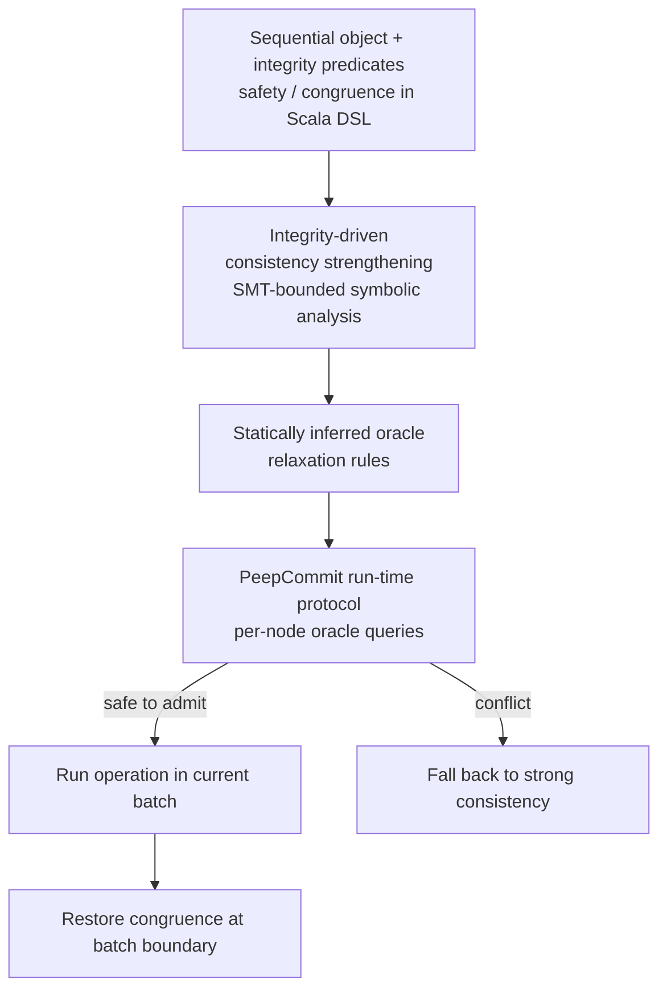

# Daily Scholar Papers Report — 2026-06-26

**[Download PDF](Daily_Papers_Report_2026-06-26.pdf)**

**Window covered:** 2026-06-25 → 2026-06-26 (Google Scholar alerts + user-curated self-emails, last 24 h)

---

## Executive Summary

A *formal-foundations* day. Two Outstanding picks share a single methodological move: turn an empirical practice into a small, checkable property and let an existing engine do the heavy lifting. **OTF (On-the-Fly Compiler Feedback for Rust)** (Venev, Mündler, He, Song, Vechev — ETH SRI, ICML 2026 submission) introduces a lightweight *extractor* that converts partial Rust code into compilable code, lets the production rustc serve as a prefix checker, and proves the resulting checker is complete whenever the extractor is conservative. Across six frontier and open-weight LLMs the method cuts synthesis-task compiler errors from VANILLA 56.7-93.2% down to OTF 5.0-61.7%, beats end-of-output FINAL feedback by up to 16.6 percentage points, and on GPT-5.3 nearly halves runtime (36.81s → 16.91s). **Peepco** (Kuraj, Feser, Polikarpova, Solar-Lezama — PACMPL OOPSLA1, April 2025, CC-BY 4.0) introduces *batch-based consistency*: programmers declare two integrity property classes (safety + congruence) and a new SMT-bounded analysis derives the weakest consistency that preserves them, while the PeepCommit run-time protocol consults a shared oracle to admit operations into a batch in any safe order. Headline gain: 2.6× speedup on a bank workload with infrequent total-order operations, 2.5× over SC-analysis on partial-replication Bank(w,d,s), and 2.7× over leader-based Hamsaz on its own configuration.

**Outstanding:** 2 · **Keep:** 0 · **Borderline High-Priority:** 0

---

## Highlighted Papers

| # | Title | Authors | Venue | Link |
|---|---|---|---|---|
| 1.1 | LLM-Based Rust Code Generation with On-the-Fly Compiler Feedback | H. Venev, N. Mündler, J. He, D. Song, M. Vechev | ICML 2026 submission (anonymous OpenReview) | [OpenReview PDF](https://openreview.net/pdf?id=CeOC6w3gPj) |
| 1.2 | Peepco: Batch-Based Consistency Optimization | I. Kuraj, J. Feser, N. Polikarpova, A. Solar-Lezama | PACMPL OOPSLA1, Article 119, April 2025 | [DOI 10.1145/3720513](https://doi.org/10.1145/3720513) · [local PDF](../../papers/Peepco_Kuraj_2025.pdf) |

---

## 1. Outstanding

<details class="paper-card" markdown>
<summary><strong>1.1</strong> · <span class="topic-chip">LLM CODE GEN + COMPILER FEEDBACK</span> · ICML 2026 submission — extractor converts partial Rust into compilable code so rustc itself becomes the prefix checker; cuts synthesis compiler errors from 56.7-93.2% (VANILLA) to 5.0-61.7% (OTF) across 6 LLMs, halves GPT-5.3 runtime 36.81s → 16.91s<span class="feedback-buttons"><a href="https://github.com/MarkLee131/paper-digest/issues/new?title=%5Bfeedback%5D+2026-06-26-1.1+ICML+2026+submission+%E2%80%94+extractor+converts+partial+Rust+into+compilable+code+so+rustc+itself+becomes+the+prefix+checker%3B+cuts+synthesis+compiler+errors+from+56.7-93.2%25+%28VANILLA%29+to+5.0-61.7%25+%28OTF%29+across+6+LLMs%2C+halves+GPT-5.3+runtime+36.81s+%E2%86%92+16.91s+%F0%9F%91%8D&body=paper_id%3A+2026-06-26-1.1%0Atitle%3A+ICML+2026+submission+%E2%80%94+extractor+converts+partial+Rust+into+compilable+code+so+rustc+itself+becomes+the+prefix+checker%3B+cuts+synthesis+compiler+errors+from+56.7-93.2%25+%28VANILLA%29+to+5.0-61.7%25+%28OTF%29+across+6+LLMs%2C+halves+GPT-5.3+runtime+36.81s+%E2%86%92+16.91s%0Aauthors%3A+%23%23%23+1.1+%5BLLM-Based+Rust+Code+Generation+with+On-the-Fly+Compiler+Feedback%5D%28https%3A%2F%2Fopenreview.net%2Fpdf%3Fid%3DCeOC6w3gPj%29+%E2%80%94+Venev%2C+M%C3%BCndler%2C+He%2C+Song%2C+Vechev+%28ETH+SRI%29%2C+ICML+2026+submission%2C+2026%0Avenue%3A+preprint%0Atopic%3A+LLM+CODE+GEN+%2B+COMPILER+FEEDBACK%0Arating%3A+thumbs-up%0A%0A%3C%21--+Optional+notes+below+this+line+are+read+by+preferences.py+as+soft+signals.+--%3E%0A&labels=feedback%2Cthumbs-up" target="_blank" rel="noopener" class="fb-thumbs-up" title="thumbs up" onclick="event.stopPropagation()">👍</a><a href="https://github.com/MarkLee131/paper-digest/issues/new?title=%5Bfeedback%5D+2026-06-26-1.1+ICML+2026+submission+%E2%80%94+extractor+converts+partial+Rust+into+compilable+code+so+rustc+itself+becomes+the+prefix+checker%3B+cuts+synthesis+compiler+errors+from+56.7-93.2%25+%28VANILLA%29+to+5.0-61.7%25+%28OTF%29+across+6+LLMs%2C+halves+GPT-5.3+runtime+36.81s+%E2%86%92+16.91s+%F0%9F%AB%A5&body=paper_id%3A+2026-06-26-1.1%0Atitle%3A+ICML+2026+submission+%E2%80%94+extractor+converts+partial+Rust+into+compilable+code+so+rustc+itself+becomes+the+prefix+checker%3B+cuts+synthesis+compiler+errors+from+56.7-93.2%25+%28VANILLA%29+to+5.0-61.7%25+%28OTF%29+across+6+LLMs%2C+halves+GPT-5.3+runtime+36.81s+%E2%86%92+16.91s%0Aauthors%3A+%23%23%23+1.1+%5BLLM-Based+Rust+Code+Generation+with+On-the-Fly+Compiler+Feedback%5D%28https%3A%2F%2Fopenreview.net%2Fpdf%3Fid%3DCeOC6w3gPj%29+%E2%80%94+Venev%2C+M%C3%BCndler%2C+He%2C+Song%2C+Vechev+%28ETH+SRI%29%2C+ICML+2026+submission%2C+2026%0Avenue%3A+preprint%0Atopic%3A+LLM+CODE+GEN+%2B+COMPILER+FEEDBACK%0Arating%3A+thumbs-down%0A%0A%3C%21--+Optional+notes+below+this+line+are+read+by+preferences.py+as+soft+signals.+--%3E%0A&labels=feedback%2Cthumbs-down" target="_blank" rel="noopener" class="fb-thumbs-down" title="less interested" onclick="event.stopPropagation()">🫥</a><a href="https://github.com/MarkLee131/paper-digest/issues/new?title=%5Bfeedback%5D+2026-06-26-1.1+ICML+2026+submission+%E2%80%94+extractor+converts+partial+Rust+into+compilable+code+so+rustc+itself+becomes+the+prefix+checker%3B+cuts+synthesis+compiler+errors+from+56.7-93.2%25+%28VANILLA%29+to+5.0-61.7%25+%28OTF%29+across+6+LLMs%2C+halves+GPT-5.3+runtime+36.81s+%E2%86%92+16.91s+%F0%9F%94%96&body=paper_id%3A+2026-06-26-1.1%0Atitle%3A+ICML+2026+submission+%E2%80%94+extractor+converts+partial+Rust+into+compilable+code+so+rustc+itself+becomes+the+prefix+checker%3B+cuts+synthesis+compiler+errors+from+56.7-93.2%25+%28VANILLA%29+to+5.0-61.7%25+%28OTF%29+across+6+LLMs%2C+halves+GPT-5.3+runtime+36.81s+%E2%86%92+16.91s%0Aauthors%3A+%23%23%23+1.1+%5BLLM-Based+Rust+Code+Generation+with+On-the-Fly+Compiler+Feedback%5D%28https%3A%2F%2Fopenreview.net%2Fpdf%3Fid%3DCeOC6w3gPj%29+%E2%80%94+Venev%2C+M%C3%BCndler%2C+He%2C+Song%2C+Vechev+%28ETH+SRI%29%2C+ICML+2026+submission%2C+2026%0Avenue%3A+preprint%0Atopic%3A+LLM+CODE+GEN+%2B+COMPILER+FEEDBACK%0Arating%3A+save-for-later%0A%0A%3C%21--+Optional+notes+below+this+line+are+read+by+preferences.py+as+soft+signals.+--%3E%0A&labels=feedback%2Csave-for-later" target="_blank" rel="noopener" class="fb-save-for-later" title="save for later" onclick="event.stopPropagation()">🔖</a></span></summary>

### 1.1 [LLM-Based Rust Code Generation with On-the-Fly Compiler Feedback](https://openreview.net/pdf?id=CeOC6w3gPj) — Venev, Mündler, He, Song, Vechev (ETH SRI), ICML 2026 submission, 2026

**Authors.** Hristo Venev, Niels Mündler, Jingxuan He, Dawn Song, Martin Vechev (ETH Zürich SRI Lab; co-authorship pattern with UC Berkeley).
**Venue.** Anonymous OpenReview submission `CeOC6w3gPj` under "Deep Learning for Code: Towards Human-Level Coding" workshop track; PDF footer: "Preliminary work. Under review by the International Conference on Machine Learning (ICML)."
**License.** OpenReview submission — no explicit CC label; no figure embedding; Mermaid recreation only.

**Problem.** LLM code generation for strongly typed languages (Rust) is bottlenecked by *when* compiler feedback arrives. End-of-output (FINAL) feedback waits for full generation, doubling-to-tripling runtime in frontier models. Constrained-decoding alternatives need a hand-built prefix checker for the entire language (significant effort even for TypeScript subsets) plus white-box LLM access. The paper aims for the middle ground: token-level early feedback that reuses the production compiler unchanged.

**Approach — extractor-as-prefix-checker.**

1. Define an *extractor* `E : Σ* → Σ*` that converts partial Rust code into compilable Rust by closing partially generated syntactic structures with type-preserving placeholders.
2. Compose with the standard Rust compiler `C` to obtain a prefix checker `P_E(s) = C(E(s))`.
3. Run black-box LLM decoding with `P_E` inside the inner sampling loop; on rejection, append partial code + compiler feedback to the prompt and resample.
4. Post-process compiler feedback to suppress extractor-induced errors (missing generic type annotations, missing trait items in open `impl` blocks, undefined functions referenced before later definition).
5. Refine call extraction using rust-lang type information — query callee type, extract correct argument count from the function signature.

**Formal characterisation (paper-cited).**

The paper proves two lemmas that anchor the construction:

- *Lemma 1.* "If the prefix checker `P` is complete, then Algorithm 2 is complete and minimally invasive."
- *Lemma 2.* "If extractor `E` is conservative, then the prefix checker `P_E(s) = C(E(s))` is complete."

Conservativeness is stated formally as: `∀s, E(s) ∉ L → (∀x, s ◦ x ∉ L)` — the extractor produces invalid output only for partial outputs that have no valid completion.

Core extractor rules (paper Figure 2, reproduced verbatim):

- **ASS:** `e0 = e  ↦  e0 = { E(e); __X() }`
- **IF:** `if e0 { e1 } else { e  ↦  if e0 { e1 } else { E(e); __X() }`
- **WH:** `while e0 { e  ↦  while e0 { E(e); panic!() }`
- **CA / CR:** method call argument extraction with arity refinement from compiler-resolved callee type.

The WH rule's `panic!()` insertion is the elegant case: it tells rustc "no second iteration to validate" so the borrow checker does not flag the body for using a moved-out mutable that the loop would reinitialise on the next iteration.

**Approach diagram (Mermaid recreation; no embedded figures).**

```mermaid
flowchart LR
    A[LLM partial token stream s] --> B[Extractor E]
    B -->|completed code E(s)| C[Rust compiler C]
    C -->|errors / refinements| D[Post-processing<br/>suppress expected extractor-induced errors]
    D -->|accept| E[Continue sampling next token]
    D -->|reject| F[Append s + feedback to prompt → restart]
    C -->|type info on callees| B
```

**Headline numbers — verbatim.**

- "on code synthesis our method achieves a 50% reduction in runtime and 11% improvement in functional correctness."
- "OTF effectively decreases compiler errors compared to standard code generation (VANILLA) by on average 48.8% in the synthesis task and 28.0% in the translation task."
- "Compared to the baseline of standard compiler feedback (FINAL), it achieves an average reduction of 16.6% and 8.7% in errors on the two tasks respectively."
- "Qwen 397B reducing compiler errors in the synthesis task by relative 58.3% compared to the baseline."

**Per-model synthesis results (paper Table 1, verbatim).**

| Model | VANILLA errors | FINAL errors | OTF errors | FINAL runtime (s, overhead) | OTF runtime (s, overhead) |
|---|---|---|---|---|---|
| GPT 5.3 | 56.7% | 21.7% | 5.0% | 36.81 (307%) | 16.91 (87%) |
| Sonnet 4.6 | 66.7% | 25.0% | 6.7% | 56.78 (391%) | 25.96 (124%) |
| Kimi K2 | 75.0% | 53.3% | 38.3% | 119.69 (577%) | 43.00 (143%) |
| Qwen 397B | 78.3% | 33.3% | 20.0% | 188.48 (210%) | 184.51 (203%) |
| Qwen 27B | 86.7% | 55.0% | 31.7% | 297.59 (162%) | 340.77 (201%) |
| Qwen 9B | 93.2% | 75.0% | 61.7% | 179.20 (351%) | 112.89 (184%) |

**Benchmark contribution.** A PI -U PGRADE — a new 30-task command-line-application synthesis benchmark designed so the third-party libraries the LLM must use changed their public APIs *after* the model knowledge cutoff. This forces the LLM to consume compiler feedback (about unknown methods, changed signatures) rather than recall from memory. Translation evaluation reuses CRUST (100 C libraries, 284 single-file completion tasks).

**Why Outstanding.**

- *Formal anchor.* Completeness and conservativeness lemmas tie each extractor rule to a property the rest of the system can rely on — rare in the LLM-code-feedback literature.
- *Black-box applicability.* Unlike constrained decoding, OTF needs neither white-box LLM access nor a hand-coded prefix checker for the entire language. Per-AST-node extractor cases are small and the production compiler does the heavy lifting.
- *Latency / coverage Pareto shift.* OTF restarts continue to improve correctness past 5 iterations (where FINAL saturates) because each restart resolves *one* error early and adds only a small token increment — Figure 5b confirms 10-iteration runway.
- *Honest negative results.* Sonnet 4.6 functional correctness on Translation is slightly worse for OTF than FINAL (12.3% vs 16.5%); the paper flags this rather than hiding it. Qwen 27B Translation runtime is also higher under OTF than FINAL.
- *Domain transferability claim is principled.* The extractor framework requires only a complete checker `C` and a small per-language extractor — directly applicable to any language whose checker is monolithic but whose AST closures are tractable (Scala, Swift, Kotlin, C++ with concept-checking).

**Caveats.**

- Post-processing suppresses errors related to missing type annotations, missing trait items, and undefined function calls. The undefined-function suppression is the most consequential — it also masks hallucinated function calls (the paper's §7 names this explicitly as a future-work item).
- Because borrow checking depends on successful type checking, suppressed type-annotation errors cascade past borrow checking too — precision/completeness tradeoff is honest but real.
- Anonymous submission; final venue, artefact availability, and reproducibility status unknown until the ICML decision posts.

**Closing-line verbatim.** "These results suggest that our on-the-fly compiler feedback is a practical way to improve LLM code generation for languages with expressive type systems."

</details>

<details class="paper-card" markdown>
<summary><strong>1.2</strong> · <span class="topic-chip">DISTRIBUTED CONSISTENCY</span> · PACMPL OOPSLA1 2025 (CC-BY 4.0) — batch-based consistency with SMT-bounded analysis + run-time PeepCommit oracle; programmer declares safety + congruence predicates; 2.6× speedup on Bank with infrequent interest, 2.5× over SC-analysis on partial-replication, 2.7× over leader-based Hamsaz<span class="feedback-buttons"><a href="https://github.com/MarkLee131/paper-digest/issues/new?title=%5Bfeedback%5D+2026-06-26-1.2+PACMPL+OOPSLA1+2025+%28CC-BY+4.0%29+%E2%80%94+batch-based+consistency+with+SMT-bounded+analysis+%2B+run-time+PeepCommit+oracle%3B+programmer+declares+safety+%2B+congruence+predicates%3B+2.6%C3%97+speedup+on+Bank+with+infrequent+interest%2C+2.5%C3%97+over+SC-analysis+on+partial-replication%2C+2.7%C3%97+over+leader-based+Hamsaz+%F0%9F%91%8D&body=paper_id%3A+2026-06-26-1.2%0Atitle%3A+PACMPL+OOPSLA1+2025+%28CC-BY+4.0%29+%E2%80%94+batch-based+consistency+with+SMT-bounded+analysis+%2B+run-time+PeepCommit+oracle%3B+programmer+declares+safety+%2B+congruence+predicates%3B+2.6%C3%97+speedup+on+Bank+with+infrequent+interest%2C+2.5%C3%97+over+SC-analysis+on+partial-replication%2C+2.7%C3%97+over+leader-based+Hamsaz%0Aauthors%3A+%23%23%23+1.2+%5BPeepco%3A+Batch-Based+Consistency+Optimization%5D%28https%3A%2F%2Fdoi.org%2F10.1145%2F3720513%29+%E2%80%94+Kuraj%2C+Feser%2C+Polikarpova%2C+Solar-Lezama%2C+PACMPL+OOPSLA1%2C+Article+119%2C+April+2025%0Avenue%3A+preprint%0Atopic%3A+DISTRIBUTED+CONSISTENCY%0Arating%3A+thumbs-up%0A%0A%3C%21--+Optional+notes+below+this+line+are+read+by+preferences.py+as+soft+signals.+--%3E%0A&labels=feedback%2Cthumbs-up" target="_blank" rel="noopener" class="fb-thumbs-up" title="thumbs up" onclick="event.stopPropagation()">👍</a><a href="https://github.com/MarkLee131/paper-digest/issues/new?title=%5Bfeedback%5D+2026-06-26-1.2+PACMPL+OOPSLA1+2025+%28CC-BY+4.0%29+%E2%80%94+batch-based+consistency+with+SMT-bounded+analysis+%2B+run-time+PeepCommit+oracle%3B+programmer+declares+safety+%2B+congruence+predicates%3B+2.6%C3%97+speedup+on+Bank+with+infrequent+interest%2C+2.5%C3%97+over+SC-analysis+on+partial-replication%2C+2.7%C3%97+over+leader-based+Hamsaz+%F0%9F%AB%A5&body=paper_id%3A+2026-06-26-1.2%0Atitle%3A+PACMPL+OOPSLA1+2025+%28CC-BY+4.0%29+%E2%80%94+batch-based+consistency+with+SMT-bounded+analysis+%2B+run-time+PeepCommit+oracle%3B+programmer+declares+safety+%2B+congruence+predicates%3B+2.6%C3%97+speedup+on+Bank+with+infrequent+interest%2C+2.5%C3%97+over+SC-analysis+on+partial-replication%2C+2.7%C3%97+over+leader-based+Hamsaz%0Aauthors%3A+%23%23%23+1.2+%5BPeepco%3A+Batch-Based+Consistency+Optimization%5D%28https%3A%2F%2Fdoi.org%2F10.1145%2F3720513%29+%E2%80%94+Kuraj%2C+Feser%2C+Polikarpova%2C+Solar-Lezama%2C+PACMPL+OOPSLA1%2C+Article+119%2C+April+2025%0Avenue%3A+preprint%0Atopic%3A+DISTRIBUTED+CONSISTENCY%0Arating%3A+thumbs-down%0A%0A%3C%21--+Optional+notes+below+this+line+are+read+by+preferences.py+as+soft+signals.+--%3E%0A&labels=feedback%2Cthumbs-down" target="_blank" rel="noopener" class="fb-thumbs-down" title="less interested" onclick="event.stopPropagation()">🫥</a><a href="https://github.com/MarkLee131/paper-digest/issues/new?title=%5Bfeedback%5D+2026-06-26-1.2+PACMPL+OOPSLA1+2025+%28CC-BY+4.0%29+%E2%80%94+batch-based+consistency+with+SMT-bounded+analysis+%2B+run-time+PeepCommit+oracle%3B+programmer+declares+safety+%2B+congruence+predicates%3B+2.6%C3%97+speedup+on+Bank+with+infrequent+interest%2C+2.5%C3%97+over+SC-analysis+on+partial-replication%2C+2.7%C3%97+over+leader-based+Hamsaz+%F0%9F%94%96&body=paper_id%3A+2026-06-26-1.2%0Atitle%3A+PACMPL+OOPSLA1+2025+%28CC-BY+4.0%29+%E2%80%94+batch-based+consistency+with+SMT-bounded+analysis+%2B+run-time+PeepCommit+oracle%3B+programmer+declares+safety+%2B+congruence+predicates%3B+2.6%C3%97+speedup+on+Bank+with+infrequent+interest%2C+2.5%C3%97+over+SC-analysis+on+partial-replication%2C+2.7%C3%97+over+leader-based+Hamsaz%0Aauthors%3A+%23%23%23+1.2+%5BPeepco%3A+Batch-Based+Consistency+Optimization%5D%28https%3A%2F%2Fdoi.org%2F10.1145%2F3720513%29+%E2%80%94+Kuraj%2C+Feser%2C+Polikarpova%2C+Solar-Lezama%2C+PACMPL+OOPSLA1%2C+Article+119%2C+April+2025%0Avenue%3A+preprint%0Atopic%3A+DISTRIBUTED+CONSISTENCY%0Arating%3A+save-for-later%0A%0A%3C%21--+Optional+notes+below+this+line+are+read+by+preferences.py+as+soft+signals.+--%3E%0A&labels=feedback%2Csave-for-later" target="_blank" rel="noopener" class="fb-save-for-later" title="save for later" onclick="event.stopPropagation()">🔖</a></span></summary>

### 1.2 [Peepco: Batch-Based Consistency Optimization](https://doi.org/10.1145/3720513) — Kuraj, Feser, Polikarpova, Solar-Lezama, PACMPL OOPSLA1, Article 119, April 2025

**Authors.** Ivan Kuraj (MIT), John Feser (Basis), Nadia Polikarpova (UC San Diego), Armando Solar-Lezama (MIT).
**Venue.** *Proc. ACM Program. Lang.* 9, OOPSLA1, Article 119, April 2025 — [DOI 10.1145/3720513](https://doi.org/10.1145/3720513). 29 pages.
**License.** Creative Commons Attribution 4.0 International (CC-BY 4.0) — author-deposited preprint mirrored at [`docs/papers/Peepco_Kuraj_2025.pdf`](../../papers/Peepco_Kuraj_2025.pdf).
**Why surfaced today.** Late Scholar alert under the Solar-Lezama feed — typical for OOPSLA papers as ACM DL crawls re-index.

**Problem.** Consistency optimisation for replicated data has historically been static-only (Quelea, Q9, Hamsaz, Atropos). A static analyser must conservatively pick the worst-case interleaving across all possible run-time inputs and resort to strong consistency whenever some unsafe interleaving exists — even if that interleaving never occurs in practice. The result over-coordinates the common case. Run-time approaches (Sieve, Olisipo, Warranties, Homestasis) reduce coordination but typically require explicit consistency annotations per operation.

**Approach — batch-based consistency + run-time oracle.**

1. **Batch-based consistency model.** Programmer declares two integrity property classes:
    - *Safety* — invariants that must hold in every state (e.g. `bal ≥ 0`).
    - *Congruence* — invariants that must be restored periodically at batch boundaries (e.g. `bal` equal across replicas, but ordering of `hist` not).

    Together they parameterise a custom point on the consistency lattice between eventual and strong consistency.
2. **PeepCommit protocol.** New round-based distributed algorithm. Nodes consult a shared oracle locally to admit an operation into the current batch only if (i) the oracle allows concurrent execution and (ii) operation ordering with already-admitted operations is respected. Falls back to strong consistency for conflicting operations. Both blocking and non-blocking (FTPeepCommit, crash-resilient) variants are presented.
3. **Integrity-driven consistency strengthening.** New SMT-based bounded symbolic analysis algorithm. For bounded executions of operation sets derived from sequential objects, it incrementally builds the weakest set of consistency requirements under which operations can safely reorder — aggressively pruning via symmetry breaking.
4. **Partial replication.** Extension that allows splitting data across nodes (e.g. front-end balance vs back-end ledger) — needed for sharded backends and local-first frontends.
5. **Implementation.** Scala embedded DSL frontend, code synthesiser, JVM-based run-time. Programmer specifies behaviour, data allocation, and integrity properties orthogonally.

**Approach diagram (Mermaid recreation; figure embedding deferred this run).**



**Spec example (paper Fig. 4, verbatim).**

```scala
replicate({bal, hist}, N)
safe  ∀n ∈ N. bal[n] ≥ 0 && sum(hist[n]) ≥ 0
congr ∀na, nb ∈ N. bal[na] == bal[nb] && sum(hist[na]) == sum(hist[nb])
```

The congruence predicate requires equality only on `sum(hist)`, not on `hist` itself — this is the lever the run-time oracle exploits to admit concurrent deposit batches that would force strong consistency under prior static-only analysis (Quelea / Q9 / Hamsaz).

**Headline numbers — verbatim.**

- "Peepco's speedup increases to 2.6× because the only method that requires total order (interest) is present infrequently causing fewer aborts when the other two methods are invoked." (Bank(w,d,i), skewed workload)
- "Peepco achieves a speed-up of 2.5× over SC-analysis as it avoids coordination only for queries." (partially-replicated Bank(w,d,s))
- "The average throughput was 12,7 and 4,6 in the case of Peepco and Hamsaz, respectively, suggesting the performance gains of batch-based consistency, of 2.7x, outweigh the advantages of leader-based consensus approaches." (4 nodes, θ=0.99, single-object Hamsaz config)
- "incurring 2.1x to 1.7x for 120 and 480 clients compared to not optimizing with Peepco" — non-blocking FTPeepCommit Bank workload.
- Sensitivity: batch size b=7 vs b=1 delivers up to 1.5× speedup as client count grows; b=1 ≈ strong-consistency baseline within 5%.

**Why Outstanding.**

- *Hybrid static + dynamic that does not introduce verification gaps.* Bounded SMT gives an unsound-free oracle; the oracle then exploits run-time information the static analyser cannot see. Lower programmer burden than Sieve/Olisipo (no per-operation annotations) and finer-grained than Quelea/Q9/Hamsaz (no global worst-case coordination).
- *Spec is small.* Two integrity predicates encode the bank-account workload; CISE/Indigo-style tagged-conflict approaches grow annotation burden quadratically.
- *Operational artefact.* JVM run-time + Scala DSL — directly reusable; ships both blocking and crash-resilient protocol variants.
- *Thorough prior-art positioning.* §7 explicitly enumerates the delta against Quelea, Q9, Hamsaz, Hampa, ECROs, Atropos, Sieve, Olisipo, Warranties, Homestasis, CISE, Indigo, IPA, Carol, MixT, Calvin, Coco, deterministic databases, Bailis-staleness, Pileus tuning, MRDTs, Quark, Peepul, Katara, PRACTI — a rare display of self-aware positioning in distributed systems papers.

**Caveats.**

- "Bounded" SMT means the analysis can miss optimisation opportunities but never produces unsound executions — explicitly acknowledged in §1.
- Beneficiary class is narrow: applications that admit weak consistency see *negative* gains because Peepco still runs its coordination protocol unnecessarily; Peepco's static analysis output is positioned as a *suggestion* to programmers to switch to weak consistency when appropriate (§3).
- High-contention workloads (θ=0.9 Zipfian) degrade because batches fill faster — Figure 18a.
- Implementation does not handle loops in operation bodies (§7).

**Closing-line verbatim.** "Our evaluation shows the approach can bring significant performance benefits over the state-of-the-art, especially in cases where operations might conflict only with relatively few other operations or their parts."

</details>

---

## Cross-Paper Synthesis

Both Outstanding papers share a structural move worth naming: *let an existing, expensive engine do the heavy lifting, and add a small front-end that makes it usable in a previously-impossible setting.*

- **OTF** does not reimplement rustc as a prefix checker; it adds a small per-AST-node *extractor* that converts partial code into compilable code, then runs unchanged rustc. The hard work — Rust's type system, borrow checker, lifetime validator — stays in the official compiler. The novelty lives in two lemmas (completeness + conservativeness) and one engineering insight (post-processing classifies expected vs unexpected errors).
- **Peepco** does not invent a new theorem prover or a new distributed protocol from scratch in the strict sense; it builds a *bounded* SMT-based analysis (using existing SMT machinery) and a *batched* coordination protocol (using consensus primitives) on top of a small programmer-facing surface (two predicate classes). The hard work — symbolic reasoning, distributed agreement — stays in well-tested infrastructure. The novelty lives in the consistency-strengthening algorithm and the oracle interface to PeepCommit.

The contrast with saturated DL-for-vuln papers in recent windows is instructive: those papers typically train (yet another) model and report (yet another) F1 on (yet another) benchmark. Today's Outstanding cohort instead identifies a small mechanism — a per-AST extractor rule, a per-batch oracle query — that composes with a powerful existing engine to enable a regime the engine alone could not reach. The lemmas in OTF and the integrity-property surface in Peepco are what make those compositions trustworthy, not the engines themselves.

A second cross-cut: both papers explicitly enumerate where they *don't* improve. OTF reports Sonnet-4.6 Translation regression under OTF vs FINAL; Peepco reports negative-net cases for apps that already admit weak consistency. This kind of honest negative-region reporting is increasingly rare in 2026's prolific LLM-coding literature — both should be cited as exemplars when reviewing future submissions in the same areas.

---

## Writing & Rationale Insights

The two Outstanding entries surface a writing lesson worth carrying forward: *expose the smallest non-trivial property the rest of your system depends on, name it, and prove it.* OTF's "conservativeness" property of the extractor is one English sentence and one logical formula. Peepco's separation of "safety" and "congruence" predicate classes is similarly compact. In both papers, the reader can construct a mental model of the whole system from these two-or-three handles. By contrast, the two Skipped papers today rely on *aggregate* claims ("we evaluate prompting strategies", "we use GBDT features") that do not reveal a checkable property — which is exactly why neither paper transfers a reusable mechanism.

A second writing-craft note: Peepco's Related Work (§7) reads as an *atlas* rather than a defence. The authors enumerate each predecessor and state, in one sentence each, what Peepco's marginal contribution is over that predecessor. For a 25-year-old subfield, this is the only honest way to do positioning; the alternative ("we are different because we are new") is unconvincing. OTF takes a similar approach in §6, separating training-time methods (Wang 2022, Deligiannis 2023), constrained decoding (Mündler 2025, Beurer-Kellner 2024), and project-level repair (Bi 2024). Future digests should flag papers whose Related Work cannot articulate a per-predecessor delta as suspect on novelty grounds, even if the empirical headlines look strong.
