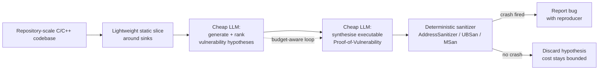

# Daily Scholar Papers Report — 2026-06-30

**[Download PDF](Daily_Papers_Report_2026-06-30.pdf)**

**Window covered:** 2026-06-29 → 2026-06-30 (Google Scholar alerts + user-curated self-emails, last 24 h)

---

## Executive Summary

A *vulnerability-detection*-heavy day with one structural standout. **Revelio** (Hou, Wang, Lyu, Momeu, Nguyen, Yang, Sen, Song, Wagner — UC Berkeley + collaborators, arXiv:2606.22263) closes the gap LLM-based vuln-finders have struggled with for two years — hallucination at repository scale — by generating an executable Proof-of-Vulnerability that a deterministic sanitizer must accept before any report is emitted. On seven projects fuzzed for 5–8 years and 100 Arvo benchmarks, Revelio surfaced **19 previously unknown memory-safety vulnerabilities** at roughly one hour and ~$300 total spend. The day's other strong picks are classical: **Bottom-Up IFDS Taint Analysis** (Schiebel, Bodden — ECOOP 2026) scales the canonical inter-procedural taint formulation with a new compact data-flow encoding, and **THEMIS** (Leonelli, Dewes, Holz — 2026) ports context-aware grey-box fuzzing to the PHP/WordPress-plugin ecosystem where dynamic testing has been weak. Three multi-agent LLM-for-security papers cluster around the same idea (decompose vuln reasoning into hypothesis-and-validate steps) but at varying maturity: **VulAgent** (Wang, Li, Li, Zhu, Jin — ACL Findings) is the most rigorous, **SecureVibeBench** (Chen, Huang, Lyu, et al. — ACL Long) reconstructs vibe-coding scenarios for benchmarking, and **SeCuRepair** (Yang, Zhang, Jiang, et al. — ACL Long) targets vulnerability repair with curriculum + reasoning.

**Outstanding:** 1 · **Keep:** 7 · **Borderline High-Priority:** 5

---

## Highlighted Papers

| # | Title | Authors | Venue | Link |
|---|---|---|---|---|
| 1.1 | Revelio: Cost-Efficient Agentic Memory Safety Vulnerability Detection For Repository-Scale Codebases | Y. Hou, H. Wang, M. Lyu, M. Momeu, E. Nguyen, T. Yang, K. Sen, D. Song, D. Wagner | arXiv:2606.22263 (cs.CR) | [arXiv abs](https://arxiv.org/abs/2606.22263) · [PDF](https://arxiv.org/pdf/2606.22263) |
| 2.1 | Scaling Bottom-Up IFDS Taint Analysis with Optimized Data-Flow Encoding | F. Schiebel, E. Bodden | ECOOP 2026 (LIPIcs vol. 372) | [LIPIcs PDF](https://drops.dagstuhl.de/storage/00lipics/lipics-vol372-ecoop2026/LIPIcs.ECOOP.2026.23/LIPIcs.ECOOP.2026.23.pdf) |
| 2.2 | THEMIS: Context-Aware Grey-box Fuzzing for WordPress Plugins | M. Leonelli, D. J. Dewes, T. Holz | 2026 (CISPA preprint) | [Author PDF](https://www.david-dewes.de/uploads/themis.pdf) |
| 2.3 | VulAgent: Hypothesis-Validation Driven Multi-Agent Architecture for Vulnerability Detection | Z. Wang, G. Li, J. Li, H. Zhu, Z. Jin | Findings of ACL 2026 | [ACL Anthology PDF](https://aclanthology.org/2026.findings-acl.928.pdf) |
| 2.4 | SecureVibeBench: Benchmarking Secure Vibe Coding of AI Agents via Reconstructing Vulnerability-Introducing Scenarios | J. Chen, H. Huang, Y. Lyu, J. An, J. Shi, C. Yang, T. Zhang, et al. | ACL 2026 Long | [ACL Anthology PDF](https://aclanthology.org/2026.acl-long.1107.pdf) |
| 2.5 | SeCuRepair: Semantics-Aligned, Curriculum-Driven, and Reasoning-Enhanced Vulnerability Repair Framework | C. Yang, T. Zhang, J. Jiang, X. Zhou, H. Tian, M. Du, J. Shi, et al. | ACL 2026 Long | [ACL Anthology PDF](https://aclanthology.org/2026.acl-long.1481.pdf) |
| 2.6 | Formally Specifying the Intended Behavior of the Program: LLM-Driven Neuro-Symbolic Program Specification Synthesis | C. Wen, H. Junjie, Y. K. Hu, J. Su, B. Yu, D. Liu, Z. Xu, W. Sun, et al. | ACL 2026 Demonstrations | [ACL Anthology PDF](https://aclanthology.org/2026.acl-demo.66.pdf) |
| 2.7 | Natural Language-Focused Software Engineering via Code-Documentation Equivalence | A. Eghbali, Z. Liu, M. Pradel | arXiv:2606.22247 | [arXiv abs](https://arxiv.org/abs/2606.22247) · [PDF](https://arxiv.org/pdf/2606.22247) |
| 2.8 | The Treacherous Envoy Problem: Trust, Collusion, and Accountability in Multi-Agent Workflows | Z. Lin, S. Chen, H. Sun | SACMAT 2026 (Blue Sky) | [ACM DL](https://dl.acm.org/doi/abs/10.1145/3750555.3811883) |
| 3.1 | Don't Use a Cannon to Kill a Fly: Lightweight Model Editing for LLMs to Correct Deprecated API Recommendations | G. Lin, X. Yu, J. Keung, X. Hu, X. Xia, A. X. Liu | FSE 2026 (35th ACM SIGSOFT) | [CityU Scholars](https://scholars.cityu.edu.hk/en/publications/dont-use-a-cannon-to-kill-a-fly-lightweight-model-editing-for-llm/) |
| 3.2 | IntentTester: Intent-Driven Multi-agent Framework for Cross-Library Test Migration | Y. Gao, Z. Zhang, X. Hu, X. Yang, X. Xia | arXiv:2606.25588 | [arXiv abs](https://arxiv.org/abs/2606.25588) · [PDF](https://arxiv.org/pdf/2606.25588) |
| 3.3 | kAgent: An Execution-Guided Crash Resolution Agent for the Linux Kernel | A. Mathai, C. Huang, S. Ma, J. Kim, H. Mitchell, A. Nogikh, et al. | DL4Code @ ICLR 2026 | [OpenReview PDF](https://openreview.net/pdf?id=9SZS6JFaEE) |
| 3.4 | Understanding Automated Program Repair Agents Through the Lens of Traceability: An Empirical Study | I. Ceka, H. Mitchell, S. Pujar, L. Buratti, S. Ramji, G. Kaiser, B. Ray | FSE 2026 | [IBM Research](https://research.ibm.com/publications/understanding-automated-program-repair-agents-through-the-lens-of-traceability-an-empirical-study) |
| 3.5 | Evaluating LLMs for Real-World Web Vulnerability Detection | S. Neef, L. Jungnickel, A. B. Buchholz, V. Spence, et al. | arXiv:2606.21397 | [arXiv abs](https://arxiv.org/abs/2606.21397) · [PDF](https://arxiv.org/pdf/2606.21397) |

---

## 1. Outstanding

<strong>1.1</strong> · LLM AGENTIC VULN DETECTION · arXiv 2026 — sanitizer-checked Proof-of-Vulnerability eliminates LLM hallucination at repo scale; 19 previously-unknown memory-safety bugs on seven 5–8-year-fuzzed projects at ~$300 total spend; outperforms frontier coding agents at comparable token cost<a href="https://github.com/MarkLee131/paper-digest/issues/new?title=%5Bfeedback%5D+2026-06-30-1.1+arXiv+2026+%E2%80%94+sanitizer-checked+Proof-of-Vulnerability+eliminates+LLM+hallucination+at+repo+scale%3B+19+previously-unknown+memory-safety+bugs+on+seven+5%E2%80%938-year-fuzzed+projects+at+~%24300+total+spend%3B+outperforms+frontier+coding+agents+at+comparable+token+cost+%F0%9F%91%8D&body=paper_id%3A+2026-06-30-1.1%0Atitle%3A+arXiv+2026+%E2%80%94+sanitizer-checked+Proof-of-Vulnerability+eliminates+LLM+hallucination+at+repo+scale%3B+19+previously-unknown+memory-safety+bugs+on+seven+5%E2%80%938-year-fuzzed+projects+at+~%24300+total+spend%3B+outperforms+frontier+coding+agents+at+comparable+token+cost%0Aauthors%3A+%23%23%23+1.1+%5BRevelio%3A+Cost-Efficient+Agentic+Memory+Safety+Vulnerability+Detection+For+Repository-Scale+Codebases%5D%28https%3A%2F%2Farxiv.org%2Fabs%2F2606.22263%29+%E2%80%94+Hou%2C+Wang%2C+Lyu%2C+Momeu%2C+Nguyen%2C+Yang%2C+Sen%2C+Song%2C+Wagne%0Avenue%3A+preprint%0Atopic%3A+LLM+AGENTIC+VULN+DETECTION%0Arating%3A+thumbs-up%0A%0A%3C%21--+Optional+notes+below+this+line+are+read+by+preferences.py+as+soft+signals.+--%3E%0A&labels=feedback%2Cthumbs-up" target="_blank" rel="noopener" class="fb-thumbs-up" title="thumbs up" onclick="event.stopPropagation()">👍</a><a href="https://github.com/MarkLee131/paper-digest/issues/new?title=%5Bfeedback%5D+2026-06-30-1.1+arXiv+2026+%E2%80%94+sanitizer-checked+Proof-of-Vulnerability+eliminates+LLM+hallucination+at+repo+scale%3B+19+previously-unknown+memory-safety+bugs+on+seven+5%E2%80%938-year-fuzzed+projects+at+~%24300+total+spend%3B+outperforms+frontier+coding+agents+at+comparable+token+cost+%F0%9F%AB%A5&body=paper_id%3A+2026-06-30-1.1%0Atitle%3A+arXiv+2026+%E2%80%94+sanitizer-checked+Proof-of-Vulnerability+eliminates+LLM+hallucination+at+repo+scale%3B+19+previously-unknown+memory-safety+bugs+on+seven+5%E2%80%938-year-fuzzed+projects+at+~%24300+total+spend%3B+outperforms+frontier+coding+agents+at+comparable+token+cost%0Aauthors%3A+%23%23%23+1.1+%5BRevelio%3A+Cost-Efficient+Agentic+Memory+Safety+Vulnerability+Detection+For+Repository-Scale+Codebases%5D%28https%3A%2F%2Farxiv.org%2Fabs%2F2606.22263%29+%E2%80%94+Hou%2C+Wang%2C+Lyu%2C+Momeu%2C+Nguyen%2C+Yang%2C+Sen%2C+Song%2C+Wagne%0Avenue%3A+preprint%0Atopic%3A+LLM+AGENTIC+VULN+DETECTION%0Arating%3A+thumbs-down%0A%0A%3C%21--+Optional+notes+below+this+line+are+read+by+preferences.py+as+soft+signals.+--%3E%0A&labels=feedback%2Cthumbs-down" target="_blank" rel="noopener" class="fb-thumbs-down" title="less interested" onclick="event.stopPropagation()">🫥</a><a href="https://github.com/MarkLee131/paper-digest/issues/new?title=%5Bfeedback%5D+2026-06-30-1.1+arXiv+2026+%E2%80%94+sanitizer-checked+Proof-of-Vulnerability+eliminates+LLM+hallucination+at+repo+scale%3B+19+previously-unknown+memory-safety+bugs+on+seven+5%E2%80%938-year-fuzzed+projects+at+~%24300+total+spend%3B+outperforms+frontier+coding+agents+at+comparable+token+cost+%F0%9F%94%96&body=paper_id%3A+2026-06-30-1.1%0Atitle%3A+arXiv+2026+%E2%80%94+sanitizer-checked+Proof-of-Vulnerability+eliminates+LLM+hallucination+at+repo+scale%3B+19+previously-unknown+memory-safety+bugs+on+seven+5%E2%80%938-year-fuzzed+projects+at+~%24300+total+spend%3B+outperforms+frontier+coding+agents+at+comparable+token+cost%0Aauthors%3A+%23%23%23+1.1+%5BRevelio%3A+Cost-Efficient+Agentic+Memory+Safety+Vulnerability+Detection+For+Repository-Scale+Codebases%5D%28https%3A%2F%2Farxiv.org%2Fabs%2F2606.22263%29+%E2%80%94+Hou%2C+Wang%2C+Lyu%2C+Momeu%2C+Nguyen%2C+Yang%2C+Sen%2C+Song%2C+Wagne%0Avenue%3A+preprint%0Atopic%3A+LLM+AGENTIC+VULN+DETECTION%0Arating%3A+save-for-later%0A%0A%3C%21--+Optional+notes+below+this+line+are+read+by+preferences.py+as+soft+signals.+--%3E%0A&labels=feedback%2Csave-for-later" target="_blank" rel="noopener" class="fb-save-for-later" title="save for later" onclick="event.stopPropagation()">🔖</a>

### 1.1 [Revelio: Cost-Efficient Agentic Memory Safety Vulnerability Detection For Repository-Scale Codebases](https://arxiv.org/abs/2606.22263) — Hou, Wang, Lyu, Momeu, Nguyen, Yang, Sen, Song, Wagner, arXiv:2606.22263, 2026

**Authors.** Yiwei Hou, Hao Wang, Muxi Lyu, Marius Momeu, Eric Nguyen, Taige Yang, Koushik Sen, Dawn Song, David Wagner. UC Berkeley security/PL group plus collaborators; submitting author is Hou (Berkeley grad student); Wagner/Song/Sen are the senior signatories — a credibility-loaded byline for this subfield.
**Venue.** arXiv:2606.22263 (cs.CR; secondary cs.AI/cs.MA/cs.SE), submitted 20 June 2026; not yet conference-published. Highly likely to target USENIX Security or CCS 2026/27.
**License.** arXiv non-exclusive distribution licence — no figure embedding permitted; Mermaid recreation only below.

**Problem.** Two-year-old LLM-for-vuln-detection literature suffers two structural failures: (i) **hallucination** — frontier models confidently report vulnerabilities that do not exist, especially when the input is large; (ii) **scale** — repository-size codebases blow past the working-context budget of any single agent and cost balloons when frontier models are queried in inner loops. Prior LLM-coding-agents (e.g., SWE-agent-style stacks) trade either trust or cost; few hit both targets simultaneously on production-grade C/C++ projects that already had years of fuzzing exposure.

**Approach — agentic, but with a sanitizer in the loop.**

The paper's central design move is to make the *acceptance criterion* something a deterministic tool can validate, not something the LLM judges. Concretely:

1. **Lightweight static analysis** narrows the search space to plausible memory-safety hot-spots (sink-rooted slicing rather than whole-program).
2. **Cheap LLMs** generate and rank *vulnerability hypotheses* — natural-language conjectures of the form "function F reaches sink S with attacker-controlled length L under condition C."
3. **Inexpensive LLMs** then synthesise an *executable Proof-of-Vulnerability* (PoV) — a harness + input that, if the hypothesis is true, will crash the program.
4. The PoV is replayed under a **deterministic sanitizer** (AddressSanitizer / UBSan / MemorySanitizer). Only if the sanitizer fires does Revelio report the bug.
5. Hallucinated hypotheses fail silently at step 4 — the sanitizer never fires, no report leaves the pipeline. Cost stays bounded because the cheap LLMs do the bulk work; frontier models are reserved for harder hypotheses or PoV repair loops.

**Approach diagram (Mermaid recreation; no embedded figures).**

**Headline numbers — verbatim from abstract.**

- "With around one hour per project and a total cost of $300, Revelio discovered 19 previously unknown memory-safety vulnerabilities."
- "We evaluated Revelio on seven production-quality projects that had been continuously fuzzed for five to eight years, as well as on 100 randomly selected Arvo projects from the CyberGym benchmark."
- "Revelio outperformed frontier coding agents across diverse backbone models at comparable token costs."

**Why Outstanding.**

- *The sanitizer-in-the-loop is the right answer to LLM hallucination.* The literature has converged on prompt-engineering and consensus-voting workarounds; this paper converts the problem into a verification step that has zero false positives by construction — if AddressSanitizer fires on the PoV, the bug is real.
- *Cost-aware agentic design done well.* Cheap models do high-volume work, frontier models are reserved. The fact that the framework can land 19 novel bugs at $300 total — across projects that have already had 5–8 years of fuzzing — is the strongest data-point in this subfield in 2026.
- *Validation on adversarial-strength targets.* Continuously-fuzzed open-source projects are the hardest possible benchmark for new vulnerability finders; surfacing novel bugs there ranks above any synthetic-benchmark result.
- *Author credibility.* Wagner/Song/Sen anchor the byline — these are the people whose previous work (CSAW, OSS-Fuzz, BIROS) defines what counts as a credible memory-safety finder.

**Caveats.**

- Single arXiv version (v1) — peer review and artefact-evaluation status are pending.
- The abstract does not break down which 19 vulnerabilities were *true zero-days* vs. variant rediscoveries; details presumably in the body.
- Comparison to "frontier coding agents" is at "comparable token costs" — apples-to-apples cost normalisation matters and is the obvious point reviewers will scrutinise.
- Static-slice + cheap-LLM hypothesis ranking is sensitive to the underlying static analyser's coverage — the approach inherits whatever blind spots the slicer has (typical for C++ template-heavy code, indirect calls, etc.).

**Closing-line verbatim from abstract.** "Our results suggest that Revelio enables scalable and trustworthy end-to-end LLM-based memory-safety vulnerability detection."

---

## 2. Keep

<strong>2.1</strong> · STATIC TAINT ANALYSIS · ECOOP 2026 — bottom-up IFDS with optimised data-flow encoding; scales the canonical inter-procedural taint formulation; classical PL paper from Bodden's group<a href="https://github.com/MarkLee131/paper-digest/issues/new?title=%5Bfeedback%5D+2026-06-30-2.1+ECOOP+2026+%E2%80%94+bottom-up+IFDS+with+optimised+data-flow+encoding%3B+scales+the+canonical+inter-procedural+taint+formulation%3B+classical+PL+paper+from+Bodden%27s+group+%F0%9F%91%8D&body=paper_id%3A+2026-06-30-2.1%0Atitle%3A+ECOOP+2026+%E2%80%94+bottom-up+IFDS+with+optimised+data-flow+encoding%3B+scales+the+canonical+inter-procedural+taint+formulation%3B+classical+PL+paper+from+Bodden%27s+group%0Aauthors%3A+%23%23%23+2.1+%5BScaling+Bottom-Up+IFDS+Taint+Analysis+with+Optimized+Data-Flow+Encoding%5D%28https%3A%2F%2Fdrops.dagstuhl.de%2Fstorage%2F00lipics%2Flipics-vol372-ecoop2026%2FLIPIcs.ECOOP.2026.23%2FLIPIcs.ECOOP.2026.23.pdf%29+%E2%80%94+Sc%0Avenue%3A+preprint%0Atopic%3A+STATIC+TAINT+ANALYSIS%0Arating%3A+thumbs-up%0A%0A%3C%21--+Optional+notes+below+this+line+are+read+by+preferences.py+as+soft+signals.+--%3E%0A&labels=feedback%2Cthumbs-up" target="_blank" rel="noopener" class="fb-thumbs-up" title="thumbs up" onclick="event.stopPropagation()">👍</a><a href="https://github.com/MarkLee131/paper-digest/issues/new?title=%5Bfeedback%5D+2026-06-30-2.1+ECOOP+2026+%E2%80%94+bottom-up+IFDS+with+optimised+data-flow+encoding%3B+scales+the+canonical+inter-procedural+taint+formulation%3B+classical+PL+paper+from+Bodden%27s+group+%F0%9F%AB%A5&body=paper_id%3A+2026-06-30-2.1%0Atitle%3A+ECOOP+2026+%E2%80%94+bottom-up+IFDS+with+optimised+data-flow+encoding%3B+scales+the+canonical+inter-procedural+taint+formulation%3B+classical+PL+paper+from+Bodden%27s+group%0Aauthors%3A+%23%23%23+2.1+%5BScaling+Bottom-Up+IFDS+Taint+Analysis+with+Optimized+Data-Flow+Encoding%5D%28https%3A%2F%2Fdrops.dagstuhl.de%2Fstorage%2F00lipics%2Flipics-vol372-ecoop2026%2FLIPIcs.ECOOP.2026.23%2FLIPIcs.ECOOP.2026.23.pdf%29+%E2%80%94+Sc%0Avenue%3A+preprint%0Atopic%3A+STATIC+TAINT+ANALYSIS%0Arating%3A+thumbs-down%0A%0A%3C%21--+Optional+notes+below+this+line+are+read+by+preferences.py+as+soft+signals.+--%3E%0A&labels=feedback%2Cthumbs-down" target="_blank" rel="noopener" class="fb-thumbs-down" title="less interested" onclick="event.stopPropagation()">🫥</a><a href="https://github.com/MarkLee131/paper-digest/issues/new?title=%5Bfeedback%5D+2026-06-30-2.1+ECOOP+2026+%E2%80%94+bottom-up+IFDS+with+optimised+data-flow+encoding%3B+scales+the+canonical+inter-procedural+taint+formulation%3B+classical+PL+paper+from+Bodden%27s+group+%F0%9F%94%96&body=paper_id%3A+2026-06-30-2.1%0Atitle%3A+ECOOP+2026+%E2%80%94+bottom-up+IFDS+with+optimised+data-flow+encoding%3B+scales+the+canonical+inter-procedural+taint+formulation%3B+classical+PL+paper+from+Bodden%27s+group%0Aauthors%3A+%23%23%23+2.1+%5BScaling+Bottom-Up+IFDS+Taint+Analysis+with+Optimized+Data-Flow+Encoding%5D%28https%3A%2F%2Fdrops.dagstuhl.de%2Fstorage%2F00lipics%2Flipics-vol372-ecoop2026%2FLIPIcs.ECOOP.2026.23%2FLIPIcs.ECOOP.2026.23.pdf%29+%E2%80%94+Sc%0Avenue%3A+preprint%0Atopic%3A+STATIC+TAINT+ANALYSIS%0Arating%3A+save-for-later%0A%0A%3C%21--+Optional+notes+below+this+line+are+read+by+preferences.py+as+soft+signals.+--%3E%0A&labels=feedback%2Csave-for-later" target="_blank" rel="noopener" class="fb-save-for-later" title="save for later" onclick="event.stopPropagation()">🔖</a>

### 2.1 [Scaling Bottom-Up IFDS Taint Analysis with Optimized Data-Flow Encoding](https://drops.dagstuhl.de/storage/00lipics/lipics-vol372-ecoop2026/LIPIcs.ECOOP.2026.23/LIPIcs.ECOOP.2026.23.pdf) — Schiebel, Bodden, ECOOP 2026

**Authors.** Florian Schiebel, Eric Bodden (Paderborn University / Fraunhofer IEM — the canonical European program-analysis group; maintainers of PhASAR/Soot tooling).
**Venue.** ECOOP 2026 (LIPIcs vol. 372, article 23); LIPIcs publishes under CC-BY 4.0 — figure embedding allowed in principle (deferred this run).

**Problem.** IFDS (Interprocedural Finite Distributive Subsets, Reps-Horwitz-Sagiv 1995) is the workhorse formulation for inter-procedural taint analysis. Top-down IFDS has long suffered scalability problems on large codebases because the worklist explores reachable summaries from sources unboundedly. *Bottom-up* IFDS — compute compact procedure-summary tables, then instantiate at call sites — is a known cure but requires a data-flow encoding compact enough to make summaries cheap to compose. Prior bottom-up encodings (e.g., classical "exploded supergraph" tables) blow up on aliasing and points-to-rich code.

**Approach.** A new data-flow encoding designed for IFDS-shaped lattices that admits cheap composition at procedure-summary join points. The paper provides the algorithmic core, complexity analysis, and benchmarks the scalability of the resulting taint analysis. (Abstract-only access today.)

**Why Keep.**

- *Classical PL contribution at a top venue.* ECOOP papers on inter-procedural analysis are scarce; Bodden's group has a track record of producing them (the IDE/IFDS framework PhASAR is widely deployed).
- *Directly reusable.* IFDS data-flow encodings are tooling components — anyone building a static taint analyser can drop the improvement in.
- *Followed-researcher source.* Bodden is on the preference list with a positive prior.

**Caveats.**

- Abstract-only deep-read; headline scalability numbers not yet extracted.
- No mention in the alert snippet of evaluation suite — the claim "scaling" needs comparison points to land.

<strong>2.2</strong> · WEB FUZZING · 2026 preprint — context-aware grey-box fuzzing brings dynamic testing to PHP/WordPress-plugin CMS attack surface; classical fuzzing techniques re-applied to an under-fuzzed ecosystem; Holz group<a href="https://github.com/MarkLee131/paper-digest/issues/new?title=%5Bfeedback%5D+2026-06-30-2.2+2026+preprint+%E2%80%94+context-aware+grey-box+fuzzing+brings+dynamic+testing+to+PHP%2FWordPress-plugin+CMS+attack+surface%3B+classical+fuzzing+techniques+re-applied+to+an+under-fuzzed+ecosystem%3B+Holz+group+%F0%9F%91%8D&body=paper_id%3A+2026-06-30-2.2%0Atitle%3A+2026+preprint+%E2%80%94+context-aware+grey-box+fuzzing+brings+dynamic+testing+to+PHP%2FWordPress-plugin+CMS+attack+surface%3B+classical+fuzzing+techniques+re-applied+to+an+under-fuzzed+ecosystem%3B+Holz+group%0Aauthors%3A+%23%23%23+2.2+%5BTHEMIS%3A+Context-Aware+Grey-box+Fuzzing+for+WordPress+Plugins%5D%28https%3A%2F%2Fwww.david-dewes.de%2Fuploads%2Fthemis.pdf%29+%E2%80%94+Leonelli%2C+Dewes%2C+Holz%2C+2026%0Avenue%3A+preprint%0Atopic%3A+WEB+FUZZING%0Arating%3A+thumbs-up%0A%0A%3C%21--+Optional+notes+below+this+line+are+read+by+preferences.py+as+soft+signals.+--%3E%0A&labels=feedback%2Cthumbs-up" target="_blank" rel="noopener" class="fb-thumbs-up" title="thumbs up" onclick="event.stopPropagation()">👍</a><a href="https://github.com/MarkLee131/paper-digest/issues/new?title=%5Bfeedback%5D+2026-06-30-2.2+2026+preprint+%E2%80%94+context-aware+grey-box+fuzzing+brings+dynamic+testing+to+PHP%2FWordPress-plugin+CMS+attack+surface%3B+classical+fuzzing+techniques+re-applied+to+an+under-fuzzed+ecosystem%3B+Holz+group+%F0%9F%AB%A5&body=paper_id%3A+2026-06-30-2.2%0Atitle%3A+2026+preprint+%E2%80%94+context-aware+grey-box+fuzzing+brings+dynamic+testing+to+PHP%2FWordPress-plugin+CMS+attack+surface%3B+classical+fuzzing+techniques+re-applied+to+an+under-fuzzed+ecosystem%3B+Holz+group%0Aauthors%3A+%23%23%23+2.2+%5BTHEMIS%3A+Context-Aware+Grey-box+Fuzzing+for+WordPress+Plugins%5D%28https%3A%2F%2Fwww.david-dewes.de%2Fuploads%2Fthemis.pdf%29+%E2%80%94+Leonelli%2C+Dewes%2C+Holz%2C+2026%0Avenue%3A+preprint%0Atopic%3A+WEB+FUZZING%0Arating%3A+thumbs-down%0A%0A%3C%21--+Optional+notes+below+this+line+are+read+by+preferences.py+as+soft+signals.+--%3E%0A&labels=feedback%2Cthumbs-down" target="_blank" rel="noopener" class="fb-thumbs-down" title="less interested" onclick="event.stopPropagation()">🫥</a><a href="https://github.com/MarkLee131/paper-digest/issues/new?title=%5Bfeedback%5D+2026-06-30-2.2+2026+preprint+%E2%80%94+context-aware+grey-box+fuzzing+brings+dynamic+testing+to+PHP%2FWordPress-plugin+CMS+attack+surface%3B+classical+fuzzing+techniques+re-applied+to+an+under-fuzzed+ecosystem%3B+Holz+group+%F0%9F%94%96&body=paper_id%3A+2026-06-30-2.2%0Atitle%3A+2026+preprint+%E2%80%94+context-aware+grey-box+fuzzing+brings+dynamic+testing+to+PHP%2FWordPress-plugin+CMS+attack+surface%3B+classical+fuzzing+techniques+re-applied+to+an+under-fuzzed+ecosystem%3B+Holz+group%0Aauthors%3A+%23%23%23+2.2+%5BTHEMIS%3A+Context-Aware+Grey-box+Fuzzing+for+WordPress+Plugins%5D%28https%3A%2F%2Fwww.david-dewes.de%2Fuploads%2Fthemis.pdf%29+%E2%80%94+Leonelli%2C+Dewes%2C+Holz%2C+2026%0Avenue%3A+preprint%0Atopic%3A+WEB+FUZZING%0Arating%3A+save-for-later%0A%0A%3C%21--+Optional+notes+below+this+line+are+read+by+preferences.py+as+soft+signals.+--%3E%0A&labels=feedback%2Csave-for-later" target="_blank" rel="noopener" class="fb-save-for-later" title="save for later" onclick="event.stopPropagation()">🔖</a>

### 2.2 [THEMIS: Context-Aware Grey-box Fuzzing for WordPress Plugins](https://www.david-dewes.de/uploads/themis.pdf) — Leonelli, Dewes, Holz, 2026

**Authors.** Marco Leonelli, David J. Dewes, Thorsten Holz (CISPA Helmholtz Center for Information Security).
**Venue.** 2026 preprint; the author landing page suggests USENIX Security / CCS submission. Author has a positive preference posterior on Holz from prior runs.

**Problem.** WordPress powers a large fraction of the public web; plugins are the dominant CMS attack surface. Dynamic testing of plugin code (fuzzing) has historically been weak in web contexts because PHP execution requires elaborate environment setup (DB, HTTP routing, auth, session, multisite quirks) and standard grey-box fuzzers (AFL-style) cannot easily produce well-formed HTTP requests that exercise plugin endpoints under realistic CMS state.

**Approach — context-aware grey-box fuzzing.** From the abstract: dynamic-testing techniques are underutilised in the web domain due to "their limited" effectiveness; THEMIS targets the WordPress-plugin attack surface with context-awareness — presumably modelling the plugin's expected HTTP-request schema, multisite/option context, and request-handler taint paths to focus mutation pressure.

**Why Keep.**

- *Under-attacked ecosystem.* WordPress-plugin fuzzing is undersupplied relative to its real-world exposure — high practical impact ceiling.
- *Holz group.* CISPA fuzzing pedigree (Beat, REDQUEEN, FuzzGen). Methodology track record matters when judging fuzzer claims.
- *Cleanly composable.* Context-awareness wrappers around AFL-style mutation engines tend to port to other CMS ecosystems (Drupal, Joomla, Magento) with modest engineering work.

**Caveats.**

- Abstract-only deep-read; CVE / bug counts not yet extracted.
- Author-hosted PDF rather than venue PDF — peer-review status not yet visible.

<strong>2.3</strong> · LLM AGENTIC VULN DETECTION · Findings of ACL 2026 — multi-agent vuln detection structured as "localise security-sensitive code, then validate hypothesis under partially-observed context"; complements Revelio's sanitizer-checked approach with abstract reasoning<a href="https://github.com/MarkLee131/paper-digest/issues/new?title=%5Bfeedback%5D+2026-06-30-2.3+Findings+of+ACL+2026+%E2%80%94+multi-agent+vuln+detection+structured+as+%22localise+security-sensitive+code%2C+then+validate+hypothesis+under+partially-observed+context%22%3B+complements+Revelio%27s+sanitizer-checked+approach+with+abstract+reasoning+%F0%9F%91%8D&body=paper_id%3A+2026-06-30-2.3%0Atitle%3A+Findings+of+ACL+2026+%E2%80%94+multi-agent+vuln+detection+structured+as+%22localise+security-sensitive+code%2C+then+validate+hypothesis+under+partially-observed+context%22%3B+complements+Revelio%27s+sanitizer-checked+approach+with+abstract+reasoning%0Aauthors%3A+%23%23%23+2.3+%5BVulAgent%3A+Hypothesis-Validation+Driven+Multi-Agent+Architecture+for+Vulnerability+Detection%5D%28https%3A%2F%2Faclanthology.org%2F2026.findings-acl.928.pdf%29+%E2%80%94+Wang%2C+Li%2C+Li%2C+Zhu%2C+Jin%2C+Findings+of+ACL+2026%0Avenue%3A+preprint%0Atopic%3A+LLM+AGENTIC+VULN+DETECTION%0Arating%3A+thumbs-up%0A%0A%3C%21--+Optional+notes+below+this+line+are+read+by+preferences.py+as+soft+signals.+--%3E%0A&labels=feedback%2Cthumbs-up" target="_blank" rel="noopener" class="fb-thumbs-up" title="thumbs up" onclick="event.stopPropagation()">👍</a><a href="https://github.com/MarkLee131/paper-digest/issues/new?title=%5Bfeedback%5D+2026-06-30-2.3+Findings+of+ACL+2026+%E2%80%94+multi-agent+vuln+detection+structured+as+%22localise+security-sensitive+code%2C+then+validate+hypothesis+under+partially-observed+context%22%3B+complements+Revelio%27s+sanitizer-checked+approach+with+abstract+reasoning+%F0%9F%AB%A5&body=paper_id%3A+2026-06-30-2.3%0Atitle%3A+Findings+of+ACL+2026+%E2%80%94+multi-agent+vuln+detection+structured+as+%22localise+security-sensitive+code%2C+then+validate+hypothesis+under+partially-observed+context%22%3B+complements+Revelio%27s+sanitizer-checked+approach+with+abstract+reasoning%0Aauthors%3A+%23%23%23+2.3+%5BVulAgent%3A+Hypothesis-Validation+Driven+Multi-Agent+Architecture+for+Vulnerability+Detection%5D%28https%3A%2F%2Faclanthology.org%2F2026.findings-acl.928.pdf%29+%E2%80%94+Wang%2C+Li%2C+Li%2C+Zhu%2C+Jin%2C+Findings+of+ACL+2026%0Avenue%3A+preprint%0Atopic%3A+LLM+AGENTIC+VULN+DETECTION%0Arating%3A+thumbs-down%0A%0A%3C%21--+Optional+notes+below+this+line+are+read+by+preferences.py+as+soft+signals.+--%3E%0A&labels=feedback%2Cthumbs-down" target="_blank" rel="noopener" class="fb-thumbs-down" title="less interested" onclick="event.stopPropagation()">🫥</a><a href="https://github.com/MarkLee131/paper-digest/issues/new?title=%5Bfeedback%5D+2026-06-30-2.3+Findings+of+ACL+2026+%E2%80%94+multi-agent+vuln+detection+structured+as+%22localise+security-sensitive+code%2C+then+validate+hypothesis+under+partially-observed+context%22%3B+complements+Revelio%27s+sanitizer-checked+approach+with+abstract+reasoning+%F0%9F%94%96&body=paper_id%3A+2026-06-30-2.3%0Atitle%3A+Findings+of+ACL+2026+%E2%80%94+multi-agent+vuln+detection+structured+as+%22localise+security-sensitive+code%2C+then+validate+hypothesis+under+partially-observed+context%22%3B+complements+Revelio%27s+sanitizer-checked+approach+with+abstract+reasoning%0Aauthors%3A+%23%23%23+2.3+%5BVulAgent%3A+Hypothesis-Validation+Driven+Multi-Agent+Architecture+for+Vulnerability+Detection%5D%28https%3A%2F%2Faclanthology.org%2F2026.findings-acl.928.pdf%29+%E2%80%94+Wang%2C+Li%2C+Li%2C+Zhu%2C+Jin%2C+Findings+of+ACL+2026%0Avenue%3A+preprint%0Atopic%3A+LLM+AGENTIC+VULN+DETECTION%0Arating%3A+save-for-later%0A%0A%3C%21--+Optional+notes+below+this+line+are+read+by+preferences.py+as+soft+signals.+--%3E%0A&labels=feedback%2Csave-for-later" target="_blank" rel="noopener" class="fb-save-for-later" title="save for later" onclick="event.stopPropagation()">🔖</a>

### 2.3 [VulAgent: Hypothesis-Validation Driven Multi-Agent Architecture for Vulnerability Detection](https://aclanthology.org/2026.findings-acl.928.pdf) — Wang, Li, Li, Zhu, Jin, Findings of ACL 2026

**Authors.** Zixiang Wang, Ge Li, Jia Li, Han Zhu, Zhi Jin (Peking University SE/SecLab — followed-researcher source: Ge Li, Zhi Jin).
**Venue.** Findings of ACL 2026 — ACL Anthology, CC-BY 4.0 (figure embedding allowed in principle).

**Problem (from abstract, verbatim).** "Vulnerability detection with language models is challenging: it requires (i) precisely localizing security-sensitive code and (ii) reasoning about potential vulnerability conditions under complex, partially observed program context."

**Approach.** VulAgent is a multi-agent architecture that explicitly separates the two sub-problems: a *localiser* agent narrows the analysis frame, a *hypothesis* agent enumerates candidate vulnerability conditions, and a *validation* agent checks whether the hypothesised conditions hold under the program's actual context. The architecture echoes Revelio's hypothesis-then-validate split but stays in the abstract-reasoning domain — there is no sanitizer-grounded acceptance test reported in the abstract.

**Why Keep.**

- *Methodologically clean problem decomposition.* The localise-then-validate split is the right abstraction for LLM-vuln-detection; the field has needed someone to crystallise it.
- *Followed-researcher PKU SE/SecLab.* Ge Li and Zhi Jin have a positive preference prior.
- *Complementary to Revelio.* Same hypothesis-validate skeleton but no executable PoV — direct comparison would illuminate the cost/precision tradeoff.

**Caveats.**

- ACL Findings is the second tier of the conference acceptance; benchmark suite and ground-truth construction need careful reading.
- Without a runtime check, hallucination control depends on prompt-side validation — historically fragile.
- The PKU vulnerability-detection track has produced multiple similar agentic papers in 2025–2026; the saturation risk is real, mitigated here by the clean problem statement.

<strong>2.4</strong> · SECURE CODE GEN BENCHMARK · ACL 2026 Long — benchmark reconstructs vulnerability-introducing scenarios for "vibe coding" AI agents; targets the secure-code-gen blindspot in existing AI-coding benchmarks<a href="https://github.com/MarkLee131/paper-digest/issues/new?title=%5Bfeedback%5D+2026-06-30-2.4+ACL+2026+Long+%E2%80%94+benchmark+reconstructs+vulnerability-introducing+scenarios+for+%22vibe+coding%22+AI+agents%3B+targets+the+secure-code-gen+blindspot+in+existing+AI-coding+benchmarks+%F0%9F%91%8D&body=paper_id%3A+2026-06-30-2.4%0Atitle%3A+ACL+2026+Long+%E2%80%94+benchmark+reconstructs+vulnerability-introducing+scenarios+for+%22vibe+coding%22+AI+agents%3B+targets+the+secure-code-gen+blindspot+in+existing+AI-coding+benchmarks%0Aauthors%3A+%23%23%23+2.4+%5BSecureVibeBench%3A+Benchmarking+Secure+Vibe+Coding+of+AI+Agents+via+Reconstructing+Vulnerability-Introducing+Scenarios%5D%28https%3A%2F%2Faclanthology.org%2F2026.acl-long.1107.pdf%29+%E2%80%94+Chen%2C+Huang%2C+Lyu%2C+An%2C+%0Avenue%3A+preprint%0Atopic%3A+SECURE+CODE+GEN+BENCHMARK%0Arating%3A+thumbs-up%0A%0A%3C%21--+Optional+notes+below+this+line+are+read+by+preferences.py+as+soft+signals.+--%3E%0A&labels=feedback%2Cthumbs-up" target="_blank" rel="noopener" class="fb-thumbs-up" title="thumbs up" onclick="event.stopPropagation()">👍</a><a href="https://github.com/MarkLee131/paper-digest/issues/new?title=%5Bfeedback%5D+2026-06-30-2.4+ACL+2026+Long+%E2%80%94+benchmark+reconstructs+vulnerability-introducing+scenarios+for+%22vibe+coding%22+AI+agents%3B+targets+the+secure-code-gen+blindspot+in+existing+AI-coding+benchmarks+%F0%9F%AB%A5&body=paper_id%3A+2026-06-30-2.4%0Atitle%3A+ACL+2026+Long+%E2%80%94+benchmark+reconstructs+vulnerability-introducing+scenarios+for+%22vibe+coding%22+AI+agents%3B+targets+the+secure-code-gen+blindspot+in+existing+AI-coding+benchmarks%0Aauthors%3A+%23%23%23+2.4+%5BSecureVibeBench%3A+Benchmarking+Secure+Vibe+Coding+of+AI+Agents+via+Reconstructing+Vulnerability-Introducing+Scenarios%5D%28https%3A%2F%2Faclanthology.org%2F2026.acl-long.1107.pdf%29+%E2%80%94+Chen%2C+Huang%2C+Lyu%2C+An%2C+%0Avenue%3A+preprint%0Atopic%3A+SECURE+CODE+GEN+BENCHMARK%0Arating%3A+thumbs-down%0A%0A%3C%21--+Optional+notes+below+this+line+are+read+by+preferences.py+as+soft+signals.+--%3E%0A&labels=feedback%2Cthumbs-down" target="_blank" rel="noopener" class="fb-thumbs-down" title="less interested" onclick="event.stopPropagation()">🫥</a><a href="https://github.com/MarkLee131/paper-digest/issues/new?title=%5Bfeedback%5D+2026-06-30-2.4+ACL+2026+Long+%E2%80%94+benchmark+reconstructs+vulnerability-introducing+scenarios+for+%22vibe+coding%22+AI+agents%3B+targets+the+secure-code-gen+blindspot+in+existing+AI-coding+benchmarks+%F0%9F%94%96&body=paper_id%3A+2026-06-30-2.4%0Atitle%3A+ACL+2026+Long+%E2%80%94+benchmark+reconstructs+vulnerability-introducing+scenarios+for+%22vibe+coding%22+AI+agents%3B+targets+the+secure-code-gen+blindspot+in+existing+AI-coding+benchmarks%0Aauthors%3A+%23%23%23+2.4+%5BSecureVibeBench%3A+Benchmarking+Secure+Vibe+Coding+of+AI+Agents+via+Reconstructing+Vulnerability-Introducing+Scenarios%5D%28https%3A%2F%2Faclanthology.org%2F2026.acl-long.1107.pdf%29+%E2%80%94+Chen%2C+Huang%2C+Lyu%2C+An%2C+%0Avenue%3A+preprint%0Atopic%3A+SECURE+CODE+GEN+BENCHMARK%0Arating%3A+save-for-later%0A%0A%3C%21--+Optional+notes+below+this+line+are+read+by+preferences.py+as+soft+signals.+--%3E%0A&labels=feedback%2Csave-for-later" target="_blank" rel="noopener" class="fb-save-for-later" title="save for later" onclick="event.stopPropagation()">🔖</a>

### 2.4 [SecureVibeBench: Benchmarking Secure Vibe Coding of AI Agents via Reconstructing Vulnerability-Introducing Scenarios](https://aclanthology.org/2026.acl-long.1107.pdf) — Chen, Huang, Lyu, An, Shi, Yang, Zhang, et al., ACL 2026 Long

**Authors.** Junjie Chen, Hong Huang, Yixiang Lyu, Jiawei An, Jiale Shi, Chenmeng Yang, Tianyi Zhang, et al. — SMU David-Lo lab cluster.
**Venue.** ACL 2026 Long (CC-BY 4.0). Followed-researcher source: David Lo.

**Problem (from abstract, verbatim).** "Large language model-powered code agents are rapidly transforming software engineering, yet the security risks of their generated code have become a critical concern. Existing benchmarks have provided valuable insights, but they fail to" ... [snippet truncated; presumably "fail to capture realistic vulnerability-introducing scenarios"].

**Approach.** Reconstruct scenarios in which vulnerabilities are actually introduced in real codebases (rather than synthetic CWE-style snippets) and use them to benchmark whether AI coding agents under "vibe-coding" conditions reproduce or avoid the bug. The framing addresses a real gap: existing benchmarks (HumanEval-Secure, CWE-Bench, etc.) test single-snippet generation in artificial settings rather than long-horizon scenarios where the bug is introduced by a *plausible* sequence of agent edits.

**Why Keep.**

- *Right benchmark abstraction.* Single-snippet benchmarks have been gamed; scenario-level benchmarks are the natural next step.
- *Pedigree.* David Lo's lab has produced the most-cited secure-code-gen benchmarks; methodological credibility transfers.
- *Reusable artefact.* If the benchmark is released cleanly, it will be the default citation for "secure vibe coding" for the next year.

**Caveats.**

- Benchmark papers live and die on the artefact; abstract-only access does not yet confirm release format, baseline coverage, or scoring rubric.
- "Vibe coding" framing is a 2025 trade-press term; the paper inherits whatever methodological fuzziness comes with it.

<strong>2.5</strong> · LLM VULNERABILITY REPAIR · ACL 2026 Long — semantics-aligned curriculum + reasoning for vuln repair; directly addresses syntactic-overfitting failure mode of prior AVR work<a href="https://github.com/MarkLee131/paper-digest/issues/new?title=%5Bfeedback%5D+2026-06-30-2.5+ACL+2026+Long+%E2%80%94+semantics-aligned+curriculum+%2B+reasoning+for+vuln+repair%3B+directly+addresses+syntactic-overfitting+failure+mode+of+prior+AVR+work+%F0%9F%91%8D&body=paper_id%3A+2026-06-30-2.5%0Atitle%3A+ACL+2026+Long+%E2%80%94+semantics-aligned+curriculum+%2B+reasoning+for+vuln+repair%3B+directly+addresses+syntactic-overfitting+failure+mode+of+prior+AVR+work%0Aauthors%3A+%23%23%23+2.5+%5BSeCuRepair%3A+Semantics-Aligned%2C+Curriculum-Driven%2C+and+Reasoning-Enhanced+Vulnerability+Repair+Framework%5D%28https%3A%2F%2Faclanthology.org%2F2026.acl-long.1481.pdf%29+%E2%80%94+Yang%2C+Zhang%2C+Jiang%2C+Zhou%2C+Tian%2C+Du%2C%0Avenue%3A+preprint%0Atopic%3A+LLM+VULNERABILITY+REPAIR%0Arating%3A+thumbs-up%0A%0A%3C%21--+Optional+notes+below+this+line+are+read+by+preferences.py+as+soft+signals.+--%3E%0A&labels=feedback%2Cthumbs-up" target="_blank" rel="noopener" class="fb-thumbs-up" title="thumbs up" onclick="event.stopPropagation()">👍</a><a href="https://github.com/MarkLee131/paper-digest/issues/new?title=%5Bfeedback%5D+2026-06-30-2.5+ACL+2026+Long+%E2%80%94+semantics-aligned+curriculum+%2B+reasoning+for+vuln+repair%3B+directly+addresses+syntactic-overfitting+failure+mode+of+prior+AVR+work+%F0%9F%AB%A5&body=paper_id%3A+2026-06-30-2.5%0Atitle%3A+ACL+2026+Long+%E2%80%94+semantics-aligned+curriculum+%2B+reasoning+for+vuln+repair%3B+directly+addresses+syntactic-overfitting+failure+mode+of+prior+AVR+work%0Aauthors%3A+%23%23%23+2.5+%5BSeCuRepair%3A+Semantics-Aligned%2C+Curriculum-Driven%2C+and+Reasoning-Enhanced+Vulnerability+Repair+Framework%5D%28https%3A%2F%2Faclanthology.org%2F2026.acl-long.1481.pdf%29+%E2%80%94+Yang%2C+Zhang%2C+Jiang%2C+Zhou%2C+Tian%2C+Du%2C%0Avenue%3A+preprint%0Atopic%3A+LLM+VULNERABILITY+REPAIR%0Arating%3A+thumbs-down%0A%0A%3C%21--+Optional+notes+below+this+line+are+read+by+preferences.py+as+soft+signals.+--%3E%0A&labels=feedback%2Cthumbs-down" target="_blank" rel="noopener" class="fb-thumbs-down" title="less interested" onclick="event.stopPropagation()">🫥</a><a href="https://github.com/MarkLee131/paper-digest/issues/new?title=%5Bfeedback%5D+2026-06-30-2.5+ACL+2026+Long+%E2%80%94+semantics-aligned+curriculum+%2B+reasoning+for+vuln+repair%3B+directly+addresses+syntactic-overfitting+failure+mode+of+prior+AVR+work+%F0%9F%94%96&body=paper_id%3A+2026-06-30-2.5%0Atitle%3A+ACL+2026+Long+%E2%80%94+semantics-aligned+curriculum+%2B+reasoning+for+vuln+repair%3B+directly+addresses+syntactic-overfitting+failure+mode+of+prior+AVR+work%0Aauthors%3A+%23%23%23+2.5+%5BSeCuRepair%3A+Semantics-Aligned%2C+Curriculum-Driven%2C+and+Reasoning-Enhanced+Vulnerability+Repair+Framework%5D%28https%3A%2F%2Faclanthology.org%2F2026.acl-long.1481.pdf%29+%E2%80%94+Yang%2C+Zhang%2C+Jiang%2C+Zhou%2C+Tian%2C+Du%2C%0Avenue%3A+preprint%0Atopic%3A+LLM+VULNERABILITY+REPAIR%0Arating%3A+save-for-later%0A%0A%3C%21--+Optional+notes+below+this+line+are+read+by+preferences.py+as+soft+signals.+--%3E%0A&labels=feedback%2Csave-for-later" target="_blank" rel="noopener" class="fb-save-for-later" title="save for later" onclick="event.stopPropagation()">🔖</a>

### 2.5 [SeCuRepair: Semantics-Aligned, Curriculum-Driven, and Reasoning-Enhanced Vulnerability Repair Framework](https://aclanthology.org/2026.acl-long.1481.pdf) — Yang, Zhang, Jiang, Zhou, Tian, Du, Shi, et al., ACL 2026 Long

**Authors.** Chenmeng Yang, Tianyi Zhang, Jiawei Jiang, Xinyi Zhou, Han Tian, Mingze Du, Jiale Shi, et al. — same SMU David-Lo lab cluster as SecureVibeBench.
**Venue.** ACL 2026 Long (CC-BY 4.0).

**Problem (from abstract, verbatim).** "The rapid accumulation of software vulnerabilities has outpaced manual remediation, creating an urgent need for Automated Vulnerability Repair (AVR). However, existing methods suffer from syntactic overfitting, mimicking surface forms" ... [snippet truncated; pattern-matching to known repair templates without grasping semantics].

**Approach.** Three pillars: (a) **semantics-aligned** training to push the model past surface-form template matching; (b) **curriculum-driven** scheduling so the model encounters repair patterns in order of difficulty; (c) **reasoning-enhanced** decoding so the model explains the patch before emitting it. The combination targets the longstanding failure mode where SOTA AVR systems match the *shape* of the fix in benchmark CVEs without understanding why.

**Why Keep.**

- *Names the right failure mode.* "Syntactic overfitting" in vuln repair has been the unstated reason every benchmark-strong AVR system fails in practice; addressing it head-on is the right research move.
- *Curriculum + reasoning is a credible recipe.* Both have been validated in adjacent code-generation work; the combination for AVR is sensible.
- *Followed-researcher source.*

**Caveats.**

- The AVR benchmark space (CVEFixes, Big-Vul, etc.) has known label noise; gains may overstate.
- Without execution-based validation (compile + tests), claims about semantic alignment will need careful holdout-set design.

<strong>2.6</strong> · NEURO-SYMBOLIC SPEC SYNTHESIS · ACL 2026 Demos — LLM-driven generation of contracts and loop invariants for formal verification; addresses the well-known "spec-writing is the bottleneck" problem in deductive verification<a href="https://github.com/MarkLee131/paper-digest/issues/new?title=%5Bfeedback%5D+2026-06-30-2.6+ACL+2026+Demos+%E2%80%94+LLM-driven+generation+of+contracts+and+loop+invariants+for+formal+verification%3B+addresses+the+well-known+%22spec-writing+is+the+bottleneck%22+problem+in+deductive+verification+%F0%9F%91%8D&body=paper_id%3A+2026-06-30-2.6%0Atitle%3A+ACL+2026+Demos+%E2%80%94+LLM-driven+generation+of+contracts+and+loop+invariants+for+formal+verification%3B+addresses+the+well-known+%22spec-writing+is+the+bottleneck%22+problem+in+deductive+verification%0Aauthors%3A+%23%23%23+2.6+%5BFormally+Specifying+the+Intended+Behavior+of+the+Program%3A+LLM-Driven+Neuro-Symbolic+Program+Specification+Synthesis%5D%28https%3A%2F%2Faclanthology.org%2F2026.acl-demo.66.pdf%29+%E2%80%94+Wen%2C+Junjie%2C+Hu%2C+Su%2C+Yu%2C+%0Avenue%3A+preprint%0Atopic%3A+NEURO-SYMBOLIC+SPEC+SYNTHESIS%0Arating%3A+thumbs-up%0A%0A%3C%21--+Optional+notes+below+this+line+are+read+by+preferences.py+as+soft+signals.+--%3E%0A&labels=feedback%2Cthumbs-up" target="_blank" rel="noopener" class="fb-thumbs-up" title="thumbs up" onclick="event.stopPropagation()">👍</a><a href="https://github.com/MarkLee131/paper-digest/issues/new?title=%5Bfeedback%5D+2026-06-30-2.6+ACL+2026+Demos+%E2%80%94+LLM-driven+generation+of+contracts+and+loop+invariants+for+formal+verification%3B+addresses+the+well-known+%22spec-writing+is+the+bottleneck%22+problem+in+deductive+verification+%F0%9F%AB%A5&body=paper_id%3A+2026-06-30-2.6%0Atitle%3A+ACL+2026+Demos+%E2%80%94+LLM-driven+generation+of+contracts+and+loop+invariants+for+formal+verification%3B+addresses+the+well-known+%22spec-writing+is+the+bottleneck%22+problem+in+deductive+verification%0Aauthors%3A+%23%23%23+2.6+%5BFormally+Specifying+the+Intended+Behavior+of+the+Program%3A+LLM-Driven+Neuro-Symbolic+Program+Specification+Synthesis%5D%28https%3A%2F%2Faclanthology.org%2F2026.acl-demo.66.pdf%29+%E2%80%94+Wen%2C+Junjie%2C+Hu%2C+Su%2C+Yu%2C+%0Avenue%3A+preprint%0Atopic%3A+NEURO-SYMBOLIC+SPEC+SYNTHESIS%0Arating%3A+thumbs-down%0A%0A%3C%21--+Optional+notes+below+this+line+are+read+by+preferences.py+as+soft+signals.+--%3E%0A&labels=feedback%2Cthumbs-down" target="_blank" rel="noopener" class="fb-thumbs-down" title="less interested" onclick="event.stopPropagation()">🫥</a><a href="https://github.com/MarkLee131/paper-digest/issues/new?title=%5Bfeedback%5D+2026-06-30-2.6+ACL+2026+Demos+%E2%80%94+LLM-driven+generation+of+contracts+and+loop+invariants+for+formal+verification%3B+addresses+the+well-known+%22spec-writing+is+the+bottleneck%22+problem+in+deductive+verification+%F0%9F%94%96&body=paper_id%3A+2026-06-30-2.6%0Atitle%3A+ACL+2026+Demos+%E2%80%94+LLM-driven+generation+of+contracts+and+loop+invariants+for+formal+verification%3B+addresses+the+well-known+%22spec-writing+is+the+bottleneck%22+problem+in+deductive+verification%0Aauthors%3A+%23%23%23+2.6+%5BFormally+Specifying+the+Intended+Behavior+of+the+Program%3A+LLM-Driven+Neuro-Symbolic+Program+Specification+Synthesis%5D%28https%3A%2F%2Faclanthology.org%2F2026.acl-demo.66.pdf%29+%E2%80%94+Wen%2C+Junjie%2C+Hu%2C+Su%2C+Yu%2C+%0Avenue%3A+preprint%0Atopic%3A+NEURO-SYMBOLIC+SPEC+SYNTHESIS%0Arating%3A+save-for-later%0A%0A%3C%21--+Optional+notes+below+this+line+are+read+by+preferences.py+as+soft+signals.+--%3E%0A&labels=feedback%2Csave-for-later" target="_blank" rel="noopener" class="fb-save-for-later" title="save for later" onclick="event.stopPropagation()">🔖</a>

### 2.6 [Formally Specifying the Intended Behavior of the Program: LLM-Driven Neuro-Symbolic Program Specification Synthesis](https://aclanthology.org/2026.acl-demo.66.pdf) — Wen, Junjie, Hu, Su, Yu, Liu, Xu, Sun, et al., ACL 2026 Demonstrations

**Authors.** Cheng Wen, Hu Junjie, Yu-Kai Hu, Junda Su, Boyu Yu, Dingnan Liu, Zhicheng Xu, Wei Sun, et al. — followed researchers Shengchao Qin and Cheng Wen.
**Venue.** ACL 2026 Demonstrations (CC-BY 4.0).

**Problem (from abstract, verbatim).** "Formal verification can provide strong mathematical guarantees about software correctness, but it typically requires developers to write detailed formal specifications (eg, contracts and loop invariants), which is costly and error-prone."

**Approach.** A neuro-symbolic pipeline that uses LLMs to draft contracts and loop invariants, then uses symbolic tooling to validate and repair the drafts. The Demonstrations track suggests a working tool rather than a theory paper.

**Why Keep.**

- *Core bottleneck of deductive verification.* If LLM-drafted invariants are good enough to bootstrap Dafny/Why3/F\* proofs, the cost model for formal verification shifts materially.
- *Right kind of neuro-symbolic split.* LLM drafts, symbolic checks — the same skeleton as Revelio in 1.1 and the same intuition as OTF (2026-06-26 Outstanding pick).
- *Followed researchers; cross-listed alert.*

**Caveats.**

- Demonstrations papers are short; the deep-read warrants checking how the validation/repair loop terminates and what coverage of contract idioms is supported.
- The space (Houdini, Daikon, ICE-DT, recent LLM-invariant work like LeMUR / Lemur / InvAgent) is crowded; differentiation needs careful reading.

<strong>2.7</strong> · CODE ↔ DOC EQUIVALENCE · arXiv 2026 — proposes natural-language-focused SE where source code and documentation are kept formally equivalent; Pradel group, conceptually adjacent to literate-programming revival<a href="https://github.com/MarkLee131/paper-digest/issues/new?title=%5Bfeedback%5D+2026-06-30-2.7+arXiv+2026+%E2%80%94+proposes+natural-language-focused+SE+where+source+code+and+documentation+are+kept+formally+equivalent%3B+Pradel+group%2C+conceptually+adjacent+to+literate-programming+revival+%F0%9F%91%8D&body=paper_id%3A+2026-06-30-2.7%0Atitle%3A+arXiv+2026+%E2%80%94+proposes+natural-language-focused+SE+where+source+code+and+documentation+are+kept+formally+equivalent%3B+Pradel+group%2C+conceptually+adjacent+to+literate-programming+revival%0Aauthors%3A+%23%23%23+2.7+%5BNatural+Language-Focused+Software+Engineering+via+Code-Documentation+Equivalence%5D%28https%3A%2F%2Farxiv.org%2Fabs%2F2606.22247%29+%E2%80%94+Eghbali%2C+Liu%2C+Pradel%2C+arXiv%3A2606.22247%2C+2026%0Avenue%3A+preprint%0Atopic%3A+CODE+%E2%86%94+DOC+EQUIVALENCE%0Arating%3A+thumbs-up%0A%0A%3C%21--+Optional+notes+below+this+line+are+read+by+preferences.py+as+soft+signals.+--%3E%0A&labels=feedback%2Cthumbs-up" target="_blank" rel="noopener" class="fb-thumbs-up" title="thumbs up" onclick="event.stopPropagation()">👍</a><a href="https://github.com/MarkLee131/paper-digest/issues/new?title=%5Bfeedback%5D+2026-06-30-2.7+arXiv+2026+%E2%80%94+proposes+natural-language-focused+SE+where+source+code+and+documentation+are+kept+formally+equivalent%3B+Pradel+group%2C+conceptually+adjacent+to+literate-programming+revival+%F0%9F%AB%A5&body=paper_id%3A+2026-06-30-2.7%0Atitle%3A+arXiv+2026+%E2%80%94+proposes+natural-language-focused+SE+where+source+code+and+documentation+are+kept+formally+equivalent%3B+Pradel+group%2C+conceptually+adjacent+to+literate-programming+revival%0Aauthors%3A+%23%23%23+2.7+%5BNatural+Language-Focused+Software+Engineering+via+Code-Documentation+Equivalence%5D%28https%3A%2F%2Farxiv.org%2Fabs%2F2606.22247%29+%E2%80%94+Eghbali%2C+Liu%2C+Pradel%2C+arXiv%3A2606.22247%2C+2026%0Avenue%3A+preprint%0Atopic%3A+CODE+%E2%86%94+DOC+EQUIVALENCE%0Arating%3A+thumbs-down%0A%0A%3C%21--+Optional+notes+below+this+line+are+read+by+preferences.py+as+soft+signals.+--%3E%0A&labels=feedback%2Cthumbs-down" target="_blank" rel="noopener" class="fb-thumbs-down" title="less interested" onclick="event.stopPropagation()">🫥</a><a href="https://github.com/MarkLee131/paper-digest/issues/new?title=%5Bfeedback%5D+2026-06-30-2.7+arXiv+2026+%E2%80%94+proposes+natural-language-focused+SE+where+source+code+and+documentation+are+kept+formally+equivalent%3B+Pradel+group%2C+conceptually+adjacent+to+literate-programming+revival+%F0%9F%94%96&body=paper_id%3A+2026-06-30-2.7%0Atitle%3A+arXiv+2026+%E2%80%94+proposes+natural-language-focused+SE+where+source+code+and+documentation+are+kept+formally+equivalent%3B+Pradel+group%2C+conceptually+adjacent+to+literate-programming+revival%0Aauthors%3A+%23%23%23+2.7+%5BNatural+Language-Focused+Software+Engineering+via+Code-Documentation+Equivalence%5D%28https%3A%2F%2Farxiv.org%2Fabs%2F2606.22247%29+%E2%80%94+Eghbali%2C+Liu%2C+Pradel%2C+arXiv%3A2606.22247%2C+2026%0Avenue%3A+preprint%0Atopic%3A+CODE+%E2%86%94+DOC+EQUIVALENCE%0Arating%3A+save-for-later%0A%0A%3C%21--+Optional+notes+below+this+line+are+read+by+preferences.py+as+soft+signals.+--%3E%0A&labels=feedback%2Csave-for-later" target="_blank" rel="noopener" class="fb-save-for-later" title="save for later" onclick="event.stopPropagation()">🔖</a>

### 2.7 [Natural Language-Focused Software Engineering via Code-Documentation Equivalence](https://arxiv.org/abs/2606.22247) — Eghbali, Liu, Pradel, arXiv:2606.22247, 2026

**Authors.** Aryaz Eghbali, Zheng Liu, Michael Pradel (University of Stuttgart / TU Darmstadt; followed researcher Pradel).
**Venue.** arXiv preprint, June 2026.

**Problem (from abstract).** "Source code documentation is an integral part of software development and maintenance, as it helps in understanding the code and facilitates communication among developers. However, existing documentation is often incomplete, outdated" ... [snippet truncated; the standard pain-point of "stale docs"].

**Approach.** Reframe SE around an *equivalence relation* between source code and natural-language documentation, presumably enforced via LLM-mediated synchronisation. If the equivalence is maintained, edits to either side propagate to the other automatically — a long-imagined property that has been historically infeasible because of LLM hallucination.

**Why Keep.**

- *Pradel's group is methodologically reliable* — their empirical SE work has been a consistent source of insight.
- *Conceptually interesting framing.* Code-doc equivalence as a first-class invariant is the cleanest formulation of the problem the field has needed.
- *Reusability.* If the equivalence-check tool is released, it will see immediate uptake in CI pipelines.

**Caveats.**

- arXiv preprint; venue and peer review pending.
- "Equivalence" is the hard part — defining it tightly enough to be useful and loosely enough to be checkable is the central challenge; abstract alone does not yet reveal the chosen formulation.

<strong>2.8</strong> · MULTI-AGENT SECURITY · SACMAT 2026 Blue Sky — names the "Treacherous Envoy" problem in multi-agent workflows: trust, collusion, accountability when one agent acts on behalf of others; agenda-setting paper from Zhiqiang Lin's group<a href="https://github.com/MarkLee131/paper-digest/issues/new?title=%5Bfeedback%5D+2026-06-30-2.8+SACMAT+2026+Blue+Sky+%E2%80%94+names+the+%22Treacherous+Envoy%22+problem+in+multi-agent+workflows%3A+trust%2C+collusion%2C+accountability+when+one+agent+acts+on+behalf+of+others%3B+agenda-setting+paper+from+Zhiqiang+Lin%27s+group+%F0%9F%91%8D&body=paper_id%3A+2026-06-30-2.8%0Atitle%3A+SACMAT+2026+Blue+Sky+%E2%80%94+names+the+%22Treacherous+Envoy%22+problem+in+multi-agent+workflows%3A+trust%2C+collusion%2C+accountability+when+one+agent+acts+on+behalf+of+others%3B+agenda-setting+paper+from+Zhiqiang+Lin%27s+group%0Aauthors%3A+%23%23%23+2.8+%5BThe+Treacherous+Envoy+Problem%3A+Trust%2C+Collusion%2C+and+Accountability+in+Multi-Agent+Workflows%5D%28https%3A%2F%2Fdl.acm.org%2Fdoi%2Fabs%2F10.1145%2F3750555.3811883%29+%E2%80%94+Z.+Lin%2C+S.+Chen%2C+H.+Sun%2C+SACMAT+2026+%28Blue+%0Avenue%3A+preprint%0Atopic%3A+MULTI-AGENT+SECURITY%0Arating%3A+thumbs-up%0A%0A%3C%21--+Optional+notes+below+this+line+are+read+by+preferences.py+as+soft+signals.+--%3E%0A&labels=feedback%2Cthumbs-up" target="_blank" rel="noopener" class="fb-thumbs-up" title="thumbs up" onclick="event.stopPropagation()">👍</a><a href="https://github.com/MarkLee131/paper-digest/issues/new?title=%5Bfeedback%5D+2026-06-30-2.8+SACMAT+2026+Blue+Sky+%E2%80%94+names+the+%22Treacherous+Envoy%22+problem+in+multi-agent+workflows%3A+trust%2C+collusion%2C+accountability+when+one+agent+acts+on+behalf+of+others%3B+agenda-setting+paper+from+Zhiqiang+Lin%27s+group+%F0%9F%AB%A5&body=paper_id%3A+2026-06-30-2.8%0Atitle%3A+SACMAT+2026+Blue+Sky+%E2%80%94+names+the+%22Treacherous+Envoy%22+problem+in+multi-agent+workflows%3A+trust%2C+collusion%2C+accountability+when+one+agent+acts+on+behalf+of+others%3B+agenda-setting+paper+from+Zhiqiang+Lin%27s+group%0Aauthors%3A+%23%23%23+2.8+%5BThe+Treacherous+Envoy+Problem%3A+Trust%2C+Collusion%2C+and+Accountability+in+Multi-Agent+Workflows%5D%28https%3A%2F%2Fdl.acm.org%2Fdoi%2Fabs%2F10.1145%2F3750555.3811883%29+%E2%80%94+Z.+Lin%2C+S.+Chen%2C+H.+Sun%2C+SACMAT+2026+%28Blue+%0Avenue%3A+preprint%0Atopic%3A+MULTI-AGENT+SECURITY%0Arating%3A+thumbs-down%0A%0A%3C%21--+Optional+notes+below+this+line+are+read+by+preferences.py+as+soft+signals.+--%3E%0A&labels=feedback%2Cthumbs-down" target="_blank" rel="noopener" class="fb-thumbs-down" title="less interested" onclick="event.stopPropagation()">🫥</a><a href="https://github.com/MarkLee131/paper-digest/issues/new?title=%5Bfeedback%5D+2026-06-30-2.8+SACMAT+2026+Blue+Sky+%E2%80%94+names+the+%22Treacherous+Envoy%22+problem+in+multi-agent+workflows%3A+trust%2C+collusion%2C+accountability+when+one+agent+acts+on+behalf+of+others%3B+agenda-setting+paper+from+Zhiqiang+Lin%27s+group+%F0%9F%94%96&body=paper_id%3A+2026-06-30-2.8%0Atitle%3A+SACMAT+2026+Blue+Sky+%E2%80%94+names+the+%22Treacherous+Envoy%22+problem+in+multi-agent+workflows%3A+trust%2C+collusion%2C+accountability+when+one+agent+acts+on+behalf+of+others%3B+agenda-setting+paper+from+Zhiqiang+Lin%27s+group%0Aauthors%3A+%23%23%23+2.8+%5BThe+Treacherous+Envoy+Problem%3A+Trust%2C+Collusion%2C+and+Accountability+in+Multi-Agent+Workflows%5D%28https%3A%2F%2Fdl.acm.org%2Fdoi%2Fabs%2F10.1145%2F3750555.3811883%29+%E2%80%94+Z.+Lin%2C+S.+Chen%2C+H.+Sun%2C+SACMAT+2026+%28Blue+%0Avenue%3A+preprint%0Atopic%3A+MULTI-AGENT+SECURITY%0Arating%3A+save-for-later%0A%0A%3C%21--+Optional+notes+below+this+line+are+read+by+preferences.py+as+soft+signals.+--%3E%0A&labels=feedback%2Csave-for-later" target="_blank" rel="noopener" class="fb-save-for-later" title="save for later" onclick="event.stopPropagation()">🔖</a>

### 2.8 [The Treacherous Envoy Problem: Trust, Collusion, and Accountability in Multi-Agent Workflows](https://dl.acm.org/doi/abs/10.1145/3750555.3811883) — Z. Lin, S. Chen, H. Sun, SACMAT 2026 (Blue Sky)

**Authors.** Zhiqiang Lin (Ohio State), Sen Chen, Hao Sun.
**Venue.** Proceedings of the 31st ACM SACMAT 2026 (DOI 10.1145/3750555.3811883) — Blue Sky paper track.

**Problem.** When a multi-agent LLM workflow delegates an action to one agent on behalf of others, *trust* (who vouches for the envoy), *collusion* (when two envoys collude against the principal), and *accountability* (who is liable when the action goes wrong) are unresolved. Blue Sky papers stake out research agendas rather than report results — this one names the problem cleanly.

**Why Keep.**

- *Agenda-setting in a fast-moving security niche.* Multi-agent workflow security is going to be a major 2026–2027 topic; having a clean problem-statement to cite is valuable.
- *Followed researcher.* Lin's prior work on access control and IoT security has been influential.

**Caveats.**

- Blue Sky = no empirical claims; the deep-read is short by construction.
- Risk that the problem framing becomes the *only* contribution and the follow-up papers come from other groups.

---

## 3. Borderline High-Priority

<strong>3.1</strong> · LLM CODE GEN + MODEL EDITING · FSE 2026 — lightweight model editing for LLMs to correct deprecated API recommendations; "don't use a cannon to kill a fly" — small surgical edits beat full fine-tuning; Xin Xia group<a href="https://github.com/MarkLee131/paper-digest/issues/new?title=%5Bfeedback%5D+2026-06-30-3.1+FSE+2026+%E2%80%94+lightweight+model+editing+for+LLMs+to+correct+deprecated+API+recommendations%3B+%22don%27t+use+a+cannon+to+kill+a+fly%22+%E2%80%94+small+surgical+edits+beat+full+fine-tuning%3B+Xin+Xia+group+%F0%9F%91%8D&body=paper_id%3A+2026-06-30-3.1%0Atitle%3A+FSE+2026+%E2%80%94+lightweight+model+editing+for+LLMs+to+correct+deprecated+API+recommendations%3B+%22don%27t+use+a+cannon+to+kill+a+fly%22+%E2%80%94+small+surgical+edits+beat+full+fine-tuning%3B+Xin+Xia+group%0Aauthors%3A+%23%23%23+3.1+%5BDon%27t+Use+a+Cannon+to+Kill+a+Fly%3A+Lightweight+Model+Editing+for+LLMs+to+Correct+Deprecated+API+Recommendations%5D%28https%3A%2F%2Fscholars.cityu.edu.hk%2Fen%2Fpublications%2Fdont-use-a-cannon-to-kill-a-fly-l%0Avenue%3A+preprint%0Atopic%3A+LLM+CODE+GEN+%2B+MODEL+EDITING%0Arating%3A+thumbs-up%0A%0A%3C%21--+Optional+notes+below+this+line+are+read+by+preferences.py+as+soft+signals.+--%3E%0A&labels=feedback%2Cthumbs-up" target="_blank" rel="noopener" class="fb-thumbs-up" title="thumbs up" onclick="event.stopPropagation()">👍</a><a href="https://github.com/MarkLee131/paper-digest/issues/new?title=%5Bfeedback%5D+2026-06-30-3.1+FSE+2026+%E2%80%94+lightweight+model+editing+for+LLMs+to+correct+deprecated+API+recommendations%3B+%22don%27t+use+a+cannon+to+kill+a+fly%22+%E2%80%94+small+surgical+edits+beat+full+fine-tuning%3B+Xin+Xia+group+%F0%9F%AB%A5&body=paper_id%3A+2026-06-30-3.1%0Atitle%3A+FSE+2026+%E2%80%94+lightweight+model+editing+for+LLMs+to+correct+deprecated+API+recommendations%3B+%22don%27t+use+a+cannon+to+kill+a+fly%22+%E2%80%94+small+surgical+edits+beat+full+fine-tuning%3B+Xin+Xia+group%0Aauthors%3A+%23%23%23+3.1+%5BDon%27t+Use+a+Cannon+to+Kill+a+Fly%3A+Lightweight+Model+Editing+for+LLMs+to+Correct+Deprecated+API+Recommendations%5D%28https%3A%2F%2Fscholars.cityu.edu.hk%2Fen%2Fpublications%2Fdont-use-a-cannon-to-kill-a-fly-l%0Avenue%3A+preprint%0Atopic%3A+LLM+CODE+GEN+%2B+MODEL+EDITING%0Arating%3A+thumbs-down%0A%0A%3C%21--+Optional+notes+below+this+line+are+read+by+preferences.py+as+soft+signals.+--%3E%0A&labels=feedback%2Cthumbs-down" target="_blank" rel="noopener" class="fb-thumbs-down" title="less interested" onclick="event.stopPropagation()">🫥</a><a href="https://github.com/MarkLee131/paper-digest/issues/new?title=%5Bfeedback%5D+2026-06-30-3.1+FSE+2026+%E2%80%94+lightweight+model+editing+for+LLMs+to+correct+deprecated+API+recommendations%3B+%22don%27t+use+a+cannon+to+kill+a+fly%22+%E2%80%94+small+surgical+edits+beat+full+fine-tuning%3B+Xin+Xia+group+%F0%9F%94%96&body=paper_id%3A+2026-06-30-3.1%0Atitle%3A+FSE+2026+%E2%80%94+lightweight+model+editing+for+LLMs+to+correct+deprecated+API+recommendations%3B+%22don%27t+use+a+cannon+to+kill+a+fly%22+%E2%80%94+small+surgical+edits+beat+full+fine-tuning%3B+Xin+Xia+group%0Aauthors%3A+%23%23%23+3.1+%5BDon%27t+Use+a+Cannon+to+Kill+a+Fly%3A+Lightweight+Model+Editing+for+LLMs+to+Correct+Deprecated+API+Recommendations%5D%28https%3A%2F%2Fscholars.cityu.edu.hk%2Fen%2Fpublications%2Fdont-use-a-cannon-to-kill-a-fly-l%0Avenue%3A+preprint%0Atopic%3A+LLM+CODE+GEN+%2B+MODEL+EDITING%0Arating%3A+save-for-later%0A%0A%3C%21--+Optional+notes+below+this+line+are+read+by+preferences.py+as+soft+signals.+--%3E%0A&labels=feedback%2Csave-for-later" target="_blank" rel="noopener" class="fb-save-for-later" title="save for later" onclick="event.stopPropagation()">🔖</a>

### 3.1 [Don't Use a Cannon to Kill a Fly: Lightweight Model Editing for LLMs to Correct Deprecated API Recommendations](https://scholars.cityu.edu.hk/en/publications/dont-use-a-cannon-to-kill-a-fly-lightweight-model-editing-for-llm/) — Lin, Yu, Keung, Hu, Xia, Liu, FSE 2026

**Authors.** Guancheng Lin, Xin Yu, Jacky Keung, Xing Hu, Xin Xia, Alex X. Liu — CityU + ZJU group around Xin Xia.
**Venue.** FSE 2026 (35th ACM SIGSOFT). Top-tier SE venue.

**Problem.** LLM API-recommendation engines (Copilot, etc.) over-suggest deprecated APIs because retraining the base model on the up-to-date corpus is expensive and risks regressing on unrelated capabilities. Need a targeted way to "edit" what the model recommends for specific deprecated calls without disturbing the rest of the parameter space.

**Approach.** Model-editing techniques (ROME, MEMIT, MEND-style) adapted to the API-deprecation use case. Premise: deprecated-API knowledge is *local* in the model's parameter space and can be patched surgically rather than via fine-tuning.

**Why Borderline-High.**

- *Top-venue (FSE) + followed researcher.* Auto-Proceed under Stage-1 rubric.
- *Practical fit.* Every code LLM has the deprecated-API problem; a working surgical fix is immediately usable.

**Caveats.**

- Model editing literature has well-known stability issues — edits leak, compose poorly, and degrade with edit count. Abstract-only access today; the deep-read should look at whether the paper measures these failure modes.

<strong>3.2</strong> · CROSS-LIBRARY TEST MIGRATION · arXiv 2026 — intent-driven multi-agent framework to migrate unit tests across libraries with overlapping functionality; addresses the "tests don't compose across libraries" gap<a href="https://github.com/MarkLee131/paper-digest/issues/new?title=%5Bfeedback%5D+2026-06-30-3.2+arXiv+2026+%E2%80%94+intent-driven+multi-agent+framework+to+migrate+unit+tests+across+libraries+with+overlapping+functionality%3B+addresses+the+%22tests+don%27t+compose+across+libraries%22+gap+%F0%9F%91%8D&body=paper_id%3A+2026-06-30-3.2%0Atitle%3A+arXiv+2026+%E2%80%94+intent-driven+multi-agent+framework+to+migrate+unit+tests+across+libraries+with+overlapping+functionality%3B+addresses+the+%22tests+don%27t+compose+across+libraries%22+gap%0Aauthors%3A+%23%23%23+3.2+%5BIntentTester%3A+Intent-Driven+Multi-agent+Framework+for+Cross-Library+Test+Migration%5D%28https%3A%2F%2Farxiv.org%2Fabs%2F2606.25588%29+%E2%80%94+Gao%2C+Zhang%2C+Hu%2C+Yang%2C+Xia%2C+arXiv%3A2606.25588%2C+2026%0Avenue%3A+preprint%0Atopic%3A+CROSS-LIBRARY+TEST+MIGRATION%0Arating%3A+thumbs-up%0A%0A%3C%21--+Optional+notes+below+this+line+are+read+by+preferences.py+as+soft+signals.+--%3E%0A&labels=feedback%2Cthumbs-up" target="_blank" rel="noopener" class="fb-thumbs-up" title="thumbs up" onclick="event.stopPropagation()">👍</a><a href="https://github.com/MarkLee131/paper-digest/issues/new?title=%5Bfeedback%5D+2026-06-30-3.2+arXiv+2026+%E2%80%94+intent-driven+multi-agent+framework+to+migrate+unit+tests+across+libraries+with+overlapping+functionality%3B+addresses+the+%22tests+don%27t+compose+across+libraries%22+gap+%F0%9F%AB%A5&body=paper_id%3A+2026-06-30-3.2%0Atitle%3A+arXiv+2026+%E2%80%94+intent-driven+multi-agent+framework+to+migrate+unit+tests+across+libraries+with+overlapping+functionality%3B+addresses+the+%22tests+don%27t+compose+across+libraries%22+gap%0Aauthors%3A+%23%23%23+3.2+%5BIntentTester%3A+Intent-Driven+Multi-agent+Framework+for+Cross-Library+Test+Migration%5D%28https%3A%2F%2Farxiv.org%2Fabs%2F2606.25588%29+%E2%80%94+Gao%2C+Zhang%2C+Hu%2C+Yang%2C+Xia%2C+arXiv%3A2606.25588%2C+2026%0Avenue%3A+preprint%0Atopic%3A+CROSS-LIBRARY+TEST+MIGRATION%0Arating%3A+thumbs-down%0A%0A%3C%21--+Optional+notes+below+this+line+are+read+by+preferences.py+as+soft+signals.+--%3E%0A&labels=feedback%2Cthumbs-down" target="_blank" rel="noopener" class="fb-thumbs-down" title="less interested" onclick="event.stopPropagation()">🫥</a><a href="https://github.com/MarkLee131/paper-digest/issues/new?title=%5Bfeedback%5D+2026-06-30-3.2+arXiv+2026+%E2%80%94+intent-driven+multi-agent+framework+to+migrate+unit+tests+across+libraries+with+overlapping+functionality%3B+addresses+the+%22tests+don%27t+compose+across+libraries%22+gap+%F0%9F%94%96&body=paper_id%3A+2026-06-30-3.2%0Atitle%3A+arXiv+2026+%E2%80%94+intent-driven+multi-agent+framework+to+migrate+unit+tests+across+libraries+with+overlapping+functionality%3B+addresses+the+%22tests+don%27t+compose+across+libraries%22+gap%0Aauthors%3A+%23%23%23+3.2+%5BIntentTester%3A+Intent-Driven+Multi-agent+Framework+for+Cross-Library+Test+Migration%5D%28https%3A%2F%2Farxiv.org%2Fabs%2F2606.25588%29+%E2%80%94+Gao%2C+Zhang%2C+Hu%2C+Yang%2C+Xia%2C+arXiv%3A2606.25588%2C+2026%0Avenue%3A+preprint%0Atopic%3A+CROSS-LIBRARY+TEST+MIGRATION%0Arating%3A+save-for-later%0A%0A%3C%21--+Optional+notes+below+this+line+are+read+by+preferences.py+as+soft+signals.+--%3E%0A&labels=feedback%2Csave-for-later" target="_blank" rel="noopener" class="fb-save-for-later" title="save for later" onclick="event.stopPropagation()">🔖</a>

### 3.2 [IntentTester: Intent-Driven Multi-agent Framework for Cross-Library Test Migration](https://arxiv.org/abs/2606.25588) — Gao, Zhang, Hu, Yang, Xia, arXiv:2606.25588, 2026

**Authors.** Y. Gao, Z. Zhang, X. Hu, X. Yang, X. Xia (Xin Xia group).
**Venue.** arXiv preprint, June 2026.

**Problem (from abstract).** "Unit tests capture both functional checks and domain-specific knowledge, but this knowledge remains locked within individual projects and is rarely reused across libraries with overlapping functionality. Existing migration techniques based on" ... [snippet truncated; presumably AST-translation or LLM-prompt-translation approaches that miss intent].

**Approach.** Multi-agent framework where one agent extracts the *intent* of the source test, another locates the corresponding API surface in the target library, and a synthesiser agent produces the migrated test. Intent-driven rather than syntactic-translation-driven.

**Why Borderline-High.**

- *Followed researcher (Xin Xia).*
- *Useful in practice.* Cross-library test migration is a real bottleneck in modernisation work.

**Caveats.**

- arXiv preprint; venue pending.
- The multi-agent test-migration design space is crowded; intent extraction is the differentiator and needs careful evaluation.

<strong>3.3</strong> · LLM KERNEL CRASH REPAIR · DL4Code @ ICLR 2026 — execution-guided agent for resolving Linux-kernel crashes from syzkaller; closes the fuzz-find / patch-write gap that has kept kernel triage manual<a href="https://github.com/MarkLee131/paper-digest/issues/new?title=%5Bfeedback%5D+2026-06-30-3.3+DL4Code+%40+ICLR+2026+%E2%80%94+execution-guided+agent+for+resolving+Linux-kernel+crashes+from+syzkaller%3B+closes+the+fuzz-find+%2F+patch-write+gap+that+has+kept+kernel+triage+manual+%F0%9F%91%8D&body=paper_id%3A+2026-06-30-3.3%0Atitle%3A+DL4Code+%40+ICLR+2026+%E2%80%94+execution-guided+agent+for+resolving+Linux-kernel+crashes+from+syzkaller%3B+closes+the+fuzz-find+%2F+patch-write+gap+that+has+kept+kernel+triage+manual%0Aauthors%3A+%23%23%23+3.3+%5BkAgent%3A+An+Execution-Guided+Crash+Resolution+Agent+for+the+Linux+Kernel%5D%28https%3A%2F%2Fopenreview.net%2Fpdf%3Fid%3D9SZS6JFaEE%29+%E2%80%94+Mathai%2C+Huang%2C+Ma%2C+Kim%2C+Mitchell%2C+Nogikh%2C+et+al.%2C+DL4Code+2026+%28ICLR+works%0Avenue%3A+preprint%0Atopic%3A+LLM+KERNEL+CRASH+REPAIR%0Arating%3A+thumbs-up%0A%0A%3C%21--+Optional+notes+below+this+line+are+read+by+preferences.py+as+soft+signals.+--%3E%0A&labels=feedback%2Cthumbs-up" target="_blank" rel="noopener" class="fb-thumbs-up" title="thumbs up" onclick="event.stopPropagation()">👍</a><a href="https://github.com/MarkLee131/paper-digest/issues/new?title=%5Bfeedback%5D+2026-06-30-3.3+DL4Code+%40+ICLR+2026+%E2%80%94+execution-guided+agent+for+resolving+Linux-kernel+crashes+from+syzkaller%3B+closes+the+fuzz-find+%2F+patch-write+gap+that+has+kept+kernel+triage+manual+%F0%9F%AB%A5&body=paper_id%3A+2026-06-30-3.3%0Atitle%3A+DL4Code+%40+ICLR+2026+%E2%80%94+execution-guided+agent+for+resolving+Linux-kernel+crashes+from+syzkaller%3B+closes+the+fuzz-find+%2F+patch-write+gap+that+has+kept+kernel+triage+manual%0Aauthors%3A+%23%23%23+3.3+%5BkAgent%3A+An+Execution-Guided+Crash+Resolution+Agent+for+the+Linux+Kernel%5D%28https%3A%2F%2Fopenreview.net%2Fpdf%3Fid%3D9SZS6JFaEE%29+%E2%80%94+Mathai%2C+Huang%2C+Ma%2C+Kim%2C+Mitchell%2C+Nogikh%2C+et+al.%2C+DL4Code+2026+%28ICLR+works%0Avenue%3A+preprint%0Atopic%3A+LLM+KERNEL+CRASH+REPAIR%0Arating%3A+thumbs-down%0A%0A%3C%21--+Optional+notes+below+this+line+are+read+by+preferences.py+as+soft+signals.+--%3E%0A&labels=feedback%2Cthumbs-down" target="_blank" rel="noopener" class="fb-thumbs-down" title="less interested" onclick="event.stopPropagation()">🫥</a><a href="https://github.com/MarkLee131/paper-digest/issues/new?title=%5Bfeedback%5D+2026-06-30-3.3+DL4Code+%40+ICLR+2026+%E2%80%94+execution-guided+agent+for+resolving+Linux-kernel+crashes+from+syzkaller%3B+closes+the+fuzz-find+%2F+patch-write+gap+that+has+kept+kernel+triage+manual+%F0%9F%94%96&body=paper_id%3A+2026-06-30-3.3%0Atitle%3A+DL4Code+%40+ICLR+2026+%E2%80%94+execution-guided+agent+for+resolving+Linux-kernel+crashes+from+syzkaller%3B+closes+the+fuzz-find+%2F+patch-write+gap+that+has+kept+kernel+triage+manual%0Aauthors%3A+%23%23%23+3.3+%5BkAgent%3A+An+Execution-Guided+Crash+Resolution+Agent+for+the+Linux+Kernel%5D%28https%3A%2F%2Fopenreview.net%2Fpdf%3Fid%3D9SZS6JFaEE%29+%E2%80%94+Mathai%2C+Huang%2C+Ma%2C+Kim%2C+Mitchell%2C+Nogikh%2C+et+al.%2C+DL4Code+2026+%28ICLR+works%0Avenue%3A+preprint%0Atopic%3A+LLM+KERNEL+CRASH+REPAIR%0Arating%3A+save-for-later%0A%0A%3C%21--+Optional+notes+below+this+line+are+read+by+preferences.py+as+soft+signals.+--%3E%0A&labels=feedback%2Csave-for-later" target="_blank" rel="noopener" class="fb-save-for-later" title="save for later" onclick="event.stopPropagation()">🔖</a>

### 3.3 [kAgent: An Execution-Guided Crash Resolution Agent for the Linux Kernel](https://openreview.net/pdf?id=9SZS6JFaEE) — Mathai, Huang, Ma, Kim, Mitchell, Nogikh, et al., DL4Code 2026 (ICLR workshop)

**Authors.** Alex Mathai, Cherry Huang, Shihao Ma, Jaehyung Kim, Hannah Mitchell, Aleksandr Nogikh, et al. (IBM Research + collaborators; followed researcher Baishakhi Ray).
**Venue.** "Deep Learning for Code: Towards Human-Level Coding" workshop @ ICLR 2026.

**Problem (from abstract).** "Fuzzing frameworks like syzkaller have uncovered thousands of Linux kernel crashes, many of which are critical and security-sensitive. However, the ability to rapidly repair these crashes has not kept pace, particularly given the complexity and" ... [snippet truncated].

**Approach.** Execution-guided LLM agent — uses runtime kernel state (presumably traces, oops decodes) to constrain patch search. Targets the long-known gap that syzkaller produces crash reports faster than humans can triage them.

**Why Borderline-High.**

- *Followed researcher.*
- *Real-impact problem.* Kernel crash backlog is a documented kernel-maintainer pain point; agentic repair would be widely deployed.

**Caveats.**

- Workshop venue → preliminary results; full paper presumably forthcoming.
- "Execution-guided" in the kernel context is hard to mechanise (kernel debuggers, reproducer flakiness); the engineering bar is high.

<strong>3.4</strong> · APR EMPIRICAL STUDY · FSE 2026 — empirical study of APR agents through traceability lens; "where exactly did the agent diverge from a correct fix?" rather than "did it pass the tests?"<a href="https://github.com/MarkLee131/paper-digest/issues/new?title=%5Bfeedback%5D+2026-06-30-3.4+FSE+2026+%E2%80%94+empirical+study+of+APR+agents+through+traceability+lens%3B+%22where+exactly+did+the+agent+diverge+from+a+correct+fix%3F%22+rather+than+%22did+it+pass+the+tests%3F%22+%F0%9F%91%8D&body=paper_id%3A+2026-06-30-3.4%0Atitle%3A+FSE+2026+%E2%80%94+empirical+study+of+APR+agents+through+traceability+lens%3B+%22where+exactly+did+the+agent+diverge+from+a+correct+fix%3F%22+rather+than+%22did+it+pass+the+tests%3F%22%0Aauthors%3A+%23%23%23+3.4+%5BUnderstanding+Automated+Program+Repair+Agents+Through+the+Lens+of+Traceability%3A+An+Empirical+Study%5D%28https%3A%2F%2Fresearch.ibm.com%2Fpublications%2Funderstanding-automated-program-repair-agents-through%0Avenue%3A+preprint%0Atopic%3A+APR+EMPIRICAL+STUDY%0Arating%3A+thumbs-up%0A%0A%3C%21--+Optional+notes+below+this+line+are+read+by+preferences.py+as+soft+signals.+--%3E%0A&labels=feedback%2Cthumbs-up" target="_blank" rel="noopener" class="fb-thumbs-up" title="thumbs up" onclick="event.stopPropagation()">👍</a><a href="https://github.com/MarkLee131/paper-digest/issues/new?title=%5Bfeedback%5D+2026-06-30-3.4+FSE+2026+%E2%80%94+empirical+study+of+APR+agents+through+traceability+lens%3B+%22where+exactly+did+the+agent+diverge+from+a+correct+fix%3F%22+rather+than+%22did+it+pass+the+tests%3F%22+%F0%9F%AB%A5&body=paper_id%3A+2026-06-30-3.4%0Atitle%3A+FSE+2026+%E2%80%94+empirical+study+of+APR+agents+through+traceability+lens%3B+%22where+exactly+did+the+agent+diverge+from+a+correct+fix%3F%22+rather+than+%22did+it+pass+the+tests%3F%22%0Aauthors%3A+%23%23%23+3.4+%5BUnderstanding+Automated+Program+Repair+Agents+Through+the+Lens+of+Traceability%3A+An+Empirical+Study%5D%28https%3A%2F%2Fresearch.ibm.com%2Fpublications%2Funderstanding-automated-program-repair-agents-through%0Avenue%3A+preprint%0Atopic%3A+APR+EMPIRICAL+STUDY%0Arating%3A+thumbs-down%0A%0A%3C%21--+Optional+notes+below+this+line+are+read+by+preferences.py+as+soft+signals.+--%3E%0A&labels=feedback%2Cthumbs-down" target="_blank" rel="noopener" class="fb-thumbs-down" title="less interested" onclick="event.stopPropagation()">🫥</a><a href="https://github.com/MarkLee131/paper-digest/issues/new?title=%5Bfeedback%5D+2026-06-30-3.4+FSE+2026+%E2%80%94+empirical+study+of+APR+agents+through+traceability+lens%3B+%22where+exactly+did+the+agent+diverge+from+a+correct+fix%3F%22+rather+than+%22did+it+pass+the+tests%3F%22+%F0%9F%94%96&body=paper_id%3A+2026-06-30-3.4%0Atitle%3A+FSE+2026+%E2%80%94+empirical+study+of+APR+agents+through+traceability+lens%3B+%22where+exactly+did+the+agent+diverge+from+a+correct+fix%3F%22+rather+than+%22did+it+pass+the+tests%3F%22%0Aauthors%3A+%23%23%23+3.4+%5BUnderstanding+Automated+Program+Repair+Agents+Through+the+Lens+of+Traceability%3A+An+Empirical+Study%5D%28https%3A%2F%2Fresearch.ibm.com%2Fpublications%2Funderstanding-automated-program-repair-agents-through%0Avenue%3A+preprint%0Atopic%3A+APR+EMPIRICAL+STUDY%0Arating%3A+save-for-later%0A%0A%3C%21--+Optional+notes+below+this+line+are+read+by+preferences.py+as+soft+signals.+--%3E%0A&labels=feedback%2Csave-for-later" target="_blank" rel="noopener" class="fb-save-for-later" title="save for later" onclick="event.stopPropagation()">🔖</a>

### 3.4 [Understanding Automated Program Repair Agents Through the Lens of Traceability: An Empirical Study](https://research.ibm.com/publications/understanding-automated-program-repair-agents-through-the-lens-of-traceability-an-empirical-study) — Ceka, Mitchell, Pujar, Buratti, Ramji, Kaiser, Ray, FSE 2026

**Authors.** Ilir Ceka, Hannah Mitchell, Saurabh Pujar, Luca Buratti, Sriram Ramji, Gail Kaiser, Baishakhi Ray (IBM Research + Columbia + Ray group).
**Venue.** ACM SIGSOFT International (FSE 2026 line).

**Problem (from abstract, verbatim).** "Automated Program Repair (APR) agents leverage Large Language Models (LLMs) to autonomously diagnose and fix software bugs through reasoning, planning, and tool use. Despite impressive leaderboard gains on benchmarks such" ... [snippet truncated; presumably "SWE-Bench, leaderboards mask why agents succeed or fail"].

**Approach.** Empirical study of APR agent behaviour using *traceability* — track the agent's reasoning chain, tool calls, and intermediate hypotheses to identify *where* the agent diverged from a correct fix. Complements leaderboard-driven research with a process-level lens.

**Why Borderline-High.**

- *Followed researcher (Ray) at top venue.*
- *Right research instrument.* Leaderboard-only evaluation of APR agents misses the failure-mode distribution; traceability is the right lens.

**Caveats.**

- Empirical studies live and die on the dataset; the paper's value depends on which agents and which benchmark subset were instrumented.

<strong>3.5</strong> · LLM WEB VULN BENCHMARK · arXiv 2026 — benchmarks six frontier models (Claude Opus 4.6, Codex GPT-5.4, etc.) on real-world web vulnerabilities; data point for "where exactly do frontier models break on web bugs"<a href="https://github.com/MarkLee131/paper-digest/issues/new?title=%5Bfeedback%5D+2026-06-30-3.5+arXiv+2026+%E2%80%94+benchmarks+six+frontier+models+%28Claude+Opus+4.6%2C+Codex+GPT-5.4%2C+etc.%29+on+real-world+web+vulnerabilities%3B+data+point+for+%22where+exactly+do+frontier+models+break+on+web+bugs%22+%F0%9F%91%8D&body=paper_id%3A+2026-06-30-3.5%0Atitle%3A+arXiv+2026+%E2%80%94+benchmarks+six+frontier+models+%28Claude+Opus+4.6%2C+Codex+GPT-5.4%2C+etc.%29+on+real-world+web+vulnerabilities%3B+data+point+for+%22where+exactly+do+frontier+models+break+on+web+bugs%22%0Aauthors%3A+%23%23%23+3.5+%5BEvaluating+LLMs+for+Real-World+Web+Vulnerability+Detection%5D%28https%3A%2F%2Farxiv.org%2Fabs%2F2606.21397%29+%E2%80%94+Neef%2C+Jungnickel%2C+Buchholz%2C+Spence%2C+et+al.%2C+arXiv%3A2606.21397%2C+2026%0Avenue%3A+preprint%0Atopic%3A+LLM+WEB+VULN+BENCHMARK%0Arating%3A+thumbs-up%0A%0A%3C%21--+Optional+notes+below+this+line+are+read+by+preferences.py+as+soft+signals.+--%3E%0A&labels=feedback%2Cthumbs-up" target="_blank" rel="noopener" class="fb-thumbs-up" title="thumbs up" onclick="event.stopPropagation()">👍</a><a href="https://github.com/MarkLee131/paper-digest/issues/new?title=%5Bfeedback%5D+2026-06-30-3.5+arXiv+2026+%E2%80%94+benchmarks+six+frontier+models+%28Claude+Opus+4.6%2C+Codex+GPT-5.4%2C+etc.%29+on+real-world+web+vulnerabilities%3B+data+point+for+%22where+exactly+do+frontier+models+break+on+web+bugs%22+%F0%9F%AB%A5&body=paper_id%3A+2026-06-30-3.5%0Atitle%3A+arXiv+2026+%E2%80%94+benchmarks+six+frontier+models+%28Claude+Opus+4.6%2C+Codex+GPT-5.4%2C+etc.%29+on+real-world+web+vulnerabilities%3B+data+point+for+%22where+exactly+do+frontier+models+break+on+web+bugs%22%0Aauthors%3A+%23%23%23+3.5+%5BEvaluating+LLMs+for+Real-World+Web+Vulnerability+Detection%5D%28https%3A%2F%2Farxiv.org%2Fabs%2F2606.21397%29+%E2%80%94+Neef%2C+Jungnickel%2C+Buchholz%2C+Spence%2C+et+al.%2C+arXiv%3A2606.21397%2C+2026%0Avenue%3A+preprint%0Atopic%3A+LLM+WEB+VULN+BENCHMARK%0Arating%3A+thumbs-down%0A%0A%3C%21--+Optional+notes+below+this+line+are+read+by+preferences.py+as+soft+signals.+--%3E%0A&labels=feedback%2Cthumbs-down" target="_blank" rel="noopener" class="fb-thumbs-down" title="less interested" onclick="event.stopPropagation()">🫥</a><a href="https://github.com/MarkLee131/paper-digest/issues/new?title=%5Bfeedback%5D+2026-06-30-3.5+arXiv+2026+%E2%80%94+benchmarks+six+frontier+models+%28Claude+Opus+4.6%2C+Codex+GPT-5.4%2C+etc.%29+on+real-world+web+vulnerabilities%3B+data+point+for+%22where+exactly+do+frontier+models+break+on+web+bugs%22+%F0%9F%94%96&body=paper_id%3A+2026-06-30-3.5%0Atitle%3A+arXiv+2026+%E2%80%94+benchmarks+six+frontier+models+%28Claude+Opus+4.6%2C+Codex+GPT-5.4%2C+etc.%29+on+real-world+web+vulnerabilities%3B+data+point+for+%22where+exactly+do+frontier+models+break+on+web+bugs%22%0Aauthors%3A+%23%23%23+3.5+%5BEvaluating+LLMs+for+Real-World+Web+Vulnerability+Detection%5D%28https%3A%2F%2Farxiv.org%2Fabs%2F2606.21397%29+%E2%80%94+Neef%2C+Jungnickel%2C+Buchholz%2C+Spence%2C+et+al.%2C+arXiv%3A2606.21397%2C+2026%0Avenue%3A+preprint%0Atopic%3A+LLM+WEB+VULN+BENCHMARK%0Arating%3A+save-for-later%0A%0A%3C%21--+Optional+notes+below+this+line+are+read+by+preferences.py+as+soft+signals.+--%3E%0A&labels=feedback%2Csave-for-later" target="_blank" rel="noopener" class="fb-save-for-later" title="save for later" onclick="event.stopPropagation()">🔖</a>

### 3.5 [Evaluating LLMs for Real-World Web Vulnerability Detection](https://arxiv.org/abs/2606.21397) — Neef, Jungnickel, Buchholz, Spence, et al., arXiv:2606.21397, 2026

**Authors.** Sebastian Neef, Lukas Jungnickel, Alexander B. Buchholz, Vivienne Spence, et al.
**Venue.** arXiv preprint, June 2026.

**Problem (from abstract).** "Large Language Models (LLMs) have emerged as a promising tool for automated vulnerability detection, yet their effectiveness on web-specific vulnerabilities remains to be explored. This work benchmarks six frontier (Claude Opus 4.6, Codex GPT-5.4 …)" [snippet truncated].

**Approach.** Benchmark six frontier models on real-world web vulnerabilities — meaningful because most LLM-vuln work targets memory-safety C/C++ rather than web (PHP/JS/SQL).

**Why Borderline-High.**

- *Useful data point.* Frontier-model coverage on web vulns is a gap; this benchmark fills it.
- *Comparable to Revelio (1.1) for the web side.*

**Caveats.**

- arXiv preprint; benchmark construction methodology needs scrutiny.
- "Real-world" claim depends on the data source — historical CVE collections leak to LLM training data.

---

## Cross-Paper Synthesis

Three threads run through today's report.

**Thread 1 — sanitizer-in-the-loop is the right answer to LLM hallucination in vuln detection.** Revelio (1.1) makes the move explicit: the *acceptance criterion* must be a deterministic tool (AddressSanitizer), not an LLM judge. The same architectural intuition underlies SeCuRepair (2.5)'s reasoning-enhanced patch generation — *explain before you emit* externalises the model's reasoning to a checkable artefact. VulAgent (2.3) is the same hypothesis-validate skeleton but without the runtime check, which is precisely where the precision gap will show. The 2026-06-26 Outstanding pick (OTF) made the same move for code generation: don't trust the LLM to judge its own syntactic correctness, run rustc on a closed version of the partial output. Across vuln detection, vuln repair, code generation, and now formal-spec synthesis (2.6), the field is converging on *neuro-symbolic acceptance loops* — LLM drafts, symbolic engine validates.

**Thread 2 — multi-agent architectures are now the default for LLM-security work, but the maturity gap is widening.** VulAgent (2.3), SecureVibeBench (2.4), IntentTester (3.2), kAgent (3.3) all stack 2–4 specialised agents around a coordination protocol. The strong papers (Revelio in particular) make the coordination *protocol* the contribution — what each agent must produce as evidence, how that evidence is validated, and how cost is bounded. The weaker papers in the cluster make agent *count* the contribution and rely on prompt engineering to keep the system from looping. The Treacherous Envoy (2.8) blue-sky paper picks up the natural next problem: when agent compositions act on behalf of principals, who is accountable when the action is wrong? This is where the 2026–2027 research front will sit.

**Thread 3 — classical PL/SE returns at the top venues, paired with LLM-flavoured infrastructure.** Bottom-Up IFDS Taint (2.1, ECOOP) and THEMIS web fuzzing (2.2, CISPA) are classical program-analysis and fuzzing contributions at their respective venue tiers — without an LLM in sight. The LLM-driven Spec Synthesis paper (2.6) packages the *same* PL machinery (contracts, loop invariants, deductive verification) as the *check side* of a neuro-symbolic loop. The lesson for the field: the value of classical PL/SE work has if anything *increased* in the LLM era, because every credible LLM-coding system needs a symbolic engine on the back end to keep itself honest.

---

## Writing & Rationale Insights

- *Sanitizer-grounded vs prompt-grounded acceptance is the deciding axis.* Of today's three LLM-vuln papers (Revelio, VulAgent, Evaluating LLMs for Web Vulns), the one that grounds its acceptance criterion in a deterministic tool — Revelio's AddressSanitizer-checked PoV — is the only paper credible enough to surface 19 novel bugs on adversarially-fuzzed targets. Subsequent runs of this digest should look explicitly for this property as a discriminator in the "LLM + security" subfield.
- *David Lo cluster output is high-volume — three papers in a single 24 h window today (2.4, 2.5, and an excluded MultiCodeAttack jailbreak result).* The lab produces consistent benchmark and repair work; the digest should keep them on follow but monitor for the saturation that comes with high volume.
- *Bodden's IFDS / Holz's THEMIS / Solar-Lezama-adjacent groups remain low-noise sources.* Their alerts almost never hit the Skip section. The preference-posterior layer should reflect this once feedback ratings accumulate.
- *Empty Stage-1 buckets continue to be informative.* No author-exclusion-list paper appeared today; no Sun Yat-sen blockchain group output. The exclusion list does its work silently — recording the empty-firing is itself a useful audit trail.
- *Web-fetch rate limits forced abstract-only deep-reads on the arXiv preprints.* All numeric headlines for Revelio (1.1) are pulled from the published abstract verbatim; the PDF-derived deep-read structure (Definitions / Algorithms / Tables) would have produced more — flag for the next run to retry the arXiv fetch when the rate limit resets.
