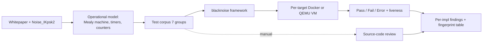

# Daily Scholar Papers Report — 2026-07-17

**[Download PDF](Daily_Papers_Report_2026-07-17.pdf)**

**Window covered:** 2026-07-16 → 2026-07-17 (Google Scholar alerts + user-curated self-emails, last 24 h)

---

## Executive Summary

Two Scholar-alert threads landed in the window — one followed-researcher alert for Zhiqiang Lin (PETS 2026) and one Recommended-articles thread carrying a Mathy Vanhoef / KU Leuven paper (ESORICS 2026). The user-curated forward queue (STEP 2b) was empty. Both candidates cleared Stage-1 and both merited full deep-reads: the Ellis & Lin paper formalises anonymity leakage from binary observables in exclusive-use systems (QIF + Bayes vulnerability + indistinguishability games; validated on Microsoft Teams with 54.7% Top-1 / 89.1% Top-3 re-identification in a 16-user pool); the Robben & Vanhoef paper systematically tests eight WireGuard implementations against a manually-derived operational model, finding real bugs in NetBSD, Cloudflare BoringTun, wireguard-lwip and wireguard-linux, and shows the same behavioural differences narrow a remote implementation to at most two candidates. Preference layer contributed nothing on this cycle — none of the candidate authors, venues, or topics have ≥2 historical observations, so both papers run on the unbiased Stage-1 rubric.

**Outstanding:** 2 · **Keep:** 0 · **Borderline High-Priority:** 0

---

## Highlighted Papers

| # | Title | Authors | Venue | Link |
|---|---|---|---|---|
| 1.1 | Access Granted, Privacy Lost: Formalizing & Quantifying the Hidden Anonymity Risks of Exclusive-Use Systems | C. Ellis, Z. Lin | PoPETs 2026(3), 32–47 (PETS 2026) | [DOI](https://doi.org/10.56553/popets-2026-0069) · [PDF](../../papers/AccessGrantedPrivacyLost_Ellis_2026.pdf) |
| 1.2 | Security Testing of WireGuard Implementations | J. Robben, M. Vanhoef | ESORICS 2026 (Springer LNCS) | [PDF](https://papers.mathyvanhoef.com/esorics2026.pdf) · [Artifact](https://github.com/JeroenRobben/blacknoise) |

---

## 1. Outstanding

<details class="paper-card" markdown>
<summary><strong>1.1</strong> · <span class="topic-chip">METADATA PRIVACY</span> · Formalises anonymity leakage from binary observables in exclusive-use systems (QIF + Bayes vulnerability + indistinguishability games) and shows a passive Teams sniffer reaches 54.7% Top-1 / 89.1% Top-3 re-identification and up to 2.44-bit entropy loss in a 16-user pool from presence/typing/message-sent traffic alone<span class="feedback-buttons"><a href="https://github.com/MarkLee131/paper-digest/issues/new?title=%5Bfeedback%5D+2026-07-17-1.1+Formalises+anonymity+leakage+from+binary+observables+in+exclusive-use+systems+%28QIF+%2B+Bayes+vulnerability+%2B+indistinguishability+games%29+and+shows+a+passive+Teams+sniffer+reaches+54.7%25+Top-1+%2F+89.1%25+Top-3+re-identification+and+up+to+2.44-bit+entropy+loss+in+a+16-user+pool+from+presence%2Ftyping%2Fmessage-sent+traffic+alone+%F0%9F%91%8D&body=paper_id%3A+2026-07-17-1.1%0Atitle%3A+Formalises+anonymity+leakage+from+binary+observables+in+exclusive-use+systems+%28QIF+%2B+Bayes+vulnerability+%2B+indistinguishability+games%29+and+shows+a+passive+Teams+sniffer+reaches+54.7%25+Top-1+%2F+89.1%25+Top-3+re-identification+and+up+to+2.44-bit+entropy+loss+in+a+16-user+pool+from+presence%2Ftyping%2Fmessage-sent+traffic+alone%0Aauthors%3A+%23%23%23+1.1+%5BAccess+Granted%2C+Privacy+Lost%3A+Formalizing+%26+Quantifying+the+Hidden+Anonymity+Risks+of+Exclusive-Use+Systems%5D%28https%3A%2F%2Fdoi.org%2F10.56553%2Fpopets-2026-0069%29+%E2%80%94+C.+Ellis%2C+Z.+Lin+%28The+Ohio+State+Univ%0Avenue%3A+preprint%0Atopic%3A+METADATA+PRIVACY%0Arating%3A+thumbs-up%0A%0A%3C%21--+Optional+notes+below+this+line+are+read+by+preferences.py+as+soft+signals.+--%3E%0A&labels=feedback%2Cthumbs-up" target="_blank" rel="noopener" class="fb-thumbs-up" title="thumbs up" onclick="event.stopPropagation()">👍</a><a href="https://github.com/MarkLee131/paper-digest/issues/new?title=%5Bfeedback%5D+2026-07-17-1.1+Formalises+anonymity+leakage+from+binary+observables+in+exclusive-use+systems+%28QIF+%2B+Bayes+vulnerability+%2B+indistinguishability+games%29+and+shows+a+passive+Teams+sniffer+reaches+54.7%25+Top-1+%2F+89.1%25+Top-3+re-identification+and+up+to+2.44-bit+entropy+loss+in+a+16-user+pool+from+presence%2Ftyping%2Fmessage-sent+traffic+alone+%F0%9F%AB%A5&body=paper_id%3A+2026-07-17-1.1%0Atitle%3A+Formalises+anonymity+leakage+from+binary+observables+in+exclusive-use+systems+%28QIF+%2B+Bayes+vulnerability+%2B+indistinguishability+games%29+and+shows+a+passive+Teams+sniffer+reaches+54.7%25+Top-1+%2F+89.1%25+Top-3+re-identification+and+up+to+2.44-bit+entropy+loss+in+a+16-user+pool+from+presence%2Ftyping%2Fmessage-sent+traffic+alone%0Aauthors%3A+%23%23%23+1.1+%5BAccess+Granted%2C+Privacy+Lost%3A+Formalizing+%26+Quantifying+the+Hidden+Anonymity+Risks+of+Exclusive-Use+Systems%5D%28https%3A%2F%2Fdoi.org%2F10.56553%2Fpopets-2026-0069%29+%E2%80%94+C.+Ellis%2C+Z.+Lin+%28The+Ohio+State+Univ%0Avenue%3A+preprint%0Atopic%3A+METADATA+PRIVACY%0Arating%3A+thumbs-down%0A%0A%3C%21--+Optional+notes+below+this+line+are+read+by+preferences.py+as+soft+signals.+--%3E%0A&labels=feedback%2Cthumbs-down" target="_blank" rel="noopener" class="fb-thumbs-down" title="less interested" onclick="event.stopPropagation()">🫥</a><a href="https://github.com/MarkLee131/paper-digest/issues/new?title=%5Bfeedback%5D+2026-07-17-1.1+Formalises+anonymity+leakage+from+binary+observables+in+exclusive-use+systems+%28QIF+%2B+Bayes+vulnerability+%2B+indistinguishability+games%29+and+shows+a+passive+Teams+sniffer+reaches+54.7%25+Top-1+%2F+89.1%25+Top-3+re-identification+and+up+to+2.44-bit+entropy+loss+in+a+16-user+pool+from+presence%2Ftyping%2Fmessage-sent+traffic+alone+%F0%9F%94%96&body=paper_id%3A+2026-07-17-1.1%0Atitle%3A+Formalises+anonymity+leakage+from+binary+observables+in+exclusive-use+systems+%28QIF+%2B+Bayes+vulnerability+%2B+indistinguishability+games%29+and+shows+a+passive+Teams+sniffer+reaches+54.7%25+Top-1+%2F+89.1%25+Top-3+re-identification+and+up+to+2.44-bit+entropy+loss+in+a+16-user+pool+from+presence%2Ftyping%2Fmessage-sent+traffic+alone%0Aauthors%3A+%23%23%23+1.1+%5BAccess+Granted%2C+Privacy+Lost%3A+Formalizing+%26+Quantifying+the+Hidden+Anonymity+Risks+of+Exclusive-Use+Systems%5D%28https%3A%2F%2Fdoi.org%2F10.56553%2Fpopets-2026-0069%29+%E2%80%94+C.+Ellis%2C+Z.+Lin+%28The+Ohio+State+Univ%0Avenue%3A+preprint%0Atopic%3A+METADATA+PRIVACY%0Arating%3A+save-for-later%0A%0A%3C%21--+Optional+notes+below+this+line+are+read+by+preferences.py+as+soft+signals.+--%3E%0A&labels=feedback%2Csave-for-later" target="_blank" rel="noopener" class="fb-save-for-later" title="save for later" onclick="event.stopPropagation()">🔖</a></span></summary>

### 1.1 [Access Granted, Privacy Lost: Formalizing & Quantifying the Hidden Anonymity Risks of Exclusive-Use Systems](https://doi.org/10.56553/popets-2026-0069) — C. Ellis, Z. Lin (The Ohio State University) — PoPETs 2026(3), 32–47 (PETS 2026)

**Problem.** Encrypted messaging and enterprise platforms already protect content and identifiers, but the *existence* of interactions — a successful VPN login, a "typing…" indicator, a message-sent burst — leaks in the network trace. In *exclusive-use* systems (a device or credential is bound 1:1 or 1:N to a single user), such binary observables accumulate into behavioural signatures even when packets are encrypted and identifiers are rotated. Prior work either treated one-shot metadata leakage or focused on statistical aggregates; there was no unified formalism for the anonymity degradation induced by *recurring* binary signals.

**Central formalisation.** Each observable interaction type is modelled as a digitiser `D_j : X → {0,1}` mapping raw traffic to a boolean, so the trace at time t becomes an N-dimensional binary vector

$$o_t^{(u)} = \big(D_1(x_t^{(u)}), D_2(x_t^{(u)}), \dots, D_N(x_t^{(u)})\big) \in \{0,1\}^N$$

and the attacker sees `O_T = {o_1, …, o_T}`. Because the authors do not assume a generative model, they instantiate a distance-based likelihood surrogate

$$P(O_T \mid u) \propto \exp\!\big(-d(f(O_T), \theta_u)/\tau\big)$$

with `d(·,·)` Euclidean distance in normalised feature space, `θ_u` a per-user reference profile, and `τ = 1` in the experiments. Under a uniform prior the attacker's posterior is Bayes' rule with these likelihoods.

**Four complementary metrics for anonymity loss.**

- **Worst-case anonymity-set reduction:** `L_heuristic(o_t) = log₂|U| − log₂|U_t|`, a conservative upper bound assuming deterministic digitisation.
- **Entropy-based QIF loss:** `L_QIF(O_T) = H_0(S) − H(S | O_T)` in bits.
- **Bayes vulnerability:** `V(O_T) = max_u P(u | O_T)`, the one-shot optimal attacker's success probability.
- **Behavioural indistinguishability advantage:** `Adv = 2·Pr[Guess = b] − ½` in a two-user game, isolating pairwise separability.

**Threat taxonomy.** Three orthogonal dimensions: *Attacker Capability* (Observation Time / Access Level / Locale / Scope), *Observation Method* (Passive — Sniffing, Timing, Exposed Metrics, Logs, Fingerprinting; Active — Relay, Replay, Probing), *Information Leaked* (User / Relationship / Behavioural Inference sub-types). Each concrete attack traces a *path* through the taxonomy — Teams is (Longitudinal, Unprivileged, Local, Mono-system) × Passive Sniffing × (Identity Resolution + Presence + Session Attributes + Behavioural Fingerprint).

**Recreated digitisation pipeline (Mermaid).**

```mermaid
flowchart LR
  A[Encrypted traffic x_t] --> B[Pattern-match digitisers D_j]
  B --> C[Binary vector o_t in {0,1}^N]
  C --> D[Trace O_T = o_1..o_T]
  D --> E[Feature f O_T]
  E --> F[Distance to per-user profile theta_u]
  F --> G[Posterior P u | O_T]
  G --> H[Entropy loss deltaH + Bayes vuln V]
```

**Case study — Microsoft Teams.** Chrome/Ubuntu lab capture identified three deterministic packet-size patterns: presence `⟨184, 250⟩` on becoming active; typing `⟨X, 205, 89⟩` per typed message with a variable leading packet; message-sent terminating `X_i` sequence. Simulation: 16 users, four behavioural profiles (Deliberative, Low-Engagement, High-Frequency, Intermittent), 8-hour workdays, event frequency anchored to public messaging-analytics figures (~300 msgs/user/week), 10 runs per user × profile.

**Headline numbers (verbatim).**

- **Population-scale re-identification (N = 16):** Top-1 **54.7%**, Top-3 **89.1%**, mean rank 2.23, median rank 1. Mean posterior on true identity 0.275 vs. uniform prior 0.0625 (**+21 pp** absolute; most-distinctive users **+64 pp**).
- **Entropy loss:** per-user `Δ H ≈ 0.68 – 2.44 bits` out of a 4-bit space; population mean **≈ 1.2 bits (≈ 30 %)**. Worst-case user D₂ loses **2.44 bits**, shrinking the effective anonymity set from 16 to under 3.
- **Bayes vulnerability:** from uniform `V = 1/16 = 6.25 %` up to **19–71 %** depending on profile; several users exceed 0.45.
- **Timing-aware vs volume-only baseline:** Top-1 **+10.2 pp**, Top-3 **+16.4 pp** — the temporal structure of the binary trace, not just its count, drives re-identification.

**Applicability beyond Teams.** The same taxonomy path applies to WhatsApp (132/134-byte typing packets, 211–213-byte chat-focus changes, `⟨msg, 101⟩` send indicator) and to the IDBleed BLE active-relay attack (Singular / Remote / Active Relay / Group Membership + Identity Resolution).

**Reusability.**

- The digitiser-and-distance likelihood is a drop-in template for anonymity degradation in any encrypted-metadata setting with an enumerable pattern library — VPN concentrator logs, WebRTC signalling, MQTT/IoT command bursts, HTTP/3 streams.
- The four-metric stack (worst-case set reduction, QIF entropy loss, Bayes vulnerability, indistinguishability advantage) is a re-usable mitigation-evaluation harness: report all four before/after a defence and defenders get a quantitative privacy budget rather than a hand-wave.
- The three-axis taxonomy is a clean positioning grid for future protocol-side-channel work — cite the (Capability, Method, Leaked) triple rather than reinventing the rubric.

**Closing citable line.** *"each signal inherently corresponds to a single user or entity."*

</details>

<details class="paper-card" markdown>
<summary><strong>1.2</strong> · <span class="topic-chip">PROTOCOL SECURITY TESTING</span> · Systematic security-testing methodology for WireGuard — builds an explicit operational model, derives a compliance test corpus, automates it as a wire-level Python peer (blacknoise), runs it on eight prominent implementations and finds real bugs in NetBSD, BoringTun, wireguard-lwip and wireguard-linux while narrowing any remote implementation to at most two candidates<span class="feedback-buttons"><a href="https://github.com/MarkLee131/paper-digest/issues/new?title=%5Bfeedback%5D+2026-07-17-1.2+Systematic+security-testing+methodology+for+WireGuard+%E2%80%94+builds+an+explicit+operational+model%2C+derives+a+compliance+test+corpus%2C+automates+it+as+a+wire-level+Python+peer+%28blacknoise%29%2C+runs+it+on+eight+prominent+implementations+and+finds+real+bugs+in+NetBSD%2C+BoringTun%2C+wireguard-lwip+and+wireguard-linux+while+narrowing+any+remote+implementation+to+at+most+two+candidates+%F0%9F%91%8D&body=paper_id%3A+2026-07-17-1.2%0Atitle%3A+Systematic+security-testing+methodology+for+WireGuard+%E2%80%94+builds+an+explicit+operational+model%2C+derives+a+compliance+test+corpus%2C+automates+it+as+a+wire-level+Python+peer+%28blacknoise%29%2C+runs+it+on+eight+prominent+implementations+and+finds+real+bugs+in+NetBSD%2C+BoringTun%2C+wireguard-lwip+and+wireguard-linux+while+narrowing+any+remote+implementation+to+at+most+two+candidates%0Aauthors%3A+%23%23%23+1.2+%5BSecurity+Testing+of+WireGuard+Implementations%5D%28https%3A%2F%2Fpapers.mathyvanhoef.com%2Fesorics2026.pdf%29+%E2%80%94+J.+Robben%2C+M.+Vanhoef+%28DistriNet%2C+KU+Leuven%29+%E2%80%94+ESORICS+2026+%28Springer+LNCS%29%0Avenue%3A+preprint%0Atopic%3A+PROTOCOL+SECURITY+TESTING%0Arating%3A+thumbs-up%0A%0A%3C%21--+Optional+notes+below+this+line+are+read+by+preferences.py+as+soft+signals.+--%3E%0A&labels=feedback%2Cthumbs-up" target="_blank" rel="noopener" class="fb-thumbs-up" title="thumbs up" onclick="event.stopPropagation()">👍</a><a href="https://github.com/MarkLee131/paper-digest/issues/new?title=%5Bfeedback%5D+2026-07-17-1.2+Systematic+security-testing+methodology+for+WireGuard+%E2%80%94+builds+an+explicit+operational+model%2C+derives+a+compliance+test+corpus%2C+automates+it+as+a+wire-level+Python+peer+%28blacknoise%29%2C+runs+it+on+eight+prominent+implementations+and+finds+real+bugs+in+NetBSD%2C+BoringTun%2C+wireguard-lwip+and+wireguard-linux+while+narrowing+any+remote+implementation+to+at+most+two+candidates+%F0%9F%AB%A5&body=paper_id%3A+2026-07-17-1.2%0Atitle%3A+Systematic+security-testing+methodology+for+WireGuard+%E2%80%94+builds+an+explicit+operational+model%2C+derives+a+compliance+test+corpus%2C+automates+it+as+a+wire-level+Python+peer+%28blacknoise%29%2C+runs+it+on+eight+prominent+implementations+and+finds+real+bugs+in+NetBSD%2C+BoringTun%2C+wireguard-lwip+and+wireguard-linux+while+narrowing+any+remote+implementation+to+at+most+two+candidates%0Aauthors%3A+%23%23%23+1.2+%5BSecurity+Testing+of+WireGuard+Implementations%5D%28https%3A%2F%2Fpapers.mathyvanhoef.com%2Fesorics2026.pdf%29+%E2%80%94+J.+Robben%2C+M.+Vanhoef+%28DistriNet%2C+KU+Leuven%29+%E2%80%94+ESORICS+2026+%28Springer+LNCS%29%0Avenue%3A+preprint%0Atopic%3A+PROTOCOL+SECURITY+TESTING%0Arating%3A+thumbs-down%0A%0A%3C%21--+Optional+notes+below+this+line+are+read+by+preferences.py+as+soft+signals.+--%3E%0A&labels=feedback%2Cthumbs-down" target="_blank" rel="noopener" class="fb-thumbs-down" title="less interested" onclick="event.stopPropagation()">🫥</a><a href="https://github.com/MarkLee131/paper-digest/issues/new?title=%5Bfeedback%5D+2026-07-17-1.2+Systematic+security-testing+methodology+for+WireGuard+%E2%80%94+builds+an+explicit+operational+model%2C+derives+a+compliance+test+corpus%2C+automates+it+as+a+wire-level+Python+peer+%28blacknoise%29%2C+runs+it+on+eight+prominent+implementations+and+finds+real+bugs+in+NetBSD%2C+BoringTun%2C+wireguard-lwip+and+wireguard-linux+while+narrowing+any+remote+implementation+to+at+most+two+candidates+%F0%9F%94%96&body=paper_id%3A+2026-07-17-1.2%0Atitle%3A+Systematic+security-testing+methodology+for+WireGuard+%E2%80%94+builds+an+explicit+operational+model%2C+derives+a+compliance+test+corpus%2C+automates+it+as+a+wire-level+Python+peer+%28blacknoise%29%2C+runs+it+on+eight+prominent+implementations+and+finds+real+bugs+in+NetBSD%2C+BoringTun%2C+wireguard-lwip+and+wireguard-linux+while+narrowing+any+remote+implementation+to+at+most+two+candidates%0Aauthors%3A+%23%23%23+1.2+%5BSecurity+Testing+of+WireGuard+Implementations%5D%28https%3A%2F%2Fpapers.mathyvanhoef.com%2Fesorics2026.pdf%29+%E2%80%94+J.+Robben%2C+M.+Vanhoef+%28DistriNet%2C+KU+Leuven%29+%E2%80%94+ESORICS+2026+%28Springer+LNCS%29%0Avenue%3A+preprint%0Atopic%3A+PROTOCOL+SECURITY+TESTING%0Arating%3A+save-for-later%0A%0A%3C%21--+Optional+notes+below+this+line+are+read+by+preferences.py+as+soft+signals.+--%3E%0A&labels=feedback%2Csave-for-later" target="_blank" rel="noopener" class="fb-save-for-later" title="save for later" onclick="event.stopPropagation()">🔖</a></span></summary>

### 1.2 [Security Testing of WireGuard Implementations](https://papers.mathyvanhoef.com/esorics2026.pdf) — J. Robben, M. Vanhoef (DistriNet, KU Leuven) — ESORICS 2026 (Springer LNCS)

**Problem.** WireGuard's cryptography has been proven by hand (Dowling & Paterson), by CryptoVerif (Lipp / Blanchet / Bhargavan), and by SAPIC+ / ProVerif / Tamarin (Lafourcade et al.), and its Noise_IKpsk2 core has been mechanically analysed. Yet the whitepaper is simultaneously a cryptographic specification and a reference implementation description, and it leaves *state-machine transitions, timer interactions, and packet-handling edge cases* informal. Deployments therefore inherit any implementation gap, and downstream products (Tailscale, NetBird, Mullvad) inherit the gaps of the WireGuard core they wrap.

**Method.** The authors build an explicit *operational model* — a Mealy machine over the WireGuard peer lifecycle, a complete enumeration of timers and counters, and per-state packet-handling procedures. From that they derive a compliance test corpus grouped by protocol element (handshake initiation, handshake response, handshake retransmission, cookie mechanism, endpoint roaming, transport data, session lifetime), and formulate the security implications under four escalating attacker models (Passive; Passive-Injection; Active; Registered Peer). Most tests are wire-observable and are automated in **blacknoise** (Python, per-field packet control, per-case liveness check); five are checked by manual source review. blacknoise runs targets as Docker containers (Linux) or QEMU/KVM snapshots (Windows NT, FreeBSD, OpenBSD, NetBSD); a full run of the corpus completes in ≤ 15 minutes on an Intel i9-9980HK / 32 GiB host.

**Test corpus — bugs the authors look for.**

- **Handshake initiation:** MAC1 verification skipped → DoS exposure; AEAD tag skipped on `msg.timestamp` → *persistent-DoS* primitive because pseudo-random plaintext parsed as a big-endian 96-bit TAI64N almost certainly exceeds the legitimate timestamp; low-order Curve25519 acceptance → predictable shared secret / crash; timestamp persistence across restarts; structured TAI64N parsing risks a normalisation carry into the seconds field.
- **Handshake response:** MAC1 verification; AEAD authentication of `msg.empty` (skipping it lets a passive-injection attacker with the initiator's static pubkey drive it into a blackholed session); ephemeral-key validation; *response replay* into an active session resets the transport counter and causes ChaCha20-Poly1305 nonce reuse under the same key.
- **Retransmission:** minimum interval (otherwise a captured cookie-reply is a DoS amplifier); attempt cap (avoids indefinite reflection when combined with roaming); fresh ephemerals per retransmission; responder must not autonomously retransmit responses (else spoofed-source initiations become an amplification vector).
- **Cookie mechanism:** accept cookie replies to *responses* too; AAD binding to the triggering MAC1; 120-s secret rotation; cookie must bind IP *and* port — binding IP alone lets clients behind the same NAT accept each other's cookies.
- **Endpoint roaming:** update the endpoint only after full message authentication.
- **Transport data:** sending counter must be 64-bit (a 32-bit platform-width counter wraps at 2³² and reuses a nonce); sliding-window replay protection; 16-byte payload padding (else exact inner-packet length leaks for traffic-analysis); cryptokey routing must check *source* inner IP against AllowedIPs, not destination.
- **Session lifetime:** Reject-After-Time / Reject-After-Messages enforcement; explicit zeroisation of superseded keys with `memzero_explicit` (compiler-non-elidable).

**Recreated blacknoise pipeline (Mermaid).**



**Per-implementation findings.**

- **NetBSD** — fails ephemeral-key validation on handshake initiation: a low-order ephemeral panics a diagnostic kernel and is silently accepted on release, yielding a predictable shared secret. Filed as NetBSD PR 60106; acknowledged upstream. An earlier in-development version also failed the response-replay test (nonce reuse + KASSERT panic); fixed incidentally by commit d1a81d3 as part of a locking refactor.
- **BoringTun** (Cloudflare) — three findings. (1) 32-bit platform-width nonce counter wraps at 2³² under one key — patched to 64-bit, upstream ack; impact largely theoretical because Rekey-After-Time fires first. (2) No 16-byte transport-payload padding — reported upstream. (3) Cookie computed over source IP only, not the IP–port tuple → clients behind the same NAT accept each other's cookies, letting a co-NATted attacker bypass source-address binding — disclosed upstream.
- **wireguard-lwip** — cryptokey-routing check uses the packet's *destination* instead of *source* address, so any registered peer can inject inner packets with arbitrary source IPs, defeating AllowedIPs. Reported and patched; fix merged upstream.
- **wireguard-linux** — used plain `memset` to zero handshake material; a C compiler is entitled to elide it under as-if. Patched with `memzero_explicit`; submitted upstream.

**Implementation fingerprinting.** Combining the blacknoise pass/fail matrix with manually observed quirks, the authors derive per-implementation fingerprints that isolate four implementations uniquely — **wireguard-linux** (sets DSCP `0x88` on outgoing handshake IP packets), **NetBSD** (cookie reply to two quick initiations, no retransmit jitter), **BoringTun** (endpoint roaming on cookie replies), **wireguard-lwip** (drops rather than queues outbound data with no session) — and narrow the remaining four to two pairs: **wireguard-freebsd / wireguard-openbsd** (unprompted keepalive after handshake as responder) and **wireguard-nt / wireguard-go** (fallback bucket). A companion tool automates the fingerprinting from the registered-peer vantage.

**Roaming attack demonstrated on the Linux kernel.** Passive-injection attacker resends a captured authenticated packet with a spoofed source IP; if it arrives first, the receiver rewrites the peer's stored endpoint and blackholes all future traffic. Applied symmetrically to both peers, this permanently severs the tunnel until one side reloads the configured IP. Every tested implementation updates the endpoint on any authenticated message type except cookie replies (BoringTun updates on cookie replies too). Authors argue the spec should let a hardcoded-endpoint peer disable roaming outright.

**Why official implementations fare well.** WireGuard leaves routing / IP / DNS setup out-of-band, fixes its cryptographic primitives at protocol level (no cipher-suite negotiation), and inherits from Noise_IKpsk2 the property that identity verification is *cryptographically inseparable* from session-key derivation — a peer that mishandles pubkeys derives mismatched transport keys and simply cannot set up a working tunnel. Contrast TLS 1.3, where session keys come from the ephemeral DH exchange alone and certificate verification is a logically separate step a buggy client can omit while still producing usable transport keys.

**Reusability.**

- The methodology — build the explicit operational model, derive a compliance test corpus, automate the black-box subset as a wire-level Python peer — is directly transferable to any Noise-based protocol.
- **blacknoise** itself (Apache 2.0 / MIT) is a drop-in harness for any new WireGuard implementation and a useful teaching artefact.
- The fingerprinting tool is dual-use: attackers narrow the target OS; defenders detect deployment drift.
- The **TAI64N normalisation footgun** — parsing a timestamp the spec says to compare as an opaque 96-bit blob into structured seconds/nanoseconds, thereby enabling a carry that advances the stored high-watermark past the peer's true clock — generalises to any protocol that binds a monotonic clock to replay defence.

**Closing citable line.** *"the WireGuard community would benefit from a more formal, normative specification that separates protocol requirements from implementation guidance."*

</details>

---

## Cross-Paper Synthesis

Both today's papers are studies of what leaks *even when the cryptography is right*, and both trade in the same currency — behavioural observables that the protocol's cryptographic core cannot suppress. Ellis & Lin make the point at the *user* level: the encrypted payload of Microsoft Teams is intact, but the packet-size *pattern* of a "typing…" burst is a deterministic binary observable that accumulates into a 1.2-bit anonymity loss per user against a passive on-network attacker. Robben & Vanhoef make the same point at the *implementation* level: WireGuard's Noise_IKpsk2 handshake is provably secure, but the *behavioural* differences between eight compliant implementations — a DSCP field here, an unprompted keepalive there, a cookie-reply roaming quirk — are enough to fingerprint the peer to at most two candidates from the wire. Both papers therefore recommend the same class of defence: *shape or randomise the observables that are inessential to correctness*. For Teams that is padding, cover traffic, jittered response timing; for WireGuard it is not sending an unprompted keepalive, not roaming on cookie replies, and — the authors' most transferable ask — a normative separation of protocol requirements from implementation-specific behaviour that would let two conforming implementations be *observationally* interchangeable.

The methodological arc across the two papers is worth pulling out: Ellis & Lin *quantify* leakage from binary observables and give a four-metric harness (worst-case set reduction, QIF, Bayes vulnerability, indistinguishability advantage) for reporting mitigation impact; Robben & Vanhoef *enumerate* the operational-model gaps that produce behavioural observables in the first place, and build a wire-level Python framework to check each one. The two connect naturally — one could imagine feeding blacknoise's per-implementation behavioural fingerprints into Ellis & Lin's four-metric harness to quantify how much implementation identity a passive observer can extract from a WireGuard trace.

## Writing & Rationale Insights

Ellis & Lin's most transferable rhetorical move is the *taxonomy-as-audit-tool*: they present Table 1 not as a survey device but as an instrument the reader can pick up and apply — "trace a path through Capability × Method × Leaked" — and then walk through concrete Teams, WhatsApp, and IDBleed paths in one page each. That framing turns the taxonomy into a *reasoning discipline* rather than a list. Their second lesson is metric parsimony: four privacy metrics, each defined in a single formula, each corresponding to a distinct attacker capability. When you propose more than one metric, explain why *this* one adds something the others miss.

Robben & Vanhoef's writing lesson is subtler: they never call an implementation "buggy" without stating the exact requirement they derive from the operational model and the exact security consequence under a named attacker capability. Every finding in §6.3 follows the pattern *< spec requirement > — < deviation observed > — < attacker capability that turns it into an attack > — < patch / status upstream >*. That structure is what turns a compliance report into a citable security paper.

Two smaller items worth remembering. The TAI64N pitfall — parsing a timestamp *the spec says to compare as an opaque big-endian 96-bit blob* into a structured (seconds, nanoseconds) pair, thereby enabling a normalisation carry that advances the stored high-watermark past legitimate clock values — is a beautiful example of "parsing into a richer type is a security decision", worth stashing away for future protocol-review checklists. And the design-principle takeaway is the sharpest one in the paper: *inseparability* of identity verification and key derivation (a Noise_IKpsk2 property) is a design tool for forcing correctness, in the same way AEAD's single-call API makes it hard to decrypt without checking the tag.
