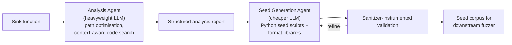
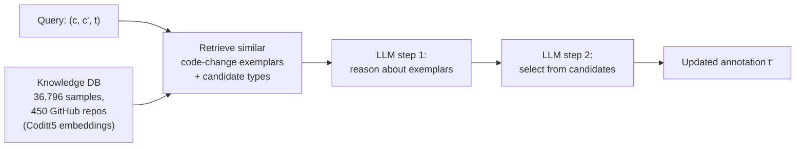
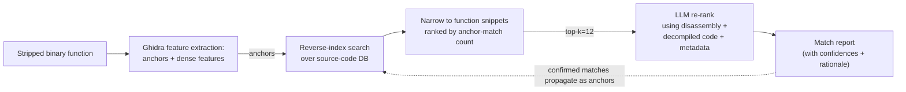

# Daily Scholar Papers Report — 2026-07-19

**[Download PDF](Daily_Papers_Report_2026-07-19.pdf)**

**Window covered:** 2026-07-18 → 2026-07-19 (Google Scholar alerts + user-curated self-emails, last 24 h)

---

## Executive Summary

A cohort of four deep-read papers plus one policy-brief summary. The theme of the day is **iterative LLM-agent pipelines replacing one-shot prompting** across three otherwise unrelated software-engineering tasks: directed fuzzing seed synthesis (SeedSmith), Python type-annotation *updating* (TypeUp, ICSE 2026), and binary-to-source recovery via anchor retrieval and LLM re-ranking. A parallel industry-side mixed-methods study from the David Lo group corroborates that the same *evaluation-driven, iterative* pattern has already become mainstream in production SE-agent work, and a GI policy brief co-authored by Eric Bodden situates the shift as a question of digital sovereignty.

**Outstanding:** 2 · **Keep:** 3 · **Borderline High-Priority:** 0

## Highlighted Papers

| # | Title | Authors | Venue | Link |
|---|-------|---------|-------|------|
| 1 | SeedSmith: LLM-Driven Seed Synthesis for Directed Fuzzing | J. Zhu, S. Liu, J. Hu, F. Gritti, A. P. Bajaj, H. Wang, W. Guo, T. Bao, C. Kruegel, G. Vigna | arXiv preprint 2026 | [arXiv:2607.08949](https://arxiv.org/abs/2607.08949) |
| 2 | Automating Just-In-Time Python Type Annotation Updating (TypeUp) | Z. Xue, Z. Gao, X. Hu, J. Chen, X. Xia, S. Li | **ICSE 2026** | [doi:10.1145/3744916.3764565](https://doi.org/10.1145/3744916.3764565) |
| 3 | Practical Source Code Recovery from Binary Functions Using Anchor-Based Retrieval and LLM Reasoning | C. E. Gagnon, S. H. H. Ding, P. Charland, B. C. M. Fung | arXiv preprint 2026 | [arXiv:2607.09452](https://arxiv.org/abs/2607.09452) |
| 4 | How Do Practitioners Build SE Agents? Insights from a Mixed-Methods Study | Y. Lyu, D. Williams, J. Shi, Z. Sun, C. Peng, Z. Yang, F. Sarro, D. Lo | arXiv preprint 2026 | [arXiv:2607.10856](https://arxiv.org/abs/2607.10856) |
| 5 | KI-basiertes Software-Engineering als Schlüsseltechnologie digitaler Souveränität *(policy brief, German)* | N. Becker, E. Bodden, C. Ebert, L. Grunske, D. Krupka et al. | GI Policy Brief № 4, Juli 2026 | [gi.de PDF](https://gi.de/fileadmin/GI/Allgemein/PDF/2026-06_Policy_Brief_Software_im_KI-Zeitalter.pdf) |

---

<strong>1.1</strong> · directed fuzzing · Agentic LLM seeds cut Magma crash-time by 11.5×–14.7× and expose 16 new ARVO bugs.<a href="https://github.com/MarkLee131/paper-digest/issues/new?title=%5Bfeedback%5D+2026-07-19-1.1+Agentic+LLM+seeds+cut+Magma+crash-time+by+11.5%C3%97%E2%80%9314.7%C3%97+and+expose+16+new+ARVO+bugs.+%F0%9F%91%8D&body=paper_id%3A+2026-07-19-1.1%0Atitle%3A+Agentic+LLM+seeds+cut+Magma+crash-time+by+11.5%C3%97%E2%80%9314.7%C3%97+and+expose+16+new+ARVO+bugs.%0Aauthors%3A+%2A%2AAuthors.%2A%2A+Junmin+Zhu%2C+Siyu+Liu+%28co-first%29%2C+Jie+Hu%2C+Fabio+Gritti%2C+Ati+Priya+Bajaj%2C+Hulin+Wang%2C+Wenbo+Guo%2C+Tiffany+Bao%2C+Christopher+Kruegel%2C+Giovanni+Vigna+%E2%80%94+UC+Santa+Barbara+%2B+Arizona+State.%0Avenue%3A+preprint%0Atopic%3A+directed+fuzzing%0Arating%3A+thumbs-up%0A%0A%3C%21--+Optional+notes+below+this+line+are+read+by+preferences.py+as+soft+signals.+--%3E%0A&labels=feedback%2Cthumbs-up" target="_blank" rel="noopener" class="fb-thumbs-up" title="thumbs up" onclick="event.stopPropagation()">👍</a><a href="https://github.com/MarkLee131/paper-digest/issues/new?title=%5Bfeedback%5D+2026-07-19-1.1+Agentic+LLM+seeds+cut+Magma+crash-time+by+11.5%C3%97%E2%80%9314.7%C3%97+and+expose+16+new+ARVO+bugs.+%F0%9F%AB%A5&body=paper_id%3A+2026-07-19-1.1%0Atitle%3A+Agentic+LLM+seeds+cut+Magma+crash-time+by+11.5%C3%97%E2%80%9314.7%C3%97+and+expose+16+new+ARVO+bugs.%0Aauthors%3A+%2A%2AAuthors.%2A%2A+Junmin+Zhu%2C+Siyu+Liu+%28co-first%29%2C+Jie+Hu%2C+Fabio+Gritti%2C+Ati+Priya+Bajaj%2C+Hulin+Wang%2C+Wenbo+Guo%2C+Tiffany+Bao%2C+Christopher+Kruegel%2C+Giovanni+Vigna+%E2%80%94+UC+Santa+Barbara+%2B+Arizona+State.%0Avenue%3A+preprint%0Atopic%3A+directed+fuzzing%0Arating%3A+thumbs-down%0A%0A%3C%21--+Optional+notes+below+this+line+are+read+by+preferences.py+as+soft+signals.+--%3E%0A&labels=feedback%2Cthumbs-down" target="_blank" rel="noopener" class="fb-thumbs-down" title="less interested" onclick="event.stopPropagation()">🫥</a><a href="https://github.com/MarkLee131/paper-digest/issues/new?title=%5Bfeedback%5D+2026-07-19-1.1+Agentic+LLM+seeds+cut+Magma+crash-time+by+11.5%C3%97%E2%80%9314.7%C3%97+and+expose+16+new+ARVO+bugs.+%F0%9F%94%96&body=paper_id%3A+2026-07-19-1.1%0Atitle%3A+Agentic+LLM+seeds+cut+Magma+crash-time+by+11.5%C3%97%E2%80%9314.7%C3%97+and+expose+16+new+ARVO+bugs.%0Aauthors%3A+%2A%2AAuthors.%2A%2A+Junmin+Zhu%2C+Siyu+Liu+%28co-first%29%2C+Jie+Hu%2C+Fabio+Gritti%2C+Ati+Priya+Bajaj%2C+Hulin+Wang%2C+Wenbo+Guo%2C+Tiffany+Bao%2C+Christopher+Kruegel%2C+Giovanni+Vigna+%E2%80%94+UC+Santa+Barbara+%2B+Arizona+State.%0Avenue%3A+preprint%0Atopic%3A+directed+fuzzing%0Arating%3A+save-for-later%0A%0A%3C%21--+Optional+notes+below+this+line+are+read+by+preferences.py+as+soft+signals.+--%3E%0A&labels=feedback%2Csave-for-later" target="_blank" rel="noopener" class="fb-save-for-later" title="save for later" onclick="event.stopPropagation()">🔖</a>

**Authors.** Junmin Zhu, Siyu Liu (co-first), Jie Hu, Fabio Gritti, Ati Priya Bajaj, Hulin Wang, Wenbo Guo, Tiffany Bao, Christopher Kruegel, Giovanni Vigna — UC Santa Barbara + Arizona State.
**Link.** [arXiv:2607.08949](https://arxiv.org/abs/2607.08949).

**Problem.** Directed fuzzers steer toward user-defined sink functions but frequently fail to trigger crashes even after long campaigns. Two challenges explain the gap:

- **C1 — indirect calls break static guidance.** Static-analysis-based distance metrics assume call-graph completeness, but indirect calls through function pointers and virtual dispatch are notoriously hard to resolve, leaving entire reachable paths invisible.
- **C2 — crash preconditions defeat blind mutation.** Even after the fuzzer reaches a sink, triggering the crash usually requires a conjunction of precise input-level conditions (field values, format constraints, data-flow dependencies) that coverage-based feedback cannot distinguish from ordinary reachability.

The paper motivates each challenge with a concrete bug: an AIxCC-injected nginx `ngx_sendfile_r` overflow reachable only through indirect calls (C1), and an openjpeg `opj_j2k_decode_tile` crash guarded by six tile-geometry predicates that must simultaneously hold (C2).

**Design.** Two-stage agentic LLM pipeline that replicates a skilled security analyst's manual seed construction.

The analysis stage keeps the search tractable via two design choices: *path optimisation* compresses the over-approximated call graph into a single linearised path (shared prefix/suffix preserved verbatim, divergent middles collapsed into a single connector the agent can expand on demand), and the *code-search tool* returns the enclosing function body, type definition, or configuration block rather than a fixed-line window. Seed generation is deliberately handled by a cheaper model — a cost/capability split.

**Headline numbers.**

- Evaluated on 23 Magma bugs and 115 ARVO challenges across 26 projects — to the authors' knowledge the largest LLM-seed-generation evaluation for fuzzing to date.
- On Magma: geometric mean crash-time speedups of **11.51× (AFL++)** to **14.66× (AFLGo)** over default seeds.
- On ARVO: fuzzers using SeedSmith seeds trigger **16 bugs that AFLRun and AFL++ with default seeds never trigger**, spanning 10 projects with diverse input formats.
- AFL++ with SeedSmith outperforms AFLGo at exposing targeted crashes, showing that a general-purpose fuzzer can be given directed-fuzzing capability without any fuzzer modification.

**Reusability.** The linearised-call-graph-with-expandable-connector primitive is broadly applicable to any LLM agent that must reason over a large codebase under a strict context budget. Because SeedSmith operates as a fuzzer-agnostic seed front-end, it plugs into any mutation-based downstream fuzzer with no code changes.

**Closing line.** *"AFL++ with SeedSmith outperforms AFLGo at exposing targeted crashes, showing that SeedSmith can give a general-purpose fuzzer directed-fuzzing capability."*

<strong>1.2</strong> · program analysis · TypeUp: first JIT type-annotation *updater*; +41.9% over TypeGen; 20/25 real-world PRs merged (ICSE 2026).<a href="https://github.com/MarkLee131/paper-digest/issues/new?title=%5Bfeedback%5D+2026-07-19-1.2+TypeUp%3A+first+JIT+type-annotation+%2Aupdater%2A%3B+%2B41.9%25+over+TypeGen%3B+20%2F25+real-world+PRs+merged+%28ICSE+2026%29.+%F0%9F%91%8D&body=paper_id%3A+2026-07-19-1.2%0Atitle%3A+TypeUp%3A+first+JIT+type-annotation+%2Aupdater%2A%3B+%2B41.9%25+over+TypeGen%3B+20%2F25+real-world+PRs+merged+%28ICSE+2026%29.%0Aauthors%3A+%2A%2AAuthors.%2A%2A+Zhipeng+Xue%2C+Zhipeng+Gao%2A%2C+Xing+Hu%2C+Jingyuan+Chen%2C+Xin+Xia%2A%2C+Shanping+Li+%E2%80%94+Zhejiang+University+%2B+Shanghai+Institute+for+Advanced+Study.%0Avenue%3A+preprint%0Atopic%3A+program+analysis%0Arating%3A+thumbs-up%0A%0A%3C%21--+Optional+notes+below+this+line+are+read+by+preferences.py+as+soft+signals.+--%3E%0A&labels=feedback%2Cthumbs-up" target="_blank" rel="noopener" class="fb-thumbs-up" title="thumbs up" onclick="event.stopPropagation()">👍</a><a href="https://github.com/MarkLee131/paper-digest/issues/new?title=%5Bfeedback%5D+2026-07-19-1.2+TypeUp%3A+first+JIT+type-annotation+%2Aupdater%2A%3B+%2B41.9%25+over+TypeGen%3B+20%2F25+real-world+PRs+merged+%28ICSE+2026%29.+%F0%9F%AB%A5&body=paper_id%3A+2026-07-19-1.2%0Atitle%3A+TypeUp%3A+first+JIT+type-annotation+%2Aupdater%2A%3B+%2B41.9%25+over+TypeGen%3B+20%2F25+real-world+PRs+merged+%28ICSE+2026%29.%0Aauthors%3A+%2A%2AAuthors.%2A%2A+Zhipeng+Xue%2C+Zhipeng+Gao%2A%2C+Xing+Hu%2C+Jingyuan+Chen%2C+Xin+Xia%2A%2C+Shanping+Li+%E2%80%94+Zhejiang+University+%2B+Shanghai+Institute+for+Advanced+Study.%0Avenue%3A+preprint%0Atopic%3A+program+analysis%0Arating%3A+thumbs-down%0A%0A%3C%21--+Optional+notes+below+this+line+are+read+by+preferences.py+as+soft+signals.+--%3E%0A&labels=feedback%2Cthumbs-down" target="_blank" rel="noopener" class="fb-thumbs-down" title="less interested" onclick="event.stopPropagation()">🫥</a><a href="https://github.com/MarkLee131/paper-digest/issues/new?title=%5Bfeedback%5D+2026-07-19-1.2+TypeUp%3A+first+JIT+type-annotation+%2Aupdater%2A%3B+%2B41.9%25+over+TypeGen%3B+20%2F25+real-world+PRs+merged+%28ICSE+2026%29.+%F0%9F%94%96&body=paper_id%3A+2026-07-19-1.2%0Atitle%3A+TypeUp%3A+first+JIT+type-annotation+%2Aupdater%2A%3B+%2B41.9%25+over+TypeGen%3B+20%2F25+real-world+PRs+merged+%28ICSE+2026%29.%0Aauthors%3A+%2A%2AAuthors.%2A%2A+Zhipeng+Xue%2C+Zhipeng+Gao%2A%2C+Xing+Hu%2C+Jingyuan+Chen%2C+Xin+Xia%2A%2C+Shanping+Li+%E2%80%94+Zhejiang+University+%2B+Shanghai+Institute+for+Advanced+Study.%0Avenue%3A+preprint%0Atopic%3A+program+analysis%0Arating%3A+save-for-later%0A%0A%3C%21--+Optional+notes+below+this+line+are+read+by+preferences.py+as+soft+signals.+--%3E%0A&labels=feedback%2Csave-for-later" target="_blank" rel="noopener" class="fb-save-for-later" title="save for later" onclick="event.stopPropagation()">🔖</a>

**Authors.** Zhipeng Xue, Zhipeng Gao*, Xing Hu, Jingyuan Chen, Xin Xia*, Shanping Li — Zhejiang University + Shanghai Institute for Advanced Study.
**Link.** [ICSE 2026, doi:10.1145/3744916.3764565](https://doi.org/10.1145/3744916.3764565); preprint at [arXiv:2607.09054](https://arxiv.org/abs/2607.09054).

**Problem.** Python type annotations are increasingly popular, but when developers change source code, the annotations are often left stale. Prior work covers *type inference* (predicting a type from static source) but not *type annotation updating* — predicting `t'` given `(c, c', t)` where the code delta implies the type must evolve. The paper reports a real *meson* case where `T.Tuple[int, str, str]` should have become `T.Tuple[int, str]` and remained stale for over two years.

**Task definition (verbatim).** *"Given the pre-change and post-change version of a code snippet c, c', the corresponding pre-change and post-change version of the type annotation are t and t' (t ≠ t'), our task aims to find a function f, so that f(c, c', t) = t'."*

**Approach — TypeUp.** Three-phase RAG-agent pipeline.

*Knowledge Database Building* extracts 36,796 (code_change, type_co_change) pairs from 450 GitHub projects; Coditt5 encodes each code change into a vector so similar changes can be retrieved by similarity. *Augmented Information Retrieving* fetches guiding exemplars and project-specific type candidates. *Type Annotation Updating* has the LLM reason about the exemplars first ("why does this code change imply that type change?") before choosing from the candidate set.

**Headline numbers.**

- 500-instance held-out test set: **359 correct** updated type annotations; **+41.9% over TypeGen**, the state-of-the-art type inference baseline.
- Real-world Pyre pipeline: **20 of 25** submitted PRs across 10 popular GitHub projects **confirmed correct by developers**.
- Dataset: 36,796 samples from 450 GitHub repositories, released alongside the source code as a replication package.

**Reusability.** Treating annotation maintenance as a *co-change prediction* problem rather than a *type inference* problem generalises past Python to any lightweight annotation system — JSDoc, Sorbet RBI, TypeScript declaration files, docstring hint blocks. The Coditt5-vector-retrieval + candidate-narrowing recipe is portable to other "predict how X evolves when Y evolves" problems.

**Closing line.** *"20 out of 25 outdated type annotations have already been confirmed by developers, showing our approach's potential for increasing software quality and maintainability."*

<strong>1.3</strong> · binary analysis · Anchor-retrieval + LLM re-rank hits 95.2% instruction coverage on stripped tcpdump; 35.5% over open GitHub API.<a href="https://github.com/MarkLee131/paper-digest/issues/new?title=%5Bfeedback%5D+2026-07-19-1.3+Anchor-retrieval+%2B+LLM+re-rank+hits+95.2%25+instruction+coverage+on+stripped+tcpdump%3B+35.5%25+over+open+GitHub+API.+%F0%9F%91%8D&body=paper_id%3A+2026-07-19-1.3%0Atitle%3A+Anchor-retrieval+%2B+LLM+re-rank+hits+95.2%25+instruction+coverage+on+stripped+tcpdump%3B+35.5%25+over+open+GitHub+API.%0Aauthors%3A+%2A%2AAuthors.%2A%2A+Charles+Edward+Gagnon%2C+Steven+H.+H.+Ding%2C+Philippe+Charland+%28DRDC%29%2C+Benjamin+C.+M.+Fung+%E2%80%94+McGill+University+%2B+Defence+R%26D+Canada.%0Avenue%3A+preprint%0Atopic%3A+binary+analysis%0Arating%3A+thumbs-up%0A%0A%3C%21--+Optional+notes+below+this+line+are+read+by+preferences.py+as+soft+signals.+--%3E%0A&labels=feedback%2Cthumbs-up" target="_blank" rel="noopener" class="fb-thumbs-up" title="thumbs up" onclick="event.stopPropagation()">👍</a><a href="https://github.com/MarkLee131/paper-digest/issues/new?title=%5Bfeedback%5D+2026-07-19-1.3+Anchor-retrieval+%2B+LLM+re-rank+hits+95.2%25+instruction+coverage+on+stripped+tcpdump%3B+35.5%25+over+open+GitHub+API.+%F0%9F%AB%A5&body=paper_id%3A+2026-07-19-1.3%0Atitle%3A+Anchor-retrieval+%2B+LLM+re-rank+hits+95.2%25+instruction+coverage+on+stripped+tcpdump%3B+35.5%25+over+open+GitHub+API.%0Aauthors%3A+%2A%2AAuthors.%2A%2A+Charles+Edward+Gagnon%2C+Steven+H.+H.+Ding%2C+Philippe+Charland+%28DRDC%29%2C+Benjamin+C.+M.+Fung+%E2%80%94+McGill+University+%2B+Defence+R%26D+Canada.%0Avenue%3A+preprint%0Atopic%3A+binary+analysis%0Arating%3A+thumbs-down%0A%0A%3C%21--+Optional+notes+below+this+line+are+read+by+preferences.py+as+soft+signals.+--%3E%0A&labels=feedback%2Cthumbs-down" target="_blank" rel="noopener" class="fb-thumbs-down" title="less interested" onclick="event.stopPropagation()">🫥</a><a href="https://github.com/MarkLee131/paper-digest/issues/new?title=%5Bfeedback%5D+2026-07-19-1.3+Anchor-retrieval+%2B+LLM+re-rank+hits+95.2%25+instruction+coverage+on+stripped+tcpdump%3B+35.5%25+over+open+GitHub+API.+%F0%9F%94%96&body=paper_id%3A+2026-07-19-1.3%0Atitle%3A+Anchor-retrieval+%2B+LLM+re-rank+hits+95.2%25+instruction+coverage+on+stripped+tcpdump%3B+35.5%25+over+open+GitHub+API.%0Aauthors%3A+%2A%2AAuthors.%2A%2A+Charles+Edward+Gagnon%2C+Steven+H.+H.+Ding%2C+Philippe+Charland+%28DRDC%29%2C+Benjamin+C.+M.+Fung+%E2%80%94+McGill+University+%2B+Defence+R%26D+Canada.%0Avenue%3A+preprint%0Atopic%3A+binary+analysis%0Arating%3A+save-for-later%0A%0A%3C%21--+Optional+notes+below+this+line+are+read+by+preferences.py+as+soft+signals.+--%3E%0A&labels=feedback%2Csave-for-later" target="_blank" rel="noopener" class="fb-save-for-later" title="save for later" onclick="event.stopPropagation()">🔖</a>

**Authors.** Charles Edward Gagnon, Steven H. H. Ding, Philippe Charland (DRDC), Benjamin C. M. Fung — McGill University + Defence R&D Canada.
**Link.** [arXiv:2607.09452](https://arxiv.org/abs/2607.09452).

**Angle.** Reformulates binary-to-source recovery as a *retrieval-and-verification* problem rather than *decompilation*. Given a stripped binary function `b`, identify the source function `s ∈ D` most likely to have produced `b` after compilation. The framing works because open-source code is now pervasive in modern software, and unlike LLM decompilers the output is *deterministic and auditable* — you get pointers into a real source repository, not synthesised pseudocode.

**Pipeline.**

Anchors — string constants, numerical constants, external calls, function names — drive the initial retrieval; strings are the most reliable (heavy filtering, low FP rate). Dense features (decompiled code + function metadata) are reserved for LLM verification and re-ranking of the top-12 candidates. Confident matches propagate as anchors along the binary call graph in later passes.

**Headline numbers.**

- Stripped, `-O2`-optimised `tcpdump` binary against a high-fidelity curated source DB: **95.2% assembly instruction coverage**.
- Same pipeline over the public GitHub API as backing DB: **35.5% average instruction coverage** — a candid drop attributed to retrieval misses, duplicates, and lack of deduplication in the open corpus.

**Reusability.** The *anchors vs dense features* split is a broadly applicable retrieval-augmented reverse-engineering pattern. Anchor propagation via confirmed matches is a clean instantiation of iterative retrieval refinement on a binary call graph. The tcpdump case study is a useful reproducibility target for future B2S work.

**Closing line.** *"These results show that source-level binary recovery excels with high-quality databases and remains a useful tool in noisy environments."*

<strong>1.4</strong> · empirical SE · Mixed-methods (20 interviews, 80 survey): SE-agent building = evaluation-driven, 7-stage, six new challenges.<a href="https://github.com/MarkLee131/paper-digest/issues/new?title=%5Bfeedback%5D+2026-07-19-1.4+Mixed-methods+%2820+interviews%2C+80+survey%29%3A+SE-agent+building+%3D+evaluation-driven%2C+7-stage%2C+six+new+challenges.+%F0%9F%91%8D&body=paper_id%3A+2026-07-19-1.4%0Atitle%3A+Mixed-methods+%2820+interviews%2C+80+survey%29%3A+SE-agent+building+%3D+evaluation-driven%2C+7-stage%2C+six+new+challenges.%0Aauthors%3A+%2A%2AAuthors.%2A%2A+Yunbo+Lyu%2C+David+Williams%2C+Jieke+Shi%2C+Zhensu+Sun%2A%2C+Chao+Peng%2C+Zhou+Yang%2C+Federica+Sarro%2C+David+Lo+%E2%80%94+SMU+%2F+UCL+%2F+Tencent+%2F+Alberta.%0Avenue%3A+preprint%0Atopic%3A+empirical+SE%0Arating%3A+thumbs-up%0A%0A%3C%21--+Optional+notes+below+this+line+are+read+by+preferences.py+as+soft+signals.+--%3E%0A&labels=feedback%2Cthumbs-up" target="_blank" rel="noopener" class="fb-thumbs-up" title="thumbs up" onclick="event.stopPropagation()">👍</a><a href="https://github.com/MarkLee131/paper-digest/issues/new?title=%5Bfeedback%5D+2026-07-19-1.4+Mixed-methods+%2820+interviews%2C+80+survey%29%3A+SE-agent+building+%3D+evaluation-driven%2C+7-stage%2C+six+new+challenges.+%F0%9F%AB%A5&body=paper_id%3A+2026-07-19-1.4%0Atitle%3A+Mixed-methods+%2820+interviews%2C+80+survey%29%3A+SE-agent+building+%3D+evaluation-driven%2C+7-stage%2C+six+new+challenges.%0Aauthors%3A+%2A%2AAuthors.%2A%2A+Yunbo+Lyu%2C+David+Williams%2C+Jieke+Shi%2C+Zhensu+Sun%2A%2C+Chao+Peng%2C+Zhou+Yang%2C+Federica+Sarro%2C+David+Lo+%E2%80%94+SMU+%2F+UCL+%2F+Tencent+%2F+Alberta.%0Avenue%3A+preprint%0Atopic%3A+empirical+SE%0Arating%3A+thumbs-down%0A%0A%3C%21--+Optional+notes+below+this+line+are+read+by+preferences.py+as+soft+signals.+--%3E%0A&labels=feedback%2Cthumbs-down" target="_blank" rel="noopener" class="fb-thumbs-down" title="less interested" onclick="event.stopPropagation()">🫥</a><a href="https://github.com/MarkLee131/paper-digest/issues/new?title=%5Bfeedback%5D+2026-07-19-1.4+Mixed-methods+%2820+interviews%2C+80+survey%29%3A+SE-agent+building+%3D+evaluation-driven%2C+7-stage%2C+six+new+challenges.+%F0%9F%94%96&body=paper_id%3A+2026-07-19-1.4%0Atitle%3A+Mixed-methods+%2820+interviews%2C+80+survey%29%3A+SE-agent+building+%3D+evaluation-driven%2C+7-stage%2C+six+new+challenges.%0Aauthors%3A+%2A%2AAuthors.%2A%2A+Yunbo+Lyu%2C+David+Williams%2C+Jieke+Shi%2C+Zhensu+Sun%2A%2C+Chao+Peng%2C+Zhou+Yang%2C+Federica+Sarro%2C+David+Lo+%E2%80%94+SMU+%2F+UCL+%2F+Tencent+%2F+Alberta.%0Avenue%3A+preprint%0Atopic%3A+empirical+SE%0Arating%3A+save-for-later%0A%0A%3C%21--+Optional+notes+below+this+line+are+read+by+preferences.py+as+soft+signals.+--%3E%0A&labels=feedback%2Csave-for-later" target="_blank" rel="noopener" class="fb-save-for-later" title="save for later" onclick="event.stopPropagation()">🔖</a>

**Authors.** Yunbo Lyu, David Williams, Jieke Shi, Zhensu Sun*, Chao Peng, Zhou Yang, Federica Sarro, David Lo — SMU / UCL / Tencent / Alberta.
**Link.** [arXiv:2607.10856](https://arxiv.org/abs/2607.10856).

**Design.** Exploratory sequential mixed-methods. 20 semi-structured interviews across 12 organisations (big tech 15, non-IT 3, mid-size tech 1, startup 1; Asia 9, North America 7, Europe 4). Interviews averaged 60–75 minutes; thematic saturation reached by interview 18, two more added for redundancy. Followed by 80 valid survey responses (Prolific 55 + personal-network / LinkedIn 25; Welch's t-test showed no source-group difference, so pooled). Two RQs: process changes; challenges & practices.

**Key findings.**

- *Bottlenecks shift rather than disappear.* As implementation becomes cheap, long-standing non-coding work — requirements, coordination, review, deployment — becomes more visible. Reviewing and evaluating agent output becomes new and central.
- *Seven-stage agent-building workflow* + shift toward **evaluation-driven development**: evaluation steers iteration and specifications become versioned artefacts read by both humans and agents.
- Six named challenges + twelve practices. The three most striking:
  - **Unreliable evaluation signals.** The test-oracle problem inverts — the tests meant to *judge* the agent become the *oracle* simply because they exist.
  - **Comprehension debt.** Working code enters the system faster than anyone can understand it. Some teams stop preserving the code at all and instead preserve *regenerative software* (the specs, tests, and infrastructure needed to reconstruct the code on demand).
  - **"Change nothing, change everything."** Provider-side model updates can rewrite an agent's planning, tool use, and behaviour even when the team has changed not one line of code, prompt, or tool.
- Context anchor: Anthropic reports Claude Code authored >80% of code merged into its own codebase as of May 2026; Cursor surpassed $2B ARR within four years.

**Reusability.** The seven-stage workflow and six-challenge / twelve-practice list is a directly adoptable reference frame for teaching, auditing, or benchmarking SE-agent construction. The interview → survey → member-checking scaffold is a textbook mixed-methods template.

**Closing line.** *"Building SE agents does not eliminate the traditional development process so much as re-organize it."*

<strong>1.5</strong> · policy brief · GI Policy Brief № 4: AI-based SE as key technology of digital sovereignty (German).<a href="https://github.com/MarkLee131/paper-digest/issues/new?title=%5Bfeedback%5D+2026-07-19-1.5+GI+Policy+Brief+%E2%84%96+4%3A+AI-based+SE+as+key+technology+of+digital+sovereignty+%28German%29.+%F0%9F%91%8D&body=paper_id%3A+2026-07-19-1.5%0Atitle%3A+GI+Policy+Brief+%E2%84%96+4%3A+AI-based+SE+as+key+technology+of+digital+sovereignty+%28German%29.%0Aauthors%3A+%2A%2AAuthors.%2A%2A+Nikolas+Becker%2C+Eric+Bodden%2C+Christof+Ebert%2C+Lars+Grunske%2C+Daniel+Krupka%2C+Kirsten+Messer-Schmidt%2C+Matthias+Patz%2C+Christine+Regitz%2C+Ina+Schieferdecker%2C+Kurt+Schneider%2C+Olav+Strawe%2C+Bernhar%0Avenue%3A+preprint%0Atopic%3A+policy+brief%0Arating%3A+thumbs-up%0A%0A%3C%21--+Optional+notes+below+this+line+are+read+by+preferences.py+as+soft+signals.+--%3E%0A&labels=feedback%2Cthumbs-up" target="_blank" rel="noopener" class="fb-thumbs-up" title="thumbs up" onclick="event.stopPropagation()">👍</a><a href="https://github.com/MarkLee131/paper-digest/issues/new?title=%5Bfeedback%5D+2026-07-19-1.5+GI+Policy+Brief+%E2%84%96+4%3A+AI-based+SE+as+key+technology+of+digital+sovereignty+%28German%29.+%F0%9F%AB%A5&body=paper_id%3A+2026-07-19-1.5%0Atitle%3A+GI+Policy+Brief+%E2%84%96+4%3A+AI-based+SE+as+key+technology+of+digital+sovereignty+%28German%29.%0Aauthors%3A+%2A%2AAuthors.%2A%2A+Nikolas+Becker%2C+Eric+Bodden%2C+Christof+Ebert%2C+Lars+Grunske%2C+Daniel+Krupka%2C+Kirsten+Messer-Schmidt%2C+Matthias+Patz%2C+Christine+Regitz%2C+Ina+Schieferdecker%2C+Kurt+Schneider%2C+Olav+Strawe%2C+Bernhar%0Avenue%3A+preprint%0Atopic%3A+policy+brief%0Arating%3A+thumbs-down%0A%0A%3C%21--+Optional+notes+below+this+line+are+read+by+preferences.py+as+soft+signals.+--%3E%0A&labels=feedback%2Cthumbs-down" target="_blank" rel="noopener" class="fb-thumbs-down" title="less interested" onclick="event.stopPropagation()">🫥</a><a href="https://github.com/MarkLee131/paper-digest/issues/new?title=%5Bfeedback%5D+2026-07-19-1.5+GI+Policy+Brief+%E2%84%96+4%3A+AI-based+SE+as+key+technology+of+digital+sovereignty+%28German%29.+%F0%9F%94%96&body=paper_id%3A+2026-07-19-1.5%0Atitle%3A+GI+Policy+Brief+%E2%84%96+4%3A+AI-based+SE+as+key+technology+of+digital+sovereignty+%28German%29.%0Aauthors%3A+%2A%2AAuthors.%2A%2A+Nikolas+Becker%2C+Eric+Bodden%2C+Christof+Ebert%2C+Lars+Grunske%2C+Daniel+Krupka%2C+Kirsten+Messer-Schmidt%2C+Matthias+Patz%2C+Christine+Regitz%2C+Ina+Schieferdecker%2C+Kurt+Schneider%2C+Olav+Strawe%2C+Bernhar%0Avenue%3A+preprint%0Atopic%3A+policy+brief%0Arating%3A+save-for-later%0A%0A%3C%21--+Optional+notes+below+this+line+are+read+by+preferences.py+as+soft+signals.+--%3E%0A&labels=feedback%2Csave-for-later" target="_blank" rel="noopener" class="fb-save-for-later" title="save for later" onclick="event.stopPropagation()">🔖</a>

**Authors.** Nikolas Becker, Eric Bodden, Christof Ebert, Lars Grunske, Daniel Krupka, Kirsten Messer-Schmidt, Matthias Patz, Christine Regitz, Ina Schieferdecker, Kurt Schneider, Olav Strawe, Bernhard Waltl — Gesellschaft für Informatik (GI), Policy Brief № 4, Juli 2026.
**Link.** [GI Policy Brief PDF](https://gi.de/fileadmin/GI/Allgemein/PDF/2026-06_Policy_Brief_Software_im_KI-Zeitalter.pdf).
**Language.** German. **Not a research paper — included as a brief summary** because Eric Bodden is a followed researcher.

**Thesis.** Generative and agentic AI is dramatically reshaping software engineering: the AI-generated share of production code in the US rose from ~5% in 2022 to ~29% in early 2025, with Google's CEO confirming that AI now writes more than a quarter of Google's own code. Firms that master this shift will see productivity leaps; those that ignore it will lose market share. But software engineering is more than code generation — it also spans requirements handling, architecture, quality assurance, and continuous modernisation.

**Sovereignty argument.** Over 80% of German enterprises depend on non-European software and AI platforms, including the AI models themselves. That dependence already limits decision autonomy on product strategy, innovation, cost, and IT security, and represents a substantial risk. The brief argues for treating AI-based SE as a *key technology for digital sovereignty* and outlines policy levers (funding, standards, curricula, open-model access at industrial scale).

**Why it's in today's digest.** It bookends the empirical Lo study: where Lyu et al. document *how* practitioners are already building SE agents, the GI brief asks what public-policy response keeps that workflow from ossifying into non-European vendor lock-in.

---

## Cross-Paper Synthesis

Today's cohort clusters cleanly along two axes.

**Axis 1 — LLM-agent pipelines are the load-bearing structure across every "hard" SE task in the cohort.** SeedSmith replaces one-shot LLM prompting for directed-fuzzing seed synthesis with an iterative *analysis agent + generation agent* pair, explicitly modelling a skilled security analyst's workflow. TypeUp employs a *retrieve-then-reason-then-choose* LLM agent for annotation updating. The binary-to-source pipeline uses an LLM as the *verification / re-ranking* stage over a top-12 candidate list. The Lo mixed-methods study documents the same pattern *in industry practice*: seven-stage workflows in which evaluation is now the steering wheel. The Bodden policy brief makes the sovereignty argument for that stack.

**Axis 2 — Every deep-read paper takes an explicit position on the "one-shot vs iterative" question.** SeedSmith, TypeUp, and the binary-recovery pipeline all rest their claim of novelty on breaking with the one-shot prompt paradigm. SeedSmith argues one-shot prompting "inherits static-analysis imprecision"; TypeUp uses a two-step reason-then-choose dialogue over retrieved exemplars; the recovery pipeline splits retrieval (anchors) from verification (dense features + LLM re-rank). Lo et al. independently record that industry teams have *already* moved to evaluation-driven iterative development and consider one-shot generation insufficient for production agents. The convergence between architectural choice and industrial practice is striking and worth a follow-up survey.

**Methodological reusability worth carrying forward.** SeedSmith's linearised-call-graph-with-expandable-connector primitive is a general recipe for LLM agents reasoning over large codebases under context budget. TypeUp's co-change prediction framing generalises past Python to JSDoc / Sorbet / TypeScript declaration files. Gagnon et al.'s anchor / dense-feature split is a portable retrieval-augmented reverse-engineering pattern, with confirmed-match propagation along the call graph a clean instance of iterative retrieval refinement. Lo et al.'s seven-stage / six-challenge / twelve-practice schema is a ready-made scaffold for teaching or auditing SE-agent construction.

**Open questions raised.** SeedSmith and Locus intervene at different points in the fuzzing pipeline (seed corpus vs instrumented predicates); a hybrid configuration is untested. TypeUp confirms 20 of 25 real-world PRs, but the five rejected cases lack a categorical breakdown (incorrect vs stylistically inconsistent). The 95.2 → 35.5% drop in the binary-recovery pipeline invites a database-curation-cost / retrieval-quality trade-off study. Lo et al.'s "change nothing, change everything" observation is under-quantified — a scoped longitudinal replay across two model-provider updates would give the effect a magnitude.

## Writing & Rationale Insights

Three observations worth carrying to future digests. First, motivating vignettes beat prose framing — SeedSmith's *one exemplar per challenge* pattern (nginx for C1, openjpeg for C2) delivers an operational picture that no abstract taxonomy of "static-analysis limitations" would. Second, reporting the failure regime alongside the headline builds credibility — Gagnon et al. lead with *both* the 95.2% curated-DB number and the 35.5% GitHub-DB number, and the paper reads as reusable rather than as a single-benchmark tune. Third, mixed-methods studies of practice like Lo et al. are undervalued — they disproportionately shape how funders, hiring managers, and curriculum designers frame SE-agent skills over the next 12 months, even when their individual quantitative deltas are modest.
