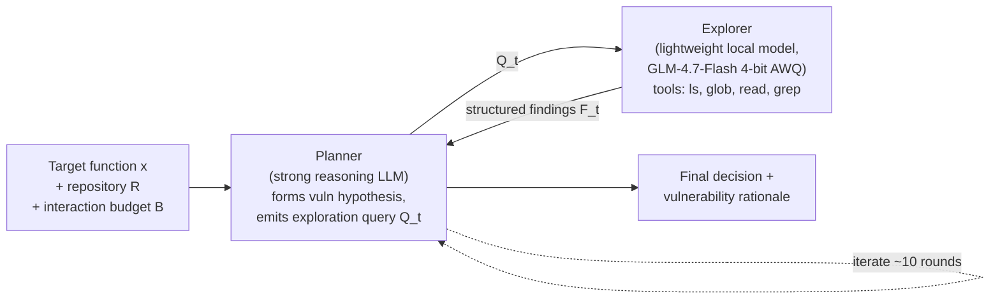
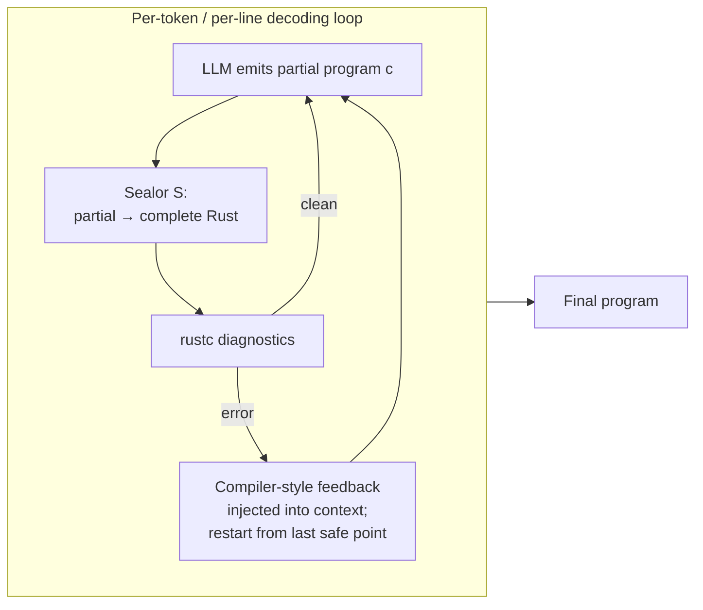

# Daily Scholar Papers Report — 2026-07-20

**[Download PDF](Daily_Papers_Report_2026-07-20.pdf)**

**Window covered:** 2026-07-19 → 2026-07-20 (Google Scholar alerts + user-curated self-emails, last 24 h)

---

## Executive Summary

A small but sharp cohort of two deep-read preprints plus three shorter venue-published summaries. Today's theme is **decoupling reasoning from execution in LLM-driven program work**: DREA separates a heavyweight security-reasoning *Planner* from a lightweight repository-*Explorer* to cut billable API tokens by 16–48× while lifting Pair-Correctness on repository-level vulnerability detection from 19–26 % to 30–42 %; Generative Compilation (ETH SRI + Berkeley) inserts a Lean-mechanised *sealor* into the LLM's decoding loop so that partial-program compiler diagnostics arrive as soon as an error is committable, driving compiler-error rates on Rust translation and updated-API tasks down to ≤3 % for the top frontier models. Both papers reach the same architectural conclusion from opposite directions — reasoning quality, not information volume, is the binding constraint. Three David Lo / Zhejiang-cluster venue-published papers on TPL-incompatibility, user-review localisation, and ARM firmware fault-localisation round out the day.

**Outstanding:** 2 · **Keep:** 3 · **Borderline High-Priority:** 0

## Highlighted Papers

| # | Title | Authors | Venue | Link |
|---|-------|---------|-------|------|
| 1 | DREA: Decoupled Reasoning and Exploration Agents for Repository-Level Vulnerability Detection | M. Sun, G. Meng | arXiv preprint 2026 | [arXiv:2607.13439](https://arxiv.org/abs/2607.13439) |
| 2 | Generative Compilation: On-the-Fly Compiler Feedback as AI Generates Code | N. Mündler-Sasahara, H. Venev, D. Song, M. Vechev, J. He | arXiv preprint 2026 | [arXiv:2607.13921](https://arxiv.org/abs/2607.13921) |
| 3 | Evaluating Incompatible Third-party Library API Usage in LLM-based Code Completion | L. Lin, Y. Fei, Y. Shen, L. Bao, Z. Liu, D. Lo | **ACM TOSEM 2026** | [doi:10.1145/3830085](https://doi.org/10.1145/3830085) |
| 4 | ToCoLo: A File-level Context-aware Approach for User Review-based Code Localization | K. Chi, C. Li, Z. Yang, C. Niu, B. Luo, D. Lo, V. Ng | **ACM TOSEM 2026** | [doi:10.1145/3831051](https://doi.org/10.1145/3831051) |
| 5 | The Last Mile of Fuzzing: An Efficient Fault Localization Framework for ARM Embedded Firmware | B. Chang, B. Zhao, B. Xu, Q. Zhang, P. Liu, Q. Xie, G. Meng, et al. | **IEEE TIFS 2026** | [ieeexplore:11606421](https://ieeexplore.ieee.org/abstract/document/11606421/) |

---

<strong>1.1</strong> · LLM-vuln detection · Planner/Explorer split lifts Pair-Correctness on RepoPairBench from 19–26% to 30–42% while cutting billable API tokens 16–48×.<a href="https://github.com/MarkLee131/paper-digest/issues/new?title=%5Bfeedback%5D+2026-07-20-1.1+Planner%2FExplorer+split+lifts+Pair-Correctness+on+RepoPairBench+from+19%E2%80%9326%25+to+30%E2%80%9342%25+while+cutting+billable+API+tokens+16%E2%80%9348%C3%97.+%F0%9F%91%8D&body=paper_id%3A+2026-07-20-1.1%0Atitle%3A+Planner%2FExplorer+split+lifts+Pair-Correctness+on+RepoPairBench+from+19%E2%80%9326%25+to+30%E2%80%9342%25+while+cutting+billable+API+tokens+16%E2%80%9348%C3%97.%0Aauthors%3A+%2A%2AAuthors.%2A%2A+Mingyang+Sun%2C+Guozhu+Meng+%E2%80%94+Institute+of+Information+Engineering%2C+Chinese+Academy+of+Sciences+%2B+School+of+Cyber+Security%2C+UCAS.%0Avenue%3A+preprint%0Atopic%3A+LLM-vuln+detection%0Arating%3A+thumbs-up%0A%0A%3C%21--+Optional+notes+below+this+line+are+read+by+preferences.py+as+soft+signals.+--%3E%0A&labels=feedback%2Cthumbs-up" target="_blank" rel="noopener" class="fb-thumbs-up" title="thumbs up" onclick="event.stopPropagation()">👍</a><a href="https://github.com/MarkLee131/paper-digest/issues/new?title=%5Bfeedback%5D+2026-07-20-1.1+Planner%2FExplorer+split+lifts+Pair-Correctness+on+RepoPairBench+from+19%E2%80%9326%25+to+30%E2%80%9342%25+while+cutting+billable+API+tokens+16%E2%80%9348%C3%97.+%F0%9F%AB%A5&body=paper_id%3A+2026-07-20-1.1%0Atitle%3A+Planner%2FExplorer+split+lifts+Pair-Correctness+on+RepoPairBench+from+19%E2%80%9326%25+to+30%E2%80%9342%25+while+cutting+billable+API+tokens+16%E2%80%9348%C3%97.%0Aauthors%3A+%2A%2AAuthors.%2A%2A+Mingyang+Sun%2C+Guozhu+Meng+%E2%80%94+Institute+of+Information+Engineering%2C+Chinese+Academy+of+Sciences+%2B+School+of+Cyber+Security%2C+UCAS.%0Avenue%3A+preprint%0Atopic%3A+LLM-vuln+detection%0Arating%3A+thumbs-down%0A%0A%3C%21--+Optional+notes+below+this+line+are+read+by+preferences.py+as+soft+signals.+--%3E%0A&labels=feedback%2Cthumbs-down" target="_blank" rel="noopener" class="fb-thumbs-down" title="less interested" onclick="event.stopPropagation()">🫥</a><a href="https://github.com/MarkLee131/paper-digest/issues/new?title=%5Bfeedback%5D+2026-07-20-1.1+Planner%2FExplorer+split+lifts+Pair-Correctness+on+RepoPairBench+from+19%E2%80%9326%25+to+30%E2%80%9342%25+while+cutting+billable+API+tokens+16%E2%80%9348%C3%97.+%F0%9F%94%96&body=paper_id%3A+2026-07-20-1.1%0Atitle%3A+Planner%2FExplorer+split+lifts+Pair-Correctness+on+RepoPairBench+from+19%E2%80%9326%25+to+30%E2%80%9342%25+while+cutting+billable+API+tokens+16%E2%80%9348%C3%97.%0Aauthors%3A+%2A%2AAuthors.%2A%2A+Mingyang+Sun%2C+Guozhu+Meng+%E2%80%94+Institute+of+Information+Engineering%2C+Chinese+Academy+of+Sciences+%2B+School+of+Cyber+Security%2C+UCAS.%0Avenue%3A+preprint%0Atopic%3A+LLM-vuln+detection%0Arating%3A+save-for-later%0A%0A%3C%21--+Optional+notes+below+this+line+are+read+by+preferences.py+as+soft+signals.+--%3E%0A&labels=feedback%2Csave-for-later" target="_blank" rel="noopener" class="fb-save-for-later" title="save for later" onclick="event.stopPropagation()">🔖</a>

**Authors.** Mingyang Sun, Guozhu Meng — Institute of Information Engineering, Chinese Academy of Sciences + School of Cyber Security, UCAS.
**Link.** [arXiv:2607.13439](https://arxiv.org/abs/2607.13439).

**Problem.** LLM-based vulnerability detection is dominated by two shapes of workflow: (i) classify an isolated target function, or (ii) prepend a fixed static-analysis context (caller/callee, PDG slice, RAG-retrieved knowledge). Real repository-level bugs — cross-file authorization flaws, sanitiser bypasses that depend on siblings elsewhere in the project, config-conditioned unsafe defaults — sit outside any pre-defined retrieval heuristic. The paper argues that human auditors do not do fixed retrieval either: they form *hypotheses* about risky behaviour and then trace only the evidence needed to confirm or refute them.

**Design — hypothesis-driven Planner + Explorer.**

The Planner is the only component charged at API rates. The Explorer runs locally on a single A800 GPU with four read-only navigation tools; its job is *retrieval*, not judgment, so its imperfect reasoning is tolerable. A typical run is roughly 10 Planner ↔ Explorer rounds per sample.

**Benchmark — RepoPairBench.** 100 validated CVE-sourced Python vulnerable/fix *pairs* from real projects, with the paired protocol requiring a method to predict both members correctly (P-C) to score.

**Headline numbers (verbatim).**

| Model | Method | Recall | FPR | F₁ | P-C | Youden's *J* |
|---|---|---:|---:|---:|---:|---:|
| DeepSeek-V3.2 | DREA | 80.0 % | 45.0 % | 71.1 % | **42.0 %** | 35.0 pp |
| DeepSeek-V3.2 | Function-Only | 39.0 % | 32.0 % | 45.6 % | 19.0 % | 7.0 pp |
| GLM-4.7 | DREA | 59.0 % | 38.0 % | 59.9 % | **34.0 %** | 21.0 pp |
| GLM-4.7 | Function-Only | 54.0 % | 43.0 % | 54.8 % | 26.0 % | 11.0 pp |
| GPT-5.2 | DREA | 53.0 % | 28.0 % | 58.6 % | **30.0 %** | 25.0 pp |
| GPT-5.2 | Function-Only | 42.0 % | 25.0 % | 50.3 % | 21.0 % | 17.0 pp |

Token economics tell the second half of the story: on DeepSeek-V3.2, the Planner uses 87.8 K tokens against the Explorer's 1.31 M — 6.3 % of the total is billed. GLM-4.7 pushes this ratio to 2.1 % (≈48× reduction vs. a hypothetical single-model design); GPT-5.2 to 2.4 % (≈41×).

**Ablation — where does the gain come from?** Comparing on DeepSeek-V3.2: Function-Only (P-C 19 %, 3 K tokens) < Whole-File (P-C 26 %, 20 K, FPR climbs to 41 %) < Single-Agent (P-C 24 %, **442 K** tokens, FPR 64 %) ≪ DREA (P-C 42 %, 88 K Planner tokens). The Single-Agent baseline shares DREA's tool access but collapses the roles into one model; it accumulates 5× more raw context and over-reports. Structured hypothesis-driven exploration, not sheer context volume, explains DREA's lead.

**Reasoning-correctness finding (RQ5, novel contribution).** Under the paper's LLM-as-a-Judge protocol that compares the model's rationale to the documented CVE mechanism, 26–55 % of DREA's *true positives* are "Lucky Hits" — right label, wrong reason. GPT-5.2 has the lowest Lucky-Hit rate (32.1 %), DeepSeek-V3.2 the highest (55.0 %). The gap is largely intrinsic to the backbone rather than dependent on how much context the system is fed — the same rank order holds under the Function-Only baseline.

**Where DREA helps most / least.** Data-flow-shaped CWEs (CWE-77 command injection reaches 100 % P-C on GLM-4.7 and GPT-5.2; CWE-94 code injection 71 % on DeepSeek-V3.2) far outperform absence-type CWEs (CWE-284 access control: 0–20 %; CWE-20 input validation: 14–29 %). The dominant reasoning error is *input-validation fixation* — the model defaults to generic "insufficient input validation" explanations regardless of the actual mechanism.

**Reusability.** The Planner/Explorer split is a broadly applicable *strong-reasoner + cheap-navigator* pattern for any code-agent task where token cost is the bottleneck (auditing, repair, refactoring). The Lucky-Hit protocol — CWE-tagged judge that compares rationale to documented mechanism — is a plug-in evaluation upgrade for any binary vulnerability-classification benchmark.

**Closing line.** *"…identifying security reasoning quality as a shared bottleneck for current LLMs rather than a limitation specific to any detection paradigm."*

<strong>1.2</strong> · program synthesis · Lean-verified "sealor" gives partial-program Rust compiler feedback mid-decode; Opus 4.8 hits 0 % errors, +18 pp functional correctness on UpdatedAPI.<a href="https://github.com/MarkLee131/paper-digest/issues/new?title=%5Bfeedback%5D+2026-07-20-1.2+Lean-verified+%22sealor%22+gives+partial-program+Rust+compiler+feedback+mid-decode%3B+Opus+4.8+hits+0+%25+errors%2C+%2B18+pp+functional+correctness+on+UpdatedAPI.+%F0%9F%91%8D&body=paper_id%3A+2026-07-20-1.2%0Atitle%3A+Lean-verified+%22sealor%22+gives+partial-program+Rust+compiler+feedback+mid-decode%3B+Opus+4.8+hits+0+%25+errors%2C+%2B18+pp+functional+correctness+on+UpdatedAPI.%0Aauthors%3A+%2A%2AAuthors.%2A%2A+Niels+M%C3%BCndler-Sasahara+%28ETH+Zurich%29%2C+Hristo+Venev+%28INSAIT%2C+Sofia+University+%E2%80%94+co-first%29%2C+Dawn+Song+%28UC+Berkeley%29%2C+Martin+Vechev+%28ETH+Zurich%29%2C+Jingxuan+He+%28UC+Berkeley%29.%0Avenue%3A+preprint%0Atopic%3A+program+synthesis%0Arating%3A+thumbs-up%0A%0A%3C%21--+Optional+notes+below+this+line+are+read+by+preferences.py+as+soft+signals.+--%3E%0A&labels=feedback%2Cthumbs-up" target="_blank" rel="noopener" class="fb-thumbs-up" title="thumbs up" onclick="event.stopPropagation()">👍</a><a href="https://github.com/MarkLee131/paper-digest/issues/new?title=%5Bfeedback%5D+2026-07-20-1.2+Lean-verified+%22sealor%22+gives+partial-program+Rust+compiler+feedback+mid-decode%3B+Opus+4.8+hits+0+%25+errors%2C+%2B18+pp+functional+correctness+on+UpdatedAPI.+%F0%9F%AB%A5&body=paper_id%3A+2026-07-20-1.2%0Atitle%3A+Lean-verified+%22sealor%22+gives+partial-program+Rust+compiler+feedback+mid-decode%3B+Opus+4.8+hits+0+%25+errors%2C+%2B18+pp+functional+correctness+on+UpdatedAPI.%0Aauthors%3A+%2A%2AAuthors.%2A%2A+Niels+M%C3%BCndler-Sasahara+%28ETH+Zurich%29%2C+Hristo+Venev+%28INSAIT%2C+Sofia+University+%E2%80%94+co-first%29%2C+Dawn+Song+%28UC+Berkeley%29%2C+Martin+Vechev+%28ETH+Zurich%29%2C+Jingxuan+He+%28UC+Berkeley%29.%0Avenue%3A+preprint%0Atopic%3A+program+synthesis%0Arating%3A+thumbs-down%0A%0A%3C%21--+Optional+notes+below+this+line+are+read+by+preferences.py+as+soft+signals.+--%3E%0A&labels=feedback%2Cthumbs-down" target="_blank" rel="noopener" class="fb-thumbs-down" title="less interested" onclick="event.stopPropagation()">🫥</a><a href="https://github.com/MarkLee131/paper-digest/issues/new?title=%5Bfeedback%5D+2026-07-20-1.2+Lean-verified+%22sealor%22+gives+partial-program+Rust+compiler+feedback+mid-decode%3B+Opus+4.8+hits+0+%25+errors%2C+%2B18+pp+functional+correctness+on+UpdatedAPI.+%F0%9F%94%96&body=paper_id%3A+2026-07-20-1.2%0Atitle%3A+Lean-verified+%22sealor%22+gives+partial-program+Rust+compiler+feedback+mid-decode%3B+Opus+4.8+hits+0+%25+errors%2C+%2B18+pp+functional+correctness+on+UpdatedAPI.%0Aauthors%3A+%2A%2AAuthors.%2A%2A+Niels+M%C3%BCndler-Sasahara+%28ETH+Zurich%29%2C+Hristo+Venev+%28INSAIT%2C+Sofia+University+%E2%80%94+co-first%29%2C+Dawn+Song+%28UC+Berkeley%29%2C+Martin+Vechev+%28ETH+Zurich%29%2C+Jingxuan+He+%28UC+Berkeley%29.%0Avenue%3A+preprint%0Atopic%3A+program+synthesis%0Arating%3A+save-for-later%0A%0A%3C%21--+Optional+notes+below+this+line+are+read+by+preferences.py+as+soft+signals.+--%3E%0A&labels=feedback%2Csave-for-later" target="_blank" rel="noopener" class="fb-save-for-later" title="save for later" onclick="event.stopPropagation()">🔖</a>

**Authors.** Niels Mündler-Sasahara (ETH Zurich), Hristo Venev (INSAIT, Sofia University — co-first), Dawn Song (UC Berkeley), Martin Vechev (ETH Zurich), Jingxuan He (UC Berkeley).
**Link.** [arXiv:2607.13921](https://arxiv.org/abs/2607.13921). Artifact: [eth-sri/generative-compilation](https://github.com/eth-sri/generative-compilation).

**Problem.** Post-generation compiler feedback works with any black-box LLM but only sees complete files, wastes every token emitted after the first unrecoverable error, and swamps the model with batched diagnostics. Constrained decoding filters tokens on-the-fly but is silent (no explanations), requires white-box access, and re-implementing Rust's borrow/lifetime semantics for a token filter is impractical (rustc has ~600 K LOC of frontend). The paper stakes out the middle ground: give the model compiler-style diagnostics *while it is generating*, without white-box access.

**Core idea — sealors.** A *sealor* is a lightweight, mostly syntax-guided transformation that turns a partial program into a complete one the standard compiler can diagnose. Formally (Definition 3.1):

> **Sealor Completeness and Soundness.** A sealor S is **complete** on X ⊆ Σ\* if, for every possible-to-complete partial program in X, S produces a well-typed complete program; it is **sound** if every partial program S rejects has no valid completion.

Theorem 3.2 lifts these properties to the induced generative compiler G_{C,S}(c) := C(S(c)). Completeness ensures possible-to-complete prefixes are never falsely rejected; soundness ensures the compiler catches genuine dead ends early.

**Two-level realisation.**

1. **FR (Featherweight Rust).** A compact calculus capturing move/copy semantics, mutable and immutable borrows, and lifetimes. The authors build a syntax-guided sealor for FR and mechanise its completeness and soundness proofs in **Lean**.
2. **Real Rust.** A ~5 K-LOC Rust implementation on top of rust-analyzer that synthesises sealed programs and delegates the semantic checking to rustc. This is the *first partial-program checker for real Rust*.

**Evaluation.** Two Rust tasks chosen because compiler errors dominate: **Translation** (C → Rust, built on CRUST-Bench) and **UpdatedAPI** (repository-level generation against recently changed library APIs — evaluates whether models can *use* compiler feedback about the changed API to repair). Seven models: Opus 4.8, GPT 5.3 Codex, Gemini 3.5 Flash, Kimi K2.7 Code, GLM 5.2, and two Qwen 3.5 sizes. Each ×2 samples per task. Compared conditions: LLM (no feedback), PC (post-generation compiler feedback), GC (this work).

**Headline table (Compiler-Error rate ↓ / Functional-Correctness ↑, all in %).**

| Model | Translation LLM / PC / GC | Translation FC LLM / PC / GC | UpdatedAPI LLM / PC / GC | UpdatedAPI FC LLM / PC / GC |
|---|---|---|---|---|
| Opus 4.8 | 51.8 / 7.5 / **2.6** | 32.0 / 61.0 / **62.3** | 51.7 / 6.7 / **0.0** | 43.3 / 85.0 / **86.7** |
| GPT 5.3 | 46.1 / 3.9 / **1.8** | 35.5 / 61.0 / **61.8** | 65.0 / 13.3 / **3.3** | 35.0 / 75.0 / **80.0** |
| Gemini 3.5 | 61.4 / 14.0 / **10.5** | 23.7 / 50.4 / **52.2** | 68.3 / 16.7 / **13.3** | 26.7 / 78.3 / **80.0** |
| Kimi K2.7 | 65.8 / 38.6 / **11.0** | 23.7 / 39.9 / **53.9** | 58.3 / 13.3 / **3.3** | 36.7 / 76.7 / **83.3** |
| GLM 5.2 | 60.5 / 17.1 / **15.4** | 25.4 / 51.3 / 50.4 | 80.0 / 45.0 / **16.7** | 20.0 / 53.3 / **71.7** |
| Qwen 397B | 64.5 / 13.2 / **12.7** | 23.2 / 54.8 / 53.1 | 73.3 / 21.7 / **15.0** | 26.7 / 68.3 / **71.7** |
| Qwen 9B | 85.5 / 36.0 / **35.1** | 8.3 / 30.3 / **33.3** | 90.0 / 43.3 / 43.3 | 10.0 / 48.3 / 41.7 |

Aggregate: PC brings mean compiler-error rate from 65.9 % (LLM alone) to 20.7 %; GC further to 13.1 %. GC wins on compiler-error rate in 13 of 14 model×dataset configurations (9 statistically significant at α=5 %); best functional correctness in 11 of 14.

**Runtime.** Counter-intuitively, intervening during generation *lowers* total runtime: overhead over LLM drops from +283 % (PC) to +170 % (GC). For Qwen 9B, mean runtime per Translation sample halves from 879 s (PC) to 357 s (GC), because early rejection prevents doomed continuations from being emitted at all.

**Efficiency structure.** 85.3 % of tasks finish without ever falling back to post-generation compiler feedback, and 55.4 % of all tasks are solved correctly within the first k=10 early-feedback restarts. Weaker models need more restarts (Qwen 9B exceeds 10 restarts on 40.9 % of tasks vs. 2.1 % for GPT 5.3 Codex).

**Formal component.** Full Lean mechanisation for FR: syntax, small-step semantics (T-ImmBorrow / T-MutBorrow), sealor construction, and Theorem 3.2 (Sealor completeness/soundness lifts to the generative compiler). ~5 K Rust + ~3 K Python + ~8 K Python orchestration; 329 tests.

**Reusability.** The sealor concept extends to any language where a rich static-semantics compiler exists but constrained decoding is impractical (F#, Scala 3, TypeScript strict). The "restart from last safe point" wrapper around post-generation feedback is a minimal-effort upgrade for existing agentic coding pipelines. The Lean development is a reusable substrate for proving other partial-program-checking properties on Rust-like calculi.

**Closing line.** *"…generative compilation is a step toward making compilers a first-class citizen of AI-assisted programming active during generation, rather than a separate post-generation check."*

<strong>1.3</strong> · LLM4Code eval · TOSEM study of TPL API-incompatibility in LLM-generated code completions (Lin, Fei, Shen, Bao, Liu, Lo).<a href="https://github.com/MarkLee131/paper-digest/issues/new?title=%5Bfeedback%5D+2026-07-20-1.3+TOSEM+study+of+TPL+API-incompatibility+in+LLM-generated+code+completions+%28Lin%2C+Fei%2C+Shen%2C+Bao%2C+Liu%2C+Lo%29.+%F0%9F%91%8D&body=paper_id%3A+2026-07-20-1.3%0Atitle%3A+TOSEM+study+of+TPL+API-incompatibility+in+LLM-generated+code+completions+%28Lin%2C+Fei%2C+Shen%2C+Bao%2C+Liu%2C+Lo%29.%0Aauthors%3A+%2A%2AAuthors.%2A%2A+Li+Lin%2C+Yaorui+Fei%2C+Yunfeng+Shen%2C+Lingfeng+Bao%2C+Zhongxin+Liu%2C+David+Lo+%E2%80%94+Zhejiang+University+%2B+Singapore+Management+University.%0Avenue%3A+preprint%0Atopic%3A+LLM4Code+eval%0Arating%3A+thumbs-up%0A%0A%3C%21--+Optional+notes+below+this+line+are+read+by+preferences.py+as+soft+signals.+--%3E%0A&labels=feedback%2Cthumbs-up" target="_blank" rel="noopener" class="fb-thumbs-up" title="thumbs up" onclick="event.stopPropagation()">👍</a><a href="https://github.com/MarkLee131/paper-digest/issues/new?title=%5Bfeedback%5D+2026-07-20-1.3+TOSEM+study+of+TPL+API-incompatibility+in+LLM-generated+code+completions+%28Lin%2C+Fei%2C+Shen%2C+Bao%2C+Liu%2C+Lo%29.+%F0%9F%AB%A5&body=paper_id%3A+2026-07-20-1.3%0Atitle%3A+TOSEM+study+of+TPL+API-incompatibility+in+LLM-generated+code+completions+%28Lin%2C+Fei%2C+Shen%2C+Bao%2C+Liu%2C+Lo%29.%0Aauthors%3A+%2A%2AAuthors.%2A%2A+Li+Lin%2C+Yaorui+Fei%2C+Yunfeng+Shen%2C+Lingfeng+Bao%2C+Zhongxin+Liu%2C+David+Lo+%E2%80%94+Zhejiang+University+%2B+Singapore+Management+University.%0Avenue%3A+preprint%0Atopic%3A+LLM4Code+eval%0Arating%3A+thumbs-down%0A%0A%3C%21--+Optional+notes+below+this+line+are+read+by+preferences.py+as+soft+signals.+--%3E%0A&labels=feedback%2Cthumbs-down" target="_blank" rel="noopener" class="fb-thumbs-down" title="less interested" onclick="event.stopPropagation()">🫥</a><a href="https://github.com/MarkLee131/paper-digest/issues/new?title=%5Bfeedback%5D+2026-07-20-1.3+TOSEM+study+of+TPL+API-incompatibility+in+LLM-generated+code+completions+%28Lin%2C+Fei%2C+Shen%2C+Bao%2C+Liu%2C+Lo%29.+%F0%9F%94%96&body=paper_id%3A+2026-07-20-1.3%0Atitle%3A+TOSEM+study+of+TPL+API-incompatibility+in+LLM-generated+code+completions+%28Lin%2C+Fei%2C+Shen%2C+Bao%2C+Liu%2C+Lo%29.%0Aauthors%3A+%2A%2AAuthors.%2A%2A+Li+Lin%2C+Yaorui+Fei%2C+Yunfeng+Shen%2C+Lingfeng+Bao%2C+Zhongxin+Liu%2C+David+Lo+%E2%80%94+Zhejiang+University+%2B+Singapore+Management+University.%0Avenue%3A+preprint%0Atopic%3A+LLM4Code+eval%0Arating%3A+save-for-later%0A%0A%3C%21--+Optional+notes+below+this+line+are+read+by+preferences.py+as+soft+signals.+--%3E%0A&labels=feedback%2Csave-for-later" target="_blank" rel="noopener" class="fb-save-for-later" title="save for later" onclick="event.stopPropagation()">🔖</a>

**Authors.** Li Lin, Yaorui Fei, Yunfeng Shen, Lingfeng Bao, Zhongxin Liu, David Lo — Zhejiang University + Singapore Management University.
**Link.** [ACM TOSEM 2026, doi:10.1145/3830085](https://doi.org/10.1145/3830085).

**Angle (from published abstract).** LLM-based code completion is widely deployed, but its ability to generate API usages compatible with *evolving* third-party libraries is largely uncharted. TPL APIs shift frequently (deprecations, renames, signature changes, semantic reinterpretations); an LLM whose training snapshot lags the target project's dependency lock file risks silently generating code that no longer compiles or, worse, compiles but changes behaviour. This paper's authors previously staked out the deprecated-API sub-problem in ICSE 2025 ([arXiv:2406.09834](https://arxiv.org/abs/2406.09834)); the TOSEM extension broadens the lens from *deprecated* to the full *incompatible* umbrella (deprecated, renamed, moved, restructured, semantically-drifted).

**Why it matters for our line of work.** Vulnerability-audit LLMs and code-generation LLMs both inherit whatever API surface exists in their pretraining data. Recent CVEs traceable to LLM-suggested calls that silently invoke deprecated cryptographic APIs make this the pragmatic corner of the LLM4Code reliability question. A TOSEM-length treatment from the David Lo group typically ships a labelled benchmark suitable for downstream tool evaluation.

**Status.** Full deep-read pending — paper sits behind the ACM Digital Library paywall; no arXiv mirror surfaced in today's crawl. Marked *Keep* for later ingest once a preprint is available or a library copy can be pulled through institutional access.

<strong>1.4</strong> · code localisation · ToCoLo: file-level context-aware localisation of user-review bug reports (TOSEM 2026, Lo &amp; Ng groups).<a href="https://github.com/MarkLee131/paper-digest/issues/new?title=%5Bfeedback%5D+2026-07-20-1.4+ToCoLo%3A+file-level+context-aware+localisation+of+user-review+bug+reports+%28TOSEM+2026%2C+Lo+%26amp%3B+Ng+groups%29.+%F0%9F%91%8D&body=paper_id%3A+2026-07-20-1.4%0Atitle%3A+ToCoLo%3A+file-level+context-aware+localisation+of+user-review+bug+reports+%28TOSEM+2026%2C+Lo+%26amp%3B+Ng+groups%29.%0Aauthors%3A+%2A%2AAuthors.%2A%2A+Kaifang+Chi%2C+Chuanyi+Li%2C+Zhenhao+Yang%2C+Chuanxin+Niu%2C+Bin+Luo%2C+David+Lo%2C+Vincent+Ng+%E2%80%94+Nanjing+University+%2B+SMU+%2B+UT+Dallas.%0Avenue%3A+preprint%0Atopic%3A+code+localisation%0Arating%3A+thumbs-up%0A%0A%3C%21--+Optional+notes+below+this+line+are+read+by+preferences.py+as+soft+signals.+--%3E%0A&labels=feedback%2Cthumbs-up" target="_blank" rel="noopener" class="fb-thumbs-up" title="thumbs up" onclick="event.stopPropagation()">👍</a><a href="https://github.com/MarkLee131/paper-digest/issues/new?title=%5Bfeedback%5D+2026-07-20-1.4+ToCoLo%3A+file-level+context-aware+localisation+of+user-review+bug+reports+%28TOSEM+2026%2C+Lo+%26amp%3B+Ng+groups%29.+%F0%9F%AB%A5&body=paper_id%3A+2026-07-20-1.4%0Atitle%3A+ToCoLo%3A+file-level+context-aware+localisation+of+user-review+bug+reports+%28TOSEM+2026%2C+Lo+%26amp%3B+Ng+groups%29.%0Aauthors%3A+%2A%2AAuthors.%2A%2A+Kaifang+Chi%2C+Chuanyi+Li%2C+Zhenhao+Yang%2C+Chuanxin+Niu%2C+Bin+Luo%2C+David+Lo%2C+Vincent+Ng+%E2%80%94+Nanjing+University+%2B+SMU+%2B+UT+Dallas.%0Avenue%3A+preprint%0Atopic%3A+code+localisation%0Arating%3A+thumbs-down%0A%0A%3C%21--+Optional+notes+below+this+line+are+read+by+preferences.py+as+soft+signals.+--%3E%0A&labels=feedback%2Cthumbs-down" target="_blank" rel="noopener" class="fb-thumbs-down" title="less interested" onclick="event.stopPropagation()">🫥</a><a href="https://github.com/MarkLee131/paper-digest/issues/new?title=%5Bfeedback%5D+2026-07-20-1.4+ToCoLo%3A+file-level+context-aware+localisation+of+user-review+bug+reports+%28TOSEM+2026%2C+Lo+%26amp%3B+Ng+groups%29.+%F0%9F%94%96&body=paper_id%3A+2026-07-20-1.4%0Atitle%3A+ToCoLo%3A+file-level+context-aware+localisation+of+user-review+bug+reports+%28TOSEM+2026%2C+Lo+%26amp%3B+Ng+groups%29.%0Aauthors%3A+%2A%2AAuthors.%2A%2A+Kaifang+Chi%2C+Chuanyi+Li%2C+Zhenhao+Yang%2C+Chuanxin+Niu%2C+Bin+Luo%2C+David+Lo%2C+Vincent+Ng+%E2%80%94+Nanjing+University+%2B+SMU+%2B+UT+Dallas.%0Avenue%3A+preprint%0Atopic%3A+code+localisation%0Arating%3A+save-for-later%0A%0A%3C%21--+Optional+notes+below+this+line+are+read+by+preferences.py+as+soft+signals.+--%3E%0A&labels=feedback%2Csave-for-later" target="_blank" rel="noopener" class="fb-save-for-later" title="save for later" onclick="event.stopPropagation()">🔖</a>

**Authors.** Kaifang Chi, Chuanyi Li, Zhenhao Yang, Chuanxin Niu, Bin Luo, David Lo, Vincent Ng — Nanjing University + SMU + UT Dallas.
**Link.** [ACM TOSEM 2026, doi:10.1145/3831051](https://doi.org/10.1145/3831051).

**Angle (from published abstract).** User reviews on the Google Play Store and comparable stores are a first-class bug-report channel for mobile developers, but the reviews describe symptoms in natural language while the fix must land in specific source files. Prior work on review-to-code localisation typically operates at coarser granularity (method or class) or ignores repository-level file context. ToCoLo positions itself as a *file-level* localiser that reasons about surrounding file context so that a single review yields a ranked list of source files rather than isolated method fragments.

**Why it matters for our line of work.** File-level review-to-code localisation is a *retrieve-and-verify* pattern that mirrors bug-triage and vulnerability-localisation pipelines. The context-aware angle — treating file identity as more than a bag of methods — is a modest but frequently-recurring design choice that ripples through repository-level agent design (cf. DREA's structured findings today).

**Status.** Full deep-read pending — ACM DL paywall, no preprint surfaced. Marked *Keep* pending a preprint / library copy.

<strong>1.5</strong> · firmware fuzzing · IEEE TIFS 2026: efficient fault-localisation on ARM embedded firmware post-fuzzing (Chang, Zhao, Ji cluster).<a href="https://github.com/MarkLee131/paper-digest/issues/new?title=%5Bfeedback%5D+2026-07-20-1.5+IEEE+TIFS+2026%3A+efficient+fault-localisation+on+ARM+embedded+firmware+post-fuzzing+%28Chang%2C+Zhao%2C+Ji+cluster%29.+%F0%9F%91%8D&body=paper_id%3A+2026-07-20-1.5%0Atitle%3A+IEEE+TIFS+2026%3A+efficient+fault-localisation+on+ARM+embedded+firmware+post-fuzzing+%28Chang%2C+Zhao%2C+Ji+cluster%29.%0Aauthors%3A+%2A%2AAuthors.%2A%2A+Boyu+Chang%2C+Binbin+Zhao%2C+Bo+Xu%2C+Qiao+Zhang%2C+Peiyu+Liu%2C+Qinying+Xie%2C+Guozhu+Meng%2C+et+al.+%E2%80%94+Zhejiang+University+%2B+Georgia+Tech+%2B+University+of+Chinese+Academy+of+Sciences.%0Avenue%3A+preprint%0Atopic%3A+firmware+fuzzing%0Arating%3A+thumbs-up%0A%0A%3C%21--+Optional+notes+below+this+line+are+read+by+preferences.py+as+soft+signals.+--%3E%0A&labels=feedback%2Cthumbs-up" target="_blank" rel="noopener" class="fb-thumbs-up" title="thumbs up" onclick="event.stopPropagation()">👍</a><a href="https://github.com/MarkLee131/paper-digest/issues/new?title=%5Bfeedback%5D+2026-07-20-1.5+IEEE+TIFS+2026%3A+efficient+fault-localisation+on+ARM+embedded+firmware+post-fuzzing+%28Chang%2C+Zhao%2C+Ji+cluster%29.+%F0%9F%AB%A5&body=paper_id%3A+2026-07-20-1.5%0Atitle%3A+IEEE+TIFS+2026%3A+efficient+fault-localisation+on+ARM+embedded+firmware+post-fuzzing+%28Chang%2C+Zhao%2C+Ji+cluster%29.%0Aauthors%3A+%2A%2AAuthors.%2A%2A+Boyu+Chang%2C+Binbin+Zhao%2C+Bo+Xu%2C+Qiao+Zhang%2C+Peiyu+Liu%2C+Qinying+Xie%2C+Guozhu+Meng%2C+et+al.+%E2%80%94+Zhejiang+University+%2B+Georgia+Tech+%2B+University+of+Chinese+Academy+of+Sciences.%0Avenue%3A+preprint%0Atopic%3A+firmware+fuzzing%0Arating%3A+thumbs-down%0A%0A%3C%21--+Optional+notes+below+this+line+are+read+by+preferences.py+as+soft+signals.+--%3E%0A&labels=feedback%2Cthumbs-down" target="_blank" rel="noopener" class="fb-thumbs-down" title="less interested" onclick="event.stopPropagation()">🫥</a><a href="https://github.com/MarkLee131/paper-digest/issues/new?title=%5Bfeedback%5D+2026-07-20-1.5+IEEE+TIFS+2026%3A+efficient+fault-localisation+on+ARM+embedded+firmware+post-fuzzing+%28Chang%2C+Zhao%2C+Ji+cluster%29.+%F0%9F%94%96&body=paper_id%3A+2026-07-20-1.5%0Atitle%3A+IEEE+TIFS+2026%3A+efficient+fault-localisation+on+ARM+embedded+firmware+post-fuzzing+%28Chang%2C+Zhao%2C+Ji+cluster%29.%0Aauthors%3A+%2A%2AAuthors.%2A%2A+Boyu+Chang%2C+Binbin+Zhao%2C+Bo+Xu%2C+Qiao+Zhang%2C+Peiyu+Liu%2C+Qinying+Xie%2C+Guozhu+Meng%2C+et+al.+%E2%80%94+Zhejiang+University+%2B+Georgia+Tech+%2B+University+of+Chinese+Academy+of+Sciences.%0Avenue%3A+preprint%0Atopic%3A+firmware+fuzzing%0Arating%3A+save-for-later%0A%0A%3C%21--+Optional+notes+below+this+line+are+read+by+preferences.py+as+soft+signals.+--%3E%0A&labels=feedback%2Csave-for-later" target="_blank" rel="noopener" class="fb-save-for-later" title="save for later" onclick="event.stopPropagation()">🔖</a>

**Authors.** Boyu Chang, Binbin Zhao, Bo Xu, Qiao Zhang, Peiyu Liu, Qinying Xie, Guozhu Meng, et al. — Zhejiang University + Georgia Tech + University of Chinese Academy of Sciences.
**Link.** [IEEE Transactions on Information Forensics and Security 2026 — abstract 11606421](https://ieeexplore.ieee.org/abstract/document/11606421/). Precursor: FirmRCA, IEEE S&P 2025 ([arXiv:2410.18483](https://arxiv.org/abs/2410.18483)).

**Angle (from published abstract).** Fuzzing exposes crashes in ARM embedded firmware, but the *last mile* — locating the root cause of each crash in a binary with no source, no symbols, and a tight vendor NDA — remains the dominant cost. The paper positions itself as a journal-length extension of the FirmRCA framework, sharpening the event-based analysis that resolves memory-aliasing on Cortex-M binaries into an end-to-end efficient localisation pipeline.

**Why it matters for our line of work.** Firmware fault-localisation is the natural target for the same *reasoning-decoupling* pattern that dominates today's cohort: a heavy analytical judgment (which observed event actually corresponds to a root cause?) sitting atop a cheap-per-step exploration substrate (event trace, alias resolution). The Chang/Zhao cluster reliably ships releasable artefacts (FirmRCA's dataset and instrumentation are on GitHub).

**Status.** Full deep-read pending — IEEE Xplore paywall, no arXiv mirror for the journal extension yet. Marked *Keep* pending open-access release.

## Cross-Paper Synthesis

Two independent Outstanding papers converge on the same architectural claim from opposite ends of the LLM stack: **reasoning quality, not information volume, is what limits current LLM-for-code systems**, and the answer is to *decouple* a strong-reasoning core from a cheap execution / retrieval substrate.

DREA reaches this through cost analysis: routing tool-heavy exploration to a lightweight local Explorer offloads 93.7–97.9 % of tokens and simultaneously outperforms a single-agent baseline that had *more* raw context (442 K tokens vs. 88 K Planner tokens) but 18 pp lower P-C. The bottleneck sat in synthesis, not access.

Generative Compilation reaches the same conclusion from the language-server side: what post-generation feedback and constrained decoding both lack is *early*, *localised*, *explanatory* signal. Wrapping the compiler in a Lean-verified sealor gives the reasoning model diagnostics scoped to a single mistake at the moment it commits it, not a batched diff at end-of-file. The result is dramatic even on Opus 4.8, which already scored well on PC — the residual 6.7 % UpdatedAPI compiler-error rate goes to 0.0 %.

A secondary connecting thread is *offloading to smaller models for cost, not capability*. DREA's Explorer is a 4-bit-quantised GLM-4.7-Flash; Generative Compilation's runtime overhead drops most for Qwen 9B, whose weak reasoning benefits most from early-feedback restart. In both cases the small model is *not* asked to do the hard part; it is asked to compress a mechanical loop.

Both papers also independently expose *evaluation weakness in the current LLM-code literature*: DREA's reasoning-correctness protocol shows that 26–55 % of true positives are Lucky Hits (correct label, wrong rationale); Generative Compilation shows PC's compiler-error headline rate hides *which errors survive*. The community-facing lesson is that headline F1 / compilation-rate numbers likely overstate the reliability of current agentic pipelines by an amount comparable to the improvements each paper reports.

## Writing & Rationale Insights

Both Outstanding papers front-load a *cost equation*. DREA's abstract states the token-offload ratio (93 %) and cost-reduction factor (16–48×) alongside the primary accuracy claim, and Generative Compilation opens by naming exactly what post-generation feedback and constrained decoding each fail to give (early feedback vs. explanations). Writing an agentic-LLM paper without a first-page cost / signal statement is now visibly out of step.

DREA's decision to name a *failure mode of its own true positives* — the Lucky Hit — is a rhetorically strong move: it insulates the paper from the standard "your improvements are inflated recall" critique by acknowledging the effect and quantifying it before a reviewer can.

Generative Compilation's methodological signature is the *soundness / completeness statement of a program-manipulation gadget*, mechanised in Lean, sitting alongside a large empirical LLM evaluation. This pairing is unusual for PL-adjacent LLM work and reads as the deliberate playbook of the ETH SRI group: prove the tool is correct, then measure the model on top of it. The recipe transports well to any partial-program checker or IDE-scoped analysis a future paper wants to slot into an LLM loop.
