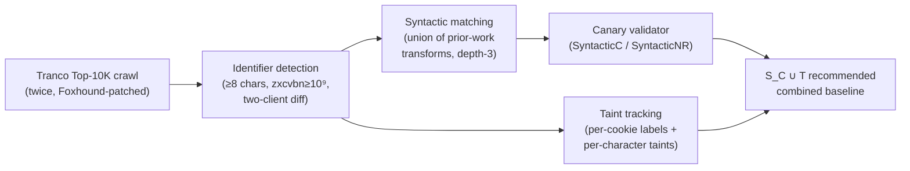

# Daily Scholar Papers Report — 2026-07-21

**[Download PDF](Daily_Papers_Report_2026-07-21.pdf)**

**Window covered:** 2026-07-20 → 2026-07-21 (Google Scholar alerts + user-curated self-emails, last 24 h)

---

## Executive Summary

A slim triage day dominated by one deep-readable venue paper: the PoPETs 2026 head-to-head between *syntactic matching* and *dynamic taint tracking* for stateful web-tracking detection (Calzavara, Casarin, Squarcina, Maffei — Ca' Foscari + IMT Lucca + TU Wien). Working from a shared corpus of 40,605 tracking requests over the Tranco Top-10K, the authors quantify what web-privacy folklore has long asserted: **neither technique dominates**. Syntactic matching misses ~87 % of the Google-Analytics `cid=Z.C` pattern because the dot-split components each fail the individual identifier-guessability test in isolation; taint tracking (Foxhound) misses roughly a third of the dataset because it drops taints across string-to-number-to-string round-trips, `Object.keys` reflections on tainted keys, and HTTP redirects. Their union (SyntacticC ∪ Taint) recovers +49 % more requests than taint alone and shifts Google-Analytics domain prevalence from 511 to 1,923 websites (×3.8) — a correction to one of the most-measured trackers in the literature. The paper's real contribution is engineering: two Foxhound patches (per-cookie taint labels, byte-level per-character taints over storage) plus a canary-based active validator (SyntacticC) that removes 24 % of matched requests as false positives, breaking <2 % of surrounding traffic.

Two additional items pass on abstract-only grounds: **VerusSeek** (Springer LNCS chapter, Cheng Wen + Shengchao Qin co-authors) semantically chunks verified Verus code into proof constructs — contracts, invariants, lemmas, assertions — indexed with type-aware retrieval and hierarchical context expansion, reporting +76.7 % over AutoVerus and +43.4 % over RagVerus on 150 VerusBench tasks; and an ASE 2026 citation on cross-level PGO for industrial systems (Ting Chen co-author) that arrived as title only. The three surviving items share a subtle common frame — all three critique undifferentiated retrieval (over network traffic, over verified-code corpora, over execution traces) and propose finer-grained typed retrieval plus a downstream validator, echoing the DREA / Generative-Compilation pattern the digest has flagged repeatedly this month.

**Outstanding:** 1 · **Keep:** 2 · **Borderline High-Priority:** 0

## Highlighted Papers

| # | Title | Authors | Venue | Link |
|---|-------|---------|-------|------|
| 1 | From Syntactic Matching to Taint Tracking and Back: A Comparative Study of Web Tracking Detection Techniques | S. Calzavara, S. Casarin, M. Squarcina, M. Maffei | **PoPETs 2026(4)** | [doi:10.56553/popets-2026-0122](https://doi.org/10.56553/popets-2026-0122) |
| 2 | Enhancing LLM-Based Proof Synthesis for Rust Programs via Semantic Chunking and Hierarchical Context Expansion (VerusSeek) | Y. Zhang, C. Wen, Z. Xu, D. Liu, J. Cao, Y. Liu, S. Qin, et al. | Springer LNCS 2026 | [doi:10.1007/978-3-032-30693-7_6](https://doi.org/10.1007/978-3-032-30693-7_6) |
| 3 | Beyond Single-Level PGO: Understanding and Harnessing Cross-Level Optimization Effects in Industrial Systems | D. Liu, Y. Cheng, Y. Cui, T. Chen, J. Chen, Z. Xue, C. Hu, et al. | **ASE 2026** | [conf.researchr.org/ase-2026](https://conf.researchr.org/track/ase-2026/ase-2026-research-track) |

---

<strong>1.1</strong> · Web privacy measurement · Union of patched-Foxhound taint tracking and canary-validated syntactic matching finds +49 % more tracking requests than taint alone and lifts Google-Analytics domain prevalence 3.8× on Tranco Top-10K.<a href="https://github.com/MarkLee131/paper-digest/issues/new?title=%5Bfeedback%5D+2026-07-21-1.1+Union+of+patched-Foxhound+taint+tracking+and+canary-validated+syntactic+matching+finds+%2B49+%25+more+tracking+requests+than+taint+alone+and+lifts+Google-Analytics+domain+prevalence+3.8%C3%97+on+Tranco+Top-10K.+%F0%9F%91%8D&body=paper_id%3A+2026-07-21-1.1%0Atitle%3A+Union+of+patched-Foxhound+taint+tracking+and+canary-validated+syntactic+matching+finds+%2B49+%25+more+tracking+requests+than+taint+alone+and+lifts+Google-Analytics+domain+prevalence+3.8%C3%97+on+Tranco+Top-10K.%0Aauthors%3A+%2A%2AAuthors.%2A%2A+Stefano+Calzavara%2C+Samuele+Casarin+%28Universit%C3%A0+Ca%27+Foscari+Venezia+%2B+Scuola+IMT+Alti+Studi+Lucca%29%2C+Marco+Squarcina%2C+Matteo+Maffei+%28TU+Wien%29.%0Avenue%3A+preprint%0Atopic%3A+Web+privacy+measurement%0Arating%3A+thumbs-up%0A%0A%3C%21--+Optional+notes+below+this+line+are+read+by+preferences.py+as+soft+signals.+--%3E%0A&labels=feedback%2Cthumbs-up" target="_blank" rel="noopener" class="fb-thumbs-up" title="thumbs up" onclick="event.stopPropagation()">👍</a><a href="https://github.com/MarkLee131/paper-digest/issues/new?title=%5Bfeedback%5D+2026-07-21-1.1+Union+of+patched-Foxhound+taint+tracking+and+canary-validated+syntactic+matching+finds+%2B49+%25+more+tracking+requests+than+taint+alone+and+lifts+Google-Analytics+domain+prevalence+3.8%C3%97+on+Tranco+Top-10K.+%F0%9F%AB%A5&body=paper_id%3A+2026-07-21-1.1%0Atitle%3A+Union+of+patched-Foxhound+taint+tracking+and+canary-validated+syntactic+matching+finds+%2B49+%25+more+tracking+requests+than+taint+alone+and+lifts+Google-Analytics+domain+prevalence+3.8%C3%97+on+Tranco+Top-10K.%0Aauthors%3A+%2A%2AAuthors.%2A%2A+Stefano+Calzavara%2C+Samuele+Casarin+%28Universit%C3%A0+Ca%27+Foscari+Venezia+%2B+Scuola+IMT+Alti+Studi+Lucca%29%2C+Marco+Squarcina%2C+Matteo+Maffei+%28TU+Wien%29.%0Avenue%3A+preprint%0Atopic%3A+Web+privacy+measurement%0Arating%3A+thumbs-down%0A%0A%3C%21--+Optional+notes+below+this+line+are+read+by+preferences.py+as+soft+signals.+--%3E%0A&labels=feedback%2Cthumbs-down" target="_blank" rel="noopener" class="fb-thumbs-down" title="less interested" onclick="event.stopPropagation()">🫥</a><a href="https://github.com/MarkLee131/paper-digest/issues/new?title=%5Bfeedback%5D+2026-07-21-1.1+Union+of+patched-Foxhound+taint+tracking+and+canary-validated+syntactic+matching+finds+%2B49+%25+more+tracking+requests+than+taint+alone+and+lifts+Google-Analytics+domain+prevalence+3.8%C3%97+on+Tranco+Top-10K.+%F0%9F%94%96&body=paper_id%3A+2026-07-21-1.1%0Atitle%3A+Union+of+patched-Foxhound+taint+tracking+and+canary-validated+syntactic+matching+finds+%2B49+%25+more+tracking+requests+than+taint+alone+and+lifts+Google-Analytics+domain+prevalence+3.8%C3%97+on+Tranco+Top-10K.%0Aauthors%3A+%2A%2AAuthors.%2A%2A+Stefano+Calzavara%2C+Samuele+Casarin+%28Universit%C3%A0+Ca%27+Foscari+Venezia+%2B+Scuola+IMT+Alti+Studi+Lucca%29%2C+Marco+Squarcina%2C+Matteo+Maffei+%28TU+Wien%29.%0Avenue%3A+preprint%0Atopic%3A+Web+privacy+measurement%0Arating%3A+save-for-later%0A%0A%3C%21--+Optional+notes+below+this+line+are+read+by+preferences.py+as+soft+signals.+--%3E%0A&labels=feedback%2Csave-for-later" target="_blank" rel="noopener" class="fb-save-for-later" title="save for later" onclick="event.stopPropagation()">🔖</a>

**Authors.** Stefano Calzavara, Samuele Casarin (Università Ca' Foscari Venezia + Scuola IMT Alti Studi Lucca), Marco Squarcina, Matteo Maffei (TU Wien).
**Venue.** *Proceedings on Privacy Enhancing Technologies* **2026**(4), pp. 305–320. Direct PDF: [petsymposium.org/popets/2026/popets-2026-0122.pdf](https://petsymposium.org/popets/2026/popets-2026-0122.pdf).
**License.** CC-BY 4.0. A local mirror of the paper is served at [WebTrackingDetection_Calzavara_2026.pdf](../../papers/WebTrackingDetection_Calzavara_2026.pdf).

**Problem.** For a decade, web-tracking measurement has settled on one of two detection strategies: *syntactic matching* — grep for a client-side identifier (possibly URL-, Base64-, or hash-transformed) inside outgoing network traffic — or *dynamic taint tracking* — mark identifier bytes at the storage source, propagate through JavaScript, flag if any tainted byte reaches a network sink. Individual studies pick one and report headline numbers; there was no principled head-to-head. The paper builds a shared corpus, runs both pipelines side-by-side, and quantifies what each systematically misses.

**Dataset.** Tranco Top 10K generated 2026-02-08. Each site visited twice by a crawler driving a modified Foxhound instance: the first visit lets tracking scripts populate the client-side storage, the second collects tracking requests under both pipelines simultaneously. Final dataset: **40,605 tracking requests** over 7,614 successfully accessed sites — **33,584 detected by syntactic matching (*S*)**, **23,109 by taint tracking (*T*)**, **16,088 by both**, **17,496 by *S* alone**, **7,021 by *T* alone**. Identifiers are strings ≥ 8 chars with zxcvbn cracking cost ≥ 10⁹ guesses, filtered by two-client differencing to remove non-personalising values.

**Syntactic matching — union-of-prior-work design.** The paper reconstructs the design space of every published web-privacy syntactic matcher (Roesner, Acar, Englehardt & Narayanan, Papadopoulos, Starov & Nikiforakis, Fouad, Chen, Sánchez-Rola, Bahrami) and unions all their valid choices: slicing via JSON extraction, `k=v` splitting, non-alphanumeric split; encoding via URL-Enc, Base64-Enc, MD5, SHA1; decoding via URL-Dec, Base64-Dec; recursion depth 3 in both directions; request parsing over query string, path, and body (JSON / URL-encoded / raw); response body decoded up to 3 layers. Deflate and Split-in-request-parsing are excluded — Deflate for framing ambiguity (raw / zlib / gzip), Split for a 2.5× runtime cost that produced only a +0.6 % detection gain on a 1K-site pilot.

**Foxhound modifications (the enabling engineering).** Two granularity fixes were needed to make Foxhound comparable at all:

1. **Per-cookie taint labels.** In stock Foxhound, every byte returned from `document.cookie` shares a single taint. The authors extend cookie sourcing so that reading cookie `k` yields taint `document.cookie[k]`, letting downstream analysis know *which* cookie propagated to the sink.
2. **Byte-level per-character taints over storage.** Stock Foxhound gives every character of a storage read the same taint, so slicing an identifier and sending only a non-identifying prefix still reports a tainted flow. The authors introduce per-character taints (e.g., `document.cookie[k][0:1]`), then at the sink reconstruct which characters actually reached it — only *then* applying the identifier-guessability check to the concatenation.

**Canary-based active validator (SyntacticC / SyntacticNR).** After the initial matching pass, the crawler revisits each site with each identifier rewritten to a canary. If the same request no longer appears, the original match is *confirmed* as tracking (**SyntacticC**). If it does re-appear, the original is *refuted* as spurious. Unresolved cases are kept by **SyntacticNR** (No-Refuted) and dropped by SyntacticC. A breakage analysis (Appendix A) confirms the canary substitution disrupts <2 % of the traffic that undergoes testing — safe to deploy at scale.

**Headline numbers (verbatim, Tables 4 and 5).**

| Measure | *S* | *S_NR* | *S_C* | *T* | *S_C* ∪ *T* |
|---|---:|---:|---:|---:|---:|
| Total tracking requests | 33,584 | 28,726 | 25,440 | 23,109 | **34,358** |
|  … in Disconnect | 25,975 | 22,357 | 19,909 | 19,020 | 28,449 |
| Avg tracking req / site | 4.41 | 3.77 | 3.34 | 3.04 | 4.51 |
| Total distinct trackers | 2,823 | 2,296 | 1,813 | 1,623 | 2,183 |
|  … in Disconnect | 1,255 | 1,010 | 760 | 728 | 988 |
| Sites with a tracker | 3,642 | 3,538 | 3,396 | **4,292** | **4,604** |
|  … in Disconnect | 2,980 | 2,902 | 2,756 | 3,970 | 4,254 |

The combined pipeline finds **+49 % more requests than *T* alone and +35 % more than *S_C* alone**, and its 83 % Disconnect coverage exceeds either single technique.

**Where does each technique systematically fail?**

*Syntactic-matching false negatives (7,021 requests; 87 % of the manually confirmed subset targets Google-Analytics domains).* Google Analytics writes `_ga` as `GAX.Y.Z.C`, where `Z.C` uniquely identifies the client. Splitting on dots yields components `GAX`, `Y`, `Z`, `C` — each too low-entropy in isolation to clear the guessability threshold, so the matcher never looks for them. Taint tracking propagates the taint to the concatenated `cid=Z.C` parameter and reports it. Other manually confirmed misses include `featuregates.org` (Base64 encode → character reverse) and `pagead2.googlesyndication.com` (uppercase conversion).

*Taint-tracking false negatives (17,496 requests, ~29 % of the dataset is *S_C*-only).* Three failure modes, each traced to a specific tracker in the dataset:

- **String↔number coercion drops taint.** `mc.yandex.com` reads a numeric string from storage (tainted), converts to `Number`, then back to string via concatenation. Foxhound only propagates taint through string operations, so the network-side value arrives untainted.
- **`Object.keys` returns untainted strings.** `region1.google-analytics.com` stores a tainted identifier as a *key* of a JavaScript object; the reflection through `Object.keys` produces untainted strings that then reach the sink.
- **HTTP redirects bypass JavaScript entirely.** `sb.scorecardresearch.com` receives a tainted identifier that is echoed via a 3xx Location header into a request to `end.mpod.ch`; Foxhound has no visibility of the HTTP layer, so the second request is missed.

**Downstream inference impact.**

- Trackers *per site*: *S* = 2.02 vs *T* = 1.47 (−27 %). Trackers *in Disconnect* per site: 1.51 vs 1.17.
- Google-Analytics domain (`region1.google-analytics.com`) visible on 511 sites via *S* but on **1,923 sites via *T*** — a **3.8× correction** of one of the most-measured trackers in the literature.
- Disconnect filter-list evaluation: 78 % effective by *S_C*, 82 % effective by *T* — but the *missed* trackers differ, so any single-technique evaluation systematically underestimates Disconnect's false-negative surface.

**Reusable methodology.**

- The Foxhound patches (per-cookie taints, byte-level storage taints) apply to any privacy or security study blocked by "which storage item did this taint come from" — GDPR-consent auditing, browser-fingerprinting studies, extension-leak measurement.
- The canary-based active validator is a general anti-false-positive filter for any measurement that observes a *before* state and can perturb it, then re-observe.
- The "measure with both, union for coverage" recommendation is a directly applicable methodological baseline for future web-privacy pipelines.

**Limitations.** Only two techniques (S, T) are compared — the ML-classifier line (AdGraph, CookieGraph, WebGraph, WTAGRAPH) is future work. Foxhound is one taint tracker (the best-of-breed per the authors' own WWW 2025 comparison); other engines may exhibit different loss patterns. Dataset is a single crawl of Tranco 10K — no logged-in behaviour, no mobile browsers.

**Closing line (verbatim).** *"combining syntactic matching with taint tracking, when done with care, can provide a more robust and nuanced assessment of web tracking practices."*

<strong>2.1</strong> · LLM-formal verification · Semantic chunking of verified Verus code into proof constructs, with type-aware retrieval, reportedly beats AutoVerus by 76.7 % and RagVerus by 43.4 % on 150 VerusBench tasks.<a href="https://github.com/MarkLee131/paper-digest/issues/new?title=%5Bfeedback%5D+2026-07-21-2.1+Semantic+chunking+of+verified+Verus+code+into+proof+constructs%2C+with+type-aware+retrieval%2C+reportedly+beats+AutoVerus+by+76.7+%25+and+RagVerus+by+43.4+%25+on+150+VerusBench+tasks.+%F0%9F%91%8D&body=paper_id%3A+2026-07-21-2.1%0Atitle%3A+Semantic+chunking+of+verified+Verus+code+into+proof+constructs%2C+with+type-aware+retrieval%2C+reportedly+beats+AutoVerus+by+76.7+%25+and+RagVerus+by+43.4+%25+on+150+VerusBench+tasks.%0Aauthors%3A+%2A%2AAuthors.%2A%2A+Y.+Zhang%2C+C.+Wen%2C+Z.+Xu%2C+D.+Liu%2C+J.+Cao%2C+Y.+Liu%2C+S.+Qin%2C+et+al.%0Avenue%3A+preprint%0Atopic%3A+LLM-formal+verification%0Arating%3A+thumbs-up%0A%0A%3C%21--+Optional+notes+below+this+line+are+read+by+preferences.py+as+soft+signals.+--%3E%0A&labels=feedback%2Cthumbs-up" target="_blank" rel="noopener" class="fb-thumbs-up" title="thumbs up" onclick="event.stopPropagation()">👍</a><a href="https://github.com/MarkLee131/paper-digest/issues/new?title=%5Bfeedback%5D+2026-07-21-2.1+Semantic+chunking+of+verified+Verus+code+into+proof+constructs%2C+with+type-aware+retrieval%2C+reportedly+beats+AutoVerus+by+76.7+%25+and+RagVerus+by+43.4+%25+on+150+VerusBench+tasks.+%F0%9F%AB%A5&body=paper_id%3A+2026-07-21-2.1%0Atitle%3A+Semantic+chunking+of+verified+Verus+code+into+proof+constructs%2C+with+type-aware+retrieval%2C+reportedly+beats+AutoVerus+by+76.7+%25+and+RagVerus+by+43.4+%25+on+150+VerusBench+tasks.%0Aauthors%3A+%2A%2AAuthors.%2A%2A+Y.+Zhang%2C+C.+Wen%2C+Z.+Xu%2C+D.+Liu%2C+J.+Cao%2C+Y.+Liu%2C+S.+Qin%2C+et+al.%0Avenue%3A+preprint%0Atopic%3A+LLM-formal+verification%0Arating%3A+thumbs-down%0A%0A%3C%21--+Optional+notes+below+this+line+are+read+by+preferences.py+as+soft+signals.+--%3E%0A&labels=feedback%2Cthumbs-down" target="_blank" rel="noopener" class="fb-thumbs-down" title="less interested" onclick="event.stopPropagation()">🫥</a><a href="https://github.com/MarkLee131/paper-digest/issues/new?title=%5Bfeedback%5D+2026-07-21-2.1+Semantic+chunking+of+verified+Verus+code+into+proof+constructs%2C+with+type-aware+retrieval%2C+reportedly+beats+AutoVerus+by+76.7+%25+and+RagVerus+by+43.4+%25+on+150+VerusBench+tasks.+%F0%9F%94%96&body=paper_id%3A+2026-07-21-2.1%0Atitle%3A+Semantic+chunking+of+verified+Verus+code+into+proof+constructs%2C+with+type-aware+retrieval%2C+reportedly+beats+AutoVerus+by+76.7+%25+and+RagVerus+by+43.4+%25+on+150+VerusBench+tasks.%0Aauthors%3A+%2A%2AAuthors.%2A%2A+Y.+Zhang%2C+C.+Wen%2C+Z.+Xu%2C+D.+Liu%2C+J.+Cao%2C+Y.+Liu%2C+S.+Qin%2C+et+al.%0Avenue%3A+preprint%0Atopic%3A+LLM-formal+verification%0Arating%3A+save-for-later%0A%0A%3C%21--+Optional+notes+below+this+line+are+read+by+preferences.py+as+soft+signals.+--%3E%0A&labels=feedback%2Csave-for-later" target="_blank" rel="noopener" class="fb-save-for-later" title="save for later" onclick="event.stopPropagation()">🔖</a>

**Authors.** Y. Zhang, C. Wen, Z. Xu, D. Liu, J. Cao, Y. Liu, S. Qin, et al.
**Venue.** Springer LNCS chapter, "International Symposium on …" 2026. DOI: [10.1007/978-3-032-30693-7_6](https://doi.org/10.1007/978-3-032-30693-7_6).
**Access.** Springer abstract only at 2026-07-21 (no arXiv preprint located by title search; the closest arXiv hit `2412.06176` is *AlphaVerus*, a different Verus-proof paper by different authors).

**Summary from the Springer abstract.** Verus proof obligations for Rust programs demand fine-grained proof patterns that generic retrieval-augmented generation cannot supply — retrieving whole files or functions injects noise and obscures the logical shape the model actually needs. **VerusSeek** is a retrieval-augmented framework built around three ideas:

1. **Semantic chunking of verified Verus code into proof constructs** — contracts, loop invariants, lemmas, proof blocks, assertions — so the retrieval index is over *proof units* rather than files or symbols.
2. **Type-aware retrieval** — surface only chunks whose types plausibly discharge the current obligation.
3. **Hierarchical context expansion** — grow the retrieved bundle outward from the seed chunk in structured steps, keeping the context concise but logically grounded.

**Headline number.** On 150 VerusBench tasks, VerusSeek reports **+76.7 % over AutoVerus and +43.4 % over RagVerus** in verification success. All numbers per the Springer abstract; the chapter's full evaluation protocol was not accessible on 2026-07-21.

**Why on the radar.** Two co-authors (Cheng Wen, Shengchao Qin) are followed researchers with prior thumbs-ups in the digest history. The "structure-aware retrieval + downstream validator" shape mirrors DREA (repository-level vuln detection, 2026-07-20 report) and Generative Compilation (Lean sealor over LLM decoding, same day) — worth revisiting once the full text is indexed.

<strong>3.1</strong> · Compiler PGO · Empirical study of cross-source/IR/binary Profile-Guided Optimization interactions in industrial systems; ASE 2026 acceptance surfaced as citation-only on 2026-07-21.<a href="https://github.com/MarkLee131/paper-digest/issues/new?title=%5Bfeedback%5D+2026-07-21-3.1+Empirical+study+of+cross-source%2FIR%2Fbinary+Profile-Guided+Optimization+interactions+in+industrial+systems%3B+ASE+2026+acceptance+surfaced+as+citation-only+on+2026-07-21.+%F0%9F%91%8D&body=paper_id%3A+2026-07-21-3.1%0Atitle%3A+Empirical+study+of+cross-source%2FIR%2Fbinary+Profile-Guided+Optimization+interactions+in+industrial+systems%3B+ASE+2026+acceptance+surfaced+as+citation-only+on+2026-07-21.%0Aauthors%3A+%2A%2AAuthors.%2A%2A+D.+Liu%2C+Y.+Cheng%2C+Y.+Cui%2C+T.+Chen%2C+J.+Chen%2C+Z.+Xue%2C+C.+Hu%2C+et+al.%0Avenue%3A+preprint%0Atopic%3A+Compiler+PGO%0Arating%3A+thumbs-up%0A%0A%3C%21--+Optional+notes+below+this+line+are+read+by+preferences.py+as+soft+signals.+--%3E%0A&labels=feedback%2Cthumbs-up" target="_blank" rel="noopener" class="fb-thumbs-up" title="thumbs up" onclick="event.stopPropagation()">👍</a><a href="https://github.com/MarkLee131/paper-digest/issues/new?title=%5Bfeedback%5D+2026-07-21-3.1+Empirical+study+of+cross-source%2FIR%2Fbinary+Profile-Guided+Optimization+interactions+in+industrial+systems%3B+ASE+2026+acceptance+surfaced+as+citation-only+on+2026-07-21.+%F0%9F%AB%A5&body=paper_id%3A+2026-07-21-3.1%0Atitle%3A+Empirical+study+of+cross-source%2FIR%2Fbinary+Profile-Guided+Optimization+interactions+in+industrial+systems%3B+ASE+2026+acceptance+surfaced+as+citation-only+on+2026-07-21.%0Aauthors%3A+%2A%2AAuthors.%2A%2A+D.+Liu%2C+Y.+Cheng%2C+Y.+Cui%2C+T.+Chen%2C+J.+Chen%2C+Z.+Xue%2C+C.+Hu%2C+et+al.%0Avenue%3A+preprint%0Atopic%3A+Compiler+PGO%0Arating%3A+thumbs-down%0A%0A%3C%21--+Optional+notes+below+this+line+are+read+by+preferences.py+as+soft+signals.+--%3E%0A&labels=feedback%2Cthumbs-down" target="_blank" rel="noopener" class="fb-thumbs-down" title="less interested" onclick="event.stopPropagation()">🫥</a><a href="https://github.com/MarkLee131/paper-digest/issues/new?title=%5Bfeedback%5D+2026-07-21-3.1+Empirical+study+of+cross-source%2FIR%2Fbinary+Profile-Guided+Optimization+interactions+in+industrial+systems%3B+ASE+2026+acceptance+surfaced+as+citation-only+on+2026-07-21.+%F0%9F%94%96&body=paper_id%3A+2026-07-21-3.1%0Atitle%3A+Empirical+study+of+cross-source%2FIR%2Fbinary+Profile-Guided+Optimization+interactions+in+industrial+systems%3B+ASE+2026+acceptance+surfaced+as+citation-only+on+2026-07-21.%0Aauthors%3A+%2A%2AAuthors.%2A%2A+D.+Liu%2C+Y.+Cheng%2C+Y.+Cui%2C+T.+Chen%2C+J.+Chen%2C+Z.+Xue%2C+C.+Hu%2C+et+al.%0Avenue%3A+preprint%0Atopic%3A+Compiler+PGO%0Arating%3A+save-for-later%0A%0A%3C%21--+Optional+notes+below+this+line+are+read+by+preferences.py+as+soft+signals.+--%3E%0A&labels=feedback%2Csave-for-later" target="_blank" rel="noopener" class="fb-save-for-later" title="save for later" onclick="event.stopPropagation()">🔖</a>

**Authors.** D. Liu, Y. Cheng, Y. Cui, T. Chen, J. Chen, Z. Xue, C. Hu, et al.
**Venue.** *ASE 2026* — IEEE/ACM International Conference on Automated Software Engineering, Munich, October 12–16 2026. Program: [conf.researchr.org/track/ase-2026/ase-2026-research-track](https://conf.researchr.org/track/ase-2026/ase-2026-research-track).
**Access.** Citation-only at 2026-07-21. No arXiv preprint, publisher entry, or author-page copy located; title-and-authors surfaced via a Scholar citation alert on Ting Chen's profile.

**What the title implies.** Profile-Guided Optimization is normally applied at one stage of the toolchain — source-level (LLVM IR instrumentation), post-link (BOLT), or binary-only (Propeller). Cross-stage interactions are known to matter (double-counting, profile-mismatch, feedback loops) but there is no widely-accepted characterisation for real industrial workloads. The paper's title suggests an empirical study of those interactions plus a design proposal for jointly harnessing them.

**Why on the radar.** Ting Chen is a followed researcher whose prior work spans blockchain-VM and smart-contract analysis; a systems / compiler co-author line-up here is a shift worth tracking. This card will be re-populated once the pre-print or camera-ready is available.

---

## Cross-Paper Synthesis

The three items that survive Stage-1 today do not overlap topically — one is a web-privacy measurement critique, one is LLM-guided formal-verification retrieval, one is compiler PGO. What they *do* share is a **critique of undifferentiated retrieval**: the PoPETs paper argues that grepping for byte-strings is a coarse retrieval over network traffic that misses information-flow structure; VerusSeek argues that retrieving whole files or functions is a coarse retrieval over verified-code corpora that misses proof-construct structure; the ASE PGO title (extrapolated) argues that single-stage profiling is a coarse retrieval over execution traces that misses inter-stage interaction. All three fixes are the same shape: *finer-grained typed units + a validator that confirms whether the retrieved unit actually matters.* This mirrors the pattern the last two weeks of the digest have flagged repeatedly (DREA's Explorer, Generative Compilation's Lean sealor, ToCoLo's file-level context anchoring) — the field is converging on "structure-aware retrieval + downstream validator" as a universal architecture.

## Writing & Rationale Insights

- **Calzavara et al. do the field a service by writing the *pattern of failures* in prose.** The taint-tracking false-negative list (string↔number, `Object.keys`, HTTP redirect) reads like an engineering post-mortem, not a theorem. This is the correct register for a comparative-measurement paper: the failure modes *are* the finding.
- **Table 3 as a compressed prior-work map.** Rather than an untethered "Related Work" wall, the authors condense the entire syntactic-matching design space into a single table whose last row unions all valid choices from prior work. This is a stronger presentation than a narrative survey because it structurally shows what each paper did and did *not* consider.
- **The canary validator is a research-methods contribution disguised as an implementation detail.** Any measurement paper that observes a stateful behaviour and can perturb the state should adopt this pattern; it's a general purge for the confounded-matches problem.
