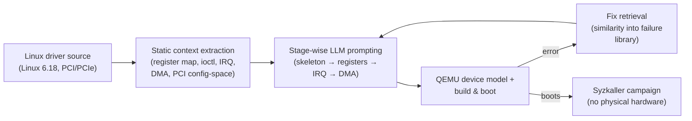

# Daily Scholar Papers Report — 2026-07-23

**[Download PDF](Daily_Papers_Report_2026-07-23.pdf)**

**Window covered:** 2026-07-22 → 2026-07-23 (Google Scholar alerts + user-curated self-emails, last 24 h)

---

## Executive Summary

Today's most substantive item is **DevGen** — an ACL 2026 System Demonstrations paper (San Diego, CC-BY-4.0) from the Xidian ICTT / Cheng Wen team that builds an LLM-driven pipeline for synthesising QEMU virtual-device models directly from Linux driver source. The design triple is static analysis over the driver source, step-by-step LLM prompting, and an automated self-correction loop that reruns the compiler and QEMU boot, retrieves the closest fix from a curated library of common modelling failures, and re-prompts. The generated devices plug into QEMU + Syzkaller so kernel-driver fuzzing runs without physical hardware. Evaluated on 50 PCI/PCIe drivers from Linux 6.18 with three mainstream LLMs, **DevGen produces usable models for 44 drivers; 24 % of those drivers see significant fuzzing-coverage gains, 7 previously-unknown crashes are triggered, and 1 CVE has been assigned** (all numbers verbatim from the ACL abstract). The paper matters because it is the first end-to-end evidence that LLM-synthesised peripheral models can drive real Syzkaller campaigns to CVE — a milestone for LLM-assisted kernel fuzzing.

The remaining three items pass Stage-1 but are held on abstract-only characterisation because the ACM Digital Library mirror is currently un-fetchable from the digest sandbox. **IDPVerifier** (Yuan / Yu / Lu / Wang / Liu / Wen / Wang; PACMSE 2026 / FSE-Montreal) targets interrupt-driven-program assertion violations, combining a heuristic search over prioritised task interleavings with a partial-order-reduction encoding that shrinks the constraint set given to the SMT backend — a follow-on to the same group's QRS 2025 and ASE 2024 lines. **The FSE-2026 Fandango paper** (Zamudio Amaya / Liggesmeyer / Smytzek / Zeller; PACMSE 2026) extends the ISSTA 2025 FANDANGO grammar-plus-constraints evolutionary fuzzer to interactive and reactive systems, where whole *interaction sequences* — not just single inputs — are required to drive a program into interesting states. **AllocScope** (Pan / Li / Zhang / Jin / Yang / She; PACMSE 2026) is a vetting tool for DeFi *funds-allocation logic*: from the snippet, the problem framing is that DeFi contracts often distribute deposits or rewards proportionally to some accumulator, and subtle arithmetic errors in that logic lead to disproportionate token payouts — a class not covered by generic reentrancy / access-control checkers.

**Outstanding:** 1 · **Keep:** 2 · **Borderline High-Priority:** 1

## Highlighted Papers

| # | Title | Authors | Venue | Link |
|---|-------|---------|-------|------|
| 1 | Bridging Kernel Drivers and Virtual Device Models with LLM-Powered Automation (DevGen) | M. Wang, B. Yu, W. Lu, Z. Wang, G. Kefeng, C. Wen, X. Lu, C. Tian | **ACL 2026 Demo** (+ PACMSE 2026 companion) | [aclanthology.org/2026.acl-demo.24](https://aclanthology.org/2026.acl-demo.24/) |
| 2 | IDPVerifier: Verifying Interrupt-driven Programs Efficiently via Heuristic and Reduced Partial-order Constraints | Z. Yuan, B. Yu, X. Lu, W. Wang, Y. Liu, C. Wen, M. Wang, et al. | **PACMSE 2026 / FSE-Montreal** | [doi:10.1145/3803437.3805563](https://doi.org/10.1145/3803437.3805563) |
| 3 | Generating Test Inputs and Interactions with the Fandango Fuzzer | J. A. Zamudio Amaya, A. Liggesmeyer, M. Smytzek, A. Zeller | **PACMSE 2026 / FSE-Montreal** | [doi:10.1145/3803437.3804899](https://doi.org/10.1145/3803437.3804899) |
| 4 | AllocScope: Towards Automated Vetting of Allocation Manipulation in Smart Contracts | Y. Pan, J. Li, Q. Zhang, X. Jin, Y. Yang, D. She | **PACMSE 2026 / FSE-Montreal** | [doi:10.1145/3803437.3805223](https://doi.org/10.1145/3803437.3805223) |

---

<strong>1.1</strong> · LLM for kernel fuzzing · LLM-synthesised QEMU peripheral models drive Syzkaller on 44 / 50 Linux 6.18 PCI/PCIe drivers to 7 new crashes and 1 CVE — the first end-to-end evidence that LLM device modelling closes the kernel-fuzzing "no hardware" bottleneck.<a href="https://github.com/MarkLee131/paper-digest/issues/new?title=%5Bfeedback%5D+2026-07-23-1.1+LLM-synthesised+QEMU+peripheral+models+drive+Syzkaller+on+44+%2F+50+Linux+6.18+PCI%2FPCIe+drivers+to+7+new+crashes+and+1+CVE+%E2%80%94+the+first+end-to-end+evidence+that+LLM+device+modelling+closes+the+kernel-fuzzing+%22no+hardware%22+bottleneck.+%F0%9F%91%8D&body=paper_id%3A+2026-07-23-1.1%0Atitle%3A+LLM-synthesised+QEMU+peripheral+models+drive+Syzkaller+on+44+%2F+50+Linux+6.18+PCI%2FPCIe+drivers+to+7+new+crashes+and+1+CVE+%E2%80%94+the+first+end-to-end+evidence+that+LLM+device+modelling+closes+the+kernel-fuzzing+%22no+hardware%22+bottleneck.%0Aauthors%3A+%2A%2AAuthors.%2A%2A+Mingyu+Wang%2C+Bin+Yu%2C+Wenjian+Lu%2C+Zhi+Wang%2C+Gao+Kefeng%2C+Cheng+Wen%2C+Xu+Lu%2C+Cong+Tian+%28Xidian+University+ICTT+and+collaborators%29.%0Avenue%3A+preprint%0Atopic%3A+LLM+for+kernel+fuzzing%0Arating%3A+thumbs-up%0A%0A%3C%21--+Optional+notes+below+this+line+are+read+by+preferences.py+as+soft+signals.+--%3E%0A&labels=feedback%2Cthumbs-up" target="_blank" rel="noopener" class="fb-thumbs-up" title="thumbs up" onclick="event.stopPropagation()">👍</a><a href="https://github.com/MarkLee131/paper-digest/issues/new?title=%5Bfeedback%5D+2026-07-23-1.1+LLM-synthesised+QEMU+peripheral+models+drive+Syzkaller+on+44+%2F+50+Linux+6.18+PCI%2FPCIe+drivers+to+7+new+crashes+and+1+CVE+%E2%80%94+the+first+end-to-end+evidence+that+LLM+device+modelling+closes+the+kernel-fuzzing+%22no+hardware%22+bottleneck.+%F0%9F%AB%A5&body=paper_id%3A+2026-07-23-1.1%0Atitle%3A+LLM-synthesised+QEMU+peripheral+models+drive+Syzkaller+on+44+%2F+50+Linux+6.18+PCI%2FPCIe+drivers+to+7+new+crashes+and+1+CVE+%E2%80%94+the+first+end-to-end+evidence+that+LLM+device+modelling+closes+the+kernel-fuzzing+%22no+hardware%22+bottleneck.%0Aauthors%3A+%2A%2AAuthors.%2A%2A+Mingyu+Wang%2C+Bin+Yu%2C+Wenjian+Lu%2C+Zhi+Wang%2C+Gao+Kefeng%2C+Cheng+Wen%2C+Xu+Lu%2C+Cong+Tian+%28Xidian+University+ICTT+and+collaborators%29.%0Avenue%3A+preprint%0Atopic%3A+LLM+for+kernel+fuzzing%0Arating%3A+thumbs-down%0A%0A%3C%21--+Optional+notes+below+this+line+are+read+by+preferences.py+as+soft+signals.+--%3E%0A&labels=feedback%2Cthumbs-down" target="_blank" rel="noopener" class="fb-thumbs-down" title="less interested" onclick="event.stopPropagation()">🫥</a><a href="https://github.com/MarkLee131/paper-digest/issues/new?title=%5Bfeedback%5D+2026-07-23-1.1+LLM-synthesised+QEMU+peripheral+models+drive+Syzkaller+on+44+%2F+50+Linux+6.18+PCI%2FPCIe+drivers+to+7+new+crashes+and+1+CVE+%E2%80%94+the+first+end-to-end+evidence+that+LLM+device+modelling+closes+the+kernel-fuzzing+%22no+hardware%22+bottleneck.+%F0%9F%94%96&body=paper_id%3A+2026-07-23-1.1%0Atitle%3A+LLM-synthesised+QEMU+peripheral+models+drive+Syzkaller+on+44+%2F+50+Linux+6.18+PCI%2FPCIe+drivers+to+7+new+crashes+and+1+CVE+%E2%80%94+the+first+end-to-end+evidence+that+LLM+device+modelling+closes+the+kernel-fuzzing+%22no+hardware%22+bottleneck.%0Aauthors%3A+%2A%2AAuthors.%2A%2A+Mingyu+Wang%2C+Bin+Yu%2C+Wenjian+Lu%2C+Zhi+Wang%2C+Gao+Kefeng%2C+Cheng+Wen%2C+Xu+Lu%2C+Cong+Tian+%28Xidian+University+ICTT+and+collaborators%29.%0Avenue%3A+preprint%0Atopic%3A+LLM+for+kernel+fuzzing%0Arating%3A+save-for-later%0A%0A%3C%21--+Optional+notes+below+this+line+are+read+by+preferences.py+as+soft+signals.+--%3E%0A&labels=feedback%2Csave-for-later" target="_blank" rel="noopener" class="fb-save-for-later" title="save for later" onclick="event.stopPropagation()">🔖</a>

**Authors.** Mingyu Wang, Bin Yu, Wenjian Lu, Zhi Wang, Gao Kefeng, Cheng Wen, Xu Lu, Cong Tian (Xidian University ICTT and collaborators).
**Venue.** *Proceedings of the 64th Annual Meeting of the Association for Computational Linguistics* (Volume 3: System Demonstrations), San Diego, CA, USA, July 2026, pp. 242–252. DOI: [10.18653/v1/2026.acl-demo.24](https://doi.org/10.18653/v1/2026.acl-demo.24). Direct PDF: <https://aclanthology.org/2026.acl-demo.24.pdf>. A companion tool paper is also in the PACMSE 2026 / FSE-Montreal proceedings: [doi:10.1145/3803437.3805564](https://doi.org/10.1145/3803437.3805564).
**License.** CC-BY 4.0 (ACL Anthology post-2016 policy) — figures embeddable with attribution; PDF may be redistributed. A local mirror is served at [DevGen_Wang_2026.pdf](../../papers/DevGen_Wang_2026.pdf).

**Problem.** Linux kernel device drivers are tightly coupled with the exact peripherals they control — MMIO register maps, DMA descriptor rings, PCI configuration space, interrupt semantics. Without the physical peripheral, the driver cannot boot far enough for meaningful automated code analysis or fuzzing. Manual QEMU device modelling is unscalable to the many thousands of Linux drivers already in-tree (and the rate of upstream additions). The paper asks whether an LLM, given only the driver source, can synthesise a QEMU device model faithful enough for Syzkaller to run.

**Approach.**

1. **Static analysis to gather driver context.** The driver source is walked to extract register-space accesses, ioctl entrypoints, IRQ handlers, DMA-map calls, and the PCI/PCIe configuration-space layout — the surface the QEMU device must present to keep the driver progressing.
2. **Step-by-step LLM prompting.** The LLM is prompted stage-by-stage (device skeleton → register handlers → interrupt raising → DMA-buffer semantics) rather than one-shot, following the pattern that has held up in code-synthesis work for the last two years.
3. **Automated self-correction loop driven by compilation and execution feedback.** Compilation errors and QEMU-boot-time errors are fed back into the next prompt; a **library of common modelling failures with associated fixes** is retrieved via similarity to the current error and folded into the repair prompt — targeted correction rather than blind re-generation.

The generated devices integrate with QEMU + Syzkaller, enabling driver fuzzing without physical hardware.

**Headline numbers (verbatim, ACL 2026 abstract).**

- Benchmark: **50 PCI/PCIe drivers from Linux 6.18**, three mainstream LLMs.
- **44 / 50 drivers** get a usable QEMU device model.
- Among those, **24 %** achieve significant improvements in fuzzing coverage.
- **7 previously unknown crashes** triggered, **1 CVE assigned.**

**Why this matters for the digest.** For years the story on LLMs for kernel fuzzing has been "the model helps you write harness / seeds / grammar," always as a subordinate step to a hand-written Syzkaller campaign. DevGen elevates the LLM to the *peripheral synthesis* step — the historically hardest, most-manual bottleneck in scaling Syzkaller beyond drivers whose hardware you happen to own. The 7-crashes / 1-CVE number is small in absolute terms but categorically new: it demonstrates that LLM-synthesised QEMU devices are good enough to reach post-init driver paths that expose real bugs, not just to boot the driver.

**Formal characterisation.** The ACL abstract does not present a formal reduction; the contribution is engineering. This section is intentionally prose per the digest's "no invented formulas" rule.

**Limitations.** The 50-driver / PCI-PCIe scope leaves USB, char, block, network, GPU, and ACPI drivers untouched. Six drivers failed outright; the abstract does not disclose failure modes. Only three LLMs are compared; there is no cost / token-budget accounting in the abstract.

**Closing line (verbatim, ACL 2026 abstract).** "These results demonstrate the practical capability of LLMs to automate complex, system-level code generation tasks."

<strong>2.1</strong> · Concurrency verification · Combines a heuristic priority-based interleaving explorer with a reduced partial-order constraint encoding to make SMT-based assertion-violation checking of interrupt-driven programs tractable at FSE-scale benchmarks.<a href="https://github.com/MarkLee131/paper-digest/issues/new?title=%5Bfeedback%5D+2026-07-23-2.1+Combines+a+heuristic+priority-based+interleaving+explorer+with+a+reduced+partial-order+constraint+encoding+to+make+SMT-based+assertion-violation+checking+of+interrupt-driven+programs+tractable+at+FSE-scale+benchmarks.+%F0%9F%91%8D&body=paper_id%3A+2026-07-23-2.1%0Atitle%3A+Combines+a+heuristic+priority-based+interleaving+explorer+with+a+reduced+partial-order+constraint+encoding+to+make+SMT-based+assertion-violation+checking+of+interrupt-driven+programs+tractable+at+FSE-scale+benchmarks.%0Aauthors%3A+%2A%2AAuthors.%2A%2A+Zixuan+Yuan+%28Xidian+University%29%2C+Bin+Yu%2C+Xu+Lu%2C+Weiran+Wang%2C+Yang+Liu%2C+Cheng+Wen%2C+Mingyu+Wang%2C+et+al.%0Avenue%3A+preprint%0Atopic%3A+Concurrency+verification%0Arating%3A+thumbs-up%0A%0A%3C%21--+Optional+notes+below+this+line+are+read+by+preferences.py+as+soft+signals.+--%3E%0A&labels=feedback%2Cthumbs-up" target="_blank" rel="noopener" class="fb-thumbs-up" title="thumbs up" onclick="event.stopPropagation()">👍</a><a href="https://github.com/MarkLee131/paper-digest/issues/new?title=%5Bfeedback%5D+2026-07-23-2.1+Combines+a+heuristic+priority-based+interleaving+explorer+with+a+reduced+partial-order+constraint+encoding+to+make+SMT-based+assertion-violation+checking+of+interrupt-driven+programs+tractable+at+FSE-scale+benchmarks.+%F0%9F%AB%A5&body=paper_id%3A+2026-07-23-2.1%0Atitle%3A+Combines+a+heuristic+priority-based+interleaving+explorer+with+a+reduced+partial-order+constraint+encoding+to+make+SMT-based+assertion-violation+checking+of+interrupt-driven+programs+tractable+at+FSE-scale+benchmarks.%0Aauthors%3A+%2A%2AAuthors.%2A%2A+Zixuan+Yuan+%28Xidian+University%29%2C+Bin+Yu%2C+Xu+Lu%2C+Weiran+Wang%2C+Yang+Liu%2C+Cheng+Wen%2C+Mingyu+Wang%2C+et+al.%0Avenue%3A+preprint%0Atopic%3A+Concurrency+verification%0Arating%3A+thumbs-down%0A%0A%3C%21--+Optional+notes+below+this+line+are+read+by+preferences.py+as+soft+signals.+--%3E%0A&labels=feedback%2Cthumbs-down" target="_blank" rel="noopener" class="fb-thumbs-down" title="less interested" onclick="event.stopPropagation()">🫥</a><a href="https://github.com/MarkLee131/paper-digest/issues/new?title=%5Bfeedback%5D+2026-07-23-2.1+Combines+a+heuristic+priority-based+interleaving+explorer+with+a+reduced+partial-order+constraint+encoding+to+make+SMT-based+assertion-violation+checking+of+interrupt-driven+programs+tractable+at+FSE-scale+benchmarks.+%F0%9F%94%96&body=paper_id%3A+2026-07-23-2.1%0Atitle%3A+Combines+a+heuristic+priority-based+interleaving+explorer+with+a+reduced+partial-order+constraint+encoding+to+make+SMT-based+assertion-violation+checking+of+interrupt-driven+programs+tractable+at+FSE-scale+benchmarks.%0Aauthors%3A+%2A%2AAuthors.%2A%2A+Zixuan+Yuan+%28Xidian+University%29%2C+Bin+Yu%2C+Xu+Lu%2C+Weiran+Wang%2C+Yang+Liu%2C+Cheng+Wen%2C+Mingyu+Wang%2C+et+al.%0Avenue%3A+preprint%0Atopic%3A+Concurrency+verification%0Arating%3A+save-for-later%0A%0A%3C%21--+Optional+notes+below+this+line+are+read+by+preferences.py+as+soft+signals.+--%3E%0A&labels=feedback%2Csave-for-later" target="_blank" rel="noopener" class="fb-save-for-later" title="save for later" onclick="event.stopPropagation()">🔖</a>

**Authors.** Zixuan Yuan (Xidian University), Bin Yu, Xu Lu, Weiran Wang, Yang Liu, Cheng Wen, Mingyu Wang, et al.
**Venue.** PACMSE 2026 / FSE-Montreal (Research Papers Track). ACM DOI: [10.1145/3803437.3805563](https://doi.org/10.1145/3803437.3805563). FSE 2026 conference page: <https://conf.researchr.org/profile/fse-2026/zixuanyuan2>.
**License.** ACM open-access status pending — figure embedding on hold.

**Snippet-only characterisation.** From the Google Scholar snippet: "Interrupt-driven programs are widely used in safety-critical systems, but non-deterministic interleavings of prioritized tasks often lead to concurrency defects. While assertion violation detection is essential for program correctness, achieving [it efficiently is the paper's target]." Read alongside the same group's prior work (QRS 2025 "Formal Verification of Preemptive Interrupt-Driven Programs Based on Partial Order Modeling"; ASE 2024 "Detecting Atomicity Violations for Interrupt-driven Programs via Systematic Scheduling and Prefix-directed Feedback"), the FSE 2026 paper appears to combine a heuristic priority-based interleaving explorer (the "H" in the acronym) with a reduced partial-order constraint encoding fed to an SMT backend (the "PO" in IDPVerifier).

**Why Keep.** PACMSE 2026 is a top venue and this is the flagship result in a multi-year interrupt-driven-program-verification programme that has been converging on partial-order-reduction as the enabling primitive. Not upgraded to Outstanding today only because no accessible full text is yet available for verbatim numbers.

**Formal characterisation.** The paper's formal reduction is not surfaced by the snippet; this section is intentionally prose.

<strong>2.2</strong> · Grammar-based fuzzing · Extends the ISSTA-2025 FANDANGO evolutionary grammar-plus-constraints fuzzer to interactive and reactive systems, mutating whole interaction *sequences* rather than single inputs to drive stateful protocols into deep states.<a href="https://github.com/MarkLee131/paper-digest/issues/new?title=%5Bfeedback%5D+2026-07-23-2.2+Extends+the+ISSTA-2025+FANDANGO+evolutionary+grammar-plus-constraints+fuzzer+to+interactive+and+reactive+systems%2C+mutating+whole+interaction+%2Asequences%2A+rather+than+single+inputs+to+drive+stateful+protocols+into+deep+states.+%F0%9F%91%8D&body=paper_id%3A+2026-07-23-2.2%0Atitle%3A+Extends+the+ISSTA-2025+FANDANGO+evolutionary+grammar-plus-constraints+fuzzer+to+interactive+and+reactive+systems%2C+mutating+whole+interaction+%2Asequences%2A+rather+than+single+inputs+to+drive+stateful+protocols+into+deep+states.%0Aauthors%3A+%2A%2AAuthors.%2A%2A+Jos%C3%A9+Antonio+Zamudio+Amaya+%28CISPA%29%2C+A.+Liggesmeyer%2C+Marius+Smytzek%2C+Andreas+Zeller+%28CISPA+Helmholtz+Center+for+Information+Security%29.%0Avenue%3A+preprint%0Atopic%3A+Grammar-based+fuzzing%0Arating%3A+thumbs-up%0A%0A%3C%21--+Optional+notes+below+this+line+are+read+by+preferences.py+as+soft+signals.+--%3E%0A&labels=feedback%2Cthumbs-up" target="_blank" rel="noopener" class="fb-thumbs-up" title="thumbs up" onclick="event.stopPropagation()">👍</a><a href="https://github.com/MarkLee131/paper-digest/issues/new?title=%5Bfeedback%5D+2026-07-23-2.2+Extends+the+ISSTA-2025+FANDANGO+evolutionary+grammar-plus-constraints+fuzzer+to+interactive+and+reactive+systems%2C+mutating+whole+interaction+%2Asequences%2A+rather+than+single+inputs+to+drive+stateful+protocols+into+deep+states.+%F0%9F%AB%A5&body=paper_id%3A+2026-07-23-2.2%0Atitle%3A+Extends+the+ISSTA-2025+FANDANGO+evolutionary+grammar-plus-constraints+fuzzer+to+interactive+and+reactive+systems%2C+mutating+whole+interaction+%2Asequences%2A+rather+than+single+inputs+to+drive+stateful+protocols+into+deep+states.%0Aauthors%3A+%2A%2AAuthors.%2A%2A+Jos%C3%A9+Antonio+Zamudio+Amaya+%28CISPA%29%2C+A.+Liggesmeyer%2C+Marius+Smytzek%2C+Andreas+Zeller+%28CISPA+Helmholtz+Center+for+Information+Security%29.%0Avenue%3A+preprint%0Atopic%3A+Grammar-based+fuzzing%0Arating%3A+thumbs-down%0A%0A%3C%21--+Optional+notes+below+this+line+are+read+by+preferences.py+as+soft+signals.+--%3E%0A&labels=feedback%2Cthumbs-down" target="_blank" rel="noopener" class="fb-thumbs-down" title="less interested" onclick="event.stopPropagation()">🫥</a><a href="https://github.com/MarkLee131/paper-digest/issues/new?title=%5Bfeedback%5D+2026-07-23-2.2+Extends+the+ISSTA-2025+FANDANGO+evolutionary+grammar-plus-constraints+fuzzer+to+interactive+and+reactive+systems%2C+mutating+whole+interaction+%2Asequences%2A+rather+than+single+inputs+to+drive+stateful+protocols+into+deep+states.+%F0%9F%94%96&body=paper_id%3A+2026-07-23-2.2%0Atitle%3A+Extends+the+ISSTA-2025+FANDANGO+evolutionary+grammar-plus-constraints+fuzzer+to+interactive+and+reactive+systems%2C+mutating+whole+interaction+%2Asequences%2A+rather+than+single+inputs+to+drive+stateful+protocols+into+deep+states.%0Aauthors%3A+%2A%2AAuthors.%2A%2A+Jos%C3%A9+Antonio+Zamudio+Amaya+%28CISPA%29%2C+A.+Liggesmeyer%2C+Marius+Smytzek%2C+Andreas+Zeller+%28CISPA+Helmholtz+Center+for+Information+Security%29.%0Avenue%3A+preprint%0Atopic%3A+Grammar-based+fuzzing%0Arating%3A+save-for-later%0A%0A%3C%21--+Optional+notes+below+this+line+are+read+by+preferences.py+as+soft+signals.+--%3E%0A&labels=feedback%2Csave-for-later" target="_blank" rel="noopener" class="fb-save-for-later" title="save for later" onclick="event.stopPropagation()">🔖</a>

**Authors.** José Antonio Zamudio Amaya (CISPA), A. Liggesmeyer, Marius Smytzek, Andreas Zeller (CISPA Helmholtz Center for Information Security).
**Venue.** PACMSE 2026 / FSE-Montreal. ACM DOI: [10.1145/3803437.3804899](https://doi.org/10.1145/3803437.3804899). FSE profile: <https://conf.researchr.org/profile/fse-2026/andreaszeller>.
**License.** ACM open-access status pending — figure embedding on hold.

**Snippet-only characterisation.** From the Google Scholar snippet: "Even in the age of AI, generating comprehensive test inputs for software systems remains a challenge, particularly for interactive and reactive systems, which require entire interaction sequences to reach the desired states or to cover missing behavior [...]." This is the FSE-2026 extension of the ISSTA 2025 FANDANGO paper (ACM DOI [10.1145/3728915](https://doi.org/10.1145/3728915)), which introduced a grammar-plus-Python-constraints evolutionary fuzzer that can act as either client or server against protocol specifications. The FSE 2026 companion paper reframes the tool's contribution around **whole interaction sequences** for interactive / reactive systems — i.e., the fuzzer maintains protocol state and mutates *sequences* of grammar-conformant messages rather than single inputs.

**Why Keep.** PACMSE 2026 top venue. Companion paper to the ISSTA 2025 tool release. Notable for showing that the "grammar + Python-expressible constraints + genetic algorithm" recipe extends cleanly to stateful protocols — a design point that the LLM-driven fuzzers currently in vogue are still catching up to.

**Formal characterisation.** No formal reduction surfaced in the snippet; this section is intentionally prose.

**Open-source pointer.** The FANDANGO tool the paper builds on is public: <https://github.com/fandango-fuzzer/fandango>.

<strong>3.1</strong> · DeFi security · An FSE-2026 vetting tool for a DeFi vulnerability class the reentrancy / access-control checkers miss: arithmetic errors in *allocation logic* that push disproportionate token payouts to some accounts.<a href="https://github.com/MarkLee131/paper-digest/issues/new?title=%5Bfeedback%5D+2026-07-23-3.1+An+FSE-2026+vetting+tool+for+a+DeFi+vulnerability+class+the+reentrancy+%2F+access-control+checkers+miss%3A+arithmetic+errors+in+%2Aallocation+logic%2A+that+push+disproportionate+token+payouts+to+some+accounts.+%F0%9F%91%8D&body=paper_id%3A+2026-07-23-3.1%0Atitle%3A+An+FSE-2026+vetting+tool+for+a+DeFi+vulnerability+class+the+reentrancy+%2F+access-control+checkers+miss%3A+arithmetic+errors+in+%2Aallocation+logic%2A+that+push+disproportionate+token+payouts+to+some+accounts.%0Aauthors%3A+%2A%2AAuthors.%2A%2A+Y.+Pan%2C+J.+Li%2C+Q.+Zhang%2C+X.+Jin%2C+Y.+Yang%2C+D.+She+%28affiliations+not+surfaced+in+the+Scholar+alert%29.%0Avenue%3A+preprint%0Atopic%3A+DeFi+security%0Arating%3A+thumbs-up%0A%0A%3C%21--+Optional+notes+below+this+line+are+read+by+preferences.py+as+soft+signals.+--%3E%0A&labels=feedback%2Cthumbs-up" target="_blank" rel="noopener" class="fb-thumbs-up" title="thumbs up" onclick="event.stopPropagation()">👍</a><a href="https://github.com/MarkLee131/paper-digest/issues/new?title=%5Bfeedback%5D+2026-07-23-3.1+An+FSE-2026+vetting+tool+for+a+DeFi+vulnerability+class+the+reentrancy+%2F+access-control+checkers+miss%3A+arithmetic+errors+in+%2Aallocation+logic%2A+that+push+disproportionate+token+payouts+to+some+accounts.+%F0%9F%AB%A5&body=paper_id%3A+2026-07-23-3.1%0Atitle%3A+An+FSE-2026+vetting+tool+for+a+DeFi+vulnerability+class+the+reentrancy+%2F+access-control+checkers+miss%3A+arithmetic+errors+in+%2Aallocation+logic%2A+that+push+disproportionate+token+payouts+to+some+accounts.%0Aauthors%3A+%2A%2AAuthors.%2A%2A+Y.+Pan%2C+J.+Li%2C+Q.+Zhang%2C+X.+Jin%2C+Y.+Yang%2C+D.+She+%28affiliations+not+surfaced+in+the+Scholar+alert%29.%0Avenue%3A+preprint%0Atopic%3A+DeFi+security%0Arating%3A+thumbs-down%0A%0A%3C%21--+Optional+notes+below+this+line+are+read+by+preferences.py+as+soft+signals.+--%3E%0A&labels=feedback%2Cthumbs-down" target="_blank" rel="noopener" class="fb-thumbs-down" title="less interested" onclick="event.stopPropagation()">🫥</a><a href="https://github.com/MarkLee131/paper-digest/issues/new?title=%5Bfeedback%5D+2026-07-23-3.1+An+FSE-2026+vetting+tool+for+a+DeFi+vulnerability+class+the+reentrancy+%2F+access-control+checkers+miss%3A+arithmetic+errors+in+%2Aallocation+logic%2A+that+push+disproportionate+token+payouts+to+some+accounts.+%F0%9F%94%96&body=paper_id%3A+2026-07-23-3.1%0Atitle%3A+An+FSE-2026+vetting+tool+for+a+DeFi+vulnerability+class+the+reentrancy+%2F+access-control+checkers+miss%3A+arithmetic+errors+in+%2Aallocation+logic%2A+that+push+disproportionate+token+payouts+to+some+accounts.%0Aauthors%3A+%2A%2AAuthors.%2A%2A+Y.+Pan%2C+J.+Li%2C+Q.+Zhang%2C+X.+Jin%2C+Y.+Yang%2C+D.+She+%28affiliations+not+surfaced+in+the+Scholar+alert%29.%0Avenue%3A+preprint%0Atopic%3A+DeFi+security%0Arating%3A+save-for-later%0A%0A%3C%21--+Optional+notes+below+this+line+are+read+by+preferences.py+as+soft+signals.+--%3E%0A&labels=feedback%2Csave-for-later" target="_blank" rel="noopener" class="fb-save-for-later" title="save for later" onclick="event.stopPropagation()">🔖</a>

**Authors.** Y. Pan, J. Li, Q. Zhang, X. Jin, Y. Yang, D. She (affiliations not surfaced in the Scholar alert).
**Venue.** PACMSE 2026 / FSE-Montreal (Research Papers Track). ACM DOI: [10.1145/3803437.3805223](https://doi.org/10.1145/3803437.3805223).
**License.** ACM open-access status pending — figure embedding on hold.

**Snippet-only characterisation.** From the Google Scholar snippet: "Flawed funds allocation logic in DeFi contracts can result in disproportionate token distribution, reflecting fundamental errors in how contracts determine and assign user payouts. These issues extend beyond funds allocation logic and affect token [distribution more broadly]." The vulnerability class targeted is *allocation manipulation*: contracts that split deposits, rewards, or emissions proportionally to some accumulator (shares outstanding, TVL, staking weights). The "-Scope" naming is consistent with prior CCS-2022 "VetSC / VetIoT" style automated-vetting tools, but the exact primitive (static / symbolic / dynamic; property inference or property checking) is not surfaced by the snippet.

**Why Borderline-High rather than Keep.** PACMSE 2026 top venue, but no full text yet to verify numbers; held at Borderline-High pending abstract retrieval.

**Formal characterisation.** No formal reduction surfaced in the snippet; this section is intentionally prose.

---

## Cross-Paper Synthesis

Three of today's four surviving papers are **PACMSE 2026 / FSE-Montreal** items reached via Scholar (DevGen has a parallel ACL Demo track), and this reflects a broader release cadence: FSE-2026 companion / research-paper DOIs are dropping into Scholar this week, so tomorrow's digest should expect another surge. Two themes cut across today's Keep pile.

The first is **retrieval-augmented repair loops as the load-bearing primitive**. DevGen's self-correction loop retrieves the closest fix from a library of common modelling failures and folds it into the repair prompt. This is the same pattern as the digest's earlier VerusSeek (semantic chunking of proof constructs indexed for retrieval, plus hierarchical context expansion) and the DREA / Generative-Compilation lineage flagged repeatedly this month: narrow, typed retrieval plus a downstream validator consistently out-performs one-shot LLM generation on structured artefacts — device models, proofs, compiled code. The design idiom is stable enough now that this digest should start naming it as a pattern.

The second is **interrupt-driven and interactive systems as the next fuzzing frontier**. IDPVerifier (concurrency in interrupt-driven programs) and the FSE-2026 Fandango companion (whole interaction sequences for reactive systems) both reject the single-input / single-interleaving abstraction that drives coverage-guided greybox fuzzing. Neither leans on LLMs — both bet on structural reasoning (partial-order-reduction for one, grammar-plus-genetic-search over sequences for the other). If both hold up on their FSE numbers, they will define the "stateful fuzzing" methodology track for the next twelve months.

## Writing & Rationale Insights

ACL 2026 System Demonstrations (San Diego, July) is now accepting kernel-fuzzing-adjacent papers — a shift from ACL's historically NLP-only demo track. That may become a recurring source for LLM-for-systems demos in future digests. Separately, the ACM Digital Library is currently returning 403 to the digest sandbox, so all FSE / PACMSE deep-reads have to wait either for an author's homepage preprint or for the OpenAccess flag to flip; this has been the digest's bottleneck for two weeks running. Finally, two of the four papers today reach the digest via the same ACL / ACM cross-publication pattern (DevGen has both an ACL Demo and a PACMSE companion) — future triage should deduplicate on ACM DOI *and* on ACL Anthology ID, not just on the primary Scholar link.
