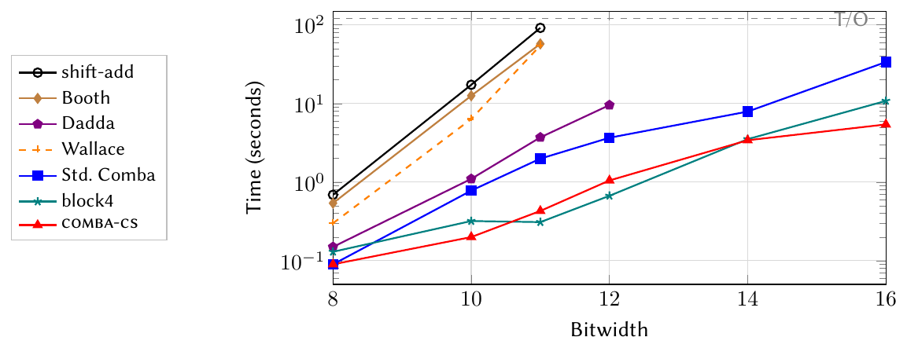

# Daily Scholar Papers Report — 2026-08-24

**[Download PDF](Daily_Papers_Report_2026-08-24.pdf)**

**Window covered:** 2026-08-23 → 2026-08-24 (Google Scholar alerts + user-curated self-emails, last 24 h)

---

## Executive Summary

Five alert threads, seven candidates, five papers through screening — and three of them are unusually good in
the same specific way: each one changed *what it measured* and found that the field's standard metric had been
measuring the experimental setup rather than the system.

The clearest case is a SAT-encoding paper from the followed-researcher stream. Bit-vector multiplication is
the arithmetic bottleneck under bounded model checking and symbolic execution, and the authors could see from
wall-clock time that one encoding was slow — but not why. So they stopped timing and started reading proofs:
generate a DRAT proof, count how many proof steps each variable appears in, rank. **The top variable in the
standard Comba encoding appears in 39 % of all proof steps**, and tracing it back identifies a single carry
bit at the boundary between adjacent columns. Splitting that one dependency into a second pass shrinks proofs
by up to 84 % and cuts a commutativity check from 60.8 s to 0.95 s. The encoding is the deliverable; the
*loop* — proof-participation profiling as a debugging tool for anything that lowers to CNF — is the part that
travels.

The second, a benchmark for detecting malicious agent Skills, makes the same discovery about splits. Learned
detectors score **0.932 Macro-F1** when the train/test split is random, hold at 0.916 when structurally
related variants are separated, and **collapse to 0.665 when whole sources are held out**. The failure is
asymmetric and that is the interesting part: malicious recall stays at 95.6 % while benign false positives
reach 62.4 %. The detectors did not stop catching attacks — they started flagging everything. Three
off-the-shelf scanners fail the exact opposite way, at 0–25 % recall. Nobody occupies the useful corner.

The third comes at it from the LLM-agent side and opens by falsifying the obvious explanation before naming
its own. Hand a coding agent the ground-truth source of every dependency it needs and domain code generation
improves by 19.9 % relative — from a 19.1 % baseline. Let it explore and summarise what it finds: 4.8 %. So
the missing ingredient is not context and not search, and the paper's answer is *tacit knowledge* recovered
by making the agent practise on the codebase and watching where it diverges from ground truth.

All three publish the result that undercuts them — a null on the community benchmark, a null model that scores
0.870 on the field's usual metric, a baseline that lands below an unassisted LLM. Two further papers are
included at snippet level and are labelled as such: a *Science* perspective on who can actually verify
frontier-AI claims, and a black-box fuzzing paper whose idea — deriving a feedback signal from packet
semantics when instrumentation is impossible — is worth tracking even though the text could not be retrieved.
Two candidates were screened out at Stage-1 as saturated; neither is named.

**Outstanding:** 3 · **Keep:** 2 · **Borderline High-Priority:** 0

## Highlighted Papers

| Title | Authors | Venue | Link |
|---|---|---|---|
| Proof-Guided SAT Encoding Selection for Bit-Vector Multiplication | A. Biere, M. Brain, D. Kroening, N. Manthey, M. Tautschnig | POS 2026 (Pragmatics of SAT @ FLoC 2026) | [PDF](https://cca.informatik.uni-freiburg.de/papers/BiereBrainKroeningMantheyTautschnig-POS26.pdf) · [mirror](../../papers/ProofGuidedSATEncoding_Biere_2026.pdf) |
| MaliciousSkillBench: A Comprehensive Benchmark for Malicious Agent Skill Detection | Y. Wang, Y. Liu, G. Deng, Y. Zhang, Y. Li, Z. Chen, L. Zhang | arXiv preprint, Aug 2026 (cs.CR) | [arXiv:2608.19901](https://arxiv.org/abs/2608.19901) |
| PRAXIS: Graph-Grounded Tacit Knowledge for Domain Code Generation | X. Jiang, T. Zhang, L. Wu, Z. Wang, G. Li, Y. Sui, H. Zhu, W. Jiao, Z. Jin, Y. Dong | arXiv preprint, Aug 2026 (cs.SE) | [arXiv:2608.19784](https://arxiv.org/abs/2608.19784) |
| Who checks what AI can do? | T. Holz | Science, 2026 | [doi:10.1126/science.ael2161](https://doi.org/10.1126/science.ael2161) |
| Feedback-Driven Fuzzing for COTS Robots via Packet Semantic Interpretation | J. Yu, J. Kim, W. Jung, D. D. Kim, J. Yun | IEEE TDSC, 2026 | [IEEE Xplore](https://ieeexplore.ieee.org/abstract/document/11651341/) |

---

## Papers

<strong>1.1</strong> · SAT ENCODING · One variable carries 39% of the proof — and removing that dependency buys 64× on commutativity<a href="https://github.com/MarkLee131/paper-digest/issues/new?title=%5Bfeedback%5D+2026-08-24-1.1+One+variable+carries+39%25+of+the+proof+%E2%80%94+and+removing+that+dependency+buys+64%C3%97+on+commutativity+%F0%9F%91%8D&body=paper_id%3A+2026-08-24-1.1%0Atitle%3A+One+variable+carries+39%25+of+the+proof+%E2%80%94+and+removing+that+dependency+buys+64%C3%97+on+commutativity%0Aauthors%3A+Armin+Biere%2C+Martin+Brain%2C+Daniel+Kroening%2C+Norbert+Manthey%2C+Michael+Tautschnig%0Avenue%3A+POS+2026+%E2%80%94+Pragmatics+of+SAT%2C+co-located+with+FLoC+2026%2C+Lisbon%0Atopic%3A+SAT+ENCODING%0Arating%3A+thumbs-up%0A%0A%3C%21--+Optional+notes+below+this+line+are+read+by+preferences.py+as+soft+signals.+--%3E%0A&labels=feedback%2Cthumbs-up" target="_blank" rel="noopener" class="fb-thumbs-up" title="thumbs up" onclick="event.stopPropagation()">👍</a><a href="https://github.com/MarkLee131/paper-digest/issues/new?title=%5Bfeedback%5D+2026-08-24-1.1+One+variable+carries+39%25+of+the+proof+%E2%80%94+and+removing+that+dependency+buys+64%C3%97+on+commutativity+%F0%9F%AB%A5&body=paper_id%3A+2026-08-24-1.1%0Atitle%3A+One+variable+carries+39%25+of+the+proof+%E2%80%94+and+removing+that+dependency+buys+64%C3%97+on+commutativity%0Aauthors%3A+Armin+Biere%2C+Martin+Brain%2C+Daniel+Kroening%2C+Norbert+Manthey%2C+Michael+Tautschnig%0Avenue%3A+POS+2026+%E2%80%94+Pragmatics+of+SAT%2C+co-located+with+FLoC+2026%2C+Lisbon%0Atopic%3A+SAT+ENCODING%0Arating%3A+thumbs-down%0A%0A%3C%21--+Optional+notes+below+this+line+are+read+by+preferences.py+as+soft+signals.+--%3E%0A&labels=feedback%2Cthumbs-down" target="_blank" rel="noopener" class="fb-thumbs-down" title="less interested" onclick="event.stopPropagation()">🫥</a><a href="https://github.com/MarkLee131/paper-digest/issues/new?title=%5Bfeedback%5D+2026-08-24-1.1+One+variable+carries+39%25+of+the+proof+%E2%80%94+and+removing+that+dependency+buys+64%C3%97+on+commutativity+%F0%9F%94%96&body=paper_id%3A+2026-08-24-1.1%0Atitle%3A+One+variable+carries+39%25+of+the+proof+%E2%80%94+and+removing+that+dependency+buys+64%C3%97+on+commutativity%0Aauthors%3A+Armin+Biere%2C+Martin+Brain%2C+Daniel+Kroening%2C+Norbert+Manthey%2C+Michael+Tautschnig%0Avenue%3A+POS+2026+%E2%80%94+Pragmatics+of+SAT%2C+co-located+with+FLoC+2026%2C+Lisbon%0Atopic%3A+SAT+ENCODING%0Arating%3A+save-for-later%0A%0A%3C%21--+Optional+notes+below+this+line+are+read+by+preferences.py+as+soft+signals.+--%3E%0A&labels=feedback%2Csave-for-later" target="_blank" rel="noopener" class="fb-save-for-later" title="save for later" onclick="event.stopPropagation()">🔖</a>

**Proof-Guided SAT Encoding Selection for Bit-Vector Multiplication**

**Authors:** Armin Biere, Martin Brain, Daniel Kroening, Norbert Manthey, Michael Tautschnig

**Venue:** POS 2026 — Pragmatics of SAT, co-located with FLoC 2026, Lisbon

**Links.** [Author-hosted PDF](https://cca.informatik.uni-freiburg.de/papers/BiereBrainKroeningMantheyTautschnig-POS26.pdf)
· [local mirror](../../papers/ProofGuidedSATEncoding_Biere_2026.pdf).
**License: CC BY 4.0** — "© 2026 Copyright for this paper by its authors. Use permitted under Creative Commons
License Attribution 4.0 International (CC BY 4.0)." Full text read (18 pp.).

### The setup

SMT solvers with bit-vector support sit underneath bounded model checking, hardware equivalence checking and
symbolic execution; CBMC is the paper's exemplar. These tools reduce correctness questions to bit-vector
formulas discharged by SAT, so end-to-end performance is gated by how the back-end handles the arithmetic —
and multiplication is where it hurts.

The opening vignette is a good one. Verify that 16-bit multiplication commutes. With the standard
shift-and-add encoding, CaDiCaL times out after 120 s. With carry-save Comba it finishes in 5.4 s. Nothing
changed but the encoding, and the authors bound the speedup conservatively at 22× precisely because the
baseline never finished.

The gap they name is not that good encodings are unknown. It is that "the interaction between encoding
choices and modern SAT solver techniques (inprocessing, BVE) is poorly understood."

### What "proof-guided" means

Not a theoretical derivation — a debugging loop over solver artefacts. The six steps, as stated in Section 4:

1. Generate a DRAT proof of the existing encoding on a representative hard benchmark.
2. **Count variable participation:** for each variable, count the number of proof steps in which it appears
   as a literal. Rank by participation count.
3. Trace the top variables back to the multiplier circuit — which partial-product bits, carry bits or
   intermediate gates do they represent?
4. Hypothesise a structural cause for the concentration.
5. Propose an encoding modification that breaks the identified dependency without losing correctness.
6. Validate across multiple solvers to ensure the improvement is not solver-specific.

There is no formal definition environment in the paper; "bottleneck variable" is defined operationally, and
that is exactly step 2. Footnote 2 is unusually careful about the statistic and deserves quoting: participation
is measured over the **full** DRAT proof, not over a trimmed proof core, and "the share over the core may
differ."

### What they found

Applied to standard Comba on commutativity at BW=11: the top variable by proof participation appears in
**39 % of all DRAT steps**. Traced back, it is a carry bit at the boundary between adjacent columns — the point
where standard Comba propagates a carry from one column's popcount into the next *within the same pass*. That
inter-column coupling forces the solver to reason about carry propagation across the entire width, creating a
sequential bottleneck inside a structure that is otherwise parallel.

### The fix: `comba-cs`

Two passes instead of one. Pass 1 reduces each column independently via popcount, collecting carry bits but
**not** propagating them to adjacent columns. Pass 2 reduces the accumulated carries, whose columns are at
most 4 deep at the tested widths. Implemented as `comba_carry_save` in CBMC's
`src/solvers/flattening/bv_utils.cpp`, which a footnote names as the authoritative specification — worth
knowing, because the encoding cannot be reconstructed from the paper text alone.

**DRAT proof size, commutativity, CaDiCaL 3.0.0** (lemmas, full proof):

| BW | Std. Comba | comba-cs | Change |
|---|---|---|---|
| 7 | 4,295 | 3,171 | −26 % |
| 9 | 15,904 | 9,146 | −42 % |
| 11 | 106,465 | 30,246 | −72 % |
| 13 | 205,989 | 55,482 | −73 % |
| 15 | 779,927 | 127,457 | −84 % |

At BW=11 the proof *core* shrinks 74 %, conflicts fall 77 % (86,405 → 19,931) and decisions 76 %
(160,713 → 38,627). Solve time on the same instance: shift-add 60.8 s, Dadda 3.38 s, standard Comba 1.74 s,
comba-cs 0.95 s — **64× over shift-add**. At BW=13 both shift-add and Dadda time out at 120 s while comba-cs
finishes in 3.21 s.

The ordering shift-add < Dadda < standard Comba < comba-cs holds across CaDiCaL, MiniSat, MergeSat and
CryptoMiniSat, though the magnitude does not: the 64× is CaDiCaL-specific, and Section 7.3 states the honest
version — CaDiCaL's BVE and congruence closure "amplify this benefit rather than create it."

*Figure 2 from Biere, Brain, Kroening, Manthey & Tautschnig, "Proof-Guided SAT Encoding Selection for
Bit-Vector Multiplication", POS 2026. Reproduced under CC BY 4.0.* At BW=16 the separation is stark: comba-cs
5.4 s, block4 10.8 s, standard Comba 33.7 s, everything else at the 120 s timeout.

### Why this clears the bar

Because of what the authors chose to print. Section 7.6 runs a stratified 66-benchmark sample of the SMT-COMP
2024 QF_BV track and publishes a **null**: `shift-add-nosimp` solves 34/66 at PAR-2 62.5 s per benchmark;
`combacs-nosimp` solves 34/66 at PAR-2 62.6 s. Their own verdict — "not a silver bullet, nor is it a
regression." Section 8 then catalogues more than twenty failures: Karatsuba, Toom-Cook and Schönhage-Strassen
all lose badly (Schönhage produces 6,647 variables at BW=7 against Comba's 317); a multi-encoding mode is
slower than the best singleton on 58 % of 180 configurations; Bounded Variable Addition times out on every
multiplication benchmark. An industrial keyed-hash benchmark **regresses** from 1.3 s to 6.3 s and is printed
in the table anyway.

The strongest section is the theory pre-emption. Beame and Liew proved that polynomial-size regular resolution
refutations of commutativity *exist* for array, diagonal and Booth multipliers — which superficially
contradicts the paper's premise. Rather than ignore it, the authors foreground it and test the two routes it
suggests. Supplying partial-product correspondences *increases* conflicts (822,218 → 972,767). A restricted
strip gives 272,390; strip-order variables plus phase gives 606,940. Asserting output bit-equalities gives 0
conflicts, and they immediately disqualify that as vacuous because "it is unchanged when the two products are
replaced by free variables." The conclusion is clean: "One cannot fix a bad encoding by supplying it true
lemmas or reordering its variables." The gap is automatizability, not proof length.

### Selection heuristic, and its honest limits

A pre-scan counts symbolic multiplications: ≤ 2 of the same width selects popcount (the commutativity pattern,
where congruence closure discovers equivalent gates between identical circuits); 3 or more, or differing
widths, selects shift-add. The authors report that the threshold is *untested* rather than robust — "1, 4, or
99 give identical results," because their suite contains nothing in the middle. The logic is solver-agnostic
but the integration is not: it fires inside CBMC's bit-blasting layer, and porting it would require Bitwuzla
or cvc5 to expose the multiplier-encoding choice, which they currently do not.

### What to take away

The transferable artefact is proof-participation profiling. Any pipeline that lowers a high-level problem to
CNF — symbolic execution, program synthesis, superoptimisation, equivalence checking — can generate a DRAT
proof and ask which variables the solver kept revisiting. That question is answerable today with existing
tooling, and it points at a *structural* cause in the encoding rather than at a solver flag to tune.

Scope, stated plainly by the authors: this is "a detailed case study, not a general methodology claim."
Bit-widths 8–32, so behaviour at 64+ is unknown. The 39 % is one benchmark, one bit-width, one encoding, one
solver, measured over the full proof; core-level analysis is left to future work.

**Closing line (verbatim).** "We presented a proof-guided design loop—analyse DRAT proofs for structural
bottlenecks, then redesign the encoding to remove them—demonstrated in depth on comba-cs (up to 64× on
commutativity) and applied retrospectively to Booth radix-4 (up to 32× on strength-reduction), 4-bit blocks,
and sorting networks."

<strong>1.2</strong> · AGENT SECURITY · Detectors that score 0.932 on random splits drop to 0.665 across sources — by flagging 62% of benign Skills, not by missing attacks<a href="https://github.com/MarkLee131/paper-digest/issues/new?title=%5Bfeedback%5D+2026-08-24-1.2+Detectors+that+score+0.932+on+random+splits+drop+to+0.665+across+sources+%E2%80%94+by+flagging+62%25+of+benign+Skills%2C+not+by+missing+attacks+%F0%9F%91%8D&body=paper_id%3A+2026-08-24-1.2%0Atitle%3A+Detectors+that+score+0.932+on+random+splits+drop+to+0.665+across+sources+%E2%80%94+by+flagging+62%25+of+benign+Skills%2C+not+by+missing+attacks%0Aauthors%3A+Yue+Wang%2C+Yi+Liu%2C+Gelei+Deng%2C+Ying+Zhang%2C+Yuekang+Li%2C+Zhenyu+Chen%2C+Leo+Zhang%0Avenue%3A+arXiv+preprint+2608.19901+%5Bcs.CR%5D%2C+20+August+2026%0Atopic%3A+AGENT+SECURITY%0Arating%3A+thumbs-up%0A%0A%3C%21--+Optional+notes+below+this+line+are+read+by+preferences.py+as+soft+signals.+--%3E%0A&labels=feedback%2Cthumbs-up" target="_blank" rel="noopener" class="fb-thumbs-up" title="thumbs up" onclick="event.stopPropagation()">👍</a><a href="https://github.com/MarkLee131/paper-digest/issues/new?title=%5Bfeedback%5D+2026-08-24-1.2+Detectors+that+score+0.932+on+random+splits+drop+to+0.665+across+sources+%E2%80%94+by+flagging+62%25+of+benign+Skills%2C+not+by+missing+attacks+%F0%9F%AB%A5&body=paper_id%3A+2026-08-24-1.2%0Atitle%3A+Detectors+that+score+0.932+on+random+splits+drop+to+0.665+across+sources+%E2%80%94+by+flagging+62%25+of+benign+Skills%2C+not+by+missing+attacks%0Aauthors%3A+Yue+Wang%2C+Yi+Liu%2C+Gelei+Deng%2C+Ying+Zhang%2C+Yuekang+Li%2C+Zhenyu+Chen%2C+Leo+Zhang%0Avenue%3A+arXiv+preprint+2608.19901+%5Bcs.CR%5D%2C+20+August+2026%0Atopic%3A+AGENT+SECURITY%0Arating%3A+thumbs-down%0A%0A%3C%21--+Optional+notes+below+this+line+are+read+by+preferences.py+as+soft+signals.+--%3E%0A&labels=feedback%2Cthumbs-down" target="_blank" rel="noopener" class="fb-thumbs-down" title="less interested" onclick="event.stopPropagation()">🫥</a><a href="https://github.com/MarkLee131/paper-digest/issues/new?title=%5Bfeedback%5D+2026-08-24-1.2+Detectors+that+score+0.932+on+random+splits+drop+to+0.665+across+sources+%E2%80%94+by+flagging+62%25+of+benign+Skills%2C+not+by+missing+attacks+%F0%9F%94%96&body=paper_id%3A+2026-08-24-1.2%0Atitle%3A+Detectors+that+score+0.932+on+random+splits+drop+to+0.665+across+sources+%E2%80%94+by+flagging+62%25+of+benign+Skills%2C+not+by+missing+attacks%0Aauthors%3A+Yue+Wang%2C+Yi+Liu%2C+Gelei+Deng%2C+Ying+Zhang%2C+Yuekang+Li%2C+Zhenyu+Chen%2C+Leo+Zhang%0Avenue%3A+arXiv+preprint+2608.19901+%5Bcs.CR%5D%2C+20+August+2026%0Atopic%3A+AGENT+SECURITY%0Arating%3A+save-for-later%0A%0A%3C%21--+Optional+notes+below+this+line+are+read+by+preferences.py+as+soft+signals.+--%3E%0A&labels=feedback%2Csave-for-later" target="_blank" rel="noopener" class="fb-save-for-later" title="save for later" onclick="event.stopPropagation()">🔖</a>

**MaliciousSkillBench: A Comprehensive Benchmark for Malicious Agent Skill Detection**

**Authors:** Yue Wang, Yi Liu, Gelei Deng, Ying Zhang, Yuekang Li, Zhenyu Chen, Leo Zhang

**Venue:** arXiv preprint 2608.19901 [cs.CR], 20 August 2026

**Links.** [arXiv:2608.19901](https://arxiv.org/abs/2608.19901) ·
[project page](https://protectskills.github.io/MaliciousSkillBench/). License: arXiv perpetual non-exclusive
(not CC), so no figures are reproduced here. Full text read including appendices A–L.

### The threat, in the authors' framing

An Agent Skill is an installable package combining natural-language instructions with scripts, templates,
resources and service configuration. The paper's framing is sharper than the usual supply-chain analogy: a
malicious Skill "can act as trusted procedural authority inside the agent's workflow." It is not a tool the
agent calls and evaluates — it is instruction the agent follows. The resulting task is named
**pre-installation malicious-Skill detection**, evaluated statically on the primary instruction artefact,
before anything runs.

Note the boundary they draw against MCP and tool-poisoning work: the question is about the trustworthiness of
an installed capability package *before it becomes* reusable procedural authority.

### Construction, and why aggregation is the contribution

The easy version of this paper concatenates thirteen public datasets. The authors argue that would be wrong,
not merely unambitious, and the argument is what makes it publishable. They separate three notions of
relatedness that most work collapses:

- **Exact identity** — SHA-256 equality over acquired content. 8,414 raw records → 7,562 unique (10.1 %
  redundant).
- **Normalized identity** — a frozen, deliberately conservative normalisation: decode UTF-8, strip one BOM,
  CRLF→LF, trim trailing whitespace and blank lines, collapse runs of three or more blank lines. It explicitly
  does **not** lowercase, remove Markdown, strip punctuation, or paraphrase. → 7,539.
- **Structural family** — a frozen static-similarity partition at threshold 0.68, computed over one
  representative per normalized identity. → 4,588 families (3,219 singletons, 1,369 non-singletons; largest
  family 146 identities spanning three sources; 113 cross-source).

Template similarity is the paper's single displayed equation (Appendix C.3, unnumbered):

$$0.36\,J_{3\text{-gram}} + 0.28\,C_{\mathrm{tfidf}} + 0.14\,J_{\mathrm{struct}} + 0.12\,J_{\mathrm{behavior}} + 0.10\,\mathrm{containment}$$

with terms denoting token-3-gram Jaccard, TF-IDF cosine, structural-line Jaccard, behavior-token Jaccard and
token containment respectively. Membership is decided entirely by fixed text features and the pre-specified
threshold — no LLM, no embedding model. And the authors are emphatic about what a family is *not*: it encodes
operational structural reuse with "no attack, campaign, actor, or threat-class semantics."

Cross-label conflicts — the same content identity appearing on both the malicious and benign side — are
**excluded rather than adjudicated**, symmetrically, on the explicit reasoning that picking a winner would
introduce a ground-truth judgement absent from the upstream releases. 34 exact and 34 normalized conflicts,
37 primary units removed. Final frozen benchmark: **9,740 Skills = 7,505 malicious + 2,235 benign**.

One decision is worth singling out. A source contributing 67,453 records is kept entirely out of ground truth
because its labels are automated scanner verdicts: "even a literal 'malicious' scanner verdict remains
uncertain without stronger ground truth." Discarding the single largest corpus on a labelling-quality
principle reads as integrity rather than weakness, and it is the kind of decision most benchmark papers quietly
avoid.

### The evaluation regimes

| Protocol | What it holds apart |
|---|---|
| Random | exact and normalized identity only; source, family and lineage may cross |
| Malicious-Structural-Disjoint | each of the 4,588 families is atomic — train, val or test, never more than one |
| Source-Disjoint | three sources held out entirely for test (839 malicious / 545 benign) |

The leakage-audit design is reusable well beyond this paper: each protocol **pre-declares** which zero-overlap
axes it guarantees, all overlaps are reported including the uncontrolled ones, and a non-zero entry on an
undeclared axis is explicitly not a protocol failure. That is pre-registration logic applied to dataset splits.

### The result

| Detector | Random | Struct.-Disjoint | Source-Disjoint |
|---|---|---|---|
| Word TF-IDF + LR | 0.882 | 0.860 | 0.661 |
| Word TF-IDF + SVM | **0.932** | 0.916 | **0.665** |
| Char TF-IDF + SVM | 0.921 | 0.883 | 0.653 |

*(Macro-F1, three-seed mean.)* Structural-family disjointness costs almost nothing — 0.016 to 0.038. Holding
out whole sources costs roughly 0.25.

The decomposition is where it gets interesting. On Source-Disjoint the word-SVM retains **95.6 % malicious
recall** but produces **62.4 % benign FPR**: 340 of 545 benign Skills flagged, against only 37 of 839
malicious missed. The detectors did not stop finding attacks. They started flagging almost everything. And
malicious-F1 — the number this literature usually reports — barely moves, sitting at 0.804–0.810 while
Macro-F1 collapses.

Three off-the-shelf scanners on the same held-out set fail in the mirror-image direction:

| Detector | Malicious recall | Benign FPR | Macro-F1 |
|---|---|---|---|
| Word TF-IDF + SVM (learned) | 95.6 % | 62.4 % | 0.665 |
| Cisco-local-behavioral | 2.5 % | 1.1 % | 0.308 |
| SkillFortify-offline | 25.3 % | 49.9 % | 0.349 |
| SkillSpector-static | 0.0 % | 0.6 % | 0.281 |

No evaluated detector achieves high malicious recall and low benign FPR simultaneously across held-out
sources. That is a stronger claim than "our model wins," and it does not decay when someone trains a better
model.

### The baseline that indicts the metric

An always-malicious classifier scores **0.870 malicious-F1** on the Random test set — because roughly 77 % of
it is malicious — while scoring 0.435 Macro-F1 and 0.500 balanced accuracy. The row exists to make one point:
the metric much of this field reports is a metric a null model games. A format-only baseline using five
scalars (character length, line count, heading count, code-fence count, URL count) reaches 0.583 malicious-F1.

### Where to push back

The Main benign pool draws from only five sources, and one supplies 1,643 of 2,251 units. The Source-Disjoint
held-out benign set is 455 of 545 from a single source, which contributes 293 of the 340 false positives. So
the headline 62.4 % is arithmetically dominated by one corpus's documentation conventions, and the honest
reading is narrower than "detectors fail on unseen sources."

To their credit the authors say this themselves, repeatedly, and refuse the stronger reading outright: "we do
not interpret the Source-Disjoint gap as a pure causal effect of 'unseen source identity'. Holding out a
source simultaneously changes provenance, construction procedure, documentation style, and label mixture."
Their term throughout is **source-conditioned generalization**, and that phrase is doing real work — it should
survive into any secondary summary rather than being rounded up.

Two robustness controls: class balancing moves the word-SVM's Source-Disjoint FPR from 62.4 % to 43.3 % and
Macro-F1 from 0.665 to 0.710; a seven-rule scaffold sanitiser firing on 1,771 of 9,740 documents changes
little. Neither removes the gap, and the authors conclude only that it "cannot be explained *solely*" by
either factor — not that a mechanism has been established.

### Why it matters here

This archive is itself assembled from Skills. A benchmark saying that the best available static detector
either misses 97 % of attacks or flags 62 % of benign packages is a direct statement about the tooling around
any Skill-based workflow. The practical reading: current pre-install scanning is not a control you can rely on
in either direction, and evaluation that reports only malicious-class metrics will not tell you when that
changes.

**Closing line (verbatim).** "Reliable malicious Agent Skill detection therefore remains open, and progress
requires diverse malicious and benign coverage together with source-aware, two-sided evaluation."

<strong>1.3</strong> · LLM AGENTS · Give an agent every dependency it needs and it still fails — 19.1% to 32.06% Pass@1 by making it practise instead<a href="https://github.com/MarkLee131/paper-digest/issues/new?title=%5Bfeedback%5D+2026-08-24-1.3+Give+an+agent+every+dependency+it+needs+and+it+still+fails+%E2%80%94+19.1%25+to+32.06%25+Pass%401+by+making+it+practise+instead+%F0%9F%91%8D&body=paper_id%3A+2026-08-24-1.3%0Atitle%3A+Give+an+agent+every+dependency+it+needs+and+it+still+fails+%E2%80%94+19.1%25+to+32.06%25+Pass%401+by+making+it+practise+instead%0Aauthors%3A+Xue+Jiang%2C+Tianyu+Zhang%2C+Lingwei+Wu%2C+Ziyu+Wang%2C+Ge+Li%2C+Yuan+Sui%2C+Hao+Zhu%2C+Wenpin+Jiao%2C+Zhi+Jin%2C%0Avenue%3A+arXiv+preprint+2608.19784+%5Bcs.SE%5D%2C+20+August+2026%0Atopic%3A+LLM+AGENTS%0Arating%3A+thumbs-up%0A%0A%3C%21--+Optional+notes+below+this+line+are+read+by+preferences.py+as+soft+signals.+--%3E%0A&labels=feedback%2Cthumbs-up" target="_blank" rel="noopener" class="fb-thumbs-up" title="thumbs up" onclick="event.stopPropagation()">👍</a><a href="https://github.com/MarkLee131/paper-digest/issues/new?title=%5Bfeedback%5D+2026-08-24-1.3+Give+an+agent+every+dependency+it+needs+and+it+still+fails+%E2%80%94+19.1%25+to+32.06%25+Pass%401+by+making+it+practise+instead+%F0%9F%AB%A5&body=paper_id%3A+2026-08-24-1.3%0Atitle%3A+Give+an+agent+every+dependency+it+needs+and+it+still+fails+%E2%80%94+19.1%25+to+32.06%25+Pass%401+by+making+it+practise+instead%0Aauthors%3A+Xue+Jiang%2C+Tianyu+Zhang%2C+Lingwei+Wu%2C+Ziyu+Wang%2C+Ge+Li%2C+Yuan+Sui%2C+Hao+Zhu%2C+Wenpin+Jiao%2C+Zhi+Jin%2C%0Avenue%3A+arXiv+preprint+2608.19784+%5Bcs.SE%5D%2C+20+August+2026%0Atopic%3A+LLM+AGENTS%0Arating%3A+thumbs-down%0A%0A%3C%21--+Optional+notes+below+this+line+are+read+by+preferences.py+as+soft+signals.+--%3E%0A&labels=feedback%2Cthumbs-down" target="_blank" rel="noopener" class="fb-thumbs-down" title="less interested" onclick="event.stopPropagation()">🫥</a><a href="https://github.com/MarkLee131/paper-digest/issues/new?title=%5Bfeedback%5D+2026-08-24-1.3+Give+an+agent+every+dependency+it+needs+and+it+still+fails+%E2%80%94+19.1%25+to+32.06%25+Pass%401+by+making+it+practise+instead+%F0%9F%94%96&body=paper_id%3A+2026-08-24-1.3%0Atitle%3A+Give+an+agent+every+dependency+it+needs+and+it+still+fails+%E2%80%94+19.1%25+to+32.06%25+Pass%401+by+making+it+practise+instead%0Aauthors%3A+Xue+Jiang%2C+Tianyu+Zhang%2C+Lingwei+Wu%2C+Ziyu+Wang%2C+Ge+Li%2C+Yuan+Sui%2C+Hao+Zhu%2C+Wenpin+Jiao%2C+Zhi+Jin%2C%0Avenue%3A+arXiv+preprint+2608.19784+%5Bcs.SE%5D%2C+20+August+2026%0Atopic%3A+LLM+AGENTS%0Arating%3A+save-for-later%0A%0A%3C%21--+Optional+notes+below+this+line+are+read+by+preferences.py+as+soft+signals.+--%3E%0A&labels=feedback%2Csave-for-later" target="_blank" rel="noopener" class="fb-save-for-later" title="save for later" onclick="event.stopPropagation()">🔖</a>

**PRAXIS: Graph-Grounded Tacit Knowledge for Domain Code Generation**

**Authors:** Xue Jiang, Tianyu Zhang, Lingwei Wu, Ziyu Wang, Ge Li, Yuan Sui, Hao Zhu, Wenpin Jiao, Zhi Jin,
Yihong Dong

**Venue:** arXiv preprint 2608.19784 [cs.SE], 20 August 2026

**Links.** [arXiv:2608.19784](https://arxiv.org/abs/2608.19784) ·
[code](https://github.com/jiangxxxue/PRAXIS). License: arXiv perpetual non-exclusive (not CC), so no figures
are reproduced here. Full text read including all tables.

### The opening move

The paper does not begin with a method. It begins with two experiments designed to kill the explanations a
reader would reach for first.

Baseline Pass@1 on KoCo-Bench is **19.1 %**. Supply the agent with the ground-truth source of *every*
dependency the target implementation touches, and it improves by 19.9 % relative — it still largely fails. So
the bottleneck is not context or retrieval. Let the agent explore the repository and summarise the domain
knowledge it discovers, and the gain is 4.8 % relative — "negligible," in the authors' word. So it is not
agentic search either.

Only with both doors closed is the diagnosis named: **tacit knowledge** — domain-specific business rules,
interface contracts and operational conventions that developers internalise through practice but never write
down. As the paper puts it, this knowledge "dictates how code ought to be correctly written, yet it exists
only in developers' minds."

### Three properties, three design decisions

The structure is unusually disciplined. Section II-C states exactly three properties and maps each one-to-one
onto a component:

1. *Tacit knowledge is latent and can surface through development practice* → extract it by practising.
2. *It is structurally dispersed and propagates along dependency relations* → organise it on the dependency
   graph.
3. *The agent does not recognise its own tacit knowledge deficit* → push it, do not wait to be asked.

Property 3 is the load-bearing one, and the paper's one-line thesis follows from it: agents cannot search for
what they do not know they lack.

### The pipeline

**Development practice.** Candidate functions are selected three ways — business-logic functions identified by
semantic analysis, callee-heavy functions with high in-degree, caller-heavy functions with high out-degree. For
each, an LLM writes a requirement description and test inputs; inputs must exceed 80 % line coverage of the
ground-truth body to qualify. The body is then removed, the agent reimplements it from signature and docstring,
and **differential testing** against the original produces a discrepancy set that is fed back for up to
R_max = 3 refinement rounds.

**Structured acquisition.** Knowledge is extracted from the resulting structured diff — trajectory,
discrepancies, ground truth juxtaposed — "grounded in these concrete differences rather than through free-form
summarization." Each unit is stored as procedural memory, Eq. (6):

$$k=(\textit{trigger},\ \textit{content},\ \textit{evidence},\ \textit{confidence})$$

*trigger* is the scenario that should activate it, *evidence* is the source function and diff segment (so a
unit is traceable), and *confidence* ∈ [0,1] is scored from whether the practice implementation passed
differential tests and how specific the evidence is. Semantically equivalent units merge with a noisy-OR
boost, Eq. (7):

$$\textit{confidence}(k_{\text{merged}})=1-\prod_{k\in S}\bigl(1-\textit{confidence}(k)\bigr)$$

Contradictory units go to an adjudicator that weighs both evidence fields.

**Graph organisation.** Units anchor to functions via φ: V → 2^𝒦 and propagate along dependency edges in
*both* directions — a function's constraints affect its dependents, and how a function is used imposes
requirements on its dependencies — with the trigger rewritten for each new perspective, up to four hops.

**Injection.** This is where the design is distinctive, and it is push rather than pull. At task start,
knowledge is seeded from the target's *callers*, Eq. (8):

$$\mathcal{K}_{\text{init}}=\bigcup_{u\in V_{\text{caller}}}\phi_{\theta}(u)$$

so caller-side expectations arrive before the agent writes anything. Then injection is embedded into the
agent's existing tools — when it searches, reads or edits, the relevant knowledge is appended to the tool's
return value, Eq. (9):

$$\textit{response}^{\prime}=\textit{response}\oplus\bigl(\bigcup_{v\in V_{\text{accessed}}}\phi_{\theta}(v)\bigr)$$

Nine numbered equations in all; there is no pseudo-code float.

### Results

KoCo-Bench spans 11 frameworks and 25 real projects across RL, RAG, Agent and Model-Optimisation domains.
Average Pass@1 / AvgPassRatio, DeepSeek-V3.2 + OpenHands:

| Method | Pass@1 | AvgPassRatio |
|---|---|---|
| Base model | 10.69 | 29.65 |
| OpenHands | 19.08 | 44.96 |
| SWE-Agent | 25.96 | 47.88 |
| OpenCode | 24.43 | 52.39 |
| OpenCollab | 27.48 | 50.29 |
| SWE-Exp | 7.83 | 20.84 |
| Trace2Skill | 25.19 | 51.42 |
| **PRAXIS** | **32.06** | **56.01** |

A 16.7 % relative improvement on Pass@1 over the strongest baseline; paired t-test significant at p < 0.05 on
AvgPassRatio. Ablations: removing development practice costs the most (32.06 → 27.48), which the authors read
as evidence that tacit knowledge genuinely cannot be recovered by reading source. Removing procedural memory
gives 29.01, graph organisation 28.25, proactive injection 28.24 — every ablated variant still matches the
best baseline. Backbone transfer: OpenHands + GPT-5.5 goes 16.03 → 42.75, Qwen3.6-Plus 25.95 → 27.48,
SWE-Agent + DeepSeek-V3.2 25.96 → 35.12. On AInsteinBench repository-level bug fixing across six scientific
codebases, 27.2 % → 31.2 % resolved.

Note that SWE-Exp scores *below the unassisted base model* — 7.83 against 10.69. The paper does not bury this;
it explains the mechanism (no quality gate on extracted knowledge, experiences too general) and uses it to
motivate its own confidence field and θ = 0.7 threshold.

### The measurement move worth stealing

"Tacit knowledge" is a borrowed, fuzzy, nearly unfalsifiable construct, and a reviewer would say so. The
authors defuse it empirically. Two engineers with 2+ years' experience rate 75 randomly sampled knowledge
units, producing a typology — business rules 34.7 %, API patterns 24.0 %, interface contracts 22.7 %,
error-handling conventions 14.7 %, other 4.0 % — plus 5-point ratings for content truthfulness (mean 4.28),
trigger accuracy (4.24) and evidence traceability (3.62), and a Spearman ρ = 0.75 (p < 0.001) between the
machine confidence score and the human rating.

Turning a soft concept into a measured distribution is worth more than another benchmark point, and it
generalises: any paper resting on a construct a reviewer could call vague should consider whether it can be
sampled and rated.

### Limits

The practice stage needs ground-truth implementations of the practised functions. That is fine for a mature
repository and a hard constraint for greenfield work — and it is the largest barrier to deploying this as
described. Several domain cells have small denominators: RAG Pass@1 values of exactly 0.00, 12.50, 37.50 and
50.00 imply roughly eight tasks, so per-domain deltas are fragile and the RAG column should not be read as a
50 % success rate in any general sense. Online knowledge evolution helps most domains but leaves RAG flat.
Stated threats: no hyperparameter search (LLM API cost), agent practice is not human development, and
benchmark coverage may not represent all domain-specific codebases.

Cost is concentrated in the offline practice phase, paid once per codebase and then amortised — and the
authors frame practice scaling as a tunable knob rather than a fixed overhead, noting that even a *single*
practised function already lifts Pass@1 above both the baseline and the strongest skill-based competitor.

**Closing line (verbatim).** "As general-purpose code generation capabilities advance rapidly, we believe that
the ability to acquire and accumulate domain expertise through practice will become an essential capability
for autonomous software engineering agents."

<strong>2.1</strong> · AI POLICY · A systems-security researcher asks who can actually verify frontier-AI claims — snippet-level entry, full text not retrievable<a href="https://github.com/MarkLee131/paper-digest/issues/new?title=%5Bfeedback%5D+2026-08-24-2.1+A+systems-security+researcher+asks+who+can+actually+verify+frontier-AI+claims+%E2%80%94+snippet-level+entry%2C+full+text+not+retrievable+%F0%9F%91%8D&body=paper_id%3A+2026-08-24-2.1%0Atitle%3A+A+systems-security+researcher+asks+who+can+actually+verify+frontier-AI+claims+%E2%80%94+snippet-level+entry%2C+full+text+not+retrievable%0Aauthors%3A+Thorsten+Holz%0Avenue%3A+Science%2C+2026%0Atopic%3A+AI+POLICY%0Arating%3A+thumbs-up%0A%0A%3C%21--+Optional+notes+below+this+line+are+read+by+preferences.py+as+soft+signals.+--%3E%0A&labels=feedback%2Cthumbs-up" target="_blank" rel="noopener" class="fb-thumbs-up" title="thumbs up" onclick="event.stopPropagation()">👍</a><a href="https://github.com/MarkLee131/paper-digest/issues/new?title=%5Bfeedback%5D+2026-08-24-2.1+A+systems-security+researcher+asks+who+can+actually+verify+frontier-AI+claims+%E2%80%94+snippet-level+entry%2C+full+text+not+retrievable+%F0%9F%AB%A5&body=paper_id%3A+2026-08-24-2.1%0Atitle%3A+A+systems-security+researcher+asks+who+can+actually+verify+frontier-AI+claims+%E2%80%94+snippet-level+entry%2C+full+text+not+retrievable%0Aauthors%3A+Thorsten+Holz%0Avenue%3A+Science%2C+2026%0Atopic%3A+AI+POLICY%0Arating%3A+thumbs-down%0A%0A%3C%21--+Optional+notes+below+this+line+are+read+by+preferences.py+as+soft+signals.+--%3E%0A&labels=feedback%2Cthumbs-down" target="_blank" rel="noopener" class="fb-thumbs-down" title="less interested" onclick="event.stopPropagation()">🫥</a><a href="https://github.com/MarkLee131/paper-digest/issues/new?title=%5Bfeedback%5D+2026-08-24-2.1+A+systems-security+researcher+asks+who+can+actually+verify+frontier-AI+claims+%E2%80%94+snippet-level+entry%2C+full+text+not+retrievable+%F0%9F%94%96&body=paper_id%3A+2026-08-24-2.1%0Atitle%3A+A+systems-security+researcher+asks+who+can+actually+verify+frontier-AI+claims+%E2%80%94+snippet-level+entry%2C+full+text+not+retrievable%0Aauthors%3A+Thorsten+Holz%0Avenue%3A+Science%2C+2026%0Atopic%3A+AI+POLICY%0Arating%3A+save-for-later%0A%0A%3C%21--+Optional+notes+below+this+line+are+read+by+preferences.py+as+soft+signals.+--%3E%0A&labels=feedback%2Csave-for-later" target="_blank" rel="noopener" class="fb-save-for-later" title="save for later" onclick="event.stopPropagation()">🔖</a>

**Who checks what AI can do?**

**Authors:** Thorsten Holz

**Venue:** Science, 2026

**Links.** [doi:10.1126/science.ael2161](https://doi.org/10.1126/science.ael2161)

**Provenance — please read.** This is a **snippet-level entry, not a read.** science.org returned an empty
body behind the paywall, and the Semantic Scholar Graph API returned nothing for this DOI. Everything below
comes from the Scholar alert snippet, which truncates mid-sentence. No claims about the argument's structure,
evidence or conclusions are made, because none were available, and none were constructed.

This is also a Perspective rather than a research contribution — there is no method and nothing reusable as
methodology. It is included because of the venue, because the author is a followed researcher, and because the
question sits close to the evaluation problems that recur across this archive.

### What the snippet states

The most important findings about frontier AI "are also the hardest to verify." Much of the information needed
to understand capabilities and risks — including results from evaluations of prerelease models, and
containment measures — is held in a form that resists outside checking. The snippet ends there.

### Why the author makes this interesting

Holz's research programme is empirical systems security: measure what is actually deployed, from the outside,
without vendor cooperation, and report the gap between claimed and observed behaviour. Applying that stance to
frontier-model evaluation reframes AI assurance as an *external measurement* problem — a question about
access, instrumentation and reproducibility rather than about alignment theory or governance frameworks.

That reframing is worth noting because it connects directly to card 1.2 above. MaliciousSkillBench's central
finding is that a detector's reported score is mostly a statement about how the evaluation was partitioned;
Holz's question is who gets to partition the evaluation at all when the artefact is a prerelease frontier
model. Same problem, one level up.

**Re-read trigger.** Revisit if an open-access or institutional copy becomes reachable. Filed **Keep** rather
than Outstanding for the plain reason that nothing was read.

<strong>2.2</strong> · FUZZING · Packet semantics as a substitute for coverage feedback when the target cannot be instrumented — snippet-level entry<a href="https://github.com/MarkLee131/paper-digest/issues/new?title=%5Bfeedback%5D+2026-08-24-2.2+Packet+semantics+as+a+substitute+for+coverage+feedback+when+the+target+cannot+be+instrumented+%E2%80%94+snippet-level+entry+%F0%9F%91%8D&body=paper_id%3A+2026-08-24-2.2%0Atitle%3A+Packet+semantics+as+a+substitute+for+coverage+feedback+when+the+target+cannot+be+instrumented+%E2%80%94+snippet-level+entry%0Aauthors%3A+J.+Yu%2C+J.+Kim%2C+W.+Jung%2C+D.+D.+Kim%2C+J.+Yun%0Avenue%3A+IEEE+Transactions+on+Dependable+and+Secure+Computing%2C+2026%0Atopic%3A+FUZZING%0Arating%3A+thumbs-up%0A%0A%3C%21--+Optional+notes+below+this+line+are+read+by+preferences.py+as+soft+signals.+--%3E%0A&labels=feedback%2Cthumbs-up" target="_blank" rel="noopener" class="fb-thumbs-up" title="thumbs up" onclick="event.stopPropagation()">👍</a><a href="https://github.com/MarkLee131/paper-digest/issues/new?title=%5Bfeedback%5D+2026-08-24-2.2+Packet+semantics+as+a+substitute+for+coverage+feedback+when+the+target+cannot+be+instrumented+%E2%80%94+snippet-level+entry+%F0%9F%AB%A5&body=paper_id%3A+2026-08-24-2.2%0Atitle%3A+Packet+semantics+as+a+substitute+for+coverage+feedback+when+the+target+cannot+be+instrumented+%E2%80%94+snippet-level+entry%0Aauthors%3A+J.+Yu%2C+J.+Kim%2C+W.+Jung%2C+D.+D.+Kim%2C+J.+Yun%0Avenue%3A+IEEE+Transactions+on+Dependable+and+Secure+Computing%2C+2026%0Atopic%3A+FUZZING%0Arating%3A+thumbs-down%0A%0A%3C%21--+Optional+notes+below+this+line+are+read+by+preferences.py+as+soft+signals.+--%3E%0A&labels=feedback%2Cthumbs-down" target="_blank" rel="noopener" class="fb-thumbs-down" title="less interested" onclick="event.stopPropagation()">🫥</a><a href="https://github.com/MarkLee131/paper-digest/issues/new?title=%5Bfeedback%5D+2026-08-24-2.2+Packet+semantics+as+a+substitute+for+coverage+feedback+when+the+target+cannot+be+instrumented+%E2%80%94+snippet-level+entry+%F0%9F%94%96&body=paper_id%3A+2026-08-24-2.2%0Atitle%3A+Packet+semantics+as+a+substitute+for+coverage+feedback+when+the+target+cannot+be+instrumented+%E2%80%94+snippet-level+entry%0Aauthors%3A+J.+Yu%2C+J.+Kim%2C+W.+Jung%2C+D.+D.+Kim%2C+J.+Yun%0Avenue%3A+IEEE+Transactions+on+Dependable+and+Secure+Computing%2C+2026%0Atopic%3A+FUZZING%0Arating%3A+save-for-later%0A%0A%3C%21--+Optional+notes+below+this+line+are+read+by+preferences.py+as+soft+signals.+--%3E%0A&labels=feedback%2Csave-for-later" target="_blank" rel="noopener" class="fb-save-for-later" title="save for later" onclick="event.stopPropagation()">🔖</a>

**Feedback-Driven Fuzzing for COTS Robots via Packet Semantic Interpretation**

**Authors:** J. Yu, J. Kim, W. Jung, D. D. Kim, J. Yun

**Venue:** IEEE Transactions on Dependable and Secure Computing, 2026

**Links.** [IEEE Xplore](https://ieeexplore.ieee.org/abstract/document/11651341/)

**Provenance — please read.** This is a **snippet-level entry, not a read.** IEEE Xplore returned an empty
body behind the paywall and Semantic Scholar returned nothing. The Scholar abstract truncates before the
method is described, so the technique itself is unverified. No numbers appear below because none were
obtainable.

### What the snippet states

Commercial off-the-shelf robots are increasingly adopted in security-sensitive domains, but their proprietary
nature "severely limits internal visibility, rendering traditional white-box or code-assisted fuzzing
approaches ineffective." The abstract truncates at that point.

### Why this cleared screening on a title

Coverage-guided fuzzing's entire premise is instrumentation: mutate, measure which edges were newly reached,
keep the inputs that expanded the frontier. Remove the ability to instrument — a closed binary on proprietary
hardware, no source, no rewriting — and the standard response is to fall back to blind mutation and accept
that the search has lost its gradient.

Deriving a feedback signal from **packet semantics** proposes a different substitute: use the protocol's own
structure as the fitness landscape. Response codes, state transitions, field-level acceptance and rejection
are all observable from outside the target and all carry information about whether an input reached somewhere
new. If that works, the idea is not specific to robots at all — it applies to any black-box networked target
where the protocol is richer than the observable crash signal: industrial control systems, medical devices,
automotive ECUs, consumer IoT.

That is a hypothesis about the paper, not a report of it. Whether the paper delivers, how the semantic
interpretation is obtained without documentation, and what it costs in throughput are all unknown from the
snippet.

**Re-read trigger.** An accessible copy, an author preprint, or an artefact release. Filed **Keep** on the
strength of the idea rather than the evidence.

---

## Cross-Paper Synthesis

The three papers that were read in full come from unrelated subfields — SAT encoding, agent security, LLM code
generation — and arrive at the same methodological point from three directions: **the aggregate metric was
measuring the setup, not the system.**

Biere and colleagues could see from wall-clock time that an encoding was slow, but wall-clock cannot say why.
Switching the measurement to proof participation revealed that 39 % of the proof concentrated on one variable,
and that variable pointed at a specific structural decision — carry propagation inside the column-reduction
pass. The bottleneck was not hidden; it was invisible in the units they had been using.

Wang and colleagues showed that a detector scoring 0.932 Macro-F1 scores 0.665 on the same data under a
different partition, and that the malicious-class metric the field reports moves by 0.03 while the honest
metric moves by 0.25. Nothing about the detector changed. What changed was which relationships the split was
allowed to carry between train and test.

Jiang and colleagues showed that an agent handed every dependency it needs still fails, which means the
retrieval quality everyone had been optimising was never the binding constraint. Their diagnostic ablation
cost two experiments and reframed the entire problem.

The practical form of this is a question worth asking of one's own work: *if my number improved, what would I
be entitled to conclude — and is there a different measurement under which the same system looks unchanged?*
All three papers found that there was.

A second convergence is about disclosure, and it is the more unusual one. Each paper publishes the result that
weakens it. The SAT paper prints a 34/66-against-34/66 null on the broad community benchmark and a 0.2×
industrial regression, in tables with the same prominence as the 64×. The benchmark paper prints an
always-malicious baseline scoring 0.870 on the metric its own field prefers. PRAXIS prints a baseline landing
below an unassisted LLM and then explains the mechanism. In every case the disclosure makes the paper *harder*
to attack, not easier — a reviewer who spots the weakness finds it already named, bounded and accounted for.

There is a third link, thinner but worth recording. MaliciousSkillBench and PRAXIS are examining the same
artefact class from opposite ends. PRAXIS builds structured, confidence-scored, trigger-conditioned knowledge
units and pushes them into an agent's tool returns. MaliciousSkillBench measures how poorly the community can
currently distinguish a benign instruction package from a malicious one. A PRAXIS knowledge unit is, formally,
an injectable instruction with an activation condition — which is also a reasonable description of the threat
model in the other paper. Nobody has connected these yet.

## Writing & Rationale Insights

**Structure a paper as an ordered defence, not a linear narrative.** The SAT paper's sections map onto the
objections a reviewer raises, in the order they raise them. *You got lucky on one benchmark* → a controlled
family of five encodings isolating a single variable. *This is an artifact of solver heuristics* → every
ranking re-derived from proof size instead of wall-clock, with the note that "every claim in the paper could
be restated in terms of proof sizes with the same conclusions." *You cherry-picked* → a stratified sample from
the community benchmark suite, null result published. *Theory says short proofs already exist* → quote the
theorem, test both routes it suggests, report both failing. Nothing in the paper is there because it followed
naturally from the previous section; each part is there because something would otherwise be unanswered.

**Falsify the obvious explanation before naming your own.** PRAXIS runs two ablations of the null hypothesis
*before* introducing its contribution. By the time the reader reaches "tacit knowledge," they have already
watched the two explanations they would have offered get eliminated with numbers. This is cheap — two
experimental conditions — and it converts the contribution from an assertion into a residual. The general
form: if your method addresses cause X, first show that the reader's preferred causes Y and Z do not account
for the gap.

**Bind a strong adjective to an operational definition, in the first paragraph.** "Comprehensive" in a title
is a rejection magnet. MaliciousSkillBench defines it narrowly on first use — broad, traceable cross-source
consolidation from thirteen frozen sources — restates the definition in the limitations section, and
explicitly bounds coverage by those sources. If a title makes a claim a reviewer could attack as vague, the
paper should pin the claim down before the reviewer can.

**Under-claiming is a credibility instrument, not modesty.** The benchmark paper attaches an explicit negation
to nearly every quantity: structural families carry "no attack, campaign, actor, or threat-class semantics";
the source-hold-out gap is "not a causal estimate"; the scanner comparison "does not isolate model capacity";
one sensitivity result is "not evidence of memorization." The effect is that the handful of claims they *do*
assert read as load-bearing. The same discipline appears in the SAT paper's footnote 2, which volunteers that
proof participation was measured over the full proof rather than the core and that "the share over the core
may differ" — pre-empting the sharpest available objection to its own headline number.

**When your central concept is fuzzy, measure it.** PRAXIS rests on "tacit knowledge," which is borrowed,
vague and nearly unfalsifiable as stated. Rather than argue for it, the authors sample 75 extracted units,
have two engineers rate them, and report a typology with percentages, Likert means, and a rank correlation
between the machine's own confidence score and human judgement. A soft construct with a measured distribution
attached is much harder to dismiss than a soft construct with an argument attached.

**Pre-declare what your evaluation guarantees, then report what it does not.** The leakage-audit table in
MaliciousSkillBench lists, per protocol, which zero-overlap axes are required, and reports overlaps on the
axes that are *not* controlled — with an explicit statement that a non-zero entry on an undeclared axis is not
a failure. This inoculates against post-hoc accusations of leakage while being maximally transparent, and it
is directly reusable: any paper with a train/test split can state which relationships it controls and which it
merely measures.

**Use section titles as claims.** "Finding 1: Random Evaluation Overstates Robustness." "Negative Results."
"Why a Comprehensive Benchmark?" A reader who only reads the table of contents still receives the argument.
It costs nothing, and almost nobody does it.
