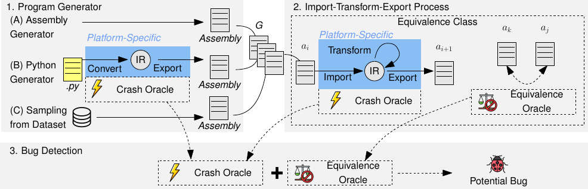

# Daily Scholar Papers Report — 2026-08-25

**[Download PDF](Daily_Papers_Report_2026-08-25.pdf)**

**Window covered:** 2026-08-20 → 2026-08-23 (recovered backlog — Google Scholar alerts + user-curated self-emails)

---

## Executive Summary

Today's nominal 24-hour window is empty: every thread it returned had already been read yesterday. The
interesting part is what turned up while confirming that. A seven-day sweep found **eight alert threads,
delivered on 20, 22 and 23 August, that no run has ever triaged** — the runs on those days did not happen, and
a 24-hour filter does not look backwards. Among the papers that quietly fell through were an ISSTA 2026 paper,
a `cs.PL` preprint with a machine-checked proof, and a TOSEM paper, all from followed researchers. This report
is that backlog, not the empty window.

Five of the ten form an unusually legible spectrum of what the word *verify* is doing in a paper.

At one end, a compiler backend pass for multi-engine AI accelerators replaces per-iteration all-engine
barriers with per-loop semaphore counters, and proves the replacement correct with a **Lean bisimulation of
roughly 15,000 lines and zero admitted lemmas**. It buys 10–45 % latency on real kernels and **3.3×** on a
synchronisation-bound loop, with code **three orders of magnitude smaller than unrolling** (37.1 KB against
1.2 MB on FlashAttention). It also states plainly which parts are *not* verified, and reports the one
benchmark where it loses to unrolling.

Next, a cross-platform tester for quantum computing platforms takes a different route to trustworthy results:
no formal claim, but an equivalence oracle grounded in symbolic ZX-diagram reduction rather than sampled
execution. It found **23 bugs, 17 already confirmed or fixed** — and three more in the equivalence checker it
depends on, which it reported upstream.

Then two papers from one lab, posted the same day with near-adjacent identifiers, that turn out to be halves of one
idea. Both fuzz compilable code slices; one expands the slice along the **call graph**, the other along
**version history**. Neither cites the other, and each paper's stated limitation is precisely the thing the
other paper does.

At the far end, a vulnerability detector dressed in type-theoretic notation whose own appendix says the three
functions carrying all the semantic content are "not formally defined … implemented using LLMs". It is
included because it is genuinely useful — **15 previously unknown vulnerabilities, 9 developer-confirmed** —
and because the gap between **87 % F1 on the curated benchmark and 45 % precision on real code** is the most
instructive number in the batch.

Four further papers are carried at summary depth: CVSS severity prediction from repository-level context,
parallel reasoning in an agent's idle window, an empirical study of cybercrime in the video-gaming ecosystem,
and a basic-block-granularity directed fuzzer for closed-source MIPS firmware. Twelve candidates were screened
out at Stage-1 as saturated or off-target; none is named.

**Outstanding:** 5 · **Keep:** 4 · **Borderline High-Priority:** 1

## Highlighted Papers

| Title | Authors | Venue | Link |
|---|---|---|---|
| IterTestQ: Assembly-Level, Cross-Platform Testing of Quantum Computing Platforms | M. Paltenghi, M. Pradel | PACMSE 3, ISSTA, Art. ISSTA120, Oct 2026 | [DOI 10.1145/3832211](https://doi.org/10.1145/3832211) · [mirror](../../papers/IterTestQ_Paltenghi_2026.pdf) |
| A Barrier-Free Synchronization Algorithm for Multi-Engine AI Accelerators | C. Sung, N. V. Shyamsunder, H. Zhang, D. Kroening, et al. | arXiv preprint, Aug 2026 (cs.PL) | [arXiv:2608.13757](https://arxiv.org/abs/2608.13757) |
| COMMITGUARD: Differential Slice Fuzzing for Commit-Induced Bug Detection | A. Murali, N. S. Mathews, M. Alfadel, M. Nagappan | arXiv preprint, Aug 2026 (cs.SE) | [arXiv:2608.17401](https://arxiv.org/abs/2608.17401) |
| SNIPTEST: Fuzzing Multi-Level Code Slices for Validating Vulnerabilities | A. Murali, N. S. Mathews, M. Alfadel, M. Xu, M. Nagappan | arXiv preprint, Aug 2026 (cs.SE) | [arXiv:2608.17396](https://arxiv.org/abs/2608.17396) |
| Finding Vulnerabilities via LLM-Augmented Semantics-Aware Type-Checking | R. Wang, M. Xu, N. Asokan | arXiv preprint, Aug 2026 (cs.CR) | [arXiv:2608.14533](https://arxiv.org/abs/2608.14533) |
| CoSA: Context-Aware Severity Assessment via Context Analysis with Large Language Models | J. Jiang, Y. Li, C. Yang, T. Zhang, W. B. Leow, Y. Yin, E. L. Ouh, L. K. Shar, D. Lo | arXiv preprint, Aug 2026 (cs.CR) | [arXiv:2608.13928](https://arxiv.org/abs/2608.13928) |
| Second Thought: Reasoning in Parallel as LLM Agents Act and Observe | Z. Sun, C. Yang, Y. Lyu, J. Shi, D. Lo | arXiv preprint, Aug 2026 (cs.AI) | [arXiv:2608.13667](https://arxiv.org/abs/2608.13667) |
| Achievement Unlocked: Let's Get Hacked! An Empirical Study of Cybercrime in the Video Gaming Ecosystem | J. Schneider, J. Kallenborn, T. Hoffmann, M. Eichhorn, T. Holz, B. Acharya | arXiv preprint, Aug 2026 (cs.CR) | [arXiv:2608.17754](https://arxiv.org/abs/2608.17754) · [mirror](../../papers/AchievementUnlocked_Schneider_2026.pdf) |
| BullsEye: Directed Firmware Fuzzing | L. Ralli, E. Coppa | arXiv preprint, Aug 2026 (cs.CR) | [arXiv:2608.17729](https://arxiv.org/abs/2608.17729) |
| Balancing Richness and Reliability: An Explore-Construct-Verify Framework for API Knowledge Graph Construction | Y. Sun, Q. Huang, Z. Xing, X. Ren, X. Li, J. Wang, H. Jin | ACM TOSEM, 2026 | [DOI 10.1145/3840287](https://doi.org/10.1145/3840287) |

---

<strong>1.1</strong> · PL / COMPILERS · Replacing every loop barrier with two counters, proved correct in 15K lines of Lean, for 10–45% latency<a href="https://github.com/MarkLee131/paper-digest/issues/new?title=%5Bfeedback%5D+2026-08-25-1.1+Replacing+every+loop+barrier+with+two+counters%2C+proved+correct+in+15K+lines+of+Lean%2C+for+10%E2%80%9345%25+latency+%F0%9F%91%8D&body=paper_id%3A+2026-08-25-1.1%0Atitle%3A+Replacing+every+loop+barrier+with+two+counters%2C+proved+correct+in+15K+lines+of+Lean%2C+for+10%E2%80%9345%25+latency%0Aauthors%3A+C.+Sung%2C+N.+V.+Shyamsunder%2C+H.+Zhang%2C+D.+Kroening%2C+et+al.%0Avenue%3A+arXiv+preprint+2608.13757+%5Bcs.PL%5D%2C+August+2026%0Atopic%3A+PL+%2F+COMPILERS%0Arating%3A+thumbs-up%0A%0A%3C%21--+Optional+notes+below+this+line+are+read+by+preferences.py+as+soft+signals.+--%3E%0A&labels=feedback%2Cthumbs-up" target="_blank" rel="noopener" class="fb-thumbs-up" title="thumbs up" onclick="event.stopPropagation()">👍</a><a href="https://github.com/MarkLee131/paper-digest/issues/new?title=%5Bfeedback%5D+2026-08-25-1.1+Replacing+every+loop+barrier+with+two+counters%2C+proved+correct+in+15K+lines+of+Lean%2C+for+10%E2%80%9345%25+latency+%F0%9F%AB%A5&body=paper_id%3A+2026-08-25-1.1%0Atitle%3A+Replacing+every+loop+barrier+with+two+counters%2C+proved+correct+in+15K+lines+of+Lean%2C+for+10%E2%80%9345%25+latency%0Aauthors%3A+C.+Sung%2C+N.+V.+Shyamsunder%2C+H.+Zhang%2C+D.+Kroening%2C+et+al.%0Avenue%3A+arXiv+preprint+2608.13757+%5Bcs.PL%5D%2C+August+2026%0Atopic%3A+PL+%2F+COMPILERS%0Arating%3A+thumbs-down%0A%0A%3C%21--+Optional+notes+below+this+line+are+read+by+preferences.py+as+soft+signals.+--%3E%0A&labels=feedback%2Cthumbs-down" target="_blank" rel="noopener" class="fb-thumbs-down" title="less interested" onclick="event.stopPropagation()">🫥</a><a href="https://github.com/MarkLee131/paper-digest/issues/new?title=%5Bfeedback%5D+2026-08-25-1.1+Replacing+every+loop+barrier+with+two+counters%2C+proved+correct+in+15K+lines+of+Lean%2C+for+10%E2%80%9345%25+latency+%F0%9F%94%96&body=paper_id%3A+2026-08-25-1.1%0Atitle%3A+Replacing+every+loop+barrier+with+two+counters%2C+proved+correct+in+15K+lines+of+Lean%2C+for+10%E2%80%9345%25+latency%0Aauthors%3A+C.+Sung%2C+N.+V.+Shyamsunder%2C+H.+Zhang%2C+D.+Kroening%2C+et+al.%0Avenue%3A+arXiv+preprint+2608.13757+%5Bcs.PL%5D%2C+August+2026%0Atopic%3A+PL+%2F+COMPILERS%0Arating%3A+save-for-later%0A%0A%3C%21--+Optional+notes+below+this+line+are+read+by+preferences.py+as+soft+signals.+--%3E%0A&labels=feedback%2Csave-for-later" target="_blank" rel="noopener" class="fb-save-for-later" title="save for later" onclick="event.stopPropagation()">🔖</a>

**A Barrier-Free Synchronization Algorithm for Multi-Engine AI Accelerators**

**Authors:** C. Sung, N. V. Shyamsunder, H. Zhang, D. Kroening, et al.

**Venue:** arXiv preprint 2608.13757 [cs.PL], August 2026

**Links.** [arXiv:2608.13757](https://arxiv.org/abs/2608.13757). Full text read (16 pp. incl. appendix).

### The problem, and why it is only a problem inside loops

A NeuronCore on AWS Trainium runs several heterogeneous engines — Tensor, Vector, Scalar, GPSIMD, plus DMA —
each with its own asynchronous instruction stream over shared SBUF/PSUM memory. The compiler has to enforce
cross-engine data dependencies, and for straight-line code this is nearly free: give each engine a semaphore
that counts retirements, and have a consumer wait until that count reaches the producer's static ordinal
position in its stream. One counter per engine, thresholds computed at compile time.

Loops break it, for a reason the paper states in one line: the scheme fails because *"the wait value must
account for which iteration the producer and consumer are in."* The same instruction now completes many
times, so a fixed ordinal no longer identifies a single completion.
Unrolling restores staticness but needs a known trip count, which the paper calls "infeasible for modern ML
workloads with dynamically bounded loops (e.g., variable-length attention, Mixture-of-Experts)". So production
compilers fall back to a barrier — an all-engine `SYNC` at every loop entry and every iteration boundary that
"drains every engine's in-flight instructions, performs a cross-engine handshake, and resets all semaphores to
zero."

That costs twice. Every engine waits at every barrier whether or not it has a dependency that iteration, so no
engine can run ahead; and the drain-handshake-reset is itself expensive, paid once per iteration. The
motivating figure shows three engines with **one** loop-carried dependency, where every boundary still forces
all three to drain and one engine "sits idle for the entire loop."

### The condition being enforced

Each instruction carries an iteration vector, each dependency a distance vector δ over the loops the producer
and consumer share, and the target iteration is t⃗ = v⃗_consumer − δ. The dependency is satisfied exactly when
(Eq. 1):

$$\exists j : t_j \leq 0 \quad \vee \quad R(\text{producer}) \geq \sum_{\vec{i} \preceq \vec{t}} H_e(\vec{i}, P)$$

R(producer) is, in the paper's words, *"the total number of times producer has retired; it is monotone"* —
equivalently, the number of completed entries of the producer's parent loop P. H_e(i⃗, ℓ) counts how many
times engine *e* enters loop ℓ during common-loop iteration i⃗: one when ℓ is the innermost common loop, and
ℓ's trip count when ℓ is nested below it. The left disjunct is the underflow case — the target names an
iteration before the first, so nothing is owed and the consumer issues immediately.

### Why this is implementable in two registers

Materialising the full H is hopeless — the paper notes that supporting all dependencies for a loop nested
under *d* enclosing loops requires tracking an entry count for every combination of enclosing iterations,
"growing exponentially in 𝑑". The move is to restrict the distance vector's only nonzero component to the
innermost common loop, and keep **two registers per loop ℓ**:

- a **monotone register** r_ℓ, *"incremented at every entry of ℓ and never reset"*, counting total entries;
- a **trip register** r̂_ℓ, incremented on entry but *"reset to 0 whenever ℓ's parent is re-entered"* — so it
  counts entries of ℓ within the current trip through its parent.

The asymmetry that shapes everything: registers are engine-local, semaphores are global. So the one quantity
that must cross engines — R(producer) — lives in a semaphore, and everything it is compared against is a
locally-tracked count. Three dependency shapes are then allocatable, each collapsing to an expression in r_P:
producer in the innermost common loop at any offset k ≥ 0 (wait value r_P − k), producer nested with a forward
offset 0, and producer nested with a backward offset 1 (both r_P). Backward-at-offset-0 is unsatisfiable, and
anything else falls back to barriers.

A semaphore wait takes a threshold, not a branch, so the underflow disjunction is folded into arithmetic with
a 0/1 mask (Eq. 2–3):

$$\text{mask} \triangleq \text{isGT}(\hat{r}_S, k), \qquad \text{waitVal} \triangleq \text{mask} \cdot \text{expr}$$

$$s_{\text{producer}} \geq \text{isGT}(\hat{r}_S, k) \cdot \text{expr}$$

emitted as a fixed three-operation sequence before each consumer issue. The shipped configuration shares one
semaphore per (loop, engine) pair across all N instructions in that body, which costs two more ALU ops and
gives (Eq. 5):

$$s_{\text{loop}} \geq \text{isGT}(\hat{r}_S, k) \cdot \big( N \cdot \text{expr} - (N - K) \big)$$

### The proof

Not model checking, not SMT — a mechanised Lean development. Verbatim: *"The proof is mechanized in Lean in
approximately 15K lines with zero admitted lemmas."* A specification transition system (where the issue rule
is literally Eq. 1) is related to an implementation transition system (counters and registers) by a
declarative allocation relation the authors describe as *"inspired by CompCert"*, so the result is independent
of any particular compiler implementation.

**Theorem 7.1 (Bisimulation)**, in the paper's numbering, states that given four stated hypotheses, from any
pair of common initial states *"the specification 𝑃_s and implementation 𝑃_i are bisimilar under ∼."*

Two properties of the statement are worth noticing. It assumes **no agreement on control decisions or trip
counts across engines** — only the structured-CFG skeleton is shared — and it handles divergence by having
both systems block together. Liveness is therefore relative: the implementation *"introduces no additional
blocking, but faithfully reproduces any deadlock already present in the specification."* And the corollary the
paper actually wants is over-synchronisation-freedom: the two systems *"admit exactly the same set of datapath
traces"*, so the compiler never waits for something the dependency graph did not ask for.

The trusted base is stated in four items, including the requirement that datapath, control and allocation
registers be disjoint so computation cannot clobber the counters — and the §6 optimisations (per-engine
allocation, LICM, CSE) are explicitly **outside** the proof.

### Numbers

On Trainium 2 (`trn2.48xlarge`, single Neuron core), normalised latency against the barrier baseline at 1.00:

| Benchmark | Loops | Barrier-free | Manual | Unrolled |
|---|---|---|---|---|
| AddManyLoop | 1 | **0.30** | 0.22 | 0.04 |
| AdamW 1M | 1 | **0.74** | 0.76 | 0.76 |
| rmsnorm 32768×8192 | 1 | **0.57** | 0.56 | 0.56 |
| flash_attn 8192² | 2 | **0.86** | 0.88 | 0.70 |
| tiled_matmul 2048³ | 3 | **0.90** | 0.71 | 0.39 |
| tiled_matmul (K-unrolled) | 2 | **0.55** | 0.61 | 0.55 |
| MoE 2048 (E=8, k=2) | 1 | **0.88** | 0.79 | N/A |

Registers stay within O(L): 4 per engine for single-loop kernels, 8 for two-loop, 11 for the three-loop
kernel. Semaphores range 4–13, peaking at 19 on FlashAttention. Code size is where the comparison with
unrolling stops being close — RMSNorm 6.1 KB against 508.6 KB, FlashAttention 37.1 KB against 1.2 MB — and MoE
cannot be unrolled at all.

The loss is reported rather than buried: on `tiled_matmul` with all three hardware loops, barrier-free must
update its counters on the same Tensor engine that runs the matmul, so the overhead *"lands directly on the
critical path"* (0.90 against unrolling's 0.39). Statically unrolling only K recovers parity at 0.55 each.

### What it does not claim

There is no production-deployment claim; the pass is implemented at the Neuron ISA level and the evaluation
deliberately avoids comparing against the production compiler in order to isolate the synchronisation
strategy. The benchmark kernels are translated from production NKI kernels. **No compile-time cost is reported
anywhere**, and there are no utilisation or MFU figures. Dependency graphs were extracted by hand and
validated against a NumPy reference model — the authors note the residual risk is over-synchronisation in both
variants rather than corruption. The technique needs semaphore-like shared counters and workloads with
recoverable cross-iteration overlap; on inherently serial loops the advantage shrinks.

> "The result is a fully automated synchronization scheme that is precise, mechanically verified, and free of
> both barriers and over-synchronization."

<strong>1.2</strong> · TESTING · A platform that reads back its own broken output looks fine — 23 bugs from making five platforms check each other<a href="https://github.com/MarkLee131/paper-digest/issues/new?title=%5Bfeedback%5D+2026-08-25-1.2+A+platform+that+reads+back+its+own+broken+output+looks+fine+%E2%80%94+23+bugs+from+making+five+platforms+check+each+other+%F0%9F%91%8D&body=paper_id%3A+2026-08-25-1.2%0Atitle%3A+A+platform+that+reads+back+its+own+broken+output+looks+fine+%E2%80%94+23+bugs+from+making+five+platforms+check+each+other%0Aauthors%3A+Matteo+Paltenghi%2C+Michael+Pradel%0Avenue%3A+Proc.+ACM+Softw.+Eng.+3%2C+ISSTA%2C+Article+ISSTA120%2C+October+2026%0Atopic%3A+TESTING%0Arating%3A+thumbs-up%0A%0A%3C%21--+Optional+notes+below+this+line+are+read+by+preferences.py+as+soft+signals.+--%3E%0A&labels=feedback%2Cthumbs-up" target="_blank" rel="noopener" class="fb-thumbs-up" title="thumbs up" onclick="event.stopPropagation()">👍</a><a href="https://github.com/MarkLee131/paper-digest/issues/new?title=%5Bfeedback%5D+2026-08-25-1.2+A+platform+that+reads+back+its+own+broken+output+looks+fine+%E2%80%94+23+bugs+from+making+five+platforms+check+each+other+%F0%9F%AB%A5&body=paper_id%3A+2026-08-25-1.2%0Atitle%3A+A+platform+that+reads+back+its+own+broken+output+looks+fine+%E2%80%94+23+bugs+from+making+five+platforms+check+each+other%0Aauthors%3A+Matteo+Paltenghi%2C+Michael+Pradel%0Avenue%3A+Proc.+ACM+Softw.+Eng.+3%2C+ISSTA%2C+Article+ISSTA120%2C+October+2026%0Atopic%3A+TESTING%0Arating%3A+thumbs-down%0A%0A%3C%21--+Optional+notes+below+this+line+are+read+by+preferences.py+as+soft+signals.+--%3E%0A&labels=feedback%2Cthumbs-down" target="_blank" rel="noopener" class="fb-thumbs-down" title="less interested" onclick="event.stopPropagation()">🫥</a><a href="https://github.com/MarkLee131/paper-digest/issues/new?title=%5Bfeedback%5D+2026-08-25-1.2+A+platform+that+reads+back+its+own+broken+output+looks+fine+%E2%80%94+23+bugs+from+making+five+platforms+check+each+other+%F0%9F%94%96&body=paper_id%3A+2026-08-25-1.2%0Atitle%3A+A+platform+that+reads+back+its+own+broken+output+looks+fine+%E2%80%94+23+bugs+from+making+five+platforms+check+each+other%0Aauthors%3A+Matteo+Paltenghi%2C+Michael+Pradel%0Avenue%3A+Proc.+ACM+Softw.+Eng.+3%2C+ISSTA%2C+Article+ISSTA120%2C+October+2026%0Atopic%3A+TESTING%0Arating%3A+save-for-later%0A%0A%3C%21--+Optional+notes+below+this+line+are+read+by+preferences.py+as+soft+signals.+--%3E%0A&labels=feedback%2Csave-for-later" target="_blank" rel="noopener" class="fb-save-for-later" title="save for later" onclick="event.stopPropagation()">🔖</a>

**IterTestQ: Assembly-Level, Cross-Platform Testing of Quantum Computing Platforms**

**Authors:** Matteo Paltenghi, Michael Pradel

**Venue:** Proc. ACM Softw. Eng. 3, ISSTA, Article ISSTA120, October 2026

**Links.** [DOI 10.1145/3832211](https://doi.org/10.1145/3832211) · [local mirror](../../papers/IterTestQ_Paltenghi_2026.pdf).
**License: CC BY 4.0.** Full text read (23 pp.).

### The blind spot

Quantum platforms — Qiskit, Cirq, PennyLane, Pytket, BQSKit — each have their own internal representation, and
nearly all import and export QASM. That interoperability layer is where the bugs live, and it is exactly what
single-platform testing cannot see. The paper's opening example: given a three-control MCX, one platform emits
`c4x q2[0],q2[1],q2[2],q2[3];` instead of `c3x`. Every other platform rejects it. The originating platform
does not, because it reads back its own incorrect code without complaint. A second case has a platform
silently dropping a gate *definition* on export — harmless on self-round-trip, fatal everywhere else.

The general shape: **a round-trip through a single implementation tests the implementation against itself,
which is the one adversary it is guaranteed to agree with.**

### The ITE process

The contribution is a loop. Start from a generated QASM program, seed an equivalence class with it, then
repeat *m* times (default 5): sample a platform at random, **I**mport the program into that platform's
representation, apply a randomly chosen semantics-preserving **T**ransformation, **E**xport back to QASM,
append the result to the equivalence class — and set the current program to the one just produced. That last
assignment is what makes it compound: round *i+1* starts from round *i*'s output, on a different platform, so
one seed program is dragged through a chain of heterogeneous importers, optimisers and exporters. Everything
in the class is equivalent by construction.

*Figure 3 from Paltenghi & Pradel, "IterTestQ: Assembly-Level, Cross-Platform Testing of Quantum Computing
Platforms", PACMSE 3(ISSTA), 2026. Licensed CC BY 4.0.*

The paper's problem statement is set-theoretic rather than formal: each platform *p* offers an importer
*i_p : A → R* and exporter *e_p : R → A* over assembly programs *A* and platform representations *R*, plus
transformations *t : R → R* such that *r′ = t(r)* implies *r ∼ r′*, where ∼ denotes semantic equivalence. An
equivalence class E is a set with *a_i ∼ a_j* for all members. Two bug types are targeted: *"platform crashes
that occur while a platform manipulates programs"*, and semantic inequivalences *a ≁ a′* between assembly
programs that should be equivalent by construction. There are no numbered theorems or equations; Algorithm
1 and the QASM grammar of Figure 5 are the formal content.

Three generators feed the loop: a grammar-based QASM generator, a Python generator that routes Qiskit API
programs through each platform's own converter (so the converter is itself under test), and sampling from the
MQTBench corpus.

### The oracles

The **crash oracle** is always on, monitoring every platform entry point — converter, importer, transformation
and exporter — with the exception message as signal.

The **equivalence oracle** is the more interesting choice, because — in the authors' own words — *"it does not
execute the programs."* It defers to QCEC, which translates both circuits into ZX-diagrams and symbolically
checks whether composing one circuit's inverse with the other reduces to the identity.

No statevector, no shots, no tolerance threshold — which sidesteps the false positives and negatives that come
from comparing probabilistic measurement outcomes. Five pairs per equivalence class are sampled rather than
comparing all pairs, failures are minimised by delta debugging with the exact transformation sequence recorded
for replay, and warnings are clustered by error message.

### Results

**23 bugs, 17 confirmed or fixed** — 14 found by the crash oracle, 9 by the equivalence oracle. Only one had
been reported before. The distribution across platforms is very uneven, and the honest reading is that it
tracks how large a transformation API each platform exposes rather than platform quality: the platform with
the richest set of optimisation passes contributes 11 of the 23. Six recurring classes emerge — gate
definitions dropped on export, importers rejecting constructs legal elsewhere, incorrect gate emission,
optimisation passes that silently break semantics, optimisation passes that crash, and register bookkeeping
errors.

The tool also **found three bugs in QCEC, the equivalence checker it is built on**, reported them, and got
fixes. Finding bugs in your own oracle and saying so is not a common disclosure.

Against existing fuzzers under a 24-hour budget:

| Tool | Platforms | Programs | Bugs |
|---|---|---|---|
| **IterTestQ** | Qiskit, PennyLane, Pytket, Cirq | **243,886** | **8** |
| QuteFuzz | Qiskit, Pytket, Cirq | 14,460 | 3 |
| MorphQ | Qiskit | 62,378 | 2 |
| Fuzz4All | Qiskit | 2,413 | 0 |
| QDiff | Qiskit, Cirq | 6,637 | 0 |

Throughput is 10,162 programs/hour against MorphQ's 2,599 and Fuzz4All's 101. Bug counts come from sampled
warnings at 90 % confidence and ±10 percentage points, not exhaustive triage — stated in the paper.

The ablations show the loop is load-bearing. Turning transformations off costs up to 19.93 % coverage on one
platform; decomposed, gate-set changes alone give a 4.4 % coverage increase, optimisers alone 42.8 %, and both
together 43.7 %. Iterating visibly changes what the programs *are*: average gates per program roughly doubles
from ≈56 to ≈99.5 across five iterations while the number of *unique* gates falls from ≈5.9 to ≈4.25, as
successive platforms converge onto small universal target gate sets. Comparing a random pair from each class
rather than first-and-last finds 826 inconsistencies against 367.

One number to read carefully: the reported **0.00089 seconds per generated program** measures the *generator
component*, which is 0.41 % of runtime. End-to-end throughput implies roughly 0.35 s per program, with 85.82 %
of time in the ITE process itself.

Stated limitations: applicability requires QASM support, and dialects still differ enough that one platform
needed local normalisation before import. The approach trusts platform transformations to be
semantics-preserving — and the authors found that some documented as such are not, so each transformation type
is manually checked. If one platform is much buggier than the others it terminates the loop early; one
platform was excluded from four of five research questions for exactly this reason. The authors note that
minimisation *"cannot guarantee that the final reduced program … preserves the original root cause."*

> "A difference to all the above is that IterTestQ uses cross-platform interoperability as a means to generate
> new quantum programs."

<strong>1.3</strong> · FUZZING · Two papers, one lab, one day, adjacent arXiv IDs — and each one's stated limitation is the other's contribution<a href="https://github.com/MarkLee131/paper-digest/issues/new?title=%5Bfeedback%5D+2026-08-25-1.3+Two+papers%2C+one+lab%2C+one+day%2C+adjacent+arXiv+IDs+%E2%80%94+and+each+one%27s+stated+limitation+is+the+other%27s+contribution+%F0%9F%91%8D&body=paper_id%3A+2026-08-25-1.3%0Atitle%3A+Two+papers%2C+one+lab%2C+one+day%2C+adjacent+arXiv+IDs+%E2%80%94+and+each+one%27s+stated+limitation+is+the+other%27s+contribution%0Aauthors%3A+A.+Murali%2C+N.+S.+Mathews%2C+M.+Alfadel%2C+M.+Nagappan+%28COMMITGUARD%29%3B+A.+Murali%2C+N.+S.+Mathews%2C+M.+Alfadel%2C+M.+Xu%2C+M.+Nagappan+%28SNIPTEST%29%0Avenue%3A+arXiv+preprints+2608.17401+and+2608.17396+%5Bcs.SE%5D%2C+both+August+2026%0Atopic%3A+FUZZING%0Arating%3A+thumbs-up%0A%0A%3C%21--+Optional+notes+below+this+line+are+read+by+preferences.py+as+soft+signals.+--%3E%0A&labels=feedback%2Cthumbs-up" target="_blank" rel="noopener" class="fb-thumbs-up" title="thumbs up" onclick="event.stopPropagation()">👍</a><a href="https://github.com/MarkLee131/paper-digest/issues/new?title=%5Bfeedback%5D+2026-08-25-1.3+Two+papers%2C+one+lab%2C+one+day%2C+adjacent+arXiv+IDs+%E2%80%94+and+each+one%27s+stated+limitation+is+the+other%27s+contribution+%F0%9F%AB%A5&body=paper_id%3A+2026-08-25-1.3%0Atitle%3A+Two+papers%2C+one+lab%2C+one+day%2C+adjacent+arXiv+IDs+%E2%80%94+and+each+one%27s+stated+limitation+is+the+other%27s+contribution%0Aauthors%3A+A.+Murali%2C+N.+S.+Mathews%2C+M.+Alfadel%2C+M.+Nagappan+%28COMMITGUARD%29%3B+A.+Murali%2C+N.+S.+Mathews%2C+M.+Alfadel%2C+M.+Xu%2C+M.+Nagappan+%28SNIPTEST%29%0Avenue%3A+arXiv+preprints+2608.17401+and+2608.17396+%5Bcs.SE%5D%2C+both+August+2026%0Atopic%3A+FUZZING%0Arating%3A+thumbs-down%0A%0A%3C%21--+Optional+notes+below+this+line+are+read+by+preferences.py+as+soft+signals.+--%3E%0A&labels=feedback%2Cthumbs-down" target="_blank" rel="noopener" class="fb-thumbs-down" title="less interested" onclick="event.stopPropagation()">🫥</a><a href="https://github.com/MarkLee131/paper-digest/issues/new?title=%5Bfeedback%5D+2026-08-25-1.3+Two+papers%2C+one+lab%2C+one+day%2C+adjacent+arXiv+IDs+%E2%80%94+and+each+one%27s+stated+limitation+is+the+other%27s+contribution+%F0%9F%94%96&body=paper_id%3A+2026-08-25-1.3%0Atitle%3A+Two+papers%2C+one+lab%2C+one+day%2C+adjacent+arXiv+IDs+%E2%80%94+and+each+one%27s+stated+limitation+is+the+other%27s+contribution%0Aauthors%3A+A.+Murali%2C+N.+S.+Mathews%2C+M.+Alfadel%2C+M.+Nagappan+%28COMMITGUARD%29%3B+A.+Murali%2C+N.+S.+Mathews%2C+M.+Alfadel%2C+M.+Xu%2C+M.+Nagappan+%28SNIPTEST%29%0Avenue%3A+arXiv+preprints+2608.17401+and+2608.17396+%5Bcs.SE%5D%2C+both+August+2026%0Atopic%3A+FUZZING%0Arating%3A+save-for-later%0A%0A%3C%21--+Optional+notes+below+this+line+are+read+by+preferences.py+as+soft+signals.+--%3E%0A&labels=feedback%2Csave-for-later" target="_blank" rel="noopener" class="fb-save-for-later" title="save for later" onclick="event.stopPropagation()">🔖</a>

**COMMITGUARD: Differential Slice Fuzzing for Commit-Induced Bug Detection** and
**SNIPTEST: Fuzzing Multi-Level Code Slices for Validating Vulnerabilities**

**Authors:** A. Murali, N. S. Mathews, M. Alfadel, M. Nagappan (COMMITGUARD); A. Murali, N. S. Mathews, M. Alfadel, M. Xu, M. Nagappan (SNIPTEST)

**Venue:** arXiv preprints 2608.17401 and 2608.17396 [cs.SE], both August 2026

**Links.** [arXiv:2608.17401](https://arxiv.org/abs/2608.17401) · [arXiv:2608.17396](https://arxiv.org/abs/2608.17396). Both full texts read.

Both papers build on FuzzSlice, the same authors' ICSE 2024 slicing engine, and both attack the same
structural problem: whole-program fuzzing is too expensive to answer a narrow question, so cut out a
compilable fragment and fuzz that instead. They diverge on **which direction to grow the fragment**, and the
divergence turns out to be the whole story. They do not cite each other.

### SNIPTEST — growing the slice along the call graph

The question is whether a static-analysis warning is real. SNIPTEST slices at increasing call-graph distance
from the warning: **Level 0** is the vulnerable function alone; **Level 1** adds its immediate callers and
their dependencies; **Level 2** adds callers of those. Each slice is compiled standalone via FuzzSlice, fuzzed
with AFL++, and read through sanitizer oracles.

The decisive signal is not any single slice but the **trajectory across levels**, because what the higher
levels restore are precisely the caller-side guards and initialisation that determine whether a warning is
reachable in practice. Per binary a warning is *Triggered*, *Reached*, or *Not Reachable*; per level
*Vulnerable*, *Benign*, or *Not Reachable*. Across levels the verdicts are three. A warning labelled
*Vulnerable* at every level is a **Possible True Positive**. One reached through benign paths at shallow
levels that stays benign or unreachable deeper is a **Possible False Positive**. One never reached at any
level is **Not Reachable** — undetermined rather than cleared, which is the right answer to give.

The paper labels this honestly: *"a heuristic evidence-aggregation strategy rather than a formal proof."*

On 194 cases (97 injected true vulnerabilities, 97 injected false alarms across libxml2, zstd and PROJ):
**53/97 true positives correctly classified with zero misclassifications** — every reachable vulnerability
location was also triggered — and **54/97 false alarms correctly classified**, with 28 misclassified. Twelve
false alarms initially flagged vulnerable at shallow levels were correctly reclassified benign at higher ones,
which is the level ladder doing its job. Against a directed fuzzer at a 7-day budget: 107 cases validated in
**2.09 days** against 22.23 (unseeded) and 11.68 (seeded), a **10.6×** and **5.5×** improvement, and on one
project the unseeded baseline validates 0 of 98 cases where SNIPTEST validates 55. F1 of **0.791** against
**0.360** for an LLM-based warning triager, which was biased heavily toward calling everything a false alarm.

Six optimisations matter more than they sound: caching and parallelising slice creation cuts that phase by
**92.9 %**, early stopping across levels cuts fuzzing by **96.5 %** and skips **70.7 %** of slices, and AST
pruning yields **35 % more vulnerabilities reached** at no runtime cost. In the field: 2,328 + 1,284 warnings
from a static scanner narrowed to 33 candidates, of which only four crashed consistently across all levels —
**three confirmed vulnerabilities including CVE-2025-11964**, and one the maintainers disputed as intentional
behaviour, which the paper reports.

### COMMITGUARD — growing the slice along version history

The question is whether *this commit* introduced a bug. A "differential slice" is not a slice of the diff; it
is a **pair** of independently compiled, independently fuzzed slices rooted at the same modified function in
the pre- and post-commit versions. Deleted functions are excluded (not executable after), added functions too
(no baseline counterpart). A source-location mapping derived from diff hunks lets the tool ask whether the
same report exists at the *corresponding* location before the change. Because fuzzing is random and the two
versions might explore differently, inputs are **replayed across the pair** in both directions.

The oracle, verbatim:

A post-commit sanitizer report counts as a candidate commit-induced bug only under three conditions, all
required. The report must appear in the post-commit slice. No report of the same bug class may appear at the
corresponding mapped location in the pre-commit slice. And that mapped location must itself be **reachable**
in the pre-commit slice — which, in the paper's phrasing, *"helps distinguish newly introduced behavior from
differences caused only by missing coverage."*

That third condition is the careful one. Without it, "the baseline never got there" is indistinguishable from
"the baseline was fine".

Across 300 commits and 407 modified functions in OpenSSL, libpcap and leptonica, slice fuzzing produced **518
raw sanitizer reports**, the differential filter reduced them to **7 candidates**, and manual validation
confirmed **5 true bugs and 2 false positives** — **all five fixed by the projects' developers**. At 3 minutes
of fuzzing per slice, this costs about **32 minutes per commit**.

The most interesting of the five is one where the commit contains no unsafe edit at all. A `return b1;` became
`return gen_port_common(cstate, proto, b1);`, adding a path with more allocations through a function that
reads an array slot *before* its bounds check. The fuzzer exhausted the chunk list on the new path, hit the
invalid access, then dereferenced the NULL the allocator returned. The commit's only sin was making
already-latent code reachable — which is the class of regression code review is worst at.

Like SNIPTEST, the paper is careful about its own vocabulary, noting that "verify" here means validation by
differential fuzzing and *"does not constitute a formal guarantee of correctness."*

### Why they belong in one card

SNIPTEST expands **spatially** (call graph) and reads persistence across levels as evidence. COMMITGUARD
expands **temporally** (version history) and reads presence-in-one-version-only as evidence. Both slices are
rooted at a single function, which means COMMITGUARD is structurally *two Level-0 SNIPTEST slices compared
against each other*.

That framing predicts the failure modes, and the papers confirm it. Both of COMMITGUARD's false positives come
from missing caller-side context — one from an absent precondition, one from a wrapper mismatch after a
signature change — which is exactly the gap SNIPTEST's Level 1 and 2 exist to close. And SNIPTEST's leading
stated limitation is that the decisive guard *"resides several functions earlier in the call hierarchy"* than
its three-level cap reaches. Each paper's weakness is the other's mechanism.

Their evaluations overlap on exactly one subject, libpcap, and even there on different code and different
bugs. The axes are orthogonal and composable; **differential multi-level slice fuzzing is the obvious
unwritten third paper**, and neither mentions it.

> COMMITGUARD: "The changed function is usually exercised quickly by COMMITGUARD, making differential slice
> fuzzing suitable for commit-level review rather than only for long-running offline testing."

> SNIPTEST: "These results support multi-level sliced fuzzing as a practical approach for gathering
> warning-triage evidence—rather than as definitive proof of vulnerability or benignness."

<strong>1.4</strong> · STATIC ANALYSIS · 87% F1 on the benchmark, 45% precision in the wild — what happens when type-theory notation carries no type theory<a href="https://github.com/MarkLee131/paper-digest/issues/new?title=%5Bfeedback%5D+2026-08-25-1.4+87%25+F1+on+the+benchmark%2C+45%25+precision+in+the+wild+%E2%80%94+what+happens+when+type-theory+notation+carries+no+type+theory+%F0%9F%91%8D&body=paper_id%3A+2026-08-25-1.4%0Atitle%3A+87%25+F1+on+the+benchmark%2C+45%25+precision+in+the+wild+%E2%80%94+what+happens+when+type-theory+notation+carries+no+type+theory%0Aauthors%3A+R.+Wang%2C+M.+Xu%2C+N.+Asokan%0Avenue%3A+arXiv+preprint+2608.14533+%5Bcs.CR%5D%2C+August+2026%0Atopic%3A+STATIC+ANALYSIS%0Arating%3A+thumbs-up%0A%0A%3C%21--+Optional+notes+below+this+line+are+read+by+preferences.py+as+soft+signals.+--%3E%0A&labels=feedback%2Cthumbs-up" target="_blank" rel="noopener" class="fb-thumbs-up" title="thumbs up" onclick="event.stopPropagation()">👍</a><a href="https://github.com/MarkLee131/paper-digest/issues/new?title=%5Bfeedback%5D+2026-08-25-1.4+87%25+F1+on+the+benchmark%2C+45%25+precision+in+the+wild+%E2%80%94+what+happens+when+type-theory+notation+carries+no+type+theory+%F0%9F%AB%A5&body=paper_id%3A+2026-08-25-1.4%0Atitle%3A+87%25+F1+on+the+benchmark%2C+45%25+precision+in+the+wild+%E2%80%94+what+happens+when+type-theory+notation+carries+no+type+theory%0Aauthors%3A+R.+Wang%2C+M.+Xu%2C+N.+Asokan%0Avenue%3A+arXiv+preprint+2608.14533+%5Bcs.CR%5D%2C+August+2026%0Atopic%3A+STATIC+ANALYSIS%0Arating%3A+thumbs-down%0A%0A%3C%21--+Optional+notes+below+this+line+are+read+by+preferences.py+as+soft+signals.+--%3E%0A&labels=feedback%2Cthumbs-down" target="_blank" rel="noopener" class="fb-thumbs-down" title="less interested" onclick="event.stopPropagation()">🫥</a><a href="https://github.com/MarkLee131/paper-digest/issues/new?title=%5Bfeedback%5D+2026-08-25-1.4+87%25+F1+on+the+benchmark%2C+45%25+precision+in+the+wild+%E2%80%94+what+happens+when+type-theory+notation+carries+no+type+theory+%F0%9F%94%96&body=paper_id%3A+2026-08-25-1.4%0Atitle%3A+87%25+F1+on+the+benchmark%2C+45%25+precision+in+the+wild+%E2%80%94+what+happens+when+type-theory+notation+carries+no+type+theory%0Aauthors%3A+R.+Wang%2C+M.+Xu%2C+N.+Asokan%0Avenue%3A+arXiv+preprint+2608.14533+%5Bcs.CR%5D%2C+August+2026%0Atopic%3A+STATIC+ANALYSIS%0Arating%3A+save-for-later%0A%0A%3C%21--+Optional+notes+below+this+line+are+read+by+preferences.py+as+soft+signals.+--%3E%0A&labels=feedback%2Csave-for-later" target="_blank" rel="noopener" class="fb-save-for-later" title="save for later" onclick="event.stopPropagation()">🔖</a>

**Finding Vulnerabilities via LLM-Augmented Semantics-Aware Type-Checking**

**Authors:** R. Wang, M. Xu, N. Asokan

**Venue:** arXiv preprint 2608.14533 [cs.CR], August 2026

**Links.** [arXiv:2608.14533](https://arxiv.org/abs/2608.14533). Full text read incl. appendix formalism.

This one is here for two reasons that pull in opposite directions, and both are worth a reader's time.

### The idea, which is real

Rule-based analyzers encode insecure patterns over syntax and therefore cannot see semantics carried in names,
comments and docstrings. The paper gives two crisp failure cases: a PDF-to-markdown library function installed
millions of times a month whose signature obviously reads a file but appears in nobody's sink database; and a
CVE patch adding a validation function that no analyzer recognises as a mitigation "although this behavior is
semantically obvious". The reframing is elegant — a vulnerability is *"a program construct of type X
participating in an operation that expects type Y"*, so make the types semantic.

The architecture that follows is genuinely good engineering. The LLM is confined to small local judgments
(~200 tokens) over a typing environment threaded through a deterministic bytecode-level CFG traversal built on
`pytype`. Checks fire only at calls to functions outside the analysed project. A taint analysis is bolted on
purely to *skip* redundant queries. That confinement is what avoids the failure mode of the LLM-agent
baseline, which loses the thread across long context and in one case hallucinated a function that does not
exist and reported a 9/10-confidence bug in it.

It works. **15 previously unknown vulnerabilities across 103 repositories, 9 developer-confirmed** — 9 path
traversal, 5 open redirect, 1 SQL injection — in code belonging to a major software vendor's official library,
a language foundation's server infrastructure, and a national tax agency. On CVEs published after the model's
training cutoff, F1 **0.78** against 0.33 (CodeQL), 0.46 (Bandit) and 0.53 (the LLM-agent baseline).

### The framing, which does not survive contact with the appendix

The type system is one **unnumbered** page in the appendix: four inference rules for initialisation, lookup,
operations and assignment. The paper's own closing sentence on them is the tell:

> "Notably, in the above rules, the function inf , op, and unify are not formally defined."

They are implemented by prompting. And because they are, **no rule in the system has a premise that can fail**
— there is no `τ <: σ` obligation anywhere. The thing that reports a vulnerability lives inside the undefined
functions, which is to say inside a prompt. There is no lattice, no join, no subtyping relation, no ⊤ or ⊥, no
termination argument for the loop rule. Bidirectional typing is invoked three times and never instantiated:
the `⇐` and `⇒` judgments that define it never appear, and there is one judgment form in one mode. No
soundness or completeness claim, no theorem, no proof — the word "soundness" appears once in the paper, and it
is attributed to *other* techniques.

The authors are not hiding this. They say the check is *"not a mechanical algorithm … a fuzzy
(non-deterministic) check at the natural-language level in practice"*, and Section II concedes upfront that
semantic types cannot be inferred from AST or CFG structure the way `str` can.

The behavioural consequence is what settles it. In a single program, five syntactically similar database call
sites: the same call is typed a sink at four of them and a non-sink at the fifth. In another, a literal
template string is typed as user-controlled, producing a false finding. **A type system does not disagree with
itself about the same operation in the same program. A classifier does.**

And the field numbers follow: **87 % F1 on the curated benchmark, but 15 true findings out of 33 reported on
real code — 45 % precision.** A type checker's precision does not halve when pointed at unfamiliar code. There
is also **no ablation of any kind** — no LLM-off variant, no prompt ablation, no variance measurement despite
acknowledged non-determinism — so the paper cannot separate the contribution of its scaffolding from the
model's raw recall of which library functions touch the filesystem, which is the sink-database problem
restated.

Cost is substantial: roughly 100–200× slower than CodeQL, about 54 minutes and $0.23 per project on average,
and one large project took ~14 hours and $3.19. Stated limitations are candid — dynamic imports,
framework-invoked overrides, methods inherited from library base classes, and cross-language templating are
all outside reach.

### The transferable lesson

The useful takeaway is not about this paper, which is a solid tool with an oversold vocabulary. It is that
**borrowing formal notation transfers the reader's priors about guarantees onto a system that does not have
them.** Inference-rule notation promises compositionality, decidability and soundness. When the premises
cannot fail, none of that is present, and the notation has become decoration that costs the reader
calibration. Compare the two fuzzing papers above, which each spend one sentence redefining "verify" downward
and thereby keep their claims exactly as strong as their evidence. That sentence is cheap. What it buys is
that nobody has to read the appendix to find out what the system does not promise.

<strong>2.1</strong> · VULN ASSESSMENT · CVSS metrics need the call graph, not the CVE description — 47.2% accuracy over 6,816 labelled instances<a href="https://github.com/MarkLee131/paper-digest/issues/new?title=%5Bfeedback%5D+2026-08-25-2.1+CVSS+metrics+need+the+call+graph%2C+not+the+CVE+description+%E2%80%94+47.2%25+accuracy+over+6%2C816+labelled+instances+%F0%9F%91%8D&body=paper_id%3A+2026-08-25-2.1%0Atitle%3A+CVSS+metrics+need+the+call+graph%2C+not+the+CVE+description+%E2%80%94+47.2%25+accuracy+over+6%2C816+labelled+instances%0Aauthors%3A+J.+Jiang%2C+Y.+Li%2C+C.+Yang%2C+T.+Zhang%2C+W.+B.+Leow%2C+Y.+Yin%2C+E.+L.+Ouh%2C+L.+K.+Shar%2C+D.+Lo%0Avenue%3A+arXiv+preprint+2608.13928+%5Bcs.CR%5D%2C+August+2026+%28submitted+to+ACM%29%0Atopic%3A+VULN+ASSESSMENT%0Arating%3A+thumbs-up%0A%0A%3C%21--+Optional+notes+below+this+line+are+read+by+preferences.py+as+soft+signals.+--%3E%0A&labels=feedback%2Cthumbs-up" target="_blank" rel="noopener" class="fb-thumbs-up" title="thumbs up" onclick="event.stopPropagation()">👍</a><a href="https://github.com/MarkLee131/paper-digest/issues/new?title=%5Bfeedback%5D+2026-08-25-2.1+CVSS+metrics+need+the+call+graph%2C+not+the+CVE+description+%E2%80%94+47.2%25+accuracy+over+6%2C816+labelled+instances+%F0%9F%AB%A5&body=paper_id%3A+2026-08-25-2.1%0Atitle%3A+CVSS+metrics+need+the+call+graph%2C+not+the+CVE+description+%E2%80%94+47.2%25+accuracy+over+6%2C816+labelled+instances%0Aauthors%3A+J.+Jiang%2C+Y.+Li%2C+C.+Yang%2C+T.+Zhang%2C+W.+B.+Leow%2C+Y.+Yin%2C+E.+L.+Ouh%2C+L.+K.+Shar%2C+D.+Lo%0Avenue%3A+arXiv+preprint+2608.13928+%5Bcs.CR%5D%2C+August+2026+%28submitted+to+ACM%29%0Atopic%3A+VULN+ASSESSMENT%0Arating%3A+thumbs-down%0A%0A%3C%21--+Optional+notes+below+this+line+are+read+by+preferences.py+as+soft+signals.+--%3E%0A&labels=feedback%2Cthumbs-down" target="_blank" rel="noopener" class="fb-thumbs-down" title="less interested" onclick="event.stopPropagation()">🫥</a><a href="https://github.com/MarkLee131/paper-digest/issues/new?title=%5Bfeedback%5D+2026-08-25-2.1+CVSS+metrics+need+the+call+graph%2C+not+the+CVE+description+%E2%80%94+47.2%25+accuracy+over+6%2C816+labelled+instances+%F0%9F%94%96&body=paper_id%3A+2026-08-25-2.1%0Atitle%3A+CVSS+metrics+need+the+call+graph%2C+not+the+CVE+description+%E2%80%94+47.2%25+accuracy+over+6%2C816+labelled+instances%0Aauthors%3A+J.+Jiang%2C+Y.+Li%2C+C.+Yang%2C+T.+Zhang%2C+W.+B.+Leow%2C+Y.+Yin%2C+E.+L.+Ouh%2C+L.+K.+Shar%2C+D.+Lo%0Avenue%3A+arXiv+preprint+2608.13928+%5Bcs.CR%5D%2C+August+2026+%28submitted+to+ACM%29%0Atopic%3A+VULN+ASSESSMENT%0Arating%3A+save-for-later%0A%0A%3C%21--+Optional+notes+below+this+line+are+read+by+preferences.py+as+soft+signals.+--%3E%0A&labels=feedback%2Csave-for-later" target="_blank" rel="noopener" class="fb-save-for-later" title="save for later" onclick="event.stopPropagation()">🔖</a>

**CoSA: Context-Aware Severity Assessment via Context Analysis with Large Language Models**

**Authors:** J. Jiang, Y. Li, C. Yang, T. Zhang, W. B. Leow, Y. Yin, E. L. Ouh, L. K. Shar, D. Lo

**Venue:** arXiv preprint 2608.13928 [cs.CR], August 2026 (submitted to ACM)

**Links.** [arXiv:2608.13928](https://arxiv.org/abs/2608.13928). Front matter and results tables read.

Predicting CVSS v3.x base metrics is usually done from the CVE description or a single vulnerable function.
CoSA argues that the metrics — attack vector, privileges required, scope, the impact triple — are properties
of *reachability and effect propagation*, which are repository-level facts. So it builds a code property graph
over the whole repo, prunes it in two stages (cheap static proximity filter, then an agentic LLM-guided
traversal that walks caller and callee directions keeping CVSS-relevant evidence), has the LLM consolidate
what survives into compact per-metric textual summaries, and feeds those to a lightweight transformer
classifier.

**6,816 CVSS-labelled instances across 90 CWE types** — a new dataset, and the more durable contribution.
CoSA reaches **47.22 % accuracy / 34.15 % Macro-F1 / 47.72 % Weighted-F1** against the best transformer
baseline at 41.27 / 29.62 / 41.96, a relative gain of about 14 % accuracy and 15 % Macro-F1; against the
strongest prompting baseline the relative gains are 36.8 % and 43.1 %.

Two honest caveats. The absolute numbers are low enough that this is not deployable prioritisation — 47 %
accuracy means most predictions are wrong. And the transformer baselines are function-level encoders being
handed a repository-level task, which makes the comparison less flattering than it looks. The reusable part is
the retrieval recipe: CPG plus agentic pruning plus per-metric summarisation is a pattern that transfers to
any repo-level classification problem. There is also a good negative result inside — multi-agent prompting in
the style of prior work *reduced* accuracy for one model (21.43 % → 20.24 %) at more than twice the token
cost.

<strong>2.2</strong> · LLM AGENTS · Fill the dead time between acting and observing: turn count down in 9 of 9 settings, wall clock down 10.9%<a href="https://github.com/MarkLee131/paper-digest/issues/new?title=%5Bfeedback%5D+2026-08-25-2.2+Fill+the+dead+time+between+acting+and+observing%3A+turn+count+down+in+9+of+9+settings%2C+wall+clock+down+10.9%25+%F0%9F%91%8D&body=paper_id%3A+2026-08-25-2.2%0Atitle%3A+Fill+the+dead+time+between+acting+and+observing%3A+turn+count+down+in+9+of+9+settings%2C+wall+clock+down+10.9%25%0Aauthors%3A+Z.+Sun%2C+C.+Yang%2C+Y.+Lyu%2C+J.+Shi%2C+D.+Lo%0Avenue%3A+arXiv+preprint+2608.13667+%5Bcs.AI%5D%2C+August+2026%0Atopic%3A+LLM+AGENTS%0Arating%3A+thumbs-up%0A%0A%3C%21--+Optional+notes+below+this+line+are+read+by+preferences.py+as+soft+signals.+--%3E%0A&labels=feedback%2Cthumbs-up" target="_blank" rel="noopener" class="fb-thumbs-up" title="thumbs up" onclick="event.stopPropagation()">👍</a><a href="https://github.com/MarkLee131/paper-digest/issues/new?title=%5Bfeedback%5D+2026-08-25-2.2+Fill+the+dead+time+between+acting+and+observing%3A+turn+count+down+in+9+of+9+settings%2C+wall+clock+down+10.9%25+%F0%9F%AB%A5&body=paper_id%3A+2026-08-25-2.2%0Atitle%3A+Fill+the+dead+time+between+acting+and+observing%3A+turn+count+down+in+9+of+9+settings%2C+wall+clock+down+10.9%25%0Aauthors%3A+Z.+Sun%2C+C.+Yang%2C+Y.+Lyu%2C+J.+Shi%2C+D.+Lo%0Avenue%3A+arXiv+preprint+2608.13667+%5Bcs.AI%5D%2C+August+2026%0Atopic%3A+LLM+AGENTS%0Arating%3A+thumbs-down%0A%0A%3C%21--+Optional+notes+below+this+line+are+read+by+preferences.py+as+soft+signals.+--%3E%0A&labels=feedback%2Cthumbs-down" target="_blank" rel="noopener" class="fb-thumbs-down" title="less interested" onclick="event.stopPropagation()">🫥</a><a href="https://github.com/MarkLee131/paper-digest/issues/new?title=%5Bfeedback%5D+2026-08-25-2.2+Fill+the+dead+time+between+acting+and+observing%3A+turn+count+down+in+9+of+9+settings%2C+wall+clock+down+10.9%25+%F0%9F%94%96&body=paper_id%3A+2026-08-25-2.2%0Atitle%3A+Fill+the+dead+time+between+acting+and+observing%3A+turn+count+down+in+9+of+9+settings%2C+wall+clock+down+10.9%25%0Aauthors%3A+Z.+Sun%2C+C.+Yang%2C+Y.+Lyu%2C+J.+Shi%2C+D.+Lo%0Avenue%3A+arXiv+preprint+2608.13667+%5Bcs.AI%5D%2C+August+2026%0Atopic%3A+LLM+AGENTS%0Arating%3A+save-for-later%0A%0A%3C%21--+Optional+notes+below+this+line+are+read+by+preferences.py+as+soft+signals.+--%3E%0A&labels=feedback%2Csave-for-later" target="_blank" rel="noopener" class="fb-save-for-later" title="save for later" onclick="event.stopPropagation()">🔖</a>

**Second Thought: Reasoning in Parallel as LLM Agents Act and Observe**

**Authors:** Z. Sun, C. Yang, Y. Lyu, J. Shi, D. Lo

**Venue:** arXiv preprint 2608.13667 [cs.AI], August 2026

**Links.** [arXiv:2608.13667](https://arxiv.org/abs/2608.13667). Front matter and results tables read.

A ReAct agent alternates thinking, acting, and observing — and during the action–observation interval, while
it waits on a tool or an environment, it generates nothing. The paper names that gap a reasoning idle window
and fills it. Training-free: the moment the Thought phase ends, four auxiliary branches (Check, Recall,
Rehearse, Alternative) are decoded concurrently with the main loop, and whatever they produce is merged back
when the observation arrives.

The design detail that makes it safe is that branches emit **atomic thoughts** — self-contained units — so
being interrupted at the observation deadline invalidates only the one in flight. Harvested thoughts are
appended by concatenation; there is no voting or aggregation stage.

Across three benchmarks (SWE-Bench-Pro, Terminal-Bench 2.1, a τ³-bench banking domain) and three models:
**turn count drops in all nine model–benchmark pairs**, main-thread decoding drops in six by up to 43 % (~20 %
mean), and paired wall-clock replay gives a median per-task time of **256.9 s → 229.0 s, −10.9 %**.

**Pass@1 is unchanged in seven of nine pairs.** That is the number to hold onto: this is a scheduling
optimisation, not an accuracy result, and reading it as the latter would be a mistake. The two significant
accuracy gains (+12.4 and +10.2 points) are on specific model–benchmark combinations. The strongest evidence
is the compute-matched comparison — against a control given the same total compute, Second Thought wins higher
Pass@1 with **1.3×–3.2× less sequential decoding** in all four applicable settings, meaning the parallel
branches are not just extra tokens. Relevant to anyone whose constraint is wall clock rather than token
budget; less so if you do not control the provider's streaming behaviour.

<strong>2.3</strong> · EMPIRICAL SECURITY · 16,928 forum posts coded down to 2,574 cybercrime reports from an ecosystem security research mostly ignores<a href="https://github.com/MarkLee131/paper-digest/issues/new?title=%5Bfeedback%5D+2026-08-25-2.3+16%2C928+forum+posts+coded+down+to+2%2C574+cybercrime+reports+from+an+ecosystem+security+research+mostly+ignores+%F0%9F%91%8D&body=paper_id%3A+2026-08-25-2.3%0Atitle%3A+16%2C928+forum+posts+coded+down+to+2%2C574+cybercrime+reports+from+an+ecosystem+security+research+mostly+ignores%0Aauthors%3A+J.+Schneider%2C+J.+Kallenborn%2C+T.+Hoffmann%2C+M.+Eichhorn%2C+T.+Holz%2C+B.+Acharya%0Avenue%3A+arXiv+preprint+2608.17754+%5Bcs.CR%5D%2C+August+2026%0Atopic%3A+EMPIRICAL+SECURITY%0Arating%3A+thumbs-up%0A%0A%3C%21--+Optional+notes+below+this+line+are+read+by+preferences.py+as+soft+signals.+--%3E%0A&labels=feedback%2Cthumbs-up" target="_blank" rel="noopener" class="fb-thumbs-up" title="thumbs up" onclick="event.stopPropagation()">👍</a><a href="https://github.com/MarkLee131/paper-digest/issues/new?title=%5Bfeedback%5D+2026-08-25-2.3+16%2C928+forum+posts+coded+down+to+2%2C574+cybercrime+reports+from+an+ecosystem+security+research+mostly+ignores+%F0%9F%AB%A5&body=paper_id%3A+2026-08-25-2.3%0Atitle%3A+16%2C928+forum+posts+coded+down+to+2%2C574+cybercrime+reports+from+an+ecosystem+security+research+mostly+ignores%0Aauthors%3A+J.+Schneider%2C+J.+Kallenborn%2C+T.+Hoffmann%2C+M.+Eichhorn%2C+T.+Holz%2C+B.+Acharya%0Avenue%3A+arXiv+preprint+2608.17754+%5Bcs.CR%5D%2C+August+2026%0Atopic%3A+EMPIRICAL+SECURITY%0Arating%3A+thumbs-down%0A%0A%3C%21--+Optional+notes+below+this+line+are+read+by+preferences.py+as+soft+signals.+--%3E%0A&labels=feedback%2Cthumbs-down" target="_blank" rel="noopener" class="fb-thumbs-down" title="less interested" onclick="event.stopPropagation()">🫥</a><a href="https://github.com/MarkLee131/paper-digest/issues/new?title=%5Bfeedback%5D+2026-08-25-2.3+16%2C928+forum+posts+coded+down+to+2%2C574+cybercrime+reports+from+an+ecosystem+security+research+mostly+ignores+%F0%9F%94%96&body=paper_id%3A+2026-08-25-2.3%0Atitle%3A+16%2C928+forum+posts+coded+down+to+2%2C574+cybercrime+reports+from+an+ecosystem+security+research+mostly+ignores%0Aauthors%3A+J.+Schneider%2C+J.+Kallenborn%2C+T.+Hoffmann%2C+M.+Eichhorn%2C+T.+Holz%2C+B.+Acharya%0Avenue%3A+arXiv+preprint+2608.17754+%5Bcs.CR%5D%2C+August+2026%0Atopic%3A+EMPIRICAL+SECURITY%0Arating%3A+save-for-later%0A%0A%3C%21--+Optional+notes+below+this+line+are+read+by+preferences.py+as+soft+signals.+--%3E%0A&labels=feedback%2Csave-for-later" target="_blank" rel="noopener" class="fb-save-for-later" title="save for later" onclick="event.stopPropagation()">🔖</a>

**Achievement Unlocked: Let's Get Hacked! An Empirical Study of Cybercrime in the Video Gaming Ecosystem**

**Authors:** J. Schneider, J. Kallenborn, T. Hoffmann, M. Eichhorn, T. Holz, B. Acharya

**Venue:** arXiv preprint 2608.17754 [cs.CR], August 2026

**Links.** [arXiv:2608.17754](https://arxiv.org/abs/2608.17754) · [local mirror](../../papers/AchievementUnlocked_Schneider_2026.pdf).
**License: CC BY 4.0.** Front matter, methodology and results read.

Video games are large social and economic systems with real transferable assets, and almost no systematic
security measurement. This study is three components: an anonymous survey with **57 completed respondents**,
**two** semi-structured interviews with confirmed victims, and a scrape of **16,928 forum posts from 12,340
distinct user reports** across Steam Community, GOG Forums and Reddit, manually coded by two coders using
qualitative content analysis into **2,574 cybercrime reports from 2,464 users** — 15.21 % of the raw corpus.

The findings that generalise concern incentive structure rather than technique: game mechanics that require
interacting with strangers (item trading, team voting, tournaments) manufacture the pretext that social
engineering needs, theft of digital items is a dominant motivation, customer-support processes are themselves
an attack surface, and some security mechanisms mainly produce a false sense of protection. Malware reports
arrive exclusively through third-party mod downloads.

Read the quantitative claims with the base rates in view. The headline percentages — harassment 28.8 %,
hacking 15.2 %, phishing 15.2 %, theft 13.6 %, malware 10.6 % — come from **66 survey-reported incidents**,
which is a small base for ecosystem-level statements, and the qualitative claims rest on two interviews. No
inter-rater agreement statistic is reported for the coding.

The durable artifact is the labelled corpus of 2,574 coded reports, released with the survey instrument,
codebook and keyword list, and explicitly intended as training data. For an SE or security researcher, that
corpus is the reason to open the paper; the survey percentages are not.

<strong>2.4</strong> · FUZZING · Directed greybox fuzzing at basic-block granularity on closed-source MIPS firmware — 40/40 targets, 9.5–72.5× faster<a href="https://github.com/MarkLee131/paper-digest/issues/new?title=%5Bfeedback%5D+2026-08-25-2.4+Directed+greybox+fuzzing+at+basic-block+granularity+on+closed-source+MIPS+firmware+%E2%80%94+40%2F40+targets%2C+9.5%E2%80%9372.5%C3%97+faster+%F0%9F%91%8D&body=paper_id%3A+2026-08-25-2.4%0Atitle%3A+Directed+greybox+fuzzing+at+basic-block+granularity+on+closed-source+MIPS+firmware+%E2%80%94+40%2F40+targets%2C+9.5%E2%80%9372.5%C3%97+faster%0Aauthors%3A+L.+Ralli%2C+E.+Coppa%0Avenue%3A+arXiv+preprint+2608.17729+%5Bcs.CR%5D%2C+August+2026+%28Elsevier+submission%29%0Atopic%3A+FUZZING%0Arating%3A+thumbs-up%0A%0A%3C%21--+Optional+notes+below+this+line+are+read+by+preferences.py+as+soft+signals.+--%3E%0A&labels=feedback%2Cthumbs-up" target="_blank" rel="noopener" class="fb-thumbs-up" title="thumbs up" onclick="event.stopPropagation()">👍</a><a href="https://github.com/MarkLee131/paper-digest/issues/new?title=%5Bfeedback%5D+2026-08-25-2.4+Directed+greybox+fuzzing+at+basic-block+granularity+on+closed-source+MIPS+firmware+%E2%80%94+40%2F40+targets%2C+9.5%E2%80%9372.5%C3%97+faster+%F0%9F%AB%A5&body=paper_id%3A+2026-08-25-2.4%0Atitle%3A+Directed+greybox+fuzzing+at+basic-block+granularity+on+closed-source+MIPS+firmware+%E2%80%94+40%2F40+targets%2C+9.5%E2%80%9372.5%C3%97+faster%0Aauthors%3A+L.+Ralli%2C+E.+Coppa%0Avenue%3A+arXiv+preprint+2608.17729+%5Bcs.CR%5D%2C+August+2026+%28Elsevier+submission%29%0Atopic%3A+FUZZING%0Arating%3A+thumbs-down%0A%0A%3C%21--+Optional+notes+below+this+line+are+read+by+preferences.py+as+soft+signals.+--%3E%0A&labels=feedback%2Cthumbs-down" target="_blank" rel="noopener" class="fb-thumbs-down" title="less interested" onclick="event.stopPropagation()">🫥</a><a href="https://github.com/MarkLee131/paper-digest/issues/new?title=%5Bfeedback%5D+2026-08-25-2.4+Directed+greybox+fuzzing+at+basic-block+granularity+on+closed-source+MIPS+firmware+%E2%80%94+40%2F40+targets%2C+9.5%E2%80%9372.5%C3%97+faster+%F0%9F%94%96&body=paper_id%3A+2026-08-25-2.4%0Atitle%3A+Directed+greybox+fuzzing+at+basic-block+granularity+on+closed-source+MIPS+firmware+%E2%80%94+40%2F40+targets%2C+9.5%E2%80%9372.5%C3%97+faster%0Aauthors%3A+L.+Ralli%2C+E.+Coppa%0Avenue%3A+arXiv+preprint+2608.17729+%5Bcs.CR%5D%2C+August+2026+%28Elsevier+submission%29%0Atopic%3A+FUZZING%0Arating%3A+save-for-later%0A%0A%3C%21--+Optional+notes+below+this+line+are+read+by+preferences.py+as+soft+signals.+--%3E%0A&labels=feedback%2Csave-for-later" target="_blank" rel="noopener" class="fb-save-for-later" title="save for later" onclick="event.stopPropagation()">🔖</a>

**BullsEye: Directed Firmware Fuzzing**

**Authors:** L. Ralli, E. Coppa

**Venue:** arXiv preprint 2608.17729 [cs.CR], August 2026 (Elsevier submission)

**Links.** [arXiv:2608.17729](https://arxiv.org/abs/2608.17729). Front matter and results tables read.

Directed greybox fuzzing normally assumes LLVM instrumentation. Firmware does not offer that, so prior
firmware DGF work schedules at **function** granularity. BullsEye is the first to do it at **basic-block**
granularity on closed-source MIPS Linux firmware: a binary-level static pass extracts intra-procedural CFGs, a
call graph and a call-site map with no source available, and the emulator's translation layer accumulates
per-input distance and branch-direction data at runtime, refining the graphs as indirect call edges appear.

Three heuristics carry the result. A three-condition characterisation of *critical branches* that catches
loop-guard and re-entry branches which existing directed fuzzers miss in protocol parsers; a
**satisfiability-adjusted distance** that scores how close an input's bytes come to satisfying each critical
branch's comparison, rather than treating a branch as binary; and per-branch simulated annealing plus
per-target energy weighting, so newly discovered branches get an exploration burst and easy targets do not
starve the rest. Grammar-aware mutation and two overflow oracles for silent corruption round it out.

On **40 vulnerability sites across 32 real-world IoT firmware images** with 10-hour campaigns, BullsEye
reproduces **all 40** within budget, against **35** for the strongest of four baselines and **17** for the
stock emulation fuzzer; five targets are reached by no other baseline in that family. Time-to-exposure
improves by a geometric mean of **9.5×–72.5×** at Vargha–Delaney effect size **≥ 0.81**.

The care is what makes this worth reading even outside firmware: effect sizes rather than bare means, a
seven-arm component ablation, and an explicit note that the comparison against a rehosting-based competitor
conflates directedness with emulation throughput. Scope is narrow — MIPS embedded Linux, reproducing known
CVEs rather than discovering new bugs — so for most readers the transferable content is the scheduling
heuristics.

<strong>3.1</strong> · KNOWLEDGE GRAPHS · Explore-Construct-Verify for API knowledge graphs — flagged from the alert, full text not retrievable<a href="https://github.com/MarkLee131/paper-digest/issues/new?title=%5Bfeedback%5D+2026-08-25-3.1+Explore-Construct-Verify+for+API+knowledge+graphs+%E2%80%94+flagged+from+the+alert%2C+full+text+not+retrievable+%F0%9F%91%8D&body=paper_id%3A+2026-08-25-3.1%0Atitle%3A+Explore-Construct-Verify+for+API+knowledge+graphs+%E2%80%94+flagged+from+the+alert%2C+full+text+not+retrievable%0Aauthors%3A+Y.+Sun%2C+Q.+Huang%2C+Z.+Xing%2C+X.+Ren%2C+X.+Li%2C+J.+Wang%2C+H.+Jin%0Avenue%3A+ACM+Transactions+on+Software+Engineering+and+Methodology%2C+2026%0Atopic%3A+KNOWLEDGE+GRAPHS%0Arating%3A+thumbs-up%0A%0A%3C%21--+Optional+notes+below+this+line+are+read+by+preferences.py+as+soft+signals.+--%3E%0A&labels=feedback%2Cthumbs-up" target="_blank" rel="noopener" class="fb-thumbs-up" title="thumbs up" onclick="event.stopPropagation()">👍</a><a href="https://github.com/MarkLee131/paper-digest/issues/new?title=%5Bfeedback%5D+2026-08-25-3.1+Explore-Construct-Verify+for+API+knowledge+graphs+%E2%80%94+flagged+from+the+alert%2C+full+text+not+retrievable+%F0%9F%AB%A5&body=paper_id%3A+2026-08-25-3.1%0Atitle%3A+Explore-Construct-Verify+for+API+knowledge+graphs+%E2%80%94+flagged+from+the+alert%2C+full+text+not+retrievable%0Aauthors%3A+Y.+Sun%2C+Q.+Huang%2C+Z.+Xing%2C+X.+Ren%2C+X.+Li%2C+J.+Wang%2C+H.+Jin%0Avenue%3A+ACM+Transactions+on+Software+Engineering+and+Methodology%2C+2026%0Atopic%3A+KNOWLEDGE+GRAPHS%0Arating%3A+thumbs-down%0A%0A%3C%21--+Optional+notes+below+this+line+are+read+by+preferences.py+as+soft+signals.+--%3E%0A&labels=feedback%2Cthumbs-down" target="_blank" rel="noopener" class="fb-thumbs-down" title="less interested" onclick="event.stopPropagation()">🫥</a><a href="https://github.com/MarkLee131/paper-digest/issues/new?title=%5Bfeedback%5D+2026-08-25-3.1+Explore-Construct-Verify+for+API+knowledge+graphs+%E2%80%94+flagged+from+the+alert%2C+full+text+not+retrievable+%F0%9F%94%96&body=paper_id%3A+2026-08-25-3.1%0Atitle%3A+Explore-Construct-Verify+for+API+knowledge+graphs+%E2%80%94+flagged+from+the+alert%2C+full+text+not+retrievable%0Aauthors%3A+Y.+Sun%2C+Q.+Huang%2C+Z.+Xing%2C+X.+Ren%2C+X.+Li%2C+J.+Wang%2C+H.+Jin%0Avenue%3A+ACM+Transactions+on+Software+Engineering+and+Methodology%2C+2026%0Atopic%3A+KNOWLEDGE+GRAPHS%0Arating%3A+save-for-later%0A%0A%3C%21--+Optional+notes+below+this+line+are+read+by+preferences.py+as+soft+signals.+--%3E%0A&labels=feedback%2Csave-for-later" target="_blank" rel="noopener" class="fb-save-for-later" title="save for later" onclick="event.stopPropagation()">🔖</a>

**Balancing Richness and Reliability: An Explore-Construct-Verify Framework for API Knowledge Graph Construction**

**Authors:** Y. Sun, Q. Huang, Z. Xing, X. Ren, X. Li, J. Wang, H. Jin

**Venue:** ACM Transactions on Software Engineering and Methodology, 2026

**Links.** [DOI 10.1145/3840287](https://doi.org/10.1145/3840287). Alert snippet only — full text not retrievable.

Listed at summary depth because the full text could not be retrieved — the ACM Digital Library copy is behind
a paywall and no open version was found. From the alert abstract: APIs are central to modern development, but
their growing scale and semantic complexity make them hard to learn and use, and API knowledge graphs are the
usual response. The framework's name states the tension it targets — richness and reliability trade off, since
aggressive extraction yields more relations at the cost of more wrong ones, and the three-phase
Explore–Construct–**Verify** structure puts an explicit validation stage where most extraction pipelines have
none.

Flagged rather than analysed. It clears screening on source alone — a followed researcher in a top-tier
journal — and the verification-stage framing lines up with the theme running through the rest of this batch.
**Carry-forward: retry retrieval if an author copy or open version appears.**

---

## Cross-Paper Synthesis

**Five papers, four rungs of what "verify" is doing.** This batch happens to lay out the whole spectrum, which
is rare enough to be worth naming.

At the top, the barrier-free synchronisation paper: a machine-checked Lean bisimulation, an explicitly
enumerated four-item trusted base, and an explicit statement of which optimisations fall *outside* the proof.
Next, IterTestQ: no formal claim at all, but an oracle grounded in symbolic ZX-diagram reduction rather than
sampled execution — and when that oracle turned out to have bugs, the authors reported them upstream and said
so. Then COMMITGUARD and SNIPTEST, which each spend one sentence defining "verify" downward to mean
fuzz-validated, and thereby keep their claims exactly as strong as their evidence. At the bottom, a paper that
borrows typing-rule notation wholesale while stating that the three functions carrying all of its semantic
content are undefined.

The pattern worth extracting: **formal vocabulary transfers the reader's priors about guarantees onto whatever
it is attached to.** Inference rules promise compositionality and soundness; a theorem promises a proof;
"verified" promises a checker. When the underlying artifact does not deliver those, the notation has not
merely failed to help — it has actively decalibrated the reader, and the cost shows up as the gap between
benchmark and field performance. The two fuzzing papers show how cheap the fix is: one sentence, and the
reader knows exactly what they are getting.

**Slicing is converging from three directions and nobody has composed the axes.** COMMITGUARD slices along
version history, SNIPTEST along the call graph, and several papers screened out this window reach for slicing
plus fuzzing in narrower domains. The two papers above demonstrate — inadvertently, since they do not cite
each other — that the axes are orthogonal, that each one's false positives are the other's mechanism, and that
composing them requires no new theory. Differential multi-level slice fuzzing is available to anyone who wants
it.

**Three papers independently locate the bottleneck in retrieval rather than in the model.** CoSA argues CVSS
metrics need interprocedural reachability, not the CVE text. The type-checking paper's real advantage over
rule-based analyzers turns out to be knowing which library functions touch the filesystem — a sink-database
problem solved by recall. And yesterday's report covered a paper finding that handing an agent every
ground-truth dependency it needs improves domain code generation by 19.9 % relative, while letting it explore
and summarise gives 4.8 %. Three subfields, one shape: the interesting engineering has moved to what gets put
in front of the model.

**Three papers whose contribution is where the time goes, not how fast the work is.** IterTestQ spends 0.41 %
of its runtime generating programs and 85.82 % in the transformation loop — and says so as a *justification*
for keeping the generator cheap. Second Thought's entire contribution is filling an idle window rather than
improving the model. Barrier-free synchronisation removes over-synchronisation rather than speeding up any
engine. All three are Amdahl arguments, and all three are more useful than a comparable improvement to the hot
path would have been.

## Writing & Rationale Insights

**A control that someone must remember to update is not a control.** Six days ago this archive nearly
republished its own output because a 24-hour mail filter re-served a thread already processed. The fix was a
durable record of consumed thread identifiers, and it was correct. It did not fire today — not because the
design was wrong, but because the previous run processed five threads and never wrote their identifiers back.
The file still recorded only what had been added when it was created.

The general failure is about **where state is produced relative to where it is consumed**. A side effect that
a process must perform at the end of a long run, after the interesting work is done, will eventually be
skipped — not through carelessness but because nothing downstream fails when it is. The remedies are the usual
two: produce the record in the same step that consumes the data, so skipping it means skipping the work; or
make the state **reconstructible** rather than stored, so a missed write is self-healing. Both were available
here. Every processed paper's title already appears in a published report, so "have I seen this?" can be
answered by derivation, with the identifier file as a fast path rather than the source of truth. A cache that
can be rebuilt is a different kind of object from a ledger that cannot, and the difference only shows up on
the day someone forgets to write to it.

**The loud failure got fixed; its silent twin did not, and cost four papers.** Both failures follow from one
mistake — treating a time filter as a set-difference operator — but they present completely differently. When
the filter re-serves old threads you are about to republish yesterday's analysis under today's date, which is
mortifying and therefore gets noticed. When runs are *missed*, the same filter silently drops everything older
than its window, and the result looks exactly like a quiet day. Nothing is duplicated, nothing errors, the
report is short and plausible. Eight threads went untriaged for five days that way, including an ISSTA 2026
paper and a `cs.PL` preprint with a mechanised proof, and the only reason they surfaced today was that a
seven-day liveness probe was run to confirm the *other* failure.

Which is the actual lesson: **the diagnostic that catches the silent failure was already in the toolkit, but
it only ran when the loud failure was suspected.** A check that fires conditionally on noticing something is
wrong cannot catch the class of problem whose defining property is that nothing looks wrong. Running the
seven-day sweep unconditionally, every day, and treating any thread in it that is neither recorded nor covered
by a published report as a live candidate, subsumes both failures at essentially zero cost. Generalised: when
you find yourself running a wider query to confirm a suspicion, ask whether the wider query should simply be
the query.

**Check the number behind the quotable phrase, especially in papers you trust.** One paper in this batch has
an abstract claiming its technique covers "tens of thousands of otherwise uncovered lines" relative to
existing tools. There is no coverage comparison against any baseline anywhere in the body — the tables compare
programs, warnings and bugs. The only absolute line figure is a self-comparison across its own iterations,
with a delta around six hundred. Separately, a headline efficiency figure of 0.00089 seconds per program turns
out to measure a component accounting for 0.41 % of runtime, against an end-to-end cost roughly four hundred
times larger.

Neither is dishonest, and the paper is unusually careful elsewhere — it reports a competitor finding zero
bugs, discloses bugs in its own oracle, and states that it dropped a platform from most experiments for being
too unreliable. That is the point. **Abstracts compress, and compression drops qualifiers**; the phrase that
survives is the one that reads best, not the one that is most defensible. A digest that forwards abstract
claims does not merely inherit their imprecision, it *launders* it, because a digest reads as a reading rather
than a quotation. The working rule: any number promoted to a headline must be traceable to a table, figure or
result sentence in the body. It cost two greps today and changed two claims.

**Two papers from one lab on one day are one submission until proven otherwise.** COMMITGUARD and SNIPTEST
were within a step of being triaged separately, which would have produced two adequate, largely redundant
summaries. Read together they support a claim neither makes alone: the axes are orthogonal, the evaluations
barely overlap, and each paper's leading stated limitation is the other's core mechanism. The signal was
free — near-adjacent identifiers, same date, overlapping author lists — and the confirming checks (do they cite
each other? do the benchmarks overlap?) took one search each. Adjacent submissions from a shared author set
should trigger a joint read by default, because the relationship between two papers is a finding that neither
paper is in a position to report.
